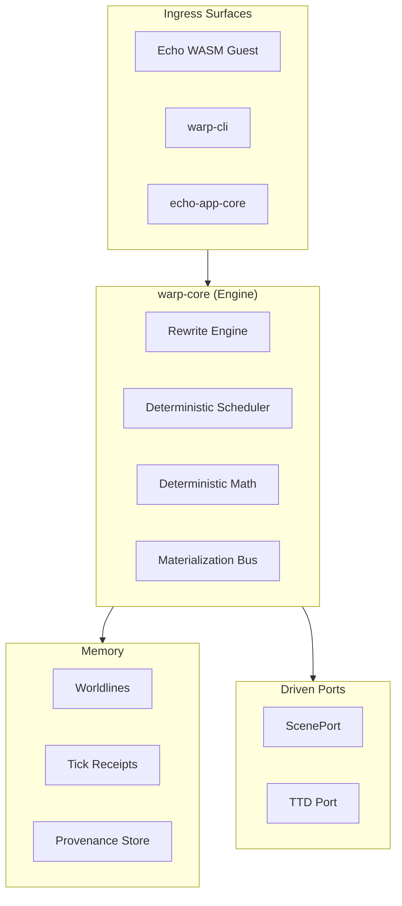

<!-- SPDX-License-Identifier: Apache-2.0 OR LicenseRef-MIND-UCAL-1.0 -->
<!-- © James Ross Ω FLYING•ROBOTS <https://github.com/flyingrobots> -->

# ARCHITECTURE

Echo is an industrial-grade graph-rewrite simulation engine organized around a strict Hexagonal (Ports and Adapters) architecture and the WARP graph substrate.

## System Shape

Echo is the `hot` runtime within the larger Continuum platform. It is optimized for deterministic execution, parallel rule processing, and high-fidelity replay.

## Core Tenets

- **Structural Determinism**: Concurrency is structurally prevented by the snapshot-delta-merge model. Same rules + same hashes = same result.
- **WARP Substrate**: State is a typed, directed multigraph. Time is a hash chain of ticks.
- **Genealogy of Reality**: Every state transition traces back to a causal receipt. Provenance is a first-class citizen.
- **0-ULP Inevitability**: Cross-platform math convergence is enforced for consensus/default execution paths at the binary level; standard floats are excluded there, and wall-clock time is not part of state transition semantics.

## Internal Pipeline (Hot Path)

The Echo tick loop is a deterministic sequence:

1. **Snapshot**: Capture the current immutable WARP graph state.
2. **Execute**: Run rewrite rules in parallel. Each rule reads the snapshot and writes to a private delta.
3. **Merge**: Merge deltas in canonical order. Conflict detection occurs via footprint enforcement.
4. **Commit**: Finalize the tick as a cryptographic commit in the worldline hash chain.
5. **Emit**: Project changes to driven ports (Scene, TTD, Materialization Bus).

## WARP: Structural Worldline Memory

Echo uses **WARP Graphs**—a worldline algebra for recursive provenance.

- **Ticks**: Lamport clock values on a worldline.
- **Receipts**: Per-operation provenance from a materialized tick.
- **Strands**: Speculative causal lanes for counterfactual exploration.

---

**The goal is inevitability. Every state transition is a provable consequence of its causal history.**
