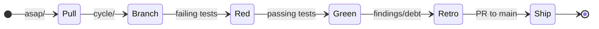

<!-- SPDX-License-Identifier: Apache-2.0 OR LicenseRef-MIND-UCAL-1.0 -->
<!-- © James Ross Ω FLYING•ROBOTS <https://github.com/flyingrobots> -->

# METHOD

The Echo work doctrine: A backlog, a loop, and honest bookkeeping.

## Principles

- **The agent and the human sit at the same table.** Both matter. Both are named in every design.
- **Determinism is binary.** A system is either deterministic or it is not. Tests prove the inevitability.
- **The filesystem is the database.** A directory is a priority. A filename is an identity. Moving a file is a decision.
- **Process is calm.** No sprints or velocity theater. A backlog tiered by judgment, and a loop for doing it well.

## Structure

| Signpost              | Role                                                |
| :-------------------- | :-------------------------------------------------- |
| **`README.md`**       | Public front door and project identity.             |
| **`GUIDE.md`**        | Orientation and productive-fast path.               |
| **`BEARING.md`**      | Current direction and active tensions.              |
| **`VISION.md`**       | Core tenets and the causal mission.                 |
| **`ARCHITECTURE.md`** | Authoritative structural reference.                 |
| **`CONTINUUM.md`**    | Platform memo: hot/cold split and shared contracts. |
| **`METHOD.md`**       | Repo work doctrine (this document).                 |

## Backlog Lanes

| Lane              | Purpose                                                     |
| :---------------- | :---------------------------------------------------------- |
| **`asap/`**       | Imminent work; pull into the next cycle.                    |
| **`v0.1.0/`**     | Release-bar blockers for the local contract-host milestone. |
| **`up-next/`**    | Queued after `asap/`, outside the release-bar lane.         |
| **`cool-ideas/`** | Uncommitted experiments.                                    |
| **`bad-code/`**   | Technical debt that must be addressed.                      |
| **`inbox/`**      | Raw ideas.                                                  |

`v0.1.0/` is a milestone lane, not an automatic priority override. Move a
release-blocking card into `asap/` only when it becomes the current pull.

## The Cycle Loop

1. **Pull**: Move an item from `backlog/asap/` to `docs/design/`.
2. **Branch**: Create `cycle/<cycle_id>-<slug>`.
3. **Red**: Write failing tests. Playback questions become specs.
4. **Green**: Make them pass. Fix determinism drift (DIND).
5. **Retro**: Document findings and follow-on debt in the cycle doc.
6. **Ship**: Open a PR to `main`. Update `BEARING.md` and `CHANGELOG.md` after merge.

## Naming Convention

Backlog and cycle files follow: `<ID>-<slug>.md` or `<LEGEND>-<slug>.md`
Example: `RE-017-byte-pipeline.md`
