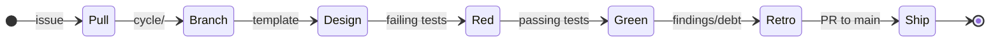

<!-- SPDX-License-Identifier: Apache-2.0 OR LicenseRef-MIND-UCAL-1.0 -->
<!-- © James Ross Ω FLYING•ROBOTS <https://github.com/flyingrobots> -->

# METHOD

The Echo work doctrine: A backlog, a loop, and honest bookkeeping.

## Principles

- **The agent and the human sit at the same table.** Both matter. Both are named in every design.
- **Determinism is binary.** A system is either deterministic or it is not. Tests prove the inevitability.
- **The filesystem is the database.** A directory is a priority. A filename is an identity. Moving a file is a decision.
- **Process is calm.** No sprints or velocity theater. A backlog tiered by judgment, and a loop for doing it well.

## Structure

| Signpost              | Role                                                |
| :-------------------- | :-------------------------------------------------- |
| **`README.md`**       | Public front door and project identity.             |
| **`GUIDE.md`**        | Orientation and productive-fast path.               |
| **`BEARING.md`**      | Current direction and active tensions.              |
| **`VISION.md`**       | Core tenets and the causal mission.                 |
| **`ARCHITECTURE.md`** | Authoritative structural reference.                 |
| **`CONTINUUM.md`**    | Platform memo: hot/cold split and shared contracts. |
| **`METHOD.md`**       | Repo work doctrine (this document).                 |

## Backlog

GitHub Issues are the live backlog. Labels are the index.

| Label                 | Purpose                        |
| :-------------------- | :----------------------------- |
| **`lane:inbox`**      | Unprocessed work or raw ideas. |
| **`lane:asap`**       | Pull into a cycle soon.        |
| **`lane:up-next`**    | Queued after `asap`.           |
| **`lane:cool-ideas`** | Uncommitted experiments.       |
| **`lane:bad-code`**   | Technical debt.                |
| **`lane:release`**    | Release-bar work.              |

Historical filesystem backlog cards are archived under
`docs/method/graveyard/github-issue-migration/`. The `docs/method/backlog/`
directory remains only as a compatibility marker for legacy `cargo xtask
method ...` workspace discovery. Do not add new live work cards there.

## The Cycle Loop

1. **Pull**: Choose a GitHub Issue with Method labels. Create or update a
   design doc under `docs/design/` and link it to the issue.
2. **Branch**: Create a branch named from the issue title, or
   `cycle/<id>-<slug>` when the work is explicitly cycle-shaped.
3. **Design**: Use `docs/method/design-template.md`.
4. **Red**: Write failing tests from the design's playback questions.
5. **Green**: Make them pass. Fix determinism drift with DIND when relevant.
6. **Witness**: Record the reproducible proof.
7. **Retro**: Document drift and follow-on debt.
8. **Ship**: Open a PR to `main`.

Design docs may define intent, but they do not prove implementation. Runtime
and product work must include at least one executable behavior witness such as
Rust API behavior, CLI output, WASM ABI behavior, schema validation, WAL/WSC
recovery, DIND determinism, or generated contract behavior.

## Naming Convention

Issues use readable titles and Method labels. Branches use lowercase slugs of
the issue title unless a cycle id is explicitly assigned.

Design docs use the Echo template at `docs/method/design-template.md`.
