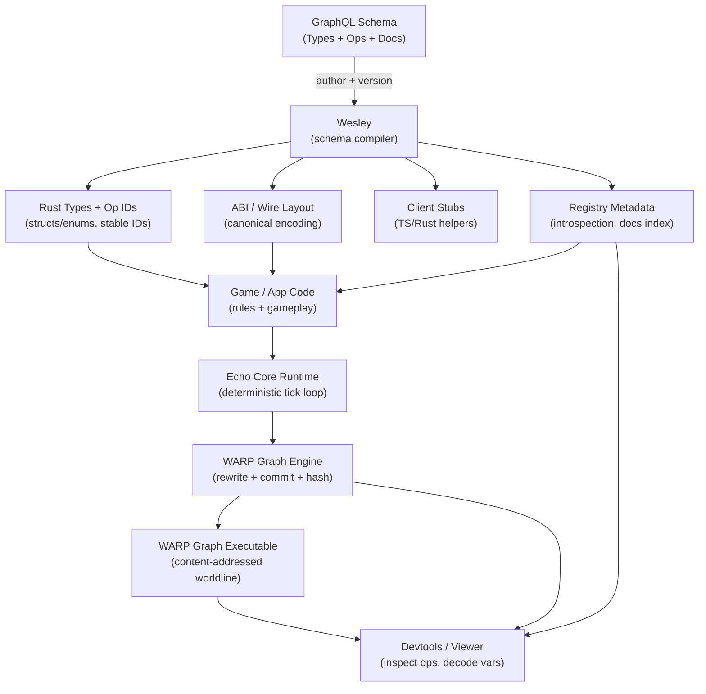

<!-- SPDX-License-Identifier: Apache-2.0 OR MIND-UCAL-1.0 -->
<!-- © James Ross Ω FLYING•ROBOTS <https://github.com/flyingrobots> -->

<p align="center">
  
</p>

<p align="center">
  <strong>State is a graph. Time is a hash chain. Determinism isn't optional.</strong>
</p>

<p align="center">
  <a href="docs/guide/start-here.md">Get Started</a> •
  <a href="docs/architecture-outline.md">Architecture</a> •
  <a href="docs/meta/docs-index.md">Docs</a> •
  <a href="https://github.com/flyingrobots/aion">AIΩN Framework</a>
</p>

<p align="center">
    <a href="https://github.com/flyingrobots/echo/actions/workflows/determinism.yml" ></a>  
    <a href="https://github.com/flyingrobots/echo/actions/workflows/ci.yml" ></a>
    
</p>

---

## What is Echo?

Echo is a **deterministic state machine** where every transition is cryptographically verifiable. Run the same inputs on any machine, get the same hashes. Always.

```text
tick 0 ──hash──► tick 1 ──hash──► tick 2 ──hash──► ...
         │              │              │
         ▼              ▼              ▼
      provable       provable       provable
```

No floating-point drift. No unordered iteration surprises. No "it works on my machine." Just math you can trust.

**Prove it:**

```text
$ cargo xtask dind run
[DIND] Running 50 seeds across 3 platforms...
[DIND] linux-x64:   7f3a9c...d82e1a ✅
[DIND] macos-arm64: 7f3a9c...d82e1a ✅
[DIND] windows-x64: 7f3a9c...d82e1a ✅

Hashes match. Determinism verified.
```

> **Naming:** Echo is the product. WARP is the underlying graph algebra. The `warp-*` and `echo-*` crates are internal modules—same project, different layers.

## Why?

| Problem                                | Echo's Answer                              |
| -------------------------------------- | ------------------------------------------ |
| "Replay diverged after 10,000 ticks"   | Deterministic scheduler + fixed-point math |
| "Which client has the correct state?"  | Compare 32-byte tick hashes                |
| "We can't reproduce that bug"          | Every tick is content-addressed and replayable |
| "Syncing state is expensive"           | Stream diffs, verify hashes, done          |

If you've ever built a game, simulation, or distributed system and wished state had Git-like properties—branches, merges, provable history—that's what we're building.

## Project Status

> [!WARNING]
> **Echo is early. Sharp edges.**
>
> - ✅ **Stable:** Core determinism, hashing, replay invariants
> - ⚠️ **Changing:** Schema/IR, APIs, file formats, viewer protocol
> - ❌ **Not yet:** Nice UX, polished docs, batteries-included examples
>
> If you need a plug-and-play game engine today, this isn't that (yet).
> If you need deterministic, replayable state transitions you can prove, it is.

- `crates/warp-core` — deterministic rewrite engine: canonical scheduling, parallel execution with deterministic results independent of CPU count, snapshot and commit hashing. See [`docs/architecture-outline.md`](docs/architecture-outline.md) for detailed API documentation.
- `crates/warp-geom` — geometry primitives (currently isolated).

### Roadmap

Echo is a high-performance graph rewriting engine written in Rust, designed to run everywhere. All upcoming milestones target Echo-in-the-browser so people can try it out with minimal friction.

1. **WARPSITE**—a website powered by WARP graph rewriting
2. **Splash Guy**—a demo game designed to introduce Echo concepts
3. **Tumble Tower**—a demo game designed to demonstrate Echo's physics determinism

#### Time Travel Debugger + WARPSITE

True, deterministic **Time Travel Debugging** (TTD) is always available by default—not something you have to record or prepare for in advance. Made possible by [WARP graph](https://doi.org/10.5281/zenodo.17908005) [rewriting](https://doi.org/10.5281/zenodo.17963669), each tick's [computational hologram](https://doi.org/10.5281/zenodo.17963669) is captured in an immutable, append-only, tamper-evident ledger. Step backwards to any previous tick, then forward again. Exactly the same every time, bit-for-bit, cryptographically verified. Want to see what *could* have happened? Fork to a different worldline, try something different, then discard it and return to your original timeline.

- Time Travel Debugging (TTD) Part 1—Tick Inspector + Rewind/Jump to Previous Tick (In Progress)
- WARPSITE (In Progress)
- [Wesley](https://github.com/flyingrobots/wesley)—GraphQL-as-schema → Rust/TypeScript Compiler
- TTD Part 2—Fork Worldlines

#### Then: Splash Guy Tutorial Demo

Navigate a grid-based maze and strategically place timed water balloons to clear obstacles and trap opponents in a chaotic bid to be the last one dry. A simple game demo designed to teach Echo concepts.

- Rhai Scripting API
- Graphics
- Input

#### After: Tumble Tower Demo

Carefully extract load-bearing blocks from a precarious tower and place them at the summit without triggering a catastrophic collapse. A block-stacking game that demonstrates deterministic physics.

- Physics Engine
- Collision Resolution

## Quick Tour

```bash
# Install hooks (formats code, runs clippy, checks docs)
make hooks

# Run the test suite
cargo test --workspace

# Run determinism verification
cargo xtask dind run
```

Run `warp-core` with extra delta validation enabled:

```bash
cargo test -p warp-core --features delta_validate
```

```bash
# Launch the viewer
cargo run -p warp-viewer

# Build the docs site
make docs
```

## The Stack



**Core** — `crates/warp-core`

- Graph-rewrite engine with transactional commits
- Deterministic math (fixed-point, PRNG, Vec3/Mat4/Quat)
- **Materialization bus**—order-independent channel for outputs; emitters don't need to coordinate
- **WSC** (Write-Streaming Columnar)—zero-copy snapshot format (mmap-friendly) for fast state reload + verification

**Pipeline** — `crates/echo-session-*`

- Unix socket hub with gapless diff streaming
- WebSocket gateway for browser tools
- Canonical CBOR wire format

**Tools** — `crates/warp-viewer`, `crates/echo-dind-*`

- Native GPU viewer with per-frame hash verification
- **DIND** (Determinism-in-Determinism)—cross-platform test harness that proves hash convergence

## Research Foundation

Echo implements ideas from the **AIΩN Foundations** paper series:

1. [WARP Graphs: A Worldline Algebra for Recursive Provenance](https://doi.org/10.5281/zenodo.17908005)
2. [Canonical State Evolution and Deterministic Worldlines](https://doi.org/10.5281/zenodo.17934512)
3. [Computational Holography & Provenance Payloads](https://doi.org/10.5281/zenodo.17963669)
4. [Rulial Distance & Observer Geometry](https://doi.org/10.5281/zenodo.18038297)

Part of the [AIΩN Framework](https://github.com/flyingrobots/aion).

## Contributing

Determinism is sacred. Before you change anything:

1. Read [`CONTRIBUTING.md`](CONTRIBUTING.md)
2. Run `make hooks` to install the guardrails
3. Write tests. If it's not tested, it's not deterministic.

The codebase enforces:

- No global state (`scripts/ban-globals.sh`)
- No wall-clock time or uncontrolled randomness (`scripts/ban-nondeterminism.sh`)
- No unordered iteration (`scripts/ban-unordered-abi.sh`)

## Requirements

- **Rust** — pinned in `rust-toolchain.toml` (currently 1.90.0)
- **Node.js 18+** — for the docs site (VitePress)

## License

Dual-licensed under Apache 2.0 and MIND-UCAL 1.0. See [`LEGAL.md`](LEGAL.md) for details.

---

<p align="center">
  <sub>Built by <a href="https://github.com/flyingrobots">FLYING•ROBOTS</a></sub>
</p>
