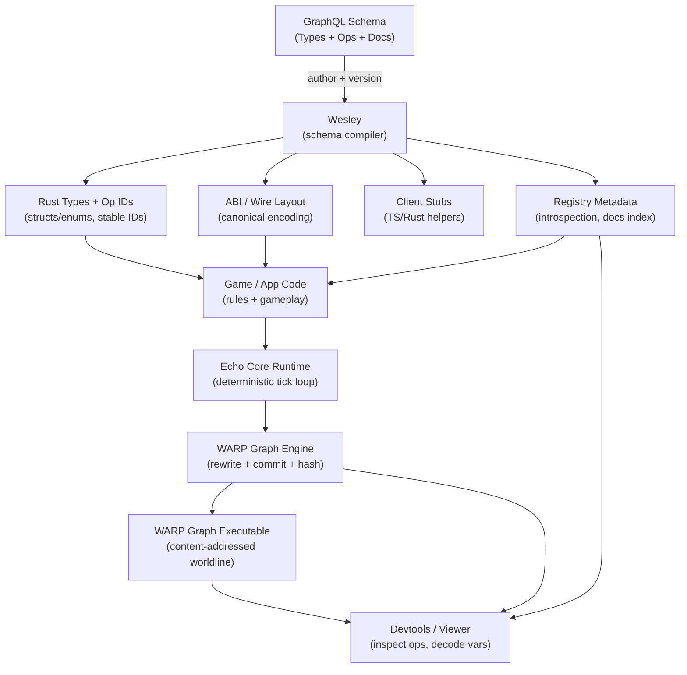

<!-- SPDX-License-Identifier: Apache-2.0 OR MIND-UCAL-1.0 -->
<!-- © James Ross Ω FLYING•ROBOTS <https://github.com/flyingrobots> -->

<p align="center">
  
</p>

<p align="center">
  <strong>State is a graph. Time is a hash chain. Determinism isn't optional.</strong>
</p>

<p align="center">
  <a href="docs/guide/start-here.md">Get Started</a> •
  <a href="docs/architecture-outline.md">Architecture</a> •
  <a href="docs/meta/docs-index.md">Docs</a> •
  <a href="https://github.com/flyingrobots/aion">AIΩN Framework</a>
</p>

<p align="center">
    <a href="https://github.com/flyingrobots/echo/actions/workflows/determinism.yml" ></a>
    <a href="https://github.com/flyingrobots/echo/actions/workflows/ci.yml" ></a>
    
</p>

---

## What is Echo?

Echo is a **deterministic state machine** where every transition is cryptographically verifiable. Run the same inputs on any machine, get the same hashes. Always.

```text
tick 0 ──hash──► tick 1 ──hash──► tick 2 ──hash──► ...
         │              │              │
         ▼              ▼              ▼
      provable       provable       provable
```

No floating-point drift. No unordered iteration surprises. No "it works on my machine." Just math you can trust.

**Prove it:**

```text
$ cargo xtask dind run
[DIND] Running 50 seeds across 3 platforms...
[DIND] linux-x64:   7f3a9c...d82e1a ✅
[DIND] macos-arm64: 7f3a9c...d82e1a ✅
[DIND] windows-x64: 7f3a9c...d82e1a ✅

Hashes match. Determinism verified.
```

> **Naming:** Echo is the product. WARP is the underlying graph algebra. The `warp-*` and `echo-*` crates are internal modules—same project, different layers.

## Why?

| Problem                               | Echo's Answer                                  |
| ------------------------------------- | ---------------------------------------------- |
| "Replay diverged after 10,000 ticks"  | Deterministic scheduler + fixed-point math     |
| "Which client has the correct state?" | Compare 32-byte tick hashes                    |
| "We can't reproduce that bug"         | Every tick is content-addressed and replayable |
| "Syncing state is expensive"          | Stream diffs, verify hashes, done              |

If you've ever built a game, simulation, or distributed system and wished state had Git-like properties—branches, merges, provable history—that's what we're building.

## Project Status

> [!WARNING]
> **Echo is early. Sharp edges.**
>
> - ✅ **Stable:** Core determinism, hashing, replay invariants
> - ⚠️ **Changing:** Schema/IR, APIs, file formats, viewer protocol
> - ❌ **Not yet:** Nice UX, polished docs, batteries-included examples
>
> If you need a plug-and-play game engine today, this isn't that (yet).
> If you need deterministic, replayable state transitions you can prove, it is.

- `crates/warp-core` — deterministic rewrite engine: canonical scheduling, parallel execution with deterministic results independent of CPU count, snapshot and commit hashing. See [`docs/architecture-outline.md`](docs/architecture-outline.md) for detailed API documentation.
- `crates/warp-geom` — geometry primitives (currently isolated).

### Roadmap

Echo is a high-performance graph rewriting engine written in Rust, designed to run everywhere. All upcoming milestones target Echo-in-the-browser so people can try it out with minimal friction.

1. **WARPSITE**—a website powered by WARP graph rewriting
2. **Splash Guy**—a demo game designed to introduce Echo concepts
3. **Tumble Tower**—a demo game designed to demonstrate Echo's physics determinism

#### Time Travel Debugger + WARPSITE

True, deterministic **Time Travel Debugging** (TTD) is always available by default—not something you have to record or prepare for in advance. Made possible by [WARP graph](https://doi.org/10.5281/zenodo.17908005) [rewriting](https://doi.org/10.5281/zenodo.17963669), each tick's [computational hologram](https://doi.org/10.5281/zenodo.17963669) is captured in an immutable, append-only, tamper-evident ledger. Step backwards to any previous tick, then forward again. Exactly the same every time, bit-for-bit, cryptographically verified. Want to see what _could_ have happened? Fork to a different worldline, try something different, then discard it and return to your original timeline.

- ✅ **Worldlines & Playback** (SPEC-0004)—Foundation for TTD: PlaybackCursor, ViewSession, ProvenanceStore
- Time Travel Debugging (TTD) Part 1—Tick Inspector + Rewind/Jump to Previous Tick (In Progress)
- WARPSITE (In Progress)
- [Wesley](https://github.com/flyingrobots/wesley)—GraphQL-as-schema → Rust/TypeScript Compiler
- ✅ **Fork Worldlines** (SPEC-0004)—`LocalProvenanceStore::fork()` prefix-copy implemented

#### Then: Splash Guy Tutorial Demo

Navigate a grid-based maze and strategically place timed water balloons to clear obstacles and trap opponents in a chaotic bid to be the last one dry. A simple game demo designed to teach Echo concepts.

- Rhai Scripting API
- Graphics
- Input

#### After: Tumble Tower Demo

Carefully extract load-bearing blocks from a precarious tower and place them at the summit without triggering a catastrophic collapse. A block-stacking game that demonstrates deterministic physics.

- Physics Engine
- Collision Resolution

## Quick Tour

```bash
# Install hooks (formats code, runs clippy, checks docs)
make hooks

# Run the test suite
cargo test --workspace

# Run determinism verification
cargo xtask dind run
```

Run `warp-core` with extra delta validation enabled:

```bash
cargo test -p warp-core --features delta_validate
```

```bash
# Launch the viewer
cargo run -p warp-viewer

# Build the docs site
make docs
```

## The Stack



**Core** — `crates/warp-core`

- Graph-rewrite engine with transactional commits
- Deterministic math (fixed-point, PRNG, Vec3/Mat4/Quat)
- **Materialization bus**—order-independent channel for outputs; emitters don't need to coordinate
- **WSC** (Write-Streaming Columnar)—zero-copy snapshot format (mmap-friendly) for fast state reload + verification

**Pipeline** — `crates/echo-session-*`

- Unix socket hub with gapless diff streaming
- WebSocket gateway for browser tools
- Canonical CBOR wire format

**Tools** — `crates/warp-viewer`, `crates/echo-dind-*`

- Native GPU viewer with per-frame hash verification
- **DIND** (Determinism-in-Determinism)—cross-platform test harness that proves hash convergence

## Wesley Schema-First Development

Echo uses **Wesley** as a schema-first protocol compiler. The GraphQL schema is the single source of truth for all protocol types, ensuring Rust, TypeScript, and manifests always agree.

### Why Schema-First?

| Traditional Approach           | Wesley Schema-First              |
| ------------------------------ | -------------------------------- |
| Types defined in each language | Types defined once in GraphQL    |
| Manual sync between Rust/TS    | Automatic code generation        |
| Wire format drift over time    | Canonical encoding guaranteed    |
| "Which version is correct?"    | `schema_hash` proves consistency |

### The Golden Rule

> **Never modify generated code. Modify the schema, then regenerate.**

Generated files contain a `SCHEMA_SHA256` (Rust) or `SCHEMA_HASH` (TypeScript) constant. If you see these in a file, it was generated by Wesley and should not be edited by hand.

### Where Things Live

| Path                           | Purpose                                                    |
| ------------------------------ | ---------------------------------------------------------- |
| `schemas/ttd-protocol.graphql` | Source of truth for TTD protocol types (**lives in Echo**) |
| `crates/ttd-protocol-rs/`      | Generated Rust types (**DO NOT EDIT**)                     |
| `packages/ttd-protocol-ts/`    | Generated TypeScript types (**DO NOT EDIT**)               |
| `crates/ttd-manifest/`         | Generated JSON manifests (**DO NOT EDIT**)                 |
| `docs/wesley/wesley.lock`      | Provenance tracking (commit SHA + schema_hash)             |

### Workflow Commands

**Sync generated artifacts from Wesley:**

```bash
cargo xtask wesley sync
```

This command:

1. Runs Wesley's `compile-ttd` on the schema
2. Copies manifest files to `crates/ttd-manifest/`
3. Copies TypeScript files to `packages/ttd-protocol-ts/`
4. Generates Rust types via `echo-ttd-gen` to `crates/ttd-protocol-rs/`
5. Updates `docs/wesley/wesley.lock` with provenance info

**Verify artifacts are up-to-date:**

```bash
cargo xtask wesley check
```

This command verifies that vendored artifacts match the Wesley commit recorded in `wesley.lock`. CI runs this check automatically; pre-commit hooks also run it.

### Schema Hash Consistency

Every generated artifact embeds the same `schema_hash`. This hash **must match** across:

- `ttd-protocol-rs` (Rust)
- `ttd-protocol-ts` (TypeScript)
- `ttd-browser` WASM module
- `ttd-manifest` JSON files
- `docs/wesley/wesley.lock`

If hashes diverge, run `cargo xtask wesley sync` to realign.

### When Wesley Check Fails

If CI or pre-commit fails the Wesley check:

1. **Someone edited generated code directly** - Revert and edit the schema instead
2. **Schema changed but outputs weren't regenerated** - Run `cargo xtask wesley sync`
3. **Wesley repo moved ahead** - Pull latest Wesley, then sync

### Customizing the Sync

```bash
# Use a different Wesley location
cargo xtask wesley sync --wesley-path /path/to/Wesley

# Use a different schema file
cargo xtask wesley sync --schema schemas/my-protocol.graphql

# Dry run (show what would happen)
cargo xtask wesley sync --dry-run

# Skip Rust generation (only sync manifests + TypeScript)
cargo xtask wesley sync --skip-rust
```

---

## How to Use Echo

This section walks through building a complete application with Echo, from project setup to implementing custom game logic.

### 1. Project Setup

**Add Echo dependencies to your `Cargo.toml`:**

```toml
[dependencies]
warp-core = { path = "../echo/crates/warp-core" }

# Optional: for deterministic fixed-point math (recommended for cross-platform)
[features]
det_fixed = ["warp-core/det_fixed"]
```

**Create a basic engine:**

```rust
use warp_core::{
    make_node_id, make_type_id, Engine, EngineBuilder,
    GraphStore, NodeRecord, SchedulerKind,
};

fn main() {
    // 1. Create the graph store with a root node
    let mut store = GraphStore::default();
    let root = make_node_id("world");
    store.insert_node(root, NodeRecord { ty: make_type_id("world") });

    // 2. Build the engine
    let engine = EngineBuilder::new(store, root)
        .scheduler(SchedulerKind::Radix)  // Deterministic scheduler
        .build();

    // Engine is ready for rules and ticks
}
```

### 2. Understanding the Graph Model

Echo uses a **WARP graph model** where state is represented as:

- **Nodes** - Entities with a type (e.g., "player", "enemy", "item")
- **Edges** - Relationships between nodes (e.g., "player owns item")
- **Attachments** - Data payloads on nodes/edges (position, health, etc.)

```rust
use warp_core::{
    make_node_id, make_edge_id, make_type_id,
    NodeRecord, EdgeRecord, AtomPayload, AttachmentValue,
};

// Create typed identifiers (deterministic hashes from labels)
let player_id = make_node_id("player:1");
let weapon_id = make_node_id("weapon:sword");
let player_type = make_type_id("entity/player");
let weapon_type = make_type_id("entity/weapon");

// Insert nodes
store.insert_node(player_id, NodeRecord { ty: player_type });
store.insert_node(weapon_id, NodeRecord { ty: weapon_type });

// Create an edge (player equips weapon)
store.insert_edge(player_id, EdgeRecord {
    id: make_edge_id("equip:player:1:sword"),
    from: player_id,
    to: weapon_id,
    ty: make_type_id("edge/equips"),
});

// Attach data to a node using Wesley-generated types
use janus_types::Position;  // Generated by Wesley from your schema

let position = Position { x: 100, y: 200, z: 0 };
store.set_node_attachment(
    player_id,
    Some(AttachmentValue::Atom(AtomPayload::new(
        Position::TYPE_ID,
        position.to_canonical_cbor(),
    ))),
);
```

### 3. Defining Custom Types (Schema-First)

With Wesley, you define types in GraphQL schema files. **Never write encode/decode boilerplate by hand.**

**Define your type in the schema:**

```graphql
# In your schema file (e.g., janus/wesley/schema/game-types.graphql)

type Motion @wes_codec(format: "cbor", canonical: true) {
    posX: FixedPoint! # Q32.32 fixed-point for determinism
    posY: FixedPoint!
    posZ: FixedPoint!
    velX: FixedPoint!
    velY: FixedPoint!
    velZ: FixedPoint!
}
```

**Regenerate the types:**

```bash
cargo xtask wesley sync
```

**Use the generated types in your code:**

```rust
use janus_types::Motion;  // Generated by Wesley!

let motion = Motion {
    pos_x: FixedPoint::from_raw(100_000_000),  // Q32.32: represents ~0.023
    pos_y: FixedPoint::ZERO,
    pos_z: FixedPoint::ZERO,
    vel_x: FixedPoint::from_raw(50_000),
    vel_y: FixedPoint::ZERO,
    vel_z: FixedPoint::ZERO,
};

// Encoding is automatic via generated serde impls
let bytes = motion.to_canonical_cbor();

// Decoding is also automatic
let decoded = Motion::from_canonical_cbor(&bytes)?;
```

**Key points:**

- Wesley generates all serialization code - you never write `encode_*` or `decode_*` functions
- The `FixedPoint` scalar provides Q32.32 fixed-point math for cross-platform determinism
- The `@wes_codec` directive ensures canonical encoding (identical bytes across all platforms)
- If you modify the schema, run `cargo xtask wesley sync` to regenerate

### 4. Implementing Graph Rewriters (Rules)

Rules are the heart of Echo - **this is where you write domain logic**. Each rule has:

- **Matcher** - Determines if the rule applies to a given node
- **Executor** - Applies the transformation (emits deltas, not direct mutations)
- **Footprint** - Declares read/write sets for parallel safety

```rust
use warp_core::{
    RewriteRule, PatternGraph, ConflictPolicy, Hash,
    GraphView, NodeId, TickDelta, Footprint,
    NodeSet, AttachmentSet, AttachmentKey, NodeKey,
    WarpOp, AtomPayload, AttachmentValue,
};
use janus_types::Motion;  // Generated by Wesley!

/// Rule that updates entity positions based on velocity
pub fn motion_rule() -> RewriteRule {
    RewriteRule {
        // Deterministic ID from rule name
        id: make_rule_id("motion/update"),
        name: "motion/update",
        left: PatternGraph { nodes: vec![] },

        // Matcher: Does this node have a Motion attachment?
        matcher: |view: GraphView<'_>, scope: &NodeId| -> bool {
            match view.node_attachment(scope) {
                Some(AttachmentValue::Atom(p)) if p.type_id == Motion::TYPE_ID => true,
                _ => false,
            }
        },

        // Executor: Update position by velocity (this is your domain logic!)
        executor: |view: GraphView<'_>, scope: &NodeId, delta: &mut TickDelta| {
            let warp_id = view.warp_id();

            // Read current state using Wesley-generated type
            let Some(AttachmentValue::Atom(payload)) = view.node_attachment(scope) else {
                return;
            };
            let Ok(mut motion) = Motion::from_canonical_cbor(&payload.bytes) else {
                return;
            };

            // Apply physics: pos += vel (your game logic!)
            motion.pos_x = motion.pos_x + motion.vel_x;
            motion.pos_y = motion.pos_y + motion.vel_y;
            motion.pos_z = motion.pos_z + motion.vel_z;

            // Emit the update (don't mutate directly!)
            delta.push(WarpOp::SetAttachment {
                key: AttachmentKey::node_alpha(NodeKey {
                    warp_id,
                    local_id: *scope,
                }),
                value: Some(AttachmentValue::Atom(AtomPayload::new(
                    Motion::TYPE_ID,
                    motion.to_canonical_cbor(),  // Serialization handled by Wesley
                ))),
            });
        },

        // Footprint: Declare what we read/write
        compute_footprint: |view: GraphView<'_>, scope: &NodeId| -> Footprint {
            let warp_id = view.warp_id();
            let key = AttachmentKey::node_alpha(NodeKey {
                warp_id,
                local_id: *scope,
            });

            let mut n_read = NodeSet::default();
            let mut a_read = AttachmentSet::default();
            let mut a_write = AttachmentSet::default();

            n_read.insert_with_warp(warp_id, *scope);
            a_read.insert(key);
            a_write.insert(key);

            Footprint {
                n_read,
                a_read,
                a_write,
                ..Default::default()
            }
        },

        factor_mask: 0,
        conflict_policy: ConflictPolicy::Abort,
        join_fn: None,
    }
}

fn make_rule_id(name: &str) -> Hash {
    let mut hasher = blake3::Hasher::new();
    hasher.update(b"rule:");
    hasher.update(name.as_bytes());
    hasher.finalize().into()
}
```

**Notice:** The only manual code here is the **domain logic** (`pos += vel`). Wesley handles all serialization.

### 5. Registering Rules and Running Ticks

```rust
use warp_core::{Engine, EngineBuilder, GraphStore, make_node_id, make_type_id, NodeRecord};
use janus_types::Motion;  // Generated by Wesley!

fn main() -> Result<(), Box<dyn std::error::Error>> {
    // Setup
    let mut store = GraphStore::default();
    let root = make_node_id("world");
    store.insert_node(root, NodeRecord { ty: make_type_id("world") });

    // Create an entity with motion using Wesley-generated type
    let entity = make_node_id("entity:ball");
    store.insert_node(entity, NodeRecord { ty: make_type_id("entity") });

    let initial_motion = Motion {
        pos_x: FixedPoint::ZERO,
        pos_y: FixedPoint::from_int(100),  // y = 100
        pos_z: FixedPoint::ZERO,
        vel_x: FixedPoint::ZERO,
        vel_y: FixedPoint::from_int(-1),   // vy = -1 (falling)
        vel_z: FixedPoint::ZERO,
    };
    store.set_node_attachment(
        entity,
        Some(AttachmentValue::Atom(AtomPayload::new(
            Motion::TYPE_ID,
            initial_motion.to_canonical_cbor(),
        ))),
    );

    // Build engine and register rules
    let mut engine = EngineBuilder::new(store, root).build();
    engine.register_rule(motion_rule())?;

    // Run simulation
    for tick in 0..100 {
        // Apply rules to all matching nodes
        engine.apply_by_name("motion/update", &entity)?;

        // Commit the tick and get the hash
        let receipt = engine.commit();
        println!("Tick {}: hash={:?}", tick, &receipt.commit_id[..8]);
    }

    Ok(())
}
```

### 6. Command/Intent Pattern

For user input and external events, use the **intent pattern**:

```rust
use warp_core::inbox::{InboxManager, Intent};

// Ingest an intent (user action, network message, etc.)
let intent_bytes = encode_my_intent(MyIntent::Jump { player_id: 1 });
engine.ingest_intent(&intent_bytes)?;

// In your tick loop, dispatch pending intents
loop {
    match engine.dispatch_next_intent()? {
        DispatchDisposition::NoPending => break,
        DispatchDisposition::Consumed { intent_id, handler_matched } => {
            // Intent was processed
        }
    }
}
```

### 7. Snapshot and Verification

Every tick produces a cryptographic hash:

```rust
// Get current snapshot
let snapshot = engine.snapshot();
println!("State root: {:?}", snapshot.hash);

// Compare two engines for determinism
let hash_a = engine_a.snapshot().hash;
let hash_b = engine_b.snapshot().hash;
assert_eq!(hash_a, hash_b, "Engines diverged!");
```

### 8. Parallel Execution

Echo guarantees deterministic results regardless of CPU count:

```rust
// Worker count is configurable
let engine = EngineBuilder::new(store, root)
    .workers(4)  // Or use ECHO_WORKERS env var
    .build();

// Footprints ensure parallel safety:
// - Rules with disjoint footprints run in parallel
// - Rules with overlapping footprints are serialized
// - Final merge is always deterministic
```

### 9. Materialization Channels

For outputs (rendering, audio, network), use the MaterializationBus:

```rust
use warp_core::materialization::{
    make_channel_id, ChannelPolicy, MaterializationBus, ReduceOp,
};

// Create a bus with channels
let mut bus = MaterializationBus::new();
let render_channel = make_channel_id("render:sprites");
bus.register_channel(render_channel, ChannelPolicy::Log);  // Collect all emissions

// Inject into engine
let engine = EngineBuilder::new(store, root)
    .with_materialization_bus(bus)
    .build();

// After commit, read finalized outputs
for frame in engine.finalized_frames() {
    // Process render commands...
}
```

### 10. Testing for Determinism

Echo provides utilities for verifying determinism:

```rust
use warp_core::{EchoConfig, run_pair_determinism, SchedulerKind};

#[test]
fn test_determinism() {
    let cfg_a = EchoConfig::new(
        "serial",
        SchedulerKind::Radix,
        false,
        || make_test_graph(),
        || vec![motion_rule()],
    );

    let cfg_b = EchoConfig::new(
        "parallel",
        SchedulerKind::Radix,
        true,
        || make_test_graph(),
        || vec![motion_rule()],
    );

    // Run both engines and verify hashes match at every step
    run_pair_determinism(&cfg_a, &cfg_b, 1000, |step, engine| {
        engine.apply_by_name("motion/update", &make_node_id("ball")).ok();
        engine.commit();
    }).expect("Determinism check failed");
}
```

### Quick Reference

| Task            | Code                                                              |
| --------------- | ----------------------------------------------------------------- |
| Create node ID  | `make_node_id("player:1")`                                        |
| Create type ID  | `make_type_id("entity/player")`                                   |
| Create edge ID  | `make_edge_id("edge:owns:1:2")`                                   |
| Insert node     | `store.insert_node(id, NodeRecord { ty })`                        |
| Insert edge     | `store.insert_edge(from, EdgeRecord { id, from, to, ty })`        |
| Set attachment  | `store.set_node_attachment(id, Some(AttachmentValue::Atom(...)))` |
| Read attachment | `view.node_attachment(&id)`                                       |
| Register rule   | `engine.register_rule(my_rule())?`                                |
| Apply rule      | `engine.apply_by_name("rule/name", &scope)?`                      |
| Commit tick     | `let receipt = engine.commit();`                                  |
| Get snapshot    | `let snap = engine.snapshot();`                                   |

---

## Research Foundation

Echo implements ideas from the **AIΩN Foundations** paper series:

1. [WARP Graphs: A Worldline Algebra for Recursive Provenance](https://doi.org/10.5281/zenodo.17908005)
2. [Canonical State Evolution and Deterministic Worldlines](https://doi.org/10.5281/zenodo.17934512)
3. [Computational Holography & Provenance Payloads](https://doi.org/10.5281/zenodo.17963669)
4. [Rulial Distance & Observer Geometry](https://doi.org/10.5281/zenodo.18038297)

Part of the [AIΩN Framework](https://github.com/flyingrobots/aion).

## Contributing

Determinism is sacred. Before you change anything:

1. Read [`CONTRIBUTING.md`](CONTRIBUTING.md)
2. Run `make hooks` to install the guardrails
3. Write tests. If it's not tested, it's not deterministic.

The codebase enforces:

- No global state (`scripts/ban-globals.sh`)
- No wall-clock time or uncontrolled randomness (`scripts/ban-nondeterminism.sh`)
- No unordered iteration (`scripts/ban-unordered-abi.sh`)

## Requirements

- **Rust** — pinned in `rust-toolchain.toml` (currently 1.90.0)
- **Node.js 18+** — for the docs site (VitePress)

## License

Dual-licensed under Apache 2.0 and MIND-UCAL 1.0. See [`LEGAL.md`](LEGAL.md) for details.

---

<p align="center">
  <sub>Built by <a href="https://github.com/flyingrobots">FLYING•ROBOTS</a></sub>
</p>
