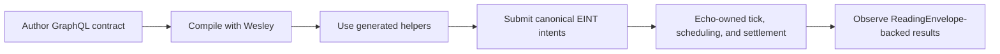
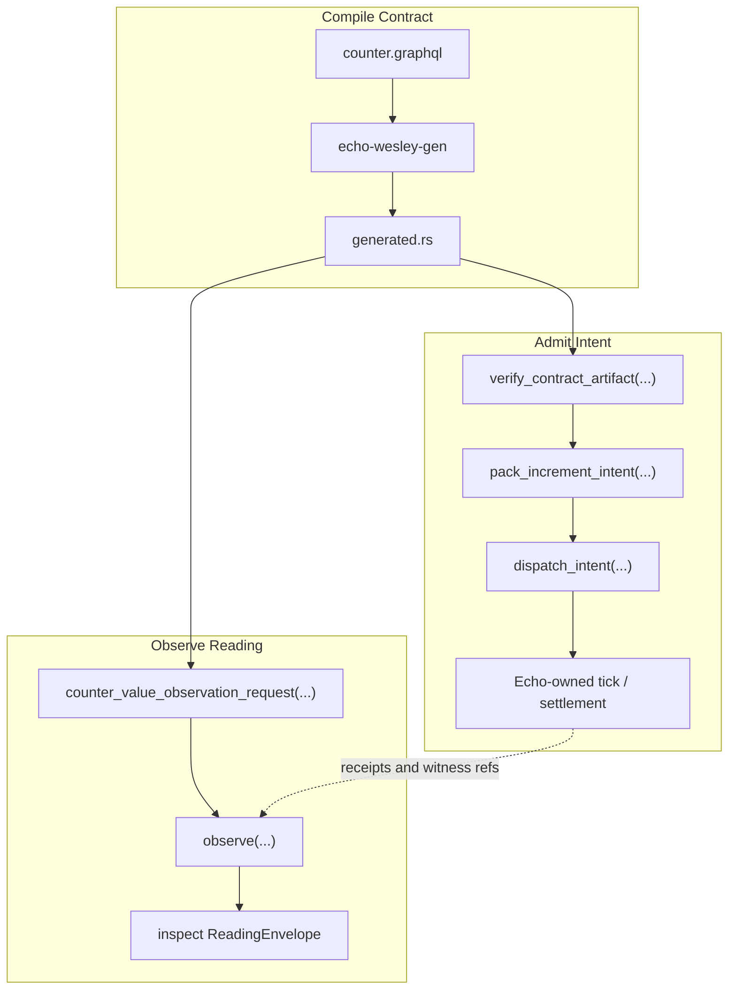

<!-- SPDX-License-Identifier: Apache-2.0 OR LicenseRef-MIND-UCAL-1.0 -->
<!-- © James Ross Ω FLYING•ROBOTS <https://github.com/flyingrobots> -->
<!-- markdownlint-disable MD033 -->

<p align="center">

</p>

<h3 align="center">
  <strong>A deterministic WARP runtime for witnessed causal history, bounded optics, and holographic readings.</strong>
</h3>

<p align="center">
<a href="docs/index.md">Docs</a> •
<a href="docs/architecture/outline.md">Architecture</a> •
<a href="docs/architecture/there-is-no-graph.md">There Is No Graph</a> •
<a href="docs/architecture/continuum-transport.md">Continuum</a> •
<a href="docs/architecture/wsc-verkle-ipa-retained-readings.md">WSC / Verkle / IPA</a> •
<a href="docs/spec/warp-core.md">warp-core</a>
</p>

<p align="center">
<a href="https://github.com/flyingrobots/echo/actions/workflows/determinism.yml"></a>
<a href="https://github.com/flyingrobots/echo/actions/workflows/ci.yml"></a>

</p>

# Echo

Echo is a real-time, deterministic
[WARP optic](https://github.com/flyingrobots/aion) that participates in the
[Continuum protocol](https://github.com/flyingrobots/continuum): a protocol for
exchanging shared, witnessed causal history between distributed peers.

Unlike traditional runtimes that model state as a mutable object graph, Echo
treats witnessed causal history as the immutable source of truth. State is not
the substrate; it is materialized on demand as a lawful, witnessed, replayable
reading over that history. Graph-shaped state is a reading. Files are readings.
Build outputs are readings. Debugger views are readings. Echo exists to govern
the integrity of those views without making any one view the territory.

Echo does this through WARP optics: structured, law-named processes for
observing, transforming, importing, and retaining causal history.

- **Ticking** is an optic that advances a worldline by applying a deterministic
  batch of canonical intents.
- **Braiding** is an optic that merges two or more concurrent strands of
  history under explicit settlement law.
- **Querying** is an optic that materializes a bounded reading for an observer.
- **Admission** is an optic that lawfully incorporates transported history from
  a remote peer.

Because transformations go through lawful optics, Echo can emit computational
holograms: compact, evidence-bearing boundary artifacts that name the causal
basis, law, aperture, identity, posture, witnesses, and retained support needed
to replay or audit a computation. For ticked execution, that support includes
the initial basis and ordered tick receipts or provenance payloads, so Echo does
not need to retain every intermediate materialized state as authoritative truth.

Echo operates in a deterministic cycle: it admits canonical intents, schedules
work, settles speculative paths, emits evidence-bearing receipts for every
transition, serves bounded observations to clients, and retains the minimal
artifacts needed for replay or verification.

You can use Echo to write deterministic real-time simulations, verifiable build
systems, and other applications that demand strong auditability. To get
started, read [Writing An Echo Application](#writing-an-echo-application) and
[Application Contract Hosting](docs/architecture/application-contract-hosting.md).

## Developer Experience

Echo is a participant in a larger architecture for provable determinism. Most
applications do not call Echo with application objects directly. They:


```mermaid
flowchart LR
    contract["Author GraphQL contract"]
    wesley["Compile with Wesley"]
    helpers["Use generated helpers"]
    intents["Submit canonical EINT intents"]
    runtime["Echo-owned tick, scheduling, and settlement"]
    readings["Observe ReadingEnvelope-backed results"]

    contract --> wesley --> helpers --> intents
    intents --> runtime --> readings
```

Echo handles causal admission, scheduling, receipts, witnesses, retention,
replay, and bounded observations. The application owns domain semantics.
Wesley bridges the two by turning authored contracts into generated Echo-facing
surfaces.

### 1. Declare A Contract

The developer journey starts with GraphQL SDL that names the application's
data, operations, readings, and law metadata. GraphQL is the authoring surface,
not Echo's runtime language. Data types define the nouns; operation metadata,
footprints, policies, capabilities, and constraints define the verbs and laws
that govern those nouns.

### 2. Compile With Wesley

The [Wesley](https://github.com/flyingrobots/wesley) compiler lowers the
authored contract into generated artifacts that Echo can verify and host:

- type-safe codecs and operation helpers;
- registry metadata, operation ids, and artifact identity;
- footprint certificates and runtime-facing contract metadata.

The checked-in Echo path is Rust-first through
[`echo-wesley-gen`](crates/echo-wesley-gen/README.md). TypeScript and browser
generation should follow the same contract identity, registry,
artifact-verification, and footprint-honesty rules instead of inventing a
parallel Echo API.

### 3. Submit Intents

Applications do not mutate Echo state directly, and they do not decide when
Echo ticks. They submit canonical EINT bytes through `dispatch_intent(...)`.
That call is ingress: it gives Echo causal input and returns dispatch evidence.
It is not an application-owned tick command or a domain mutation RPC.

Echo owns the tick boundary, pending-set order, scheduler, and settlement law.
When Echo reaches a runtime-owned tick boundary, it evaluates pending intents
against installed contract law, footprints, and scheduler constraints, then
emits receipts for what was admitted, staged, pluralized, conflicted, or
obstructed.

### 4. Observe Readings

Clients do not ask Echo for "the state." They ask for a bounded reading from an
explicit basis under an observer plan.

Generated query helpers build `ObservationRequest` values. Echo returns an
`ObservationArtifact` containing payload bytes and a `ReadingEnvelope` naming
the basis, observer, witness references, budget posture, rights posture, and
whether the reading is complete, residual, plural, or obstructed. Application
code decodes the payload only after inspecting that evidence.

## Reader Paths

- **Write an app:** start with
  [Writing An Echo Application](#writing-an-echo-application), then read
  [Application Contract Hosting](docs/architecture/application-contract-hosting.md).
- **Understand the model:** read [WARP And Continuum](#warp-and-continuum),
  [Core Ontology](#core-ontology), and
  [There Is No Graph](docs/architecture/there-is-no-graph.md).
- **Generate contracts:** use
  [echo-wesley-gen](crates/echo-wesley-gen/README.md) with a GraphQL SDL
  contract.
- **Hack the runtime:** start with [Core Crates](#core-crates), then run the
  [Quick Start](#quick-start) checks.
- **Follow retained readings and proofs:** read
  [WSC, Verkle, IPA, And Retained Readings](docs/architecture/wsc-verkle-ipa-retained-readings.md).

## Why It Exists

Traditional systems pretend there is one mutable global state:

```text
program + state -> mutated state
```

That model leaks. It turns concurrency into locks, collaboration into merge
pain, debugging into archaeology, and generated artifacts into "trust me, this
script probably ran."

Echo follows the WARP model instead:

```text
causal basis + optic law + support obligations -> witnessed reading

reading + intent + admission law -> witnessed suffix

witnessed suffix + optic -> new reading
```

The result is not "no state." State-like values still exist everywhere. The
difference is authority: materialized state is a chart, cache, viewport, or
hologram. It is not the territory.

## WARP And Continuum

WARP is the runtime/optic model used here. A WARP optic is a bounded,
law-governed participant over causal history. It can observe, admit, retain,
reveal, import, materialize, or verify readings, but it does not own a canonical
global graph.

Continuum is the compatibility layer between WARP participants. It is not Echo,
not "the Echo protocol," and not a second runtime that owns the truth. It is the
shared transport vocabulary for exchanging enough causal evidence for another
optic to produce a compatible local reading:

- causal suffixes;
- coordinates and frontiers;
- witnesses, receipts, and support obligations;
- hologram and reading boundaries;
- optic, rule, schema, and artifact identifiers.

Echo is one Continuum-speaking WARP participant. `git-warp`, Wesley, Graft,
WARPDrive, `warp-ttd`, and application tools such as `jedit` can also be WARP
participants when they exchange witnessed causal structure instead of pretending
to pass around a privileged graph object.

The payload is not "the graph." The payload is the causal suffix, coordinate,
support, and witness material needed for another optic to construct its own
lawful reading.

## Core Ontology

| Concept            | Meaning in Echo                                                                                                                       |
| ------------------ | ------------------------------------------------------------------------------------------------------------------------------------- |
| **Causal history** | The witnessed substrate: admitted transitions, frontiers, receipts, witnesses, and retained boundary artifacts.                       |
| **WARP optic**     | A bounded, law-named operation over causal history. It may admit, observe, retain, reveal, import, or materialize.                    |
| **Reading**        | An observer-relative artifact emitted from a coordinate, aperture, and projection law.                                                |
| **Hologram**       | A witnessed output carrying enough basis, law, aperture, evidence, identity, and posture to recreate the claim at its declared level. |
| **Witness**        | Evidence that a transition or reading followed from a named basis under a named law.                                                  |
| **Shell**          | A retained boundary artifact such as a tick patch, suffix bundle, provenance payload, or checkpoint base.                             |
| **ReadIdentity**   | The semantic question a retained payload answers. It is intentionally separate from the CAS byte hash.                                |

The front-door architecture note is
[There Is No Graph](docs/architecture/there-is-no-graph.md).

## What Echo Owns

Echo owns the generic hot runtime path:

- canonical intent ingress;
- deterministic scheduling and footprint checks;
- rewrite settlement;
- worldline and provenance retention;
- replayable tick patches;
- Merkle commitments over state and patch boundaries;
- observation artifacts and `ReadingEnvelope` metadata;
- WASM/session boundaries for browser and host integration;
- `echo-cas` retention for bytes, witnesses, receipts, and cached readings.

Echo does **not** own application nouns.

Names like `ReplaceRange`, `JeditBuffer`, `CounterIncrement`,
`RenameSymbol`, or `GraftProjection` belong in authored contracts,
Wesley-generated code, application adapters, or fixtures. They must not become
Echo substrate APIs.

## WARP Runtime Flow

Echo's hot path is deliberately boring:

1. External callers submit canonical intent bytes.
2. Inbox sequencing derives content identity and canonical pending order.
3. Rules propose candidate rewrites with explicit footprints.
4. The scheduler admits a deterministic independent subset.
5. The engine applies admitted rewrites.
6. Echo emits receipts, tick patches, provenance, and hashes.
7. Observation services resolve coordinates and return readings.
8. Retention stores the bytes and witness material needed for replay or
   obstruction.

The point is not to mutate a global graph. The point is to admit and observe
witnessed causal structure through explicit laws.

## Application Contracts

Applications talk to Echo through generated contracts, not app-specific runtime
APIs.

Wesley is the compiler optic for those contracts. Application authors describe
their domain operations and readings in GraphQL SDL; Wesley lowers that
authored contract into generated helpers, registries, codecs, operation ids,
artifact metadata, and footprint certificates. Echo then hosts the generated
contract through generic dispatch and observation boundaries.

Wesley exists because Echo's runtime boundary is intentionally generic. Echo
should not learn what `increment`, `ReplaceRange`, `CounterValue`, or
`JeditBuffer` mean. Generated Wesley code gives applications a typed surface
while preserving Echo's substrate rule:

```text
Application nouns live in contracts.
Echo receives canonical intents and returns witnessed readings.
```

The current shape is:

```text
Application UI
  -> application adapter / Wesley-generated contract client
  -> canonical operation variables
  -> EINT intent bytes
  -> host-owned Echo ingress: dispatch_intent(...)
  -> Echo-owned scheduler tick / settlement
  -> Echo receipts and witness refs
  -> Echo observe(...)
  -> ReadingEnvelope + payload bytes
  -> generated/application decoding
  -> UI
```

The application layer submits canonical bytes and reads observations. It does
not own the scheduler lifecycle or decide when Echo ticks; host/runtime policy
owns that authority.

This is why a serious text editor such as `jedit` can own its rope model,
buffer law, edit-group law, checkpoint policy, and UI behavior while Echo stays
generic. Echo hosts the generated contract, verifies artifact metadata, admits
intents, emits readings, and retains bytes. It does not become a text editor.

See [Application Contract Hosting](docs/architecture/application-contract-hosting.md).

## Writing An Echo Application

The normal authoring loop is contract-first:

1. Author a GraphQL SDL contract in the application repo.
2. Declare operation/read names with `@wes_op`.
3. Declare deterministic access footprints with `@wes_footprint` when the
   operation mutates or observes application state.
4. Run `echo-wesley-gen` to generate Rust contract helpers.
5. Have the host verify the generated registry/artifact metadata.
6. Use generated helpers to pack EINT intent bytes and submit them to Echo
   ingress.
7. Let Echo's runtime-owned tick cycle admit work, emit receipts, retain
   witnesses, and make observations available.
8. Use generated query helpers to build observation requests, then decode and
   present the returned reading in the application after inspecting its
   `ReadingEnvelope`.

The end-to-end shape is:


```mermaid
flowchart TD
    contract["counter.graphql"]
    gen["echo-wesley-gen"]
    generated["generated.rs"]

    verify["verify_contract_artifact(...)"]
    pack["pack_increment_intent(...)"]
    dispatch["dispatch_intent(...)"]
    tick["Echo-owned tick / settlement"]

    request["counter_value_observation_request(...)"]
    observe["observe(...)"]
    envelope["inspect ReadingEnvelope"]

    subgraph compile["Compile Contract"]
        contract --> gen --> generated
    end

    subgraph write["Admit Intent"]
        generated --> verify --> pack --> dispatch --> tick
    end

    subgraph read["Observe Reading"]
        generated --> request --> observe --> envelope
    end

    tick -. "receipts and witness refs" .-> observe
```

A tiny contract looks like this:

```graphql
directive @wes_op(name: String!) on FIELD_DEFINITION
directive @wes_footprint(
    reads: [String!]
    writes: [String!]
) on FIELD_DEFINITION

type CounterValue {
    value: Int!
}

input IncrementInput {
    amount: Int!
}

type Query {
    counterValue: CounterValue! @wes_op(name: "counterValue")
}

type Mutation {
    increment(input: IncrementInput!): CounterValue!
        @wes_op(name: "increment")
        @wes_footprint(reads: ["CounterValue"], writes: ["CounterValue"])
}
```

Generate the Rust contract surface:

```bash
cargo run -p echo-wesley-gen -- --schema counter.graphql --out generated.rs
```

Application code should use generated helpers rather than hand-rolling Echo
wire bytes. Dispatch submits canonical input to Echo; it does not command Echo
to tick. Conceptually:

```rust
let intent = generated::pack_increment_intent(
    &generated::__echo_wesley_generated::IncrementVars {
        input: generated::IncrementInput { amount: 1 },
    },
)?;

let dispatch_response = echo_wasm_abi::kernel_port::KernelPort::dispatch_intent(
    &mut kernel,
    &intent,
)?;
```

Echo's runtime owns the tick cadence, scheduler, settlement, and receipt
emission. For reads, generated query helpers build `ObservationRequest` values.
Echo returns an `ObservationArtifact` containing payload bytes plus a
`ReadingEnvelope`; the application should inspect that envelope before treating
the reading as complete.

Current checked-in generation is Rust-first. TypeScript/browser generation
should follow the same contract identity, registry, artifact-verification, and
footprint-honesty rules rather than inventing a separate Echo API.

### Boundary Vocabulary

- **GraphQL SDL contract:** the application-owned declaration of types,
  operations, reads, and metadata.
- **Wesley:** the compiler optic that lowers the contract into generated Echo
  helpers and registry metadata.
- **EINT:** Echo's canonical intent envelope. Generated helpers pack operation
  variables into this shape.
- **ObservationRequest:** the generic Echo read request produced by generated
  query helpers.
- **ReadingEnvelope:** the evidence wrapper around a returned reading. It names
  basis, observer, projection, witness references, and whether the reading is
  complete, residual, obstructed, or otherwise limited.
- **Artifact verification:** the host check that a generated contract registry
  matches the expected schema, codec, registry version, and certificate
  posture.

## What Not To Put In Echo

Echo is generic substrate. Keep application semantics above the generated
contract boundary.

Do not add:

- app-specific runtime APIs such as `replace_range(...)`,
  `increment_counter(...)`, `rename_symbol(...)`, or `save_buffer(...)`;
- application-owned structs as core Echo state;
- GraphQL execution as Echo's runtime language;
- hand-rolled EINT packing in product code when generated helpers exist;
- jedit, Graft, Wesley, Continuum, or `git-warp` ownership inside Echo core.

The operational anchor is:

```text
big ontology claim: there is no privileged graph
runtime consequence: Echo stores witnessed causal history and serves readings
through explicit dispatch and observation boundaries
```

## jedit Boundary

`jedit` is expected to be a serious Echo consumer, not an Echo submodule.

`jedit` owns:

- rope model and buffer semantics;
- edit group law;
- dirty state and checkpoint policy;
- editor UI and user interaction policy;
- the external text GraphQL contract.

Wesley owns:

- compiling that external GraphQL contract into generated helpers;
- carrying contract identity, schema identity, operation ids, registry
  metadata, and footprint certificates.

Echo owns:

- generic contract hosting;
- intent admission and scheduling;
- receipts, witnesses, and retained bytes;
- contract-aware readings and `ReadingEnvelope` posture.

Echo tests may use generated `jedit` Wesley output as a fixture. Echo should not
author the `jedit` contract or grow text-editor APIs.

## Retained Readings: WSC, Verkle, IPA, CAS

Echo's retained-reading direction is:

```text
WSC   = canonical columnar bytes for a reading or checkpoint
Verkle = authenticated commitment/index over those bytes
IPA   = compact proof mechanism for opening bounded apertures
echo-cas = content-addressed byte retention
```

Short version:

```text
WSC gives us the table.
Verkle gives us the root.
IPA gives us the aperture proof.
echo-cas stores the bytes.
```

Current reality:

- `warp-core` has WSC writing, validation, and borrowed view support.
- `echo-cas` stores opaque bytes by `BLAKE3(bytes)`.
- retained reading identity is intentionally separate from CAS byte identity.

Future direction:

- WSC-backed retained readings and checkpoints;
- Verkle or equivalent authenticated indexes over WSC coordinates;
- IPA or equivalent compact opening proofs for proof-carrying apertures;
- bounded reads that can verify selected rows, chunks, or ranges without
  materializing the full retained reading.

This is future proof infrastructure, not a new ontology. WSC is not truth.
Verkle is not truth. IPA is not storage. CAS is not semantic identity.

See [WSC, Verkle, IPA, And Retained Readings](docs/architecture/wsc-verkle-ipa-retained-readings.md).

## Current Reality

Works today:

- Rust contract generation from GraphQL SDL through `echo-wesley-gen`;
- generated registry metadata and operation descriptors;
- generated footprint certificate constants for `@wes_footprint`;
- host-side contract artifact verification through `echo-registry-api`;
- generic EINT dispatch and observation plumbing;
- WSC writing, validation, inspection, and borrowed views in `warp-core`;
- content-addressed byte retention in `echo-cas`;
- docs and Method backlog tracking for active contract-hosting work.

Designed or in progress:

- TypeScript/browser generator parity;
- generated `jedit` contract fixtures as Echo integration evidence;
- contract-aware receipts and readings with full application identity;
- WSC-backed retained readings and checkpoints;
- Verkle or equivalent authenticated retained-reading indexes;
- IPA or equivalent proof-carrying aperture openings;
- full Continuum interchange across Echo, `git-warp`, Wesley, Graft,
  WARPDrive, and `warp-ttd`.

## Determinism Posture

Echo is built around exact replay and cross-platform convergence.

The runtime treats nondeterminism as an input discipline problem:

- no ambient wall-clock time in admitted simulation law;
- no unseeded randomness inside ticks;
- platform-sensitive math is pinned behind deterministic representations;
- canonical CBOR is used at ABI boundaries;
- footprint declarations constrain parallel work;
- receipts and patches carry the evidence needed for replay and audit.

The slogan is not "parallelism is safe because we hope so." The rule is:

```text
parallel work is admitted only when the runtime can prove the admitted subset
is lawful for the current basis.
```

## Core Crates

| Crate                      | Role                                                                                                     |
| -------------------------- | -------------------------------------------------------------------------------------------------------- |
| `warp-core`                | Hot runtime kernel: worldlines, scheduling, settlement, observation, WSC, receipts, and core WARP state. |
| `echo-wasm-abi`            | Canonical host/runtime DTOs, `KernelPort`, canonical CBOR helpers, observation and dispatch surfaces.    |
| `warp-wasm`                | Browser/JavaScript boundary around the runtime kernel.                                                   |
| `warp-cli`                 | Native CLI for WSC inspection, validation, and runtime support tooling.                                  |
| `echo-registry-api`        | Minimal generic registry boundary for generated application contracts.                                   |
| `echo-wesley-gen`          | Wesley-to-Echo Rust generator for generated DTOs, op ids, registry metadata, and contract helpers.       |
| `echo-cas`                 | Content-addressed byte store. It stores bytes; typed identity lives above it.                            |
| `echo-ttd` / `ttd-browser` | Time-travel/debugging protocol surfaces and browser bridges.                                             |
| `echo-dind-*`              | Cross-platform determinism harnesses and evidence tooling.                                               |

## Quick Start

### Hacking Echo

Install hooks and check the current Method view:

```bash
make hooks
cargo xtask method status --json
```

Run a fast runtime slice:

```bash
cargo xtask test-slice warp-core-smoke
```

Run focused generated-contract checks:

```bash
cargo test -p echo-wesley-gen
cargo test -p echo-registry-api
```

Build the docs:

```bash
pnpm docs:build
```

Run the determinism harness:

```bash
cargo xtask dind run
```

### Generating A Contract

Generate a Rust contract surface from GraphQL SDL:

```bash
cargo run -p echo-wesley-gen -- --schema counter.graphql --out generated.rs
```

Generate to stdout while iterating:

```bash
cargo run -p echo-wesley-gen -- --schema counter.graphql
```

### Inspecting WSC

Inspect a WSC snapshot:

```bash
export SNAPSHOT=/path/to/state.wsc

cargo run -p warp-cli -- inspect "$SNAPSHOT"
cargo run -p warp-cli -- inspect "$SNAPSHOT" --tree
cargo run -p warp-cli -- verify "$SNAPSHOT"
cargo run -p warp-cli -- --format json verify "$SNAPSHOT"
```

## Documentation Map

- [Docs index](docs/index.md)
- [Current bearing](docs/BEARING.md)
- [Runtime model](docs/architecture/outline.md)
- [There Is No Graph](docs/architecture/there-is-no-graph.md)
- [Continuum Transport](docs/architecture/continuum-transport.md)
- [Application Contract Hosting](docs/architecture/application-contract-hosting.md)
- [echo-wesley-gen CLI](crates/echo-wesley-gen/README.md)
- [WSC, Verkle, IPA, And Retained Readings](docs/architecture/wsc-verkle-ipa-retained-readings.md)
- [warp-core spec](docs/spec/warp-core.md)
- [WASM ABI contract](docs/spec/SPEC-0009-wasm-abi.md)
- [Theory map](docs/theory/THEORY.md)
- [Contributor workflow](docs/workflows.md)

---

<p align="center">
<sub>Built by <a href="https://github.com/flyingrobots">FLYING•ROBOTS</a>.</sub>
</p>
