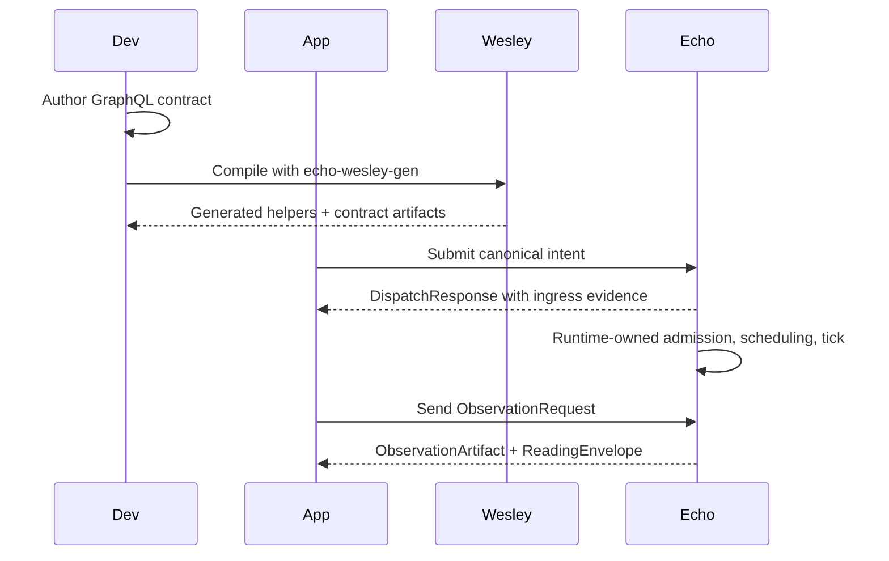

<!-- SPDX-License-Identifier: Apache-2.0 OR LicenseRef-MIND-UCAL-1.0 -->
<!-- © James Ross Ω FLYING•ROBOTS <https://github.com/flyingrobots> -->
<!-- markdownlint-disable MD033 -->

<p align="center">
  
</p>

<p align="center">
  <strong>A deterministic WARP runtime for witnessed causal history, bounded readings, and replayable evidence.</strong>
</p>

<p align="center">
  <a href="docs/index.md">Docs</a>
  &middot;
  <a href="docs/architecture/outline.md">Architecture</a>
  &middot;
  <a href="docs/architecture/there-is-no-graph.md">There Is No Graph</a>
  &middot;
  <a href="docs/architecture/continuum-transport.md">Continuum</a>
  &middot;
  <a href="docs/spec/warp-core.md">warp-core</a>
</p>

> Echo owns time, admission, scheduling, and witnessed causal history so
> application code can stay focused on domain semantics.

# Echo

**Echo** is a deterministic runtime for building applications on witnessed
causal history instead of mutable in-memory state.

Traditional runtimes treat "current state" as the source of truth. Echo does
not. In Echo, the durable territory is admitted causal history: submissions,
frontiers, receipts, witnesses, retained artifacts, and replayable evidence.
State-like things such as files, graphs, UI models, build outputs, debugger
snapshots, and query results are **readings** over that history.

Application code does not mutate Echo state directly, and it does not decide
when Echo ticks. Applications submit canonical intents. Echo admits, schedules,
settles, and executes them at runtime-owned tick boundaries, then emits receipts
and evidence-carrying observations.

## When To Use Echo

| Need                           | Echo Provides                                              | Example Use Cases                                    |
| ------------------------------ | ---------------------------------------------------------- | ---------------------------------------------------- |
| Deterministic execution        | Runtime-owned ticks, admission, scheduling, and settlement | Simulations, engines, structured editors             |
| Replayability and auditability | Witnessed causal history, receipts, and retained artifacts | Build systems, compliance tools, versioned pipelines |
| Evidence-carrying reads        | Payloads wrapped in `ReadingEnvelope` evidence             | Debugging, time travel, proof-carrying data          |
| Law-governed collaboration     | Intent submission over shared causal history               | Multi-user structured editing                        |
| Causal transport               | Witnessed suffix import/export instead of state sync       | Multi-runtime and peer-to-peer systems               |
| Retained readings              | Content retention plus semantic lookup                     | Audit, forensics, replay, "what happened?" analysis  |

## Philosophy: There Is No Graph

Echo is not a graph database. It is not a mutable state server. It is a
deterministic WARP runtime over witnessed causal history.

| Dimension       | Traditional Runtime                    | Echo                                |
| --------------- | -------------------------------------- | ----------------------------------- |
| Source of truth | Mutable in-memory state                | Witnessed causal history            |
| Change model    | Direct mutation                        | Canonical intent submission         |
| Time authority  | Application callbacks, events, threads | Trusted runtime scheduler           |
| Read model      | "Give me current state"                | Bounded reading from explicit basis |
| Read result     | Bare payload                           | Payload plus `ReadingEnvelope`      |
| Distribution    | Replicate state                        | Exchange witnessed causal suffixes  |

**In Echo, causal history is primary. Everything else is derived.**

Read [There Is No Graph](docs/architecture/there-is-no-graph.md) for the deeper
model.

## How It Works

1. Author your domain model as a GraphQL contract.
2. Compile it with Wesley into generated helpers, codecs, and contract
   artifacts.
3. Submit canonical intents through Echo's generic ingress boundary.
4. Echo owns admission, scheduling, ticks, settlement, and execution.
5. Observe results as `ObservationArtifact`s with `ReadingEnvelope` evidence.


```mermaid
sequenceDiagram
    participant Dev
    participant App
    participant Wesley
    participant Echo

    Dev->>Dev: Author GraphQL contract
    Dev->>Wesley: Compile with echo-wesley-gen
    Wesley-->>Dev: Generated helpers + contract artifacts
    App->>Echo: Submit canonical intent
    Echo-->>App: DispatchResponse with ingress evidence
    Echo->>Echo: Runtime-owned admission, scheduling, tick
    App->>Echo: Send ObservationRequest
    Echo-->>App: ObservationArtifact + ReadingEnvelope
```

## Contracts And Boundaries

Echo core is intentionally generic. Application nouns belong in authored
contracts and generated adapters, not in the runtime kernel.

- You define nouns, operations, and queries in GraphQL.
- You use Wesley directives such as `@wes_op` and `@wes_footprint` to describe
  operation identity and deterministic footprint claims.
- Wesley generates type-safe helpers, codecs, registry metadata, and host
  adapters.
- Echo verifies and hosts those artifacts through stable generic boundaries.

```graphql
type Mutation {
    increment(input: IncrementInput!): CounterValue!
        @wes_op(name: "increment")
        @wes_footprint(reads: ["CounterValue"], writes: ["CounterValue"])
}
```

## Core Guarantees

- **Runtime-owned time**: application code cannot tick Echo or choose scheduler
  boundaries.
- **Deterministic execution**: ticks, admission, handler dispatch, and
  settlement are scheduler-owned.
- **Evidence-first observations**: readings carry basis, observer, witness,
  budget, rights, and residual posture.
- **Replayable history**: submissions, receipts, witnesses, and retained
  artifacts are structured for audit and replay.
- **Domain separation**: Echo core stays generic; application semantics live in
  contracts.
- **Continuum-oriented transport**: Echo is built for witnessed causal suffix
  exchange, not blind state synchronization.

## Determinism, Ticks, And The Scheduler

Echo enforces determinism by narrowing every application action into explicit,
canonical evidence before the scheduler can act on it:

- application input enters as canonical EINT bytes, not ad hoc callbacks;
- Wesley-generated contract metadata names operation ids, codecs, and
  footprint claims;
- Echo-owned admission decides whether submitted work can become scheduler
  work;
- the scheduler drains eligible work in deterministic order under explicit
  conflict and footprint rules;
- handlers run only during scheduler-owned ticks;
- every committed tick emits receipt evidence that can be replayed and checked.

`dispatch_intent(...)` is ingress. It is not "run this now." A host may run Echo
on a fixed wall-clock cadence or in an until-idle loop, but that cadence is
trusted runtime policy. The semantic tick is a logical scheduler-owned
coordinate, not application timing.

When a tick is attempted, Echo treats it as failure-atomic scheduler work:
lawful conflicts or obstructions become receipt evidence, while internal
runtime faults roll back uncommitted writes and quarantine the affected lane
instead of silently retrying forever.

## What Echo Owns vs. What You Own

Echo owns:

- causal history, frontiers, and runtime coordinates;
- admission, scheduling, ticks, and settlement;
- receipts, witnesses, reading envelopes, and retained artifacts;
- bounded observation machinery;
- generic contract hosting and suffix import/export surfaces.

You own:

- domain semantics;
- product policy and UI;
- authored GraphQL contracts;
- generated contract helpers and host integrations.

## Quick Start For Contributors

```bash
make hooks
cargo xtask method status
cargo xtask test-slice warp-core-smoke
cargo xtask dind run
```

## Benchmarks And Gates

Echo treats determinism and performance as executable claims, not aspirations.
CI includes deterministic math guards, materialization determinism, DIND replay
checks, decoder security tests, reproducible WASM builds, rustdoc warnings,
clippy lanes, and criterion-based performance regression gates.

Scheduler benchmarks live in
[Scheduler Performance](docs/benchmarks/scheduler-performance-warp-core.md).
Run them locally with:

```bash
cargo bench -p warp-benches
```

## Key Crates

- `warp-core`: deterministic runtime kernel
- `echo-wasm-abi`: public ABI and wire DTOs
- `echo-wesley-gen`: Wesley contract helper generator
- `echo-cas`: content-addressed retention and semantic lookup
- `echo-ttd`: time-travel and playback tooling

## Onramps

- Building applications:
  [Application Contract Hosting](docs/architecture/application-contract-hosting.md)
- Understanding the model:
  [There Is No Graph](docs/architecture/there-is-no-graph.md)
- Core runtime details: [warp-core spec](docs/spec/warp-core.md)
- Causal transport: [Continuum Transport](docs/architecture/continuum-transport.md)
- Documentation map: [Docs](docs/index.md)

## Status

Echo has a working deterministic kernel, installed contract hosting, witnessed
intent submission, scheduler-owned execution, observation envelopes, semantic
retention, suffix transport surfaces, and playback tooling.

The current `v0.1.0` goal is narrower and practical: make Echo a usable local
deterministic contract host. Ongoing work focuses on durable submission
persistence, product-facing intent outcome APIs, reference host loops, retained
evidence polish, release-grade quickstarts, and deeper Continuum integration.

Built by [FLYING ROBOTS](https://github.com/flyingrobots).
