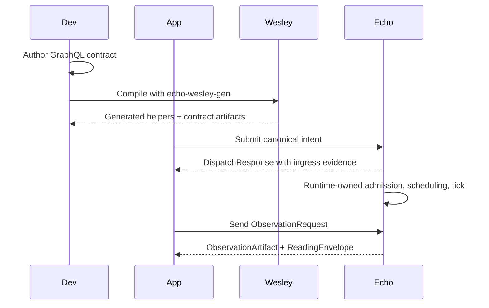

<!-- SPDX-License-Identifier: Apache-2.0 OR LicenseRef-MIND-UCAL-1.0 -->
<!-- © James Ross Ω FLYING•ROBOTS <https://github.com/flyingrobots> -->
<!-- markdownlint-disable MD033 -->

<p align="center">
  
</p>

<p align="center">
  <strong>State is a reading. Echo makes readings lawful, witnessed, and replayable.</strong>
</p>

<p align="center">
  <a href="docs/README.md">Docs</a>
  &middot;
  <a href="docs/architecture/outline.md">Architecture</a>
  &middot;
  <a href="docs/architecture/there-is-no-graph.md">There Is No Graph</a>
  &middot;
  <a href="docs/architecture/continuum-transport.md">Continuum</a>
  &middot;
  <a href="docs/spec/warp-core.md">warp-core</a>
</p>

> Echo owns time, admission, scheduling, and witnessed causal history so
> application code can stay focused on domain semantics.

# Echo

**Echo** is a deterministic runtime for building applications on witnessed
causal history instead of mutable in-memory state.

Traditional runtimes treat "current state" as the source of truth. Echo does
not. In Echo, the durable territory is admitted causal history: submissions,
frontiers, receipts, witnesses, retained artifacts, and replayable evidence.
State-like things such as files, graphs, UI models, build outputs, debugger
snapshots, and query results are **readings** over that history.

Application code does not mutate Echo state directly, and it does not decide
when Echo ticks. Applications submit canonical intents. Echo admits, schedules,
settles, and executes them at runtime-owned tick boundaries, then emits receipts
and evidence-carrying observations.

## A Concrete Problem

Consider a collaborative editor, game simulation, build graph, or contract host
where two users submit work at nearly the same time. Most systems answer with a
mutable object, a lock, a queue, or a best-effort conflict handler. After the
fact, you may have logs, database rows, or a materialized file, but you do not
have machine-checkable evidence that the transition was admitted under a named
law from a named causal basis.

Echo starts from the other end. The durable object is the witnessed causal
history. Inputs become canonical intents. Runtime-owned admission decides what
can proceed. The scheduler admits a deterministic independent subset, commits a
tick, and emits receipts. Reads are bounded observations from explicit
coordinates, not informal snapshots of whatever mutable state happens to exist.

## When To Use Echo

| Need                           | Echo Provides                                              | Example Use Cases                                    |
| ------------------------------ | ---------------------------------------------------------- | ---------------------------------------------------- |
| Deterministic execution        | Runtime-owned ticks, admission, scheduling, and settlement | Simulations, engines, structured editors             |
| Replayability and auditability | Witnessed causal history, receipts, and retained artifacts | Build systems, compliance tools, versioned pipelines |
| Evidence-carrying reads        | Payloads wrapped in `ReadingEnvelope` evidence             | Debugging, time travel, proof-carrying data          |
| Law-governed collaboration     | Intent submission over shared causal history               | Multi-user structured editing                        |
| Causal transport               | Witnessed suffix import/export instead of state sync       | Multi-runtime and peer-to-peer systems               |
| Retained readings              | Content retention plus semantic lookup                     | Audit, forensics, replay, "what happened?" analysis  |

## Philosophy: There Is No Graph

Echo is not a graph database. It is not a mutable state server. It is a
deterministic WARP runtime over witnessed causal history.

| Dimension       | Traditional Runtime                    | Echo                                |
| --------------- | -------------------------------------- | ----------------------------------- |
| Source of truth | Mutable in-memory state                | Witnessed causal history            |
| Change model    | Direct mutation                        | Canonical intent submission         |
| Time authority  | Application callbacks, events, threads | Trusted runtime scheduler           |
| Read model      | "Give me current state"                | Bounded reading from explicit basis |
| Read result     | Bare payload                           | Payload plus `ReadingEnvelope`      |
| Distribution    | Replicate state                        | Exchange witnessed causal suffixes  |

**In Echo, causal history is primary. Everything else is derived.**

Read [There Is No Graph](docs/architecture/there-is-no-graph.md) for the deeper
model.

## Boundary Vocabulary

| Term              | Meaning In Echo                                          |
| ----------------- | -------------------------------------------------------- |
| Intent            | Canonical proposed work from an application or adapter   |
| Admission law     | The named rule that decides whether work can proceed     |
| Footprint         | Declared read/write support used for conflict checks     |
| Tick              | Runtime-owned logical commit boundary                    |
| Receipt           | Machine-checkable outcome evidence for admitted work     |
| Reading           | Bounded observation over causal history                  |
| `ReadingEnvelope` | Evidence wrapper for where a reading came from           |
| WARP optic        | Lawful projection from explicit basis and aperture       |
| Witnessed suffix  | Causal-history exchange unit, not state synchronization  |
| Retained artifact | Durable evidence or reading payload by semantic identity |

## How It Works

1. Author your domain model as a GraphQL contract.
2. Compile it with Wesley into generated helpers, codecs, and contract
   artifacts.
3. Submit canonical intents through Echo's generic ingress boundary.
4. Echo owns admission, scheduling, ticks, settlement, and execution.
5. Observe results as `ObservationArtifact`s with `ReadingEnvelope` evidence.


```mermaid
sequenceDiagram
    participant Dev
    participant App
    participant Wesley
    participant Echo

    Dev->>Dev: Author GraphQL contract
    Dev->>Wesley: Compile with echo-wesley-gen
    Wesley-->>Dev: Generated helpers + contract artifacts
    App->>Echo: Submit canonical intent
    Echo-->>App: DispatchResponse with ingress evidence
    Echo->>Echo: Runtime-owned admission, scheduling, tick
    App->>Echo: Send ObservationRequest
    Echo-->>App: ObservationArtifact + ReadingEnvelope
```

## Contracts And Boundaries

Echo core is intentionally generic. Application nouns belong in authored
contracts and generated adapters, not in the runtime kernel.

- You define nouns, operations, and queries in GraphQL.
- You use Wesley directives such as `@wes_op` and `@wes_footprint` to describe
  operation identity and deterministic footprint claims.
- Wesley generates type-safe helpers, codecs, registry metadata, and host
  adapters.
- Echo verifies and hosts those artifacts through stable generic boundaries.

```graphql
type Mutation {
    increment(input: IncrementInput!): CounterValue!
        @wes_op(name: "increment")
        @wes_footprint(reads: ["CounterValue"], writes: ["CounterValue"])
}
```

## Core Guarantees

- **Runtime-owned time**: application code cannot tick Echo or choose scheduler
  boundaries.
- **Deterministic execution**: ticks, admission, handler dispatch, and
  settlement are scheduler-owned.
- **Evidence-first observations**: readings carry basis, observer, witness,
  budget, rights, and residual posture.
- **Replayable history**: submissions, receipts, witnesses, and retained
  artifacts are structured for audit and replay.
- **Domain separation**: Echo core stays generic; application semantics live in
  contracts.
- **Continuum-oriented transport**: Echo is built for witnessed causal suffix
  exchange, not blind state synchronization.

## Determinism, Ticks, And The Scheduler

Echo enforces determinism by narrowing every application action into explicit,
canonical evidence before the scheduler can act on it:

- application input enters as canonical EINT bytes, not ad hoc callbacks;
- Wesley-generated contract metadata names operation ids, codecs, and
  footprint claims;
- Echo-owned admission decides whether submitted work can become scheduler
  work;
- the scheduler drains eligible work in deterministic order under explicit
  conflict and footprint rules;
- handlers run only during scheduler-owned ticks;
- every committed tick emits receipt evidence that can be replayed and checked.

`dispatch_intent(...)` is ingress. It is not "run this now." A host may run Echo
on a fixed wall-clock cadence or in an until-idle loop, but that cadence is
trusted runtime policy. The semantic tick is a logical scheduler-owned
coordinate, not application timing.

When a tick is attempted, Echo treats it as failure-atomic scheduler work:
lawful conflicts or obstructions become receipt evidence, while internal
runtime faults roll back uncommitted writes and quarantine the affected lane
instead of silently retrying forever.

## What Echo Owns vs. What You Own

Echo owns:

- causal history, frontiers, and runtime coordinates;
- admission, scheduling, ticks, and settlement;
- receipts, witnesses, reading envelopes, and retained artifacts;
- bounded observation machinery;
- generic contract hosting and suffix import/export surfaces.

You own:

- domain semantics;
- product policy and UI;
- authored GraphQL contracts;
- generated contract helpers and host integrations.

## FAQ

### Is This Just Git?

Close enough to be useful, but not close enough to be correct. Git got the
most important thesis right: history is the authority. A Git commit is not a
diff applied to mutable state. It is a node in a witnessed causal graph that can
be replayed, audited, and verified.

Git fixes three things that Echo generalizes.

First, Git fixes the reading. Its causal history is over filesystem snapshots,
and its normal optic is "a directory of files at a commit." Echo's causal
history is over arbitrary admitted transitions. A reading might be a document,
a counter, a game state, a build artifact, or a semantic projection of a
GraphQL contract. The optic is authored. Git's optic is fixed.

Second, Git does not have runtime admission law. Anything can be committed.
Merge conflicts are surfaced to a human who resolves them outside the system.
There is no footprint check, deterministic independent subset, or receipt that
proves the merge was lawful under a named rule. Echo admits intents under
explicit law, checks footprints, and emits machine-verifiable receipts.

Third, Git reads are not structured observations. Checking out a commit
materializes files, but the checkout does not carry an observer, aperture,
basis, support posture, or witness envelope. Echo's readings name their
coordinate, law, basis, aperture, and evidence posture.

The one-line version: Git is a WARP optic with one aperture, no runtime
admission law, and no structured reads. It proved the thesis. WARP generalized
it.

### Is This Git For Anything?

No. "Git for anything" sounds like a storage layer with a broader substrate,
which misses the core point. The substrate difference is not the interesting
part. Admission law is.

Git records that someone committed something. Echo asks whether a transition is
lawful at a frontier under explicit rules. The scheduler proves the admitted
subset is independent before applying it. It emits a receipt that says what was
admitted, what was rejected or obstructed, and why. That lawfulness lives inside
the runtime instead of being assumed outside it.

The second missing piece is structured observation. Git's read is checkout.
Echo's read names a coordinate, a law, an aperture, and the support that must
travel with the result. The reading is bounded and can be wrong in detectable
ways.

So this is not a logging framework with branches. Echo is a runtime where
lawfulness is a first-class runtime property.

### Is This A Blockchain?

No. Blockchains and Echo both use append-only witnessed history. That is the
overlap.

Blockchains are built to solve Byzantine consensus: getting parties who do not
trust each other to agree on a shared ledger without a central authority. Proof
of work, proof of stake, global replication, and economic incentives all follow
from that problem.

Echo assumes cooperative participants under known law. There is no token, no
mining, no global validator set, and no adversarial consensus layer. Echo
witnesses are evidence that a transition followed from a named basis under a
named rule, not proof that anonymous validators agreed.

A blockchain's history is primarily a trust protocol. Echo's history is a
computation substrate for replayable, verifiable work.

### Is This Event Sourcing?

Event sourcing appends domain events and rebuilds state by replaying them.
That is a close cousin, but the authority is still usually a privileged
aggregate or materialized object. Replay is a recovery strategy.

Echo does not treat the log as a backup for an aggregate. Causal history is the
territory. Readings are derived under explicit observation law, and transitions
are admitted under explicit admission law. Receipts and witnesses are part of
the runtime contract, not an audit feature bolted on later.

### Is This The Actor Model?

No. Actors pass messages and mutate private state. That is still a mutable
state-machine model. Echo intents may look like messages, but they are not
fire-and-forget calls into private mutable objects. They are admitted under law,
scheduled by the runtime, witnessed, retained, and observed through bounded
readings.

### Is This A Database With Extra Steps?

No. A database makes the current value authoritative and exposes query and
transaction interfaces around it. History, if present, is often an audit log.

Echo makes witnessed causal history authoritative. The "current value" is a
reading derived from that history. That difference changes the guarantees under
failure, concurrency, replay, and debugging.

Use Postgres if you need a mutable relational store with transactions and
queries. Echo is appropriate when exact replay, cross-participant verification,
deterministic parallel admission, or evidence-carrying readings are the point.

### Are Witnesses And Receipts Just Logs?

No. A log line records that code said something. It does not prove that an
operation was lawful.

A receipt in Echo is machine-checkable outcome evidence. It names the candidate
work, the scheduler decision, the causal basis, the rule family, and the
outcome. Witnesses and retained artifacts are part of the evidence graph that
lets a later observer verify where a transition or reading came from.

### Are Readings Just Queries?

No. A normal query asks for the current value of something in a privileged
state store. It usually has no coordinate, aperture, witness basis, rights
posture, residual posture, or proof obligation.

An Echo reading is a lawful, bounded, witnessed observation. It names where it
was taken from, what observer and projection law produced it, what budget or
rights applied, and what evidence travels with the result.

### Does Determinism Mean Single-Threaded?

No. Determinism means the same admitted causal inputs produce the same
observable outputs. Echo can admit independent work in parallel when the
declared footprints prove that the work is safe to run together. Determinism is
an input discipline and admission-law problem, not a mandatory global lock.

### Is This Only For Distributed Systems?

No. Echo's predecessor was a deterministic game-engine runtime. Receipts,
footprint-checked parallelism, replayable ticks, and witnessed readings are
valuable in a single process on one machine. Distribution becomes easier
because the model is explicit about history and evidence, but distribution is
not the reason the model exists.

### How Does This Relate To CRDTs?

CRDTs solve convergence: replicas that receive the same operations eventually
converge. Echo solves lawfulness: transitions are admitted under explicit rules
with evidence. The ideas are complementary. A CRDT merge strategy could be
expressed as an admission law hosted by Echo.

### What Is The Boundary With Normal Tools?

Normal tools should stay normal. WARPDrive is the intended filesystem boundary:
a mounted path looks like a directory to editors, shells, IDEs, and formatters.
Reads are materialized readings. Writes become candidate intents. Echo remains
authoritative underneath without requiring every tool to learn Echo's model.

### Is Echo Production-Ready?

No. See [Current Reality](#current-reality). The kernel and several evidence
surfaces are working, but the current target is a usable local deterministic
contract host, not a general production platform.

### Who Is Echo For?

Echo is for runtime engineers, compiler authors, tool builders, and systems
architects who have hit the wall on mutable-state models and need exact replay,
lawful admission, or evidence-carrying observations. It is not a drop-in web
backend, a CRUD framework, or a better database.

### How Do I Debug With Echo?

Debugging is forensics over evidence. Because admitted transitions produce
receipts and readings carry witness posture, you can ask how a reading became
possible and trace it through named causal evidence instead of searching logs
for coincidental text.

### How Does Schema Evolution Work?

Contract identity, schema identity, operation ids, and generated helper
identity are explicit in Wesley output. A schema change produces new contract
artifact identity. Old readings name the schema and operation identity they
used, so multiple contract versions can coexist without silently invalidating
old receipts.

### Where Should Contributors Start?

Start with `warp-core` and read
[There Is No Graph](docs/architecture/there-is-no-graph.md) before changing
runtime boundaries. Echo core must not grow application nouns such as
`increment_counter`, `save_buffer`, or product-specific APIs. Those belong in
authored Wesley contracts and generated adapters above the runtime boundary.

## Quick Start For Contributors

```bash
make hooks
cargo xtask hello-echo
cargo xtask method status
cargo xtask test-slice warp-core-smoke
cargo xtask dind run
```

## Benchmarks And Gates

Echo treats determinism and performance as executable claims, not aspirations.
CI includes deterministic math guards, materialization determinism, DIND replay
checks, decoder security tests, reproducible WASM builds, rustdoc warnings,
clippy lanes, and criterion-based performance regression gates.

Scheduler benchmarks live in
[Scheduler Performance](docs/benchmarks/scheduler-performance-warp-core.md).
Run them locally with:

```bash
cargo bench -p warp-benches
```

## Key Crates

- `warp-core`: deterministic runtime kernel
- `echo-wasm-abi`: public ABI and wire DTOs
- `echo-wesley-gen`: Wesley contract helper generator
- `echo-cas`: content-addressed retention and semantic lookup
- `echo-ttd`: time-travel and playback tooling

## Onramps

- Building applications:
  [Application Contract Hosting](docs/architecture/application-contract-hosting.md)
- Understanding the model:
  [There Is No Graph](docs/architecture/there-is-no-graph.md)
- Core runtime details: [warp-core spec](docs/spec/warp-core.md)
- Causal transport: [Continuum Transport](docs/architecture/continuum-transport.md)
- Documentation map: [Docs](docs/README.md)

## Current Reality

Echo has a working deterministic kernel, installed contract hosting, witnessed
intent submission, scheduler-owned execution, observation envelopes, semantic
retention, suffix transport surfaces, and playback tooling.

The current `v0.1.0` goal is narrower and practical: make Echo a usable local
deterministic contract host. Ongoing work focuses on durable submission
persistence, product-facing intent outcome APIs, reference host loops, retained
evidence polish, release-grade quickstarts, and deeper Continuum integration.

Built by [FLYING ROBOTS](https://github.com/flyingrobots).
