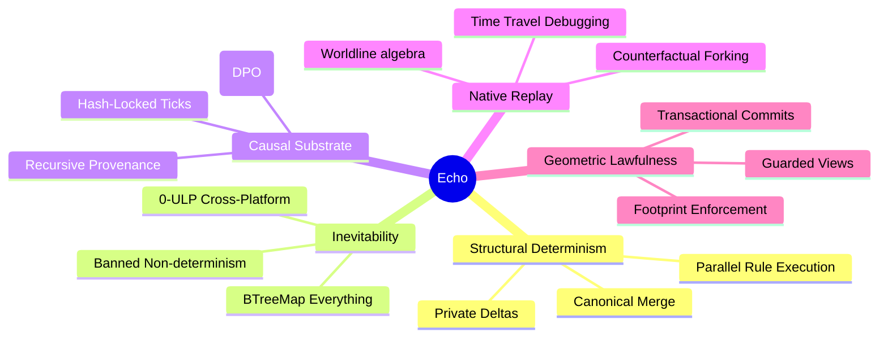

<!-- SPDX-License-Identifier: Apache-2.0 OR LicenseRef-MIND-UCAL-1.0 -->
<!-- © James Ross Ω FLYING•ROBOTS <https://github.com/flyingrobots> -->

# VISION

Echo is a deterministic WARP runtime for witnessed causal history. It owns
admission, scheduler-owned ticks, receipts, readings, and retained evidence so
applications can stay focused on authored domain semantics.



## Core Tenets

### 1. Concurrency is Structural

Echo does not solve the concurrency problem; it structurally prevents it from existing. Rules read from immutable snapshots and write to private deltas. Order-independence is a property of the bedrock, not a side-effect of synchronization.

### 2. Determinism is Binary

A system is either deterministic or it is not. Echo bans the "approximately correct." Identical hashes across Linux, macOS, and Windows are the minimum bar. We ban non-deterministic sources (floats, system time, unseeded randomness) at the pre-commit and CI gates.

### 3. Proof Over Honor

Independency is declared via footprints and enforced at runtime. Footprint guards reject undeclared access, and violations poison deltas. We do not trust the rule-author; we trust the runtime proof.

### 4. Replay as a Substrate Property

Deterministic replay is not a feature you turn on; it is how the engine works. Every tick is a cryptographic commit in a hash chain. Rewind, fork, and diff are inherent capabilities of the worldline algebra.

### 5. Systems Integrity

The engine is built for the systems engineer. Strict lints, panic-free paths (Mr. Clean), and comprehensive determinism drills (DIND) ensure that Echo remains a professional-grade bedrock for causal simulation.

### 6. Product Pressure Proves Release Truth

The `v0.1.0` release is delayed until a real external consumer proves Echo's
local contract-host path. That consumer is `jedit`.

The in-repo external fixture proves generic mechanics; it does not prove that
Echo is ready to build applications with. The release bar is a sibling jedit
checkout that can submit a contract-backed edit intent, let a trusted Echo host
tick, observe the outcome, query a bounded text reading, retain evidence, and
replay the result without granting application code tick authority or moving
editor nouns into Echo core.

This keeps the north star honest:

```text
Application submits intent.
Trusted runtime owns ticks.
Receipts witness decisions.
Readings carry evidence.
External applications prove the seam.
```

---

**The goal is inevitability. Every state transition is a provable consequence of its causal history.**
