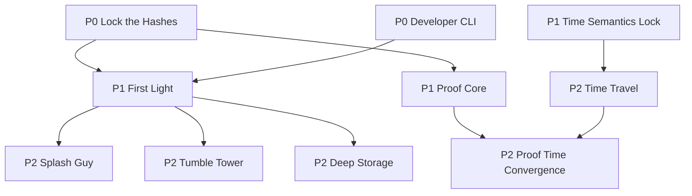

<!-- SPDX-License-Identifier: Apache-2.0 OR MIND-UCAL-1.0 -->
<!-- © James Ross Ω FLYING•ROBOTS <https://github.com/flyingrobots> -->

# Echo Roadmap Index

> Scope: Echo + Wesley + git-mind planning and sequencing.
> Format: ROADMAP index -> milestone README -> feature file (tasks inline).
> Last updated: 2026-02-12

This is the map-of-content (MoC) index for roadmap navigation. Detailed specs live in `docs/ROADMAP/`.

## Execution Policy (The WIP Cap)

To prevent context thrashing, we adhere to a strict WIP limit:

- **Max 2** active milestones at once.
- **Max 3** active feature files per active milestone.
- Everything else is "Queued."

## Dependency DAG

## Priority / Status

| Pri    | Milestone                                                              | Focus                                    | Status      |
| ------ | ---------------------------------------------------------------------- | ---------------------------------------- | ----------- |
| **P0** | **[Lock the Hashes](ROADMAP/lock-the-hashes/README.md)**               | Canonical hash vectors & cleanup         | In Progress |
| **P0** | **[Developer CLI](ROADMAP/developer-cli/README.md)**                   | `verify`, `bench`, `inspect` tools       | Planned     |
| **P1** | **[First Light](ROADMAP/first-light/README.md)**                       | Browser Demo (Website)                   | Planned     |
| **P1** | **[Proof Core](ROADMAP/proof-core/README.md)**                         | Determinism claims _without_ Time Travel | Planned     |
| **P1** | **[Time Semantics Lock](ROADMAP/time-semantics-lock/README.md)**       | Frozen Time Spec (Doc only)              | Planned     |
| **P2** | **[Time Travel](ROADMAP/time-travel/README.md)**                       | Inspector & Rewind Tooling               | Planned     |
| **P2** | **[Proof Time Convergence](ROADMAP/proof-time-convergence/README.md)** | Worldline Convergence                    | Planned     |
| **P2** | **[Splash Guy](ROADMAP/splash-guy/README.md)**                         | Game Demo 1                              | Planned     |
| **P2** | **[Tumble Tower](ROADMAP/tumble-tower/README.md)**                     | Game Demo 2                              | Planned     |
| **P2** | **[Deep Storage](ROADMAP/deep-storage/README.md)**                     | Disk Tier / GC                           | Planned     |

## Milestone Directories

- `docs/ROADMAP/lock-the-hashes/`
- `docs/ROADMAP/developer-cli/`
- `docs/ROADMAP/first-light/`
- `docs/ROADMAP/proof-core/`
- `docs/ROADMAP/time-semantics-lock/`
- `docs/ROADMAP/time-travel/`
- `docs/ROADMAP/proof-time-convergence/`
- `docs/ROADMAP/splash-guy/`
- `docs/ROADMAP/tumble-tower/`
- `docs/ROADMAP/deep-storage/`
- `docs/ROADMAP/backlog/`

## Cross-Project Notes

- Wesley work is grouped into **First Light** because it is upstream of the website demo deliverable.
- git-mind NEXUS is moved to **Backlog** because it is independent of Echo's critical path.
- Proof work is split into **Proof Core** (P1) and **Proof Time Convergence** (P2) to avoid false blocking.

## Issue Matrix

Issue coverage is maintained in `docs/ROADMAP/ISSUE-INDEX.md`.
