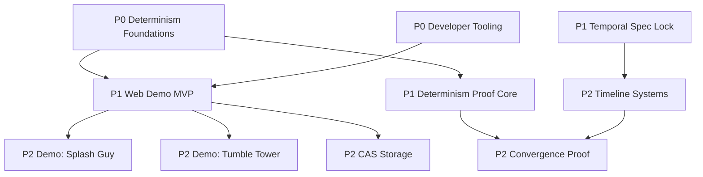

<!-- SPDX-License-Identifier: Apache-2.0 OR MIND-UCAL-1.0 -->
<!-- © James Ross Ω FLYING•ROBOTS <https://github.com/flyingrobots> -->

# Echo Roadmap Index

> Scope: Echo + Wesley + git-mind planning and sequencing.
> Format: ROADMAP index -> milestone README -> feature file (tasks inline).
> Last updated: 2026-02-12

This is the map-of-content (MoC) index for roadmap navigation. Detailed specs live in `docs/ROADMAP/`.

## Execution Policy

- Priority order and dependency order are tracked separately.
- WIP cap: maximum 2 active milestones at once.
- WIP cap: maximum 3 active feature files per active milestone.
- Any work outside WIP caps is queued, not in-progress.

## Dependency DAG

## Priority / Status

| Pri | Milestone                                                            | Features | Est. Hours          | Status      | Blocked By                               |
| --- | -------------------------------------------------------------------- | -------- | ------------------- | ----------- | ---------------------------------------- |
| P0  | [Determinism Foundations](ROADMAP/determinism-foundations/README.md) | 2        | ~20h                | In Progress | —                                        |
| P0  | [Developer Tooling](ROADMAP/developer-tooling/README.md)             | 5        | ~30h                | Not Started | Determinism Foundations                  |
| P1  | [Web Demo MVP](ROADMAP/web-demo-mvp/README.md)                       | 9        | ~90h                | Not Started | —                                        |
| P1  | [Determinism Proof Core](ROADMAP/determinism-proof-core/README.md)   | 3        | ~18h                | Planned     | Determinism Foundations                  |
| P1  | [Temporal Spec Lock](ROADMAP/temporal-spec-lock/README.md)           | 1        | ~6h                 | Planned     | —                                        |
| P2  | [Timeline Systems](ROADMAP/timeline-systems/README.md)               | 3        | ~56h                | Planned     | Temporal Spec Lock                       |
| P2  | [Convergence Proof](ROADMAP/convergence-proof/README.md)             | 1        | ~10h                | Planned     | Determinism Proof Core, Timeline Systems |
| P2  | [Demo: Splash Guy](ROADMAP/demo-splash-guy/README.md)                | 1        | TBD (skeleton ~28h) | Planned     | Web Demo MVP                             |
| P2  | [Demo: Tumble Tower](ROADMAP/demo-tumble-tower/README.md)            | 1        | TBD (skeleton ~45h) | Planned     | Web Demo MVP                             |
| P2  | [CAS Storage](ROADMAP/cas-storage/README.md)                         | 4        | ~45h                | Planned     | Web Demo MVP                             |
| —   | [Backlog](ROADMAP/backlog/README.md)                                 | 13       | ~156h               | Unscheduled | —                                        |

## Milestone Directories

- `docs/ROADMAP/determinism-foundations/`
- `docs/ROADMAP/developer-tooling/`
- `docs/ROADMAP/web-demo-mvp/`
- `docs/ROADMAP/determinism-proof-core/`
- `docs/ROADMAP/temporal-spec-lock/`
- `docs/ROADMAP/timeline-systems/`
- `docs/ROADMAP/convergence-proof/`
- `docs/ROADMAP/demo-splash-guy/`
- `docs/ROADMAP/demo-tumble-tower/`
- `docs/ROADMAP/cas-storage/`
- `docs/ROADMAP/backlog/`

## Cross-Project Notes

- Wesley work is grouped into Web Demo MVP because it is upstream of the website demo deliverable.
- git-mind NEXUS is moved to Backlog because it is independent of Echo's critical path.
- Proof work is split into Determinism Proof Core (P1) and Convergence Proof (P2) to avoid false blocking.

## Issue Matrix

Issue coverage is maintained in `docs/ROADMAP/ISSUE-INDEX.md`.
