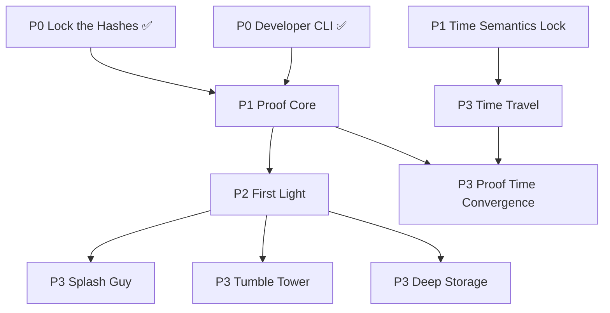

<!-- SPDX-License-Identifier: Apache-2.0 OR LicenseRef-MIND-UCAL-1.0 -->
<!-- © James Ross Ω FLYING•ROBOTS <https://github.com/flyingrobots> -->

# Echo Roadmap

This is the only roadmap entrypoint you should need.

- Use this page to understand current priorities and find the live planning docs.
- Use GitHub Issues / the project board for current execution state.
- Git history is the archive; this page points only at live planning material.

## Status Vocabulary

- `Planned`: scoped, but not active.
- `In Progress`: currently being worked.
- `Verified`: merged and evidenced on `main`.

## Priority Ladder

```mermaid
flowchart TD
  A["P0 Lock the Hashes ✅"] --> D["P1 Proof Core"]
  B["P0 Developer CLI ✅"] --> D
  D --> C["P2 First Light"]
  E["P1 Time Semantics Lock"] --> F["P3 Time Travel"]
  D --> G["P3 Proof Time Convergence"]
  F --> G
  C --> H["P3 Splash Guy"]
  C --> I["P3 Tumble Tower"]
  C --> J["P3 Deep Storage"]
```

## Milestones

| Priority | Milestone              | Status        | Focus                                                              | Live Planning Docs                                                                                                                                                                                                                                                                                                                                                                                                                                                                                                                                                                                                         |
| -------- | ---------------------- | ------------- | ------------------------------------------------------------------ | -------------------------------------------------------------------------------------------------------------------------------------------------------------------------------------------------------------------------------------------------------------------------------------------------------------------------------------------------------------------------------------------------------------------------------------------------------------------------------------------------------------------------------------------------------------------------------------------------------------------------- |
| `P0`     | Lock the Hashes        | `Verified`    | Canonical hash vectors, domain separation, benchmark cleanup       | [domain-separated-hashes.md](ROADMAP/lock-the-hashes/domain-separated-hashes.md), [benchmarks-cleanup.md](ROADMAP/lock-the-hashes/benchmarks-cleanup.md)                                                                                                                                                                                                                                                                                                                                                                                                                                                                   |
| `P0`     | Developer CLI          | `Verified`    | Stable `echo verify` / `bench` / `inspect` workflows               | [cli-scaffold.md](ROADMAP/developer-cli/cli-scaffold.md), [verify.md](ROADMAP/developer-cli/verify.md), [bench.md](ROADMAP/developer-cli/bench.md), [inspect.md](ROADMAP/developer-cli/inspect.md), [docs-man-pages.md](ROADMAP/developer-cli/docs-man-pages.md)                                                                                                                                                                                                                                                                                                                                                           |
| `P1`     | Proof Core             | `In Progress` | Determinism claims, torture harness, trig oracle                   | [determinism-torture.md](ROADMAP/proof-core/determinism-torture.md), [deterministic-trig.md](ROADMAP/proof-core/deterministic-trig.md), [docs-polish.md](ROADMAP/proof-core/docs-polish.md)                                                                                                                                                                                                                                                                                                                                                                                                                                |
| `P1`     | Time Semantics Lock    | `Planned`     | Freeze HistoryTime / HostTime / TTL semantics                      | [time-model-spec.md](ROADMAP/time-semantics-lock/time-model-spec.md)                                                                                                                                                                                                                                                                                                                                                                                                                                                                                                                                                       |
| `P2`     | First Light            | `Planned`     | Browser demo, Wesley pipeline, WASM runtime, browser visualization | [wesley-qir-phase-c.md](ROADMAP/first-light/wesley-qir-phase-c.md), [wesley-migration.md](ROADMAP/first-light/wesley-migration.md), [wesley-go-public.md](ROADMAP/first-light/wesley-go-public.md), [echo-wesley-gen-v2.md](ROADMAP/first-light/echo-wesley-gen-v2.md), [sha256-blake3.md](ROADMAP/first-light/sha256-blake3.md), [wasm-runtime.md](ROADMAP/first-light/wasm-runtime.md), [browser-visualization.md](ROADMAP/first-light/browser-visualization.md), [echo-cas-browser.md](ROADMAP/first-light/echo-cas-browser.md), [wesley-type-pipeline-browser.md](ROADMAP/first-light/wesley-type-pipeline-browser.md) |
| `P3`     | Time Travel            | `Planned`     | Inspector visibility, replay, worldline comparison                 | [streams-inspector.md](ROADMAP/time-travel/streams-inspector.md), [time-travel-mvp.md](ROADMAP/time-travel/time-travel-mvp.md), [rulial-diff.md](ROADMAP/time-travel/rulial-diff.md)                                                                                                                                                                                                                                                                                                                                                                                                                                       |
| `P3`     | Proof Time Convergence | `Planned`     | Worldline convergence suite                                        | [worldline-convergence.md](ROADMAP/proof-time-convergence/worldline-convergence.md)                                                                                                                                                                                                                                                                                                                                                                                                                                                                                                                                        |
| `P3`     | Splash Guy             | `Planned`     | Deterministic networking-first game demo                           | [rules-and-state.md](ROADMAP/splash-guy/rules-and-state.md), [lockstep-protocol.md](ROADMAP/splash-guy/lockstep-protocol.md), [controlled-desync.md](ROADMAP/splash-guy/controlled-desync.md), [visualization.md](ROADMAP/splash-guy/visualization.md), [course-material.md](ROADMAP/splash-guy/course-material.md)                                                                                                                                                                                                                                                                                                        |
| `P3`     | Tumble Tower           | `Planned`     | Deterministic physics game demo                                    | [stage-0-aabb.md](ROADMAP/tumble-tower/stage-0-aabb.md), [stage-1-rotation.md](ROADMAP/tumble-tower/stage-1-rotation.md), [stage-2-friction.md](ROADMAP/tumble-tower/stage-2-friction.md), [stage-3-sleeping.md](ROADMAP/tumble-tower/stage-3-sleeping.md), [lockstep-harness.md](ROADMAP/tumble-tower/lockstep-harness.md), [desync-breakers.md](ROADMAP/tumble-tower/desync-breakers.md), [visualization.md](ROADMAP/tumble-tower/visualization.md), [course-material.md](ROADMAP/tumble-tower/course-material.md)                                                                                                       |
| `P3`     | Deep Storage           | `Planned`     | Disk CAS tier, GC sweep, remote wire protocol                      | [disk-tier.md](ROADMAP/deep-storage/disk-tier.md), [gc-sweep-eviction.md](ROADMAP/deep-storage/gc-sweep-eviction.md), [wire-protocol.md](ROADMAP/deep-storage/wire-protocol.md), [api-evolution.md](ROADMAP/deep-storage/api-evolution.md)                                                                                                                                                                                                                                                                                                                                                                                 |

## Backlog

Unscheduled work that is real but off the critical path:

- [tooling-misc.md](ROADMAP/backlog/tooling-misc.md)
- [security.md](ROADMAP/backlog/security.md)
- [plugin-abi.md](ROADMAP/backlog/plugin-abi.md)
- [signing-pipeline.md](ROADMAP/backlog/signing-pipeline.md)
- [editor-hot-reload.md](ROADMAP/backlog/editor-hot-reload.md)
- [importer.md](ROADMAP/backlog/importer.md)
- [deterministic-rhai.md](ROADMAP/backlog/deterministic-rhai.md)
- [wesley-boundary-grammar.md](ROADMAP/backlog/wesley-boundary-grammar.md)
- [wesley-docs.md](ROADMAP/backlog/wesley-docs.md)
- [wesley-future.md](ROADMAP/backlog/wesley-future.md)
- [ttd-hardening.md](ROADMAP/backlog/ttd-hardening.md)
- [git-mind-nexus.md](ROADMAP/backlog/git-mind-nexus.md)

## Notes

- Proof Core gates First Light.
- Time Semantics Lock gates Time Travel.
- Time Travel plus Proof Core gate Proof Time Convergence.
- First Light gates Splash Guy, Tumble Tower, and Deep Storage.
