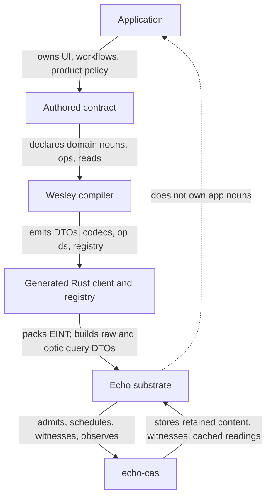
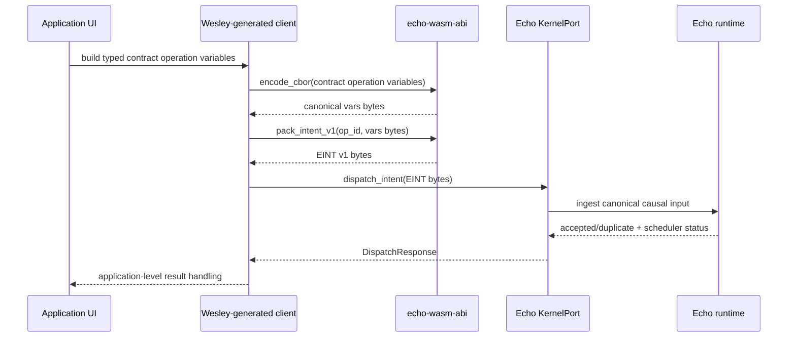
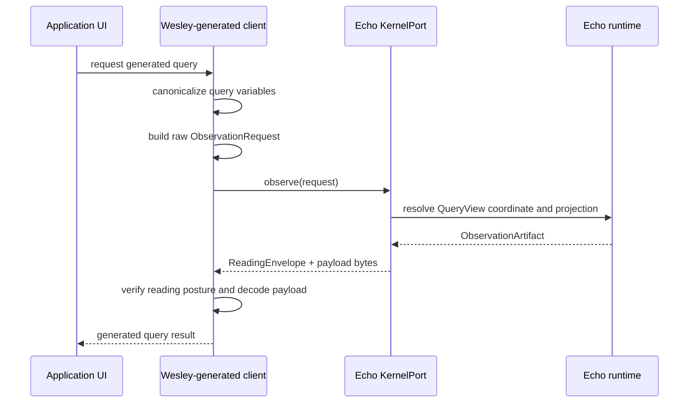
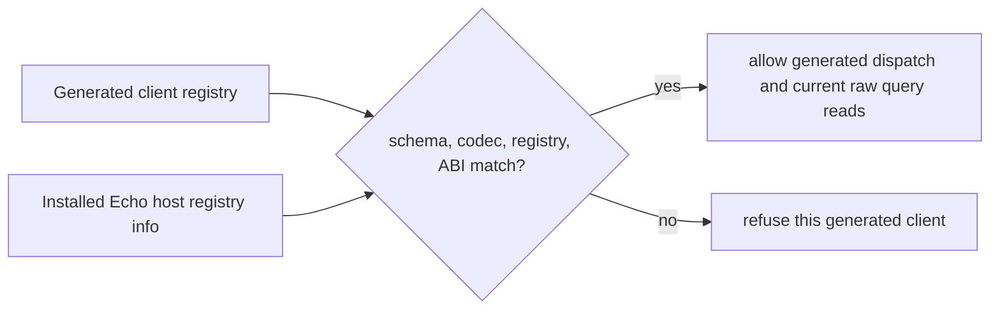
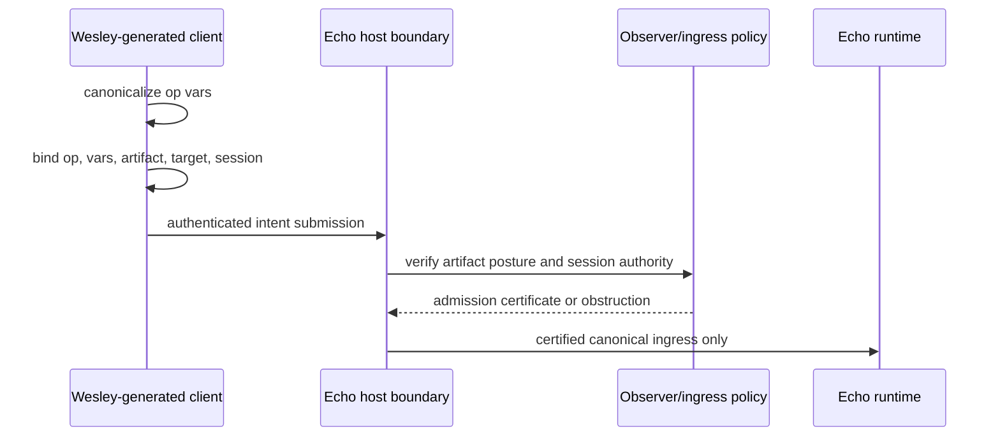
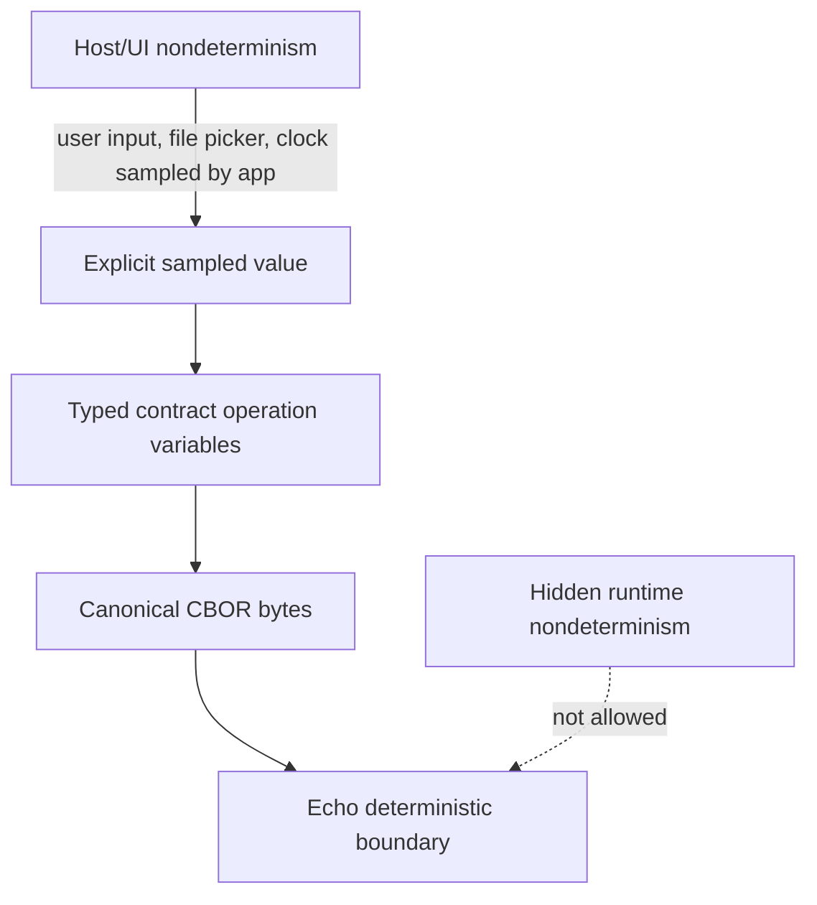
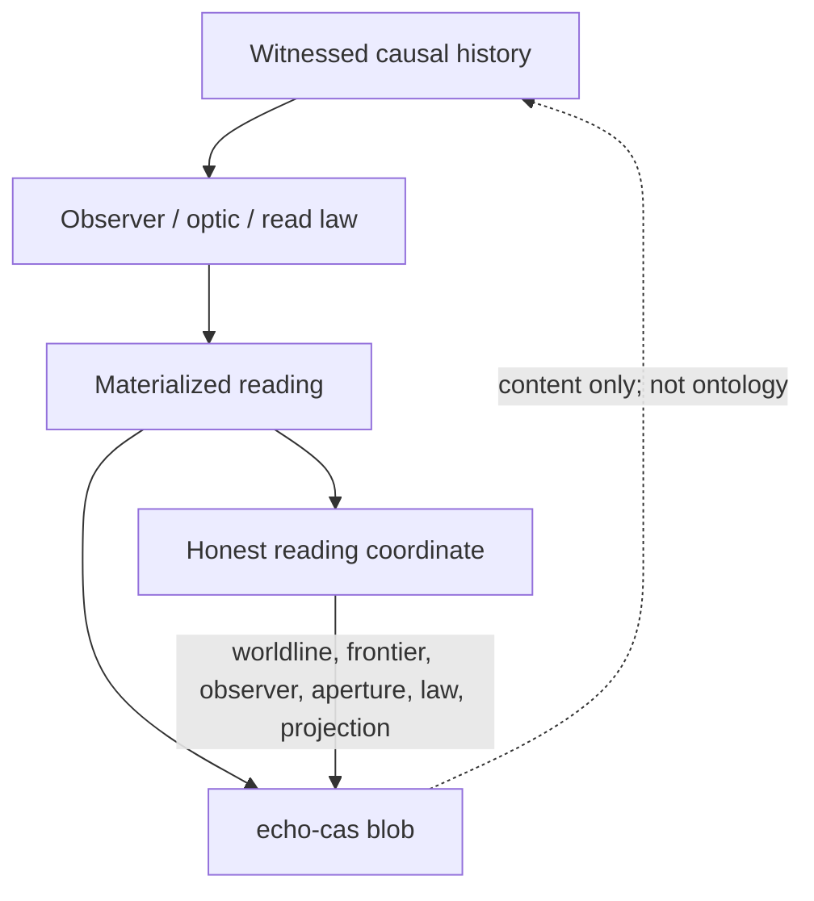

<!-- SPDX-License-Identifier: Apache-2.0 OR LicenseRef-MIND-UCAL-1.0 -->
<!-- © James Ross Ω FLYING•ROBOTS <https://github.com/flyingrobots> -->

# Application Contract Hosting

This page explains how applications use Echo without turning Echo into an
application framework.

Echo is a deterministic witnessed causal substrate. Applications own product
semantics. Wesley compiles authored GraphQL contracts into generated Rust code
that can talk to Echo through generic intent and observation DTOs. A bounded
optic is the product contract shape, but the current generated query execution
path is still the lower-level observation primitive described below.

This is Echo's concrete implementation of the WARP compiler seam: authored
contract nouns lower into generated request helpers and contract-host helpers,
while Echo core remains generic. See the current
[WARP optics](../topics/WarpOptics.md) model for the WARP-paper-to-Echo noun
map.

The current installed-contract query path is:

```text
Application UI / adapter
  -> Wesley-generated contract client
  -> canonical contract operation variables
  -> EINT v1 intent bytes
  -> Echo dispatch_intent(...)
  -> Echo causal ingress, scheduling, admission, receipts
  -> Wesley-generated raw ObservationRequest
  -> Echo observe(...)
  -> ObservationArtifact + ReadingEnvelope
  -> generated/application decoding
  -> UI
```

## Core Rule

Echo must not gain privileged application nouns.

Names such as `ReplaceRange`, `JeditBuffer`, `RenameSymbol`,
`DeadSymbols`, `GraftProjection`, or `CounterIncrement` may appear in authored
contracts, Wesley-generated code, tests for generated families, application
adapters, and product documentation. They must not become Echo substrate APIs.

Echo-owned APIs stay generic:

- dispatch canonical intent bytes;
- observe runtime readings through generic raw and optic-shaped surfaces;
- retain artifacts;
- admit witnessed suffixes;
- settle strands;
- expose receipts, frontiers, readings, and witness references.

Application-authored optics may declare retained consequence obligations, such
as receipt obligations, but they do not create ticks or `TickReceipt` values.
Only trusted runtime control owns tick boundaries.

Current authority for this boundary lives in:

- [Generated rules](../topics/GeneratedRules.md)
- [Runtime authority](../topics/RuntimeAuthority.md)
- [Registry, provider, and host boundary](../adr/0015-registry-provider-host-boundary.md)
- [Generated rule authorship and footprints](../adr/0014-generated-rule-authorship-and-footprints.md)
- [Declarative rule authorship](../invariants/DECLARATIVE-RULE-AUTHORSHIP.md)

## Ownership Split

Echo, contracts, and applications have different jobs.



Echo owns:

- deterministic scheduling;
- basis and frontier handling;
- admission outcome algebra;
- witnessed transition receipts;
- observer-relative reading envelopes;
- witness and retained artifact references;
- `echo-cas` retention policy;
- strand, braid, import, and suffix admission substrate;
- generic ABI entrypoints such as `dispatch_intent(...)`, raw `observe(...)`,
  and the product-shaped `observe_optic(...)` surface.

Contracts own:

- domain nouns;
- domain payload types;
- operation kinds;
- observer or read kinds;
- domain validation;
- domain transition law;
- domain emission law;
- domain-specific reading payloads.

Wesley-generated code owns the typed bridge between those contract nouns and
Echo's generic runtime surfaces. That bridge has two separate faces:

| Surface               | Responsibility                                                          |
| :-------------------- | :---------------------------------------------------------------------- |
| Application helpers   | Build EINT bytes plus raw and optic-shaped query request DTOs.          |
| Contract-host helpers | Install generated mutation handler rules and read-only query observers. |

## External Edict Provider Artifacts

Echo also owns the runtime-specific semantics supplied to Edict's generic
external provider host. That pipeline has a separate source and output boundary:

```text
Echo GraphQL and checked semantic declarations
  -> Echo-Wesley generators
  -> generated lawpack, target profile, split authority facts, schemas,
     review projection, generated-artifact profile, and provenance
  -> provider-owned lowerer and verifier components
  -> #655 generated provider manifest and digest-locked Echo provider package
  -> Edict's runtime-neutral provider host
```

The first checked non-GraphQL source is
[`schemas/edict-provider/echo-provider-semantics-v1.json`](../../schemas/edict-provider/echo-provider-semantics-v1.json).
Its executable schema and pure validator live in
`echo_wesley_gen::provider_semantics`. The source fixes one reviewed
compatibility operation and explicitly records its type family, effect
signature and execution class, typed failure and obstruction
schemas, exhaustive obstruction mapping, full Edict optic profile, budget,
target-owned write-class/native capability, complete manifest resources,
artifact roles, invocation domains, and CDDL roots. Package records use an
Echo-owned alias over the exact Edict Core string coordinate rather than
redefining Core string semantics.

The provider source follows three authority rules:

1. A semantic fact has one stable coordinate, one named authority artifact, and
   one canonical domain.
2. Generated files are projections. A lawpack, profile, facts file, manifest,
   schema, provenance record, or review rendering cannot become input authority.
3. There is no directory or registry search. Runtime SDL and historical
   relocated Wesley SDL do not become fallback authority merely because they
   contain a matching name.

The authority split is structural. The semantic declaration owns the portable
effect, domain obstruction, source mapping, budget, and operation. Target
metadata owns the operation profile and optic template, low-level failure
taxonomy, write-class resolution, native capability, and inner Target IR
selection. An explicit discharge mapping joins target authority to the
lawpack's advisory hint and abstract footprint/cost obligations without making
the two vocabularies identical. The semantic source's invocation/schema
inventory owns the outer provider artifact domain. The validator checks the
joins between those facts and rejects missing mappings, incompatible profiles,
capability/effect disagreement, missing or ambiguous implementations, duplicate
target-profile adapter selectors, recursive types, Core ownership violations,
invalid failure identifiers, incomplete artifact closure, and non-empty payload
mappings that would require generator-authored semantics.

The provider manifest is a #655 package-root output, not a #652 member of its
own artifact list. Two authority-facts documents preserve Edict's one-source
rule: lawpack facts carry budgets, while target-profile facts carry operation
profiles and resolved effect write classes. Their canonical byte contract is
Edict-owned and landed under Edict #157 in Edict PR #159. Generated resource
declarations carry no output digests. Standard Edict resources and the
self-contained provider CDDL are explicit trusted inputs from the Apache-2.0
contract pack merged in Edict PR #162. Echo admits its exact CDDL, manifest,
contract/domain inventories, resource bytes, digests, and provenance before
generation without searching a filesystem, registry, or network. Schema
instance validation is a separate output-admission step: exact
`edict.canonical-cbor/v1` decoding is followed by validation against the named
owning root in that authenticated CDDL. Passing both checks attests provider
artifact shape only. It does not make authority-facts runtime Echo authority,
install a package, admit an operation, or authorize a runtime consequence.

The target-profile lowerer and verifier resources are generated declarative
contract documents. They do not select executable implementations. The package
manifest separately binds the exact provider-owned components and their frozen
WIT world attestations, preserving independent lowerers and component upgrades
without target-profile semantic churn.

The first executable lowerer implements the frozen
`edict:target-provider/lowerer@1.0.0` world as a pure component over explicit
request bytes. It recognizes only the checked mutation closure for local Core
intent `t` (global semantic coordinate `a.b@1.t`) and emits the exact canonical
Target IR bytes produced by Edict's built-in Echo compatibility wrapper. An
effect-free operation is refused as unsupported semantics rather than encoded
as a synthetic mutation. The same fail-closed rule applies to a rebound Core
module, changed operation type binding, or authored Core optic that this first
crossing cannot faithfully discharge. The lowerer authenticates the complete
reviewed Core type-definition map and exact evaluation budget because neither
may disappear or broaden across Target IR projection. It also derives bounded
pre-effect, obstruction-arm, and post-effect local scopes from exactly one input,
one effect-result, and one obstruction declaration. Every local expression must
resolve to one complete compiler-owned identity before the expression is copied.
This first closure admits no input constraints and only the reviewed
zero-argument `domain.WriteRejected` obstruction constructor; non-empty
constraints or a different construction fail closed until their own semantic
crossings are implemented. The complete semantic closure includes the exact
lowerability coordinate as well as its canonical bytes and digest.
The component's protocol instance and request/result aliases are type-only
imports; filesystem, network, environment, clock, randomness, registry,
logging callback, WASI, and every other callable import are forbidden. This
crossing proves translation only. Package admission, installation, invocation,
commitment, observation, and receipt authority remain separate Echo runtime
crossings.

The first executable verifier independently implements the frozen
`edict:target-provider/verifier@1.0.0` world. It compares the exact Core and
Target IR relation under the target profile and ordered semantic inputs rather
than trusting the lowerer's construction. The pinned Edict host preflights the
request artifacts and declared output schema before invoking the checked
verifier. After invocation, it schema-validates each returned accepted or
well-formed rejected report before authoring its manifest. An unsupported
output-role overclaim remains a typed provider refusal with neither response nor
manifest. Independent fresh-store replay and separate host processes reproduce
all three completed outcomes identically. The report binds its named Target IR
reference; the
host-authored manifest separately binds the Core, target profile, Target IR,
semantic inputs, output request, output bytes, and domain-framed output digest.
This crossing proves provider semantic verification and host replay only. It
does not install a package, authorize or execute an operation, observe a
consequence, or mint an Echo receipt.

The package-root projection pins `echo.edict-provider@1` to exact component
world `edict:target-provider@1.0.0`. Generated provenance is a generic Edict
`generationProvenance` package member whose document contract remains owned by
Wesley #728.

The generation invocation itself is a pure Wesley extension input. It binds
the exact Echo semantic-source file, admitted Edict CDDL and manifest, and
versioned generator settings as content-addressed inputs. The first closure has
no GraphQL Shape authority, so its Wesley Shape and root-operation catalog are
empty; the Echo semantic operation is not projected into a synthetic GraphQL
operation. Primary lawpack, target-profile, facts, registration-profile, and
schema roles are selected before provenance. Provenance and review are derived
after primary output digests exist, preventing self-referential digest sets.
Set-like source reordering preserves normalized semantic projections but moves
the exact-source generation-input identity, as honest provenance requires.

Primary provider generation is a pure digest DAG. Echo first emits and
owning-root-validates the declarative resource closure and generated operation
profile, then the target profile, then the lawpack, and finally the two
source-partitioned authority-facts documents. The target profile binds the
generated profile and resource domain digests; the lawpack binds the completed
target-profile digest; authority facts bind their completed source artifact.
No primary artifact binds review or provenance, so the graph has no
self-reference. Wesley content references separately bind exact output bytes.
Neither digest form installs an artifact or turns generated authority facts
into runtime Echo authority.

The derived Wesley provenance manifest binds the exact semantic-source, Edict
CDDL, Edict manifest, settings, and caller-supplied generator component bytes.
Its emitted closure is exactly the five canonical primary artifacts plus the
raw self-contained CDDL. Construction immediately re-verifies all three source
and six output byte identities. The fourteen resource documents remain
transitively covered by the primary manifest DAG; restating them as primary
emissions would misrepresent the projection boundary. The generator API never
discovers an executable, path, environment, process, registry, clock, or
network input. A primary closure retains the exact Wesley input digest that
produced it, so outputs from another invocation cannot be falsely attributed
merely because their role closure matches. The generator coordinate must also
be disjoint from every exact source artifact, declared generated artifact,
resource, provider, and package coordinate.

The deterministic review JSON is Wesley's `GenerationReviewV1`, derived only
after the provenance wrapper has verified exact materials. It copies the input,
provenance, generator, projection roles, sources, and primary emissions for
inspection, but its `authoritative` posture is permanently false. Review does
not become a second contract, provenance proof, package admission, or runtime
authority surface.

The checked provider corpus materializes that digest DAG as exactly 22 files:
five canonical-CBOR primary artifacts, fourteen canonical-CBOR resources, raw
self-contained CDDL, canonical provenance JSON, and canonical review JSON. Its
generator identity is the Wesley digest of a versioned binary frame containing
an explicit compile-time inventory of provider generator source, Cargo
manifests and lockfile, and the pinned Rust toolchain. Authored semantic,
settings, CDDL, and contract-manifest bytes remain separate Wesley inputs, and
generated corpus bytes never re-enter generator identity. The frame therefore
attests the source/dependency-lock closure without claiming a reproducible
executable or creating a circular output digest.

Corpus comparison is an exact-byte, exact-path check. Missing, changed, and
unexpected entries are reported in stable order. Check mode performs no
directory creation, write, deletion, normalization, or symlink traversal;
the caller's `--out` path is an ambient locator, while its final corpus-root
entry and every descendant are opened without following symlinks and retained as
directory capabilities. Generation refuses every unexpected entry it observes
before creating or replacing an expected path and leaves that entry for explicit
operator disposition. Each temporary write, sync, replacement, and failure
cleanup remains relative to the validated parent handle. Unrelated ancestors
used to locate the requested root are outside this capability boundary. This
checked build artifact remains provider evidence. Echo runtime admission and
installation are still separate acts.

The generated operation profile preserves native versus direct-adapter
selection, operation-local obstruction mappings, and the target optic contract.
Invocation posture is derived from admitted optic semantics: mutation-capable
write classes require affect/reintegration, while non-mutating classes require
revelation/projection and remain bounded observers. This rule is generic and
does not encode application- or editor-specific behavior.

The first capability distinguishes two nested domains. `echo.span-ir/v1` is
the inner Echo target IR domain selected by `echo.dpo@1.replace`.
`edict.target-ir.artifact/v1` is the outer canonical artifact domain that
crosses the Edict provider WIT boundary and is validated through the declared
`target-ir-artifact` schema root.

This source contract does not claim that Echo currently executes the declared
replace operation. Runtime mutation, admission, receipts, and presence-sensitive
replace enforcement remain runtime implementation authority and must still be
proven by admitted execution. The completed lowerer and verifier witnesses prove
their translation, semantic-verification, and Edict-host replay crossings only.

Applications own:

- product workflows;
- UI and interaction policy;
- adapters around generated clients;
- application-specific persistence and save/open behavior where applicable;
- decisions about which contract operations to expose to users.

## Vocabulary

Use precise names at the boundary.

**Contract operation variables** are typed helper values generated from a
contract operation. Helper-only types live in the generated helper namespace so
they cannot collide with user contract types. Example:
`__echo_wesley_generated::IncrementVars { input: IncrementInput { amount: 42 } }`.

**Canonical vars bytes** are the deterministic canonical-CBOR encoding of
contract operation variables.

**Raw vars bytes** are bytes that a low-level caller claims are already
canonical. Raw-vars helpers are plumbing surfaces, not the default application
surface.

**EINT v1** is Echo's current intent envelope:

```text
"EINT" || op_id:u32le || vars_len:u32le || vars
```

**ObserveOpticRequest** is the product contract shape. Wesley query helpers can
bind query identity and canonical variables to an explicit causal coordinate,
focus, bounded `QueryBytes` aperture, law versions, budget, and capability.

That DTO is not yet a trusted or executable generated-query boundary. The
current bridge does not verify caller-supplied optic, capability, or law IDs,
and `QueryBytes` returns `UnsupportedProjectionLaw`.

Raw `ObservationRequest` is the lower-level coordinate/frame/projection
primitive used by the current installed-contract query path. It can produce a
QueryView reading, but it does not prove optic capability or law admission and
must not be described as the final product contract.

**Installed contract package** is the registry-verified runtime-owner
installation unit that binds generated registry metadata, schema hash, package
artifact hash, codec identity, supported operation ids, mutation handler rules,
and read-only query observers before those handlers or observers are installed
into `Engine`. Unsupported operation ids, mutation/query kind mismatches,
mutation rule/op-id mismatches, and duplicate package rule identities fail at
this package boundary before the engine mutates.

Direct `native_rule_bootstrap` rule or observer registration remains an internal
fixture and transitional engine-test path. It does not provide package identity,
registry verification, or generated operation/package binding guarantees.

**ReadingEnvelope** is the read-side evidence envelope. It carries observer
plan, basis, witness refs, budget posture, rights posture, and residual,
plural, or obstructed posture. The current family boundary is described by
[WARP optics](../topics/WarpOptics.md) and
[Obstructions](../topics/Obstructions.md).

## Write Path

Applications write to Echo by sending canonical intents.

The application should not hand-roll EINT bytes. It should use generated
contract helpers.



For a toy mutation:

```graphql
mutation increment(input: IncrementInput): CounterValue
```

the generated Rust shape is conceptually:

```rust
let intent = pack_increment_intent(&__echo_wesley_generated::IncrementVars {
    input: IncrementInput { amount: 42 },
})?;
```

The generated helper performs the deterministic boundary work:

```text
__echo_wesley_generated::IncrementVars
  -> encode_cbor(...)
  -> canonical vars bytes
  -> pack_intent_v1(OP_INCREMENT, &vars_bytes)
  -> EINT v1 bytes
```

Echo receives the EINT bytes. Echo does not need to know that the operation was
called `increment` or that the payload contained an `IncrementInput`. That
meaning belongs to the generated contract layer and the application.

## Dispatch Is Synchronous In Code, Not A Domain RPC

`KernelPort::dispatch_intent` is a synchronous Rust trait method:

```rust
fn dispatch_intent(&mut self, intent_bytes: &[u8]) -> Result<DispatchResponse, AbiError>
```

Application dispatch rejects reserved control intents. Runtime owners use a
separate trusted control path for scheduler lifecycle requests before returning
control evidence.

Its semantic boundary is still:

```text
submit canonical causal input
```

It does not mean:

```text
call this application method synchronously and mutate a hidden global state
```

It also does not mean:

```text
create a tick or TickReceipt from application code
```

The application should treat `DispatchResponse` as ingress evidence. It says
whether the intent was newly accepted, names the content-addressed intent id,
and reports scheduler status. It is not a domain-specific result object and it
must not hide app mutation in unrecorded global state.

## Read Path

The product contract shape is a bounded optic, but the two generated query
surfaces have different current behavior:

- `*_observation_request(...)` builds a raw `ObservationRequest`. The installed
  contract host can execute this lower-level QueryView path through
  `KernelPort::observe(...)`.
- `*_observe_optic_request(...)` builds a bounded `ObserveOpticRequest`, but the
  current bridge returns `UnsupportedProjectionLaw` for its `QueryBytes`
  aperture. The bridge also does not verify its optic, capability, or law IDs
  against trusted admission authority.

Therefore this document does not present generated optic queries as a runnable
application path. Raw observation is the current integration primitive, while
the bounded optic remains the product contract shape.

Generated contract-host query observer helpers are separate from application
query request builders. They install read-only host observers behind
`warp-core`'s `ContractQueryObserver` boundary. Those observers receive
read-only context; they do not receive mutable runtime, scheduler control,
`TickDelta`, or write authority.



The current raw query projection uses:

```rust
ObservationProjection::Query {
    query_id,
    vars_bytes,
}
```

The returned artifact is not just data. It preserves:

- resolved coordinate;
- reading envelope and witness/evidence posture;
- declared frame and projection;
- artifact hash;
- payload bytes.

The application must inspect the reading posture before presenting a value as
complete. A reading may be residual, plurality-preserving, budget-limited, or
rights-limited. This lower-level success does not certify the caller-supplied
capability/law posture of a separate optic request.

## Registry Handshake

Applications need to know whether their generated client matches the installed
host.

Echo already exposes registry metadata surfaces:

- `get_registry_info`;
- `get_codec_id`;
- `get_registry_version`;
- `get_schema_sha256_hex`.

Wesley-generated code already exposes generated registry information:

- operation ids;
- `OPS`;
- `op_by_id(...)`;
- enum and object descriptors;
- static `REGISTRY`.

The first handshake is intentionally small:



For the current first-consumer path, generated application code validates the
operation shape and variables before dispatch. Echo validates EINT shape and
reserved control-op usage. Host-side generated-payload validation is deferred
until a RED proves that Echo itself must reject malformed app payloads at the
host boundary.

## Admission Security Ramp

The registry handshake is compatibility evidence, not production security.

Current EINT dispatch proves that Echo can accept canonical contract-shaped
bytes. It does not prove that the submitted intent came from an authenticated
session, that the generated artifact has the required trust posture, or that the
intent is authorized for a target coordinate.

A production Wesley intent needs a stronger pre-tick admission boundary:



The trust ramp should stay explicit:

```text
local dev -> digest verified -> generated tests verified -> CI attested
  -> BLADE certified production profile
```

Holmes, WATSON, Moriarty, generated tests, and BLADE are certification providers
for later production profiles. Echo should model the posture slots and policy
requirements first; it should not treat local development trust as equivalent
to production certification.

Echo must not trust caller-supplied footprint claims. Footprints used for tick
admission must come from a verified Wesley artifact or another explicitly
trusted footprint authority.

## Determinism Boundary

Applications may observe nondeterministic host events. Echo must not let hidden
nondeterminism cross into deterministic execution.

Allowed pattern:

```text
sample outside Echo
  -> make the sampled value explicit contract input
  -> canonicalize it
  -> dispatch it
  -> witness it
```

Forbidden pattern:

```text
contract/runtime execution secretly reads time, random, env, filesystem,
host map iteration order, or other nondeterministic state
```



If an application needs time or randomness, it must turn that value into an
explicit input:

```text
InsertTimestamp { timestamp: fixed value chosen by host }
GenerateId { id: fixed value chosen by host }
UseSeed { seed: fixed value chosen by host }
```

Once sampled and dispatched, the value is part of witnessed causal history. It
is no longer hidden ambient state.

## echo-cas And Cached Readings

`echo-cas` stores content-addressed bytes. It may retain witnesses, payloads,
and cached materialized readings.

CAS content hashes are not semantic truth by themselves. Meaning lives in the
typed coordinate or reference above the CAS blob.

The durable storage and proof boundary is recorded in
[ADR 0020](../adr/0020-retained-reading-storage-and-proof-boundary.md): WSC
supplies deterministic columnar reading bytes, optional verified openings may
support bounded apertures, and `echo-cas` remains content-addressed byte
retention. None of those layers becomes causal or admission authority.



A cached materialized reading is valid only relative to its basis, frontier,
observer, aperture, projection, and law. Cached readings are useful. They are
not the canonical runtime state.

## Browser Or WASM Usage

A browser-hosted application should follow this shape:

1. Load Echo WASM.
2. Initialize or install a kernel.
3. Check registry metadata against the generated client.
4. Use generated Wesley helpers to build typed operation variables.
5. Pack an EINT intent through generated helpers.
6. Call `dispatch_intent(intent_bytes)`.
7. Decode `DispatchResponse`.
8. Use the generated raw query helper to build an `ObservationRequest`.
9. Call `observe(request)` through the current installed-contract query path.
10. Decode `ObservationArtifact`.
11. Inspect the `ReadingEnvelope` evidence posture.
12. Decode payload bytes into generated result types.
13. Render the UI.

For a raw WASM export that accepts bytes, the browser adapter serializes the
`ObservationRequest` at the ABI boundary using its `Serialize` implementation
and canonical CBOR. This is the current runnable query integration, but it is a
lower-level primitive rather than the product contract shape.

Wesley also emits an `ObserveOpticRequest` helper. The current engine returns
`UnsupportedProjectionLaw` for its `QueryBytes` aperture and does not verify its
capability/law identifiers. Browser adapters must preserve that typed
obstruction; they cannot advertise the optic path as an available query API.

The UI can be highly application-specific. The Echo calls remain generic.

## Native Rust Usage

A native Rust consumer can operate against `KernelPort` directly:

```rust
let intent = generated::pack_increment_intent(
    &generated::__echo_wesley_generated::IncrementVars {
        input: generated::IncrementInput { amount: 42 },
    },
)?;

let response = echo_wasm_abi::kernel_port::KernelPort::dispatch_intent(
    &mut kernel,
    &intent,
)?;

let request = generated::counter_value_observation_request(
    worldline_id,
    &generated::__echo_wesley_generated::CounterValueVars {},
)?;

let artifact =
    echo_wasm_abi::kernel_port::KernelPort::observe(&kernel, request)?;
```

The generated names differ by contract. Echo still receives only generic
intent bytes and observation DTOs. This native example uses the current raw
query path and does not claim optic capability/law admission.

## What Echo Does Not Do

Echo does not:

- run GraphQL directly;
- own application domain types;
- expose jedit, text editing, Graft, game, or debugger-specific APIs;
- dynamically load arbitrary contract families yet;
- validate every generated operation payload in core yet;
- decode query result bytes into domain result objects for the application;
- treat cached materialized state as substrate truth.

Those are generated-contract, application, or future host-integration
responsibilities.

## Clean Mental Model


In words:

```text
Application:
  I know what the user wants.

Generated Wesley code:
  I know the contract schema and how to encode/decode operations.

Echo ABI:
  I accept canonical intent bytes and explicit observation DTOs.

Echo runtime:
  I admit, schedule, witness, retain, and observe causal history.

ReadingEnvelope:
  I tell you what kind of reading this was and what evidence posture it has.

Application:
  I decide how to present that reading to the user.
```

For a `jedit`-style application:

```text
jedit owns text/editor semantics.
Wesley compiles those semantics into generated contract types and helpers.
Echo receives canonical intents and emits witnessed readings through the
current raw query path. Generated optic queries remain typed obstructions.
jedit renders buffers, cursors, diffs, diagnostics, history, and UI.
```

Echo gives applications deterministic causal substrate, witnessed ingress,
reading envelopes, product-shaped optic DTOs, registry identity, and retention
hooks. It should not become the application.
