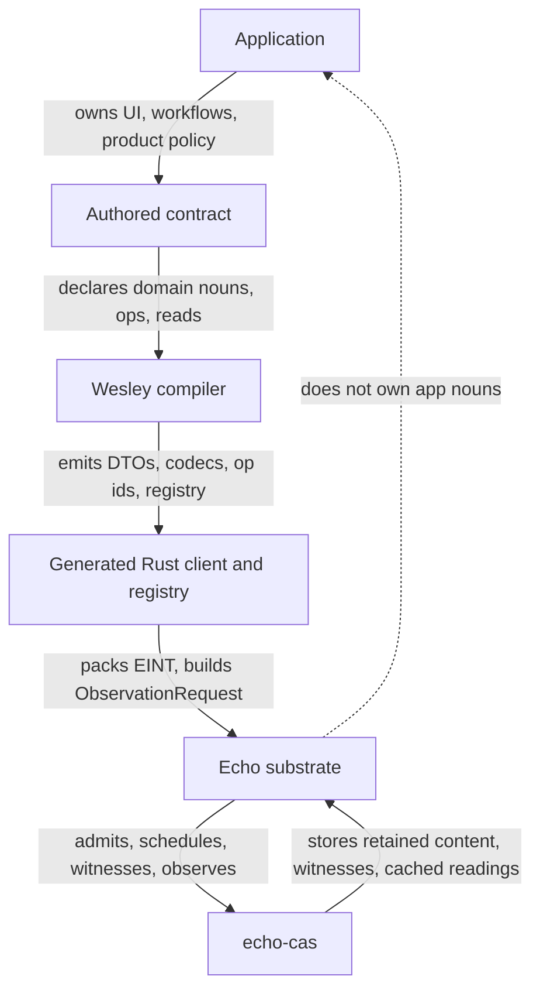
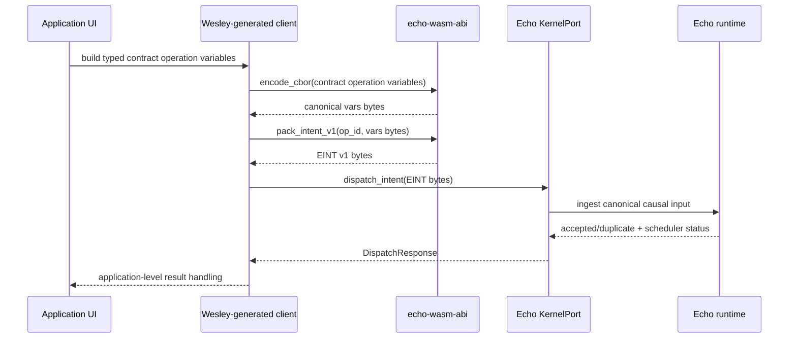
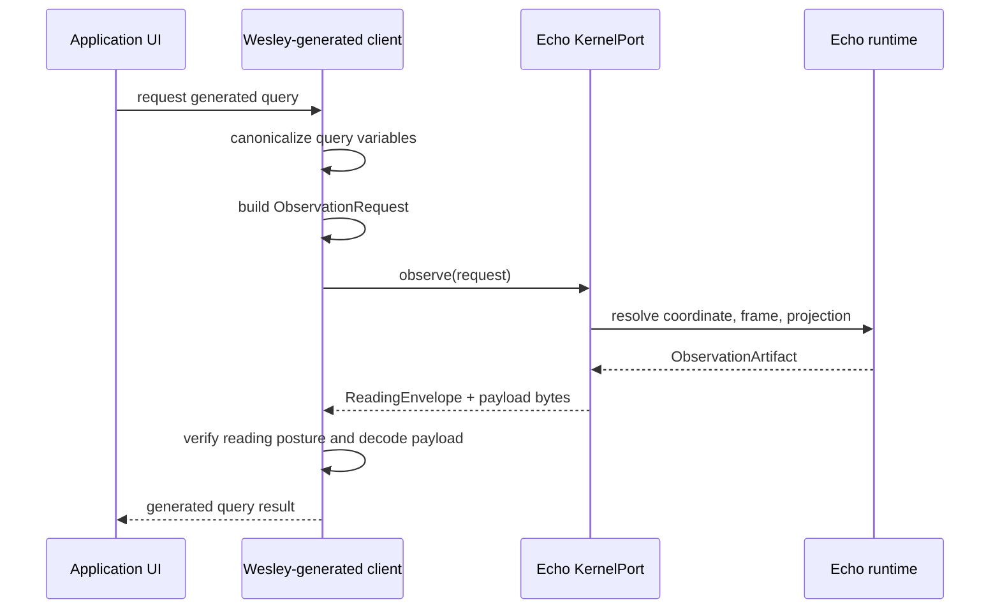
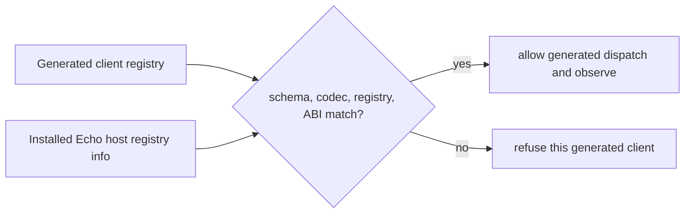
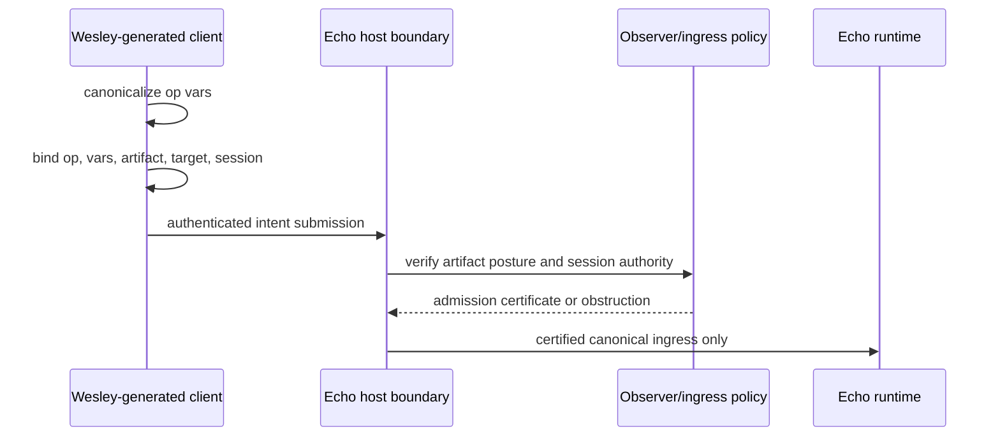
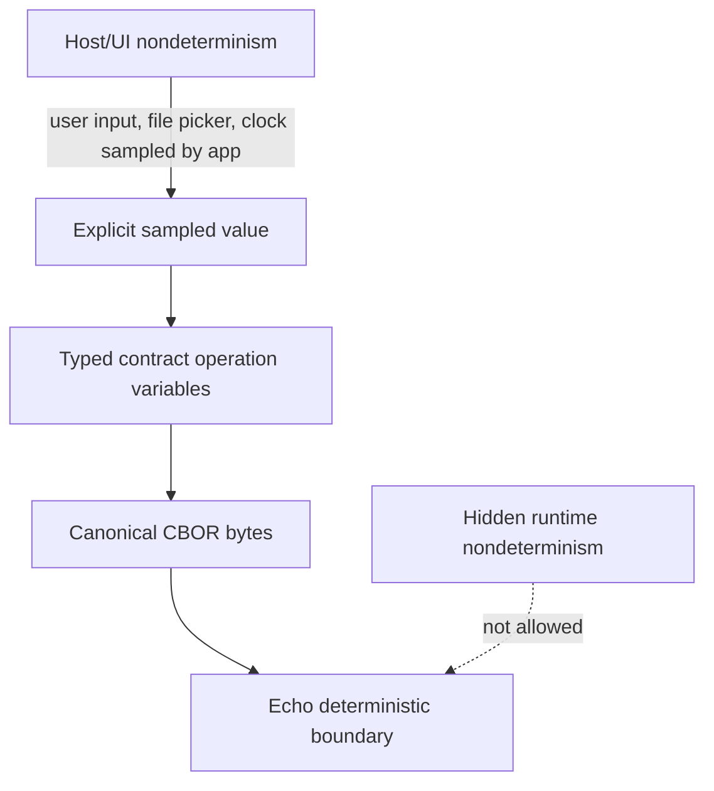
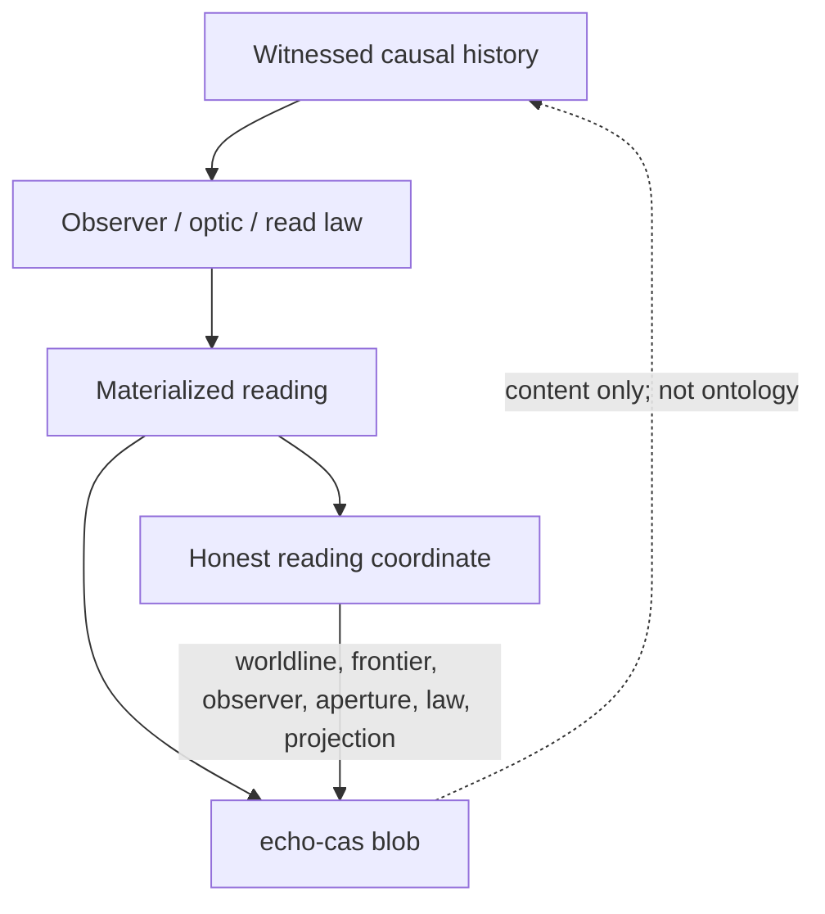
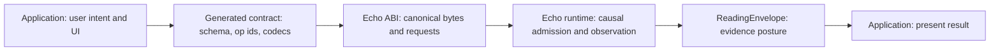

<!-- SPDX-License-Identifier: Apache-2.0 OR LicenseRef-MIND-UCAL-1.0 -->
<!-- © James Ross Ω FLYING•ROBOTS <https://github.com/flyingrobots> -->

# Application Contract Hosting

This page explains how applications use Echo without turning Echo into an
application framework.

Echo is a deterministic witnessed causal substrate. Applications own product
semantics. Wesley compiles authored GraphQL contracts into generated Rust code
that can talk to Echo through generic intent and observation boundaries.

The short version:

```text
Application UI / adapter
  -> Wesley-generated contract client
  -> canonical contract operation variables
  -> EINT v1 intent bytes
  -> Echo dispatch_intent(...)
  -> Echo causal ingress, scheduling, admission, receipts
  -> Echo observe(...)
  -> ReadingEnvelope + payload bytes
  -> generated/application decoding
  -> UI
```

## Core Rule

Echo must not gain privileged application nouns.

Names such as `ReplaceRange`, `JeditBuffer`, `RenameSymbol`,
`DeadSymbols`, `GraftProjection`, or `CounterIncrement` may appear in authored
contracts, Wesley-generated code, tests for generated families, application
adapters, and product documentation. They must not become Echo substrate APIs.

Echo-owned APIs stay generic:

- dispatch canonical intent bytes;
- observe runtime readings;
- retain artifacts;
- admit witnessed suffixes;
- settle strands;
- expose receipts, frontiers, readings, and witness references.

The design evidence for this boundary lives in these repo-local packets:

- `docs/design/0013-wesley-compiled-contract-hosting-doctrine/design.md`
- `docs/design/0014-eint-registry-observation-boundary-inventory/design.md`
- `docs/design/0015-registry-provider-host-boundary-decision/design.md`
- `docs/design/0016-wesley-to-echo-toy-contract-proof/design.md`
- `docs/design/0017-authenticated-wesley-intent-admission-posture/design.md`

## Ownership Split

Echo, contracts, and applications have different jobs.



Echo owns:

- deterministic scheduling;
- basis and frontier handling;
- admission outcome algebra;
- witnessed transition receipts;
- observer-relative reading envelopes;
- witness and retained artifact references;
- `echo-cas` retention policy;
- strand, braid, import, and suffix admission substrate;
- generic ABI entrypoints such as `dispatch_intent(...)` and `observe(...)`.

Contracts own:

- domain nouns;
- domain payload types;
- operation kinds;
- observer or read kinds;
- domain validation;
- domain transition law;
- domain emission law;
- domain-specific reading payloads.

Applications own:

- product workflows;
- UI and interaction policy;
- adapters around generated clients;
- application-specific persistence and save/open behavior where applicable;
- decisions about which contract operations to expose to users.

## Vocabulary

Use precise names at the boundary.

**Contract operation variables** are typed helper values generated from a
contract operation. Helper-only types live in the generated helper namespace so
they cannot collide with user contract types. Example:
`__echo_wesley_generated::IncrementVars { input: IncrementInput { amount: 42 } }`.

**Canonical vars bytes** are the deterministic canonical-CBOR encoding of
contract operation variables.

**Raw vars bytes** are bytes that a low-level caller claims are already
canonical. Raw-vars helpers are plumbing surfaces, not the default application
surface.

**EINT v1** is Echo's current intent envelope:

```text
"EINT" || op_id:u32le || vars_len:u32le || vars
```

**ObservationRequest** is the generic read request. Generated query helpers map
contract query operations onto this request shape when possible.

**ReadingEnvelope** is the read-side evidence envelope. It carries observer
plan, basis, witness refs, budget posture, rights posture, and residual,
plural, or obstructed posture. The current family boundary is named in
`docs/design/0019-reading-envelope-family-boundary/reading-envelope-family-boundary.md`.

## Write Path

Applications write to Echo by sending canonical intents.

The application should not hand-roll EINT bytes. It should use generated
contract helpers.



For a toy mutation:

```graphql
mutation increment(input: IncrementInput): CounterValue
```

the generated Rust shape is conceptually:

```rust
let intent = pack_increment_intent(&__echo_wesley_generated::IncrementVars {
    input: IncrementInput { amount: 42 },
})?;
```

The generated helper performs the deterministic boundary work:

```text
__echo_wesley_generated::IncrementVars
  -> encode_cbor(...)
  -> canonical vars bytes
  -> pack_intent_v1(OP_INCREMENT, &vars_bytes)
  -> EINT v1 bytes
```

Echo receives the EINT bytes. Echo does not need to know that the operation was
called `increment` or that the payload contained an `IncrementInput`. That
meaning belongs to the generated contract layer and the application.

## Dispatch Is Synchronous In Code, Not A Domain RPC

`KernelPort::dispatch_intent` is a synchronous Rust trait method:

```rust
fn dispatch_intent(&mut self, intent_bytes: &[u8]) -> Result<DispatchResponse, AbiError>
```

Implementations such as `WarpKernel` may handle reserved control intents inline
before returning a `DispatchResponse`.

Its semantic boundary is still:

```text
submit canonical causal input
```

It does not mean:

```text
call this application method synchronously and mutate a hidden global state
```

The application should treat `DispatchResponse` as ingress evidence. It says
whether the intent was newly accepted, names the content-addressed intent id,
and reports scheduler status. It is not a domain-specific result object and it
must not hide app mutation in unrecorded global state.

## Read Path

Applications read from Echo by observing.

Generated query helpers construct `ObservationRequest` values. The application
adapter, or a future higher-level wrapper, calls `KernelPort::observe(...)`,
verifies enough of the returned `ReadingEnvelope`, and decodes the payload bytes
according to the generated contract.



For a generated query, the projection currently uses:

```rust
ObservationProjection::Query {
    query_id,
    vars_bytes,
}
```

The returned artifact is not just data. It includes:

- resolved coordinate;
- reading envelope;
- declared frame;
- declared projection;
- artifact hash;
- payload.

The application should inspect the reading posture before presenting a result
as complete. A reading may be complete, residual, plurality-preserving,
obstructed, budget-limited, or rights-limited.

## Registry Handshake

Applications need to know whether their generated client matches the installed
host.

Echo already exposes registry metadata surfaces:

- `get_registry_info`;
- `get_codec_id`;
- `get_registry_version`;
- `get_schema_sha256_hex`.

Wesley-generated code already exposes generated registry information:

- operation ids;
- `OPS`;
- `op_by_id(...)`;
- enum and object descriptors;
- static `REGISTRY`.

The first handshake is intentionally small:



For the current first-consumer path, generated application code validates the
operation shape and variables before dispatch. Echo validates EINT shape and
reserved control-op usage. Host-side generated-payload validation is deferred
until a RED proves that Echo itself must reject malformed app payloads at the
host boundary.

## Admission Security Ramp

The registry handshake is compatibility evidence, not production security.

Current EINT dispatch proves that Echo can accept canonical contract-shaped
bytes. It does not prove that the submitted intent came from an authenticated
session, that the generated artifact has the required trust posture, or that the
intent is authorized for a target coordinate.

A production Wesley intent needs a stronger pre-tick admission boundary:



The trust ramp should stay explicit:

```text
local dev -> digest verified -> generated tests verified -> CI attested
  -> BLADE certified production profile
```

Holmes, WATSON, Moriarty, generated tests, and BLADE are certification providers
for later production profiles. Echo should model the posture slots and policy
requirements first; it should not treat local development trust as equivalent
to production certification.

Echo must not trust caller-supplied footprint claims. Footprints used for tick
admission must come from a verified Wesley artifact or another explicitly
trusted footprint authority.

## Determinism Boundary

Applications may observe nondeterministic host events. Echo must not let hidden
nondeterminism cross into deterministic execution.

Allowed pattern:

```text
sample outside Echo
  -> make the sampled value explicit contract input
  -> canonicalize it
  -> dispatch it
  -> witness it
```

Forbidden pattern:

```text
contract/runtime execution secretly reads time, random, env, filesystem,
host map iteration order, or other nondeterministic state
```



If an application needs time or randomness, it must turn that value into an
explicit input:

```text
InsertTimestamp { timestamp: fixed value chosen by host }
GenerateId { id: fixed value chosen by host }
UseSeed { seed: fixed value chosen by host }
```

Once sampled and dispatched, the value is part of witnessed causal history. It
is no longer hidden ambient state.

## echo-cas And Cached Readings

`echo-cas` stores content-addressed bytes. It may retain witnesses, payloads,
and cached materialized readings.

CAS content hashes are not semantic truth by themselves. Meaning lives in the
typed coordinate or reference above the CAS blob.



A cached materialized reading is valid only relative to its basis, frontier,
observer, aperture, projection, and law. Cached readings are useful. They are
not the canonical runtime state.

## Browser Or WASM Usage

A browser-hosted application should follow this shape:

1. Load Echo WASM.
2. Initialize or install a kernel.
3. Check registry metadata against the generated client.
4. Use generated Wesley helpers to build typed operation variables.
5. Pack an EINT intent through generated helpers.
6. Call `dispatch_intent(intent_bytes)`.
7. Decode `DispatchResponse`.
8. Use generated query helpers to build `ObservationRequest`.
9. Call `observe(request)`.
10. Decode `ObservationArtifact`.
11. Inspect the `ReadingEnvelope`.
12. Decode payload bytes into generated result types.
13. Render the UI.

For a raw WASM export that accepts bytes, the browser adapter serializes the
`ObservationRequest` at the ABI boundary using its `Serialize` implementation
and canonical CBOR. That encoding is transport plumbing; the generated query
helper still produces an `ObservationRequest`, and the Echo read boundary is
`KernelPort::observe(request)`.

The UI can be highly application-specific. The Echo calls remain generic.

## Native Rust Usage

A native Rust consumer can operate against `KernelPort` directly:

```rust
let intent = generated::pack_increment_intent(
    &generated::__echo_wesley_generated::IncrementVars {
        input: generated::IncrementInput { amount: 42 },
    },
)?;

let response = echo_wasm_abi::kernel_port::KernelPort::dispatch_intent(
    &mut kernel,
    &intent,
)?;

let request = generated::counter_value_observation_request(
    worldline_id,
    &generated::__echo_wesley_generated::CounterValueVars {},
)?;

let artifact =
    echo_wasm_abi::kernel_port::KernelPort::observe(&kernel, request)?;
```

The generated names differ by contract. Echo still receives only generic
intent bytes and observation requests.

## What Echo Does Not Do

Echo does not:

- run GraphQL directly;
- own application domain types;
- expose jedit, text editing, Graft, game, or debugger-specific APIs;
- dynamically load arbitrary contract families yet;
- validate every generated operation payload in core yet;
- decode query result bytes into domain result objects for the application;
- treat cached materialized state as substrate truth.

Those are generated-contract, application, or future host-integration
responsibilities.

## Clean Mental Model



In words:

```text
Application:
  I know what the user wants.

Generated Wesley code:
  I know the contract schema and how to encode/decode operations.

Echo ABI:
  I accept canonical intent bytes and observation requests.

Echo runtime:
  I admit, schedule, witness, retain, and observe causal history.

ReadingEnvelope:
  I tell you what kind of reading this was and what evidence posture it has.

Application:
  I decide how to present that reading to the user.
```

For a `jedit`-style application:

```text
jedit owns text/editor semantics.
Wesley compiles those semantics into generated contract types and helpers.
Echo receives canonical intents and emits witnessed readings.
jedit renders buffers, cursors, diffs, diagnostics, history, and UI.
```

Echo gives applications deterministic causal substrate, witnessed ingress,
observation envelopes, registry identity, and retention hooks. It should not
become the application.
