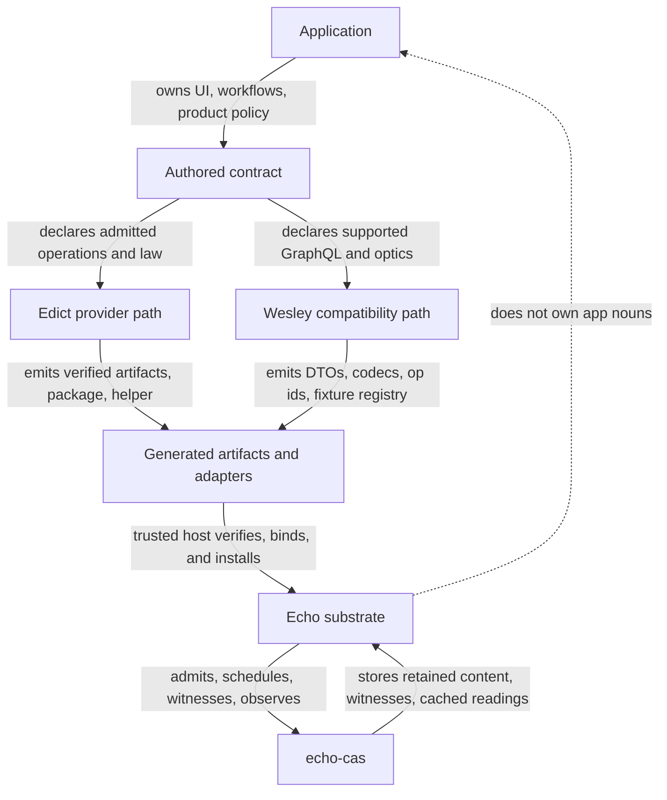
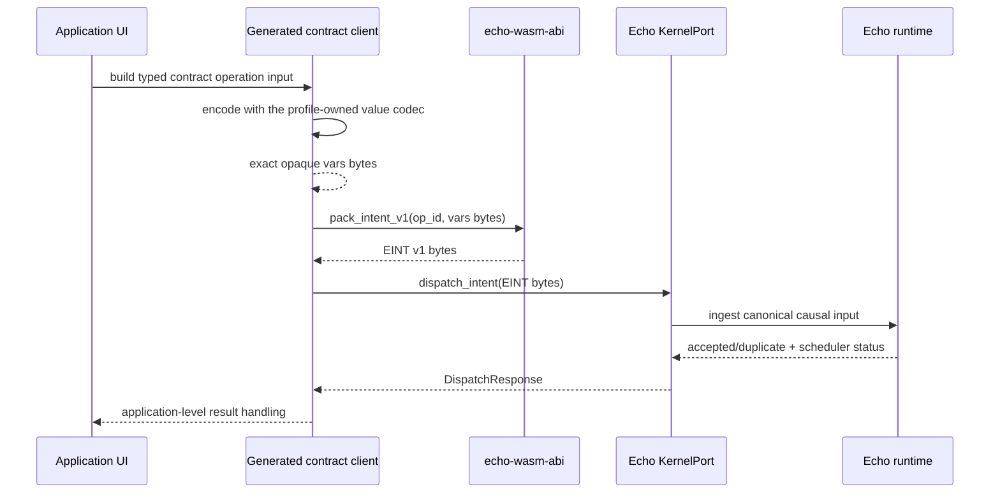
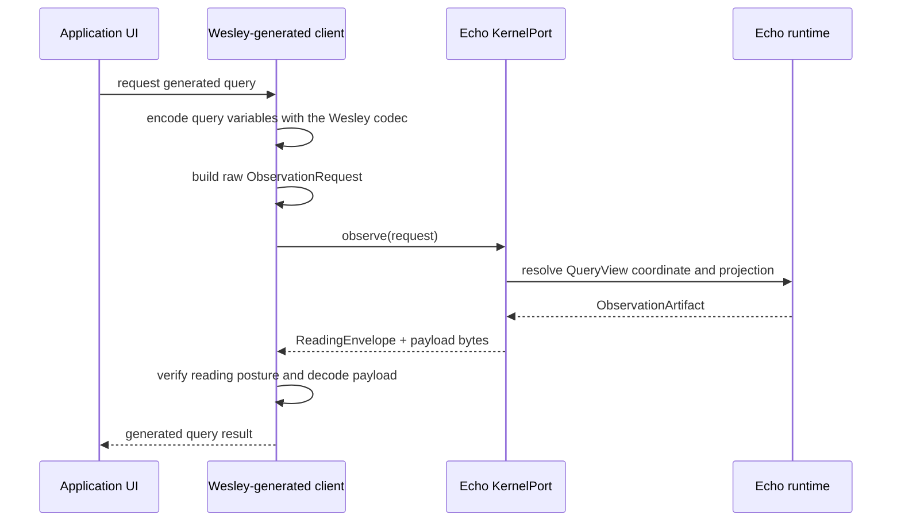
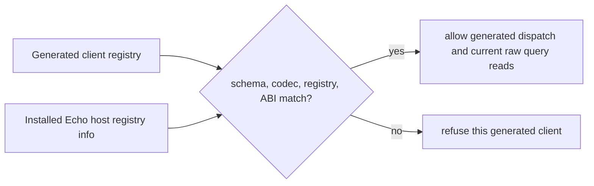
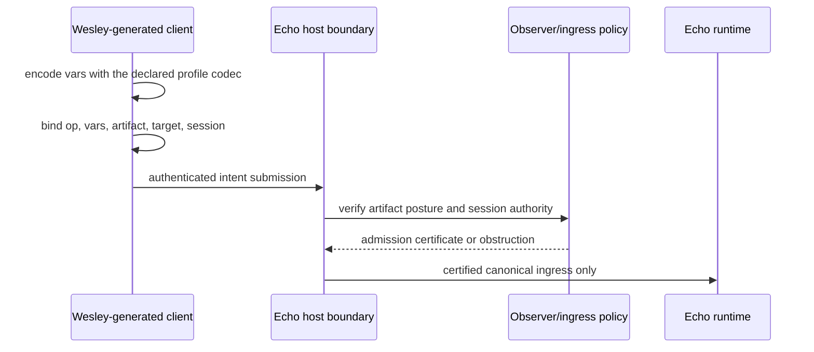
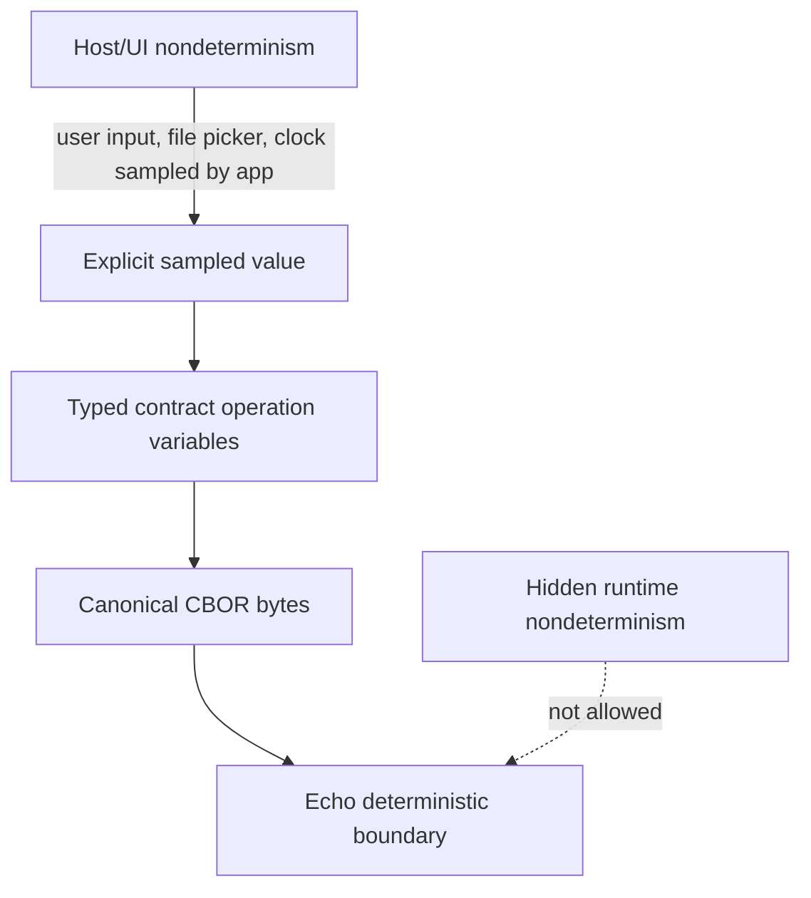
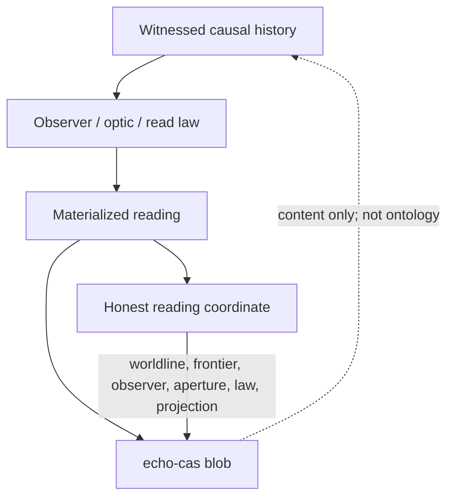

<!-- SPDX-License-Identifier: Apache-2.0 OR LicenseRef-MIND-UCAL-1.0 -->
<!-- © James Ross Ω FLYING•ROBOTS <https://github.com/flyingrobots> -->

# Application Contract Hosting

This page explains how applications use Echo without turning Echo into an
application framework.

Echo is a deterministic witnessed causal substrate. Applications own product
semantics. Edict admits authored operation semantics and coordinates
provider-specific lowering and verification. Wesley compiles supported
GraphQL and optic contracts. Their generated artifacts can cross into Echo
only through generic, trusted-host-controlled intent, observation, and package
boundaries. A bounded optic is the read-contract shape, but the current Wesley
query fixture still uses the lower-level observation primitive described
below.

This is Echo's concrete implementation of the WARP compiler seam: authored
contract nouns lower through approved compiler paths into generated artifacts,
request helpers, and contract-host helpers, while Echo core remains generic.
See the current
[WARP optics](../topics/WarpOptics.md) model for the WARP-paper-to-Echo noun
map.

The current Wesley compatibility query fixture is:

```text
Application UI / adapter
  -> Wesley-generated contract client
  -> canonical contract operation variables
  -> EINT v1 intent bytes
  -> Echo dispatch_intent(...)
  -> Echo causal ingress, scheduling, admission, receipts
  -> Wesley-generated raw ObservationRequest
  -> Echo observe(...)
  -> ObservationArtifact + ReadingEnvelope
  -> generated/application decoding
  -> UI
```

## Core Rule

Echo must not gain privileged application nouns.

Names such as `ReplaceRange`, `JeditBuffer`, `RenameSymbol`,
`DeadSymbols`, `GraftProjection`, or `CounterIncrement` may appear in authored
contracts, compiler-generated code, tests for generated families, application
adapters, and product documentation. They must not become Echo substrate APIs.

Echo-owned APIs stay generic:

- dispatch canonical intent bytes;
- observe runtime readings through generic raw and optic-shaped surfaces;
- retain artifacts;
- admit witnessed suffixes;
- settle strands;
- expose receipts, frontiers, readings, and witness references.

Application-authored optics may declare retained consequence obligations, such
as receipt obligations, but they do not create ticks or `TickReceipt` values.
Only trusted runtime control owns tick boundaries.

Current authority for this boundary lives in:

- [Generated rules](../topics/GeneratedRules.md)
- [Runtime authority](../topics/RuntimeAuthority.md)
- [Registry, provider, and host boundary](../adr/0015-registry-provider-host-boundary.md)
- [Generated rule authorship and footprints](../adr/0014-generated-rule-authorship-and-footprints.md)
- [Admitted executable operation packages](../adr/0023-admitted-executable-operation-packages.md)
- [Declarative rule authorship](../invariants/DECLARATIVE-RULE-AUTHORSHIP.md)

## Ownership Split

Echo, contracts, and applications have different jobs.


```mermaid
flowchart TB
    app["Application"]
    contract["Authored contract"]
    edict["Edict provider path"]
    wesley["Wesley compatibility path"]
    generated["Generated artifacts and adapters"]
    echo["Echo substrate"]
    cas["echo-cas"]

    app -->|"owns UI, workflows, product policy"| contract
    contract -->|"declares admitted operations and law"| edict
    contract -->|"declares supported GraphQL and optics"| wesley
    edict -->|"emits verified artifacts, package, helper"| generated
    wesley -->|"emits DTOs, codecs, op ids, fixture registry"| generated
    generated -->|"trusted host verifies, binds, and installs"| echo
    echo -->|"admits, schedules, witnesses, observes"| cas
    cas -->|"stores retained content, witnesses, cached readings"| echo

    echo -. "does not own app nouns" .-> app
```

Echo owns:

- deterministic scheduling;
- basis and frontier handling;
- admission outcome algebra;
- witnessed transition receipts;
- observer-relative reading envelopes;
- witness and retained artifact references;
- `echo-cas` retention policy;
- strand, braid, import, and suffix admission substrate;
- generic ABI entrypoints such as `dispatch_intent(...)`, raw `observe(...)`,
  and the product-shaped `observe_optic(...)` surface.

Contracts own:

- domain nouns;
- domain payload types;
- operation kinds;
- observer or read kinds;
- domain validation;
- domain transition law;
- domain emission law;
- domain-specific reading payloads.

Compiler-generated code owns the typed bridge between those contract nouns and
Echo's generic runtime surfaces. That bridge has two separate faces:

| Surface               | Responsibility                                                           |
| :-------------------- | :----------------------------------------------------------------------- |
| Application helpers   | Encode typed values, build EINT bytes, and build bounded read requests.  |
| Contract-host helpers | Bind host implementations and propose mutation or read package material. |

The current implementations have not yet closed every branch. Wesley's
compatibility fixture emits direct bootstrap helpers. The Edict provider path
emits verified publication artifacts plus a pure helper projection with the
profile-owned `le-binary-v1` typed codecs, canonical EINT packing, a borrowed
provider-generic registry, and a fail-closed mutation package proposal that
binds one explicit host implementation. The helper can bind and propose; it
cannot authenticate or install its own proposal. A trusted Echo host owns
proposal admission, exact package corroboration, provider-native installation,
runtime admission, scheduling, receipts, and recovery. The proof-owning
generator adapter consumes the corroborated token through a sealed
runtime-owner port; it is not an application capability. After installation,
the host can admit a witnessed exact-kind EINT submission for the installed
provider mutation and retain package-, operation-, Target-IR-, and rule-bound
evidence through the shared scheduler and WAL. The current closure is
mutation-specific; generated reads remain a separate bounded observer/optic
crossing. Neither compiler path may claim that generated authority facts are
Echo runtime authority.

The preceding paragraph describes the implemented provider-v1 compatibility
corridor. [ADR 0023](../adr/0023-admitted-executable-operation-packages.md)
accepts a distinct executable-operation category for new application
mutations. Echo now implements two bounded anchored-attachment programs in that
runtime slice: the original update-only compare-and-set and a separately
identified single-node-plus-alpha-attachment create-if-absent profile. Package
and invocation admission, WAL-durable Action intake, ordinary head-inbox
staging, scheduler-owned bounded evaluation, exact-basis multi-Action Tick
composition, typed per-Action outcomes, and callback-free fresh-host recovery
validate each selected program's exact footprint, budget, result, and patch
shape. Operations targeting a descended WARP retain and meter every portal
attachment in the root-to-target reachability chain as a causal input.
Scheduler-selected obstructions and footprint conflicts enter the decided Tick
as typed no-hidden-mutation outcomes. The decided Tick reaches the WAL before
state, frontier, or Receipt publication. The transitional direct
prepare/commit seam can still return noncommitted evidence to trusted host
tests, but it is not the application lifecycle.

The create-if-absent profile creates a node and its alpha attachment. It does not create a skeleton edge from the lane root. A detached cell therefore remains outside the reachable-state root hash. Equal roots do not prove equal stores or the absence of a detached write. The retained tick patch and commit identity bind that write; duplicate checks also compare the typed target-value digest. This preserves the [Merkle commit law](../spec/merkle-commit.md).

The native invocation codec has a distinct projected compare-and-set form that
retains canonical application input in the invocation identity. Static admission
requires an `application_input_expected_value_digest_path` in the installed
projection and exact equality between its 32-byte input value and the invocation
precondition. Create projections omit this path. Package admission checks this
program/path relationship before installation: a projected compare-and-set
package without the path, or a create package with it, returns `ArtifactInvalid`
with `InvalidStructure`. Legacy packages without a result projection remain
supported. Invocation admission also checks the relationship and exact digest.
Missing or substituted invocation bindings
return `ApplicationInputMismatch`; legacy invocation encodings remain unchanged.
Both mutation profiles require the effect argument to be the declared application
input directly. The lowerer and independent verifier each check the canonical
`arg.0` reference, its declared type and alpha name, and its unique local
declaration. They refuse transformed records and other local references with
`UnsupportedSemantics`; these bounded profiles do not evaluate arbitrary effect
arguments. This prevents a package from silently replacing an authored argument
with the caller's input fields. The compiler fixture retains the previously
accepted `message: "forced"` counterexample as historical failing evidence; the
corrected components refuse that source without publishing package artifacts,
while the direct-input control produces the same package and report bytes.

The native lowerer and independent verifier select the CAS program from an exact
`continuum.profile.write/v1` effect with the CAS target intrinsic and `replace`
write class. Its configuration requires a distinct `expectedValueDigestField`
and at least four steps; the package binds the corresponding input path and
CAS-specific profile identities. The verifier reconstructs these bytes and
rejects a substituted digest path. Native refusal witnesses use synthetic semantic closures. The generated schema
and reproducible checked components also admit a real public Edict compiler build;
its exact source, executable package and accepted report are retained under
`crates/echo-edict-provider-verifier/tests/fixtures/compiler-produced-cas/`.
`crates/warp-core/tests/edict_projected_cas_tests.rs` exercises those exact package
bytes through durable Action intake, pending-Action recovery, scheduler-owned
update, and fresh-host recovery of the committed value and typed result. A fresh
causal basis with a stale expected digest produces `PreconditionMismatch`; that
noncommitted outcome also survives recovery without changing the target value.
Separate witnesses refuse substituted input digests, missing target nodes and
oversized replacements. The target is detached, so these checks inspect its typed
atom and receipt rather than treating an unchanged reachable-state root as proof
of no write. The public CLI runner still selects the create-if-absent profile;
this CAS lifecycle witness uses the trusted host and Action APIs directly.

The generic operation runner distinguishes missing Action outcomes, typed obstructions, and footprint conflicts in its error messages. Both the first Action and unexpected duplicate outcomes use bounded summaries and omit invocation data. Opted-in Rust backtraces remain separate diagnostic output. This diagnostic boundary does not change retained obstruction encoding.

The external-provider schema additionally admits one exact zero-choice
`compiler-produced-bounded-pure/v1` target configuration. It contains no
application operation, target-specific budget override, or mutation authority.
The checked lowerer emits a distinct generic package retaining the exact
compiler-produced pure program closure, and the structurally separate verifier
independently reconstructs that relation. No runtime evaluator, installation,
graph mutation, Tick settlement, or application-specific Echo branch follows
from package acceptance.

### Bounded pure evaluation

The trusted-host `warp_core::edict_pure::evaluate` function now computes an
ordinary value from an exact compiler-produced pure package and canonical
input. The host supplies the package digest from an independently verified,
authorized release. The evaluator checks that pin before decoding executable
meaning. A caller-supplied digest or accepted-report-shaped value does not
establish authorization. This function has no graph, scheduler, filesystem,
clock, native callback, or WAL access and produces no Tick or Receipt.

The interpreter implements the generic subset demanded by the first real
compiler witness: unsigned integer constants, records, locals, field access,
integer equality and ordering, bounded byte equality, lazy conditionals, and
source-owned pure functions with ordered parameters and local bindings,
separately authenticated zero-argument imported helpers, and
`core.integer.subtract<U32/U64>` with two operands. Subtraction
validates both values against the declared unsigned width and refuses underflow
with `InvalidArtifact`; it never wraps or saturates. Operands and the result
use the ordinary execution meter. The compiler and target verifier own static
totality evidence; the interpreter additionally checks runtime values even when
the supplied package pin matches. Calls resolve opaque source or lawpack
coordinates to retained Edict bodies with separate lexical scope. No application coordinate selects a native
implementation. Unsupported expression forms are rejected during decoding,
including unselected branches. Authored runtime types constrain input,
bindings, helper returns, and output. Nominal contracts resolve their declared
storage representations. Authored input constraints run before bindings, and
the compiler's result projection must match the selected Target IR result.

The generic `core.bytes.length<OperandType>` operation measures one bounded byte
value and returns U64. Its retained operand coordinate resolves through the
ordinary type decoder; the interpreter validates that byte representation and
its declared bounds before measuring. It counts raw bytes, including non-UTF-8
bytes, rather than Unicode scalars. Operand evaluation, type validation, and
result storage use the ordinary meter. This does not introduce String length,
implicit conversion, or any application-specific text interpretation.
Canonical structural `Bytes<max=N>`, `Bytes<exact=N>`, and
`Bytes<min=N,max=M>` coordinates also resolve directly, without a named type
entry. Noncanonical numbers, inverted bounds, and an interval spelling with
equal endpoints reject; equal endpoints use `exact=N`.

The generic `core.bytes.slice<OperandType>(bytes, start, end)` operation returns
raw bytes in the half-open range `[start, end)`. It validates the operand's byte
bounds and both offsets as U64, then refuses reversed or out-of-bounds ranges
with `InvalidArtifact`. Authored input constraints still run before bindings.
Empty and full ranges are valid; slicing inside a UTF-8 codepoint is a raw-byte
operation. The operand's minimum or exact length does not become a result
minimum: ordinary binding and output types validate the selected value.

The generic `core.bytes.concat<LeftType, RightType>(left, right)` operation
appends two bounded byte values in source order. Both coordinates must decode
to byte types, and their declared maximum sum must fit U64. Each actual operand
must inhabit its own minimum/maximum bounds. Static expression-coordinate
proofs remain the compiler/Target verifier's responsibility; the runtime checks
actual values and the independently declared binding/output bounds.

Concatenation charges one work unit per combined byte, plus the ordinary result
cell and combined-byte storage, before reserving or copying the output. Empty
operands still incur ordinary evaluation and result-cell costs. Raw bytes retain
their order, including invalid UTF-8; no application names select behavior or
costs.

Host ceilings intersect the package's declared step, allocation, and output
budgets. Each expression, predicate, runtime type visit, and copied value node
costs one step. Byte equality additionally charges the larger operand's entire
byte length before comparison, even when lengths differ or the first byte
mismatches. This deterministic charge does not claim constant-time machine
execution. Byte slicing additionally charges one work unit per selected byte,
and the ordinary value cell plus selected-byte storage, before copying the
selected range. Empty slices incur ordinary expression and value costs but no
selected-byte work. Byte ordering and mixed byte/integer predicates remain
unsupported.
Storage accounting charges a fixed 64-byte cell per materialized
value node plus text and byte payload lengths, cumulatively including copies
and result-encoding scratch. These interpreter units are independent of Rust
layout and pointer width; they are not a report of physical allocator usage.
Package and input decoding have separate host byte apertures capped at 16 MiB,
the canonical decoder's node limit, and a 64-level interpreter depth limit.
Syntax and type expansion share a 65,536-node decode budget. Decode and code
storage are bounded by those admission apertures, outside execution accounting.

Source functions remain authoritative in `Core.functions`; Target IR retains
calls to their fully qualified coordinates. Both pure and bounded-read providers
validate the complete source/imported function closure, including unused
functions. The lowerer derives a forward judgment, while the independent
verifier audits dependency summaries and lexical frames before checking the
Core/Target relation. Rebinding artifact hashes does not establish that relation.
Unknown or colliding function names, wrong argument types or arity, generic
calls, cycles, undeclared or duplicate locals, forward local references, and
caller-local captures reject. Source function coordinates must be disjoint from
both authenticated imported pure-function and effect exports, including unused
source definitions. Reserving an effect name does not permit calling it from a
pure helper. Imported functions cannot refer back to source-owned functions.
The imported subset remains zero-argument bodies without local bindings.
Source-call ownership requires exact membership in `Core.functions`. A shared
package prefix alone does not make an imported pure function source-owned.
Calls must also satisfy the type-resolution aperture: same-prefix named types
currently resolve through module-relative `Core.types` keys; fully qualified
imported type keys under that prefix remain a provider/runtime compatibility
limitation.

Each call evaluates every argument once, from left to right in the caller's
frame, including unused arguments. Validated argument values move into a fresh
parameter-only frame. Ordered local bindings and the return value are validated
there. Parameter reads incur their ordinary copy charges. The operation shares
one cumulative execution meter across arguments, nested calls, bindings and
returns; returning from a frame does not refund allocation charges. Conditional
branches are checked during admission, but only the selected branch executes.
Read instructions obtain opaque atom bytes before passing ordinary values to a
pure helper; helpers gain no read or mutation authority.

The pure profile retains an optional authored basis and checks any present
expression under the input-only scope, including call signatures and combined
depth. `basis none` omits the canonical field; a present null rejects. Private
pure evaluation does not resolve, execute or charge that basis, so valid basis
helpers do not change its result or runtime counters. The bounded-read profile
executes and charges its basis expression as part of the operation. This is a
target-profile distinction, not permission to retain malformed basis authority.

The source-function target subset supports unsigned words, bounded bytes,
records and nominal types, with U32/U64 integer literals. Provider compatibility
retains each nominal type's contract identity, which must match its resolved
Core type-table key. Equal representations do not permit assignment, arguments,
returns or comparisons across distinct nominal identities, or between a nominal
type and its representation. Same-nominal byte and unsigned-word comparisons
use the ordinary representation costs. Named `Int` definitions resolve through
their declared unsigned width in both provider judgments and the shared
pure/read runtime type parser, under its existing depth and work limits.
Runtime values carry no additional
nominal tag; materialization, validation and encoding bounds remain based on
the representation. Both bounded-read provider judgments preserve nominal identity even when the optional source-function table is absent; basis and address roles inspect physical representation only at their explicit role checks. Boolean, string, list, variant and effectful helper forms
receive provider refusal.
For modules containing source functions, partial subtraction and slicing need
literal evidence sufficient for totality: ordered unsigned operands, or ordered
U64 slice offsets within the operand's guaranteed minimum length. Caller
`where` constraints are not inherited into helper frames. Function-free legacy
fixtures retain their existing admission and runtime behavior.

Source-function admission derives conservative bounds for the whole operation:
input validation and materialization, every argument and call occurrence,
ordered bindings, parameter and return checks, predicate and byte work,
bounded reads, output validation, and encoding scratch. Branch bounds take
the maximum after predicate work. Checked arithmetic rejects overflow, and
shared dependency summaries do not deduplicate repeated execution. A declared
step, allocation or output ceiling below the derived bound rejects before
package acceptance; tighter host ceilings can still refuse an evaluation.

The combined interpreter aperture is 64 levels across surrounding expressions,
predicates and calls, including nested parameter, binding and return validation.
Admission checks every source and imported suffix independently of traversal
order. This is stricter than Edict's separate 128-source-helper compiler limit;
that compiler limit does not promise 128-frame Echo execution. Syntax and type
expansion remain bounded separately from runtime value materialization.

The native
[`edict_source_functions_tests.rs`](../../crates/warp-core/tests/edict_source_functions_tests.rs)
uses deliberately rebound test-owned packages to check fresh frames, argument
order and single evaluation, cumulative fixed-cost oracles, lazy branches,
combined depth, malformed authority, and a real stored atom passed to a helper.
These synthetic boundary controls establish no public compiler or release
provenance by themselves. Its Cargo target requires `trusted_runtime`; CI and
local affected-test routing select the same feature explicitly.

The executable witness is
[`edict_pure_evaluation_tests.rs`](../../crates/warp-core/tests/edict_pure_evaluation_tests.rs).
It consumes retained exact external compiler output, checks both authored
branches and a helper result, and proves that a separately compiled source
mutation changes the runtime result. Its fixture retains separate verifier
reports and reproduction coordinates. Reversed input ordering, invalid runtime
representations, package substitution, noncanonical input, and exhausted host
budgets produce errors without returning an application result.

The guarded public source-function consumer in `xtask/examples/source_functions_public_runtime.rs` selects the complete compiler evidence by an externally supplied SHA-256. It binds the original literal cases and exact repeated package/report bytes to that selection, checks verifier approval and artifact-domain bindings, and consumes the same owned byte vectors through the public pure and immutable-read interpreters. The read witness selects an explicit frontier and aperture and checks unchanged state. These results establish private computation and reading evidence; they do not claim installation, a decided Tick, a causal Receipt, or physical power-loss durability.

The paired nominal-ID and variable-payload equality witnesses in
[`edict_byte_equality_tests.rs`](../../crates/warp-core/tests/edict_byte_equality_tests.rs)
consume separately verified packages built from Jim-owned source using the
existing compiler/provider pins. They cover differences at every ID byte,
empty and unequal-length payloads, deterministic work accounting, exact budget
limits, input bounds, substituted pins, and forged unsupported predicates.
The target declares `trusted_runtime` as a required Cargo feature; CI and
the opt-in local full-test routes execute it with that feature, including
when only its fixture or interpreter source changes.
Comparing supplied IDs does not establish the current graph head; that requires
a separate admitted read and application-owned fact decoding.

[`edict_pure_unsigned_subtraction_tests.rs`](../../crates/warp-core/tests/edict_pure_unsigned_subtraction_tests.rs)
adds a real external compiler package that returns an unsigned difference under
an ordered input constraint. Literal results cover equal endpoints, nonzero
differences, and the U64 boundary. Deliberate artifact mutations with matching
test-host pins exercise U32 bounds, malformed calls, operand types, and
underflow; these mutated artifacts are not verification or admission evidence.
The original pure-program fixture still runs unchanged.

[`edict_pure_byte_length_tests.rs`](../../crates/warp-core/tests/edict_pure_byte_length_tests.rs)
adds the next external compiler artifact and literal empty, Unicode, and raw
byte-count witnesses. Wrong signatures, non-byte operands, narrowed bounds,
substituted packages, and exhausted budgets reject with structured errors.

[`edict_byte_slice_tests.rs`](../../crates/warp-core/tests/edict_byte_slice_tests.rs)
executes a retained compiler-produced slice package against twelve literal
consumer cases, including raw non-UTF-8 bytes and authored constraint refusals.
Malformed call, coordinate, operand, range, and budget controls exercise runtime
defenses. A test-only alpha-renaming control changes application coordinates,
operation and record names, and input fields while preserving results and costs;
these names do not select primitive behavior. The mutated controls are not new
compiler or verifier evidence. The feature-gated suite runs in CI and local
full-test routes, including changes confined to its fixture or support helper.

[`edict_byte_concat_tests.rs`](../../crates/warp-core/tests/edict_byte_concat_tests.rs)
executes the exact externally compiled two-fragment program against twelve
literal consumer expectations. Signature, operand-bound, declared-sum overflow,
actual result-bound and host/package budget controls exercise runtime defenses.
Its retained package/report binding and application-name renaming checks follow
the same distinction between compiler evidence and test-only mutations. CI and
local full-test routes include its fixture and support-helper changes.

This refines the pure-package boundary above and depends on its independently
verified artifact closure. It does not extend the installed operation lifecycle
in [ADR 0023](../adr/0023-admitted-executable-operation-packages.md). Generic
effectful execution and its settlement evidence remain tracked by
[issue #684](https://github.com/flyingrobots/echo/issues/684).

The slice exposes no application matcher, executor, or footprint callback. A
generic provider lowerer now emits the package from exact Edict source, Core,
lawpack, exports, adapter, target-configuration, and Target IR artifacts, and a
structurally separate provider verifier independently reconstructs that
relation. Edict's public application-build command assembles those inputs end
to end and invokes the checked Echo lowerer and structurally separate
verifier. The slice does not implement Jedit `ReplaceRange`, any Graft
operation, or cross-head atomic filesystem-WAL persistence. Provider v1 remains
stable while consumers migrate; it is not renamed or silently reinterpreted as
the executable-operation corridor. The program digest supplies executable
meaning only: it cannot independently confer an operation coordinate,
invocability, or authority, and Echo cannot install or invoke it naked. The
admitted operation package binds the public contract and semantic closure to
the exact program, after which Echo independently admits each invocation.

## External Edict Provider Artifacts

### Observation-bound native host sessions

The bounded `cargo xtask run-edict-operation --serve` driver continues one
worldline through multiple compiled create-if-absent operations and reopens its
native WAL. The bootstrap `basis` string selects that worldline once. Each
submission gets a current runtime evaluation basis; it does not replace the
observation basis retained for its attempt.

The trusted host captures bounded node/atom readings before returning them to a
caller. Immutable observation and logical-request bindings are retained as
`ExecutableOperationContextRetained` WAL records. Request binding precedes
ordinary durable ingress acceptance. Retrying the same semantic request returns
its original canonical invocation and resolves its original native disposition;
different input, package, operation, grant, or observation attempt under that
identity is refused. A crash between binding and ingress can resume acceptance
of that exact invocation. Transport rebasing does not alter its meaning.

Observation preconditions execute in Echo's operation preparation, against the
state the scheduler will commit from. Their resource reads enter the native
footprint and patch input slots. The operation's admitted budget covers those
reads. Relevant value changes produce `ObservationChanged`; unavailable support
produces an obstruction. Unrelated movement does not invalidate the reading.
The original invocation remains the replay input, including its observation.

The pinned Hello Echo fixture has a 64-byte read budget for an unobserved
one-shot create; it is not an observation-session profile. `--serve` refuses
that insufficient budget before creating a WAL. An authored observation profile
must budget for both the operation and its aperture: each node reading costs two
steps and 64 bytes plus its encoded value, with additional descent reads where
applicable. Compile and independently verify that profile before installation;
the driver never increases a package or grant ceiling. Passing the startup
minimum does not guarantee that a larger aperture fits. Runtime metering still
returns `BudgetExceeded` when the actual admitted allowance is exhausted.

Change discovery is a reading over retained observations and native patches.
It returns aperture keys whose current values differ or which native patches
wrote after the reading, including a change followed by restoration of the
original value. Notification evidence therefore differs from the value-based
admission precondition: an intervening write can merit attention even when the
original value is valid again. It returns the retained commits that wrote them,
without persisting a second notification log. It survives loss of the driver's
caches. Unknown observation identities obstruct rather than silently recapture.
The combined change-evidence query resolves the observation once and reads the
host's native provenance index, which is reconstructed during reopening. It does
not repeatedly recover the WAL to derive keys and commit identities separately.

This is a trusted, locally scripted host profile, not an authenticated agent
service or the complete public optics boundary. It covers bounded atomic node
and attachment readings in the caller's granted aperture, not model-internal
influence, arbitrary subtree observations, or speculative strand settlement.
The driver accepts at most 1,024 observations and 4,096 request bindings per WAL;
each observation contains at most 16 nodes and 4,096 retained value bytes.
Capture preflights each slot against the remaining aggregate canonical byte
allowance before copying that slot’s Atom bytes.
Execution checks the slot ceiling and charges its admitted read budget before
materializing the value; oversized support obstructs rather than allocating it.
The context index and writer cursor are derived from one validated committed WAL
prefix on opening or reconciliation. Healthy appends apply only their new context
records and advance the index's commit binding after durable acknowledgement.
Reads borrow that index without replaying history. Any append error invalidates
the binding, including an error reported after the commit marker was synced.
Reads in that posture resolve retained records; context writes reconcile the
writer cursor before checking identity or constructing another transaction. No
transaction from an uncertain cursor can reach storage. Exact retries recover
the original request rather than replacing its semantic input.
Retention policy and authenticated aperture delegation remain separate work.

For diagnostic workload accounting, `ECHO_WAL_PROFILE=1` makes the session driver
emit cumulative thread-local recovery calls and decoded frame counts on stderr
after each RPC. Counters restart with each process. They count all filesystem
recovery calls, including required opening and explicit recovery, and do not
change stdout responses or retained evidence. They are work counts, not CPU-time
or physical-I/O measurements.

Disconnected create-if-absent cells can leave the root-reachable state hash
unchanged. Recovery evidence must therefore include native commit identities
and the recovered cells, not just that root hash. Reopening an empty writer
epoch reuses its unconsumed first LSN under a fresh fenced epoch; it must not
introduce a gap into the retained frame sequence.

### Provider artifact boundary

Echo's contract-pack admission distinguishes explicit, digest-pinned upstream
publications. The original `admit_provider_contract_pack_v1` entry point remains
bound to its pure-binding publication. The opt-in
`admit_provider_contract_pack_for_publication_v1` entry point additionally admits
the [ordered-instruction publication](../../schemas/edict-provider/contracts/ordered/README.md).
The closed selector fixes both byte identities and the input size ceiling before
parsing; mixed publications reject. This is structural schema authority only.
It does not prove instruction ordering, select an executable profile, or confer
support for graph reads or writes. The existing provider generation path still
selects the original publication.

The native lowerer source additionally recognizes the opt-in
`compiler-produced-bounded-read/v1` configuration. This separate profile carries
explicit read-count and aggregate read-byte ceilings; it does not reinterpret
pure packages as effectful programs. Its expression subset includes typed
source/imported helper calls, U32/U64 constants, lazy conditionals, byte length
and concatenation, locals, record construction/selection, byte equality, and
unsigned equality or ordering guards. The source-function totality and resource
rules above also apply to this route. Reads select opaque atom bytes by
WARP/node/expected-type IDs.
Core and ordered Target IR must agree on every producer, guard, failure mapping,
and result, with exact imported read signatures and scoped local identities.
The package retains source, Core, Target IR, exports, lawpack, adapter,
configuration, and result projection bytes.

The structurally separate native verifier reconstructs an ordered Core body
from Target IR and reverses target failure mappings through the declared
adapter. It checks local availability and types, compares the reconstruction
with Core, and checks the projection and every embedded artifact independently
of the lowerer. Coherently rehashed package/target mutations cannot change the
authored order, read address, guard, failure mapping, or result. Accepted and
rejected reports bind the exact package, Target IR, and projection; response
ceilings include their artifact bytes, role/domain strings, and diagnostics.

The checked schema and reproducibly promoted components now support this read
configuration. The explicit ordered-contract publication compiles the authored
single and independent-address paired read/guard programs through unmodified
Edict, including both Wasm components and exact accepted verifier reports.
Repeated builds reproduce the package/report bytes. The original contract
publication remains selected by the default generator; callers must explicitly
select the ordered publication for these ordered read programs.

The [public compiler witness](../../scripts/consumer-witnesses/bounded-read-publication.py)
preserves the authored source and also proves the old provider's schema refusal.
Its success establishes compilation and verification, **not a state observation**.

The `trusted_runtime` feature exposes `edict_read::evaluate` for private
computation over an immutable borrowed `WorldlineFrontier`. The host supplies
an independently verified package digest and selects the frontier and sorted,
unique node aperture. `ReadView::new` checks the expected worldline, tick, and
actual state root. `ReadView::at` derives the basis from the selected frontier
with one state hash when no independently selected expected basis is needed.
Both constructors enforce the same aperture constraints. Node addresses include
both WARP and node identities. A package
profile cannot authorize its own aperture. The interpreter is not a substitute
for independent provider verification of the package's authored semantics.
Input selection follows the same explicit `arg.0` identity as the provider
scope checks; local declaration order does not select the application input.

Reads return opaque atom bytes and enforce the requested type and authored byte
bound. Missing nodes or attachments, descent attachments, type mismatches, and
oversized atoms map to authored obstructions. Descent is never followed. Guards
run in authored order and can stop execution before a later read. Host ceilings
intersect package ceilings for read attempts, aggregate read bytes, expression
work, allocated value storage, and output. Atom work and storage are charged
before copying. Parsing has separate byte and expression-shape ceilings.

View preparation hashes the **entire frontier state**, outside the interpreted
evaluation budget. A small aperture therefore does not imply bounded setup
cost. Successful results retain the selected basis and a separate opaque
application basis value; that application value is not proof of a canonical
application head. Application fact decoding remains outside the generic atom
primitive.

The runtime witnesses in `crates/warp-core/tests/edict_node_read_tests.rs` use
retained public-compiler packages with independently recorded pins. A guarded reusable Docker worker can run the public compiler witness with
copied inputs, then set `EDICT_READ_OUTPUT_ROOT` to its evidence directory when
running the runtime tests. That route evaluates the **fresh output files**.
The compiler witness requires `/read-fixtures`, `/old-provider`, `/read-provider`,
and `EDICT_READ_COMPILER` (default `/edict/target/debug/edict`); it creates
`/read-evidence` and refuses to reuse existing variant directories. The operator
must supply an exclusive worker lock, process-tree timeout, and a fail-closed
continuous guard over shared compiler output, writable layers, temporary data,
and logs, including host and Docker free-space floors. Before/after measurements
alone do not enforce those budgets. The supported runner remains separate work
in [#742](https://github.com/flyingrobots/echo/issues/742).
These witnesses establish private evaluation without frontier mutation. They do not
establish installation, public request authorization, a causal Tick, WAL
retention, a receipt, or an admitted reading. Integration and release evidence are tracked by
[#740](https://github.com/flyingrobots/echo/issues/740).

Primary artifact generation also compares the supplied pack's exact schema and
manifest with the source materials bound into its generation input. Admission
of each pack separately does not establish this relation: crossed publications
return `ContractPackInputMismatch` before constructing any output or provenance.

Echo also owns the runtime-specific semantics supplied to Edict's generic
external provider host. That pipeline has a separate source and output boundary:

```text
Echo GraphQL and checked semantic declarations
  -> Echo-Wesley generators
  -> generated lawpack, target profile, split authority facts, schemas,
     review projection, generated-artifact profile, and provenance
  -> provider-owned lowerer and verifier components
  -> #655 generated provider manifest and digest-locked Echo provider package
  -> Edict's runtime-neutral provider host
  -> exact requested Target IR, generated-helper, and non-authoritative review
     projections after their own host admission
```

The first checked non-GraphQL source is
[`schemas/edict-provider/echo-provider-semantics-v1.json`](../../schemas/edict-provider/echo-provider-semantics-v1.json).
Its executable schema and pure validator live in
`echo_wesley_gen::provider_semantics`. The source fixes one reviewed
compatibility operation and explicitly records its type family, effect
signature and execution class, typed failure and obstruction
schemas, exhaustive obstruction mapping, full Edict optic profile, budget,
target-owned write-class/native capability, complete manifest resources,
artifact roles, invocation domains, and CDDL roots. Package records use an
Echo-owned alias over the exact Edict Core string coordinate rather than
redefining Core string semantics.

The provider source follows three authority rules:

1. A semantic fact has one stable coordinate, one named authority artifact, and
   one canonical domain.
2. Generated files are projections. A lawpack, profile, facts file, manifest,
   schema, provenance record, or review rendering cannot become input authority.
3. There is no directory or registry search. Runtime SDL and historical
   relocated Wesley SDL do not become fallback authority merely because they
   contain a matching name.

The authority split is structural. The semantic declaration owns the portable
effect, domain obstruction, source mapping, budget, and operation. Target
metadata owns the operation profile and optic template, low-level failure
taxonomy, write-class resolution, native capability, and inner Target IR
selection. An explicit discharge mapping joins target authority to the
lawpack's advisory hint and abstract footprint/cost obligations without making
the two vocabularies identical. The semantic source's invocation/schema
inventory owns the outer provider artifact domain. The validator checks the
joins between those facts and rejects missing mappings, incompatible profiles,
capability/effect disagreement, missing or ambiguous implementations, duplicate
target-profile adapter selectors, recursive types, Core ownership violations,
invalid failure identifiers, incomplete artifact closure, and non-empty payload
mappings that would require generator-authored semantics.

The provider manifest is a #655 package-root output, not a #652 member of its
own artifact list. Two authority-facts documents preserve Edict's one-source
rule: lawpack facts carry budgets, while target-profile facts carry operation
profiles and resolved effect write classes. Their canonical byte contract is
Edict-owned and landed under Edict #157 in Edict PR #159. Generated resource
declarations carry no output digests. Standard Edict resources and the
self-contained provider CDDL are explicit trusted inputs from the Apache-2.0
contract pack introduced in Edict PR #162 and extended with the
generic pure-binding contracts in Edict PR #201. Echo admits its exact CDDL,
manifest, contract/domain inventories, resource bytes, digests, and provenance
before generation without searching a filesystem, registry, or network. Schema
instance validation is a separate output-admission step: exact
`edict.canonical-cbor/v1` decoding is followed by validation against the named
owning root in that authenticated CDDL. Passing both checks attests provider
artifact shape only. It does not make authority-facts runtime Echo authority,
install a package, admit an operation, or authorize a runtime consequence.

The #655 package identity is an Echo-owned, versioned canonical-CBOR closure,
not a hash of the completed JSON manifest. It binds the manifest role and
coordinate, exact API and provider ABI, ten sorted semantic/component routes,
31 sorted schema bindings—nine compatibility invocation domains, the generated
artifact profile, 14 generated-resource domains, and seven generic
executable-operation closure domains—and raw exact-byte hashes for all 24
non-manifest members. The derived manifest carries that root and has its own
independent raw content identity. Canonical-CBOR routes preserve their Edict domain-framed
artifact digests while the package member table preserves raw occurrences, so
neither proposition impersonates the other. Admission requires the caller's
external provider pin and exact-reproduces packaged Wesley provenance/review.
That boundary still proves only the distribution occurrence: the Edict-owned
schema registry and component host must separately admit roots, bytes,
attestations, imports, exports, and WIT types before guest execution.

The checked distribution is a self-contained 25-file publication: the current
22-file provider corpus introduced by #652 under `generated/`, the exact lowerer and verifier under
`components/`, and the derived manifest. Publication refuses before filesystem
access if the generated members are not byte-identical to the checked source
corpus. Its check mode inventories the exact tree through retained no-follow
directory capabilities and reports drift without repair. This distribution
copy is a release occurrence, not a second semantic authority.

Native readiness is a later, independent crossing pinned to Edict revision
`2e3f52f9e6d615f96eb594a40126e223a9253d98`. The exact manifest constructs the
immutable schema registry; all five canonical primaries and 14 generated
resources validate under their owning roots; every lawpack/target-profile field
is bound to the expected coordinate and independently recomputed domain-framed
digest; adjacent primary references agree; and both exact components pass host
preflight before both request kinds are validated. No guest is invoked. These
proofs establish schema, identity-graph, component-contract, and request
readiness only. They still do not install, authorize, schedule, execute, commit,
observe, or receipt anything in Echo.

The publishable Rust crate uses a separate 42-file package-local carrier tree
for exact repository sources and provider bytes that would otherwise live above
the crate root. Carrier locations never replace the logical authored paths in
generation provenance. Generated artifacts and components remain authoritative;
their package copies are corroborating release occurrences. This distinction
permits staged regeneration without allowing a stale package to block the
carrier update required to rebuild that package. Final checks require owner,
carrier, package copy, and Cargo archive inventory to agree exactly. The source
closure explicitly enumerates 20 files, including the exact canonicalization,
semantic-operation-id, and provider-registry dependency manifests and
implementations; a dependency implementation cannot move while the claimed
generator occurrence remains fixed.

The target-profile lowerer and verifier resources are generated declarative
contract documents. They do not select executable implementations. The package
manifest separately binds the exact provider-owned components and their frozen
WIT world attestations, preserving independent lowerers and component upgrades
without target-profile semantic churn.

The first executable lowerer implements the frozen
`edict:target-provider/lowerer@1.0.0` world as a pure component over explicit
request bytes. It recognizes only the checked mutation closure for local Core
intent `t` (global semantic coordinate `a.b@1.t`) and emits the exact canonical
Target IR bytes produced by Edict's built-in Echo compatibility wrapper. An
effect-free operation is refused as unsupported semantics rather than encoded
as a synthetic mutation. The same fail-closed rule applies to a rebound Core
module, changed operation type binding, or authored Core optic that this first
crossing cannot faithfully discharge. The lowerer authenticates the complete
reviewed Core type-definition map and exact evaluation budget because neither
may disappear or broaden across Target IR projection. It also derives bounded
pre-effect, obstruction-arm, and post-effect local scopes from exactly one input,
one effect-result, and one obstruction declaration. Every local expression must
resolve to one complete compiler-owned identity before the expression is copied.
This first closure admits no input constraints and only the reviewed
zero-argument `domain.WriteRejected` obstruction constructor; non-empty
constraints or a different construction fail closed until their own semantic
crossings are implemented. The complete semantic closure includes the exact
lowerability coordinate as well as its canonical bytes and digest.
The component's protocol instance and request/result aliases are type-only
imports; filesystem, network, environment, clock, randomness, registry,
logging callback, WASI, and every other callable import are forbidden. This
crossing proves translation only. Package admission, installation, invocation,
commitment, observation, and receipt authority remain separate Echo runtime
crossings.

The #656 native lowerer model adds two projections beside the Target IR output:
an exact generated Rust helper envelope and a permanently non-authoritative
review envelope. Requested outputs must be an exact lexicographically sorted
subset of the three declared role/kind/domain triples. The helper and review
separately name the semantic Target IR coordinate `echo.span-ir/v1` and its
artifact digest domain `edict.target-ir.artifact/v1`; neither identity may stand
in for the other. The review subjects the exact generated artifact, so its
evidence changes when the generated envelope changes.

The `echo.dpo.bundle/v1` identity is only a target-bundle profile, not a final
contract-bundle occurrence. Because the generated artifact participates in the
bundle's semantic identity, embedding final bundle digests in that artifact or
its review would create an identity cycle. The review therefore records
`edict.bundle.semantic/v1` and `edict.bundle.release/v1` as the two bundle
digest propositions, leaves their digest values absent, and declares
`explicit-after-assembly` binding. After assembly, a caller supplies an
independent expected pin and untrusted actual bundle claims. The generated
helper checks exact domains, typed digest form, expected-versus-actual bundle
digests, and the operation coordinate, Target IR, Echo ABI, helper API, provider
and operation schemas, target/generated/operation profiles,
and abstract footprint
obligation/algebra identities before returning a descriptor with private state.
Every framed resource claim includes and compares its coordinate, digest domain,
and digest; a bare hash cannot stand in for that proposition.
The footprint claim remains abstract; the helper does not counterfeit a static
read/write certificate. This is an equality and semantic-consistency proof
only: it does not authenticate the pin, schema-admit the outputs, construct or
install an Echo package, or grant runtime authority. The canonical generated
profile/package now carries the separately versioned Echo-owned
`echo.semantic-operation-id.fnv1-32/v1` law and exact persisted id derived from
the semantic coordinate and generic query/mutation kind. The top two operation
ids remain Echo-owned protocol reservations: `u32::MAX` for scheduler control
and `u32::MAX - 1` for witnessed suffix import. Either reserved result and any
package-local collision refuse without salting or probing. CDDL admission
constrains the numeric application-id domain only; generation must independently
recompute the coordinate-and-kind law and collision-check the complete set.
Emitted source carries public expected constants for that packaged proposition
without re-derivation, checks the law and id as untrusted bundle claims, and lets
the descriptor expose the matched id claim after the pure preflight succeeds.
The descriptor remains evidence, not a registry entry, installation token, or
runtime authority. The generated-artifact profile now owns the exact
`le-binary-v1` byte law. Generated Rust implements distinct `Id`, `Input`, and
`Output` types, preserves raw UTF-8 under the authored scalar bound, and rejects
malformed, over-bound, truncated, or trailing bytes. The descriptor exposes
typed encode/decode methods and packs an `Input` into canonical EINT v1 under
the matched operation id. Echo treats EINT `vars` as codec-owned opaque bytes;
canonical CBOR is specific to the Wesley path rather than a universal
operation-variable contract.

The descriptor also exposes a borrowed `ProviderRegistryV1` whose operation
record retains the complete Target IR, bundle, target/generated/operation
profile, provider/value schema, codec, obstruction, operation-id, ABI,
helper-API, and footprint proposition. It can bind the generated matcher and
canonical rule name to one independently identified host mutation
implementation, then return an opaque `ProviderContractPackageProposalV1` only
when every claim agrees. This is fail-closed cross-binding, not proof that
arbitrary callback code implements the declared semantics. The proposal does
not authenticate or install itself. `TrustedRuntimeHost` can now compare its
complete occurrence and registry claims with an independently constructed
`ProviderContractAdmissionPolicyV1` and retain an opaque
`AdmittedProviderContractPackageV1`. This admits the pinned claim only: it does
not rehash the distribution bytes, install a handler, mutate the engine,
schedule work, or invoke a callback. `echo-wesley-gen` can separately consume
that token with an independently produced `DigestAdmittedProviderPackageV1`.
The exact `echo.edict-provider@1` coordinate and strict lowercase `sha256:`
package root must agree with the admitted occurrence's raw artifact hash before
it returns an opaque `DigestCorroboratedProviderContractPackageV1`. This proves
package-occurrence agreement only; it does not derive registry semantics from
package bytes or install the package by itself. The proof-owning
`echo-wesley-gen` adapter can now consume that token through `warp-core`'s sealed
runtime-owner installer port. The `TrustedRuntimeHost` lower primitive does not
authenticate package bytes and is not exposed to application code. It creates a
distinct owned provider record retaining the exact occurrence and reference,
complete provider registry, and mutation-rule identity, then atomically installs
provider package, root, operation, and shared scheduler-rule indexes. Before
those index changes, the lower primitive runs the same pure structural
validation used to reconstruct retained provider invocation evidence over the
package reference, operation coordinate, and Target IR identity. It invokes no
callbacks and fabricates no legacy Wesley/GraphQL metadata or evidence.
Those separation laws continue after installation. A trusted host may admit a
previously witnessed provider submission only when its outer intent kind is the
exact canonical EINT v1 domain and its encoded operation id names the installed
provider mutation. Echo stages it through the shared scheduler, reports an
applied outcome only for the exact installed provider rule, and carries a
distinct provider evidence variant through the receipt and tagged WAL. That
evidence binds package id and exact package reference, operation id and
coordinate, Target IR, and rule id. Fresh-host recovery reopens the committed
outcome after the same package is independently reinstalled as host
configuration; it does not rerun the callback. Provider evidence fabricates no
legacy retained-contract coordinate and grants no authority beyond the
transition Echo actually admitted and recorded.

The proposal constructor supports mutations and refuses a `Query`. Authored
reads continue through a separate bounded observer/optic crossing and may not
be encoded as synthetic mutations. Caller authentication, target authorization,
and operation-specific validation of codec-owned EINT variables also remain
outside this generic provider invocation closure.

Both refreshed components have crossed reproducible checked promotion. The
[component reference](../../schemas/edict-provider/components/v1/README.md)
owns their current byte lengths, SHA-256 identities, and reproduction procedure.
The generated envelope crosses pinned-host CDDL admission under its owning
root, and the isolated host helper witness covers exact binding, codec refusal
and round trips, EINT packing, the borrowed registry, and the non-installing
proposal. Pinned-host admission of the review envelope remains a separate
crossing.

The generated conformance corpus declares twelve reviewed obligations, divided
exactly six to the isolated host executor and six to the package executor. Its
closed vocabulary covers one accepted baseline, nine rejected admission,
binding, and verification negatives, and two typed refusals for unsupported
lowerer or verifier semantics. Each declaration names its crossing, stimulus, required
disposition, and outcome contract, but contains no claimed result or evidence
pointer. Each executor requires an exact one-to-one match with only its assigned
owner set. Corpus declaration, schema admission, executed provider evidence,
and later Echo runtime receipts remain distinct propositions.

The first executable verifier independently implements the frozen
`edict:target-provider/verifier@1.0.0` world. It compares the exact Core and
Target IR relation under the target profile and ordered semantic inputs rather
than trusting the lowerer's construction. The pinned Edict host preflights the
request artifacts and declared output schema before invoking the checked
verifier. After invocation, it schema-validates each returned accepted or
well-formed rejected report before authoring its manifest. An unsupported
output-role overclaim remains a typed provider refusal with neither response nor
manifest. Independent fresh-store replay and separate host processes reproduce
all three completed outcomes identically. The report binds its named Target IR
reference; the
host-authored manifest separately binds the Core, target profile, Target IR,
semantic inputs, output request, output bytes, and domain-framed output digest.
This crossing proves provider semantic verification and host replay only. It
does not install a package, authorize or execute an operation, observe a
consequence, or mint an Echo receipt.

The package-root projection pins `echo.edict-provider@1` to exact component
world `edict:target-provider@1.0.0`. Generated provenance is a generic Edict
`generationProvenance` package member whose document contract remains owned by
Wesley #728.

The generation invocation itself is a pure Wesley extension input. It binds
the exact Echo semantic-source file, admitted Edict CDDL and manifest, and
versioned generator settings as content-addressed inputs. The first closure has
no GraphQL Shape authority, so its Wesley Shape and root-operation catalog are
empty; the Echo semantic operation is not projected into a synthetic GraphQL
operation. Primary lawpack, target-profile, facts, registration-profile, and
schema roles are selected before provenance. Provenance and review are derived
after primary output digests exist, preventing self-referential digest sets.
Set-like source reordering preserves normalized semantic projections but moves
the exact-source generation-input identity, as honest provenance requires.

Primary provider generation is a pure digest DAG. Echo first emits and
owning-root-validates the declarative resource closure and generated operation
profile, then the target profile, then the lawpack, and finally the two
source-partitioned authority-facts documents. The target profile binds the
generated profile and resource domain digests; the lawpack binds the completed
target-profile digest; authority facts bind their completed source artifact.
No primary artifact binds review or provenance, so the graph has no
self-reference. Wesley content references separately bind exact output bytes.
Neither digest form installs an artifact or turns generated authority facts
into runtime Echo authority.

The derived Wesley provenance manifest binds the exact semantic-source, Edict
CDDL, Edict manifest, settings, and caller-supplied generator component bytes.
Its emitted closure is exactly the five canonical primary artifacts plus the
raw self-contained CDDL. Construction immediately re-verifies all three source
and six output byte identities. The fourteen resource documents remain
transitively covered by the primary manifest DAG; restating them as primary
emissions would misrepresent the projection boundary. The generator API never
discovers an executable, path, environment, process, registry, clock, or
network input. A primary closure retains the exact Wesley input digest that
produced it, so outputs from another invocation cannot be falsely attributed
merely because their role closure matches. The generator coordinate must also
be disjoint from every exact source artifact, declared generated artifact,
resource, provider, and package coordinate.

The deterministic review JSON is Wesley's `GenerationReviewV1`, derived only
after the provenance wrapper has verified exact materials. It copies the input,
provenance, generator, projection roles, sources, and primary emissions for
inspection, but its `authoritative` posture is permanently false. Review does
not become a second contract, provenance proof, package admission, or runtime
authority surface.

The checked provider corpus materializes that digest DAG as exactly 22 files:
five canonical-CBOR primary artifacts, fourteen canonical-CBOR resources, raw
self-contained CDDL, canonical provenance JSON, and canonical review JSON. Its
generator identity is the Wesley digest of a versioned binary frame containing
an explicit compile-time inventory of provider generator source, Cargo
manifests and lockfile, and the pinned Rust toolchain. Authored semantic,
settings, CDDL, and contract-manifest bytes remain separate Wesley inputs, and
generated corpus bytes never re-enter generator identity. The frame therefore
attests the source/dependency-lock closure without claiming a reproducible
executable or creating a circular output digest.

Corpus comparison is an exact-byte, exact-path check. Missing, changed, and
unexpected entries are reported in stable order. Check mode performs no
directory creation, write, deletion, normalization, or symlink traversal;
the caller's `--out` path is an ambient locator, while its final corpus-root
entry and every descendant are opened without following symlinks and retained as
directory capabilities. Generation refuses every unexpected entry it observes
before creating or replacing an expected path and leaves that entry for explicit
operator disposition. Each temporary write, sync, replacement, and failure
cleanup remains relative to the validated parent handle. Unrelated ancestors
used to locate the requested root are outside this capability boundary. This
checked build artifact remains provider evidence. Echo runtime admission and
installation are still separate acts.

The generated operation profile preserves native versus direct-adapter
selection, operation-local obstruction mappings, and the target optic contract.
Invocation posture is derived from admitted optic semantics: mutation-capable
write classes require affect/reintegration, while non-mutating classes require
revelation/projection and remain bounded observers. This rule is generic and
does not encode application- or editor-specific behavior.

The first capability distinguishes two nested domains. `echo.span-ir/v1` is
the inner Echo target IR domain selected by `echo.dpo@1.replace`.
`edict.target-ir.artifact/v1` is the outer canonical artifact domain that
crosses the Edict provider WIT boundary and is validated through the declared
`target-ir-artifact` schema root.

This source contract does not claim that Echo currently executes the declared
replace operation. Runtime mutation, admission, receipts, and presence-sensitive
replace enforcement remain runtime implementation authority and must still be
proven by admitted execution. The completed lowerer and verifier witnesses prove
their translation, semantic-verification, and Edict-host replay crossings only.

Applications own:

- product workflows;
- UI and interaction policy;
- adapters around generated clients;
- application-specific persistence and save/open behavior where applicable;
- decisions about which contract operations to expose to users.

## Vocabulary

Use precise names at the boundary.

**Contract operation variables** are typed helper values generated from a
contract operation. Helper-only types live in the generated helper namespace so
they cannot collide with user contract types. Example:
`__echo_wesley_generated::IncrementVars { input: IncrementInput { amount: 42 } }`.

**Canonical vars bytes** are the deterministic canonical-CBOR encoding of
contract operation variables.

**Raw vars bytes** are bytes that a low-level caller claims are already
canonical. Raw-vars helpers are plumbing surfaces, not the default application
surface.

**EINT v1** is Echo's current intent envelope:

```text
"EINT" || op_id:u32le || vars_len:u32le || vars
```

**ObserveOpticRequest** is the product contract shape. Wesley query helpers can
bind query identity and canonical variables to an explicit causal coordinate,
focus, bounded `QueryBytes` aperture, law versions, budget, and capability.

That DTO is not yet a trusted or executable generated-query boundary. The
current bridge does not verify caller-supplied optic, capability, or law IDs,
and `QueryBytes` returns `UnsupportedProjectionLaw`.

Raw `ObservationRequest` is the lower-level coordinate/frame/projection
primitive used by the current installed-contract query path. It can produce a
QueryView reading, but it does not prove optic capability or law admission and
must not be described as the final product contract.

**Installed contract package** is the registry-verified runtime-owner
installation unit that binds generated registry metadata, schema hash, package
artifact hash, codec identity, supported operation ids, mutation handler rules,
and read-only query observers before those handlers or observers are installed
into `Engine`. Unsupported operation ids, mutation/query kind mismatches,
mutation rule/op-id mismatches, and duplicate package rule identities fail at
this package boundary before the engine mutates.

Direct `native_rule_bootstrap` rule or observer registration remains an internal
fixture and transitional engine-test path. It does not provide package identity,
registry verification, or generated operation/package binding guarantees.

**ReadingEnvelope** is the read-side evidence envelope. It carries observer
plan, basis, witness refs, budget posture, rights posture, and residual,
plural, or obstructed posture. The current family boundary is described by
[WARP optics](../topics/WarpOptics.md) and
[Obstructions](../topics/Obstructions.md).

## Write Path

Applications write to Echo by sending canonical intents.

The application should not hand-roll EINT bytes. It should use generated
contract helpers.


```mermaid
sequenceDiagram
    participant UI as Application UI
    participant Gen as Generated contract client
    participant ABI as echo-wasm-abi
    participant Echo as Echo KernelPort
    participant Runtime as Echo runtime

    UI->>Gen: build typed contract operation input
    Gen->>Gen: encode with the profile-owned value codec
    Gen-->>Gen: exact opaque vars bytes
    Gen->>ABI: pack_intent_v1(op_id, vars bytes)
    ABI-->>Gen: EINT v1 bytes
    Gen->>Echo: dispatch_intent(EINT bytes)
    Echo->>Runtime: ingest canonical causal input
    Runtime-->>Echo: accepted/duplicate + scheduler status
    Echo-->>Gen: DispatchResponse
    Gen-->>UI: application-level result handling
```

For a toy Wesley mutation:

```graphql
mutation increment(input: IncrementInput): CounterValue
```

the generated Rust shape is conceptually:

```rust
let intent = pack_increment_intent(&__echo_wesley_generated::IncrementVars {
    input: IncrementInput { amount: 42 },
})?;
```

The Wesley helper performs this deterministic boundary work:

```text
__echo_wesley_generated::IncrementVars
  -> encode_cbor(...)
  -> canonical-CBOR vars bytes selected by that Wesley contract
  -> pack_intent_v1(OP_INCREMENT, &vars_bytes)
  -> EINT v1 bytes
```

The checked Edict helper follows the same EINT envelope law but a different,
profile-owned value law:

```text
echo_dpo::Input
  -> le-binary-v1 typed encoding
  -> exact opaque vars bytes
  -> RegistrationDescriptorV1::pack_intent(...)
  -> EINT v1 bytes
```

Echo receives the EINT bytes. Echo does not need to know that the operation was
called `increment` or that the payload contained an `IncrementInput`. That
meaning and the `vars` codec belong to the generated contract layer and the
application. Canonical EINT framing does not make every operation payload
canonical CBOR.

## Dispatch Is Synchronous In Code, Not A Domain RPC

`KernelPort::dispatch_intent` is a synchronous Rust trait method:

```rust
fn dispatch_intent(&mut self, intent_bytes: &[u8]) -> Result<DispatchResponse, AbiError>
```

Application dispatch rejects reserved control intents. Runtime owners use a
separate trusted control path for scheduler lifecycle requests before returning
control evidence.

Its semantic boundary is still:

```text
submit canonical causal input
```

It does not mean:

```text
call this application method synchronously and mutate a hidden global state
```

It also does not mean:

```text
create a tick or TickReceipt from application code
```

The application should treat `DispatchResponse` as ingress evidence. It says
whether the intent was newly accepted, names the content-addressed intent id,
and reports scheduler status. It is not a domain-specific result object and it
must not hide app mutation in unrecorded global state.

## Read Path

The product contract shape is a bounded optic, but the two Wesley-generated
query surfaces have different current behavior:

- `*_observation_request(...)` builds a raw `ObservationRequest`. The installed
  contract host can execute this lower-level QueryView path through
  `KernelPort::observe(...)`.
- `*_observe_optic_request(...)` builds a bounded `ObserveOpticRequest`, but the
  current bridge returns `UnsupportedProjectionLaw` for its `QueryBytes`
  aperture. The bridge also does not verify its optic, capability, or law IDs
  against trusted admission authority.

Therefore this document does not present generated optic queries as a runnable
application path. Raw observation is the current integration primitive, while
the bounded optic remains the product contract shape.

Generated contract-host query observer helpers are separate from application
query request builders. They describe read-only observers that a trusted Echo
host may install behind `warp-core`'s `ContractQueryObserver` boundary; the
helpers do not confer installation authority themselves. Those observers
receive read-only context; they do not receive mutable runtime, scheduler
control, `TickDelta`, or write authority.

The current Edict `ProviderContractPackageProposalV1` constructor is a different,
mutation-only surface. Its typed `UnsupportedOperationKind` refusal for a
`Query` applies only to mutation proposal construction. It is not a claim that
all provider operations are mutations. An authored read must lower into lawful
target read semantics—potentially an optic executed through a bounded
observer—and use the separate read installation and observation path. It must
not be wrapped in a no-op or synthetic mutation.


```mermaid
sequenceDiagram
    participant UI as Application UI
    participant Gen as Wesley-generated client
    participant Echo as Echo KernelPort
    participant Runtime as Echo runtime

    UI->>Gen: request generated query
    Gen->>Gen: encode query variables with the Wesley codec
    Gen->>Gen: build raw ObservationRequest
    Gen->>Echo: observe(request)
    Echo->>Runtime: resolve QueryView coordinate and projection
    Runtime-->>Echo: ObservationArtifact
    Echo-->>Gen: ReadingEnvelope + payload bytes
    Gen->>Gen: verify reading posture and decode payload
    Gen-->>UI: generated query result
```

The current raw query projection uses:

```rust
ObservationProjection::Query {
    query_id,
    vars_bytes,
}
```

The returned artifact is not just data. It preserves:

- resolved coordinate;
- reading envelope and witness/evidence posture;
- declared frame and projection;
- artifact hash;
- payload bytes.

The application must inspect the reading posture before presenting a value as
complete. A reading may be residual, plurality-preserving, budget-limited, or
rights-limited. This lower-level success does not certify the caller-supplied
capability/law posture of a separate optic request.

## Registry Handshake

Applications need to know whether their generated client matches the installed
host. Echo currently has two separate registry vocabularies; they must not be
collapsed merely because both describe operations.

The existing WASM/Wesley compatibility path exposes host metadata surfaces:

- `get_registry_info`;
- `get_codec_id`;
- `get_registry_version`;
- `get_schema_sha256_hex`.

Wesley-generated code already exposes generated registry information:

- operation ids;
- `OPS`;
- `op_by_id(...)`;
- enum and object descriptors;
- static `REGISTRY`.

The Edict provider path instead exposes a borrowed `ProviderRegistryV1` only
after exact bundle binding. It is provider-generic and carries no GraphQL
facade or Wesley generator metadata. Each operation record binds the semantic
coordinate and kind, persisted id, distinct input/output codec contracts,
failure and obstruction identities, Target IR, profiles, bundle identities,
and abstract footprint claim. Duplicate operation-id lookup fails closed. This
registry is proposal evidence, not installed-host metadata or a runtime token.

The first Wesley handshake is intentionally small:


```mermaid
flowchart LR
    generated["Generated client registry"]
    host["Installed Echo host registry info"]
    decision{"schema, codec, registry, ABI match?"}
    dispatch["allow generated dispatch and current raw query reads"]
    reject["refuse this generated client"]

    generated --> decision
    host --> decision
    decision -->|"yes"| dispatch
    decision -->|"no"| reject
```

For the current first-consumer path, generated application code validates the
operation shape and variables before dispatch. Echo validates EINT shape and
reserved control-op usage. Host-side generated-payload validation is deferred
until a RED proves that Echo itself must reject malformed app payloads at the
host boundary.

For the current Edict mutation path, the generated descriptor and an explicit
host implementation must agree on every registry identity before Echo will even
retain an opaque package proposal. A trusted Echo host then independently pins
the complete occurrence and provider registry before returning an opaque
admitted token. Neither preflight validates arbitrary callback semantics, and
the second crossing admits a digest claim rather than rehashing package bytes.
`echo-wesley-gen` now consumes that token with independently admitted exact
package bytes and returns an opaque token only when the exact provider
coordinate and lowercase SHA-256 package roots agree. That composition does not
derive registry semantics from the bytes. Its proof-owning installation adapter
now consumes the corroborated token through a sealed runtime-owner port and
creates a provider-native installed record while reusing Echo's atomic engine
indexes. The install retains the exact occurrence/reference, complete owned
provider registry, and rule identity; invokes no callback; and does not
fabricate the GraphQL and Wesley metadata required by the legacy
`InstalledContractPackage` surface. The trusted host now admits witnessed
canonical EINT v1 submissions for installed provider mutations, dispatches them
through the shared scheduler, and retains exact provider evidence through
receipts and WAL recovery. That runtime evidence is distinct from the borrowed
registry and from every proposal, admission, corroboration, and installation
proof that preceded it.

## Admission Security Ramp

The registry handshake is compatibility evidence, not production security.

Current EINT dispatch proves that Echo can accept canonical contract-shaped
bytes. It does not prove that the submitted intent came from an authenticated
session, that the generated artifact has the required trust posture, or that the
intent is authorized for a target coordinate.

A production Wesley intent needs a stronger pre-tick admission boundary:


```mermaid
sequenceDiagram
    participant Gen as Wesley-generated client
    participant Host as Echo host boundary
    participant Policy as Observer/ingress policy
    participant Echo as Echo runtime

    Gen->>Gen: encode vars with the declared profile codec
    Gen->>Gen: bind op, vars, artifact, target, session
    Gen->>Host: authenticated intent submission
    Host->>Policy: verify artifact posture and session authority
    Policy-->>Host: admission certificate or obstruction
    Host->>Echo: certified canonical ingress only
```

The trust ramp should stay explicit:

```text
local dev -> digest verified -> generated tests verified -> CI attested
  -> BLADE certified production profile
```

Holmes, WATSON, Moriarty, generated tests, and BLADE are certification providers
for later production profiles. Echo should model the posture slots and policy
requirements first; it should not treat local development trust as equivalent
to production certification.

Echo must not trust caller-supplied footprint claims. Footprints used for tick
admission must come from a verified Wesley artifact or another explicitly
trusted footprint authority.

## Determinism Boundary

Applications may observe nondeterministic host events. Echo must not let hidden
nondeterminism cross into deterministic execution.

Allowed pattern:

```text
sample outside Echo
  -> make the sampled value explicit contract input
  -> canonicalize it
  -> dispatch it
  -> witness it
```

Forbidden pattern:

```text
contract/runtime execution secretly reads time, random, env, filesystem,
host map iteration order, or other nondeterministic state
```


```mermaid
flowchart TB
    host["Host/UI nondeterminism"]
    sample["Explicit sampled value"]
    typed["Typed contract operation variables"]
    canon["Canonical CBOR bytes"]
    echo["Echo deterministic boundary"]
    hidden["Hidden runtime nondeterminism"]

    host -->|"user input, file picker, clock sampled by app"| sample
    sample --> typed
    typed --> canon
    canon --> echo

    hidden -. "not allowed" .-> echo
```

If an application needs time or randomness, it must turn that value into an
explicit input:

```text
InsertTimestamp { timestamp: fixed value chosen by host }
GenerateId { id: fixed value chosen by host }
UseSeed { seed: fixed value chosen by host }
```

Once sampled and dispatched, the value is part of witnessed causal history. It
is no longer hidden ambient state.

## echo-cas And Cached Readings

`echo-cas` stores content-addressed bytes. It may retain witnesses, payloads,
and cached materialized readings.

CAS content hashes are not semantic truth by themselves. Meaning lives in the
typed coordinate or reference above the CAS blob.

The durable storage and proof boundary is recorded in
[ADR 0020](../adr/0020-retained-reading-storage-and-proof-boundary.md): WSC
supplies deterministic columnar reading bytes, optional verified openings may
support bounded apertures, and `echo-cas` remains content-addressed byte
retention. None of those layers becomes causal or admission authority.


```mermaid
flowchart TB
    history["Witnessed causal history"]
    optic["Observer / optic / read law"]
    reading["Materialized reading"]
    key["Honest reading coordinate"]
    cas["echo-cas blob"]

    history --> optic
    optic --> reading
    reading --> key
    reading --> cas
    key -->|"worldline, frontier, observer, aperture, law, projection"| cas

    cas -. "content only; not ontology" .-> history
```

A cached materialized reading is valid only relative to its basis, frontier,
observer, aperture, projection, and law. Cached readings are useful. They are
not the canonical runtime state.

## Browser Or WASM Usage

A browser-hosted application should follow this shape:

1. Load Echo WASM.
2. Initialize or install a kernel.
3. Check registry metadata against the generated client.
4. Use generated Wesley helpers to build typed operation variables.
5. Pack an EINT intent through generated helpers.
6. Call `dispatch_intent(intent_bytes)`.
7. Decode `DispatchResponse`.
8. Use the generated raw query helper to build an `ObservationRequest`.
9. Call `observe(request)` through the current installed-contract query path.
10. Decode `ObservationArtifact`.
11. Inspect the `ReadingEnvelope` evidence posture.
12. Decode payload bytes into generated result types.
13. Render the UI.

For a raw WASM export that accepts bytes, the browser adapter serializes the
`ObservationRequest` at the ABI boundary using its `Serialize` implementation
and canonical CBOR. This is the current runnable query integration, but it is a
lower-level primitive rather than the product contract shape.

Wesley also emits an `ObserveOpticRequest` helper. The current engine returns
`UnsupportedProjectionLaw` for its `QueryBytes` aperture and does not verify its
capability/law identifiers. Browser adapters must preserve that typed
obstruction; they cannot advertise the optic path as an available query API.

The UI can be highly application-specific. The Echo calls remain generic.

## Native Rust Usage

A native Rust consumer can operate against `KernelPort` directly:

```rust
let intent = generated::pack_increment_intent(
    &generated::__echo_wesley_generated::IncrementVars {
        input: generated::IncrementInput { amount: 42 },
    },
)?;

let response = echo_wasm_abi::kernel_port::KernelPort::dispatch_intent(
    &mut kernel,
    &intent,
)?;

let request = generated::counter_value_observation_request(
    worldline_id,
    &generated::__echo_wesley_generated::CounterValueVars {},
)?;

let artifact =
    echo_wasm_abi::kernel_port::KernelPort::observe(&kernel, request)?;
```

The generated names differ by contract. Echo still receives only generic
intent bytes and observation DTOs. This native example uses the current raw
query path and does not claim optic capability/law admission.

## What Echo Does Not Do

Echo does not:

- run GraphQL directly;
- own application domain types;
- expose jedit, text editing, Graft, game, or debugger-specific APIs;
- dynamically load arbitrary contract families yet;
- validate every generated operation payload in core yet;
- decode query result bytes into domain result objects for the application;
- treat cached materialized state as substrate truth.

Those are generated-contract, application, or future host-integration
responsibilities.

## Clean Mental Model


```mermaid
flowchart LR
    app["Application: user intent and UI"]
    gen["Generated contract: schema, op ids, codecs"]
    abi["Echo ABI: canonical bytes and observation DTOs"]
    runtime["Echo runtime: causal admission and current raw QueryView"]
    reading["ReadingEnvelope: evidence posture"]
    app2["Application: present result"]

    app --> gen
    gen --> abi
    abi --> runtime
    runtime --> reading
    reading --> app2
```

In words:

```text
Application:
  I know what the user wants.

Generated contract code:
  I know the authored contract schema and its exact encoding/decoding law.

Echo ABI:
  I accept canonical intent bytes and explicit observation DTOs.

Echo runtime:
  I admit, schedule, witness, retain, and observe causal history.

ReadingEnvelope:
  I tell you what kind of reading this was and what evidence posture it has.

Application:
  I decide how to present that reading to the user.
```

For a `jedit`-style application:

```text
jedit owns text/editor domain meaning.
Edict owns authored operation semantics and lowers supported mutations through
verified Echo Target IR. Authored reads retain lawful read/optic semantics and
execute through bounded observers; Wesley remains the neutral compiler owner
for the supported optic and compatibility path. Generated contract code carries
the exact types and helpers.
Echo receives canonical intents and emits witnessed readings through the
current raw query path. Generated optic queries remain typed obstructions.
jedit renders buffers, cursors, diffs, diagnostics, history, and UI.
```

Echo gives applications deterministic causal substrate, witnessed ingress,
reading envelopes, product-shaped optic DTOs, registry identity, and retention
hooks. It should not become the application.

World-touching operations cross a distinct durable external-action boundary.
An Edict-authored decision produces a typed request value; Echo commits that
request before an operation-specific adapter can receive work authority. The
adapter alone holds the external credential or host access. Its result returns
as a schema-bound settlement candidate, and Echo commits the accepted
settlement before deterministic execution resumes. Replay consumes the
committed settlement and never repeats the effect. This protocol is outside the
compiler/provider seam: lowering and independent verification gain no
filesystem, process, network, timer, model, Git, or GitHub imports.

Adapter authorization is a runtime-owned registry decision bound to the exact
request, basis, and registry-policy digest. Echo derives the lifecycle frontier
for every request, claim, and settlement transition; applications and adapters
cannot supply it. The locally recovered coordinator also derives WAL
continuation coordinates and carries the opaque authority required to flush
those commits. Arbitrary recovery reports are observation-only; they cannot
reconstruct adapter work grants or resumable settlement facts. Checked local
recovery validates the frontier commitment and storage snapshot before
restoring those authorities.

The first concrete adapter profile is bounded workspace observation. Echo
independently accepts exact compiler-owned Core and Target IR, requires one
non-callable request in its digest-locked capability closure, independently
corroborates the complete Target IR request against Core, enforces declared
evaluation budgets below Echo-owned ceilings, and derives the generic durable
request. The adapter then holds one capability-rooted directory and an explicit
relative-path set. It can read only after a claim commit, refuses traversal,
symlinks, and special files through nonblocking no-follow opens, requires the
successful settlement aperture to equal the admitted request, revalidates the
registry grant before settlement, and retains replay bytes before deterministic
resumption. This profile adds no application noun, native application callback,
provider import, shell, or ambient filesystem capability.
