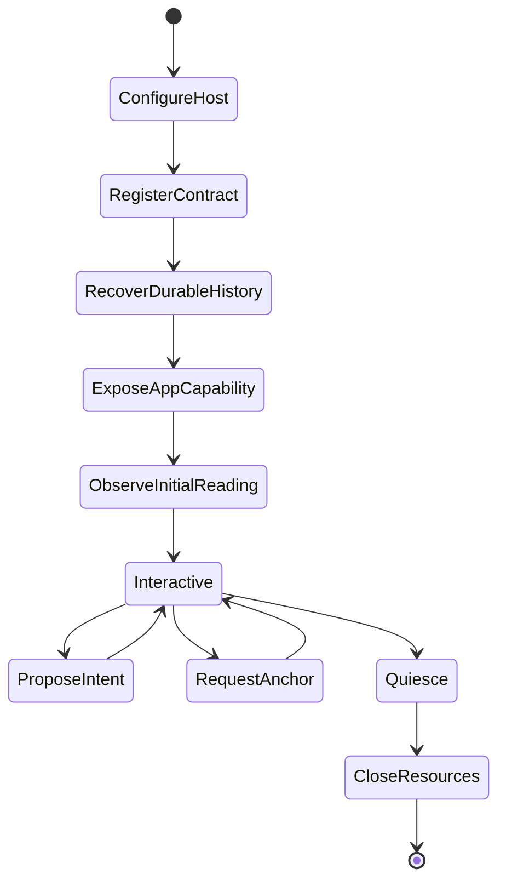
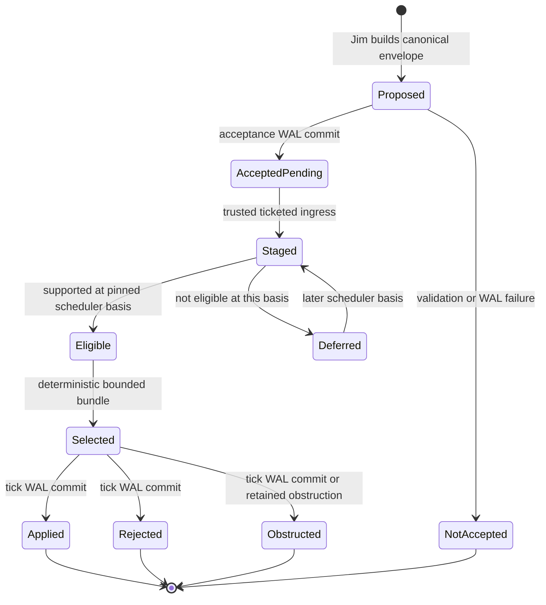
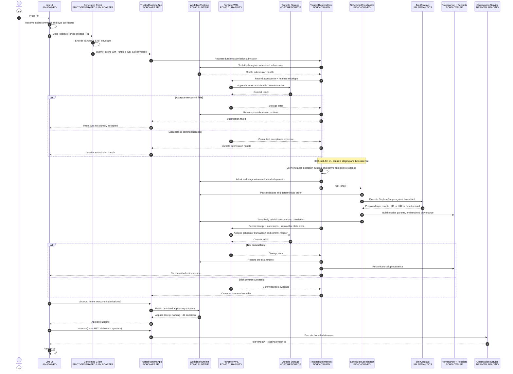
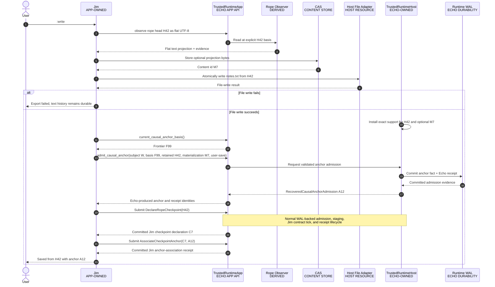
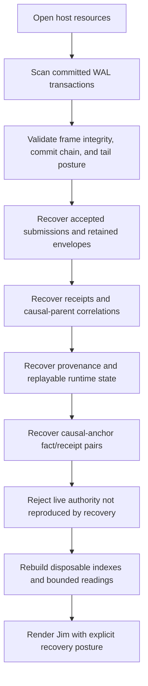

<!-- SPDX-License-Identifier: Apache-2.0 OR LicenseRef-MIND-UCAL-1.0 -->
<!-- © James Ross Ω FLYING•ROBOTS <https://github.com/flyingrobots> -->

# Case Study: Jim And Echo

This case study explains how Jim, a causality-aware text editor, uses Echo. It
follows one interaction all the way from a key press to a recovered editor
session:

```text
The user types "a", Jim applies the edit, the user saves, Jim exits, and the
next process reconstructs the same committed text history.
```

The example is intentionally deeper than a quickstart. It identifies who owns
each decision, where a proposal becomes durable, what evidence is authoritative,
which structures are projections, and what happens when a step fails.

## Scope And Truth Labels

This document uses three labels:

| Label                     | Meaning                                                                        |
| ------------------------- | ------------------------------------------------------------------------------ |
| Implemented               | The named `warp-core` API and recovery behavior exist now.                     |
| Application contract      | Jim must provide this domain behavior; Echo stays generic.                     |
| Architectural destination | The boundary is required, but the current implementation has not completed it. |

That distinction prevents an example from becoming accidental architecture.
In particular, the current trusted host persists submission acceptance, retained
intent material, scheduler outcomes, provenance, and causal-anchor admissions in
the runtime WAL. It does not yet publish submission acceptance as a first-class
`IntentAdmitted` fact in a unified causal graph. The WAL-backed indexes and
runtime queues are therefore the current recoverable implementation, not the
final graph-backed pending-intent hologram described by Echo's architecture.

The stable application rule is narrower and already enforceable:

> Jim proposes domain work through an application handle. Echo owns admission,
> scheduling, causal commit, receipt identity, recovery, and observation
> evidence. Jim never manufactures Echo authority.

## The Four Kinds Of State

Jim and Echo interact cleanly only when four different things remain distinct.

| Kind                     | Jim example                                                                     | Authority posture                                                       |
| ------------------------ | ------------------------------------------------------------------------------- | ----------------------------------------------------------------------- |
| Witnessed causal history | The admitted replace operation, its text rewrite, receipt, and save anchor      | Semantic history; Echo controls admission and causal ordering.          |
| Durable commit material  | Runtime WAL transactions and commit markers                                     | Current crash-recovery and linearization mechanism.                     |
| Materialized reading     | Rope projection, visible text window, syntax spans, line index, rendered screen | Derived from a named basis; rebuildable when support remains available. |
| Disposable accelerator   | Pending-intent index, layout cache, highlighted-line cache                      | Never authority; discard or rebuild on mismatch.                        |

A host file such as `notes.txt` is also a materialization. Writing it does not
replace Echo history. Conversely, an accepted edit is not the same thing as a
successful file export.

## Ownership Map

Jim is not a callback hidden inside Echo, and Echo is not Jim's application
framework. They meet through explicit contracts.

```mermaid
flowchart TB
    user["User"]
    ui["Jim UI and interaction model<br/>JIM-OWNED"]
    client["Generated contract client and Jim adapters<br/>EDICT-GENERATED / JIM ADAPTER"]
    app["TrustedRuntimeApp<br/>ECHO APP CAPABILITY"]
    host["TrustedRuntimeHost<br/>ECHO-OWNED"]
    contract["Installed Jim contract<br/>JIM SEMANTICS"]
    scheduler["SchedulerCoordinator<br/>ECHO-OWNED"]
    wal["Runtime WAL<br/>ECHO DURABILITY"]
    history["Witnessed causal history<br/>SEMANTIC AUTHORITY"]
    projections["Readings, rope windows, layout, caches<br/>DERIVED"]
    file["Host file and terminal<br/>HOST RESOURCES"]

    user --> ui
    ui --> client
    client --> app
    app --> host
    host --> wal
    host --> scheduler
    scheduler --> contract
    contract -->|"proposes domain rewrite or refusal"| scheduler
    scheduler -->|"commits witnessed outcome"| history
    history --> projections
    projections --> ui
    ui --> file
    wal -. "recovers committed history evidence" .-> history
```



| Participant               | Owns                                                                                                       | Must not own                                                                    |
| ------------------------- | ---------------------------------------------------------------------------------------------------------- | ------------------------------------------------------------------------------- |
| Jim UI                    | Key interpretation, modes, commands, status text, viewport policy                                          | Tick creation, WAL append, Echo receipt identity                                |
| Jim contract              | `ReplaceRange`, rope facts, text invariants, inverse law, domain checkpoint meaning                        | Generic scheduler policy, Echo admission claims                                 |
| Generated contract bridge | Typed Edict-authored operations, exact codecs where declared, operation ids, clients, and package metadata | Handwritten product policy, hidden authority, or Jim-specific runtime admission |
| `TrustedRuntimeApp`       | App-safe proposal and observation capability                                                               | Package installation, ticket fabrication, scheduler stepping, WAL mutation      |
| `TrustedRuntimeHost`      | Package registration, WAL configuration, support policy, staging, scheduler cadence, recovery              | Jim-specific text semantics                                                     |
| Scheduler                 | Basis pinning, deterministic eligibility and order, tick opportunity                                       | Meaning of a text replacement                                                   |
| Installed Jim contract    | Proposed DPO rewrite and typed refusal under Jim law                                                       | Commit publication or receipt minting                                           |
| Runtime WAL               | Atomic recoverable transaction material                                                                    | A second semantic model independent of causal history                           |
| Observation service       | Basis- and aperture-bounded readings with evidence posture                                                 | Ambient mutable access to all state                                             |
| CAS                       | Content-addressed bytes and artifacts                                                                      | Meaning, admission, retention policy, or causal order by itself                 |

## Application Lifecycle

An Echo application has a host lifecycle and an app lifecycle. The trusted host
must exist before Jim receives an application capability.



### 1. Construct The Trusted Host

Implemented API:

```rust
let runtime = WorldlineRuntime::new();
let engine = EngineBuilder::new(initial_store, root).build();
let mut host = TrustedRuntimeHost::new(runtime, engine)?;
```

The real Jim host also registers its initial worldline, writer head, and
deterministic starting state before accepting user work. Those values are
bootstrap evidence. Recovery must be able to reproduce or validate them; a
fresh process may not silently choose a different starting document and then
replay old receipts over it.

### 2. Propose, Then Install The Application Contract

Provider-native proof-owned installation:

```rust
let installed = install_digest_corroborated_provider_contract_package_v1(
    &mut host,
    corroborated_package,
)?;
```

Edict's generated helper and explicit host bindings produce an opaque
`ProviderContractPackageProposalV1`. The proposal retains generated registry
metadata and one host-supplied mutation binding after pure identity preflight.
`TrustedRuntimeHost` can now compare that occurrence claim and complete registry
with independent policy and return an opaque
`AdmittedProviderContractPackageV1`. This does not load or rehash package bytes,
construct the legacy Wesley `InstalledContractPackage`, register anything, or
mint execution authority. `echo-wesley-gen` now consumes that token with
independently admitted exact package bytes and returns an opaque corroborated
proof only when the provider coordinate and strict lowercase SHA-256 package
roots agree. Its proof-owning adapter consumes that token through a sealed
runtime-owner port. `TrustedRuntimeHost` then creates a distinct owned provider
record and atomically installs provider package, root, mutation-operation, and
shared scheduler-rule indexes without invoking the callback or inventing legacy
Wesley/GraphQL metadata. Jim retains its domain meaning. The installed record is
not yet provider-native ingress, invocation, WAL, receipt, or observation
authority.

Package installation is host authority. The application-facing handle cannot
replace the package after it has submitted work.

### 3. Open The Runtime WAL And Recover

For a user-facing editor, the host uses the filesystem adapter:

```rust
host.enable_runtime_wal(TrustedRuntimeWalConfig::filesystem(wal_root))?;
```

The in-memory adapter is useful for deterministic tests, but it is not process
durability.

`enable_runtime_wal(...)` performs more than opening a file. It:

1. acquires the writer epoch under host authority;
2. scans committed frames and commit markers;
3. rebuilds submission, receipt, provenance, runtime-state, and causal-anchor
   evidence;
4. rejects missing retained envelopes or replay state;
5. checks that existing live runtime authority is reproducible from the WAL;
6. restores witnessed submissions and causal runtime history; and
7. publishes the recovered runtime only after validation succeeds.

Recovery precedes new scheduling. Jim must never reconstruct a queue first and
infer history from whatever happened to be in it.

### 4. Install Host Support Policy

Causal anchors can name roots that Echo does not understand semantically. A
trusted Jim host adapter supplies exact support grants:

```rust
host.install_causal_anchor_root_support_policy(policy);
```

The app handle cannot install this policy. That prevents application code from
declaring its own arbitrary root authoritative and then asking Echo to bless it.
The host may replace the exact policy as newly admitted application roots or CAS
objects become supportable. It need not preauthorize rope heads that do not yet
exist.

### 5. Hand Jim The App Capability

Implemented API:

```rust
let mut app = host.app();
```

`TrustedRuntimeApp` can submit application intent, ask for the current causal
anchor basis, request an anchor, look up an admitted anchor, and observe. It
cannot call `tick_once`, register packages, stage trusted ingress, append WAL
records, replace support policy, or perform recovery.

The Rust handle is a scoped borrow of the host, not an independently owned
runtime. The host regains control between app calls to install support, stage
work, and run scheduler passes without exposing those powers to Jim.

That negative space is part of the API contract.

### 6. Observe The Initial Editor Reading

Jim requests a bounded reading with an explicit basis, aperture, budget, and
observer plan. The result is an `ObservationArtifact` and reading evidence, not
an ambient graph pointer.

For a text editor, the aperture might name:

- one buffer worldline;
- the current rope head;
- the UTF-8 byte window needed for visible lines;
- the line-index region needed for the gutter; and
- syntax and provenance overlays permitted for this observer.

Jim decodes that application reading and renders it. If required evidence is
missing, stale, outside budget, or unsupported, Jim renders a typed obstruction
instead of pretending an empty buffer is success.

## Intent Lifecycle

An intent is not simply "queued" or "done." Different lifecycle claims have
different authorities and durability.



| Lifecycle term   | Precise claim                                                           | Durable posture                                                  |
| ---------------- | ----------------------------------------------------------------------- | ---------------------------------------------------------------- |
| Proposed         | Jim has canonical intent bytes in caller memory.                        | No                                                               |
| Accepted pending | Echo committed acceptance plus the retained envelope.                   | Yes                                                              |
| Staged           | Trusted host projected accepted work into ticketed runtime ingress.     | Rebuildable from retained evidence; not independent authority    |
| Eligible         | At one pinned basis, support and scheduler policy permit consideration. | A reading, not an eternal flag                                   |
| Selected         | Deterministic scheduler chose the intent for a tentative tick bundle.   | Normally recorded with settlement, not a separate precommit fact |
| Applied          | The application rewrite and its receipt committed.                      | Yes                                                              |
| Rejected         | Named law produced a committed refusal or conflict outcome.             | Yes                                                              |
| Obstructed       | Required support or evidence prevented a lawful success claim.          | Retained when the corresponding outcome commits                  |
| Deferred         | The intent remains accepted but is not eligible at this basis.          | Acceptance remains durable; eligibility is recomputed            |

`AcceptedPending` is the ACK boundary exposed by the current trusted runtime.
`Eligible` can change when the scheduler basis changes, so Echo must derive it
from supported history rather than mutate a permanent boolean. `Selected` is
tentative until the complete tick transaction commits. A process crash cannot
turn either tentative state into an applied edit.

Application code should use "admitted" only when it names the exact admission
claim being made. Shape validation, API acceptance, WAL durability, scheduler
eligibility, bundle selection, and settled application outcome are not
synonyms.

## Full Interaction: Type `a`

Assume the cursor is at UTF-8 byte offset 12 in rope head `H41`. The user presses
`a` in insert mode. Jim's intended domain operation is:

```text
ReplaceRange {
    worldline: W,
    basisHead: H41,
    byteRange: 12..12,
    replacementUtf8: "a"
}
```

UTF-8 byte offsets are the authoritative mutation coordinate for the rope.
Jim's UI separately maps terminal cells, grapheme movement, UTF-16 integration
coordinates, and line/column display onto that byte coordinate. The intent must
name the basis head it expects; "insert at whatever head is current later" is
not a deterministic operation.

### End-To-End Sequence

The following sequence describes the current trusted-host path. The two WAL
commits are the implemented durability boundaries. The application rewrite is
Jim-owned semantics executed only during Echo-owned scheduler control.



### Step Table

| Step | Owner            | Input                                        | Authoritative change                   | Failure behavior                                             |
| ---: | ---------------- | -------------------------------------------- | -------------------------------------- | ------------------------------------------------------------ |
|    1 | Jim UI           | Key event and current UI mode                | None                                   | Invalid key mapping remains a UI event.                      |
|    2 | Jim              | Cursor projection and rope reading           | None                                   | A stale or unavailable coordinate obstructs intent creation. |
|    3 | Generated client | Typed `ReplaceRange`                         | None                                   | Encoding failure produces no proposal.                       |
|    4 | Echo app API     | Canonical ingress envelope                   | Tentative runtime intake only          | No WAL means explicit `RuntimeWalUnavailable`.               |
|    5 | Echo WAL         | Acceptance record and retained envelope      | Committed accepted-submission evidence | On failure, runtime intake rolls back.                       |
|    6 | Trusted host     | Submission id and Echo ticket                | Ticketed ingress projection            | Unknown or unsupported submission is rejected.               |
|    7 | Scheduler        | Pinned runtime basis and candidates          | Tentative tick plan                    | Jim cannot choose bundle membership.                         |
|    8 | Jim contract     | Basis `H41`, range, replacement              | Proposed rope rewrite                  | Stale basis or invalid UTF-8 yields typed refusal.           |
|    9 | Echo             | Contract result and causal parents           | Tentative outcome, receipt, provenance | Inconsistent evidence aborts the tick.                       |
|   10 | Echo WAL         | Receipt, correlation, replayable state delta | Committed scheduler-tick evidence      | Runtime and provenance roll back if commit fails.            |
|   11 | Jim              | Submission id                                | None; reads committed outcome          | Pending remains pending; missing is not rejection.           |
|   12 | Observer         | Basis `H42`, aperture, budget                | None; returns a reading                | Missing support yields typed obstruction.                    |
|   13 | Jim UI           | Reading payload                              | Terminal pixels only                   | Rendering never mutates text authority.                      |

The current filesystem host accepts at most one newly correlated scheduler
outcome per `tick_once()` call. If one pass would require multiple filesystem
tick transactions, it returns `FilesystemAtomicBatchUnsupported` and restores
the pre-pass runtime and provenance. This is an implementation constraint, not
a license for Jim to split one semantic operation into unrelated commits or to
bypass the trusted host. Host cadence and future atomic batch support must keep
the transaction boundary explicit.

### Why Acceptance And Application Are Separate

The acceptance transaction means:

```text
Echo can recover this exact proposed intent and its pending posture.
```

It does not mean:

```text
The text already contains "a".
```

The scheduler-tick transaction means that Echo can recover the decided outcome,
receipt correlation, and replayable application transition. This separation is
why a crash after acceptance but before execution recovers as
`accepted_pending`, not as a lost key press and not as an applied edit.

### Idempotent Retry

The canonical ingress envelope determines stable submission identity. If Jim
retries after losing an ACK:

1. Echo compares the submission and canonical envelope identity.
2. If the same acceptance already committed, Echo returns the duplicate handle
   without recording a second proposal.
3. If no matching commit exists, the proposal follows normal intake.
4. Conflicting evidence is an error, not a "last write wins" update.

The UI may retry transport. It may not create a new semantic operation merely
because it is uncertain whether the first network or process response arrived.

### No-Op Edit

If replacing the range yields identical text, Jim's contract should not mint a
new rope head, rewrite, or diff. Echo may still retain admission and settlement
evidence saying that the proposal was observed and had no text effect. Receipt
evidence and text mutation evidence answer different questions.

## What The Jim Contract Does

Echo does not contain a built-in text editor. Jim's installed contract must
enforce the text-domain invariants.

For the `ReplaceRange` example, the contract is responsible for:

1. validating the named worldline and basis rope head;
2. validating UTF-8 byte-range boundaries;
3. resolving the touched rope leaves;
4. path-copying only changed branches;
5. preserving untouched subtree identity;
6. creating replacement blobs, leaves, and balanced branch structure;
7. emitting `RopeHead`, `RopeRewrite`, and `RopeDiff` facts when text changes;
8. returning a typed no-op or obstruction when appropriate; and
9. defining the inverse law used by causal undo.

Echo is responsible for running that law at a deterministic scheduler basis,
committing the result, retaining the receipt and causal parents, and recovering
the result without asking the contract to run again.

That split lets another Echo application define completely different nouns and
laws without teaching Echo about ropes.

## Causal Undo And Redo

After the insert receipt `T42` commits, undo is not a process-local stack pop.
Jim asks its installed contract to derive an inverse intent from retained causal
evidence:

```text
InverseIntent {
    targetReceipt: T42,
    currentBasisReceipts: [...],
    inverseOperation: ReplaceRange(...)
}
```

Implemented API:

```rust
app.submit_contract_inverse_with_runtime_wal_ack(request)?;
```

Echo validates the exact target receipt, retained original envelope, installed
contract identity, current frontier, and inverse law. The inverse then follows
the same acceptance, scheduling, tick, receipt, observation, and recovery path
as any other intent.

Redo is another causal operation, typically an inverse of the committed inverse.
Neither operation moves an invisible mutable pointer through an in-memory list.

Cursor movement requires a product decision. If cursor state must survive
restart, participate in collaboration, or support `:why`, Jim should model it
as admitted application intent and recoverable reading. A purely local hover or
temporary render cursor can remain transient UI state. The deciding question is
whether forgetting the action would violate the product contract.

## Save: Admit A Causal Anchor

The edit is already durable after its scheduler transaction commits. "Save"
therefore means materializing a named text basis to the host file projection and
recording why that basis matters. It does not make previously volatile text
safe.

Assume the edit produced rope head `H42`.

### Save Sequence



The exact ordering between external file publication and anchor admission must
be part of Jim's save law. The currently implemented causal anchor proves that
Echo admitted the subject, basis, roots, purpose, policy, and WAL coordinate. It
does not by itself prove that `notes.txt` was renamed or synced successfully.
If Jim wants that claim, the host file adapter needs its own retained export
receipt and the domain checkpoint must bind it.

### Anchor Request

Jim asks Echo for the current basis rather than inventing one:

```rust
let basis = app.current_causal_anchor_basis()?;
let admission = app.admit_causal_anchor(CausalAnchorAdmissionRequest {
    schema_version: CAUSAL_ANCHOR_SCHEMA_VERSION,
    subject: CausalAnchorSubject::new(
        "jedit",
        "BufferWorldline",
        worldline_id,
    ),
    basis_frontier: basis,
    retained_roots: vec![rope_head_root],
    materialization_roots: vec![flat_text_cas_root],
    purpose: CausalAnchorPurpose::UserSave,
})?;
```

The returned `RecoveredCausalAnchorAdmission` contains:

- the canonical claim;
- the Echo-created `CausalAnchorFact`;
- the Echo-created `CausalAnchorAdmissionReceipt`;
- the WAL transaction id;
- the committed LSN; and
- the transaction commit digest.

Jim copies those opaque identities into its adapter or checkpoint-anchor
association. It must not recompute `anchorId`, `anchorDigest`, or
`admittedByReceiptId`.

The Jim `RopeCheckpointDeclaredFact` is application history independent of
Echo retention policy. When save law requires an anchor, a separate
`RopeCheckpointAnchoredFact` associates that declaration with the
Echo-produced anchor. Both facts must be produced by Jim contract operations
through the normal intent lifecycle. Receiving
`RecoveredCausalAnchorAdmission` does not authorize Jim to append either domain
fact directly to a graph or local array.

The value-only constructor
`CausalAnchorClaim::from_admission_request(...)` is useful for canonical
validation. It does not admit an anchor and must not produce an
`authority: echo` posture.

## Shutdown Without A Traditional Save Gate

Jim's desired product contract is "the editor never forgets." That requires a
shutdown gate based on Echo evidence, not classic dirty-buffer state.

Before normal process exit, Jim should distinguish:

| State                                                  | Exit meaning                                            |
| ------------------------------------------------------ | ------------------------------------------------------- |
| Key exists only in UI event queue                      | Not durable; finish submission or report failure.       |
| Submission has WAL-backed acceptance                   | Recoverable as pending even if not yet applied.         |
| Scheduler receipt and replayable state delta committed | Applied edit and provenance are recoverable.            |
| Host file projection is older than current head        | Text is safe in Echo, but external file is not current. |
| Cursor/session projection is not modeled causally      | Text recovers, but exact UI session does not.           |

The ideal interactive loop submits each meaningful edit through the WAL-backed
path before presenting it as safely accepted. It may batch rendering and
observation work, but it must not let a cache or terminal frame become the only
copy of user-authored intent.

Jim does not need to force a file save merely to preserve text history. It may
still warn that a requested export is stale, unsupported, or failed.

## Restart And Recovery

On restart, the trusted host reconstructs authority before Jim renders a normal
editing surface.



### Recovery Outcomes

| Recovered posture  | Jim behavior                                                                                 |
| ------------------ | -------------------------------------------------------------------------------------------- |
| `accepted_pending` | Keep the intent pending and permit normal scheduler consideration after startup gates pass.  |
| `decided_applied`  | Reconstruct the rope transition and show the resulting text reading.                         |
| `decided_rejected` | Preserve the proposal and refusal evidence; do not apply text.                               |
| `obstructed`       | Explain missing or incompatible evidence; do not guess state.                                |
| `recovery_faulted` | Refuse writable startup until the durable-history problem is repaired or explicitly handled. |

Recovery does not rerun Jim's contract to rediscover what probably happened.
The scheduler transaction retains the exact receipt, correlation, installed
contract evidence, and replayable state delta needed to reconstruct the result.

The BTR, hologram cache, text window cache, syntax cache, and layout cache may
all be cold. Jim can rebuild them from the recovered basis. A cache miss is a
performance event, not lost history.

## Failure Matrix

| Failure                                         | Required outcome                                                                       |
| ----------------------------------------------- | -------------------------------------------------------------------------------------- |
| Intent encoding fails                           | No submission exists.                                                                  |
| Runtime WAL unavailable                         | WAL-backed app submission returns a typed error before acceptance.                     |
| Acceptance append fails before commit           | Restore pre-submission runtime; do not return a durable handle.                        |
| Process dies after acceptance commit            | Recover the exact retained envelope as accepted pending.                               |
| Ticket/support resolution fails                 | Preserve accepted proposal; expose a typed obstruction or pending posture.             |
| Jim contract refuses stale basis                | Commit the refusal posture as designed; do not rewrite current text.                   |
| Scheduler evidence is internally inconsistent   | Abort and restore pre-tick runtime/provenance.                                         |
| Tick append fails before commit                 | Do not expose the tentative applied outcome.                                           |
| Filesystem reports an error after commit        | Re-scan; return success only if the exact committed evidence recovers.                 |
| Observation cache is stale                      | Rebuild or return typed obstruction; never mutate authority to match cache.            |
| File export fails                               | Echo text history remains intact; save/export posture remains failed.                  |
| Anchor basis is stale                           | Request the current basis and reconsider the save operation; do not silently retarget. |
| Anchor root lacks host support                  | Refuse admission; application claims cannot grant their own support.                   |
| Anchor WAL commit fails                         | Publish no anchor authority.                                                           |
| Recovery finds malformed or incomplete evidence | Fail closed with a recovery obstruction.                                               |

## Current Implementation Versus Architectural Destination

The current API demonstrates the intended ownership split, but its internal
control-plane representation is not the final architecture.

### Implemented Now

- Application code receives `TrustedRuntimeApp`, not scheduler or WAL control.
- WAL-backed submission returns only after committed acceptance evidence.
- The canonical ingress envelope is retained with acceptance.
- Scheduler outcomes retain receipt, causal parents, contract evidence,
  provenance, and replayable state material.
- Filesystem recovery reconstructs submissions, outcomes, state, and anchors
  without rerunning Jim callbacks.
- Causal undo targets exact recovered receipt coordinates.
- Causal anchors are app-requested, host-supported, Echo-admitted, and recovered
  as fact/receipt pairs.
- Observations are explicit-basis, bounded, budgeted readings.

### Architectural Destination

- Echo admission should publish typed control facts such as `IntentAdmitted`
  into witnessed causal history through a kernel-owned transition.
- A pending-intent hologram should derive candidates from admitted minus settled,
  cancelled, expired, or superseded intents at a pinned frontier.
- `HeadInbox` and equivalent maps should be disposable indexes over that
  history, not the only authority saying work exists.
- Receipt lookup, undo candidates, and scheduler queues should be witnessed
  projections over causal facts.
- BTR checkpoints may record basis and artifact witnesses, but the BTR artifact
  must remain a reading rather than history.

This destination does not change Jim's authority boundary. It changes Echo's
internal implementation so the graph-backed causal model fully supports the
contract already presented to applications.

## How To Build Another Echo Application

The Jim example generalizes into a practical checklist.

### Define Domain Semantics

1. Name application facts and operations in the application contract.
2. Choose authoritative coordinates explicitly.
3. Define mutation law, refusal/obstruction outcomes, and inverse law.
4. Define bounded observers and their evidence requirements.
5. Keep application nouns out of Echo core.

### Generate, Propose, And Install The Bridge

1. Author Jim operation semantics in Edict, keeping mutating DPO semantics
   distinct from bounded read/optic semantics.
2. Admit the exact source and run the target-specific lowerer and independent
   verifier without rediscovering or inventing meaning.
3. Generate operation ids, exact codecs where declared, clients, descriptors,
   digests, and provenance; bind supported mutation handlers into an opaque,
   non-installing provider proposal while keeping bounded observers on their
   separate read path.
4. Pass the preflighted proposal through independent trusted-host policy to
   obtain an opaque admitted token, then corroborate it with the independently
   admitted exact package proof. Consume that proof through the sealed
   runtime-owner installer to construct the provider-native owned record and
   atomically populate Echo's package, root, operation, and scheduler-rule
   indexes. This does not invoke the handler or fabricate runtime receipts.
5. Give product code only generated clients and `TrustedRuntimeApp`.

### Submit Work

1. Build canonical intent bytes at an explicit application basis.
2. Use `submit_intent_with_runtime_wal_ack(...)` for user-facing durable work.
3. Treat the returned handle as accepted-submission evidence, not an applied
   result.
4. Let trusted host control stage and tick.
5. Observe the decided outcome by submission id.

### Read State

1. Name the basis and bounded aperture.
2. Supply observer authority and budget.
3. Decode the application payload from an Echo reading envelope.
4. Handle stale, partial, redacted, missing, and obstructed evidence explicitly.
5. Cache readings only under complete basis, aperture, observer, policy, schema,
   and materializer identity.

### Preserve Meaningful Boundaries

1. Store bytes in CAS when content addressing is useful.
2. Request a causal anchor when an application basis has durable meaning.
3. Keep authority roots separate from materialization roots.
4. Attach domain meaning with an application fact that references the
   Echo-produced anchor id.
5. Never derive Echo receipt or anchor identity in application code.

### Recover Before Serving Writes

1. Recover committed Echo evidence.
2. Validate the bootstrap boundary and installed contract identity.
3. Rebuild or load witnessed projections at the recovered basis.
4. Surface typed recovery posture to the product.
5. Enable scheduling and writes only after those gates pass.

## Anti-Patterns

Do not build an Echo application this way:

```text
UI mutates local state
-> app writes a file eventually
-> app invents a receipt id
-> queue is called "causal history"
-> restart guesses what happened
```

Specific violations include:

- calling a value constructor and labelling the result Echo-admitted;
- letting an app callback call `tick_once`;
- treating an admission ticket as an execution receipt;
- considering an edit applied before scheduler WAL commit;
- using a host file as the only durable text authority;
- using a process-local undo stack for user-facing history;
- recomputing Echo ids in TypeScript;
- reading "current state" without a named basis;
- serving a privileged cached projection to another observer class;
- rolling back committed history because a projection update failed; and
- flattening the whole causal graph into a snapshot for every save.

## Source Map

| Concern                                       | Current implementation or documentation                                                                             |
| --------------------------------------------- | ------------------------------------------------------------------------------------------------------------------- |
| App-safe and host-owned runtime surfaces      | [`trusted_runtime_host.rs`](../../crates/warp-core/src/trusted_runtime_host.rs)                                     |
| Runtime scheduling and ingress                | [`coordinator.rs`](../../crates/warp-core/src/coordinator.rs)                                                       |
| Causal WAL transaction and recovery contracts | [`causal_wal.rs`](../../crates/warp-core/src/causal_wal.rs)                                                         |
| Causal-anchor values and identity             | [`causal_anchor.rs`](../../crates/warp-core/src/causal_anchor.rs)                                                   |
| Causal-anchor architecture                    | [Causal Anchors](../topics/CausalAnchors.md)                                                                        |
| WAL durability and recovery                   | [WAL](../topics/WAL.md)                                                                                             |
| Application package boundary                  | [Application Contract Hosting](../architecture/application-contract-hosting.md)                                     |
| Bounded observation model                     | [WARP Optics](../topics/WarpOptics.md)                                                                              |
| Inverse intent admission                      | [Contract Inverse Admission](../topics/ContractInverseAdmission.md)                                                 |
| Executable trusted-host witnesses             | [`trusted_runtime_host_loop_tests.rs`](../../crates/warp-core/tests/trusted_runtime_host_loop_tests.rs)             |
| External anchor consumer witness              | [`causal_anchor_external_consumer_tests.rs`](../../crates/warp-core/tests/causal_anchor_external_consumer_tests.rs) |

## Final Model

The shortest correct account of Jim on Echo is:

```text
Jim owns what an edit means.
Echo owns whether and when that edit becomes witnessed causal history.
The WAL makes committed transitions recoverable.
Observers turn a named causal basis into bounded editor readings.
CAS stores addressed content but grants no meaning by itself.
Causal anchors name durable application boundaries without becoming snapshots.
Jim renders and exports those readings without replacing their authority.
```

That is how Jim can feel like an editor that never forgets without making the
terminal, the host file, an in-memory undo stack, or a cache pretend to be
history.
