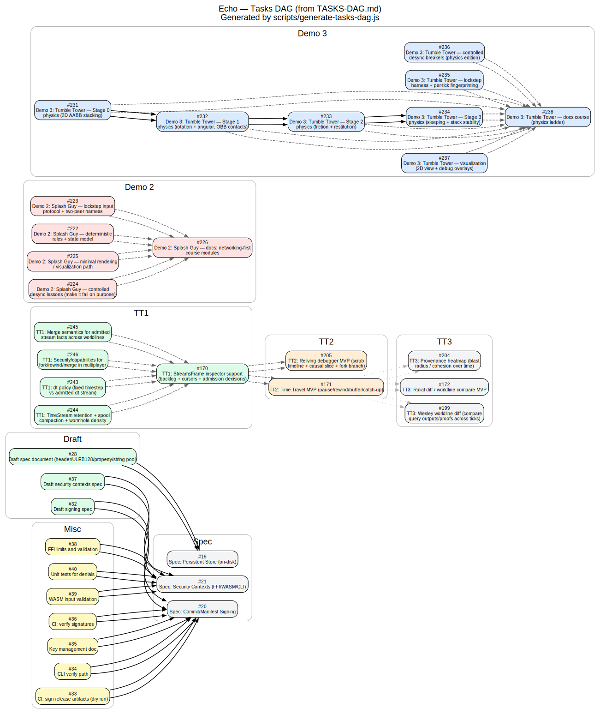

<!-- SPDX-License-Identifier: Apache-2.0 OR MIND-UCAL-1.0 -->
<!-- © James Ross Ω FLYING•ROBOTS <https://github.com/flyingrobots> -->
# Tasks DAG (from TASKS-DAG.md)

This diagram is generated directly from the `TASKS-DAG.md` file, which tracks open issues and their **inferred** dependencies (blocks/blocked-by relationships detected from issue bodies and "Detective Mode" logic).

It serves as a comparison point against the manually curated or config-driven DAGs in `docs/dependency-dags.md`.

---

## Task Dependency Graph



Sources:
- Source Data: `TASKS-DAG.md`
- Generator: `scripts/generate-tasks-dag.js`
- DOT: `docs/assets/dags-2/tasks-dag.dot`
- SVG: `docs/assets/dags-2/tasks-dag.svg`

---

## Regenerating

To regenerate this graph from the current state of `TASKS-DAG.md`:

```sh
node scripts/generate-tasks-dag.js
```

(Requires Node.js and Graphviz `dot` installed).
