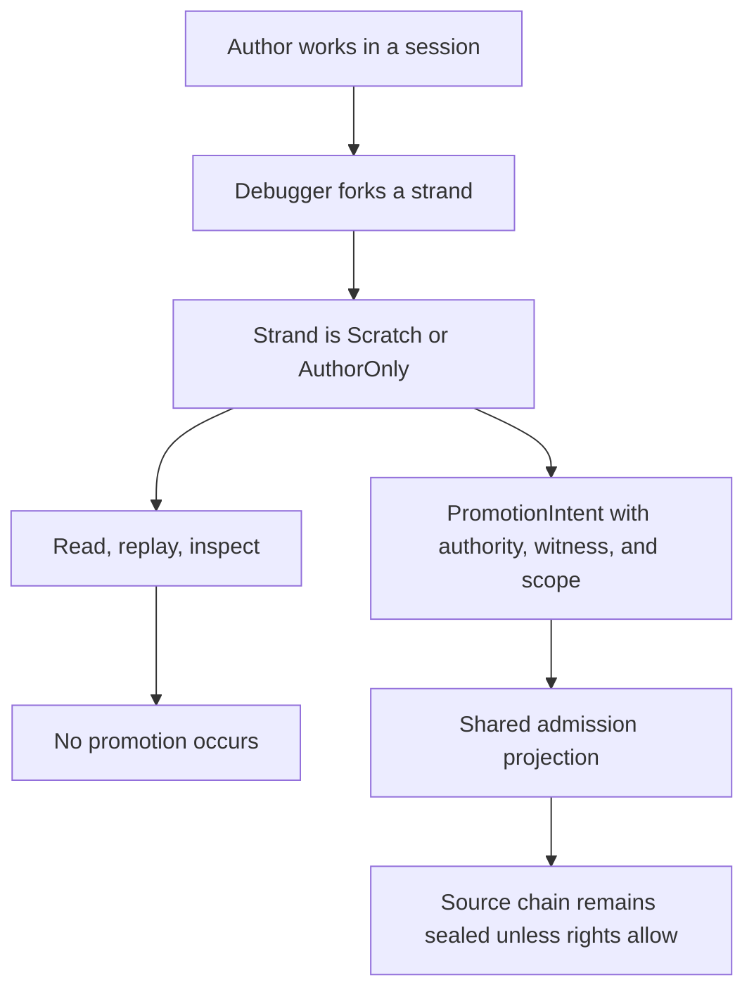
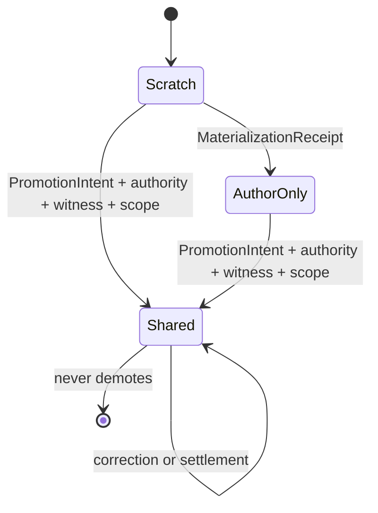

<!-- SPDX-License-Identifier: Apache-2.0 OR LicenseRef-MIND-UCAL-1.0 -->
<!-- © James Ross Ω FLYING•ROBOTS <https://github.com/flyingrobots> -->

<!-- prettier-ignore-start -->
<!-- markdownlint-disable -->
---
title: "PLATFORM-0027 - Three-Tier Thinking Room"
legend: "PLATFORM"
lane: "design"
issue: "https://github.com/flyingrobots/echo/issues/538"
status: "approved"
owners:
  - "@flyingrobots"
created: "2026-06-13"
updated: "2026-06-13"
---
<!-- markdownlint-enable -->
<!-- prettier-ignore-end -->

# PLATFORM-0027 - Three-Tier Thinking Room

_Make causal/revelation posture and authority domains first-class before
strand, braid, settlement, and session APIs harden around implicit shared
visibility._

## Linked Issue

- [Issue #538](https://github.com/flyingrobots/echo/issues/538)

## Decision Summary

Echo will add a first-class `CausalPosture` model for work that can exist
causally without being admitted into shared history:
`Scratch | AuthorOnly | Shared`. This is not a UI privacy flag. Posture
defines retention, replay, revelation, admission status, settlement
eligibility, and shell disclosure. The design also adds the missing authority
shim: `AuthorOnly` binds to an `AuthorityDomainRef`, not a human, user, or
display name, so Echo can ship the causal schema now without pretending full
identity is solved.

Review verdict: `APPROVED`. This packet incorporates the mandatory amendments
for posture, authority, admission scope, projection, legacy derivation, import
quarantine, and materialization. Implementation may proceed with RED tests for
Slice B/C.

This packet is a design-only approval point. No RED/GREEN implementation
starts until this design is approved.

## Sponsored Human

An author using debugger, assistant, replay, and counterfactual tools wants
private speculative work to be durable and replayable without becoming shared
causal truth, so that admitting a result does not accidentally reveal every
scratchpad fork, failed hypothesis, replay trace, or tool-created strand that
led to it.

## Sponsored Agent

An agent needs explicit posture and authority fields on session-attributed
work, strand creation, retained strand provenance, and shell revelation so it
can inspect, replay, settle, and promote causal objects without inferring
privacy or admission status from storage, branch names, display labels, host
names, Git authors, or tool identities.

## Hill

By the end of this cycle, every new strand/session-attributed retained work
item has an explicit posture and authority domain. Debugger and
counterfactual work defaults to `Scratch` or `AuthorOnly`, never implicit
`Shared`. Reads, replay, and inspection remain revelation-only operations and
cannot promote work. Promotion to `Shared` is represented as a witnessed
causal admission operation that can expose a shared projection without
revealing its sealed source chain.

## Current Truth

Merge target truth is `origin/main` at
`a0af2512800be030e80fb39914c7d3d1a3d8fb89`.

- E0-lite already exists. `RevelationPosture` defines
  `Scratch | AuthorOnly | Shared` and defaults to `AuthorOnly`:
  [crates/warp-core/src/revelation.rs#L37:a0af2512800be030e80fb39914c7d3d1a3d8fb89](https://github.com/flyingrobots/echo/blob/a0af2512800be030e80fb39914c7d3d1a3d8fb89/crates/warp-core/src/revelation.rs#L37).
- Promotion already requires `WitnessDigest` at the shell/revelation helper
  layer:
  [crates/warp-core/src/revelation.rs#L172:a0af2512800be030e80fb39914c7d3d1a3d8fb89](https://github.com/flyingrobots/echo/blob/a0af2512800be030e80fb39914c7d3d1a3d8fb89/crates/warp-core/src/revelation.rs#L172).
- `Strand` does not carry posture, authority, origin, actor, retention
  contract, or promotion/admission state. It currently carries identity,
  fork basis, child worldline, writer heads, and support pins:
  [crates/warp-core/src/strand.rs#L135:a0af2512800be030e80fb39914c7d3d1a3d8fb89](https://github.com/flyingrobots/echo/blob/a0af2512800be030e80fb39914c7d3d1a3d8fb89/crates/warp-core/src/strand.rs#L135).
- `ForkBasisRef` pins the source coordinate but does not say who controls
  revelation or whether the resulting strand is scratch, author-only, or
  shared:
  [crates/warp-core/src/strand.rs#L85:a0af2512800be030e80fb39914c7d3d1a3d8fb89](https://github.com/flyingrobots/echo/blob/a0af2512800be030e80fb39914c7d3d1a3d8fb89/crates/warp-core/src/strand.rs#L85).
- Design 0025 makes `Session` a durable causal-context node, but its v1 shape
  does not carry `default_posture`, `origin_id`,
  `actor_id`, `author_domain`, authority binding, seal strength, or retention
  contract:
  [docs/design/0025-sessions-as-causal-contexts/design.md#L128:a0af2512800be030e80fb39914c7d3d1a3d8fb89](https://github.com/flyingrobots/echo/blob/a0af2512800be030e80fb39914c7d3d1a3d8fb89/docs/design/0025-sessions-as-causal-contexts/design.md#L128).
- Design 0026 explicitly deferred the full tier-posture system on strand
  creation to issue #538, while landing E0-lite posture for braid shells:
  [docs/design/0026-braid-shell-family-and-plural-settlement/design.md#L67:a0af2512800be030e80fb39914c7d3d1a3d8fb89](https://github.com/flyingrobots/echo/blob/a0af2512800be030e80fb39914c7d3d1a3d8fb89/docs/design/0026-braid-shell-family-and-plural-settlement/design.md#L67).

## Problem

Echo currently has a shell-level posture helper, but the causally important
creation surfaces still have no posture or authority contract. If strands,
sessions, braid inputs, settlement scans, and shell revelation mature while
silently treating "retained" as "shared," author sealing becomes a breaking
retrofit. The damage would not be cosmetic: every caller would have learned
the wrong ontology.

The central invariant is:

> A strand may causally exist without being admitted into shared history.

That sentence must become type/schema shape before E2 holographic strand
origins and E3 N-strand braid reducer/weave work harden the strand model.

The second invariant is:

> Posture determines how a causal object may be revealed or admitted.
> Authority determines who may perform revelation or admission. Identity is
> only a later way to resolve authority to a human or organization.

Without that separation, "AuthorOnly" collapses into either a UI flag or a
fake access policy.

## Scope

This cycle includes:

- The canonical posture concept: `CausalPosture = Scratch | AuthorOnly |
Shared`.
- A compatibility decision for existing `RevelationPosture`: it is the E0-lite
  shell-local predecessor. Implementation must rename it to `CausalPosture`
  with a deprecated compatibility alias. Two divergent posture enums are
  forbidden.
- A minimal authority-domain substrate:
  `OriginId`, `ActorId`, `AuthorityDomainId`, `AuthorityDomainRef`,
  `AuthorityBinding`, `CapabilityProof`, and `SealStrength`.
- Canonical authority equality across machines. Display labels never
  participate.
- `AdmissionScopeId` for `Shared` posture, including the rule that
  source-shared imported material is not automatically locally admitted.
- `PostureDerivation`, so legacy-compatible posture assumptions are auditable
  instead of erased.
- A `RetentionPosture` or equivalent bundle tying `CausalPosture`, authority,
  admission scope, derivation, and retention contract Lambda together.
- Session design updates requiring `default_posture`, `origin_id`, `actor_id`,
  `author_domain`, `authority_binding`, `seal_strength`,
  `default_admission_scope`, and `retention_contract`.
- Strand creation/provenance shape requiring explicit posture and authority
  on the created strand.
- Promotion/admission doctrine: moving work to `Shared` is an explicit,
  witnessed causal operation that creates an append-only shared admission or
  projection; it does not silently flip a sealed source object public.
- Materialization doctrine: moving `Scratch` work into durable `AuthorOnly`
  retention requires an explicit save/materialization operation and receipt.
- Revelation doctrine: read, replay, inspect, and debug-view are
  revelation-only and never promote.
- Operation-specific denial modes for `GetById`, `List`, `Replay`, `Inspect`,
  `SettlementScan`, and `ProvenanceTrace`.
- Explicitly ugly privileged raw-access APIs for recovery-only bypasses.
- Required import quarantine namespaces for unresolved foreign material.
- A generated posture matrix and constructor posture lint in the implementation
  witness plan.
- Legacy behavior: persisted durable records missing posture load as `Shared`
  for compatibility; ephemeral missing-posture records load as `Scratch`;
  new durable records missing posture or authority are invalid.

## Required Amendments Before Approval

- `CausalPosture` MUST NOT implement global `Default`. Default posture may
  only be chosen by explicit session/tool constructors or migration code.
- Authority equality across machines MUST be defined by canonical
  `AuthorityDomainRef` or equivalent global authority-domain construction.
  `AuthorityDomainId` alone is not sufficient unless globally
  content-addressed.
- Revelation APIs MUST accept an `ObserverContext` / authority context rather
  than depending on unresolved human identity. `PrincipalId` may only be used
  if it is explicitly an authority/capability context, not display identity.
- `Shared` posture MUST carry or reference an `AdmissionScopeId`; imported
  source-shared material is not automatically locally admitted.
- Promotion/admission records MUST include authorization basis, authority
  resolution proof, admission scope, and projection/source-disclosure policy.
- Legacy posture assumptions MUST be recorded as derivation state, not erased
  as if explicit admission had occurred.
- `Scratch -> AuthorOnly` MUST be represented as an explicit materialization
  or save operation when it creates durable retained work.
- `RevelationPosture` MUST be renamed to `CausalPosture` with a deprecated
  compatibility alias instead of remaining a parallel enum.
- Shared projections MUST include source-disclosure policy.
- Imported source-shared material MUST have a regression test proving it is not
  locally admitted without a local admission scope.
- Revelation denial MUST be operation-specific.
- Privileged raw access MUST be intentionally named as a doctrine bypass.
- The initial authority bridge MUST include capability proofs usable before
  full identity exists.
- Unresolved imports MUST enter explicit quarantine/pending-admission
  namespaces.
- The implementation witness plan MUST include a posture matrix and a
  constructor posture lint.

## Non-Goals

This cycle does not include:

- Full human/user/team identity.
- Cryptographic author-domain keys, encryption, or cross-machine key
  delegation implementation.
- Full ACL policy language.
- Full 0025 session Phase 2 implementation.
- E2 holographic strand origins.
- E3 N-strand braid reducer/weave or collapse-policy library.
- Generalized import-shell theta_rep implementation.
- Demotion of shared history. Once shared, later changes are redactions,
  revocations, tombstones, corrections, or settlements, not demotion.

## User Experience / Product Shape

Not a rendered UI cycle. The product-visible behavior is semantic:

- debugger forks default to `Scratch`;
- saved debugger or counterfactual traces default to `AuthorOnly`;
- ordinary collaborative work becomes `Shared` only when the action is
  explicitly shared/admitted;
- replay and inspection preserve the source posture;
- settlement ignores non-`Shared` strands unless the settlement intent carries
  explicit promotion/admission authority;
- shared admission may reveal a final projection while leaving the sealed
  source strand opaque.

### User Journey



### Wide UI Mockup

Not applicable. No rendered surface changes in this design cycle.

### Narrow UI Mockup

Not applicable. No rendered surface changes in this design cycle.

### Accessibility Considerations

Agent-visible and screen-reader-visible surfaces must report posture and
authority as factual state, not color-only decoration. If a sealed object is
hidden from an observer, unauthorized enumeration must return `NonExistent`
unless Lambda explicitly allows a stub, not a visible "private object exists"
marker.

## Runtime / API Contract

### Canonical Types

```rust
pub enum CausalPosture {
    Scratch,
    AuthorOnly,
    Shared,
}

#[deprecated(note = "Use CausalPosture")]
pub type RevelationPosture = CausalPosture;
```

Semantics:

- `Scratch`: weak, local, disposable retention; local session/tool
  revelation only; not shared truth.
- `AuthorOnly`: durable and replayable retention; sealed to the authority
  domain by default; not shared truth.
- `Shared`: durable retention; lawful shared observers; admitted shared
  truth.

`Private` and `Public` are rejected names. They invite web-app ACL thinking.
`CausalPosture` says the relevant truth: this field controls how the object
participates in causal history.

`CausalPosture` must not implement global `Default`. Existing
`RevelationPosture::default() -> AuthorOnly` is E0-lite compatibility debt to
remove during Slice A. Defaults may live only in named policy constructors or
migration code:

```rust
impl SessionContext {
    pub fn debugger_default(/* explicit inputs */) -> Self;
    pub fn counterfactual_default(/* explicit inputs */) -> Self;
    pub fn collaborative_shared_default(/* explicit inputs */) -> Self;
}
```

`CausalPosture::default()` is forbidden. A constructor default is policy. A
type default is silent posture assignment.

### Authority Substrate

Echo does not need full identity before #538 lands. It does need a tiny,
honest authority model.

```rust
pub struct OriginId(Hash);
pub struct ActorId(Hash);
pub struct AuthorityDomainId(Hash);
pub struct AuthorityCapabilityDigest(Hash);

pub struct AuthorityDomainRef {
    pub origin_id: OriginId,
    pub domain_id: AuthorityDomainId,
}

pub enum AuthorityBinding {
    LocalUnbound { origin: OriginId },
    LocalKeyed { key_id: KeyId },
    Delegated {
        from: AuthorityDomainRef,
        proof: DelegationProofId,
    },
    ImportedUnresolved {
        remote_origin: OriginId,
        remote_authority: AuthorityDomainRef,
    },
    ExternalVerified {
        provider: ExternalIdentityProvider,
        subject: ExternalSubjectId,
    },
}

pub enum SealStrength {
    Advisory,
    LocalProcess,
    LocalStorage,
    Cryptographic,
}

pub enum CapabilityProof {
    LocalSessionAuthority(SessionId),
    LocalAuthorityDomain(AuthorityDomainRef),
    AuthorityCapabilityDigest(AuthorityCapabilityDigest),
    DelegationProof(DelegationProofId),
    ImportGrant(ImportGrantId),
}
```

The early implementation may only construct `LocalUnbound` and
`Advisory | LocalProcess`. That is acceptable if the record is honest. It is
not acceptable to call advisory posture cryptographic privacy.

`AuthorityDomainId` alone is local unless its construction is globally
content-addressed. Cross-machine comparison must use `AuthorityDomainRef` or
an equivalent global construction such as:

```text
hash("echo.authority.v1" || origin_id || local_authority_domain_id)
```

Imported authority equality requires one of:

- canonical global authority-reference equality;
- key proof;
- delegation proof;
- explicit import/adoption grant.

Display labels, OS usernames, hostnames, Git authors, repository paths, and
profile names never participate in authority equality.

Causal witnesses are not authority proofs. `AuthorityCapabilityDigest` may
only name a digest whose witnessed claim is delegated authority/capability; a
generic causal `WitnessDigest` does not authorize revelation, materialization,
promotion, import adoption, or fresh shared admission.

### Retention Posture Bundle

```rust
pub struct AdmissionScopeId(Hash);

pub struct CausalAuthority {
    pub origin_id: OriginId,
    pub actor_id: ActorId,
    pub author_domain: AuthorityDomainRef,
    pub binding: AuthorityBinding,
    pub seal_strength: SealStrength,
}

pub enum PostureDerivation {
    ExplicitIntent,
    SessionDefault,
    DebuggerDefault,
    CounterfactualDefault,
    LegacyDurableAssumedShared,
    LegacyEphemeralAssumedScratch,
    ImportedManifest,
}

pub struct RetentionPosture {
    pub causal_posture: CausalPosture,
    pub posture_derivation: PostureDerivation,
    pub authority: CausalAuthority,
    pub retention_contract: RetentionContractId,
    pub admission_scope: Option<AdmissionScopeId>,
}
```

Admission-scope invariant:

- `Scratch => admission_scope == None`;
- `AuthorOnly => admission_scope == None`;
- `Shared => admission_scope == Some(...)`.

Legacy compatibility must not erase derivation. A legacy durable object without
posture has `causal_posture: Shared` and
`posture_derivation: LegacyDurableAssumedShared`, not explicit admission.

The retention contract Lambda is not an ACL. It participates in lawful
revelation:

```rust
pub struct ObserverContext {
    pub origin_id: OriginId,
    pub actor_id: ActorId,
    pub authority_domains: Vec<AuthorityDomainRef>,
    pub capabilities: Vec<CapabilityProof>,
    pub session_id: Option<SessionId>,
    pub purpose: RevelationPurpose,
    pub query_kind: RevelationQueryKind,
}

pub fn lawful_revelation(
    shell: &Shell,
    observer: &ObserverContext,
    lambda: &RetentionContract,
) -> RevelationView;

pub enum RevelationQueryKind {
    GetById,
    List,
    Replay,
    Inspect,
    SettlementScan,
    ProvenanceTrace,
}

pub enum RevelationView {
    Full,
    Redacted,
    SealedStub,
    NonExistent,
}
```

`SealedStub` is not the default denial mode. Metadata leakage is still
leakage. Unauthorized enumeration must return `NonExistent` unless Lambda
explicitly permits a stub for that `RevelationQueryKind`.

### Session Context

0025 Phase 2 must carry posture and authority:

```rust
pub struct SessionContext {
    pub session_id: SessionId,
    pub origin_id: OriginId,
    pub actor_id: ActorId,
    pub author_domain: AuthorityDomainRef,
    pub authority_binding: AuthorityBinding,
    pub seal_strength: SealStrength,
    pub default_posture: CausalPosture,
    pub default_admission_scope: Option<AdmissionScopeId>,
    pub retention_contract: RetentionContractId,
}
```

Session default invariant:

- `default_posture == Shared => default_admission_scope == Some(...)`;
- `default_posture != Shared => default_admission_scope == None`.

Creation paths must validate the session default before inheriting posture into
new work.

`actor_id` is what performed the operation. `author_domain` is who controls
revelation/admission. These must not be collapsed.

Example:

```text
origin_id: echo-install-abc
actor_id: debugger-session-123
author_domain: local-authority-xyz
authority_binding: LocalUnbound { origin: echo-install-abc }
seal_strength: Advisory
default_posture: AuthorOnly
```

The debugger is the actor. It is not the author authority.

### Strand Provenance

```rust
pub struct StrandProvenance {
    pub origin_id: OriginId,
    pub created_by: ActorId,
    pub on_behalf_of: AuthorityDomainRef,
    pub session_id: Option<SessionId>,
    pub tool_origin: Option<ToolOrigin>,
    pub fork_basis: Option<ForkBasis>,
    pub created_posture: CausalPosture,
    pub posture_derivation: PostureDerivation,
    pub authority_binding: AuthorityBinding,
    pub seal_strength: SealStrength,
    pub retention_contract: RetentionContractId,
    pub admission_scope: Option<AdmissionScopeId>,
}

pub struct StrandHeader {
    pub id: StrandId,
    pub lane_id: LaneId,
    pub current_posture: CausalPosture,
    pub admission_scope: Option<AdmissionScopeId>,
    pub provenance: StrandProvenance,
}
```

`current_posture` may be materialized/cache state, but it must be derivable
from creation plus append-only promotion/admission history.

### Promotion

Promotion is an append-only witnessed causal operation:

```rust
pub struct PromotionIntent {
    pub intent_id: IntentId,
    pub actor: ActorId,
    pub authorized_by: AuthorityDomainRef,
    pub authority_proof: AuthorityResolutionProof,
    pub source_strand: StrandId,
    pub from: CausalPosture,
    pub to: CausalPosture,
    pub admission_scope: AdmissionScopeId,
    pub witness_set: WitnessSet,
    pub basis: PromotionBasis,
    pub projection_policy: ProjectionPolicy,
    pub source_disclosure: SourceDisclosurePolicy,
}

pub enum AuthorityResolutionProof {
    LocalCapability(CapabilityProof),
    KeyProof(KeyProofId),
    DelegationProof(DelegationProofId),
    ImportGrant(ImportGrantId),
    LegacySharedAuthority,
}

pub enum ProjectionPolicy {
    FinalResultOnly,
    ResultPlusRedactedBasis,
    ResultPlusStubbedBasis,
    FullSourceChain,
    CustomProjection(ProjectionSpecId),
}

pub enum SourceDisclosurePolicy {
    RevealNone,
    RevealStub,
    RevealRedacted,
    RevealFull,
    RevealByAuthorityOnly,
}

pub enum AdmissionSourceDisclosure {
    Hidden,
    Stub { source_strand: StrandId },
    Redacted { source_strand: StrandId },
    Full { source_strand: StrandId },
    AuthorityOnly { source_strand: StrandId },
}

pub struct SharedAdmission {
    pub admission_id: AdmissionId,
    pub source: AdmissionSourceDisclosure,
    pub projection_digest: Digest,
    pub admission_scope: AdmissionScopeId,
    pub source_disclosure: SourceDisclosurePolicy,
}
```

`SourceDisclosurePolicy::RevealNone` must produce
`AdmissionSourceDisclosure::Hidden`; a shared projection may reveal the result
without revealing the sealed source strand id.

`LegacySharedAuthority` explains migrated legacy shared visibility only. It
must not authorize new promotion, materialization, import adoption, or fresh
shared admission.

Allowed posture transitions:

- `Scratch -> AuthorOnly`: explicit materialization/save receipt required.
- `Scratch -> Shared`: explicit admission intent, authority proof, admission
  scope, and witness required.
- `AuthorOnly -> Shared`: explicit admission intent, authority proof,
  admission scope, and witness required.
- `Shared -> AuthorOnly`: not normal; use redaction, revocation,
  correction, tombstone, or later settlement.
- `Shared -> Scratch`: impossible.

Strong preference: promotion creates a new shared admission/projection, not a
mutation of the sealed source strand.

```text
AuthorOnly strand A
        |
        | PromotionIntent + Witness
        v
Shared admission S
```

`S` is the shared causal object. `A` remains sealed unless the promotion
explicitly grants reveal rights.

Promotion to `Shared` proves that the actor is authorized to admit that source
into that admission scope. Actor identity alone is insufficient.

### Materialization

`Scratch -> AuthorOnly` is not shared-history promotion, but it is still a
retention act. Durable retention requires a receipt:

```rust
pub struct MaterializationReceipt {
    pub source: StrandId,
    pub from: CausalPosture,
    pub to: CausalPosture,
    pub actor: ActorId,
    pub authorized_by: AuthorityDomainRef,
    pub authority_proof: AuthorityResolutionProof,
    pub retention_contract: RetentionContractId,
    pub basis: MaterializationBasis,
}
```

The only valid materialization posture pair is
`from: CausalPosture::Scratch` and `to: CausalPosture::AuthorOnly`.
Read, replay, inspect, and debug-view never materialize `Scratch` unless an
explicit save/materialize operation occurs.

### Operation Split

```rust
pub enum CausalOperation {
    CreateStrand,
    ForkStrand,
    MaterializeScratch,
    PromoteStrand,
    SettleBraid,
    AdmitLane,
}

pub enum RevelationOperation {
    Read,
    Replay,
    Inspect,
    DebugView,
}
```

Read, replay, inspect, and debug-view may create local operational audit
records. They do not create shared causal truth unless a separate admission
operation is witnessed.

## Lower Modes

- No-network/local-only mode creates `LocalUnbound` authority domains and
  records `SealStrength::Advisory` or `LocalProcess`.
- DIND mode uses deterministic local origin fixtures rather than hostnames or
  OS usernames.
- Legacy import mode preserves unknown or missing authority as explicit
  legacy/unresolved states; it must not infer identity from display labels.

## Data / State Model

- Source of truth: creation records, posture records, authority-domain
  records, promotion/admission records, and retention contract Lambda.
- Derived state: `current_posture`, effective revelation view, current
  controllers, session default posture inheritance, and visible strand
  listings.
- Invalid states: new durable retained object missing posture; new durable
  retained object missing authority; `Shared` object with demotion mutation;
  `AuthorOnly` object with no authority domain; `Shared` object without
  `AdmissionScopeId`; `Scratch` or `AuthorOnly` object with an admission
  scope.
- Reset behavior: `Scratch` may be discarded by local/runtime policy.
  `AuthorOnly` and `Shared` retained objects require explicit
  retention/recovery behavior.
- Serialization: new durable records require posture and authority fields.
  Legacy durable records missing posture load as `Shared` with
  `PostureDerivation::LegacyDurableAssumedShared`; legacy missing
  origin/authority load as legacy shared authority.
- Deterministic assumptions: IDs are content-addressed or fixture-stable in
  tests. No hostname, username, Git author, path, map iteration order, or
  display label participates in equality.



### Authority vs Identity

Do not overload "author." Split four concepts:

- Origin: where this causal object was created, such as an install, repo,
  workspace, or remote origin.
- Actor: what actually performed the operation, such as a debugger, CLI,
  assistant tool, or UI session.
- Author authority: who controls revelation/admission rights, such as a local
  authority domain, key, or delegated domain.
- Display identity: a human-readable label, such as a name, email, profile,
  or hostname.

Only author authority controls `AuthorOnly`. Display identity is not
authority.

### Across-Machine Import

Import must preserve remote authority instead of laundering it.

If machine B imports AuthorOnly material from machine A:

- same authority key or valid delegation: B may reveal according to rights;
- no proof: preserve as `ImportedUnresolved` and keep sealed/opaque;
- no proof plus local desire to discuss it: B may create a new local shared
  claim about the sealed object's digest, not promote the object.

Forbidden:

- foreign `AuthorOnly -> local Shared`;
- foreign `AuthorOnly -> local AuthorOnly owned by B`;
- foreign `AuthorOnly -> readable because imported`;
- author equality inferred from username, hostname, Git email, repo path, or
  display name.

Import defaults:

- `Scratch`: do not import by default; if explicitly archived, keep
  quarantined/local-only.
- `AuthorOnly`: preserve as sealed foreign object unless key, delegation, or
  grant exists.
- `Shared`: import as source-shared, then separately decide local admission.

Shared is scoped. A source-shared strand imported from another machine may be
visible while still not admitted into local shared causal truth.

Required import namespaces:

- `ImportedUnresolvedLane` for imported material with unresolved authority;
- `ForeignAuthorOnlyQuarantine` for sealed foreign author-only material;
- `SourceSharedPendingAdmission` for readable source-shared material that has
  not been admitted into a local `AdmissionScopeId`.

Import is not admission. Readable source-shared bytes are not local shared
truth until Echo records a local admission. Local admission receipts MUST bind
to the specific imported artifact they admit; a receipt for one import MUST NOT
admit another imported artifact.

## Echo Authority Boundary

Echo owns posture, authority, promotion/admission, shell revelation, retained
causal history, and settlement eligibility. Applications, tools, sessions, and
generated contracts may supply actor identity, requested posture, promotion
intent, witness material, and retention contract references. They do not get
to silently decide that retained private work is shared truth.

Trusted internal calls may bypass observer filtering only when the function
name and type make privilege explicit. The default query surface must be
`reveal(..., observer_context)` or equivalent, not raw
`registry.get(strand_id)`.

Bypass names must make the risk obvious:

```rust
registry.privileged_get_unfiltered(...);
registry.raw_get_for_recovery_only(...);
registry.get_without_revelation_checks(...);
```

These names are acceptable because they are hard to mistake for the ordinary
read path.

## Determinism / DIND Posture

This cycle touches canonical identity and disclosure decisions, so DIND
posture is strict:

- origin, actor, authority, and retention IDs must have deterministic fixture
  constructors for tests;
- map/set traversal must be canonicalized before digesting or listing;
- hostnames, OS usernames, wall clocks, Git identity, and filesystem paths are
  never authority equality inputs;
- promotion/admission history is append-only and ordered by existing causal
  history mechanics;
- revelation denial must be deterministic for a fixed observer context and
  retention contract Lambda.

Expected witnesses after approval:

- focused `warp-core` tests for posture/authority constructors and transition
  law;
- strand registry tests for default posture and reveal filtering;
- materialization receipt tests for durable `Scratch -> AuthorOnly`;
- promotion/admission tests for authority proof, scope, and projection
  disclosure;
- imported shared pending-admission tests;
- generated posture matrix fixture;
- constructor posture lint;
- session design/update tests when 0025 Phase 2 starts;
- `scripts/check-no-app-nouns-in-core.sh`;
- `cargo fmt --check`, focused `cargo test`, focused `cargo clippy`;
- broader `scripts/verify-local.sh` gate before PR.

## WAL / WSC / Retention Posture

Posture is part of retention truth.

- Scratch is weak/local/disposable and may be absent after restart unless
  explicitly archived.
- AuthorOnly is durable/replayable but sealed to its authority domain.
- Shared is durable and admitted for lawful shared observers.
- New durable retained records must serialize posture and authority.
- Legacy durable retained records missing posture load as `Shared` with
  `PostureDerivation::LegacyDurableAssumedShared` to preserve existing
  behavior without claiming explicit admission.
- Legacy durable records missing origin/authority load under a named legacy
  shared authority, never as guessed human authorship.
- Missing, redacted, encrypted-unavailable, sealed, or unresolved foreign
  authority states must be visible as distinct recovery/revelation postures.

Retention contract Lambda participates in what can be revealed, redacted,
stubbed, or hidden. This packet does not implement encrypted payload wrapping,
but it leaves room for `SealStrength::Cryptographic` and author-domain keys.

## Accessibility Posture

Posture and authority must be available as text/JSON state for tools and
assistive readers. Redaction must not rely on color or terse symbols. When an
observer cannot enumerate sealed work, the response must describe the policy
result only at the allowed layer, usually by omission or `NonExistent`, not a
revealing "private strand exists" marker.

## Inspectability / Agent Posture

Agents need explicit facts:

- source posture;
- effective posture;
- posture derivation;
- authority domain;
- authority-domain reference;
- binding strength;
- seal strength;
- retention contract;
- admission scope, when shared;
- source-disclosure policy, when projected;
- whether a revealed object is full, redacted, stubbed, or hidden.

Agents must not infer these from branch names, session labels, tool names,
display identity, or storage location.

## Acceptance Criteria

Design approval implies these implementation criteria:

1. `CausalPosture` is the canonical domain model for
   `Scratch | AuthorOnly | Shared`; existing `RevelationPosture` is renamed
   with a deprecated alias so two posture meanings cannot drift.
2. `CausalPosture` has no global `Default`; only explicit constructors and
   migration code choose defaults.
3. New strand/session-attributed work cannot be created without explicit
   posture.
4. New durable retained records cannot be serialized without posture and
   authority.
5. Legacy durable records missing posture load as `Shared` with
   `PostureDerivation::LegacyDurableAssumedShared`.
6. Legacy ephemeral records missing posture load as `Scratch` with
   `PostureDerivation::LegacyEphemeralAssumedScratch`.
7. Debugger forks default to `Scratch` or `AuthorOnly`, never `Shared`.
8. Replay and inspection of `AuthorOnly` work do not create `Shared`
   admission.
9. Replay and inspection of `Scratch` work do not materialize durable
   `AuthorOnly` retention.
10. `Scratch -> AuthorOnly` requires an explicit `MaterializationReceipt`.
11. Promotion to `Shared` requires explicit intent, authority proof, admission
    scope, projection/source-disclosure policy, and witness.
12. Promotion creates or records a shared admission/projection without mutating
    the sealed source object into public history.
13. Unauthorized observers cannot enumerate `AuthorOnly` strands by default.
14. Settlement ignores non-`Shared` strands unless the settlement intent
    carries explicit promotion/admission authority.
15. Shared admission can reveal a final projection without revealing the
    sealed source strand chain.
16. Across-machine import preserves remote origin and authority; unresolved
    AuthorOnly imports stay sealed.
17. Imported source-shared material is readable only according to source rights
    and is not locally admitted without a local receipt that binds the imported
    artifact to a local `AdmissionScopeId`.
18. `Shared` retained posture always carries `AdmissionScopeId`.
19. Authority equality uses `AuthorityDomainRef`, key proof, delegation proof,
    or explicit import/adoption grant; `AuthorityDomainId` alone is not
    enough unless globally content-addressed.
20. Display labels, OS users, hostnames, Git authors, and repo paths are never
    accepted as authority equality proof.
21. Revelation APIs accept `ObserverContext`, not human/display identity.
22. Revelation denial behavior varies by `RevelationQueryKind` and Lambda.
23. Privileged raw registry access uses explicit bypass names.
24. Capability proofs exist as a bridge before full identity.
25. Unresolved imports enter explicit quarantine/pending-admission namespaces.
26. A generated posture matrix documents operation/posture/authority outcomes.
27. A constructor posture lint catches new construction sites that omit
    posture or authority.
28. 0025 Phase 2 carries `default_posture`, `default_admission_scope`, and
    `retention_contract` plus the authority fields, avoiding a later session
    migration.
29. `SessionContext::default_posture == Shared` requires
    `default_admission_scope == Some(...)`; non-`Shared` defaults require
    `None`.
30. `LegacySharedAuthority` cannot authorize new promotion, materialization,
    import adoption, or fresh shared admission.
31. Capability proofs distinguish delegated authority/capability digests from
    generic causal witness digests.

## Test Plan

Immediate RED targets after approval:

1. `debugger_fork_defaults_to_non_shared_posture`.
2. `causal_posture_has_no_global_default`.
3. `session_policy_constructors_assign_explicit_posture`.
4. `replay_of_author_only_strand_does_not_promote`.
5. `inspection_of_author_only_strand_does_not_admit_shared`.
6. `replay_of_scratch_strand_does_not_materialize`.
7. `materialization_requires_explicit_receipt`.
8. `promotion_to_shared_requires_authority_scope_intent_and_witness`.
9. `promotion_records_projection_and_source_disclosure_policy`.
10. `legacy_retained_record_without_posture_loads_shared_derivation`.
11. `legacy_ephemeral_record_without_posture_loads_scratch_derivation`.
12. `new_retained_record_without_posture_is_rejected`.
13. `new_shared_record_without_admission_scope_is_rejected`.
14. `unauthorized_observer_cannot_enumerate_author_only_strands`.
15. `revelation_denial_varies_by_query_kind_and_lambda`.
16. `settlement_ignores_non_shared_strands_without_promotion_intent`.
17. `shared_admission_reveals_projection_without_source_chain`.
18. `imported_author_only_without_authority_resolution_remains_sealed`.
19. `imported_source_shared_is_not_local_admitted_without_admission_scope`.
20. `authority_domain_ref_controls_cross_machine_equality`.
21. `display_identity_never_satisfies_authority_domain_equality`.
22. `observer_context_controls_lawful_revelation`.
23. `raw_registry_get_is_not_default_revelation_surface`.
24. `unresolved_import_enters_quarantine_namespace`.
25. `posture_matrix_fixture_matches_revelation_and_admission_rules`.
26. `constructor_posture_lint_rejects_omitted_posture_or_authority`.
27. `session_default_posture_inherits_into_created_work`.
28. `shared_session_default_requires_default_admission_scope`.
29. `legacy_shared_authority_cannot_authorize_new_admission`.
30. `generic_witness_digest_is_not_authority_capability`.

The doctrine test is #17. If shared admission reveals the whole sealed source
chain by default, the implementation is wrong.

## Implementation Slices

### Slice A: Design and Naming Approval

This packet only. Implementation must rename `RevelationPosture` to
`CausalPosture` with a deprecated compatibility alias.

### Slice B: Authority Primitives

Add `OriginId`, `ActorId`, `AuthorityDomainId`, `AuthorityDomainRef`,
`AuthorityBinding`, `AuthorityResolutionProof`, `CapabilityProof`,
`AdmissionScopeId`, `SealStrength`, `PostureDerivation`, and
`RetentionPosture` primitives with deterministic fixture constructors and no
full identity system.

### Slice C: Strand Creation Posture

Thread posture and authority through strand creation/provenance. Default
debugger/counterfactual work to `Scratch` or `AuthorOnly`. Reject new durable
records missing posture/authority. Reject `Shared` records missing admission
scope.

### Slice D: Revelation Query Boundary

Introduce observer-context revelation APIs. Keep trusted raw access explicit.
Unauthorized enumeration of author-only work must not leak metadata by default.
Denial behavior must be keyed by `RevelationQueryKind` and Lambda.

### Slice E: Materialization

Add explicit `MaterializationReceipt` for durable `Scratch -> AuthorOnly`
save/materialize operations. Prove replay/inspection/debug-view cannot
materialize scratch work.

### Slice F: Promotion/Admission

Add append-only promotion/admission receipt shape. Promotion to `Shared`
requires intent, authority proof, admission scope, projection/source-disclosure
policy, and witness. It can expose a projection without revealing the sealed
source chain.

### Slice G: Import and Scope

Add source-shared pending-admission behavior, unresolved import quarantine
namespaces, and the imported shared regression proving readable elsewhere is
not locally admitted here.

### Slice H: Enforcement Aids

Add the generated posture matrix and constructor posture lint.

### Slice I: 0025 Session Patch

Patch 0025 Phase 2 design/handoff and later implementation to carry
`default_posture`, `default_admission_scope`, authority, seal strength, and
retention contract Lambda.

## Risks And Mitigations

- Name churn from `RevelationPosture` to `CausalPosture`: Slice A performs
  one rename and keeps one deprecated compatibility alias, not two meanings.
- False privacy claims before keys exist: record `SealStrength`; early local
  authority is advisory/local-process only.
- Metadata leakage via sealed-stub enumeration: default unauthorized listing
  to `NonExistent`; use stubs only where Lambda allows.
- Identity scope creep: model authority domains now; defer human/team identity
  resolution.
- Promotion mutates source object: require append-only promotion/admission
  records and sealed-source projection tests.
- Breaking legacy retained evidence: load legacy durable missing posture as
  `Shared` with derivation state; reject only new malformed records.

## Follow-On Debt

- Origin keypair and signed export manifest.
- Author-domain keys and encrypted/wrapped `AuthorOnly` payload material.
- Delegation proofs across origins.
- Identity-provider mapping from authority domains to people or teams.
- Rich admission-scope policy across workspaces/federations.
- θ_import posture and authority alignment after import-shell work starts.

## Playback Questions

1. Can Echo prove that a strand causally exists while not being shared
   history?
2. Can an author admit a shared projection without revealing the sealed source
   chain?
3. Do read, replay, inspect, and debug-view remain revelation-only operations?
4. Does cross-machine import preserve foreign author-only authority instead of
   laundering it into local visibility?
5. Does 0025 Phase 2 carry posture and authority from the start?

## Approval Gate

This document is the approval point for #538. If approved, the next step is
RED tests for Slice B/C, not implementation drift into E2 holographic strand
origins.
