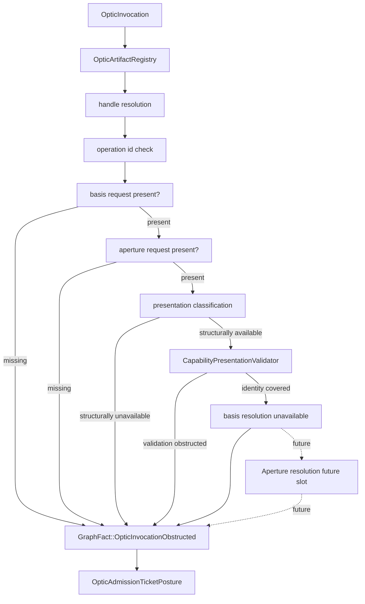
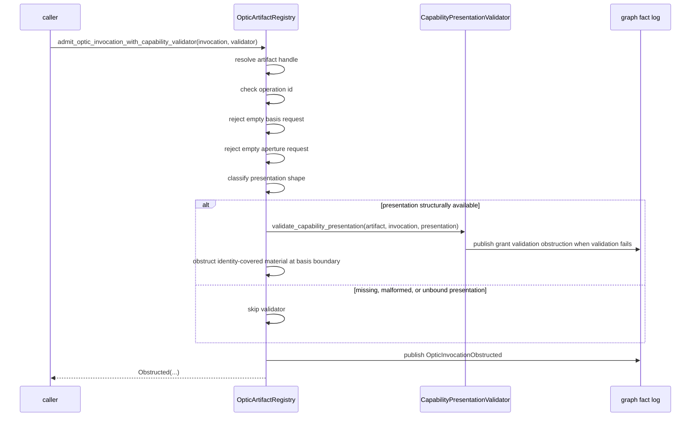
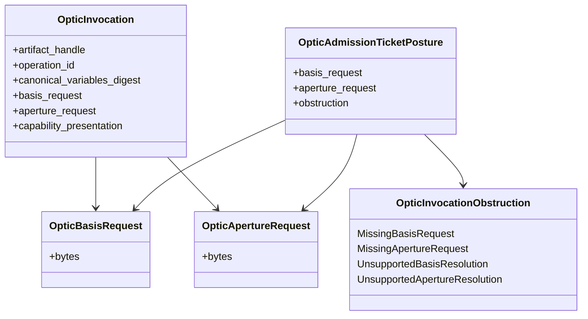
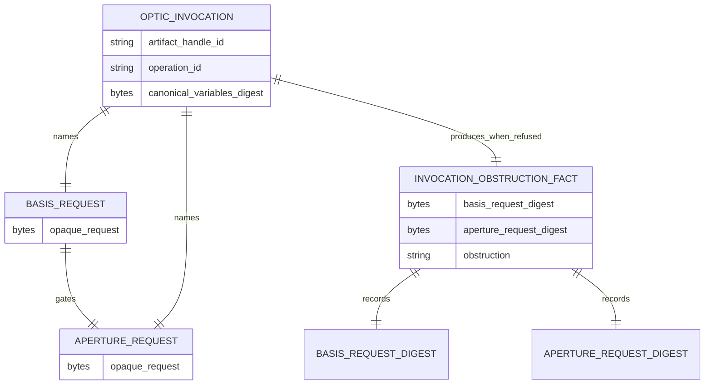

<!-- SPDX-License-Identifier: Apache-2.0 OR LicenseRef-MIND-UCAL-1.0 -->
<!-- © James Ross Ω FLYING•ROBOTS <https://github.com/flyingrobots> -->

# Aperture-Bound Optic Admission

Status: implementation slice.
Scope: obstruction-only aperture boundary for optic invocation admission.

## Doctrine

A basis answers which causal state is being evaluated.

An aperture answers what graph, window, or scope the invocation may see or
affect inside that resolved basis.

Basis alone is too broad. Without an aperture, a valid invocation could imply
ambient access to the whole resolved graph state. Aperture request presence is
therefore mandatory before Echo can continue toward authority, footprint, or
execution checks.

This slice does not resolve apertures successfully. It only makes aperture
participation explicit:

```text
empty basis request -> MissingBasisRequest
non-empty basis + empty aperture request -> MissingApertureRequest
non-empty basis + non-empty aperture + identity covered -> UnsupportedBasisResolution
```

`UnsupportedApertureResolution` exists as vocabulary for the future basis
resolved path. It is not reachable in this slice because aperture resolution is
defined only over a resolved basis.

Refusal remains causal evidence. Aperture obstruction facts are not
counterfactual candidates.

## Ordering

Presence checks happen before resolution checks. Basis resolution gates aperture
resolution.

```text
handle
-> operation
-> basis existence
-> aperture existence
-> basis resolution
-> aperture resolution
-> authority validation
-> footprint compatibility
-> execution
```

Echo must not evaluate aperture resolution before basis resolution exists.
Aperture is a constrained projection over a resolved basis, not a globally
meaningful graph region independent of causal state.

## Flow



## Sequence



## Class diagram



## Entity relationship



## Operating rule

Basis establishes the universe. Aperture establishes the window.

Echo must not resolve a window before the universe exists. Until basis
resolution is real, `UnsupportedApertureResolution` remains future vocabulary,
not a reachable runtime branch.

## Non-goals

- no successful aperture resolution;
- no successful basis resolution;
- no successful invocation admission;
- no successful `AdmissionTicket`;
- no `LawWitness`;
- no scheduler work;
- no execution;
- no storage engine;
- no WASM ABI;
- no Continuum schema.
