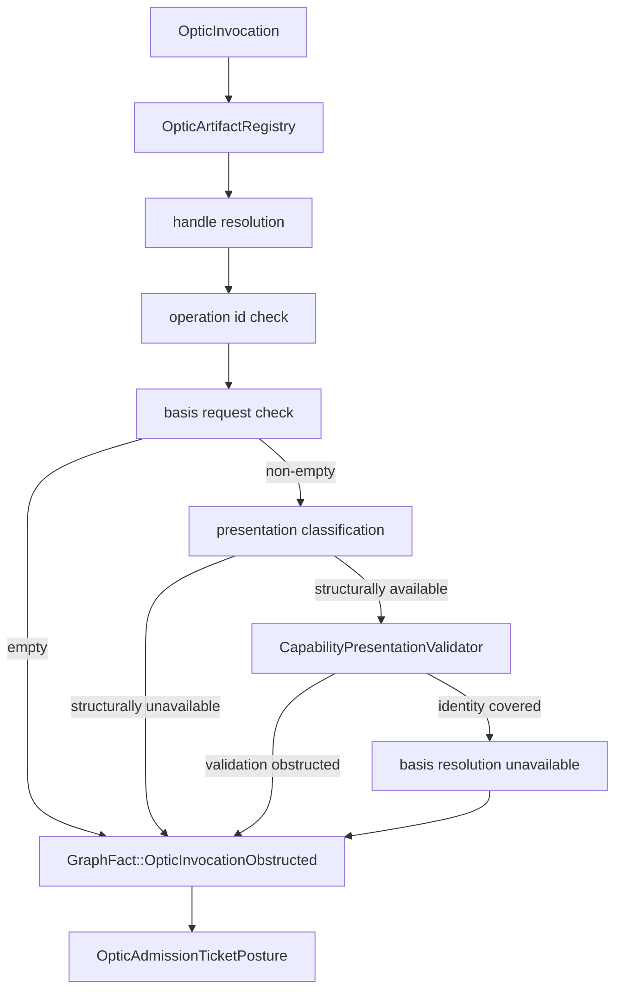
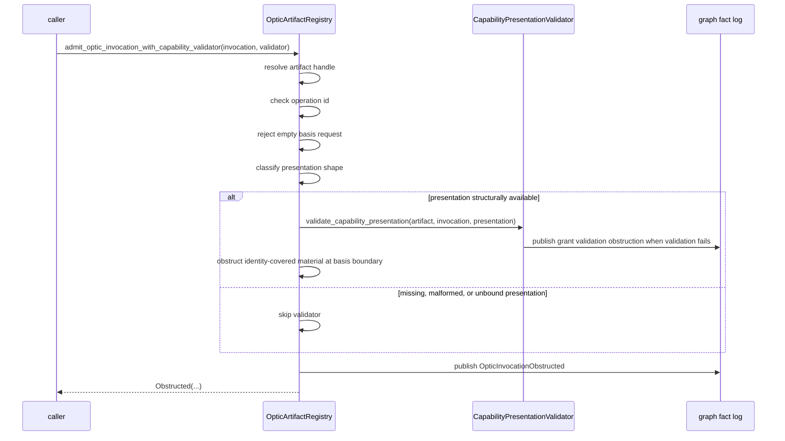
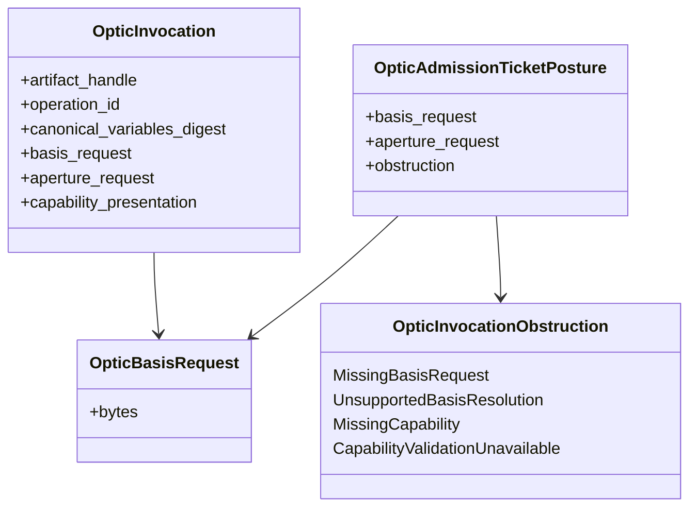
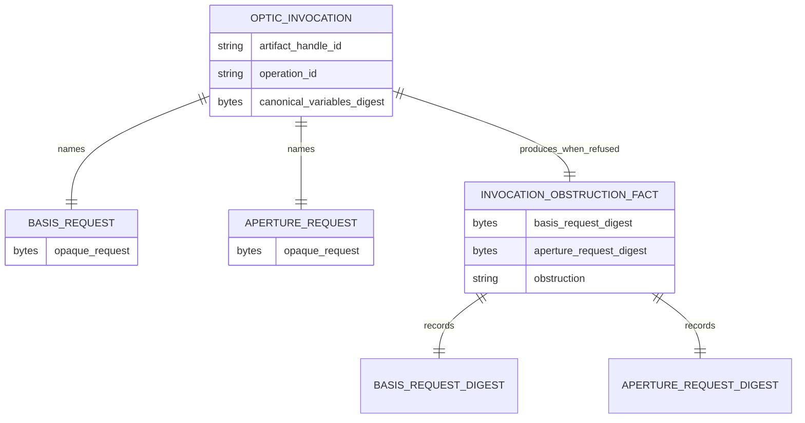

<!-- SPDX-License-Identifier: Apache-2.0 OR LicenseRef-MIND-UCAL-1.0 -->
<!-- © James Ross Ω FLYING•ROBOTS <https://github.com/flyingrobots> -->

# Basis-Bound Optic Admission

Status: implementation slice.
Scope: obstruction-only basis boundary for optic invocation admission.

## Doctrine

Admission decisions are evaluated against an explicit basis.

Basis selection is causal context, not caller folklore. A valid
`OpticArtifactHandle`, a matching operation id, and capability material that
covers registered artifact identity still do not authorize execution unless Echo
can resolve the requested basis.

This slice does not resolve basis requests successfully. It only makes basis
participation explicit:

```text
empty basis request -> MissingBasisRequest
identity covered but no basis resolver -> UnsupportedBasisResolution
```

Both outcomes remain obstructions. They are not admission tickets, not law
witnesses, not scheduler work, and not execution.

## Flow



## Sequence



## Class diagram



## Entity relationship



## Operating rule

Basis resolution is not ambient. If Echo cannot bind an invocation to an
explicit causal basis, the invocation remains refused even when artifact
identity and capability material line up.

## Non-goals

- no successful basis resolution;
- no successful invocation admission;
- no successful `AdmissionTicket`;
- no `LawWitness`;
- no scheduler work;
- no execution;
- no storage engine;
- no WASM ABI;
- no Continuum schema.
