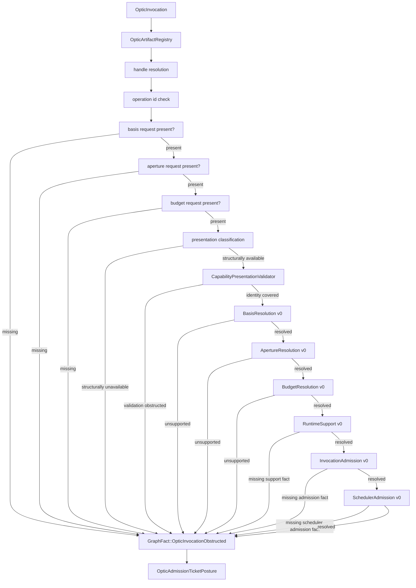
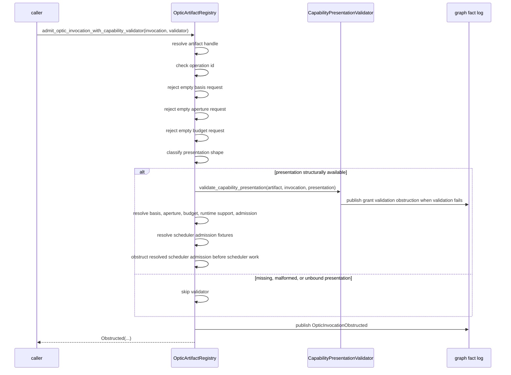
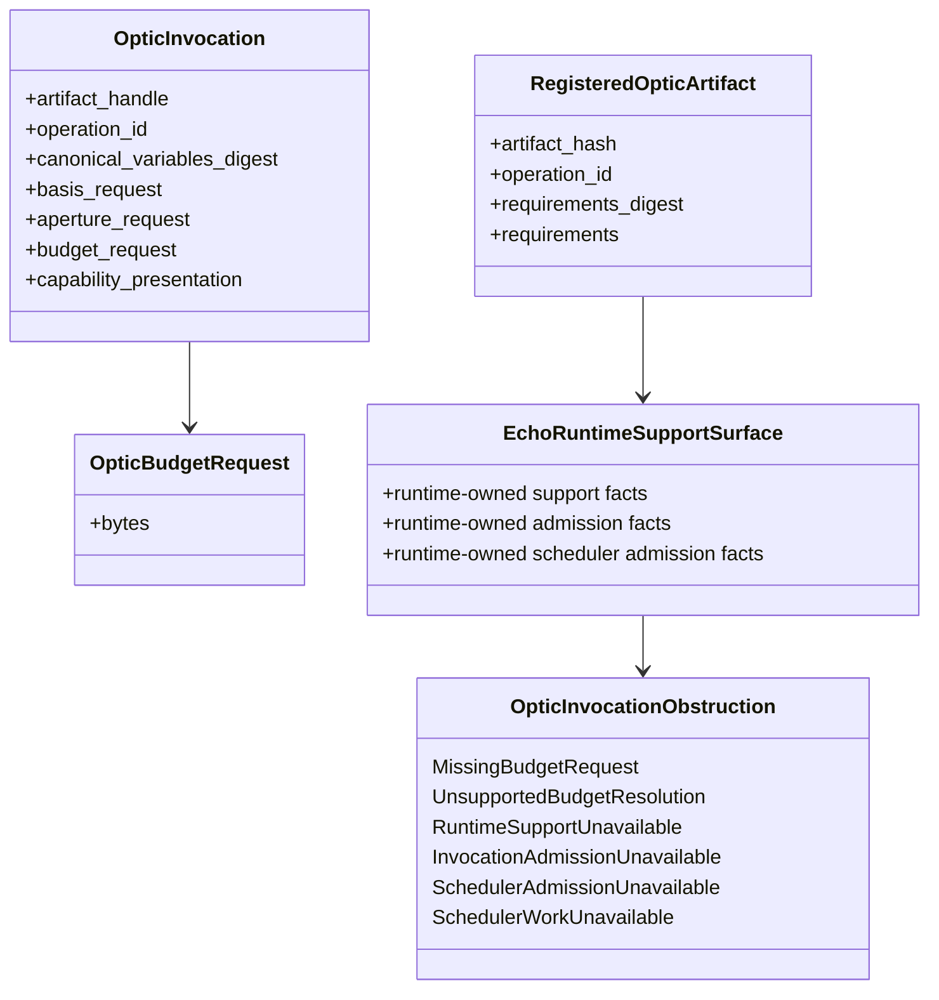
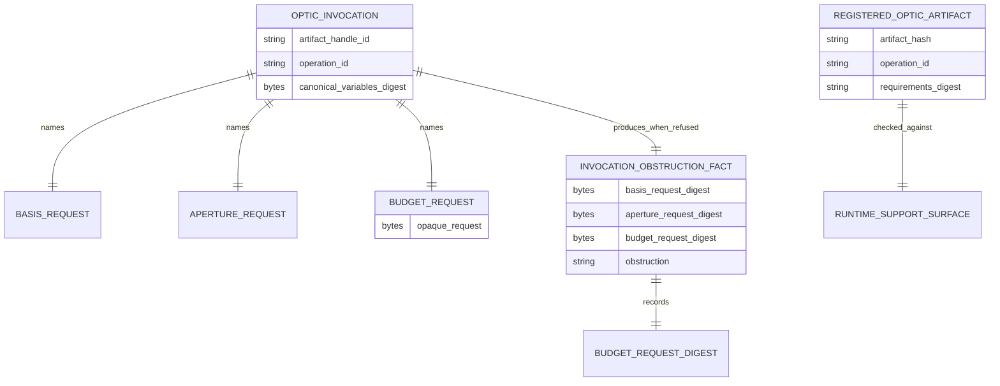

<!-- SPDX-License-Identifier: Apache-2.0 OR LicenseRef-MIND-UCAL-1.0 -->
<!-- © James Ross Ω FLYING•ROBOTS <https://github.com/flyingrobots> -->

# Budget and Runtime Support Optic Admission

Status: implementation slice.
Scope: obstruction-only budget request and runtime support boundary for optic
invocation admission.

## Doctrine

A basis request is not a resolved basis.

An aperture request is not a resolved scope.

A budget request is not spendable runtime capacity.

Runtime support is not caller-provided testimony.

Budget is invocation context supplied by the caller. It describes bounded
resource intent, but Echo has not evaluated or reserved any capacity in this
slice.

Runtime support is checked by Echo against registered artifact requirements and
Echo's own runtime support surface. The caller does not supply a support request
and Echo must not ask the caller whether Echo supports an operation.

This slice remains obstruction-only:

```text
empty basis request -> MissingBasisRequest
non-empty basis + empty aperture request -> MissingApertureRequest
non-empty basis + non-empty aperture + empty budget request -> MissingBudgetRequest
identity covered + unsupported basis -> UnsupportedBasisResolution
resolved basis + unsupported aperture -> UnsupportedApertureResolution
resolved aperture + unsupported budget -> UnsupportedBudgetResolution
resolved budget + no Echo-owned runtime support fact -> RuntimeSupportUnavailable
resolved runtime support + no Echo-owned admission fact -> InvocationAdmissionUnavailable
resolved invocation admission + no Echo-owned scheduler admission fact
  -> SchedulerAdmissionUnavailable
resolved scheduler admission -> SchedulerWorkUnavailable
```

`UnsupportedBudgetResolution` and `RuntimeSupportUnavailable` are current
obstruction vocabulary. They are reachable only after the earlier gates resolve:
basis resolution gates aperture resolution, aperture resolution gates budget
resolution, and budget resolution gates the Echo-owned runtime support check.

Refusal remains causal evidence. Budget and support obstruction facts are not
counterfactual candidates.

## Ordering

Presence checks happen before resolution checks.

Basis resolution gates aperture resolution.

Aperture resolution gates budget evaluation and runtime support checks.

```text
handle
-> operation
-> basis request presence
-> aperture request presence
-> budget request presence
-> basis resolution
-> aperture resolution
-> budget evaluation
-> runtime support evaluation
-> invocation admission evaluation
-> scheduler admission evaluation
-> scheduler work unavailable
```

This slice reaches the narrow fixture gates through SchedulerAdmission v0. It
still has no scheduler work and no execution.

## Flow



## Sequence



## Class diagram



## Entity relationship



## Operating rule

Budget is caller context. Runtime support is Echo context.

Echo must not accept caller testimony about runtime support. Support checks
compare registered artifact requirements against Echo-owned runtime support
facts recorded by the registry.

As of InvocationAdmission v0, Echo records a narrow runtime-owned invocation
admission fixture through Echo-issued artifact handles. That admission fact
advances the ladder past `InvocationAdmissionUnavailable`, but only to
SchedulerAdmission v0.

As of SchedulerAdmission v0, Echo records a narrow runtime-owned scheduler
admission fixture through Echo-issued artifact handles. That scheduler
admission fact advances the ladder past `SchedulerAdmissionUnavailable`, but
only to `SchedulerWorkUnavailable`; it still does not schedule work or execute
an invocation.

## Non-goals

- no `MissingSupportRequest`;
- no `MissingSchedulerAdmissionRequest`;
- no support request bytes;
- no scheduler admission request bytes;
- no successful `AdmissionTicket`;
- no `LawWitness`;
- no scheduler work;
- no execution;
- no storage engine;
- no WASM ABI;
- no Continuum schema.
