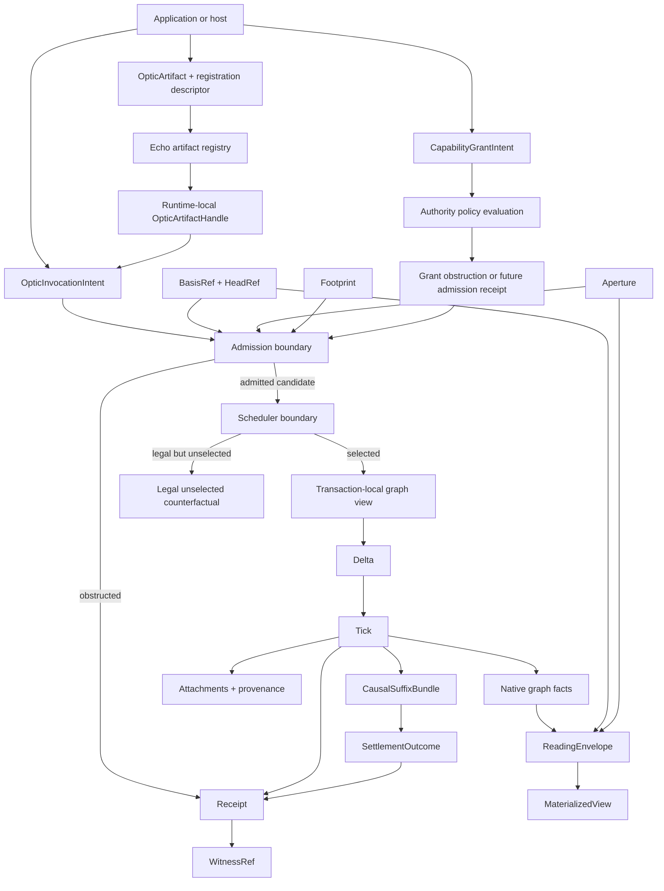
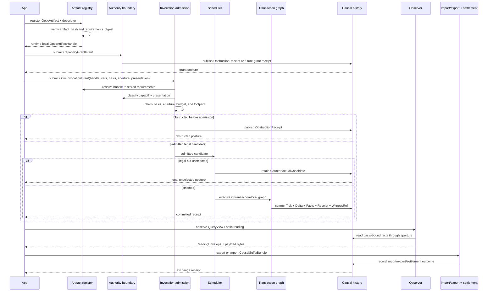
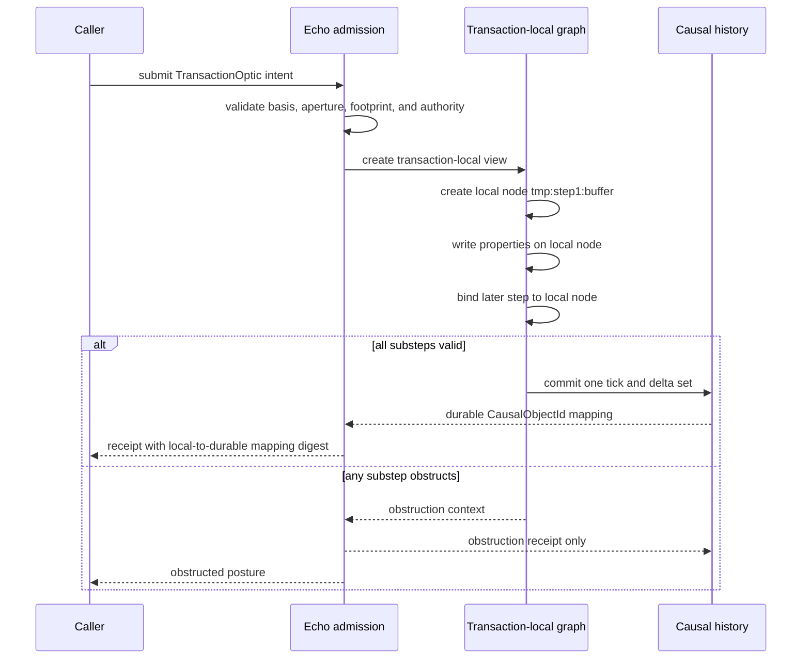
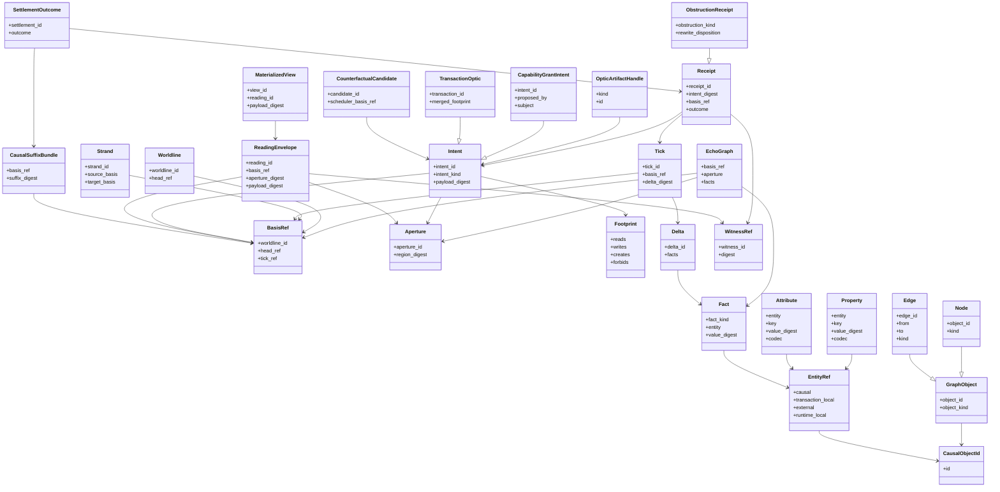
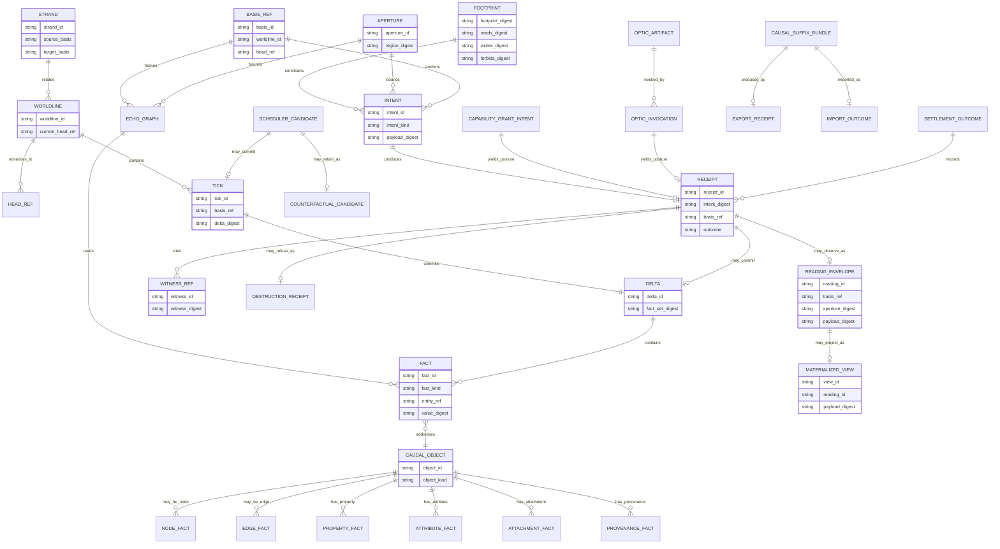

<!-- SPDX-License-Identifier: Apache-2.0 OR LicenseRef-MIND-UCAL-1.0 -->
<!-- © James Ross Ω FLYING•ROBOTS <https://github.com/flyingrobots> -->

# Built-In Echo Graph Data Model

Status: doctrine and design boundary.
Scope: Echo-owned graph ontology for optic admission, authority, transaction
atomicity, receipts, witnesses, materialized readings, replay, import/export,
and settlement.

## Doctrine

Echo needs a built-in graph ontology before authority, optics, and transaction
atomicity can become real.

The graph is not the substrate. The substrate is witnessed causal history. The
built-in Echo graph model is the native object, fact, relation, aperture, and
receipt vocabulary Echo uses to record, address, constrain, replay, and read that
history.

The graph exists in four postures:

```text
causal history
  durable ticks, deltas, facts, receipts, and witness references

basis-bound graph reading
  EchoGraph observed at a BasisRef through an Aperture

transaction-local graph view
  not-yet-committed object ids, facts, and deltas inside one atomic boundary

materialized compatibility view
  bounded derived projection for tools, adapters, WASM, or legacy surfaces
```

The forbidden shortcut is to let optics, grants, scheduler code, materializers,
or host adapters invent their own object model. They may declare requirements
over Echo graph regions, but Echo owns the substrate vocabulary those
requirements resolve against.

## Feature coverage matrix

This document intentionally covers the core Echo graph features that future Rust
types must eventually serve.

| Feature             | Graph role                                                             | Persistence posture                                |
| :------------------ | :--------------------------------------------------------------------- | :------------------------------------------------- |
| Native object graph | Nodes, edges, properties, attributes, and entity references.           | Fact-backed causal model                           |
| Causal history      | Ticks, deltas, facts, receipts, and witnesses.                         | Durable substrate                                  |
| Worldlines          | Ordered causal branches over graph history.                            | Durable causal lane                                |
| Strands             | Branch or braid-level lineage and settlement context.                  | Durable relation over history                      |
| Heads               | Current or named frontier references for basis selection.              | Causal reference                                   |
| Basis selection     | Exact state used by admission, observation, or execution.              | Causal reference                                   |
| Apertures           | Bounded graph visibility and observation scope.                        | Payload constraint, causal when used               |
| Footprints          | Declared read, write, create, retire, and forbid regions.              | Compiled law claim                                 |
| Optic artifacts     | Registered compiled law and codec shape.                               | Runtime registry plus causal registration evidence |
| Optic invocation    | Submitted handle, variables, basis, aperture, and authority claim.     | Causal intent                                      |
| Authority           | Grant intents, policy context, capability presentations, and refusals. | Causal when submitted/evaluated                    |
| Transaction optics  | Atomic composite execution over transaction-local graph state.         | One admitted boundary, one tick or refusal         |
| Scheduler           | Selects legal admitted candidates and records non-selection.           | Causal scheduling posture                          |
| Counterfactuals     | Legal admitted but unselected candidates only.                         | Derived retention after admission                  |
| Attachments         | Auxiliary bytes or planes linked to causal objects or ticks.           | Fact-linked payload evidence                       |
| Provenance          | Authorship, origin, codec, and boundary records.                       | Fact-linked evidence                               |
| Observations        | Basis-bound reads through apertures and observer plans.                | Reading receipt/evidence                           |
| Reading envelopes   | Evidence-bearing read metadata and payload digest.                     | Durable reading statement                          |
| Materialization     | Derived compatibility view from causal history.                        | Derived, cacheable, not authority                  |
| Import/export       | Witnessed suffix bundles and import outcomes.                          | Causal exchange boundary                           |
| Settlement          | Comparison, conflict, acceptance, and braid/strand resolution.         | Causal decision surface                            |

## Core nouns

| Noun                       | Definition                                                                                            | Persistence posture                  |
| :------------------------- | :---------------------------------------------------------------------------------------------------- | :----------------------------------- |
| `EchoGraph`                | Basis-bound reading of Echo's native object/fact space.                                               | Derived reading                      |
| `GraphObject`              | Common causal object identity envelope for nodes, edges, artifacts, attachments, receipts, and views. | Fact-backed object                   |
| `Node`                     | Causal object vertex with identity and typed attributes.                                              | Fact-backed object                   |
| `Edge`                     | Directed relation from one entity to another.                                                         | Fact-backed object                   |
| `Property`                 | Keyed value attached to a graph entity.                                                               | Fact-backed value                    |
| `Attribute`                | Typed metadata used by graph law, codecs, or admission.                                               | Fact-backed value                    |
| `EntityRef`                | Reference to a causal, transaction-local, or external entity.                                         | Payload/reference                    |
| `CausalObjectId`           | Durable id assigned only through admitted causal history.                                             | Durable identity                     |
| `WorldlineId`              | Durable lane identity for ordered causal history.                                                     | Durable identity                     |
| `StrandId`                 | Durable branch, braid, or lineage relation identity.                                                  | Durable identity                     |
| `HeadRef`                  | Named causal frontier for a worldline or strand.                                                      | Causal reference                     |
| `Tick`                     | Atomic causal mutation boundary.                                                                      | Durable history                      |
| `Delta`                    | Canonical change set committed by a tick.                                                             | Durable history                      |
| `Fact`                     | Canonical assertion about object existence, relation, value, provenance, or state.                    | Durable history                      |
| `Intent`                   | Submitted request to change, observe, authorize, import, export, or settle state.                     | Causal when submitted                |
| `Receipt`                  | Durable result, refusal, read, or publication record for an intent.                                   | Durable history                      |
| `ObstructionReceipt`       | Receipt for a refusal before legal admission.                                                         | Durable refusal evidence             |
| `AdmissionTicket`          | Future admission-success evidence.                                                                    | Durable admission evidence           |
| `WitnessRef`               | Stable reference to evidence material.                                                                | Durable reference                    |
| `BasisRef`                 | Exact causal state a read, admission, import, settlement, or transaction acts against.                | Causal reference                     |
| `Aperture`                 | Bounded graph region visible to a read, authority check, or admission decision.                       | Payload constraint, causal when used |
| `Footprint`                | Declared read, write, create, retire, and forbid regions.                                             | Compiled law claim                   |
| `OpticArtifactHandle`      | Runtime-local Echo registry token for a registered optic artifact.                                    | Runtime-local lookup                 |
| `CapabilityGrantIntent`    | Request to create authority material under policy.                                                    | Causal intent                        |
| `CapabilityPresentation`   | Invocation-time authority claim.                                                                      | Payload claim, causal when presented |
| `TransactionOptic`         | Atomic composite optic with one admission and one commit/refusal boundary.                            | Causal execution surface             |
| `TransactionLocalObjectId` | Scoped id for not-yet-committed objects inside one transaction.                                       | Runtime-local within transaction     |
| `CounterfactualCandidate`  | Legal admitted rewrite not selected by the scheduler.                                                 | Derived retention after admission    |
| `ObservationRequest`       | Basis/aperture/query request for a reading.                                                           | Causal when submitted                |
| `ReadingEnvelope`          | Metadata proving why a payload was readable at a basis/aperture.                                      | Durable reading statement            |
| `MaterializedView`         | Derived compatibility projection for tools or adapters.                                               | Derived/cacheable                    |
| `CausalSuffixBundle`       | Witnessed export of causal history after a basis.                                                     | Causal exchange payload              |
| `ImportOutcome`            | Result of importing an external suffix bundle.                                                        | Durable receipt/evidence             |
| `SettlementOutcome`        | Result of branch, braid, or conflict settlement.                                                      | Durable receipt/evidence             |

## Storage classification

### Stored natively

Echo stores durable causal facts and evidence needed to replay or explain them:

- admitted or obstructed `Intent` envelopes or canonical digests;
- `WorldlineId`, `StrandId`, `HeadRef`, and basis lineage records;
- `Tick` records;
- `Delta` records;
- `Fact` assertions created, updated, or retired by deltas;
- `Receipt` records, including obstruction receipts and future admission
  tickets;
- `WitnessRef` links and witness bundle digests;
- attachment and provenance facts tied to graph entities, ticks, or receipts;
- import/export and settlement outcome facts;
- canonical mappings from transaction-local ids to committed
  `CausalObjectId` values;
- indexes required to resolve `BasisRef`, `Aperture`, `Footprint`, handle,
  receipt, and witness checks deterministically.

### Derived

Echo derives readings and compatibility surfaces from stored causal history:

- `EchoGraph` at a basis;
- materialized node and edge views;
- property and attribute projections;
- optic readings;
- bounded text, table, tree, graph, and filesystem-compatible windows;
- scheduler candidate sets;
- retained counterfactual candidates after legal scheduler non-selection;
- WARP-TTD/debug inspection surfaces;
- WARPDrive or legacy-tool materializations.

Derived material may be cached, but cache state is not authority. A cached graph
view is useful only because it can be related back to basis, aperture, receipt,
and witness evidence.

### Runtime-local only

Runtime-local state must not be treated as durable identity or authority:

- `OpticArtifactHandle` values;
- in-memory registry slots;
- scheduler queues before selection is recorded;
- transaction-local object handles before commit;
- temporary execution frames;
- materializer cache keys;
- host adapter handles;
- WASM module object references;
- debug UI handles.

If runtime-local state needs to be explained after the fact, the explanation must
point to a receipt, witness, basis, or committed fact, not to the runtime-local
handle itself.

## Causal boundary

A value becomes causal when it is submitted, admitted, obstructed, executed,
committed, witnessed, materialized as an evidence-bearing reading, imported,
exported, settled, or published as part of Echo history.

Plain payloads remain non-causal until crossed into Echo:

```text
OpticArtifact                 non-causal until registration intent
OpticRegistrationDescriptor   non-causal until submitted
CapabilityGrantIntent payload non-causal until submitted
CapabilityPresentation        non-causal until presented with invocation
Aperture description          non-causal until used for admission or reading
Footprint description         non-causal until compiled/registered/checked
Budget description            non-causal until used for admission
Variables bytes               non-causal until named by invocation/receipt
ExternalEntityRef             non-causal until resolved through Echo
CausalSuffixBundle payload    non-causal until import/export intent
Materialized bytes            non-causal until tied to ReadingEnvelope/receipt
```

The moment one of those payloads influences trust, visibility, execution,
materialization, or durable history, Echo records the causal posture.

## Flow chart: full Echo graph lifecycle



Admission checks declared law against a basis and aperture before execution.
Execution proposes deltas inside a transaction-local graph view. Commit publishes
one tick, one delta set, receipts, graph facts, and witness references. Readings
and materializations are derived from that causal history and remain explainable
by basis, aperture, receipt, and witness evidence.

## Object identity

`CausalObjectId` is durable identity. It is assigned only through admitted causal
history.

`EntityRef` is the reference envelope used in payloads and internal plans:

```text
EntityRef:
  Causal(CausalObjectId)
  TransactionLocal(TransactionLocalObjectId)
  External(ExternalEntityRef)
  RuntimeLocal(RuntimeLocalHandle)
```

`ExternalEntityRef` may appear only at adapter boundaries. It must resolve to a
causal or transaction-local reference before admission can claim authority over
it.

`RuntimeLocalHandle` is never graph identity. It may name an in-memory registry
slot or adapter object, but receipts must cite durable facts, digests, or witness
references instead.

`TransactionLocalObjectId` is not a future content hash. It is a scoped
placeholder inside one atomic transaction. It may be used by later transaction
substeps, but it becomes durable only if the transaction commits.

## Fact model

A graph fact is a canonical assertion.

```text
Fact:
  ObjectExists(CausalObjectId, object_kind)
  ObjectRetired(CausalObjectId)
  EdgeExists(edge_id, from, to, edge_kind)
  EdgeRetired(edge_id)
  PropertySet(entity, key, value_digest, value_codec)
  PropertyCleared(entity, key)
  AttributeSet(entity, key, value_digest, value_codec)
  AttributeCleared(entity, key)
  WorldlineAdvanced(worldline_id, previous_head, new_head)
  StrandLinked(strand_id, source_basis, target_basis)
  AttachmentLinked(entity, attachment_digest, attachment_codec)
  ProvenanceLinked(entity, provenance_digest)
  ReceiptPublished(receipt_id, intent_digest, outcome)
  WitnessLinked(receipt_id, witness_digest)
  ReadingPublished(reading_id, basis_ref, aperture_digest, payload_digest)
  ImportRecorded(bundle_digest, import_outcome_digest)
  ExportRecorded(basis_ref, suffix_digest)
  SettlementRecorded(settlement_digest, outcome)
```

Facts are not free-form JSON. Opaque payload bytes may exist, but Echo graph law
must address them through codec identity, digest, and declared aperture rather
than caller-shaped maps.

## Footprint addressing

Optics address graph regions through footprints. A footprint names regions, not
implementation storage paths.

Minimum region vocabulary:

```text
object(CausalObjectId)
node(CausalObjectId)
edge(CausalObjectId)
property(EntityRef, key)
attribute(EntityRef, key)
worldline(WorldlineId)
strand(StrandId)
head(HeadRef)
tick(TickId)
delta(DeltaId)
receipt(ReceiptId)
witness(WitnessRef)
attachment(EntityRef, attachment_kind)
provenance(EntityRef)
reading(ReadingId)
materialized_view(ViewId)
neighborhood(EntityRef, edge_kind, direction, depth)
aperture(ApertureId)
late_bound(slot_id, constraint_digest)
```

A footprint may declare:

```text
reads
writes
creates
retires
observes
publishes
imports
exports
settles
forbids
late_bound_slots
internal_bindings
```

Late-bound slots are allowed only when their constraints are declared before
admission. Dynamic values are allowed. Dynamic authority is not.

## Receipts and graph changes

Receipts point back to graph changes by naming:

- submitted intent identity or digest;
- subject or proposer identity when relevant;
- basis used for admission;
- aperture used for admission or reading;
- declared footprint digest;
- registered artifact hash and requirements digest when an optic is involved;
- capability grant or presentation digest when authority is involved;
- committed tick id when admitted execution commits;
- obstruction kind when admission refuses;
- delta digest when a transaction commits;
- reading id and payload digest when observation succeeds;
- import/export or settlement outcome digest when exchange occurs;
- witness references for admission, obstruction, execution, reading, import,
  export, or settlement evidence.

A receipt is not the graph. It is a durable statement about what Echo did with an
intent and which graph evidence explains the outcome.

## Sequence diagram: registration, authority, invocation, read, exchange



## Transaction-local writes

Transaction-local writes address not-yet-committed objects with scoped ids:

```text
TransactionLocalObjectId:
  transaction_id
  step_id
  local_name
```

Substeps may reference those ids through `EntityRef::TransactionLocal`. The final
commit maps each transaction-local id to a durable `CausalObjectId` or obstructs
the whole transaction.

No transaction-local id may escape as durable identity.



## Class diagram: Echo core graph model



## Entity relationship diagram: persisted and derived graph surfaces



## Operating rules

1. Echo graph identity is causal identity, not runtime address identity.
2. A graph reading must name its basis and aperture.
3. A footprint must name graph regions before admission.
4. Transaction-local ids may flow inside one atomic transaction only.
5. Dynamic authority is forbidden; late-bound values require declared constraints.
6. Receipts explain graph outcomes; they do not replace graph facts.
7. Optics may address Echo graph regions, but they must not define Echo's native
   object ontology.
8. Runtime handles are not durable graph identity.
9. Worldline, strand, and head references are substrate coordinates, not product
   nouns.
10. Counterfactual candidates require prior legal admission.
11. Materialized views are readings, not substrate truth.
12. Import, export, and settlement outcomes must cite basis, suffix, receipt, and
    witness evidence.

If an optic, grant, scheduler path, materializer, or exchange path needs a graph
noun that is not defined by Echo's built-in model, either the graph model is
incomplete or the witness is not ready.
