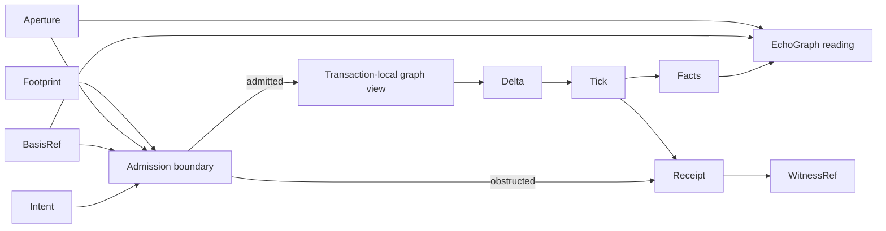
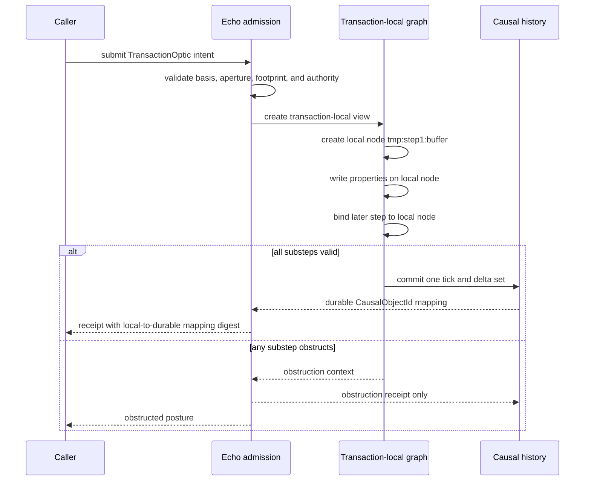
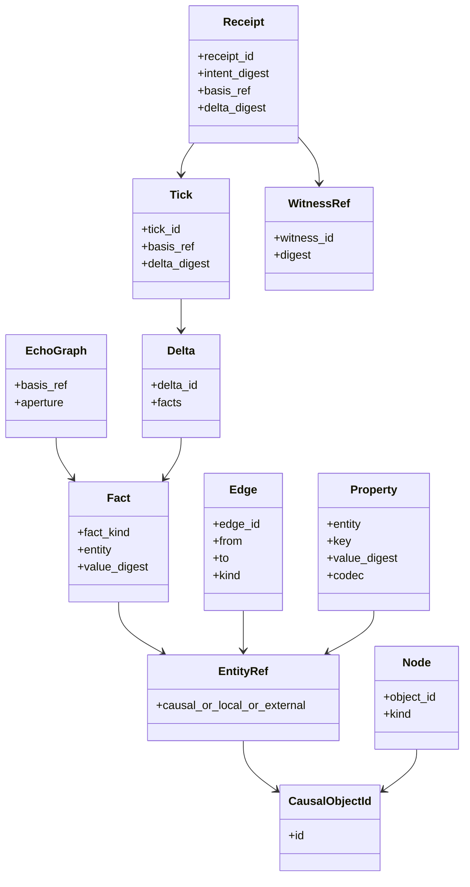
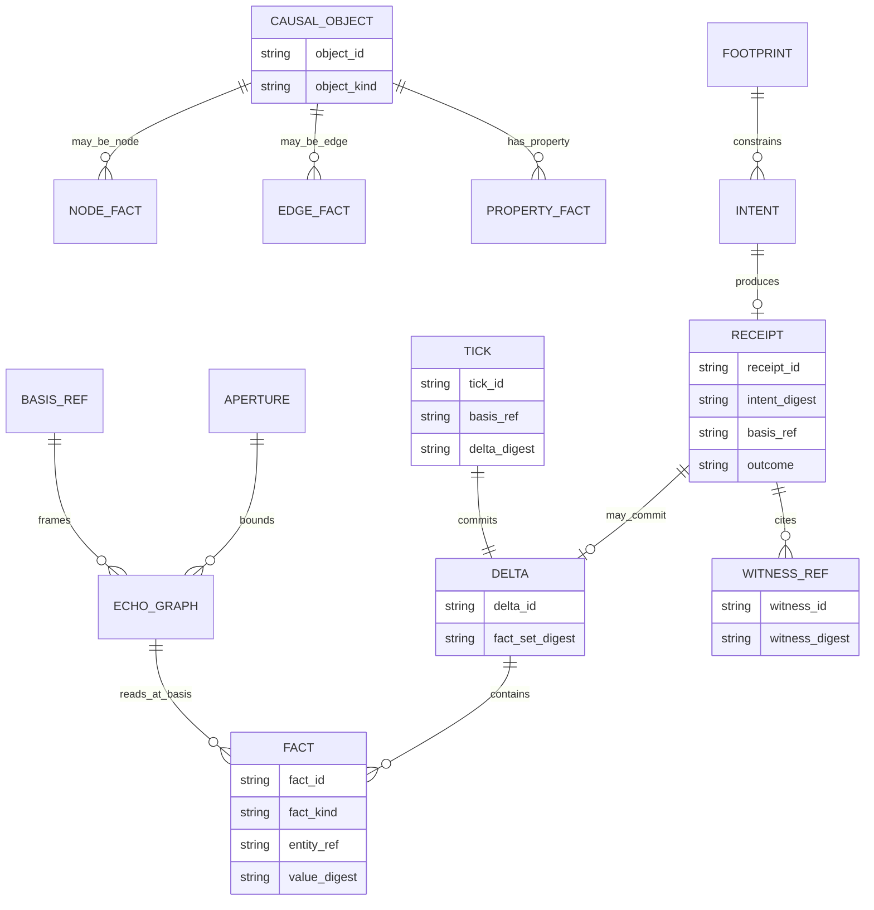

<!-- SPDX-License-Identifier: Apache-2.0 OR LicenseRef-MIND-UCAL-1.0 -->
<!-- © James Ross Ω FLYING•ROBOTS <https://github.com/flyingrobots> -->

# Built-In Echo Graph Data Model

Status: doctrine and design boundary.
Scope: Echo-owned graph ontology for future optic admission, authority,
transaction atomicity, receipts, and witnessed readings.

## Doctrine

Echo needs a built-in graph ontology before authority, optics, and transaction
atomicity can become real.

The graph is not the substrate. The substrate is witnessed causal history. The
built-in Echo graph model is the native object and fact vocabulary Echo uses to
record, address, constrain, and read that history.

The graph exists in three postures:

```text
causal history
  durable ticks, deltas, facts, receipts, and witness references

basis-bound graph reading
  EchoGraph observed at a BasisRef through an Aperture

transaction-local graph view
  not-yet-committed object ids, facts, and deltas inside one atomic boundary
```

The forbidden shortcut is to let optics, grants, or transaction code invent their
own object model. They may declare requirements over Echo graph regions, but Echo
owns the substrate vocabulary those requirements resolve against.

## Core nouns

| Noun             | Definition                                                         | Persistence posture   |
| :--------------- | :----------------------------------------------------------------- | :-------------------- |
| `EchoGraph`      | A basis-bound reading of Echo's native object/fact space.          | Derived reading       |
| `Node`           | A causal object vertex with identity and typed attributes.         | Fact-backed object    |
| `Edge`           | A directed relation from one entity to another.                    | Fact-backed object    |
| `Property`       | Keyed value attached to a node, edge, or graph object.             | Fact-backed value     |
| `Attribute`      | Typed metadata used by graph law, codecs, or admission.            | Fact-backed value     |
| `EntityRef`      | Reference to a node, edge, or transaction-local object.            | Payload/reference     |
| `CausalObjectId` | Durable id assigned only by admitted causal history.               | Durable identity      |
| `Tick`           | Atomic causal mutation boundary.                                   | Durable history       |
| `Delta`          | Canonical change set committed by a tick.                          | Durable history       |
| `Fact`           | Canonical assertion about object existence, relation, or value.    | Durable history       |
| `Intent`         | Submitted request to change, observe, or authorize state.          | Causal when submitted |
| `Receipt`        | Durable result or refusal record for an intent.                    | Durable history       |
| `WitnessRef`     | Stable reference to evidence material.                             | Durable reference     |
| `BasisRef`       | Exact causal state a read, admission, or transaction acts against. | Causal reference      |
| `Aperture`       | Bounded graph region visible to a read or admission decision.      | Payload constraint    |
| `Footprint`      | Declared read, write, create, and forbid regions.                  | Compiled law claim    |

## Storage classification

### Stored natively

Echo stores durable causal facts and the evidence needed to replay or explain
them:

- admitted `Intent` envelopes or their canonical digests;
- `Tick` records;
- `Delta` records;
- `Fact` assertions created, updated, or retracted by deltas;
- `Receipt` records, including obstruction receipts;
- `WitnessRef` links and witness bundle digests;
- canonical mappings from transaction-local ids to committed
  `CausalObjectId` values;
- indexes required to resolve `BasisRef`, `Aperture`, and `Footprint` checks
  deterministically.

### Derived

Echo derives readings from stored causal history:

- `EchoGraph` at a basis;
- materialized node and edge views;
- property projections;
- optic readings;
- bounded text, table, tree, or graph windows;
- retained counterfactual candidates after legal scheduler non-selection.

Derived material may be cached, but cache state is not authority. A cached graph
view is useful only because it can be related back to basis, aperture, receipt,
and witness evidence.

### Runtime-local only

Runtime-local state must not be treated as durable identity or authority:

- `OpticArtifactHandle` values;
- in-memory registry slots;
- scheduler queues;
- transaction-local object handles before commit;
- temporary execution frames;
- cache keys;
- host adapter handles.

If runtime-local state needs to be explained after the fact, the explanation must
point to a receipt, witness, basis, or committed fact, not to the runtime-local
handle itself.

## Causal boundary

A value becomes causal when it is submitted, admitted, obstructed, executed,
committed, witnessed, or published as part of Echo history.

Plain payloads remain non-causal until crossed into Echo:

```text
OpticArtifact                 non-causal until registration intent
OpticRegistrationDescriptor   non-causal until submitted
CapabilityGrantIntent payload non-causal until submitted
CapabilityPresentation        non-causal until presented with invocation
Aperture description          non-causal until used for admission or reading
Budget description            non-causal until used for admission
Variables bytes               non-causal until named by invocation/receipt
```

The moment one of those payloads influences trust, visibility, execution, or
durable history, Echo records the causal posture.

## Flow



Admission checks declared law against a basis and aperture before execution.
Execution proposes deltas inside a transaction-local graph view. Commit publishes
one tick, one delta set, receipts, and witness references.

## Object identity

`CausalObjectId` is durable identity. It is assigned only through admitted causal
history.

`EntityRef` is the reference envelope used in payloads and internal plans:

```text
EntityRef:
  Causal(CausalObjectId)
  TransactionLocal(TransactionLocalObjectId)
  External(ExternalEntityRef)
```

`ExternalEntityRef` may appear only at adapter boundaries. It must resolve to a
causal or transaction-local reference before admission can claim authority over
it.

`TransactionLocalObjectId` is not a future content hash. It is a scoped placeholder
inside one atomic transaction. It may be used by later transaction substeps, but
it becomes durable only if the transaction commits.

## Fact model

A graph fact is a canonical assertion.

```text
Fact:
  ObjectExists(CausalObjectId, object_kind)
  ObjectRetired(CausalObjectId)
  EdgeExists(edge_id, from, to, edge_kind)
  EdgeRetired(edge_id)
  PropertySet(entity, key, value_digest, value_codec)
  PropertyCleared(entity, key)
  AttributeSet(entity, key, value_digest, value_codec)
  AttributeCleared(entity, key)
```

Facts are not free-form JSON. Opaque payload bytes may exist, but Echo graph law
must address them through codec identity, digest, and declared aperture rather
than caller-shaped maps.

## Footprint addressing

Optics address graph regions through footprints. A footprint names regions, not
implementation storage paths.

Minimum region vocabulary:

```text
object(CausalObjectId)
node(CausalObjectId)
edge(CausalObjectId)
property(EntityRef, key)
attribute(EntityRef, key)
neighborhood(EntityRef, edge_kind, direction, depth)
aperture(ApertureId)
late_bound(slot_id, constraint_digest)
```

A footprint may declare:

```text
reads
writes
creates
retires
forbids
late_bound_slots
internal_bindings
```

Late-bound slots are allowed only when their constraints are declared before
admission. Dynamic values are allowed. Dynamic authority is not.

## Receipts and graph changes

Receipts point back to graph changes by naming:

- submitted intent identity or digest;
- basis used for admission;
- aperture used for admission or reading;
- declared footprint digest;
- committed tick id when admitted execution commits;
- obstruction kind when admission refuses;
- delta digest when a transaction commits;
- witness references for admission, obstruction, execution, or reading evidence.

A receipt is not the graph. It is a durable statement about what Echo did with an
intent and which graph evidence explains the outcome.

## Transaction-local writes

Transaction-local writes address not-yet-committed objects with scoped ids:

```text
TransactionLocalObjectId:
  transaction_id
  step_id
  local_name
```

Substeps may reference those ids through `EntityRef::TransactionLocal`. The final
commit maps each transaction-local id to a durable `CausalObjectId` or obstructs
the whole transaction.

No transaction-local id may escape as durable identity.



## Class model



## Entity relationship



## Operating rules

1. Echo graph identity is causal identity, not runtime address identity.
2. A graph reading must name its basis and aperture.
3. A footprint must name graph regions before admission.
4. Transaction-local ids may flow inside one atomic transaction only.
5. Dynamic authority is forbidden; late-bound values require declared constraints.
6. Receipts explain graph outcomes; they do not replace graph facts.
7. Optics may address Echo graph regions, but they must not define Echo's native
   object ontology.
8. Runtime handles are not durable graph identity.

If an optic, grant, or scheduler path needs a graph noun that is not defined by
Echo's built-in model, either the graph model is incomplete or the witness is not
ready.
