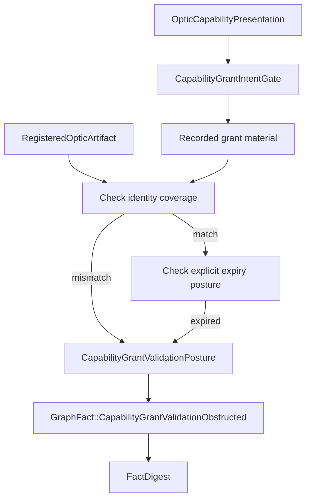
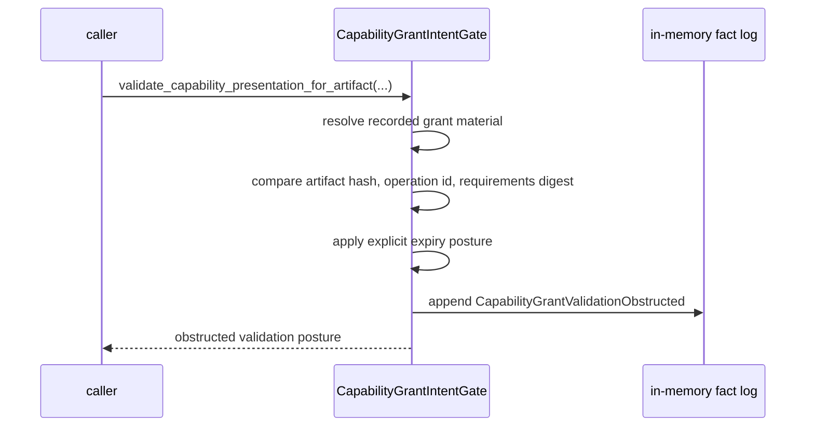
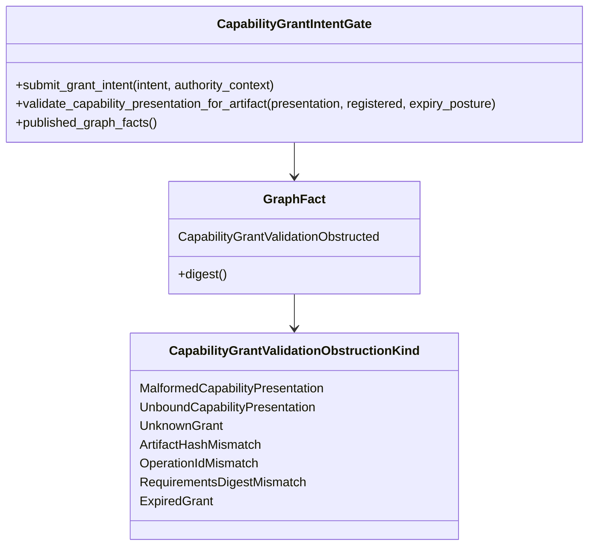

<!-- SPDX-License-Identifier: Apache-2.0 OR LicenseRef-MIND-UCAL-1.0 -->
<!-- © James Ross Ω FLYING•ROBOTS <https://github.com/flyingrobots> -->

# Capability Grant Validation Obstruction Facts

Status: implementation slice.
Scope: in-memory causal graph fact publication for narrow capability grant
validation refusal.

## Doctrine

A grant can fail validation causally before any invocation can succeed.

Grant validation obstruction is graph evidence, not authority. Recorded grant
material is not an accepted grant, not a capability, not an admission ticket,
not a law witness, and not permission to execute.

```text
capability presentation
  + recorded grant intent material
  + registered optic artifact
  -> identity coverage check
  -> obstruction posture
  -> GraphFact::CapabilityGrantValidationObstructed
```

This slice validates only identity coverage:

- artifact hash;
- operation id;
- requirements digest;
- explicit expiry posture when supplied by the caller.

Expiry remains caller-supplied posture in this slice. Echo does not parse
`CapabilityGrantIntent::expiry_bytes`, read clocks, or derive temporal authority.

## Fact model

`GraphFact::CapabilityGrantValidationObstructed` records:

- `presentation_id`;
- `grant_id`;
- `artifact_handle_id`;
- `expected_artifact_hash`;
- `grant_artifact_hash`;
- `expected_operation_id`;
- `grant_operation_id`;
- `expected_requirements_digest`;
- `grant_requirements_digest`;
- `obstruction`.

Expected fields come from Echo's registered artifact material. Grant fields
come from the recorded grant intent material when that material is available.
Both sides are included so fact digests distinguish different failed grants
against the same registered artifact.

## Flow



## Sequence



## Class diagram



## Non-goals

- no successful grant admission;
- no successful `AdmissionTicket`;
- no `LawWitness`;
- no execution;
- no scheduler;
- no real delegation policy;
- no quorum or governance;
- no Continuum schema;
- no clock parsing;
- no invocation success path.

## Operating rule

Capability grant validation obstruction facts are refusal records. They prove
Echo noticed that recorded grant material failed to cover a registered artifact
identity. They do not prove that any grant is accepted, sufficient, delegated,
current, or authorized.
