<!-- SPDX-License-Identifier: Apache-2.0 OR LicenseRef-MIND-UCAL-1.0 -->
<!-- © James Ross Ω FLYING•ROBOTS <https://github.com/flyingrobots> -->

# Causal WAL End-To-End

Status: design proposal. No implementation is implied by this packet.

## Spine

```text
A snapshot proves Echo can serialize state.
A WAL proves Echo can survive interruption between causal events.
```

Echo may only claim what its WAL can recover.

This document defines an Echo-owned causal write-ahead log for durable generic
runtime history. It is not an application edit history, debug event stream,
database feature, undo log, or best-effort append trace. It is the durable
commit boundary for accepted submissions, scheduler-owned tick outcomes,
runtime posture changes, retained material references, and recovery evidence.

The central contract is blunt:

```text
No durable claim without durable evidence.
No visible outcome without committed history.
No external effect without committed authorization.
```

## Goals

- Make accepted submissions recoverable across process death.
- Make tick outcomes recoverable without half-ticks.
- Make receipt, ticket, reading, retained material, and runtime posture indexes
  rebuildable from committed WAL/checkpoint material.
- Keep application nouns out of Echo WAL schemas.
- Preserve the authority split: applications submit; trusted runtime ticks.
- Define the acknowledgement contract before implementation begins.
- Define filesystem and object-store durability requirements explicitly enough
  that adapters cannot claim strict durability by accident.

## Non-Goals

- No jedit, file, buffer, cursor, selection, or document semantics in Echo WAL.
- No user undo or application-level redo.
- No distributed multi-writer WAL.
- No hidden process-local retry queue.
- Explicit durable side-effect outboxes are allowed and required for fenced
  external materialization.
- No application-owned tick, receipt, runtime-control, or recovery record
  append authority.
- No claim that WAL alone gives exactly-once external side effects.

## End-To-End Shape

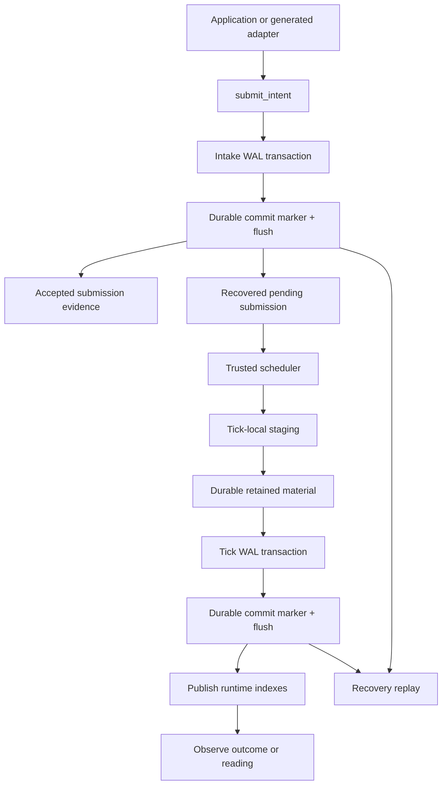

The interesting boundary is not the file format. The interesting boundary is
the acknowledgement line. In strict mode, Echo must not return accepted
submission evidence until the intake transaction is committed and flushed under
the active durability policy. A returned acceptance must mean recoverable
acceptance.

## Authority Planes

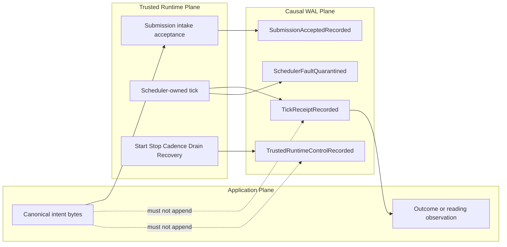

Application code may cause a witnessed submission only by passing the canonical
submit boundary. Application code must never possess append authority for tick,
receipt, runtime-control, scheduler-fault, or recovery records.

Echo reserves `admission` for runtime/law admission, not intake acceptance. A
submission can be durably accepted into pending posture without yet being
admitted for execution under runtime law.

```text
submission acceptance != runtime admission
AdmissionTicket != accepted submission evidence
TickReceipt != AdmissionTicket
```

## ACK Contract

Every public API that returns durable evidence must state what was committed
before return.

| Surface                  | May Return Only After                                          | Meaning Of Return                                            |
| :----------------------- | :------------------------------------------------------------- | :----------------------------------------------------------- |
| Submission intake        | `SubmissionAcceptedRecorded` transaction committed and flushed | Returned accepted evidence is recoverable accepted evidence. |
| Duplicate submission     | Prior committed submission was found and validated             | Duplicate posture is stable across restart.                  |
| Tick outcome publication | tick transaction committed and flushed                         | Visible receipt is recoverable receipt.                      |
| Runtime posture change   | posture transaction committed and flushed                      | Quarantine/control state is recoverable runtime state.       |
| Retained reading ref     | referenced material durable before WAL reference               | Reading ref is not an empty content-hash guess.              |

Wrong:

```text
append to memory
return accepted
flush later
```

Right:

```text
append transaction frames
append commit marker
flush under strict policy
return accepted evidence
```

Buffered mode may exist for tests and local experimentation, but it must not be
allowed to satisfy release durability gates.

The crash-after-commit-before-ACK case is intentional and must be stable:

```text
WAL commit flushed
process dies before application receives AcceptedSubmissionEvidence
retry same submission id + same canonical envelope
-> AlreadyAcceptedPending / AlreadyDecided / AlreadyRejected / AlreadyObstructed
```

Echo truth wins over client perception. The client may not know whether the ACK
was delivered, but recovery must know whether the acceptance transaction
committed.

## WAL Transactions

Initial WAL transactions should be contiguous. Do not interleave transactions
until a future design proves a need.

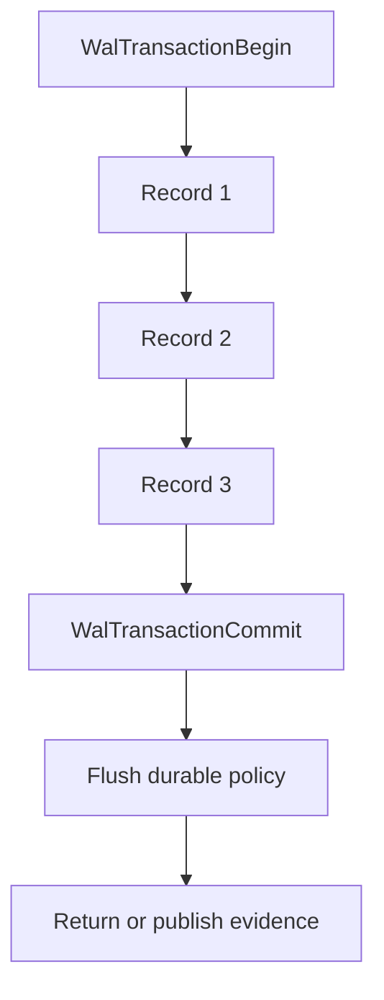

Rejected initial shape:

```text
Begin A
  record A
Begin B
  record B
Commit B
  record A
Commit A
```

Contiguous transactions keep recovery, truncation, validation, and audit boring.
Boring survives restarts.

## Sequence: Submission Intake

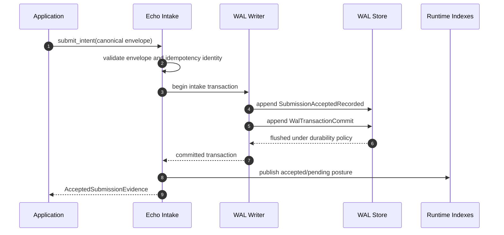

If the process dies before the commit marker is flushed, the submission was not
accepted. If it dies after the commit marker is flushed, recovery must restore a
pending or decided submission posture.

If the process dies after the commit marker is flushed but before the app sees
the ACK, a retry with the same submission id and canonical envelope must return
the stable duplicate posture derived from the committed WAL transaction.

## Sequence: Scheduler Tick

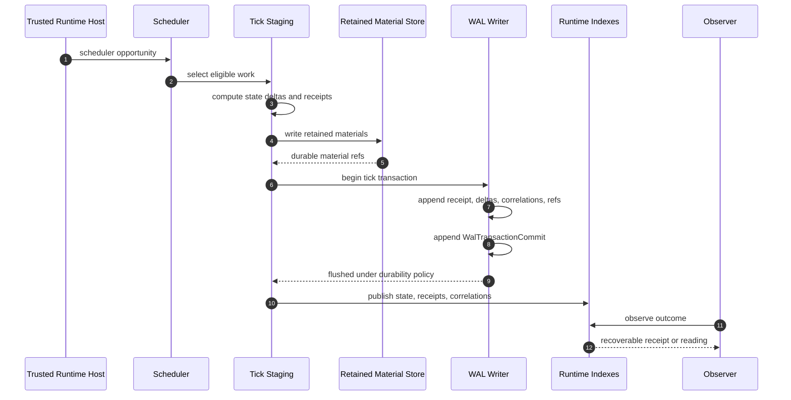

A visible receipt implies a recoverable receipt. A recoverable receipt implies
the required state delta, ticket correlation, retained material refs, and
semantic coordinates exist or recovery blocks with typed obstruction.

## Sequence: Crash Recovery

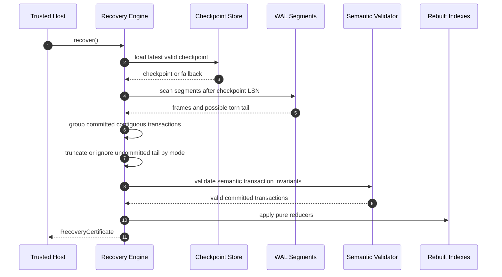

Recovery must replay committed facts. It must not ask the scheduler what should
have happened. It must not call app code. It must not write files except through
a separately fenced materialization phase.

Recovery mode matters:

| Mode                                | Tail Handling                                                 |
| :---------------------------------- | :------------------------------------------------------------ |
| `StrictFilesystem` / writable store | May truncate uncommitted tail after validation.               |
| `StrictObjectStore`                 | May publish a corrected committed manifest if adapter allows. |
| `ReadOnlyRecovery`                  | Must not truncate; report that truncation would be required.  |
| `Disabled`                          | No durable recovery claim.                                    |

## Frame And Transaction Model

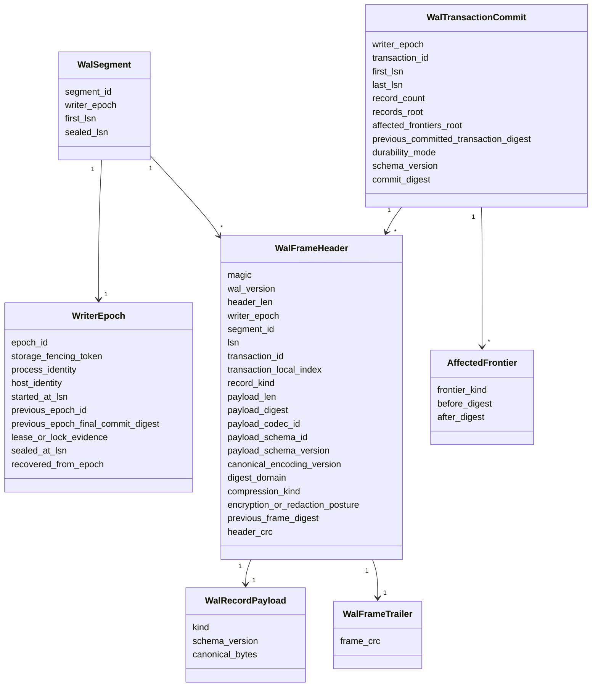

Use two integrity mechanisms:

- CRC/checksum for torn-write and corruption detection;
- cryptographic, domain-separated digests for commitment chains and tamper
  evidence.

Do not make one mechanism do both jobs.

`affected_frontiers_root` commits the set of frontier transitions touched by
the transaction. Intake, tick, runtime posture, reading, and checkpoint
transactions do not all mutate the same frontier. Use a typed set such as:

```text
affected_frontiers: [
  { frontier_kind, before_digest, after_digest }
]
```

Do not overload one `frontier_before_digest` / `frontier_after_digest` pair
into a catch-all junk drawer.

## Writer Epoch Discipline

The WAL should have one writer actor, but the files must prove that only one
writer actor was active for a committed range.

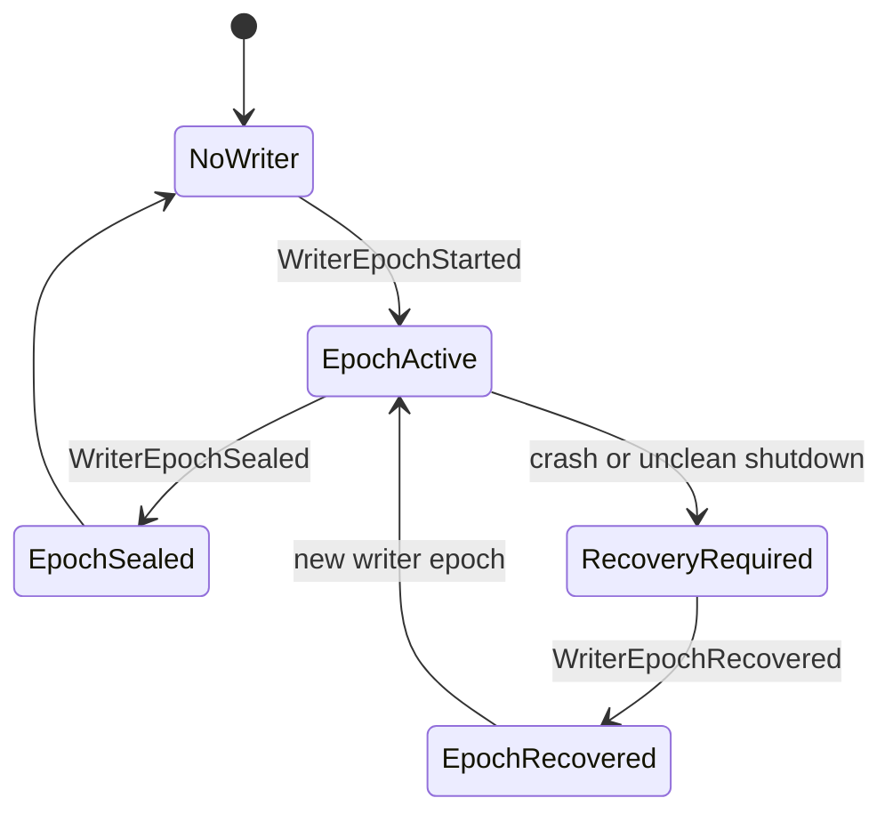

Recovery seeing overlapping writer epochs is a recovery fault. It is not a
merge opportunity.

Each writer epoch must bind fencing evidence:

```text
epoch_id
storage_fencing_token
process_identity
host_identity
started_at_lsn
previous_epoch_id
previous_epoch_final_commit_digest
lease_or_lock_evidence
```

Runtime intent says "one writer actor." Stored fencing evidence proves which
writer had append authority for a range.

## WalStorePort Contract

`WalStorePort` is the storage boundary that prevents adapters from hand-waving
strict durability. The trait shape can change during implementation, but the
contract must preserve these operations:

```text
WalStorePort
  acquire_writer_epoch(fencing_context) -> WriterEpoch
  append_frame(epoch, frame) -> AppendResult
  flush_commit(epoch, transaction_id) -> DurabilityResult
  read_segments(from_lsn) -> SegmentStream
  seal_segment(epoch, segment_id) -> SealResult
  truncate_tail(after_lsn) -> TruncationResult
  publish_manifest?(manifest) -> ManifestCommitResult
  close_epoch(epoch) -> EpochSealResult
```

Object-store adapters also need explicit manifest operations:

```text
conditional_publish_manifest
verify_object_version
read_committed_manifest
```

An adapter must not report `StrictFilesystem` or `StrictObjectStore` unless its
port implementation satisfies the ACK contract for that storage medium.

## Record Families

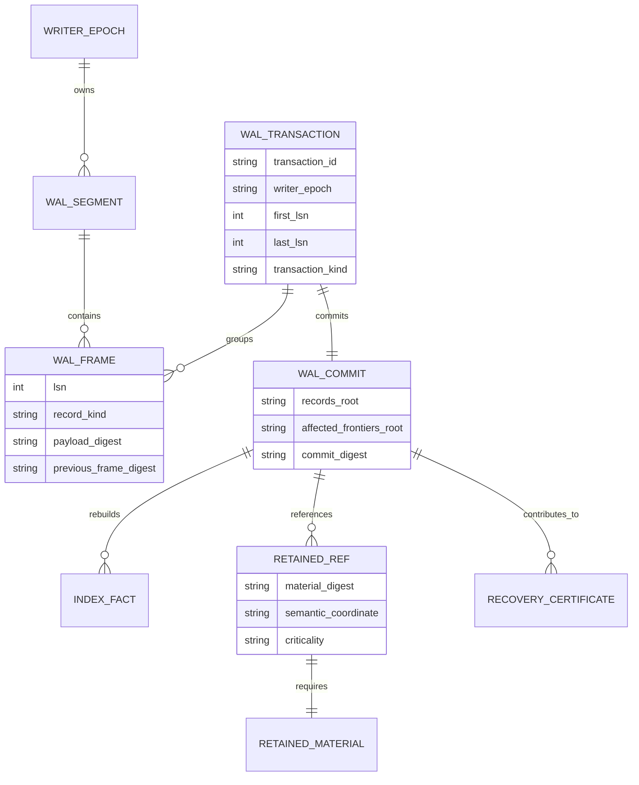

Candidate causal record families:

- `SubmissionAcceptedRecorded`
- `SubmissionAcceptanceEvidenceRecorded`
- `RuntimeLawWitnessRecorded`
- `RuntimeAdmissionTicketIssued`
- `TicketedRuntimeIngressRecorded`
- `TickReceiptRecorded`
- `RuntimeStateDeltaRecorded`
- `ReceiptCorrelationRecorded`
- `ReadingEnvelopeRetained`
- `RetainedMaterialRefRecorded`
- `SchedulerFaultQuarantined`
- `TrustedRuntimeControlRecorded`
- `CheckpointPublicationRecorded`
- `MaterializationIntentRecorded`
- `MaterializationEffectObserved`

Diagnostic-only records should live in a separate trace lane. The causal WAL
should stay clean.

Naming rule:

```text
Records are recorded.
Transactions are committed.
History begins at WalTransactionCommit.
```

Do not use `*Committed` as an ordinary record kind. A frame containing
`TickReceiptRecorded` is still almost-history until the containing transaction
has a validated `WalTransactionCommit`.

## Causal WAL Versus Diagnostic Trace

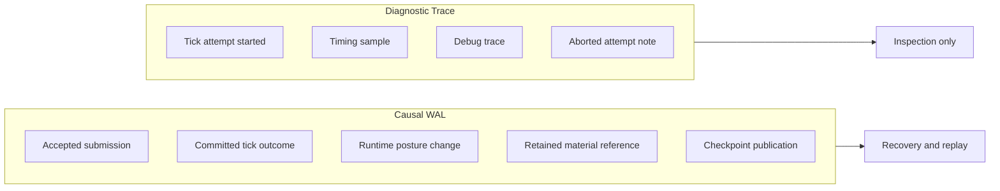

Failed tick attempts are not causal history. After rollback, Echo may commit a
runtime posture change such as `SchedulerFaultQuarantined`; that posture is
causal runtime history because it affects future scheduling.

Diagnostic trace failure behavior:

- diagnostic trace loss must not block causal recovery;
- diagnostic trace corruption must not poison causal WAL replay;
- diagnostic trace records must not be required to rebuild causal indexes;
- diagnostic segments, if durable, should use a separate adapter or segment
  family from the causal WAL.

## Idempotency And Duplicate Submission

Each submission needs a stable idempotency identity:

```text
submission_id
client_submission_nonce
canonical_envelope_digest
generation
submission_acceptance_context_digest
idempotency_key_digest
dedupe_scope
dedupe_policy_id
```

Recovery and retry can then classify:

| Retry Shape                                      | Recovery Posture                                                                      |
| :----------------------------------------------- | :------------------------------------------------------------------------------------ |
| Same submission id, same canonical envelope      | `AlreadyAcceptedPending`, `AlreadyDecided`, `AlreadyRejected`, or `AlreadyObstructed` |
| Same submission id, different canonical envelope | protocol violation                                                                    |
| New submission id, same canonical envelope       | new submission unless explicit dedupe key or policy says otherwise                    |
| No committed WAL transaction                     | `NotAccepted`                                                                         |

Same id plus different bytes must never overwrite the previous record or become
a new accepted submission.

Echo must not infer semantic duplicate status from identical canonical envelope
bytes alone. A user may intentionally submit the same canonical intent twice.
Duplicate suppression requires an explicit idempotency key, dedupe scope, or
dedupe policy.

## Semantic Validation

Checksums prove bytes survived. They do not prove Echo history is lawful.

Every committed transaction must pass semantic validation before replay.

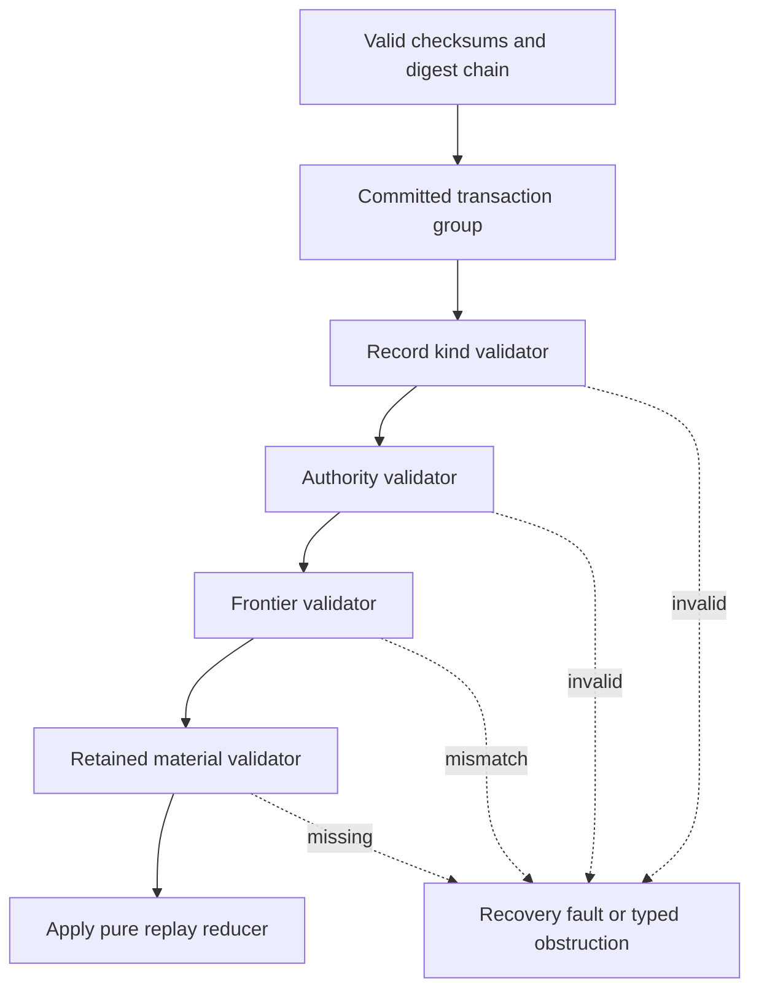

Examples:

- `SubmissionAcceptedRecorded` requires canonical envelope digest, unique or
  duplicate-compatible submission identity, and no scheduler-owned records.
- `TickReceiptRecorded` requires trusted runtime authority, ticket identity,
  receipt identity, state/correlation records when applicable, and matching
  affected frontier transition.
- `RetainedMaterialRefRecorded` requires durable material before the committed
  WAL reference.

Replay application should be pure:

```text
RecoveredState apply_committed_transaction(
  RecoveredState before,
  ValidatedCommittedTransaction tx
)
```

The reducer must not read wall clock, random data, network state, app callbacks,
external files, scheduler decisions, or mutable process globals.

## Rebuildable Indexes

Indexes are caches. WAL plus checkpoints are authoritative.

Rebuildable indexes include:

- `submission_by_id`
- `pending_submission_queue`
- `ticket_by_submission`
- `receipt_by_ticket`
- `receipt_by_submission`
- `reading_by_semantic_coordinate`
- `retained_material_by_digest`
- `faulted_heads`
- `runtime_control_posture`

If an index cannot be rebuilt from committed WAL/checkpoint material, it is
secretly state and should fail review.

## WAL Projection Into The WARP Graph And WSC

Echo may project WAL-backed storage evidence into the WARP graph, but those
graph facts are not the WAL's recovery authority.

```text
WAL bytes are the durable commit authority.
WARP graph facts track WAL segment evidence.
WSC serializes graph facts and may bundle or reference WAL bytes.
```

The graph may contain evidence facts such as:

- `WalRoot`;
- `WalWriterEpoch`;
- `WalSegmentRef`;
- `WalCommitAnchor`;
- `RecoveryCertificateRef`.

A `WalSegmentRef` should identify a segment by writer epoch, LSN range, digest
chain, segment digest, commit anchors, and sealed posture. Its storage locator
may point to local segment storage, CAS storage, or an object-store manifest,
but that locator is not causal identity.

Good storage-locator shapes:

```text
segments/0000000000000042.ecwal
wal://local/default/segments/0000000000000042.ecwal
cas://sha256/...
```

Bad canonical identity:

```text
/Users/example/echo/wal/0000000000000042.ecwal
```

Recovery must not require pre-existing graph WAL nodes. The bootstrap path is:

```text
configured WAL root or storage manifest
-> validate segment headers and commit chains
-> replay committed transactions
-> rebuild graph/read-model/index facts
-> expose WAL segment refs as projected evidence
```

WSC can serialize projected WAL facts in at least three modes:

| Mode               | Meaning                                                                                 |
| ------------------ | --------------------------------------------------------------------------------------- |
| Ref-only WSC       | Contains graph facts plus WAL segment locators and digests.                             |
| Self-contained WSC | Contains graph facts plus embedded WAL segment bytes or bundled retained material.      |
| CAS-addressed WSC  | Contains graph facts plus content-addressed refs to WAL segments and retained material. |

The bridge doctrine is:

```text
Records are recorded.
Transactions are committed.
Segments are sealed.
Graph WAL facts are projected evidence.
WSC carries or references evidence.
The WAL commit boundary remains the authority.
```

## Retained Material Ordering

If a committed WAL record references retained material, the material must
already be durable.

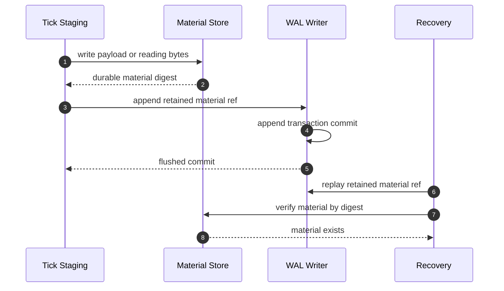

Missing material handling should be scoped:

| Missing Material                             | Recovery Response                                         |
| :------------------------------------------- | :-------------------------------------------------------- |
| Payload for one recovered pending submission | submission-level obstruction                              |
| Receipt material for a committed tick        | ticket/submission obstruction or degraded runtime posture |
| State delta needed to reconstruct frontier   | global recovery fault                                     |
| Runtime control posture material             | global recovery fault                                     |
| Diagnostic-only material                     | diagnostic loss, not causal obstruction                   |

## External Side-Effect Fencing

WAL makes Echo history durable. It does not by itself make outside effects
exactly once.

External effects include:

- writing a file;
- renaming or deleting a file;
- updating an external index;
- notifying another process;
- exporting a materialized artifact.

Rule:

```text
No external side effect may be performed before the causal transaction
authorizing that side effect is durably committed.
```

Preferred shape:

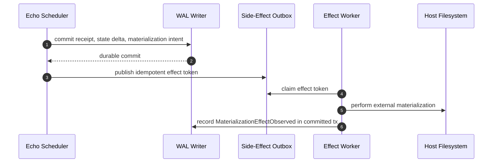

This prevents the bad case:

```text
file changed
process died before WAL commit
recovery says tick never happened
```

The outbox does not make every external system exactly once. It makes Echo's
authorization and observation of effects recoverable and idempotent.

If the process dies after the external artifact is materialized but before
`MaterializationEffectObserved` is recorded, recovery must not blindly perform
the effect again. It should read the idempotent effect token, verify the
expected artifact path, digest, and metadata, and then either record
`MaterializationEffectObserved`, retry, repair, or obstruct according to policy.

Filesystem materialization should use this shape:

```text
write temp artifact
fsync temp artifact
atomic rename
fsync containing directory
verify final artifact digest
record MaterializationEffectObserved in a committed WAL transaction
```

## Checkpoints

A checkpoint is a derived replay accelerator. It is usable only if it validates
against committed WAL history. It does not create, erase, or modify causal
history.

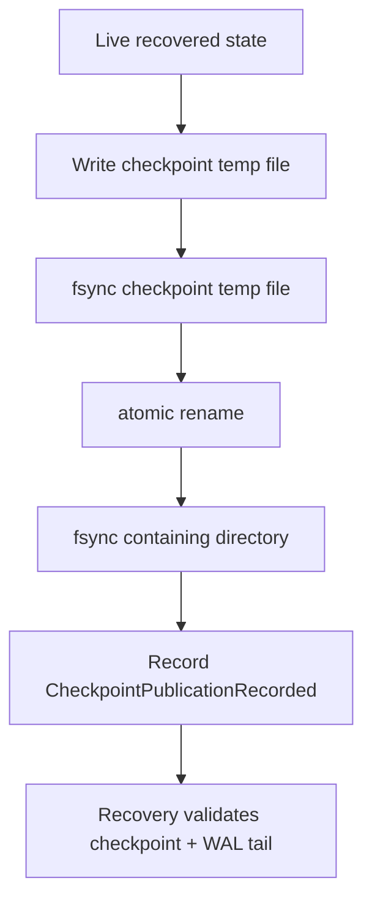

Checkpoint should bind:

- `checkpoint_id`
- `writer_epoch`
- `last_included_lsn`
- `last_included_commit_digest`
- `state_root`
- `index_roots`
- `retained_material_roots`
- `schema_version`
- `created_from_wal_digest`

Recovery verifies that the checkpoint chain matches the WAL chain. If the
latest checkpoint is invalid, recovery falls back to an earlier checkpoint or
full WAL replay.

`CheckpointPublicationRecorded` is audit and index evidence, not the only thing
that can make a checkpoint usable. A checkpoint file that exists after a crash
but lacks a publication record may still be used if it cryptographically and
semantically validates against the committed WAL chain.

## Filesystem And Object-Store Semantics

Strict filesystem durability must define:

- append frame;
- flush userspace buffers;
- fsync WAL file;
- fsync directory on segment creation or rename;
- fsync directory on checkpoint rename;
- handle torn final frame;
- handle partial segment header;
- handle missing segment;
- handle duplicate segment;
- handle segment gap.

Object stores are not filesystems. A strict object-store adapter must define
equivalent commit semantics using content-addressed object writes, version or
ETag verification, conditional manifest publication, and documented
read-after-write guarantees.

Durability modes:

| Mode                | Meaning                                                    |
| :------------------ | :--------------------------------------------------------- |
| `StrictFilesystem`  | File and directory sync semantics satisfy ACK contract.    |
| `StrictObjectStore` | Object and manifest commit semantics satisfy ACK contract. |
| `Buffered`          | Development or test mode only; not release durability.     |
| `ReadOnlyRecovery`  | Recover and inspect without appending.                     |
| `Disabled`          | Process-local only; cannot claim durable causal history.   |

An adapter must not claim strict durability unless it satisfies the ACK contract
for the target storage medium.

## Schema Evolution

WAL histories outlive binaries. Every record kind needs:

- kind;
- version;
- criticality;
- canonical encoding version;
- upgrade rule;
- unknown-record behavior.

Unknown critical causal records block recovery. Unknown non-critical diagnostic
records may be skipped only if their integrity validates and they are outside
the causal WAL.

## Security And Revelation Posture

The WAL may reference canonical envelopes, receipts, readings, and retained
material. It must preserve truth without leaking more than the active policy
allows.

Minimum rules:

- WAL headers must not leak app payload contents.
- Payload bytes may be digest-only, retained-ref, encrypted, or redacted.
- Recovery must preserve redaction posture.
- Inspectors must distinguish unavailable due to policy from missing due to
  corruption.

Useful material postures:

| Posture                     | Meaning                                                     |
| :-------------------------- | :---------------------------------------------------------- |
| `PRESENT`                   | Material exists and policy allows inspection.               |
| `REDACTED_BY_POLICY`        | Material exists but cannot be revealed to this observer.    |
| `ENCRYPTED_KEY_UNAVAILABLE` | Material may exist but the required key is unavailable.     |
| `MISSING`                   | Material reference exists but bytes are absent.             |
| `CORRUPT`                   | Material exists but fails digest or semantic validation.    |
| `OBSTRUCTED`                | Recovery or inspection cannot safely classify the material. |

## Recovery Certificate

After recovery, Echo should emit a summary that applications and operators can
inspect:

```text
RecoveryCertificate {
  checkpoint_used,
  wal_segments_scanned,
  first_lsn,
  last_lsn,
  committed_transactions_replayed,
  uncommitted_tail_truncated,
  obstructions_detected,
  recovered_frontier_digest,
  recovered_indexes_digest
}
```

For a product such as jedit, this lets the host surface a concrete statement:

```text
Recovered 3 pending submissions, 12 decided submissions, 0 obstructions.
History verified through LSN 1842.
```

`RecoveryCertificate` is a retained/read-model artifact produced by recovery.
It is not itself causal history unless recovery also commits a runtime posture
change. If recovery changes future scheduler behavior, Echo should commit an
explicit runtime-control record such as `RecoveryPostureRecorded`,
`SchedulerFaultQuarantined`, or `TrustedRuntimeControlRecorded`.

## Debugger Projection Boundary

[warp-ttd] must not treat Echo WAL as a storage source. It must not parse raw
segments, recover runtime state, truncate tails, or validate commit markers.

[Echo] may project WAL-backed evidence through adapter/read-model facts such
as:

```text
CausalCommitEvidence {
  posture
  source
  durabilityMode
  writerEpoch
  lsn
  transactionId
  commitDigest
  checkpointDigest?
  recoveryCertificateDigest?
  obstruction?
}
```

[warp-ttd] inspects those facts through CLI/MCP/read models. Echo remains the
authority for WAL validation, recovery, runtime admission, scheduler decisions,
and durable causal commit semantics.

## WAL Inspector

A future inspector should answer causal questions without replaying the whole
application in a debugger:

```text
echo wal inspect
echo wal validate
echo wal doctor --json
echo wal recover --read-only
echo wal explain-submission <id>
echo wal explain-ticket <id>
echo wal replay --to-lsn <lsn>
```

Example explanation:

```text
Accepted at LSN 1042
Ticket issued at LSN 1057
Tick receipt recorded in committed transaction at LSN 1061
State delta recorded in committed transaction at LSN 1062
Materialization pending
```

## Chaos Harness

The implementation should eventually include crash injection at every critical
boundary:

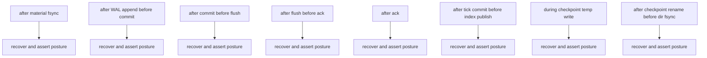

Required ugly test names are a feature:

- `crash_after_acceptance_commit_before_ack`
- `crash_after_submission_commit_before_ack_retry_returns_duplicate_posture`
- `crash_after_tick_commit_before_publish`
- `crash_after_material_fsync_before_wal_reference`
- `crash_during_checkpoint_rename`

The names should make the boundary visible.

## WAL Schema Linter

The WAL schema should have a mechanical noun guard. Generic record schema may
contain `canonical_envelope_digest`, `payload_ref`, `semantic_coordinate`,
`intent_kind`, and `application_namespace`. It must not contain application
product nouns such as editor, document, cursor, or selection.

It should also reject authority leaks such as:

```text
AppTickCommitted
ApplicationReceiptIssued
ClientRuntimeControl
AppTickRecorded
JeditEditCommitted
DocumentStateDelta
```

## Slice Plan

Implementation should not begin until the ACK contract and recovery validation
rules are accepted.

The active forty-five-slice WAL plan lives in `docs/BEARING.md`. The first
fifteen slices intentionally stop at in-memory WAL grammar, transaction
building, commit validation, recovery scanning, pure replay, and schema/authority
linting. Filesystem durability, live submission integration, tick integration,
checkpointing, outbox materialization, and jedit crash/restart gates remain
later slices.

## Release-Gate Witnesses

The implementation should eventually prove:

- `accepted_submission_is_not_returned_before_wal_commit`
- `crash_before_submission_commit_recovers_not_accepted`
- `crash_after_submission_commit_recovers_pending_submission`
- `duplicate_submit_after_recovery_returns_duplicate_posture`
- `same_submission_id_different_envelope_is_protocol_violation`
- `same_payload_new_submission_id_is_not_duplicate_without_policy`
- `tick_commit_is_all_or_nothing`
- `crash_before_tick_commit_commits_no_receipt`
- `crash_after_tick_commit_recovers_receipt_and_state_delta`
- `committed_receipt_correlation_rebuilds_after_restart`
- `torn_wal_tail_after_last_commit_is_truncated`
- `read_only_recovery_reports_uncommitted_tail_without_truncating`
- `corrupt_committed_transaction_blocks_recovery`
- `missing_retained_material_returns_typed_obstruction`
- `valid_checkpoint_without_checkpoint_published_record_can_be_used_after_validation`
- `checkpoint_published_without_checkpoint_blocks_or_obstructs_according_to_scope`
- `materialization_replay_detects_existing_artifact_before_retry`
- `record_kind_name_does_not_imply_commit_before_transaction_commit`
- `overlapping_writer_epochs_block_recovery`
- `strict_object_store_requires_conditional_manifest_commit`
- `wal_record_schema_contains_no_app_nouns`
- `application_cannot_append_tick_or_runtime_control_records`
- `external_effect_requires_committed_outbox_authorization`

## Final Doctrine

```text
Echo's WAL is the durable, append-only commit stream for generic
causal/runtime transactions.

In strict mode, Echo does not acknowledge accepted submissions, publish tick
outcomes, or report durable runtime posture changes until the corresponding
WAL transaction commit has been durably completed under the configured storage
policy.

Individual WAL records are not history by themselves. History begins at a
validated WalTransactionCommit.

Recovery validates committed transactions, rejects corrupt committed history,
ignores or truncates incomplete writable tails according to recovery mode,
rebuilds indexes from WAL/checkpoint material, and never invents half-accepted
submissions, half-ticks, uncorrelatable receipts, or unauthorized external
effects.
```

For applications:

```text
An application intent submitted through Echo becomes Echo-durable only when
Echo returns accepted submission evidence, or when recovery finds the committed
acceptance after a crash-before-ack and a retry resolves to stable duplicate
posture.

After restart, the host can recover that intent as not accepted, accepted
pending, decided applied, decided rejected, or obstructed. External artifacts
are materialized only from committed Echo history through explicit idempotent
side-effect authorization and observation records.
```
