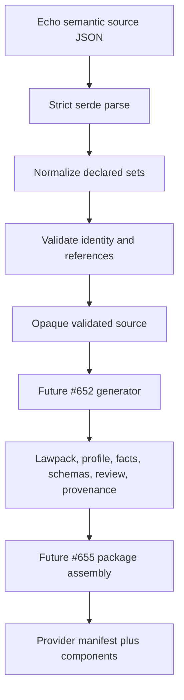

<!-- SPDX-License-Identifier: Apache-2.0 OR LicenseRef-MIND-UCAL-1.0 -->
<!-- © James Ross Ω FLYING•ROBOTS <https://github.com/flyingrobots> -->

<!-- prettier-ignore-start -->
<!-- markdownlint-disable -->
---
title: "PLATFORM-651 - Echo Edict Provider Semantic Source"
legend: "PLATFORM"
lane: "design"
issue: "https://github.com/flyingrobots/echo/issues/651"
status: "absorbed"
owners:
  - "@flyingrobots"
created: "2026-07-13"
updated: "2026-07-13"
---
<!-- markdownlint-enable -->
<!-- prettier-ignore-end -->

# PLATFORM-651 - Echo Edict Provider Semantic Source

Status: absorbed
Domain: contract hosting
Canonical output: docs/architecture/application-contract-hosting.md
Supersedes: none
Superseded by: none
Evidence: cargo +1.90.0 test -p echo-wesley-gen --test provider_semantic_source

## Linked Issue

- [Issue #651](https://github.com/flyingrobots/echo/issues/651)

## Decision Summary

Echo will own one strict, versioned JSON semantic declaration for the first
Edict provider operation. `echo-wesley-gen` will parse it into an opaque
validated value only after deterministic coordinate, authority, and reference
checks. The declaration is source truth; future lawpack, target-profile,
authority-fact, schema, provenance, and review files are generated projections.
The semantic declaration owns portable facts, source mappings, output/schema
bindings, and the generated metadata closure. Target metadata owns
operation-profile doctrine, write-class resolution, the low-level failure
taxonomy, and the native capability.

## Sponsored Human

An Echo maintainer wants one inspectable authority for the provider vocabulary
so that Echo and Edict can evolve without copying semantic facts between
repositories or treating generated JSON as authored truth.

## Sponsored Agent

An integration agent needs a checked source graph with stable failure kinds so
it can generate provider artifacts without inferring facts from tests, stale
SDL, or private runtime implementation details.

## Hill

By the end of this cycle, an agent can load the checked first-operation source
through `echo-wesley-gen`, obtain the same validated graph after set-like source
reordering, and receive a stable structural failure for every dangling or
duplicate reference.

## Current Truth

- `WesleyIR` currently models types, operations, codec identity, and registry
  identity, but not provider effects, write classes, obstructions, profiles,
  budgets, target capabilities, adapters, or artifact schemas
  ([crates/echo-wesley-gen/src/ir.rs#11:ebe8b6f73e1eb46439e07c73e1584875bc2929ad](https://github.com/flyingrobots/echo/blob/ebe8b6f73e1eb46439e07c73e1584875bc2929ad/crates/echo-wesley-gen/src/ir.rs#L11)).
- The existing runtime GraphQL fragments are a narrow ADR-0008 runtime freeze;
  they explicitly do not replace current WASM DTOs or describe every runtime
  fact
  ([schemas/runtime/README.md#6:ebe8b6f73e1eb46439e07c73e1584875bc2929ad](https://github.com/flyingrobots/echo/blob/ebe8b6f73e1eb46439e07c73e1584875bc2929ad/schemas/runtime/README.md#L6)).
- Echo's existing Edict bridge accepts only a narrow `echo.span-ir/v1`
  obstruction-receipt fixture and explicitly is not general provider dispatch
  ([crates/warp-core/src/edict_target_ir.rs#3:ebe8b6f73e1eb46439e07c73e1584875bc2929ad](https://github.com/flyingrobots/echo/blob/ebe8b6f73e1eb46439e07c73e1584875bc2929ad/crates/warp-core/src/edict_target_ir.rs#L3)).
- Edict's reviewed compatibility baseline already fixes the first target
  operation as `target.replace`, native intrinsic `echo.dpo@1.replace`, profile
  `continuum.profile.write/v1`, budget `p.tiny`, and failure key `rejected`
  ([crates/edict-syntax/tests/target_ir.rs#21:6e3a862a7c54f22de81c01aaeb8bd786ad32bdfd](https://github.com/flyingrobots/edict/blob/6e3a862a7c54f22de81c01aaeb8bd786ad32bdfd/crates/edict-syntax/tests/target_ir.rs#L21)).

## Problem

The first Echo provider artifacts cannot be generated honestly while their
semantic facts live only as hand-built test context across repositories. A
generator could otherwise select whichever SDL, test constant, or runtime name
it encountered first, making source ordering and stale relocated SDL an
authority mechanism.

## Scope

This cycle includes:

- the `echo.edict-provider-semantics/v1` declaration shape;
- one compatibility operation around Edict's reviewed `target.replace` slice;
- explicit authority, Core-alias, effect, write-class, obstruction, profile,
  budget, capability, adapter, generated-artifact, invocation-role, and
  schema-binding
  declarations;
- complete lawpack and target-profile resource projections, including explicit
  generated versus external resource provision;
- a separate package-root manifest projection and generated provenance member;
- deterministic validation and normalized set ordering;
- stable structural error kinds for duplicate and unknown references; and
- an explicit decision that relocated Wesley Echo SDL is not active authority.

## Non-Goals

This cycle does not include:

- generating lawpacks, target profiles, authority facts, CDDL, or provenance;
- implementing the WIT lowerer or verifier;
- admitting or executing Target IR in Echo;
- changing Edict syntax or Core semantics;
- generalizing the existing runtime GraphQL schema family; or
- restoring `schemas/wesley-relocated/`.

## User Experience / Product Shape

Not applicable. This is a machine-readable generator input and Rust API, not a
rendered product surface.

### Accessibility Considerations

The complete source graph and every failure category are available as typed
data. No fact is visible only through formatting or diagnostic prose.

## Runtime / API Contract

`echo-wesley-gen` exports:

```rust
pub fn parse_provider_semantic_source_v1(
    json: &str,
) -> Result<ValidatedProviderSemanticSourceV1, ProviderSemanticSourceError>;
```

The public declaration structs are strict serde shapes with unknown fields
rejected. Successful validation returns an opaque wrapper around a normalized
source. The wrapper exposes the normalized declaration for later generation,
but callers cannot construct a validated value directly.

The declaration carries:

- source identity and explicit authority-source references;
- provider-facing record shapes and Echo-owned aliases over Edict Core types;
- semantic effects with Edict execution/effect classification and typed
  failures;
- write classes, typed domain obstructions, exhaustive source mappings,
  operation profiles with full optic templates, and budgets;
- target capabilities, explicit semantic-obligation discharge, and optional
  direct adapters;
- one operation binding those references;
- generated package-member role, coordinate, Edict kind, authority-fact source,
  and schema contracts;
- package-root manifest identity, exact provider ABI and provider coordinate,
  lawpack/target-profile resource closure, and the Wesley #728
  generation-provenance contract; and
- complete provider invocation input/output roles plus immutable
  schema-domain/root bindings.

The target capability names the inner target-specific domain
`echo.span-ir/v1`. The WIT output is independently schema-bound under Edict's
outer canonical artifact domain `edict.target-ir.artifact/v1`, using the Echo
schema root `target-ir-artifact`. These identities are not interchangeable.

The first operation is the exact reviewed compatibility intent `a.b@1.t`, with
package-local `Input`, `Receipt`, and `Output` records over the Echo-owned alias
`a.b@1.Id`. That alias selects Edict's canonical Core coordinate
`String<max=16,canonical=raw-utf8>`; Edict owns string semantics, while Echo owns
the package alias and its 16-Unicode-scalar bound. The runtime `target.replace`
effect declares
`executionClass: runtime`, `effectKindHint: replace`, one target-owned typed
`rejected` failure, and singular footprint/cost obligations matching the Edict
v1 lawpack ABI. Its domain obstruction and source mapping are semantic-source
facts. Both payload schemas are empty bounded records because the v1 mapping
carries no payload transform. It uses native support. `directAdapters` is
explicitly empty, matching Edict's reviewed native lowerability baseline. The
schema still models direct-adapter selection, and an operation naming an absent
adapter fails with `UnknownAdapter`.

The target capability owns its resolved effect kind, write class, footprint
template, and cost template. Those target facts are not required to equal the
lawpack's advisory hint or abstract obligations. `semanticDischarge` explicitly
records which effect-kind hint and footprint/cost obligations the capability
discharges, and validation joins that mapping to the semantic effect.

The empty semantic `directAdapters` catalog does not remove the lawpack ABI's
target-adapter requirement. The lawpack projection carries one distinct
digest-locked adapter resource binding `target.replace` to generated target
profile `echo.dpo@1` and inner Target IR `echo.span-ir/v1`. Its verifier is a
generated declarative ruleset, avoiding a dependency cycle with the later
executable verifier component.

The target-owned `continuum.profile.write/v1` profile supplies an
`affectReintegration`/`affect` optic template, the abstract
`target.replace.footprint` aperture, carry-or-obstruct support, reject-on-loss
disposition, and the narrow
`echo.dpo.operation-mode.replace-only/v1` effect predicate. These are explicit
Echo target-metadata decisions; a generator does not infer them from the profile
name.

## Generated Artifact Closure

`generatedArtifacts` is the future provider manifest's generated
package-member inventory, not the manifest preimage itself. It contains:

- `lawpack.echo-dpo` (`lawpack`) from `echo.dpo-lawpack@1`;
- `target-profile.echo-dpo` (`targetProfile`) from `echo.dpo@1`;
- two `authorityFacts` roles, one for the lawpack and one for the target profile;
- `generated-artifact-profile.echo-dpo-registration` for helper output;
- `provenance.provider-generation` using Wesley's provenance document;
- `schema.echo-provider-artifacts` containing self-contained CDDL; and
- `review.provider-generation`, a non-authoritative review projection.

`packageManifest` separately declares
`provider-manifest.echo:echo.edict-provider-manifest@1`, the exact component
world `edict:target-provider@1.0.0`, and provider coordinate
`echo.edict-provider@1`. It is assembled in #655 after #653 and #654 provide
component bytes; it is not generated by #652 and cannot list itself as a
digest-locked member.

Authority facts are split because `edict.authority-facts/v1` binds exactly one
lawpack or target-profile source. The lawpack projection supplies the budget
facts. The target-profile projection supplies operation-profile and resolved
effect write-class facts.

The lawpack projection freezes its export corpus, native target adapter,
declarative verifier, compatibility document, and conformance corpus. The
target-profile projection freezes all mandatory v1 resource slots:
intrinsics, operation profiles, footprint and cost algebra, Target IR,
obstruction taxonomy, lowerer and verifier contracts, sandbox, fuel model,
bundle profile, generated-artifact profiles, encoding rules, diagnostic ABI,
determinism policy, and conformance corpus.

Each resource is either `generated` by #652 or `external`. Generated lowerer and
verifier resources are declarative target-profile contract documents, never
component bytes. The package manifest assembled by #655 separately selects the
exact executable components and their frozen WIT world attestations.

An external declaration selects a required Edict contract but does not bless
arbitrary caller bytes. #652 must receive trusted, digest-locked inputs whose
publication and authority are tracked by
[Edict #158](https://github.com/flyingrobots/edict/issues/158). The source
carries no placeholder or hand-authored output digest.

The two authority-facts artifacts bind `contractOwner` to
[Edict #157](https://github.com/flyingrobots/edict/issues/157). Its canonical
CBOR/CDDL contract and Edict consumer compatibility landed in
[Edict PR #159](https://github.com/flyingrobots/edict/pull/159); Echo does not
mint a second wire schema under `edict.authority-facts/v1`.

The `generationProvenance` member requests Wesley's public
`GenerationProvenanceManifestV1` owned by
[Wesley #728](https://github.com/flyingrobots/wesley/issues/728). Edict
[issue #155](https://github.com/flyingrobots/edict/issues/155) landed the generic
provider artifact category, so the evidence is packageable without being
mislabeled as review, generated-artifact-profile, or executable metadata. Edict
routes the generated provenance envelope; Wesley owns its document schema.

## Lower Modes

The lower mode is direct in-memory JSON parsing. It requires no filesystem,
network, environment, registry, clock, or Echo runtime.

## Data / State Model

- **Source of truth:**
  `schemas/edict-provider/echo-provider-semantics-v1.json`.
- **Derived state:** a normalized validated Rust value, followed later by
  generated artifacts.
- **Invalid states:** wrong versions, duplicate identities or keys, Edict Core
  ownership claims, unbounded types, invalid failure keys, wrong authority
  families, dangling references, incomplete projections, missing semantic
  discharge, ambiguous implementations, wrong package identity, or wrong
  invocation schema bindings.
- **Reset behavior:** reparse the explicit source bytes.
- **Serialization:** strict JSON source; #652 owns canonical artifact encoding.
- **Determinism:** declaration arrays and declared sets normalize by exact UTF-8
  ordering.



## Echo Authority Boundary

The checked file contains two explicit authority families. The Echo semantic
declaration owns provider records and Core aliases, the portable effect, domain
obstruction and mapping, budget, operation, generated metadata closure, and
outer invocation/schema binding. Edict retains authority over Core string
semantics. Echo target metadata owns the operation profile and optic template,
write class, low-level failure taxonomy, native capability, and inner
`echo.span-ir/v1` selection. GraphQL remains authoritative only for types
actually authored there; none are imported into this minimal fixture. Runtime
implementation remains authoritative for execution and receipts, but it does
not retroactively define provider metadata. Edict owns its source language,
Core, provider ABI, and generic validation rules.

Generated artifacts have no independent authority. A stale relocated SDL
cannot override a declaration because validation has no search path or source
precedence: every fact names exactly one authority, and duplicate coordinates
fail before reference resolution.

## Relocated SDL Reconciliation

This design resolves #461 without restoring old Wesley-owned Echo SDL:

- old `@wes_codec` and `@wes_version` annotations are not current policy; a
  useful concept must be re-authored in an Echo-owned schema before Wesley may
  compile it;
- CAS, runtime, and worldline shapes remain owned by their current Echo Rust and
  runtime-schema surfaces rather than copied from relocated SDL;
- `echo-wasm-abi` remains the authority for its hand-authored Rust DTO and spec
  surface; this slice creates no duplicate GraphQL authority;
- `echo_registry_api::RegistryInfo::registry_version` remains the canonical
  numeric `u32` registry-layout version;
- `echo_wasm_abi::kernel_port::RegistryInfo::registry_version` remains an
  `Option<String>` browser/kernel transport field containing the decimal
  rendering when a registry is installed; this transport representation is not
  provider semantic authority, and this slice changes no existing ABI shape;
- relocated SDL stays in Git history only. It is neither archived under an
  active schema path nor consulted by the provider validator.

## Determinism / DIND Posture

Top-level declaration families and explicitly set-like nested fields normalize
by exact string order before reference validation. Target adapters use a total
tuple order over profile role, Target IR role, adapter resource, and effects.
Duplicate target-profile selectors reject before artifact generation. Positional
effect parameters retain source order. No map iteration, clock, randomness,
filesystem state, or environment state affects validation. Full DIND execution
is not required because this slice is a pure parser/validator; focused reorder
tests are the determinism witness.

## WAL / WSC / Retention Posture

Not applicable. No causal history, receipt, retained material, recovery state,
WAL, WSC, or CAS behavior changes.

## Accessibility Posture

- Semantic labels and facts use typed declarations and stable coordinates.
- Focus order, keyboard behavior, and visual-only information are not involved.
- The source contains no secrets or ambient host data.

## Localization / Directionality Posture

Not applicable. No user-visible strings or locale-dependent ordering are added.

## Agent Inspectability / Explainability Posture

An agent can inspect the checked JSON fixture, the normalized public Rust value,
and stable `ProviderSemanticSourceErrorKind` values. It never needs diagnostic
text, a runtime trace, or a generated review file to determine authority.

## App-Noun Boundary

The selected names are Echo/Edict compatibility vocabulary. No Jedit, Graft,
editor, filesystem, or product nouns enter production Echo core. The semantic
source remains in `echo-wesley-gen`, outside `warp-core` execution machinery.

## Linked Invariants

- Tests are executable specification.
- Runtime truth beats type theater.
- Design becomes repository truth.
- Echo owns runtime semantics; Edict remains runtime-neutral.
- Generated files are projections, never semantic authority.
- Determinism is binary.

## Design Alternatives Considered

### Option A: Extend the ADR-0008 GraphQL fragments

Pros:

- reuses an existing authored schema language.

Cons:

- the fragments do not own target capabilities, budgets, write classes,
  provider roles, or schema roots;
- adding unrelated directives would make GraphQL appear authoritative for facts
  it cannot express honestly.

### Option B: Infer facts from runtime Rust and Edict fixtures

Pros:

- avoids a new source artifact.

Cons:

- creates hidden filesystem discovery and source precedence;
- makes refactors semantic changes;
- permits stale or duplicate artifacts to win by traversal order.

### Option C: Add one explicit Echo semantic declaration

Pros:

- gives every non-GraphQL fact one checked owner;
- supports deterministic generation without coupling Echo to Edict internals;
- leaves runtime execution authority in runtime code.

Cons:

- introduces a small versioned schema that Echo must maintain.

## Decision

Choose Option C. The first file is deliberately narrow and compatibility-fixture
shaped. New operations expand the checked source in later slices; they do not
weaken validation or create fallback source discovery.

## Implementation Slices

- [x] Slice 1: add RED semantic-source validation tests and fixture.
- [x] Slice 2: implement strict normalized parsing and structural validation.
- [x] Slice 3: publish source ownership docs and close relocated-SDL ambiguity.

## Tests To Write First

Behavior tests required:

- [x] checked first-operation source validates;
- [x] top-level and nested set reordering produces an equal validated value;
- [x] conflicting duplicate coordinates fail with `DuplicateCoordinate`;
- [x] stale relocated SDL cannot override an existing coordinate;
- [x] unknown type, failure, obstruction, profile, budget, capability, and adapter
      references fail with their exact stable kinds; and
- [x] every invocation input and output resolves one declared schema
      role/domain/root;
- [x] typed payload, exhaustive mapping, profile/effect, capability/effect,
      generated-contract, output-domain, and schema-root mismatches fail closed.
- [x] recursive type graphs and invalid Edict failure identifiers fail with
      stable full error tuples;
- [x] wrong family domains, authority kinds, and non-authoritative source paths
      fail before generation;
- [x] capability-owned write classes, aperture/optic/atomic joins, and inner
      Target IR coherence fail closed;
- [x] Echo Core aliases derive exact Edict coordinates and count Unicode scalar
      values rather than UTF-8 bytes;
- [x] target-authoritative capability facts remain independent while explicit
      semantic-discharge mappings fail closed;
- [x] every runtime effect resolves exactly one native or direct-adapter
      implementation;
- [x] profile source aliases and lawpack target-profile selectors are unique,
      while target-adapter ordering remains total;
- [x] provider-manifest self-inventory and invalid authority-fact source
      partitions or contract owners fail structurally; and
- [x] lawpack, target-profile, review, schema, generated-profile, exact external
      resources, package ABI/coordinate, invocation inputs, and generic
      generation-provenance closure is complete.

## Acceptance Criteria

The work is done when:

- [x] the behavior tests above are green;
- [x] the checked source names one authority and domain for each fact;
- [x] every generated artifact, manifest resource, provenance output, and
      invocation input/output maps to its owning contract;
- [x] docs state that runtime GraphQL and relocated SDL are not fallback sources;
- [x] issue #461 is reconciled without restoring stale SDL; and
- [ ] CI and local validation are green.

## Validation Plan

```bash
cargo +1.90.0 test -p echo-wesley-gen --test provider_semantic_source
cargo +1.90.0 clippy -p echo-wesley-gen \
  --lib --test provider_semantic_source -- -D warnings -D missing-docs
cargo +1.90.0 xtask pr-preflight
git diff --check
```

## Playback / Witness

```bash
cargo +1.90.0 test -p echo-wesley-gen --test provider_semantic_source
```

The checked source is
`schemas/edict-provider/echo-provider-semantics-v1.json`.

## Risks

- The first source could accidentally claim runtime behavior not yet present.
  Mitigation: its operation is explicitly compatibility-fixture scoped, and the
  design separates target metadata from runtime execution authority.
- The new declaration could duplicate GraphQL later. Mitigation: every fact has
  an explicit authority reference, and duplicate coordinates are invalid.
- The shape could pre-empt generic Wesley design. Mitigation: this schema is
  Echo-owned; Wesley #728 supplies only domain-neutral generation input and
  provenance contracts.

## Follow-On Debt

- #652 generates the declared artifacts.
- #653 implements the lowerer component.
- #654 implements the verifier component.
- Wesley #728 supplies canonical extension-generation input and provenance.

## Retrospective

What changed from the design:

- The final source carries the exact effect/failure/obstruction and optic fields
  needed by Edict's v1 ABIs. The obstruction mapping moved from the target-owned
  failure declaration onto the semantic operation so the authority split is
  explicit. Footprint and cost obligations became singular to match the lawpack
  ABI instead of forcing generation to choose from a list.
- Write-class authority moved entirely to target metadata and the selected
  native capability. The source now separates the #655 package-root manifest
  from #652 package members, partitions authority facts by Edict source kind,
  and freezes every mandatory lawpack and target-profile resource.

What the tests proved:

- The checked source validates and normalizes independently of declared set
  order. Strict parsing, duplicate keys, dangling references, stale authority,
  incomplete mappings, non-empty payload mappings, profile/capability drift,
  missing or ambiguous implementations, duplicate target-profile selectors,
  and incorrect output contracts all fail with stable structured kinds.
- Bounded type closure, identifier validity, authority family, target IR
  coherence, manifest self-reference, authority-fact projection, and complete
  artifact-resource closure have deterministic negative witnesses.

What remains open:

- #652 generates and validates the canonical provider artifacts. #653 and #654
  implement the lowerer and verifier. Runtime presence-sensitive replace remains
  deliberately unclaimed until those components and admitted execution land.
- Wesley #728 must publish the provenance document type before #652 can emit
  final bytes. Edict #155 already supplies the packageable
  `generationProvenance` artifact category, so #655 can include that generated
  member directly.
- Edict #158 must publish trusted canonical resources before #652 accepts the
  external target-profile contract inputs. The authority-facts ABI and consumer
  bridge previously tracked by Edict #157 landed in Edict PR #159.

PR:

- Pending.
