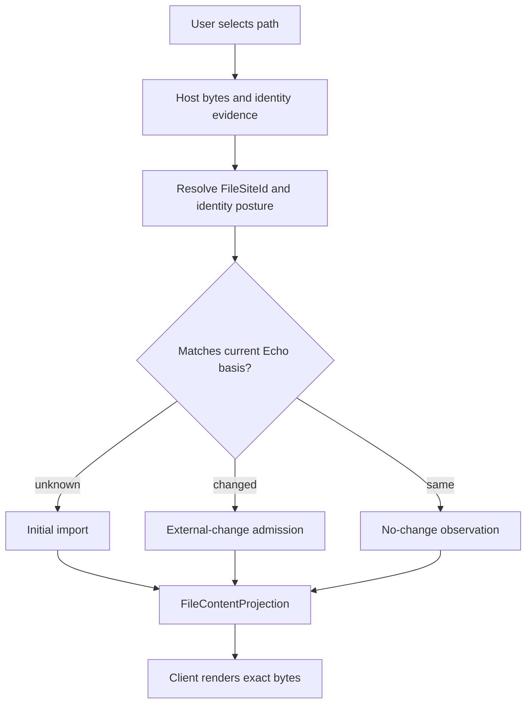
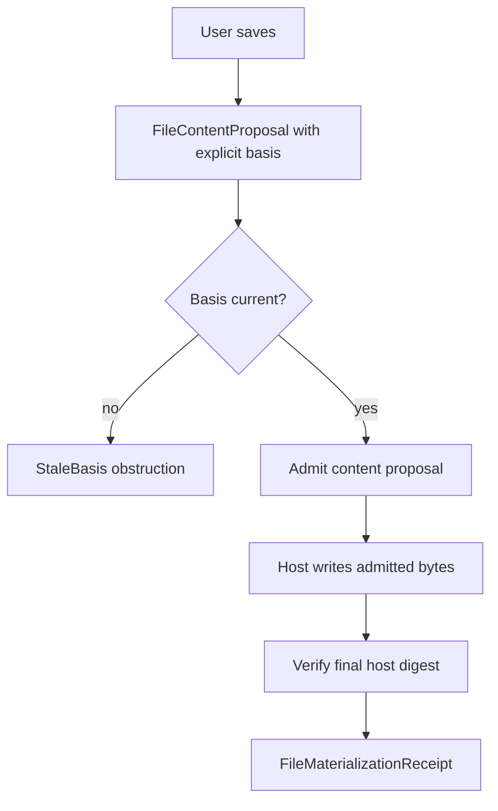
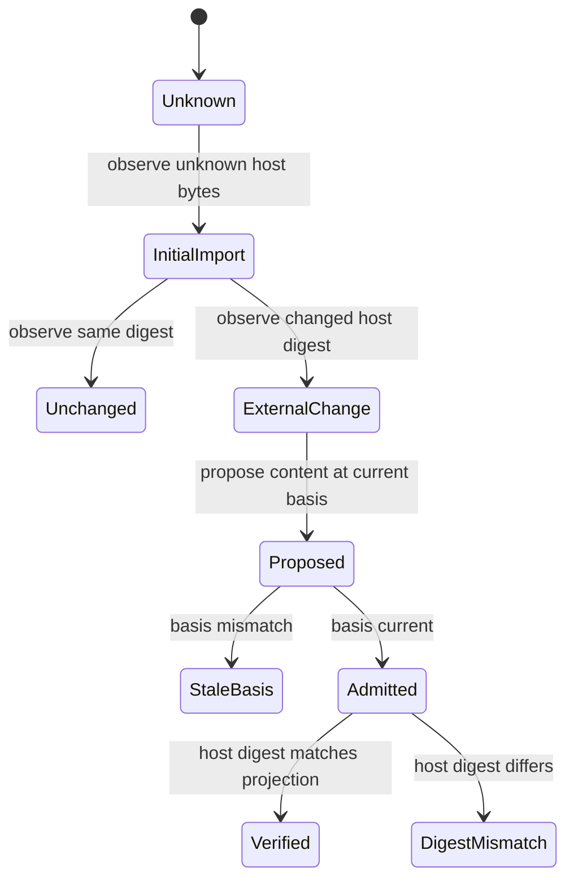

<!-- SPDX-License-Identifier: Apache-2.0 OR LicenseRef-MIND-UCAL-1.0 -->
<!-- © James Ross Ω FLYING•ROBOTS <https://github.com/flyingrobots> -->

<!-- prettier-ignore-start -->
<!-- markdownlint-disable -->
---
title: "PLATFORM-0533 - Echo-Owned File Aperture"
legend: "PLATFORM"
lane: "design"
issue: "https://github.com/flyingrobots/echo/issues/533"
status: "active"
owners:
  - "@flyingrobots"
created: "2026-06-06"
updated: "2026-06-06"
---
<!-- markdownlint-enable -->
<!-- prettier-ignore-end -->

# PLATFORM-0533 - Echo-Owned File Aperture

## Linked Issue

- [Issue #533](https://github.com/flyingrobots/echo/issues/533)

## Decision Summary

Echo owns the standard host-file aperture contract used by Jedit, WARP DRIVE,
and other local-file consumers. The aperture observes host bytes, resolves
host-local file-site identity posture, admits external drift, accepts content
proposals against explicit basis tokens, and verifies materialization without
letting applications maintain private causal file ledgers.

## Sponsored Human

A Jedit user wants to open any file from disk, see exactly the bytes there,
edit normally, and save normally so that the editor feels ordinary, without
having to understand Echo observations, basis tokens, drift receipts, or
materialization verification.

## Sponsored Agent

An agent needs a machine-readable file aperture contract so it can inspect why
a file has particular bytes, replay or reconstruct a retained coordinate, and
distinguish host observations from materializations, without inferring state
from Jedit UI caches, WARP DRIVE FUSE internals, or private app logs.

## Hill

By the end of this cycle, Echo exposes a reusable Rust file aperture crate that
can observe host file material, resolve file-site identity posture, project
bytes at a basis, obstruct stale proposals, and verify materialized host bytes,
and the repo proves it with focused `echo-file-aperture` contract tests.

## Current Truth

Before this branch, Echo already had the runtime ingredients for witnessed
admission, scheduler-owned receipt correlation, QueryView readings, retained
evidence posture, and app-noun-clean contract hosting:
[`docs/BEARING.md#52:d5945169511a5ab937824fd6e49adf06f4c19ae9`](https://github.com/flyingrobots/echo/blob/d5945169511a5ab937824fd6e49adf06f4c19ae9/docs/BEARING.md#L52)
and
[`docs/BEARING.md#66:d5945169511a5ab937824fd6e49adf06f4c19ae9`](https://github.com/flyingrobots/echo/blob/d5945169511a5ab937824fd6e49adf06f4c19ae9/docs/BEARING.md#L66).

Before this branch, the workspace did not contain an `echo-file-aperture`
member; the merge-target workspace member list moved directly from
`echo-app-core` to `echo-config-fs`:
[`Cargo.toml#13:d5945169511a5ab937824fd6e49adf06f4c19ae9`](https://github.com/flyingrobots/echo/blob/d5945169511a5ab937824fd6e49adf06f4c19ae9/Cargo.toml#L13).

Before this branch, Method used filesystem backlog cards as the primary pull
source and did not yet require every design packet to link a GitHub Issue:
[`METHOD.md#55:d5945169511a5ab937824fd6e49adf06f4c19ae9`](https://github.com/flyingrobots/echo/blob/d5945169511a5ab937824fd6e49adf06f4c19ae9/METHOD.md#L55).

The implementation added by this branch is intentionally in-memory. It does
not yet bind observations, proposals, or materialization receipts to WAL/WSC
durability.

## Problem

Host files sit at an awkward boundary. Users call opening a file a read and
saving a file a write, but at the Echo boundary both actions can create causal
history. Opening can import unknown bytes or admit external drift. Saving must
admit desired content against an explicit basis before any host write can be
called successful.

The first implementation also exposed a real contract bug: `FileSiteId` was
originally derived from both `path_evidence` and `platform_identity`, making it
path-sensitive even when stable platform identity existed. That poisoned the
rename story because the same host-local file moved from `/a/demo.txt` to
`/b/demo.txt` became two different file sites.

## Scope

This cycle includes:

- adding the `echo-file-aperture` crate as a workspace member;
- defining host snapshot, file site, basis, content proposal, observation, and
  materialization verification types;
- resolving file-site identity by authority tier instead of hashing all
  evidence together;
- exposing `PlatformStable` versus `PathBound` identity posture;
- proving path moves preserve `FileSiteId` only when platform identity is
  available;
- documenting that `FileSiteId` is host-aperture evidence, not portable WSC
  causal identity.

## Non-Goals

This cycle does not include:

- implementing a FUSE mount in Echo;
- making Echo core a filesystem runtime;
- adding Jedit editor nouns to Echo production core;
- using WARP DRIVE inode or fixture-tree scaffolding as the shared contract;
- wiring file aperture records into scheduler-owned ticks, WAL, WSC, or CAS;
- guaranteeing reconstruction after Echo retention policy redacts, prunes,
  encrypts, or obstructs required support material.

## User Experience / Product Shape

The happy-path product shape remains ordinary:

```text
open file -> contents appear
edit -> text changes
save -> saved
external edit -> current disk bytes appear or a clear obstruction is reported
```

The Echo-facing open flow is:



The Echo-facing save flow is:



### Accessibility Considerations

Rendered clients should not expose Echo jargon during successful open and save.
When an obstruction affects the user, clients should translate the structured
posture into clear product language while preserving machine-readable receipts.

## Runtime / API Contract

The contract is the `echo-file-aperture` Rust crate.

Relevant exported types:

- `HostFileIdentity`
- `HostFileSnapshot`
- `FileSiteId`
- `FileSiteIdentityPosture`
- `FileSiteResolution`
- `FileContentDigest`
- `FileBasisToken`
- `FileContentProjection`
- `HostFileObservationReceipt`
- `FileContentProposal`
- `FileContentIntentReceipt`
- `FileMaterializationReceipt`
- `FileApertureError`
- `InMemoryFileAperture`

Identity rules:

- path evidence is observation evidence;
- platform identity is stronger host-local file evidence;
- `FileSiteId` is host-aperture evidence used to bind local file observations;
- `FileSiteId` is not `WorldlineId`;
- `WorldlineId` remains portable logical document identity;
- `ContentRef` or equivalent retained material refs name immutable bytes;
- future `BindingRef` or `AnchorId` machinery should express rebinding between
  host file sites and causal document worldlines.

Derivation rules:

```text
if platform_identity exists:
  FileSiteId = H("echo.file-site.v2.platform", platform_identity)
  posture = PlatformStable
else:
  FileSiteId = H("echo.file-site.v2.path-bound", path_evidence)
  posture = PathBound
```

Platform identity bytes should include any host or aperture namespace needed to
make the bytes meaningful for that local filesystem aperture. Echo must not
treat platform identity as universal WSC identity across machines.

## Lower Modes

This cycle is a Rust API and test-surface change, not a rendered UI. The lower
mode is the deterministic contract test output from `cargo test -p
echo-file-aperture`. Future CLI or pipe surfaces must expose posture as
structured data, not English-only text.

## Data / State Model

State posture:

- Source of truth: in this slice, `InMemoryFileAperture`; later WAL/WSC.
- Derived state: `FileSiteId`, `FileBasisToken`, content and metadata digests.
- Invalid states: empty path evidence, empty platform identity, stale basis,
  and site mismatch.
- Reset behavior: dropping the in-memory aperture drops state.
- Serialization: hash preimages use domain prefixes and length prefixes.
- Determinism: `BTreeMap` ordering and BLAKE3 provide local deterministic
  results.



## Echo Authority Boundary

Echo owns:

- file-site resolution posture;
- basis-token derivation;
- content admission;
- stale-basis obstruction;
- materialization verification posture;
- future WAL/WSC retention for file aperture evidence.

Applications and host adapters provide:

- host path evidence;
- platform identity evidence when available;
- exact observed bytes;
- host read/write capabilities;
- product-specific UI and localized copy.

Applications must not keep private causal file logs as fallback authority. If
Echo lacks retained evidence because of policy, redaction, corruption, or
missing material, the information is unavailable through Echo.

## Determinism / DIND Posture

This slice touches hashing and canonical identity. Hash preimages are
domain-separated and length-prefixed. File aperture state uses `BTreeMap` so
iteration order remains deterministic. No clocks, randomness, or wall-time
cadence are involved.

The focused determinism witness is the contract test matrix in
`crates/echo-file-aperture/tests/file_aperture_tests.rs`. Full DIND is deferred
until file aperture records bind into scheduler-owned ticks or WAL/WSC replay.

## WAL / WSC / Retention Posture

This slice is explicitly in-memory. It defines the contract shape and
deterministic identity behavior but does not claim crash-recoverable file
history.

Future WAL/WSC work must retain enough evidence to answer:

- which host observation was accepted;
- which basis was current;
- whether a proposal was admitted or obstructed;
- which materialization was authorized;
- whether verification matched the admitted projection;
- why reconstruction is unavailable when support material is missing.

## Accessibility Posture

Accessibility posture:

- Semantic labels or facts: receipts expose posture enums and digests.
- Focus order or ownership: not applicable; this is not rendered.
- Hidden or visual-only information: not applicable; no UI scraping required.
- Keyboard behavior: not applicable.
- Secret or redaction behavior: future retention must report missing or
  redacted material structurally.

## Localization / Directionality Posture

No user-visible strings are added to product surfaces. Error messages are Rust
diagnostics, not localized UI copy. Clients such as Jedit and WARP DRIVE own
localized wording for user-facing file-open, file-save, and obstruction flows.

## Agent Inspectability / Explainability Posture

Agents can inspect:

- `FileSiteId`;
- `FileSiteIdentityPosture`;
- `HostFileObservationReceipt`;
- `FileBasisToken`;
- `ContentAdmissionPosture`;
- `MaterializationVerificationPosture`;
- expected and observed digests;
- typed `FileApertureError` variants.

No agent has to scrape pixels, terminal prose, or app-local caches to tell
whether identity was platform-stable or path-bound.

## Linked Invariants

- Tests are executable spec.
- Echo owns causality; applications own presentation.
- Paths are evidence, not authority.
- `FileSiteId` is not `WorldlineId`.
- Missing retained evidence obstructs; apps do not invent fallback truth.
- Echo core remains app-noun-clean.

## Design Alternatives Considered

### Option A: Hash all identity evidence together

Pros:

- Simple implementation.
- Every changed input changes the digest.

Cons:

- Path moves create new file sites even when stable platform identity exists.
- The preimage hides authority precedence behind field order.
- It violates the path-as-evidence invariant.

### Option B: Select one authority tier

Pros:

- Platform-stable identity survives rename.
- Path-only identity is honestly weaker and visibly `PathBound`.
- Domain-separated preimages make authority tier explicit.

Cons:

- Callers must inspect posture.
- Future cross-machine rebinding needs explicit `WorldlineId` or binding
  machinery instead of pretending host IDs are portable.

## Decision

Choose Option B. `FileSiteId` derivation selects a single identity authority
tier. Platform identity wins when present and path evidence remains observation
evidence. Path-only identity remains supported but is explicitly path-bound.

## Implementation Slices

- [x] Slice 1: Record Echo-owned file aperture design.
- [x] Slice 2: Add `echo-file-aperture` crate with in-memory observations,
      proposals, basis obstruction, and materialization verification.
- [x] Slice 3: Fix `FileSiteId` derivation so platform identity does not include
      path bytes and expose identity posture.
- [ ] Slice 4: Bind file aperture observations and receipts to scheduler-owned
      ticks.
- [ ] Slice 5: Retain file aperture evidence through WAL/WSC/CAS.
- [ ] Slice 6: Add client conformance fixtures for Jedit and WARP DRIVE.

## Tests To Write First

Behavior tests required:

- [x] Unknown host file admits initial import before returning projection.
- [x] Known unchanged host file records no-change posture.
- [x] Known changed host file admits external-change transition.
- [x] Current-basis save admits content and verifies materialization.
- [x] Stale-basis save obstructs without changing projection.
- [x] Digest mismatch returns materialization obstruction.
- [x] Same platform identity with different path evidence keeps one
      `FileSiteId`.
- [x] Different platform identity with same path evidence produces different
      `FileSiteId`.
- [x] Path-only identity is explicitly `PathBound`.
- [x] Platform identity derivation does not include path bytes.

Documentation and process tests:

- [x] Design packet links GitHub Issue #533.
- [x] Design packet names real validation commands.

## Acceptance Criteria

The work is done when:

- [x] Behavior tests prove the in-memory file aperture contract.
- [x] Runtime API exposes `PlatformStable` versus `PathBound` posture.
- [x] Path moves preserve `FileSiteId` only when stable platform identity is
      available.
- [x] Docs state that `FileSiteId` is not `WorldlineId`.
- [x] Issue and design packet are linked.
- [ ] WAL/WSC durability is proven in a later cycle.
- [ ] Jedit and WARP DRIVE consume the shared contract in later cycles.

## Validation Plan

Commands expected before PR:

```bash
docs=(
  docs/design/echo-owned-file-aperture.md
  crates/echo-file-aperture/README.md
  docs/method/design-template.md
  docs/method/README.md
  docs/technical-teardown.md
  METHOD.md
  docs/BEARING.md
)

cargo fmt --check -p echo-file-aperture
cargo test -p echo-file-aperture
cargo clippy -p echo-file-aperture --all-targets -- -D warnings
cargo check --workspace
./scripts/check-no-app-nouns-in-core.sh
pnpm exec markdownlint-cli2 "${docs[@]}"
pnpm exec prettier --check "${docs[@]}"
dead_ref_args=()
for doc in "${docs[@]}"; do
  dead_ref_args+=(--file "$doc")
done
cargo xtask lint-dead-refs "${dead_ref_args[@]}"
git diff --check origin/main...HEAD
```

Full `cargo xtask lint-dead-refs` is currently blocked by repository baseline
dead links from the historical backlog migration. Use the touched-file scoped
command for this cycle unless that baseline is repaired separately.

## Playback / Witness

Run:

```bash
cargo test -p echo-file-aperture
```

Review the identity-specific tests:

- `platform_identity_keeps_file_site_stable_across_path_move`
- `different_platform_identity_wins_over_same_path`
- `path_only_identity_is_explicitly_path_bound`
- `path_only_move_creates_distinct_path_bound_sites`
- `platform_site_derivation_does_not_include_path_bytes`

These prove the corrected authority-tier behavior.

## Risks

Known risks:

- Platform identity bytes from two host apertures can collide if callers omit
  host namespace evidence.
- Path-bound IDs can still be mistaken for durable document identity.
- Whole-file content proposals are simple but may be wasteful.
- In-memory receipts can be mistaken for durability.

Mitigations:

- Document that platform identity should include host/aperture namespace.
- Expose `FileSiteIdentityPosture` everywhere callers need to inspect site
  strength.
- Keep `FileSiteId` separate from `WorldlineId`.
- Leave WAL/WSC integration as explicit follow-on work.

## Follow-On Debt

- Create WAL/WSC integration issues when the next file aperture cycle begins.
- Add shared conformance fixtures for Jedit and WARP DRIVE.
- Add an explanation surface equivalent to WARP DRIVE's proposed
  `/.warp/why/<path>` and Jedit's history drawer.
- Decide whether future APIs need explicit `BindingRef` or `AnchorId` types for
  local file site to worldline rebinding.

## Retrospective

What changed from the design:

- The review found a P1 identity bug. `FileSiteId` now selects one authority
  tier instead of hashing path and platform evidence together.
- The design packet now follows the Echo template and links Issue #533.

What the tests proved:

- Platform-stable identity survives path moves.
- Path-only identity is explicit and rename-sensitive.
- Platform-derived `FileSiteId` preimages do not include path bytes.
- Stale-basis and materialization-obstruction behavior still works.

What remains open:

- WAL/WSC durability.
- Scheduler-owned admission for file aperture events.
- Jedit and WARP DRIVE client integration.

PR:

- Not opened yet for this branch.
