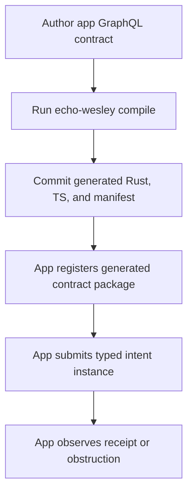
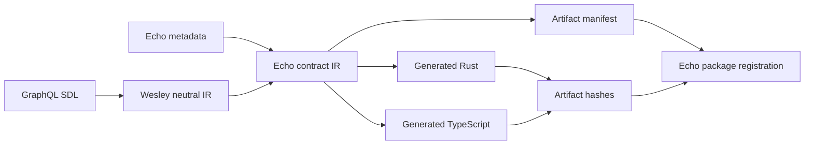

<!-- markdownlint-disable MD025 -->

# PLATFORM - Echo-Wesley Contract Compiler

<!-- markdownlint-enable MD025 -->

## Linked Issue

- Issue: TBD before implementation PR.

## Decision Summary

Echo-Wesley is the app-facing compiler for Echo contracts. Wesley parses
GraphQL into neutral IR and preserves directives as opaque data. Echo-Wesley
consumes that IR, interprets Echo-owned contract metadata, and emits the Rust
and TypeScript artifacts that let applications register generated Echo types,
contract packages, operation bindings, codecs, intent packers, query observers,
and artifact manifests without hand-writing Echo wire protocol boilerplate.

The contract rule is deliberately narrow:

```text
Wesley parses.
Echo-Wesley compiles.
Applications include generated Echo-Wesley artifacts.
```

Applications such as Graft and jedit should call `echo-wesley compile`, not raw
`wesley emit ...` commands, for Echo contracts. Echo-Wesley may reuse Wesley
libraries internally, but the application build surface is Echo-owned.

The initial implementation uses Echo-owned GraphQL directives in SDL. Sidecar
metadata is reserved for a later compatibility/design slice. If both are later
supported, Echo-Wesley must define explicit precedence rules and conflict
diagnostics before accepting both sources in the same compile path.

## Sponsored Human

An application author wants to define app-specific Echo intents and read models
in GraphQL so that Echo-Wesley generates secure Rust and TypeScript contract
glue, without hand-writing EINT envelopes, Echo type registration, operation
bindings, codec registration, registration manifests, op ids, receipt decoders,
or query observer registration code.

## Sponsored Agent

An implementation agent needs an inspectable Echo-Wesley compiler contract so it
can migrate Graft and jedit toward generated registration/client artifacts,
without inferring Echo semantics from generic Wesley output or app-local
handwritten protocol shims.

## Hill

By the end of this compiler campaign, a sibling app can run one Echo-Wesley
compile command over its GraphQL contract and receive:

- generated Rust contract-host artifacts;
- generated TypeScript app artifacts;
- generated registration/bootstrap helpers;
- generated typed submit/observe client helpers;
- generated Echo type, codec, operation, and observer registration bindings;
- generated artifact manifest and hashes;
- generated footprint certificates and restricted handler contexts;
- tests proving app code cannot gain tick authority or mutate outside declared
  footprint capabilities through the normal generated path.

## Current Truth

- Echo-Wesley currently lowers GraphQL SDL through `wesley_core`, extracts root
  operations, derives Echo operation ids, and builds Echo IR in
  [`crates/echo-wesley-gen/src/main.rs#L94:e30e4b784d823b67baceaaee55a287e819a25566`](https://github.com/flyingrobots/echo/blob/e30e4b784d823b67baceaaee55a287e819a25566/crates/echo-wesley-gen/src/main.rs#L94).
- Echo-Wesley currently emits a generated Rust artifact hash in
  [`crates/echo-wesley-gen/src/main.rs#L281:e30e4b784d823b67baceaaee55a287e819a25566`](https://github.com/flyingrobots/echo/blob/e30e4b784d823b67baceaaee55a287e819a25566/crates/echo-wesley-gen/src/main.rs#L281).
- Echo-Wesley currently emits registry metadata, op constants, and optional
  footprint certificates in
  [`crates/echo-wesley-gen/src/main.rs#L445:e30e4b784d823b67baceaaee55a287e819a25566`](https://github.com/flyingrobots/echo/blob/e30e4b784d823b67baceaaee55a287e819a25566/crates/echo-wesley-gen/src/main.rs#L445).
- Echo-Wesley currently derives footprint certificates from legacy
  `wes_footprint` directive data in
  [`crates/echo-wesley-gen/src/main.rs#L1318:e30e4b784d823b67baceaaee55a287e819a25566`](https://github.com/flyingrobots/echo/blob/e30e4b784d823b67baceaaee55a287e819a25566/crates/echo-wesley-gen/src/main.rs#L1318).
- Echo core already has an installed contract package boundary that binds
  generated registry metadata, mutation handlers, and read-only query observers
  without importing application nouns into core:
  [`crates/warp-core/src/contract_registry.rs#L118:e30e4b784d823b67baceaaee55a287e819a25566`](https://github.com/flyingrobots/echo/blob/e30e4b784d823b67baceaaee55a287e819a25566/crates/warp-core/src/contract_registry.rs#L118).
- Echo core registers installed packages by verifying the package and then
  installing mutation handlers and query observers in
  [`crates/warp-core/src/engine_impl.rs#L1207:e30e4b784d823b67baceaaee55a287e819a25566`](https://github.com/flyingrobots/echo/blob/e30e4b784d823b67baceaaee55a287e819a25566/crates/warp-core/src/engine_impl.rs#L1207).
- Echo core query observers are read-only and receive immutable observation
  context, canonical vars bytes, resolved causal basis, runtime, and provenance:
  [`crates/warp-core/src/observation.rs#L464:e30e4b784d823b67baceaaee55a287e819a25566`](https://github.com/flyingrobots/echo/blob/e30e4b784d823b67baceaaee55a287e819a25566/crates/warp-core/src/observation.rs#L464).
- Echo's WASM boundary already separates app-safe kernel installation from
  trusted runtime-owner control:
  [`crates/warp-wasm/src/lib.rs#L100:e30e4b784d823b67baceaaee55a287e819a25566`](https://github.com/flyingrobots/echo/blob/e30e4b784d823b67baceaaee55a287e819a25566/crates/warp-wasm/src/lib.rs#L100).
- Wesley currently exposes optic concepts from its core API in
  [`crates/wesley-core/src/lib.rs#L14:ae0e60582b53f7359ed96c16f1f0b016cfd33d02`](https://github.com/flyingrobots/wesley/blob/ae0e60582b53f7359ed96c16f1f0b016cfd33d02/crates/wesley-core/src/lib.rs#L14)
  and
  [`crates/wesley-core/src/lib.rs#L24:ae0e60582b53f7359ed96c16f1f0b016cfd33d02`](https://github.com/flyingrobots/wesley/blob/ae0e60582b53f7359ed96c16f1f0b016cfd33d02/crates/wesley-core/src/lib.rs#L24).
- Wesley currently has an optic domain model in
  [`crates/wesley-core/src/domain/optic.rs#L1:ae0e60582b53f7359ed96c16f1f0b016cfd33d02`](https://github.com/flyingrobots/wesley/blob/ae0e60582b53f7359ed96c16f1f0b016cfd33d02/crates/wesley-core/src/domain/optic.rs#L1).
- Wesley currently interprets `wes_footprint` by name while compiling runtime
  optic artifacts in
  [`crates/wesley-core/src/adapters/apollo.rs#L2104:ae0e60582b53f7359ed96c16f1f0b016cfd33d02`](https://github.com/flyingrobots/wesley/blob/ae0e60582b53f7359ed96c16f1f0b016cfd33d02/crates/wesley-core/src/adapters/apollo.rs#L2104).
- Wesley's generic operation model already stores directives as opaque JSON-like
  data in
  [`crates/wesley-core/src/domain/operation.rs#L88:ae0e60582b53f7359ed96c16f1f0b016cfd33d02`](https://github.com/flyingrobots/wesley/blob/ae0e60582b53f7359ed96c16f1f0b016cfd33d02/crates/wesley-core/src/domain/operation.rs#L88).
- Graft currently embeds legacy `@wes_op` and `@wes_footprint` directives in its
  canonical structural-history schema:
  [`schemas/graft-structural-history.graphql#L241:8a2e23d717469eab0a45aec1ab0ab921c655cbd0`](https://github.com/flyingrobots/graft/blob/8a2e23d717469eab0a45aec1ab0ab921c655cbd0/schemas/graft-structural-history.graphql#L241).
- Graft currently hand-writes the structural-history EINT and observe envelope
  helpers in
  [`src/echo/structural-history-envelope-codec.ts#L51:8a2e23d717469eab0a45aec1ab0ab921c655cbd0`](https://github.com/flyingrobots/graft/blob/8a2e23d717469eab0a45aec1ab0ab921c655cbd0/src/echo/structural-history-envelope-codec.ts#L51).
- Graft currently hand-writes the typed Echo structural-history client in
  [`src/echo/structural-history-client.ts#L169:8a2e23d717469eab0a45aec1ab0ab921c655cbd0`](https://github.com/flyingrobots/graft/blob/8a2e23d717469eab0a45aec1ab0ab921c655cbd0/src/echo/structural-history-client.ts#L169).

## Problem

The current cross-repo compiler boundary is muddy:

- Wesley knows Echo-shaped optic and footprint concepts.
- Echo-Wesley still consumes legacy `wes_footprint` directive names.
- App repositories can be tempted to stitch raw Wesley emitters and
  Echo-Wesley commands together by hand.
- Graft and jedit have to write or maintain Echo protocol boilerplate that
  Echo-Wesley can generate.
- Current contract-host helpers accept host-supplied executor and footprint
  functions, so declared footprint metadata is not yet a compile-time capability
  boundary for application handler code.

The architectural failure mode is drift: apps compile types one way, register
contracts another way, and submit/observe through handwritten code that is not
covered by the generated artifact manifest.

## Scope

This compiler campaign includes:

- making Echo-Wesley the only app-facing compiler entrypoint for Echo contracts;
- moving Echo operation, footprint, registration, admission, and artifact-hash
  interpretation behind Echo-owned directives;
- replacing legacy `wes_op` and `wes_footprint` names for new Echo contracts;
- generating Rust contract-host package constructors and restricted handler
  contexts;
- generating TypeScript registration/client helpers;
- generating Echo type descriptors, operation registry entries, codec bindings,
  observer descriptors, and package metadata;
- hashing generated Rust, generated TypeScript, codec, operation metadata, and
  footprint certificate artifacts;
- adding verification that stale or tampered generated artifacts fail closed;
- migrating Graft away from handwritten Echo protocol boilerplate.

## Non-Goals

This campaign does not include:

- turning Echo into an application framework;
- giving application code scheduler tick authority;
- moving generic GraphQL parser internals into Echo;
- making Wesley interpret Echo directives;
- shipping a full identity, ACL, or capability provider;
- fully extracting every existing optic-related Echo runtime concept in one PR;
- changing Graft's structural-history domain model beyond compiler metadata
  migration.

## User Experience / Product Shape

The user-facing build shape is a single Echo-Wesley command:

```bash
echo-wesley compile \
  --schema schemas/graft-structural-history.graphql \
  --out-ts src/generated/graft-structural-history.echo.generated.ts \
  --out-rust crates/generated/graft_structural_history_echo.rs \
  --manifest src/generated/graft-structural-history.echo.manifest.json
```

Generated TypeScript should let an application register and use the contract
without hand-writing Echo protocol details:

```ts
import {
    createGraftStructuralHistoryClient,
    registerGraftStructuralHistoryContract,
} from "./generated/graft-structural-history.echo.generated.js";

await registerGraftStructuralHistoryContract(echo);

const client = createGraftStructuralHistoryClient(echo);
const submission = await client.recordGitWarpImportBatch(vars);
const outcome = await client.observeIntentOutcome(submission.submissionId);
```

The generated TypeScript target shape is concrete, not a vague helper bucket:

```ts
export const GRAFT_STRUCTURAL_HISTORY_CONTRACT: EchoGeneratedContractPackage;

export async function registerGraftStructuralHistoryContract(
    echo: EchoContractRegistrationPort,
): Promise<ContractRegistrationReceipt>;

export function createGraftStructuralHistoryClient(
    echo: EchoContractRuntimePort,
): GraftStructuralHistoryClient;

export interface GraftStructuralHistoryClient {
    recordGitWarpImportBatch(
        vars: RecordGitWarpImportBatchVars,
    ): Promise<IntentSubmissionHandle>;

    observeIntentOutcome(
        submissionId: IntentSubmissionId,
    ): Promise<IntentOutcome>;

    structuralReadings(
        vars: StructuralReadingsVars,
    ): Promise<StructuralReadingsResult>;
}
```

### User Journey



### Wide UI Mockup

Not applicable. This work changes compiler and generated-code surfaces, not a
rendered UI.

### Narrow UI Mockup

Not applicable. This work changes compiler and generated-code surfaces, not a
rendered UI.

### Accessibility Considerations

Generated compiler diagnostics must be text-first and machine-readable where
possible. Build failures should name the schema coordinate, directive, generated
artifact, and hash that failed, so agents and screen-reader users can navigate
directly to the cause.

## Runtime / API Contract

### Layer Ownership

- Wesley owns GraphQL parsing, schema validation, neutral IR, and opaque
  directive preservation. It must not own Echo, optics, footprints, EINT,
  operation ids, registration, admission, or app bootstrapping.
- Echo-Wesley owns Echo directives, observer/rewrite semantics, footprints,
  Echo operation identity, hashes, Rust/TypeScript artifact generation, and
  registration glue. It must not own generic GraphQL parser internals.
- Apps own app schemas and app handler bodies. They must not own handwritten
  Echo protocol boilerplate, raw Wesley compiler orchestration, or manual type
  registration glue.

### Echo-Owned Directives

New Echo contracts must use Echo-owned directives. The first implementation
slice must not build a parallel sidecar metadata path. Sidecar metadata may be
introduced later only with explicit precedence and conflict diagnostics.

Example directive vocabulary:

```graphql
directive @echo_intent(name: String) on FIELD_DEFINITION
directive @echo_query(name: String) on FIELD_DEFINITION
directive @echo_rewrite(name: String) on FIELD_DEFINITION
directive @echo_footprint(
    reads: [String!] = []
    writes: [String!] = []
    creates: [String!] = []
    deletes: [String!] = []
    forbids: [String!] = []
) on FIELD_DEFINITION
```

The names may still change during implementation. The invariant may not:
Echo-specific directives are not `wes_*`, and Wesley treats them as opaque
directive data.

Legacy `@wes_op` and `@wes_footprint` are rejected by default in the normal
`echo-wesley compile` path. A temporary migration command may read legacy
directives and emit equivalent Echo-owned directives:

```bash
echo-wesley migrate-legacy-directives \
  --schema schemas/graft-structural-history.graphql \
  --out schemas/graft-structural-history.echo.graphql
```

The migration path is a source rewrite aid, not a compatibility mode for normal
contract compilation.

### Operation Identity

Wesley may expose generic GraphQL operation coordinates, root fields, field
names, and opaque directive payloads. Echo-Wesley owns all Echo operation
identity, including EINT operation ids, operation-id preimages, collision
policy, and operation-id constants emitted into Rust or TypeScript.

No Wesley API or documentation may describe an operation id as an EINT id, Echo
runtime envelope id, Echo admission id, or Echo contract package id.

### Echo Contract IR

Echo-Wesley lowers Wesley IR plus Echo metadata into an Echo contract IR:

```rust
pub struct EchoContractIr {
    pub schema_hash: String,
    pub operations: Vec<EchoOperation>,
    pub types: Vec<EchoType>,
    pub artifact_policy: EchoArtifactPolicy,
}

pub enum EchoOperationKind {
    Intent,
    Query,
    Rewrite,
}

pub struct EchoOperation {
    pub name: String,
    pub op_id: u32,
    pub kind: EchoOperationKind,
    pub args: Vec<EchoArg>,
    pub result_type: String,
    pub footprint: EchoFootprint,
    pub admission: EchoAdmissionPolicy,
}
```

The `op_id` field is Echo-owned and is derived only after Echo-Wesley has
interpreted Echo contract metadata. It is not a Wesley stable operation id.

### Restricted Handler Contexts

Compile-time footprint honesty means app handler code using the normal
generated handler API cannot access mutation capabilities outside the declared
footprint. It does not prove the handler's business logic is semantically
correct.

A generated mutation/rewrite handler must not receive raw `TickDelta`,
unrestricted `GraphView`, or arbitrary graph mutation authority through the
normal app API.

Generated shape:

```rust
pub trait RecordGitWarpImportBatchHandler {
    fn apply(
        &self,
        ctx: &mut RecordGitWarpImportBatchContext,
        vars: RecordGitWarpImportBatchVars,
    ) -> Result<RecordGitWarpImportBatchOutput, HandlerError>;
}
```

The generated context exposes only methods derived from the declared footprint.
For example:

```rust
impl RecordGitWarpImportBatchContext {
    pub fn read_git_warp_import_batch(...);
    pub fn create_git_warp_import_batch(...);
    pub fn create_structural_basis(...);
}
```

If app code needs raw authority, that must be a separate privileged host API,
not the default generated app contract path.

### Generated Rust

Echo-Wesley emits:

- type and vars structures;
- Echo-owned deterministic operation ids;
- vars encode/decode helpers;
- EINT packers;
- generated registry provider;
- installed package constructor;
- mutation/rewrite handler adapter;
- restricted footprint context;
- query observer constructors;
- footprint certificates;
- generated artifact manifest constants.

### Generated TypeScript

Echo-Wesley emits:

- concrete generated contract package object;
- operation vars types;
- codec encode/decode helpers, using Wesley emitter libraries internally when
  useful;
- EINT packing helpers;
- app-safe registration helper;
- typed submit/observe client;
- receipt/outcome decoders;
- observation request builders;
- artifact hash constants;
- generated manifest shape.

### Generated Echo Type Registration

Echo-Wesley generated TypeScript must include bootstrap code that registers the
compiled contract package with Echo, including:

- schema identity;
- generated type descriptors;
- operation registry entries;
- operation id to codec bindings;
- vars/result codec registrations;
- observer request/response codecs;
- intent envelope packers;
- artifact manifest hashes;
- package and generator version metadata.

Application code must not manually bind GraphQL operation names, operation ids,
codecs, generated type descriptors, observer descriptors, or generated artifact
hashes to Echo.

Generated TypeScript registration helpers must include manifest constants and
submit those constants during package registration. Echo verifies them against
the runtime-accepted package manifest before accepting registration. TypeScript
may help detect stale artifacts early, but Echo is the verifier.

### App-Safe Registration Port

Generated TypeScript should target an app-safe registration surface:

```ts
export interface EchoContractRegistrationPort {
    registerContractPackage(
        pkg: EchoGeneratedContractPackage,
    ): Promise<ContractRegistrationReceipt>;
}

export interface EchoContractRuntimePort {
    submitIntentBytes(intentBytes: Uint8Array): Promise<IntentSubmissionHandle>;
    observeBytes(requestBytes: Uint8Array): Promise<Uint8Array>;
}
```

At the lower runtime boundary, Echo may canonical-encode the package into bytes.
Application-facing generated TypeScript should pass a typed generated package,
not require app code to hand-pack an opaque byte blob.

Package registration installs generated contract metadata into Echo, including:

- package identity;
- schema hash;
- generator identity;
- artifact manifest;
- operation registry;
- codec registry;
- query observer descriptors;
- mutation/rewrite handler descriptors where applicable;
- footprint certificates;
- generated artifact hashes.

Registration does not grant scheduler tick authority.

If the current WASM package does not yet expose the needed registration surface,
that is an Echo runtime gap to close. It must not be filled by exposing trusted
tick control to app code.

## Local / Deterministic Compile Mode

Echo-Wesley must support a local deterministic compile mode that does not
require network access, GitHub, a running Echo kernel, or a trusted runtime
host. Generated artifacts and manifests must be byte-stable for the same schema,
Echo metadata, compiler version, and codec version.

## Data / State Model

- Source of truth: app GraphQL schema plus Echo-owned contract metadata.
- Derived state: Echo contract IR, generated Rust, generated TypeScript,
  manifest, and hashes.
- Invalid states: legacy `wes_op` or `wes_footprint` in normal new-contract
  compilation, stale artifacts, hash mismatch, raw Wesley orchestration in an
  app Echo-contract build path, or generated app handlers with raw mutation
  authority.
- Reset behavior: regenerate artifacts from source schema and Echo metadata.
- Serialization: deterministic LE binary vars plus manifest canonical encoding.
- Deterministic assumptions: stable schema hash, stable operation id preimage,
  sorted artifact manifest fields, and no host-clock input.



## Echo Authority Boundary

Applications may provide schemas, handler implementations, contract metadata,
and generated artifact bytes.

Echo owns:

- operation admission;
- staged or rejected submissions;
- scheduler tick boundaries;
- receipt emission;
- installed package verification;
- query observation;
- retained evidence;
- obstruction taxonomy.

Echo-Wesley generated app helpers may submit intents, request observations, and
register packages through an app-safe registration surface. They must not expose
trusted scheduler control or ticking.

## Determinism / DIND Posture

This work touches deterministic hashing, generated code, and contract
registration. Required posture:

- same schema and metadata produce byte-identical generated artifacts;
- operation ids are deterministic and collision-checked;
- generated artifact manifests sort entries deterministically;
- footprint certificate preimages are canonical;
- generated code hashes are verified before runtime admission;
- DIND or narrower generated-artifact byte comparison applies before release.

## WAL / WSC / Retention Posture

This design does not directly change WAL, WSC, or retention. Follow-up runtime
work may retain package manifests, generated artifact hashes, query readings,
receipts, and footprint certificates as evidence.

## Acceptance Criteria

- Wesley core no longer exposes optic APIs.
- Wesley core does not interpret `wes_op` or `wes_footprint`.
- Wesley preserves Echo directives as opaque IR data.
- Echo-Wesley rejects legacy `wes_op` and `wes_footprint` for new contracts.
- Echo-Wesley accepts Echo-owned directives for the first implementation slice.
- Echo-Wesley emits a single app-facing compile command.
- Generated Rust provides an installed package constructor.
- Generated TypeScript automatically registers generated GraphQL-derived Echo
  types, codecs, operation bindings, observer bindings, and package metadata
  with Echo.
- Generated TypeScript provides package registration and typed submit/observe
  helpers.
- Generated handler contexts expose only footprint-scoped capabilities through
  the normal app handler API.
- Generated artifact hash mismatch fails registration or admission.
- Graft and jedit Echo contract build paths invoke Echo-Wesley only, not raw
  `wesley emit ...` commands.
- Echo-Wesley may reuse Wesley crates internally, but no app-facing build script
  orchestrates Wesley and Echo-Wesley as separate compiler stages.
- Graft can remove handwritten structural-history EINT/observe boilerplate and
  consume generated Echo-Wesley TypeScript.
- Graft and jedit no longer contain app-local Echo type registration boilerplate
  for generated contracts.

## Playback Questions

- Can an app compile an Echo contract without invoking raw Wesley commands?
- Can Wesley lower the same schema while knowing nothing about Echo footprints
  or optics?
- Can Echo-Wesley interpret Echo metadata from opaque Echo-owned directives?
- Can generated TypeScript register GraphQL-derived Echo types, operation
  bindings, codecs, and package metadata without app-local glue?
- Can generated TypeScript register the package and submit an intent instance?
- Can generated TypeScript observe an applied, rejected, pending, unknown, or
  obstructed outcome?
- Can generated Rust install mutation handlers and query observers while
  preserving scheduler-owned ticks?
- Can app handler code write outside its declared footprint through the
  generated handler context?
- Does tampering with a generated artifact hash fail closed?

## RED Witnesses To Add

- `wesley_core_has_no_optic_public_api`
- `wesley_core_preserves_echo_directives_without_interpreting_them`
- `echo_wesley_rejects_legacy_wes_directives_for_new_contracts`
- `echo_wesley_migrates_legacy_wes_directives_to_echo_directives`
- `echo_wesley_compiles_echo_directives_to_contract_ir`
- `wesley_operation_ids_are_not_echo_eint_ids`
- `generated_rust_handler_context_does_not_expose_raw_tick_delta`
- `generated_rust_out_of_footprint_write_fixture_fails_to_compile`
- `generated_typescript_registers_generated_echo_types_and_codecs`
- `generated_typescript_registers_contract_package`
- `generated_typescript_submits_intent_and_observes_receipt`
- `artifact_hash_mismatch_rejects_registration`
- `graft_build_path_invokes_echo_wesley_not_raw_wesley`
- `graft_structural_history_consumes_generated_echo_client`

## Migration Plan

1. Land this design packet and wording cleanup.
2. In Wesley, remove or quarantine public optic APIs and `wes_footprint`
   interpretation while preserving opaque directive passthrough.
3. In Echo-Wesley, introduce Echo contract IR and Echo-owned directive parsing.
4. In Echo-Wesley, add a legacy directive migration command that rewrites
   `@wes_op` and `@wes_footprint` into Echo-owned directives while keeping the
   normal compile path fail-closed.
5. In Echo-Wesley, add generated Rust package constructors and restricted
   handler contexts.
6. In Echo-Wesley, add generated TypeScript type registration, package
   registration, and client artifacts.
7. In Graft, replace raw Wesley build calls for Echo contracts with
   `echo-wesley compile`.
8. In Graft, remove handwritten structural-history protocol boilerplate that is
   covered by generated artifacts.

## Risks

- Moving optic code out of Wesley may require a compatibility bridge if other
  consumers still call `compile_runtime_optic`.
- Restricted handler contexts may expose missing legitimate capabilities at
  first; add them deliberately from footprint declarations instead of adding raw
  mutation escape hatches.
- TypeScript registration may require a new app-safe WASM registration export.
- Hashing too little creates false trust; hashing too much may create noisy
  drift. The manifest must be explicit about both.

## Review Notes

Approved north star:

```text
Wesley parses GraphQL into neutral IR.
Echo-Wesley turns that IR into Echo contracts.
Apps use Echo-Wesley, not raw Wesley.
```

Relapse checks:

- Do not add Echo-specific TypeScript generation directly to Wesley.
- Do not make Graft or jedit orchestrate raw Wesley emitters for Echo apps.
- Do not claim compile-time footprint honesty if app handlers still receive raw
  mutation authority.
- Do not let generated TypeScript become an abstract helper collection; it must
  register Echo types, codecs, operation bindings, observer descriptors, and
  package metadata.
