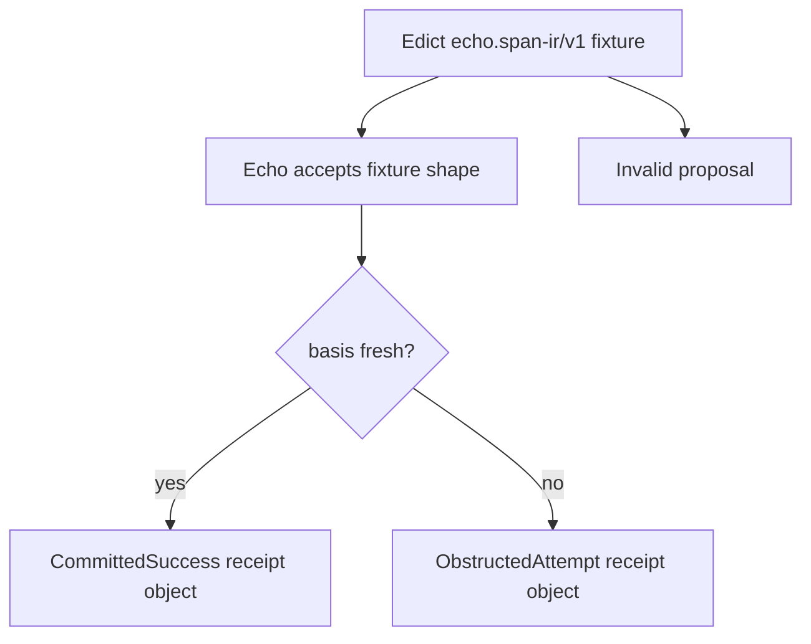

<!-- SPDX-License-Identifier: Apache-2.0 OR LicenseRef-MIND-UCAL-1.0 -->
<!-- © James Ross Ω FLYING•ROBOTS <https://github.com/flyingrobots> -->

<!-- prettier-ignore-start -->
<!-- markdownlint-disable -->
---
title: "PLATFORM-641 - Edict Target IR Obstruction Receipt Bridge"
legend: "PLATFORM"
lane: "design"
issue: "https://github.com/flyingrobots/echo/issues/641"
status: "active"
owners:
  - "@flyingrobots"
created: "2026-07-05"
updated: "2026-07-05"
---
<!-- markdownlint-enable -->
<!-- prettier-ignore-end -->

# PLATFORM-641 - Edict Target IR Obstruction Receipt Bridge

## Linked Issue

- [Issue #641](https://github.com/flyingrobots/echo/issues/641)

## Decision Summary

Echo exposes a narrow `warp-core` fixture bridge for Edict-produced
`echo.span-ir/v1` Target IR requirements. The bridge accepts a supported
pre-step `continueObstructed` requirement shape, evaluates a deterministic
`BasisFresh` fact supplied by the test harness, and returns a versioned attempt
receipt object bound to the Target IR artifact digest.

## Sponsored Human

An Edict author wants to see the first honest Echo-side receipt for a
preserved obstruction strand so that the source-to-runtime corridor can advance
without waiting for full Jim admission or scheduler counterfactual exploration.

## Sponsored Agent

An integration agent needs a stable Rust API witness that separates Target IR
artifact acceptance from execution-attempt evidence, without inferring Echo
scheduler behavior from Edict review JSON or editor projections.

## Hill

By the end of this cycle, `warp-core` can accept the supported Edict Echo
Target IR fixture shape and emit deterministic attempt receipts for fresh and
stale basis facts, proven by
`cargo test -p warp-core --test edict_target_ir_receipt_tests`.

## Current Truth

On the merge target, Echo already has generic contract obstruction posture and
product-facing intent outcome observation, but it has no Edict Target IR
fixture bridge.

- `ContractObstructionKind::StaleBasis` exists for generic contract-hosted
  obstruction posture.
  [`crates/warp-core/src/contract_obstruction.rs#28:9ef21d2dbd618cc4e52ad3552e63c42b476d49d5`](https://github.com/flyingrobots/echo/blob/9ef21d2dbd618cc4e52ad3552e63c42b476d49d5/crates/warp-core/src/contract_obstruction.rs#L28)
- `IntentOutcome` separates applied, rejected, pending, unknown, and obstructed
  observed submission outcomes.
  [`crates/warp-core/src/coordinator.rs#746:9ef21d2dbd618cc4e52ad3552e63c42b476d49d5`](https://github.com/flyingrobots/echo/blob/9ef21d2dbd618cc4e52ad3552e63c42b476d49d5/crates/warp-core/src/coordinator.rs#L746)
- `TickReceiptDisposition` still represents scheduler-owned applied or
  rejected tick candidates, not Edict Target IR attempt receipts.
  [`crates/warp-core/src/receipt.rs#103:9ef21d2dbd618cc4e52ad3552e63c42b476d49d5`](https://github.com/flyingrobots/echo/blob/9ef21d2dbd618cc4e52ad3552e63c42b476d49d5/crates/warp-core/src/receipt.rs#L103)

## Problem

Edict can now emit Echo Target IR requirements for preserved obstruction
continuations, but Echo has no executable consumer witness for that artifact
shape. Without an Echo-side bridge, the obstruction-strand corridor stops at
Target IR review artifacts and cannot prove that Echo can distinguish a valid
obstructed attempt from an invalid proposal or scheduler counterfactual.

## Scope

This cycle includes:

- a public `warp-core` fixture model for the supported Edict Echo Target IR
  subset;
- strict lowercase `sha256:<64-lower-hex>` validation for target profile and
  Target IR digest references;
- acceptance errors for wrong domain, malformed digests, missing requirements,
  extra requirements, unsupported requirement dispositions, and unsupported
  predicates;
- deterministic attempt receipts for fresh and stale basis facts;
- explicit `ObstructedAttempt`, `InvalidProposal`, and
  `LegalUnselectedCounterfactual` outcome vocabulary;
- a focused integration test proving the accepted-artifact step and execution
  receipt step remain separate.

## Non-Goals

This cycle does not include:

- general Edict bundle admission;
- participant policy evaluation;
- Jim product operation semantics;
- XYPH or Quest settlement;
- scheduler counterfactual exploration;
- canonical Echo receipt bytes or receipt digests;
- a general target plugin registry;
- parsing Edict review JSON as a stable wire contract.

## User Experience / Product Shape

Not applicable. This cycle exposes a Rust fixture bridge and tests. It does not
change a rendered UI, CLI command, or editor surface.

### User Journey



### Wide UI Mockup

Not applicable.

### Narrow UI Mockup

Not applicable.

### Accessibility Considerations

Not applicable. The API returns structured Rust values with explicit outcome
variants and stable error kinds.

## Runtime / API Contract

The public `warp-core` contract is:

- `accept_edict_echo_target_ir(...)`
- `execute_accepted_edict_echo_target_ir(...)`
- `EdictEchoTargetIrArtifact`
- `AcceptedEdictEchoTargetIr`
- `EdictEchoAttemptInput`
- `EdictEchoAttemptReceipt`
- `EdictEchoAttemptOutcomeKind`
- `EdictEchoTargetIrAcceptanceErrorKind`

Acceptance validates artifact identity and shape. Execution evaluates the
accepted pre-step requirement against deterministic input facts and returns a
receipt object. The receipt object includes:

- receipt schema marker;
- Target IR digest bytes;
- attempt outcome kind;
- input basis digest;
- observed basis digest;
- optional obstruction evidence.

The receipt shape is versioned but not canonically encoded in this cycle. No
receipt digest is produced.

## Lower Modes

The lower mode is the Rust integration test. No network, filesystem state,
wall-clock, scheduler tick, retained evidence store, or external Edict process
is required.

## Data / State Model

Source of truth:
Edict-produced Target IR fixture fields supplied to `warp-core`.

Derived state:
Accepted fixture state and deterministic attempt receipt values.

Invalid states:
Wrong domain, malformed digest, missing requirement, extra requirement, and
unsupported disposition.

Reset behavior:
No persistent state is written.

Serialization:
None in this cycle. Receipt bytes are not canonicalized.

Deterministic assumptions:
Basis freshness and basis digests are explicit inputs.

## Echo Authority Boundary

Echo owns fixture acceptance and attempt receipt production for this narrow
bridge. Edict owns source syntax, Core meaning, Target IR lowering, Target IR
bytes, and Target IR digest generation. The test harness supplies deterministic
basis facts.

Echo does not claim full admission, scheduler selection, Jim semantics, or
counterfactual retention here.

## Witness

The executable witness is:

```bash
cargo test -p warp-core --test edict_target_ir_receipt_tests
```

The witness proves:

- supported Edict Echo Target IR fixture acceptance;
- strict digest rejection;
- accepted artifact versus execution receipt separation;
- stale basis maps to `ObstructedAttempt` and generic `StaleBasis`
  obstruction posture;
- fresh basis maps to `CommittedSuccess`;
- obstructed attempts are distinct from invalid proposals and legal unselected
  counterfactuals.
