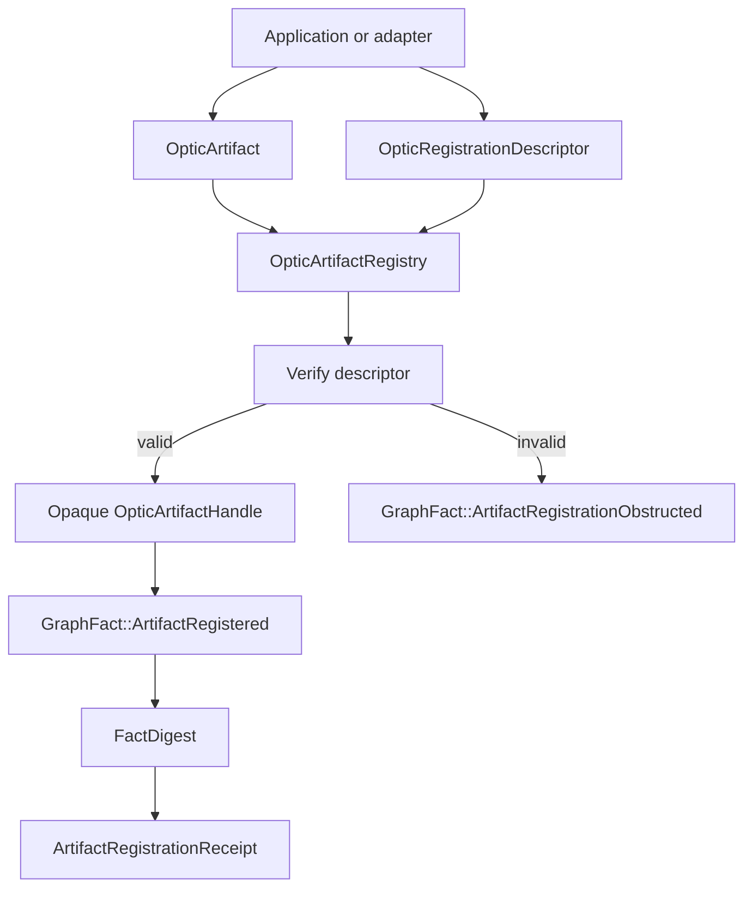
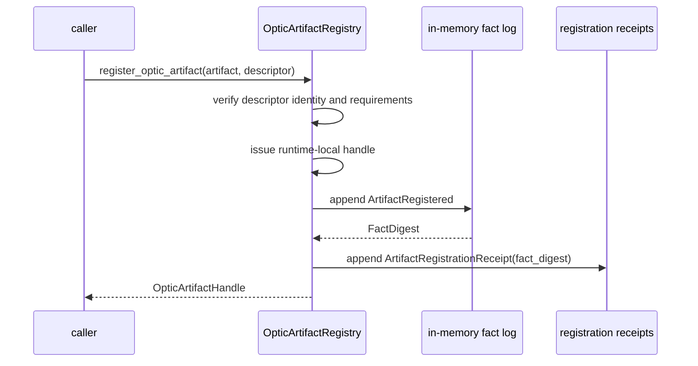
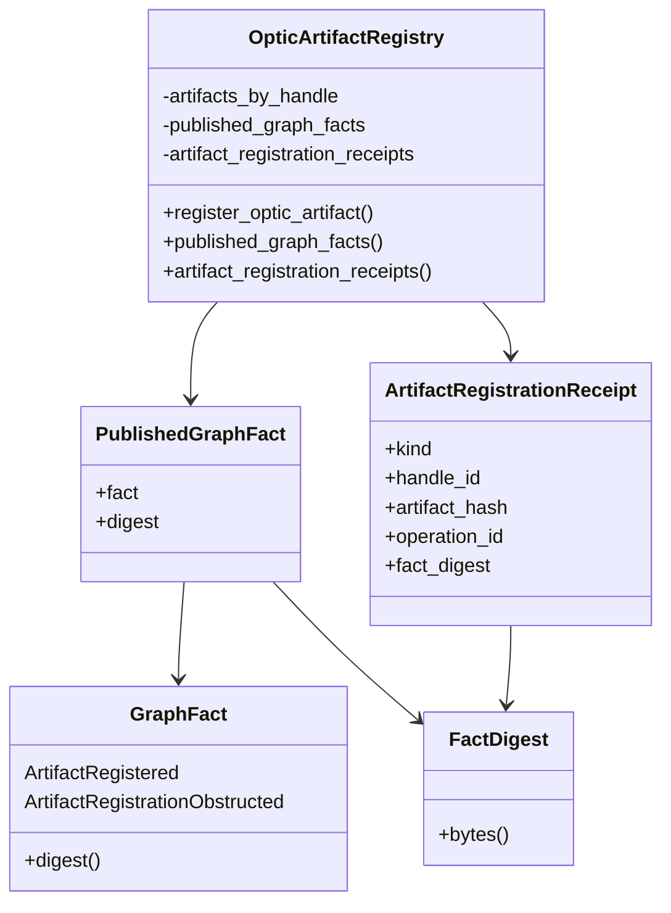
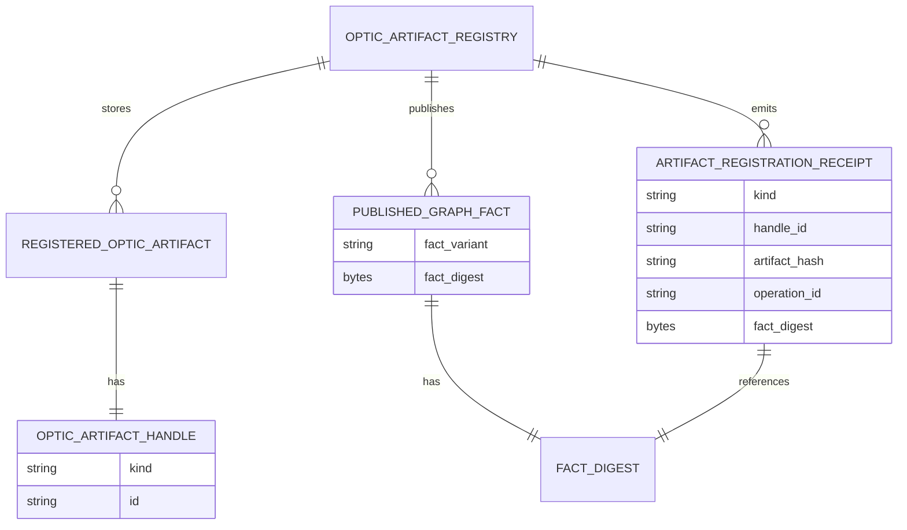

<!-- SPDX-License-Identifier: Apache-2.0 OR LicenseRef-MIND-UCAL-1.0 -->
<!-- © James Ross Ω FLYING•ROBOTS <https://github.com/flyingrobots> -->

# Graph Fact Publication Skeleton

Status: implementation slice.
Scope: first in-memory publication of Echo-owned causal graph facts from optic
artifact registration.

## Doctrine

Echo needs to explain its own runtime decisions through graph facts before
authority, admission, transactions, receipts, witnesses, and materialized
readings can become durable rather than decorative.

Receipts explain graph outcomes. They do not replace graph facts.

```text
fact = world statement
receipt = explanation or publication boundary that references fact digests
```

This slice proves only one loop:

```text
register optic artifact
  -> issue Echo-owned opaque handle
  -> publish ArtifactRegistered graph fact
  -> compute deterministic FactDigest
  -> publish registration receipt referencing FactDigest
```

Registration obstruction also publishes an obstruction fact, but it does not
produce an artifact handle or a success receipt.

## Naming boundary

This slice uses `causal_facts` for native substrate facts. It intentionally does
not use the existing `echo-graph` crate name. The existing crate is not the
native causal substrate; this slice introduces the narrower substrate fact
vocabulary that future graph, authority, and transaction work can target.

## Non-goals

- no scheduler;
- no execution;
- no witnesses;
- no graph database;
- no persistence layer;
- no transactions;
- no grants;
- no invocation success;
- no materialization;
- no Continuum schema.

## Deterministic digest law

`FactDigest` is BLAKE3 over explicitly encoded fact input bytes.

Digest input uses:

- a domain tag;
- variant tags;
- field tags;
- length-prefixed bytes;
- present/absent markers for optional fields.

Digest input must not use JSON.

Absent fields and empty fields are distinct:

```text
artifact_hash = absent
artifact_hash = present("")
```

must produce different fact digests.

## Fact model v0

```rust
GraphFact::ArtifactRegistered {
    handle_id,
    artifact_hash,
    schema_id,
    operation_id,
    requirements_digest,
}

GraphFact::ArtifactRegistrationObstructed {
    artifact_hash,
    obstruction,
}
```

`ArtifactRegistered` is the first success world statement. It says Echo
accepted one Wesley-compiled artifact descriptor and assigned a runtime-local
handle.

`ArtifactRegistrationObstructed` is a refusal world statement. It says Echo
refused a registration attempt before issuing a handle.

## Receipt linkage

The first registration receipt is deliberately small:

```rust
ArtifactRegistrationReceipt {
    kind,
    handle_id,
    artifact_hash,
    operation_id,
    fact_digest,
}
```

The receipt references the fact digest. It is not itself the fact.

## Flow



## Sequence



## Class diagram



## Entity relationship



## Operating rule

If a runtime decision cannot point to graph facts, it is not yet substrate
visible. More authority vocabulary should wait until the publication substrate
can carry the decision.
