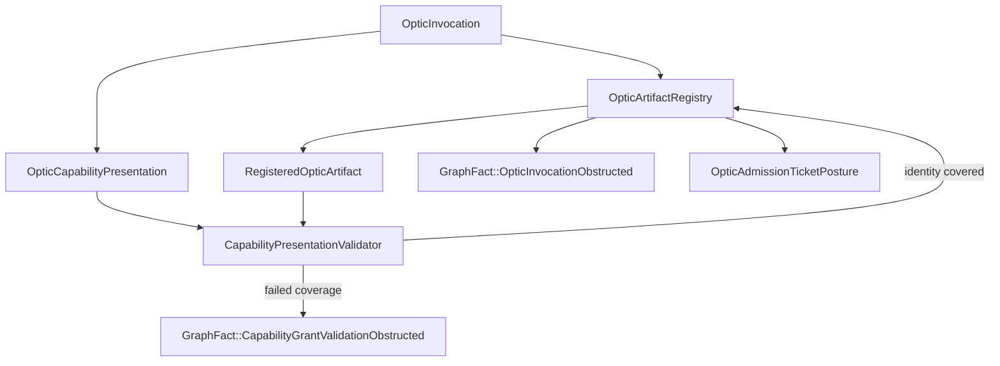
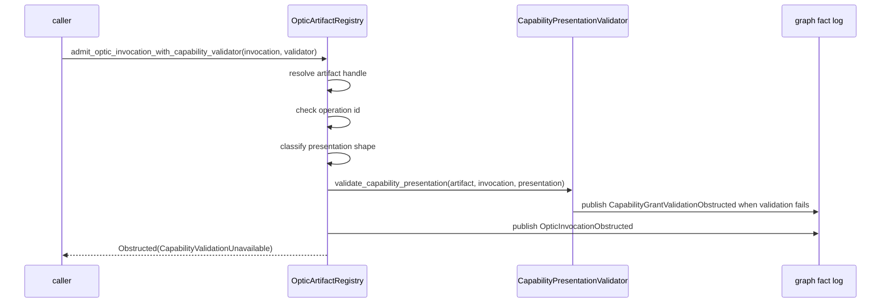
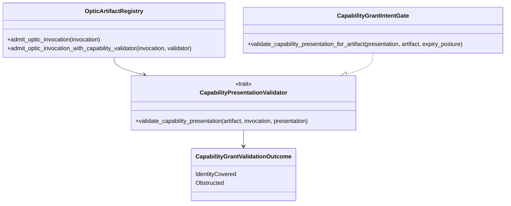

<!-- SPDX-License-Identifier: Apache-2.0 OR LicenseRef-MIND-UCAL-1.0 -->
<!-- © James Ross Ω FLYING•ROBOTS <https://github.com/flyingrobots> -->

# Invocation Grant Validation Obstruction Routing

Status: implementation slice.
Scope: validator-routed refusal evidence for optic invocation admission.

## Doctrine

Validation evidence refines refusal; it does not create authority.

An invocation may carry a bound capability presentation. Echo may ask a narrow
validator to inspect that presentation against the registered artifact identity.
The validator may publish sharper graph evidence such as
`GraphFact::CapabilityGrantValidationObstructed`, but invocation admission still
returns the conservative obstruction:

```text
OpticInvocationObstruction::CapabilityValidationUnavailable
```

Identity coverage is not admission. It only says recorded grant material names
the same artifact hash, operation id, and requirements digest as the registered
artifact. It does not issue an admission ticket, law witness, scheduler work, or
execution.

Failed presentation validation is causal refusal evidence, not a
counterfactual.

## Flow



## Sequence



## Class diagram



## Operating rule

The validator is evidence infrastructure, not an authority oracle.

`CapabilityGrantValidationOutcome::IdentityCovered` must not be treated as
accepted authority. Until Echo has accepted grant material, admission tickets,
and law witnesses, invocation admission remains obstructed even when validation
finds identity coverage.

## Non-goals

- no successful invocation admission;
- no successful `AdmissionTicket`;
- no `LawWitness`;
- no accepted grant material;
- no delegation validation;
- no expiry parsing;
- no scheduler work;
- no execution;
- no WASM ABI;
- no Continuum schema.
