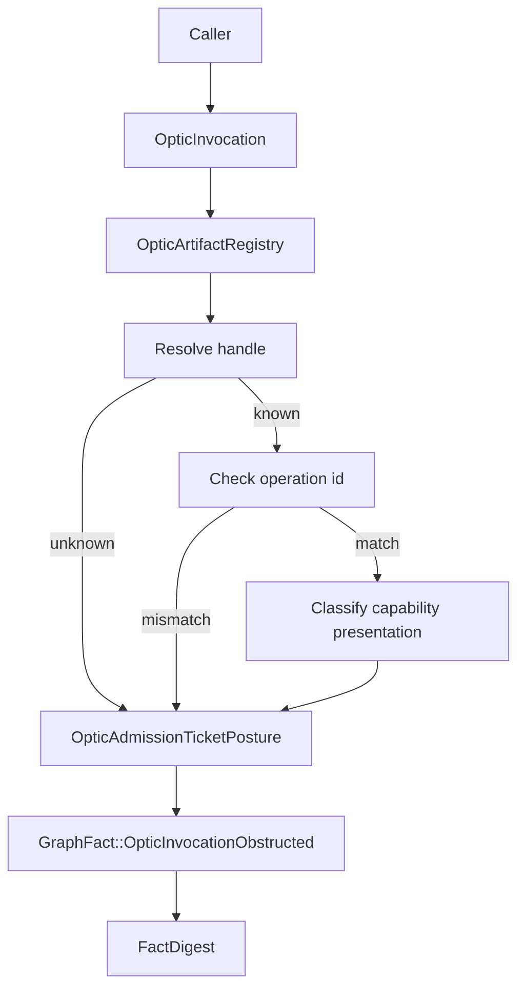
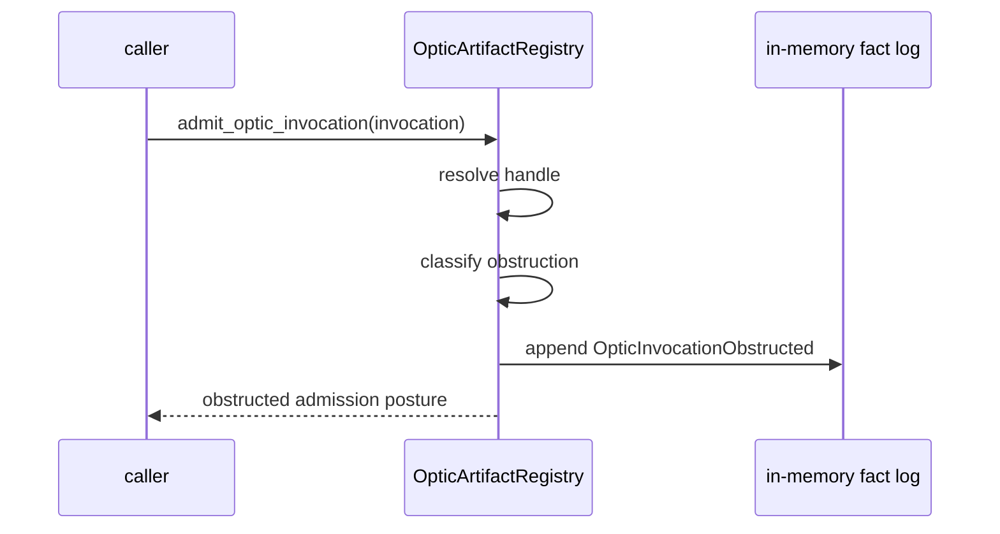
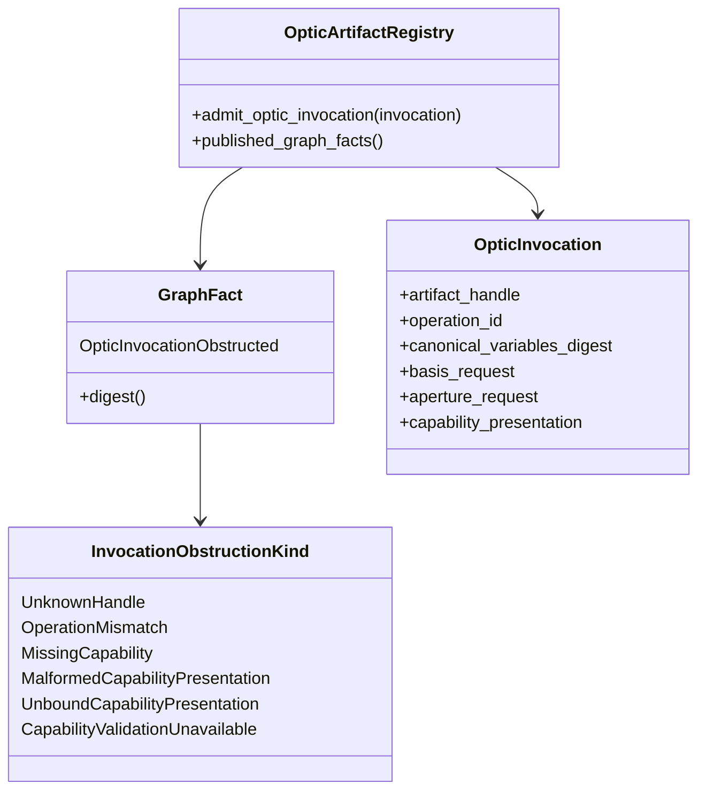
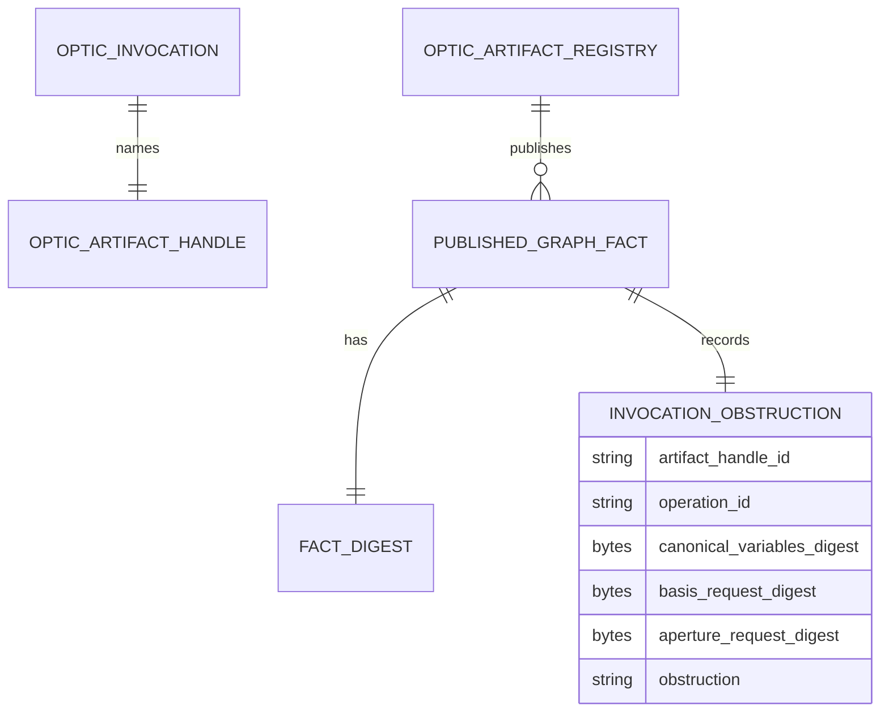

<!-- SPDX-License-Identifier: Apache-2.0 OR LicenseRef-MIND-UCAL-1.0 -->
<!-- © James Ross Ω FLYING•ROBOTS <https://github.com/flyingrobots> -->

# Invocation Obstruction Graph Facts

Status: implementation slice.
Scope: in-memory causal graph fact publication for optic invocation refusal.

## Doctrine

Registered handle does not imply authority.

Invocation obstruction is causal refusal evidence. It is not a successful
admission ticket, not a law witness, not execution, not scheduler output, and
not a counterfactual candidate.

```text
registered artifact handle
  -> invocation attempted
  -> authority/presentation unavailable or invalid
  -> obstruction posture
  -> GraphFact::OpticInvocationObstructed
```

Receipts explain graph outcomes. They do not replace graph facts.

## Fact model

`GraphFact::OpticInvocationObstructed` records:

- `artifact_handle_id`;
- `operation_id`;
- `canonical_variables_digest`;
- `basis_request_digest`;
- `aperture_request_digest`;
- `obstruction`.

The basis and aperture request fields are stored as deterministic digests of
opaque request bytes. Echo does not interpret those request bytes in this slice.

## Flow



## Sequence



## Class diagram



## Entity relationship



## Non-goals

- no success admission;
- no `AdmissionTicket`;
- no `LawWitness`;
- no grant validation inside `admit_optic_invocation`;
- no execution;
- no scheduler;
- no persistence;
- no Continuum schema.

## Operating rule

Only legally admitted but unselected rewrites can become counterfactual
candidates. Invocation obstruction facts are refusal records, not unrealized
legal worlds.
