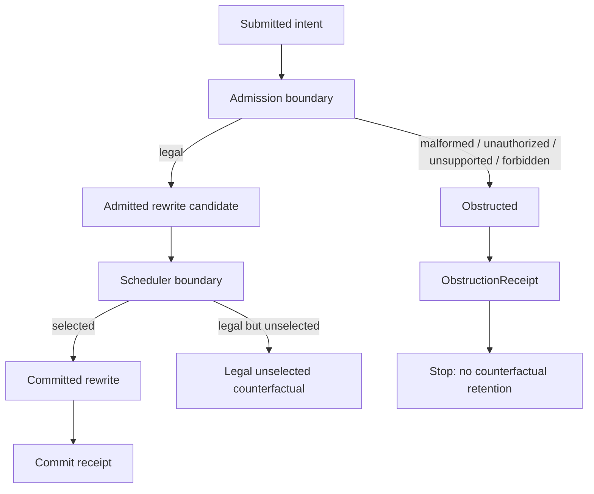
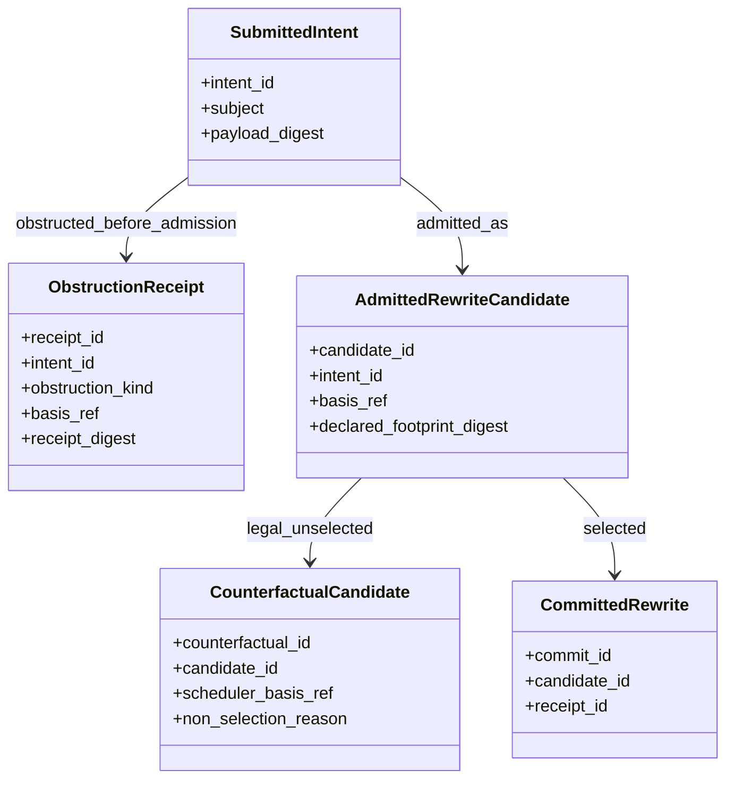
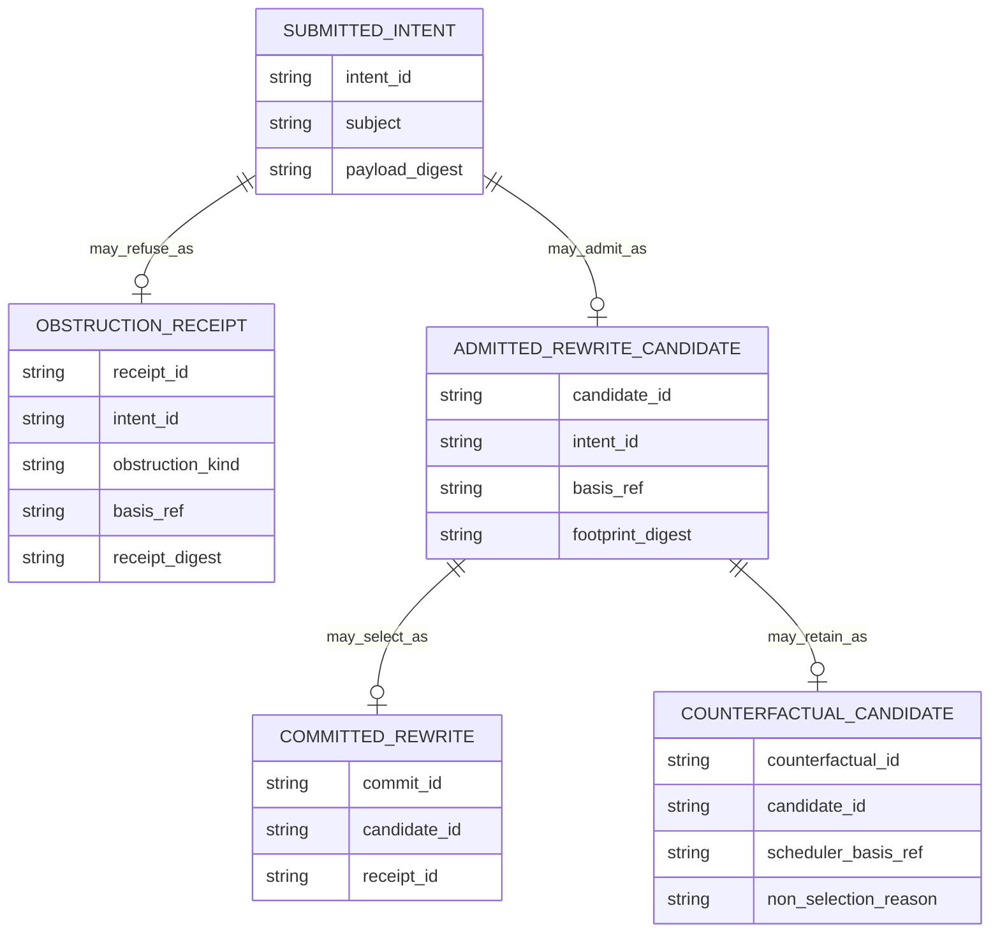

<!-- SPDX-License-Identifier: Apache-2.0 OR LicenseRef-MIND-UCAL-1.0 -->
<!-- © James Ross Ω FLYING•ROBOTS <https://github.com/flyingrobots> -->

# Obstruction Receipt Boundary

Status: doctrine and design boundary.
Scope: Echo-owned refusal records, counterfactual boundaries, and scheduler
non-selection semantics.

## Doctrine

Refusal is a causal event, but refusal is not admission.

Obstruction is not counterfactual.

Counterfactuals begin only after admission.

Only legally admissible rewrites can become counterfactuals. Unauthorized,
malformed, unsupported, or forbidden intents are refusals, not unrealized
worlds.

Echo must never retain unauthorized or malformed intents as counterfactual
candidates.

The core split is:

```text
Illegal / unauthorized / malformed intent
  -> ObstructionReceipt
  -> causal refusal record
  -> not counterfactual
  -> not a schedulable alternative
  -> not evidence of a possible legal world

Legal but unselected rewrite
  -> CounterfactualCandidate
  -> scheduler-boundary non-selection
  -> may be retained for debugging, learning, or search
  -> evidence of a legal alternative path
```

Calling an unauthorized attempt a counterfactual pollutes the causal model. It
makes illegal input look like a legitimate alternative timeline.

## Disposition model

The durable distinction is a rewrite disposition, not one large refusal enum.

```text
RewriteDisposition:
  Committed
  LegalUnselectedCounterfactual
  Obstructed
```

`LegalUnselectedCounterfactual` is downstream of admission. It is not a subtype
of obstruction.

Obstruction reasons may include:

```text
ObstructionKind:
  Malformed
  Unauthorized
  UnsupportedPolicy
  ForbiddenByLaw
  InvalidBasis
  BudgetExceeded
  MissingCapability
  InvalidCapability
  UnsupportedOperation
```

These obstruction kinds explain why an intent could not enter the legal
scheduler candidate set. They do not describe possible legal worlds.

## Boundary flow



The scheduler receives only admitted candidates. It does not inspect malformed
or unauthorized submissions as possible futures.

## Sequence

```mermaid
sequenceDiagram
  participant Caller
  participant Echo as Echo admission
  participant Store as Causal history
  participant Scheduler
  participant Counterfactuals as Counterfactual set

  Caller->>Echo: submit intent
  Echo->>Echo: check shape, authority, basis, budget, and law

  alt obstructed before admission
    Echo->>Store: publish ObstructionReceipt
    Echo-->>Caller: obstructed posture
    Note over Scheduler,Counterfactuals: Not schedulable; not counterfactual
  else admitted
    Echo->>Scheduler: admitted rewrite candidate
    alt selected
      Scheduler->>Store: publish committed receipt
      Scheduler-->>Caller: committed posture
    else legal but unselected
      Scheduler->>Counterfactuals: retain CounterfactualCandidate
      Scheduler-->>Caller: not selected posture
    end
  end
```

The refusal receipt is published at the admission boundary. Counterfactual
retention happens only after an admitted candidate reaches the scheduler
boundary and is not selected.

## Class model



`ObstructionReceipt` and `CounterfactualCandidate` never share the same
admission posture. One records refusal before admission. The other records a
legal candidate that admission already accepted.

## Entity relationship



The model permits an intent to become either an obstruction receipt or an
admitted candidate. It does not permit an obstructed intent to become a
counterfactual candidate.

## Relation to transaction optics

Transaction optics evaluate a whole decision surface as one atomic unit. If the
transaction optic obstructs, Echo may publish an obstruction receipt for that
refusal. That receipt is causal evidence that the transaction was refused.

It is not a counterfactual transaction.

Counterfactual retention applies only to transaction optic rewrites that were
legally admissible and reached the scheduler boundary as candidates.

## Relation to grant intents

Capability grant intent refusals follow the same rule.

A grant intent obstructed by malformed shape, missing issuer authority, invalid
delegation, scope escalation, replay, duplicate intent, or unsupported policy is
not a counterfactual grant. It is a refused authority-changing intent.

A future legal grant rewrite that is admitted and then not selected by a
scheduler may become a counterfactual candidate. That is different from a
refused grant intent.

## Operating rules

- Record refusals as causal obstruction receipts when the refusal matters to
  auditability, replay, or user-visible posture.
- Do not call obstruction receipts admission tickets.
- Do not call obstruction receipts LawWitnesses.
- Do not retain malformed, unauthorized, unsupported, or forbidden intents as
  counterfactual candidates.
- Retain counterfactual candidates only after admission and scheduler
  non-selection.
- Treat `LegalUnselectedCounterfactual` as a rewrite disposition, not an
  obstruction reason.

## Non-goals

This document does not add runtime code, Rust types, scheduler behavior,
LawWitness emission, WASM ABI changes, application nouns, or Continuum schema.
It defines the boundary future implementation must preserve.
