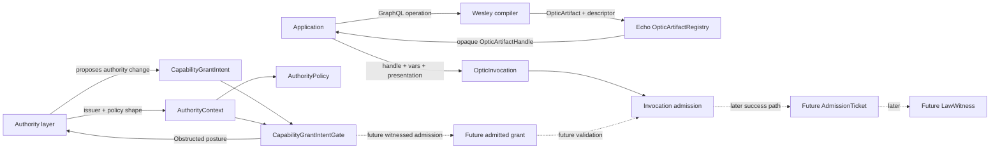
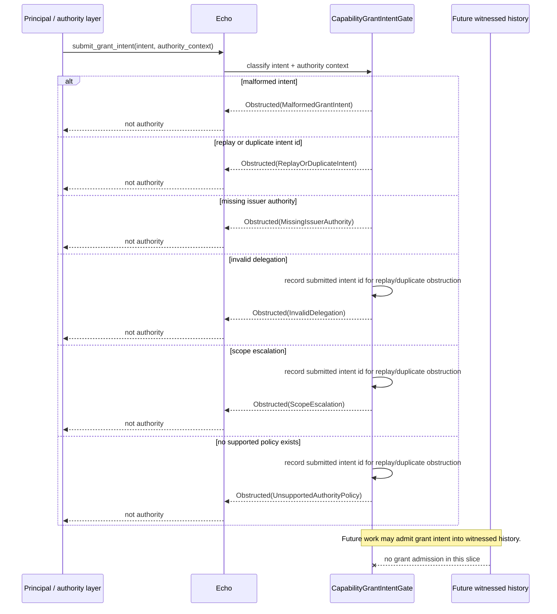
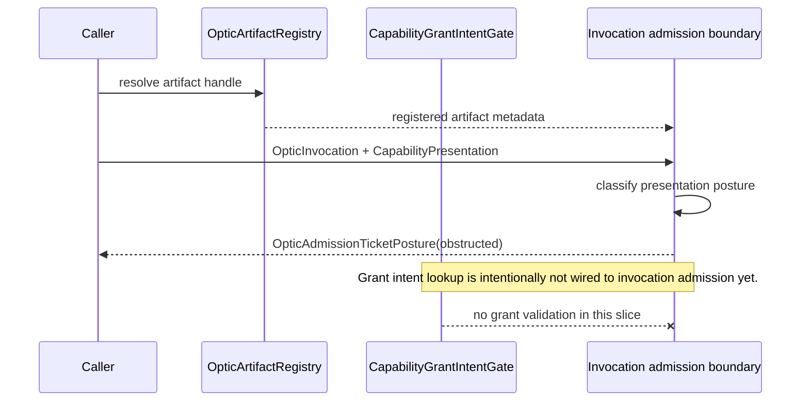
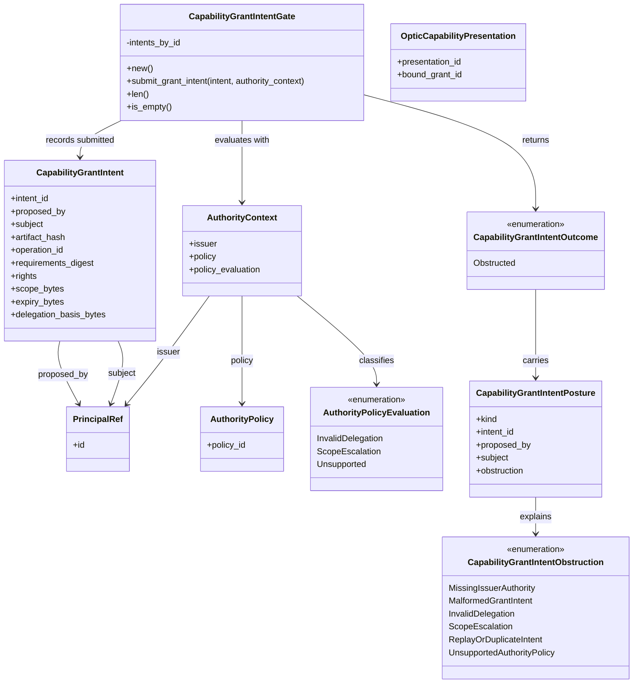
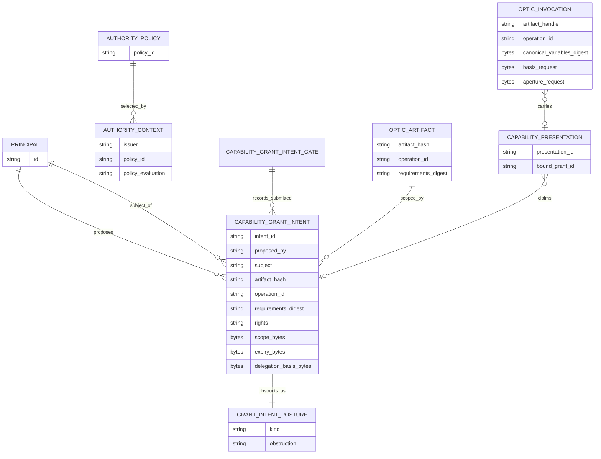

<!-- SPDX-License-Identifier: Apache-2.0 OR LicenseRef-MIND-UCAL-1.0 -->
<!-- © James Ross Ω FLYING•ROBOTS <https://github.com/flyingrobots> -->

# Optic Capability Grant Intent Boundary

Status: obstruction skeleton
Scope: Echo-owned capability grant intent intake and meta-authority shape only.

## Doctrine

Grant registration is causal authority intent. A grant is not authority until
Echo admits the grant intent into witnessed history.

No principal can mint authority from nowhere. Grant intent must be authorized by
prior authority, host root policy, quorum, or governance rule.

Policy evaluation that reads graph state is not a detached preflight query. It
is a basis-bound, aperture-bound, receipt-emitting atomic phase as described in
[`transaction-optic-atomicity-model.md`](transaction-optic-atomicity-model.md).
Grant intent refusals are causal obstruction records, not counterfactual grant
worlds, as described in
[`obstruction-receipt-boundary.md`](obstruction-receipt-boundary.md).

This slice only adds the shape and obstruction boundary. It does not implement a
real authority policy and therefore every grant intent remains obstructed.

The ladder is:

- registered handle is not authority;
- presentation slot is not validated grant;
- grant object is not admitted authority;
- grant intent is not accepted policy decision;
- policy shape is not trusted governance.

## System fit

The lawful optic path is converging through small boundaries:

1. Wesley compiles an `OpticArtifact`.
2. Echo registers the artifact and returns an `OpticArtifactHandle`.
3. An authority layer proposes bounded authority as `CapabilityGrantIntent`.
4. Echo evaluates the intent through an authority context and policy shape.
5. Echo returns `CapabilityGrantIntentPosture::Obstructed(...)` for every v0
   intent.
6. A caller may later present an invocation with an artifact handle and
   presentation.
7. Current Echo invocation admission still obstructs every presentation.
8. Future work admits grant intents into witnessed history, then validates
   invocation presentations against admitted grants.

## Grant intent sequence

The gate checks structure, replay/duplicate posture, issuer authority presence,
policy identity, delegation posture, scope posture, and policy support. Since no
real policy exists in this slice, even a well-formed intent with issuer context
obstructs.

## Invocation relationship

Capability presentation remains separate from grant intent submission. A
presentation may name a grant id, and a grant intent may have been submitted,
but neither fact authorizes invocation in this slice.

## Class model

## Entity relationship

## Current grant intent shape

The current `CapabilityGrantIntent` shape carries proposed authority material:

- intent id;
- proposing principal;
- subject principal;
- artifact hash;
- operation id;
- requirements digest;
- rights;
- opaque scope bytes;
- opaque expiry bytes;
- opaque delegation-basis bytes.

`AuthorityContext` carries the issuer, selected policy shape, and
`policy_evaluation` posture used to classify obstruction vocabulary. The
evaluation field is policy-shaped evidence only; no trusted governance policy is
implemented in this slice.

## This slice does

- defines `PrincipalRef`;
- defines `AuthorityPolicy` and `AuthorityContext`;
- defines `CapabilityGrantIntent`;
- defines `CapabilityGrantIntentPosture`;
- classifies malformed grant intents;
- classifies replay/duplicate grant intents as `ReplayOrDuplicateIntent`;
- classifies missing issuer authority;
- classifies invalid delegation;
- classifies scope escalation;
- classifies unsupported authority policy;
- records well-formed unique submitted intent ids deterministically;
- keeps all grant intent submissions obstructed.

## This slice does not

- validate invocation authority;
- admit grant intents into witnessed history;
- make any grant authority;
- issue successful `AdmissionTicket` values;
- emit `LawWitness` values;
- verify signatures;
- implement expiry semantics;
- implement delegation or revocation;
- execute runtime work;
- change scheduler, WASM, app, or Continuum surfaces.

## Boundary

Grant intent submission means Echo has seen proposed authority material. It does
not mean the grant applies to any invocation.

Capability presentation remains separate from grant intent submission. A
presentation may name a grant id, but it is not trusted until a future
validation boundary proves that an admitted grant covers the artifact,
operation, requirements digest, subject, basis, aperture, rights, budget,
expiry, delegation posture, and issuer authority for that exact invocation.
