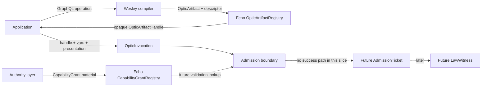
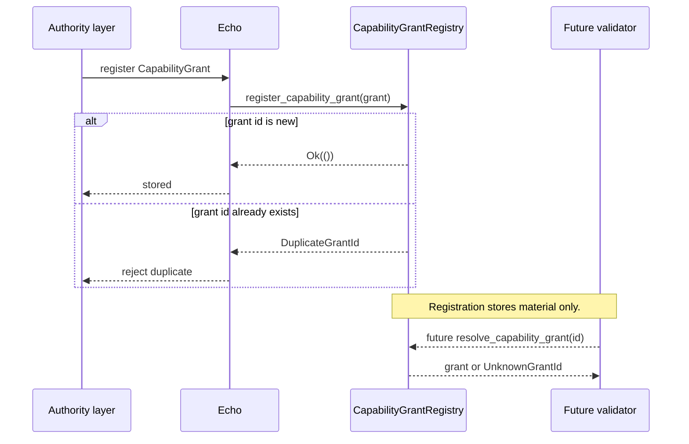
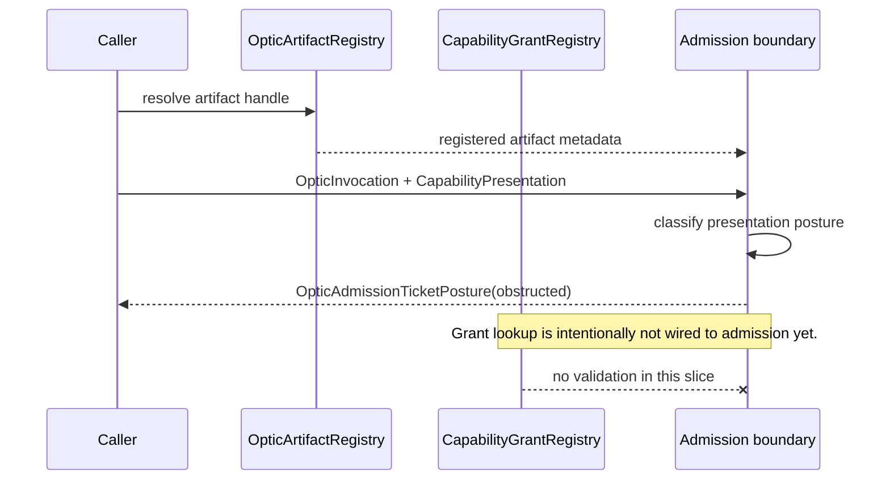
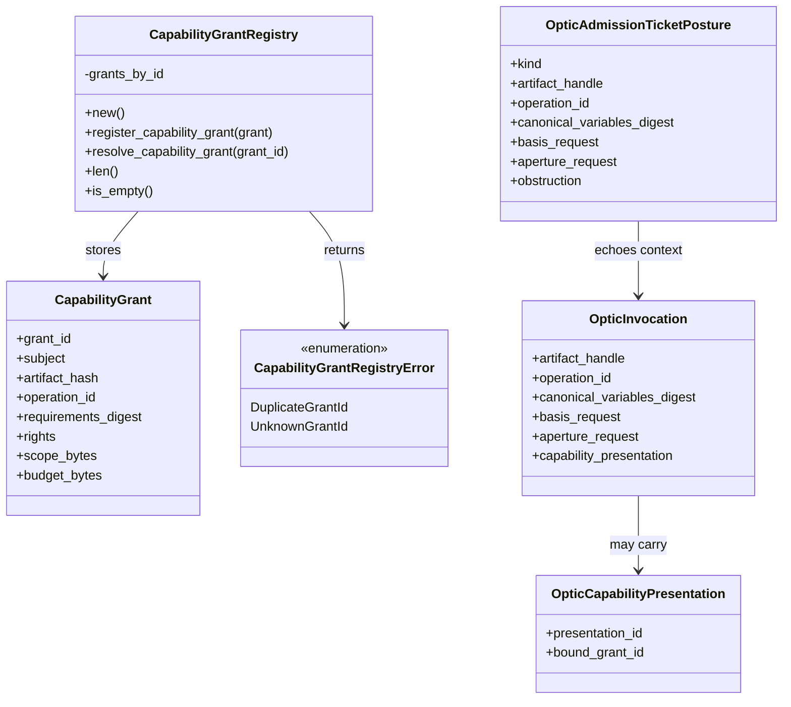
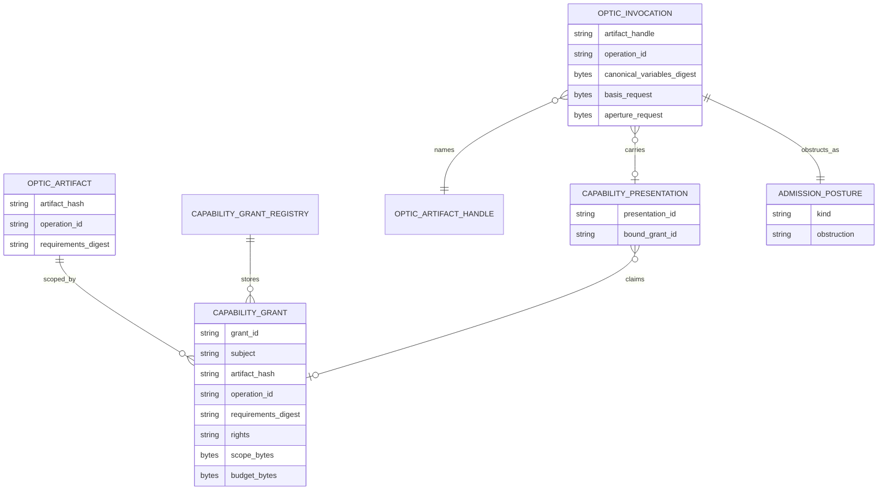

<!-- SPDX-License-Identifier: Apache-2.0 OR LicenseRef-MIND-UCAL-1.0 -->
<!-- © James Ross Ω FLYING•ROBOTS <https://github.com/flyingrobots> -->

# Optic Capability Grant Registry

Status: skeleton storage boundary  
Scope: Echo-owned capability grant registration only.

## Doctrine

A grant can exist before it is trusted. Registration stores authority material;
validation proves it applies.

The capability grant registry is the deterministic storage boundary for bounded
authority material. It is not admission, proof, execution, witness generation,
or permission by itself.

Two rules matter in this slice:

- registered artifact handle is not authority;
- registered capability grant is not validated authority.

The grant registry creates the place where future validation can look for
authority material. It does not decide whether that material covers an
invocation.

## System fit

The lawful optic path is converging through small boundaries:

1. Wesley compiles an `OpticArtifact`.
2. Echo registers the artifact and returns an `OpticArtifactHandle`.
3. An authority layer issues bounded grant material.
4. Echo stores that grant material in `CapabilityGrantRegistry`.
5. A caller presents an invocation with an artifact handle and presentation.
6. Current Echo admission still obstructs every presentation.
7. A later validation slice proves whether a grant covers the invocation.
8. Only after validation can Echo issue a successful admission ticket.

## Registration sequence

Grant registration is deliberately boring. It stores bounded material by grant
id and rejects duplicate ids.

## Invocation relationship

The current invocation boundary only classifies presentation posture. A
registered grant does not change that behavior yet.

## Class model

## Entity relationship

## Current grant shape

The current `CapabilityGrant` shape carries bounded material:

- grant id;
- subject;
- artifact hash;
- operation id;
- requirements digest;
- rights;
- opaque scope bytes;
- opaque budget bytes.

These fields are stored for a future validation slice. This slice intentionally
does not decide whether any registered grant authorizes any optic invocation.

## This slice does

- stores `CapabilityGrant` values by grant id;
- resolves a registered grant by grant id;
- rejects duplicate grant ids;
- rejects unknown grant lookups;
- uses deterministic `BTreeMap` storage.

## This slice does not

- validate invocation authority;
- issue successful `AdmissionTicket` values;
- emit `LawWitness` values;
- verify signatures;
- implement expiry semantics;
- implement delegation or revocation;
- execute runtime work;
- change scheduler, WASM, app, or Continuum surfaces.

## Boundary

Grant registration means Echo has authority material available for later
validation. It does not mean the grant applies to any invocation.

Capability presentation remains separate from grant registration. A
presentation may name a grant id, but it is not trusted until a future
validation boundary proves that the registered grant covers the artifact,
operation, requirements digest, subject, basis, aperture, rights, budget, and
time posture for that exact invocation.
