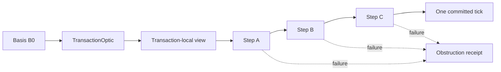
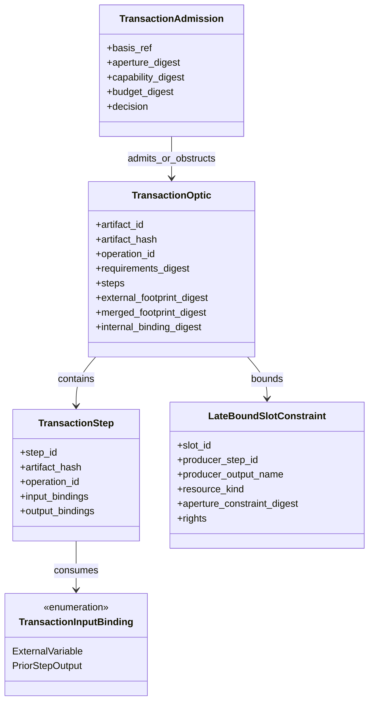
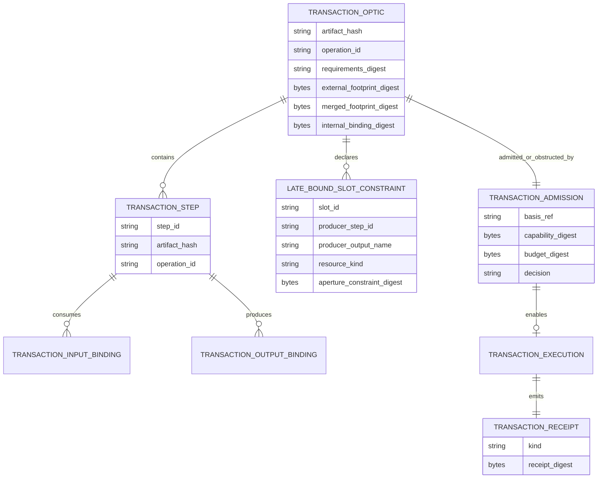

<!-- SPDX-License-Identifier: Apache-2.0 OR LicenseRef-MIND-UCAL-1.0 -->
<!-- © James Ross Ω FLYING•ROBOTS <https://github.com/flyingrobots> -->

# Transaction Optic Atomicity Model

Status: doctrine and design boundary.
Scope: Echo-owned atomicity model for composite optic admission and execution.

## Doctrine

Atomicity belongs to the optic boundary, not the scheduler.

Echo must never compose atomicity from already-admitted suboperations.

If an operation changes trust, authority, durable history, visibility, execution,
or admissibility, it is causal. If an operation reads graph state to make one of
those decisions, the read, decision, and publication must share one basis and one
atomic boundary.

The forbidden anti-pattern is:

```text
lookup -> decide -> later mutate
```

The required pattern is:

```text
intent -> atomic evaluation over basis -> posture/receipt
```

Refusal, admission, and execution are causal events. Payloads are not.
Refusal receipts are not counterfactuals; only legally admitted rewrites that
reach the scheduler boundary and are not selected may enter the counterfactual
set. See
[`obstruction-receipt-boundary.md`](obstruction-receipt-boundary.md).

## Transaction optic

A `TransactionOptic` is a higher-order optic compiled from suboptics or
sub-intents. It is not a bundle of separately admitted transactions.

Correct shape:

```text
AtomicIntent
  -> TransactionOptic
  -> one merged decision surface
  -> one basis
  -> one admission decision
  -> one transaction-local execution boundary
  -> one committed delta
  -> one receipt or witness bundle
```

Incorrect shape:

```text
admit A
admit B
admit C
then execute A+B+C
```

That splits authority and execution across possible causal drift.

## Sequential dependencies

Sequential dependencies are runtime dataflow. Authority remains compile-time or
admission-time.

Legal:

```text
A reads workspace.index
A outputs file_id
B writes file_id
```

Only if the `TransactionOptic` declares the bounded authority envelope before
execution:

```text
external read: workspace.index
late-bound write: workspace.files[file_id]
constraint: file_id comes from A.output and is within authorized workspace
```

Illegal:

```text
A outputs arbitrary path
B writes arbitrary path
```

unless the grant covers that entire possible space. Dynamic values are allowed.
Dynamic authority is not.

## Footprint classes

A transaction optic needs more than a naive union of suboptic footprints.

```text
external_footprint
  Reads and writes that must be valid against the starting basis.

merged_footprint
  Full declared authority and effect surface of the transaction.

internal_bindings
  Reads satisfied by prior transaction-local writes or outputs.

late_bound_slots
  Runtime values constrained by declared producer outputs and aperture rules.
```

Example:

```text
A writes Y
B reads Y
```

`Y` is an internal binding, not necessarily an external read requirement against
the starting basis.

## Authority admission is atomic

Policy evaluation that reads graph state is itself an atomic causal intent or an
internal phase of a larger atomic transaction.

It must not be:

```text
read policy graph
decide grant posture
later record decision
```

Correct shape:

```text
AuthorityPolicyEvaluationIntent
  -> basis-bound policy read
  -> aperture-bound delegation/scope/replay evaluation
  -> obstruction or admission posture
  -> receipt
```

If it participates in authority, it must be:

- basis-bound;
- aperture-bound;
- witnessable;
- atomic;
- receipt-emitting.

The public API does not need to expose every phase. Internally, Echo may model:

```text
GrantIntent
  -> AuthorityPolicyEvaluationIntent
  -> GrantAdmissionIntent
  -> InvocationIntent
  -> ExecutionIntent
```

as phases of one larger transaction.

## Echo tick posture

If an Echo tick is the durable causal mutation boundary, a transaction optic
commits as one tick or not at all.

Internal substeps may be recorded as trace material:

```text
state0
  -> step A produces local state1
  -> step B sees local state1
  -> step C sees local state2
  -> commit final delta as one tick
```

But substep trace is not a committed tick.



## Admission boundary

Transaction admission checks the whole decision surface before execution:

1. Transaction artifact handle resolves.
2. Artifact hash and requirements digest match Echo's registry state.
3. Referenced subartifact identities are known if the transaction references
   registered suboptics.
4. Requested operation matches the transaction operation.
5. Basis is valid for the whole transaction.
6. Aperture request is covered.
7. Capability presentation covers the composite requirements digest.
8. Budget covers the whole transaction.
9. External footprint is authorized.
10. Late-bound slots are bounded by declared constraints.
11. Forbidden overlaps cannot escape the composite footprint.
12. Substeps cannot access outside declared transaction requirements.

No substep may ask for new authority after transaction admission begins.

## Execution boundary

Execution runs against a transaction-local view:

```text
begin transaction at basis B0
resolve external variables
run substeps in topological order
bind step outputs to later step inputs
stage local delta
commit final delta atomically
emit one receipt or obstruction
```

If any step fails:

```text
commit nothing
emit obstruction receipt
```

No partial success.

## Class model



## Entity relationship



## Boundary rules

- A `TransactionOptic` may bind dynamic values.
- A `TransactionOptic` may not discover dynamic authority.
- A transaction substep trace is not a committed tick.
- A policy read used for authority is not a preview read.
- Authority policy evaluation is basis-bound, aperture-bound, and
  receipt-emitting.
- Obstruction receipts are not admission receipts.
- Admission receipts are not law witnesses.
- Law witnesses are not authority by themselves.

## Non-goals

This document does not implement:

- transaction artifacts;
- substep execution;
- authority policy validation;
- admission tickets;
- law witnesses;
- scheduler changes;
- WASM ABI changes;
- application nouns;
- Continuum schemas.

The purpose is to block protocol drift before code starts treating atomicity as a
scheduler convenience or treating graph reads and authority decisions as
separable events.
