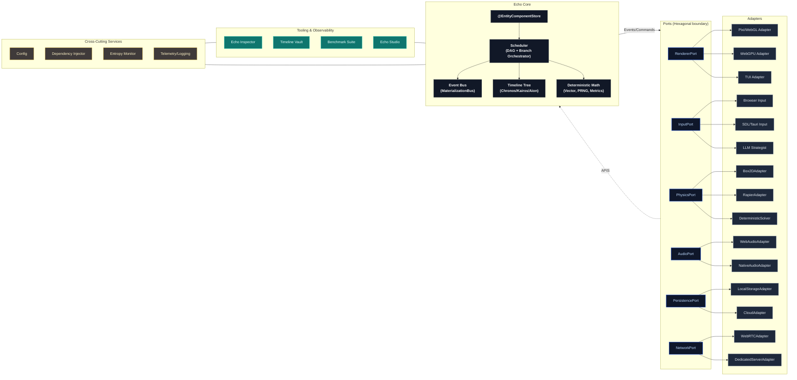
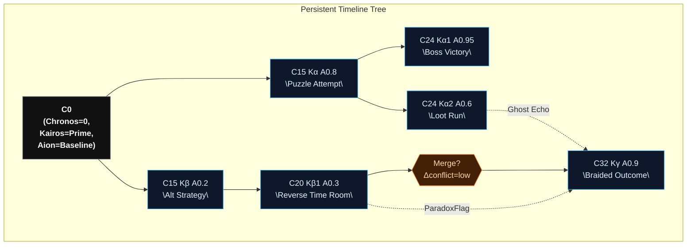
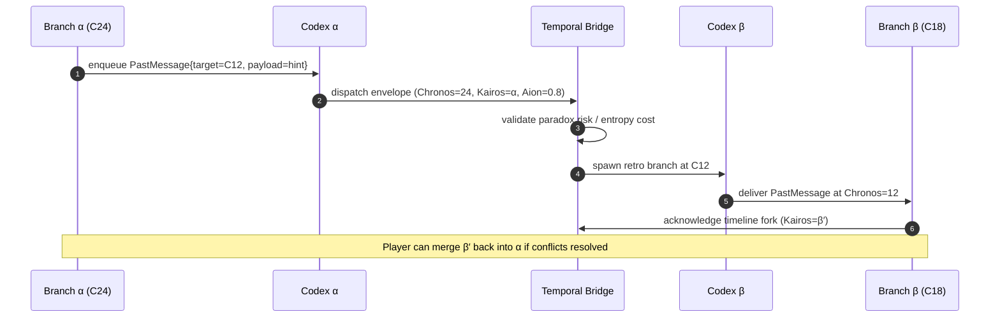

<!-- SPDX-License-Identifier: Apache-2.0 OR MIND-UCAL-1.0 -->
<!-- © James Ross Ω FLYING•ROBOTS <https://github.com/flyingrobots> -->
# Echo Diagram Vault

This folder sketches Echo’s moving parts using Mermaid. Each diagram matches the architecture spec and will eventually power an animated viewer (GSAP + SVG) once we export the Mermaid graphs.

> **Tip:** In VS Code or GitHub you can render these diagrams directly. For custom themes, we’ll feed the Mermaid JSON definitions into the web viewer later.

---

## 1. System Constellation

---

## 2. Chronos Loop (Single Frame, Single Branch)

```mermaid
flowchart TD
  classDef stage fill:#1e293b,stroke:#e0f2fe,color:#bae6fd,font-weight:600;
  classDef phase fill:#0f172a,stroke:#f97316,color:#fb923c,font-weight:500;
  classDef op fill:#312e81,stroke:#a78bfa,color:#ede9fe;
  classDef sub fill:#111827,stroke:#6366f1,color:#c7d2fe,font-style:italic;

  Start((Start Tick)):::stage --> Clock["Clock\nAccumulate dt"]:::phase
  Clock -->|dt| SchedulerPre["Phase 1: Pre-Update"]:::stage

  SchedulerPre --> InputAssim["Assimilate Input\n(InputPort flush)"]:::op
  InputAssim --> CodexPre["Event Bus\nPre-Flush"]:::op
  CodexPre --> TimelineIntake["Timeline Tree\nRegister Branch Jobs"]:::op

  TimelineIntake --> UpdatePhase["Phase 2: Update Systems"]:::stage
  UpdatePhase --> DAG["Resolve DAG\n(Dependencies)"]:::op
  DAG --> ParallelBatch["Plan Parallel Batches"]:::op
  ParallelBatch --> SystemsLoop{"For each batch"}:::phase
  SystemsLoop -->|system| SystemExec["Run System\n(Query + Mutate ECS)\nUpdate Codex"]:::op
  SystemExec --> SystemsLoop

  SystemsLoop --> PostUpdate["Phase 3: Post-Update"]:::stage
  PostUpdate --> Hooks["Late Hooks\n(Animation, Cleanups)"]:::op
  Hooks --> PhysicsSync["Physics Sync"]:::op
  PhysicsSync --> MathResolve["Math Snap (fround/fixed-point)"]:::op

  MathResolve --> RenderPrep["Phase 4: Render Prep"]:::stage
  RenderPrep --> FramePacket["Assemble FramePacket\n(Query renderer views)"]:::op
  FramePacket --> DiagnosticsStage["Dev Diagnostics"]:::op

  DiagnosticsStage --> Present["Phase 5: Present"]:::stage
  Present --> RendererCall["RendererPort.submit(frame)"]:::op

  RendererCall --> TimelineFlush["Phase 6: Timeline Flush"]:::stage
  TimelineFlush --> DiffPersist["Persist Diffs\n(COW chunks, diff cache)"]:::op
  DiffPersist --> EntropyUpdate["Update Entropy/Aion Metrics"]:::op
  EntropyUpdate --> BranchBook["Update Branch Index"]:::op

  BranchBook --> End((End Tick)):::stage
```

---

## 3. Multiverse Mesh (Branch Tree)

---

## 4. Message Bridge Across Branches

---

## Animation Ideas

- **GSAP Morphs**: Export Mermaid SVG and tween branch nodes as timelines split/merge.
- **Entropy Pulse**: Animate stroke width/color based on the Entropy meter.
- **Interactive Sequencer**: Play back the sequence diagram with tooltips showing Codex queue sizes.

Once the architecture crystallizes, we’ll wire these into a future documentation viewer/playground that live-updates from this Markdown.
