# Echo Total Documentation Rollup

> This file is generated by scripts/gen-echo-total.sh. Edit source docs under docs/, not this rollup.

---


# File: docs-index.md

# Echo Documentation Index

| Document | Purpose |
| -------- | ------- |
| `architecture-outline.md` | High-level architecture vision and principles |
| `execution-plan.md` | Living plan of tasks, intent, and progress |
| `spec-branch-tree.md` | Branch tree, diffs, and timeline persistence |
| `spec-codex-baby.md` | Event bus, bridges, backpressure, security |
| `spec-temporal-bridge.md` | Cross-branch event lifecycle |
| `spec-serialization-protocol.md` | Canonical encoding and hashing |
| `spec-capabilities-and-security.md` | Capability tokens and signatures |
| `spec-world-api.md` | Stable public façade for external modules |
| `spec-entropy-and-paradox.md` | Entropy metrics and paradox handling |
| `spec-editor-and-inspector.md` | Inspector frame protocol & tooling transport |
| `spec-runtime-config.md` | Deterministic configuration schema and hashing |
| `spec-plugin-system.md` | Plugin discovery, namespace isolation, capabilities |
| `spec-concurrency-and-authoring.md` | Parallel core & single-threaded scripting model |
| `spec-networking.md` | Deterministic event replication modes |
| `phase1-plan.md` | Phase 1 implementation roadmap & demo targets |
| `spec-rmg-core.md` | Recursive Meta Graph core format and runtime |
| `spec-rmg-confluence.md` | Global graph synchronization (Confluence) |
| `spec-ecs-storage.md` | ECS storage (archetypes, chunks, COW) |
| `math-validation-plan.md` | Deterministic math coverage |
| `scheduler-benchmarks.md` | Scheduler performance scenarios |
| `testing-and-replay-plan.md` | Replay, golden hashes, entropy tests |
| `runtime-diagnostics-plan.md` | Logging, tracing, inspector streams |
| `codex-instrumentation.md` | CB metrics and telemetry hooks |
| `docs-index.md` | This index |
| `hash-graph.md` | Hash relationships across subsystems |
| `legacy-excavation.md` | Historical artifact log |
| `memorial.md` | Tribute to Caverns |
| `decision-log.md` | Chronological design decisions |
| `release-criteria.md` | Phase transition checklist |

## Getting Started
1. Read `architecture-outline.md`.
2. Review `spec-branch-tree.md` + `spec-codex-baby.md` + `spec-temporal-bridge.md`.
3. Consult `execution-plan.md` for current focus.

## Phase Tags
- Phase 0.0 — initial skeleton
- Phase 0.5 — causality & determinism layer (current)
- Phase 1.0 — implementation kickoff


---


# File: architecture-outline.md

# Echo Architecture Specification (Draft)

## Vision
- Reimagine the 2013 Caverns ECS into **Echo**, a renderer-agnostic core that survives browsers, native shells, and whatever 2125 invents next.
- Empower teams to build 2D, 3D, or abstract simulations with the same spine, swapping adapters instead of rewriting gameplay.
- Combine modern ergonomics (TypeScript, ES modules, first-class docs) with ruthless performance discipline so the engine scales from hobby jams to production.
- Preserve institutional memory—document why choices exist, what legacy quirks inspired them, and how to extend or override any piece.

## Cultural Principles
- **Just Ship, But Test**: Echo inherits the original “Just do it” ethos while insisting on automated tests and benchmark gates.
- **Automate the Boring Stuff**: Workflow automation stays core—one-command setup, reproducible builds, scripted lint/format/test pipelines.
- **Stay Focused**: Every feature must trace back to recorded goals; backlog distractions instead of half-building them.
- **Have Fun**: Echo should be a playground; tooling, docs, and samples are crafted to keep the work joyful.
- **Respect the Spine**: Keep `main` stable—feature flags, review gates, and CI guardrails preserve trust.

## Guiding Principles
- **Hexagonal Domain Boundary**: The domain never touches DOM, WebGL, or timers directly; everything outside the core arrives through narrow ports.
- **Data-Oriented Internals**: Gameplay-friendly APIs sit atop archetype/struct-of-arrays storage, pooled allocators, and cache-aware iteration.
- **Predictable Loop**: Fixed time-step simulation by default with deterministic ordering; variable step, interpolation, and rollback sit behind explicit opt-ins.
- **Tooling Is Non-Negotiable**: Debug inspector, event traces, hot-reload, and profiling hooks ship alongside the engine, not as an afterthought.
- **Extensible By Design**: Every subsystem exposes extension points, configuration, and hooks for optional native/Wasm accelerators.
- **Operational Transparency**: Metrics, logging, and failure modes are documented; Echo should be debuggable at 3 AM without spelunking source.

## Domain Layers

### Core ECS
- **Entities**: Numerical IDs with sparse/high-watermark managers; creation returns pooled slots to avoid GC pressure.
- **Components**: Type-safe registrations with metadata (layout, default state, pooling policy). Storage uses archetype tables or chunked struct-of-arrays chosen at registration time.
- **Storage Model**:
  - Archetype chunks sized to fit CPU cache lines (default 16 KB) with columnar component arrays.
  - Copy-on-write handles for branch persistence; mutate operations clone only touched chunks.
  - Optional fixed-point pools for deterministic math-heavy components (physics transforms, timers).
- **ID Services**: Global registries issue deterministic type IDs; component schemas embed serialization hooks and diff strategies.
- **Systems**: Pure domain functions declaring the signature of components/events they consume. Systems declare schedule phase, dependencies, and whether they run when paused.
- **Scheduler**: Builds a directed acyclic graph of systems, resolves priorities, batches compatible systems for parallel execution (future feature), and mediates fixed-step ticks.
- **Scheduler Phases**:
  1. `initialize` (one-shot setup)
  2. `pre_update` (input assimilation, Codex’s Baby pre-flush)
  3. `update` (core systems in DAG order)
  4. `post_update` (cleanup, late bindings)
  5. `render_prep` (prepare frame packets for adapters)
  6. `present` (adapter flush; optional interpolation)
  7. `timeline_flush` (persist diffs, branch bookkeeping)
- **Parallelism Hooks**: Systems may declare `parallelizable: true`; scheduler groups disjoint signature systems into jobs respecting dependencies.
- **Queries**: Precompiled views over component sets; incremental membership tracking uses bitset signatures and dirty queues instead of per-frame scans.

### World & Scene Management
- **World**: Owns entity/component managers, system registry, event bus, and service container. Supports multiple worlds for split-screen or background sims.
- **Prefabs & Assemblers**: Declarative definitions (JSON/YAML/TS factories) converted into entity creation commands, supporting overrides and inheritance.
- **Scene Graph / State Machine**: Stack-based and hierarchical scenes with enter/exit hooks, async loading, and transition orchestration. Integrates with scheduler via scene phases.
- **Simulation Contexts**: Support for deterministic replay, remote authority, and sub-step simulations (physics, AI planning) within world boundaries.

### Time & Simulation
- **Clock Service**: Abstracted time source with fixed-step accumulator, variable-step mode, and manual stepping for tests.
- **Pause & Slow-Mo**: Pause flag propagates to scheduler; systems opt into running while paused; time scaling applies per system when needed.
- **Deterministic Replay**: Input/event capture via Codex’s Baby, serialized frame seeds, and re-execution hooks for debugging or multiplayer rollback.
- **Job Graph Extensions**: Future-ready hooks for job scheduling or thread pools without breaking the single-threaded baseline.
- **Temporal Axes**:
  - **Chronos (Sequence)**: Monotonic tick counter; governs simulation ordering and replay.
  - **Kairos (Possibility)**: Branch identifier; indexes alternate realities at the same Chronos tick.
  - **Aion (Significance)**: Scalar weight describing narrative gravity/entropy; influences merge priority, NPC memory retention, and paradox severity.

### Temporal Sandbox (Echo Edge)
- **Branchable Timelines**: Worlds can fork into speculative branches mid-frame; scheduler runs branches sequentially or in parallel workers, then reports diffs back to the main timeline.
- **Frame Scrubbing**: Built-in timeline buffer stores component deltas for the last N frames; editor tooling scrubs, rewinds, and reapplies changes without restarting the sim.
- **Predictive Queries**: Renderers, netcode, or AI can request projected state N frames ahead using speculative branches, enabling latency hiding and cinematic planning.
- **Collaborative Simulation**: Multiple clients can author in shared scenes by editing branches; consensus commits merge deterministic deltas back into the root world.
- **AI Co-Pilot Hooks**: Deterministic branches allow automated agents to propose tweaks, run them in sandboxes, and surface accepted diffs to designers.

## Codex’s Baby (Event Bus)
- **Command Buffers**: Events are POD structs appended to per-type ring buffers during a frame; no immediate callbacks inside hot systems.
- **Flush Phases**: Scheduler defines flush points (pre-update, post-update, custom phases). Systems subscribe to phases matching their needs.
- **Handler Contracts**: Handlers receive batched slices; they may mutate components, enqueue new events, or schedule commands. Return values are ignored for deterministic execution.
- **Immediate Channel**: Opt-in channel for rare “now” operations; instrumented with counters and frame-budget warnings.
- **Telemetry & Debugging**: Built-in tooling to inspect event queues, handler timings, dropped events, and memory usage.
- **Integration**: Bridges input devices, networking, scripting, and editor tooling without leaking adapter concerns into the domain.
- **Inter-Branch Bridge**: Temporal mail service routes events between branches; deliveries create retro branches when targeting past Chronos ticks; paradox guard evaluates conflicts before enqueue.

## Ports & Adapters

### Renderer Port
- **Responsibilities**: Receive frame data (render commands, camera states, debug overlays), manage render resources, and report capabilities.
- **Data Flow**: Domain produces a `FramePacket` containing archetype-friendly draw data (mesh refs, transforms, materials); adapter translates into API-specific calls.
- **Adapters**: Pixi 7/WebGL2 baseline, Canvas2D fallback, WebGPU (wgpu/WASM), native renderer (Skia or bgfx), experimental TUI renderer for debugging.
- **Performance Contracts**: Frame submissions are immutable; adapters can reuse GPU buffers across frames; the port discourages per-entity draw calls.

### Input Port
- **Responsibilities**: Aggregate device state into consumable snapshots (buttons, axes, gestures) and surface device capabilities.
- **Polling Model**: Domain polls once per frame; port ensures event strata are coalesced in consistent order. Scripted or network input injects via Codex’s Baby.
- **Adapters**: Browser (keyboard, mouse, pointer, gamepad), native (SDL), synthetic (playback), test harness stubs.

### Physics Port
- **Responsibilities**: Advance simulation, manage bodies/colliders, and synchronize results back into components.
- **Integration Strategy**: Dual writes through data bridges. ECS components represent desired state; physics port returns authoritative transforms/velocities at sync points.
- **Adapters**: Box2D (planar), Rapier (3D/2D), custom deterministic solver, or headless stub for puzzle games.
- **Advanced Features**: Continuous collision, queries (raycasts, sweeps), event hooks for contacts funneled through Codex’s Baby.

### Networking Port
- **Mode Support**: Single-player (loopback), lockstep peer-to-peer, host-client, dedicated server.
- **Transport Abstraction**: Reliable/unreliable channels, clock sync, session management. Adapter options: WebRTC, WebSockets, native sockets.
- **Replication Strategy**: Deterministic event replication using Codex’s Baby ledger; optional state snapshots for fast-forward joins.
- **Rollback Hooks**: Scheduler exposes rewinding API; networking port coordinates branch rewinds and replays when desync detected.
- **Security Considerations**: Capability tokens, branch validation, deterministic checksum comparison to detect tampering.

### Audio, Persistence, Telemetry Ports
- **Audio**: Command queue for spatial/ambient playback, timeline control, and crossfade scheduling.
- **Persistence**: Abstract reader/writer for save games, cloud sync, diagnostics dumps. Supports structured snapshots and delta patches.
- **Telemetry**: Export frame metrics, event traces, and custom probes to external dashboards or editor overlays.

## Cross-Cutting Concerns
- **Bootstrap Pipeline**: Dependency injection container wires ports, services, systems, and configuration before the first tick. Supports editor-time hot reload.
- **Resource Lifecycle**: Asset handles (textures, meshes, scripts) managed through reference-counted registries and async loaders; domain requests are idempotent.
- **Serialization**: Schema-driven serialization for components and events. Allows save/load, network replication, and state diffing.
- **Deterministic Math**: Echo Math module standardizes vector/matrix/transform operations using reproducible algorithms (configurable precision: fixed-point or IEEE-compliant float32). All systems pull from deterministic PRNG services seeded per branch.
- **Branch Persistence**:
  - Persistent archetype arena with structural sharing.
  - Diff records (component type → entity → before/after) stored per node.
  - Interval index for quick Chronos/Kairos lookup.
- **Entropy & Stability**: Global entropy meter tracks paradox risk; exposed to gameplay and tooling with thresholds triggering mitigation quests or stabilizer systems.
- **Diagnostics**: Unified logging facade, structured trace events, crash-safe dumps, and opt-in assertions for development builds.
- **Security & Sandbox**: Optional restrictions for user-generated content or multiplayer host/client boundaries; capability-based access to ports.
- **Extensibility**: Plugins define new components, systems, adapters, or editor tools; registration API enforces namespace isolation and version checks.

## Legacy Excavation Log
- **Goal**: Track every legacy file, classify (keep concept, redesign, discard), note dependencies (Mootools, globals, duplicate IDs), and record learnings to inform Echo.
- **Artifacts**: `docs/legacy-excavation.md` (to be populated) with columns for file, role, verdict, action items, and notes.
- **Process**: Review file → summarize intent → capture bugs/gaps → map to Echo’s modules → decide migration path or deprecation.
- **Outcome**: Comprehensive reference that prevents accidental feature loss and keeps the rewrite grounded in historical context.

## Delivery Roadmap
- **Phase 0 – Spec Deep Dive**: Finalize ECS storage, scheduler, event bus design; complete excavation log; prototype membership benchmarks.
- **Phase 1 – Echo Core MVP**: Stand up TypeScript monorepo, implement entity/component storage, scheduler, Codex’s Baby, and unit tests with headless harness.
- **Phase 2 – Adapter Foundations** *(Milestone: “Double-Jump”)*: Ship Pixi/WebGL renderer adapter, keyboard/mouse input, basic physics stub, and Vite-based playground.
- **Phase 3 – Advanced Adapters**: Integrate Box2D/Rapier, WebGPU renderer, audio port, and telemetry pipeline; add scene/state tooling.
- **Phase 4 – Tooling & Polishing**: Debug inspector, hot-reload workflows, documentation site, samples, and performance tuning.
- **Ongoing**: Benchmark suite, community feedback loop, compatibility shims for legacy prototypes, incremental releases.

## Open Questions
- What minimum target hardware do we optimize for (mobile, desktop, consoles)?
- How aggressive should we be with multi-threading in v1 versus keeping single-thread determinism?
- Should the renderer port define a common material language or leave it adapter-specific?
- Do we ship editor tooling (Echo Studio) in v1 or after the core stabilizes?
- How do we version and distribute optional native/Wasm modules without fragmenting users?
- What licensing model keeps Echo open yet sustainable for long-term stewardship?
- How do Chronos/Kairos/Aion weights interplay with gameplay economy (entropy, player agency)?
- Which temporal mechanics graduate into core APIs versus sample-game features?

## Appendices
- **Glossary**: Mapping of Echo terminology (World, System Graph, Codex’s Baby) to legacy Caverns names.
- **Reference Architectures**: Snapshots from Unity DOTS, Bevy, Godot Servers, and custom ECS implementations for comparative insight.
- **Profiling Plan**: Target frame budgets, benchmark scenarios, and instrumentation strategy for unit and integration testing.
- **Compatibility Notes**: Guidance for migrating Caverns prototypes, bridging Mootools utilities, and reintroducing box2d/pixi demos on modern footing.
- **Data Structure Sketches**: (pending) diagrams for archetype arena, branch tree, Codex’s Baby queues.
- **Temporal Mechanic Catalogue**: (pending) curated list of déjà vu, Mandela artifacts, paradox mitigation, multiverse puzzles.
- **Repository Layout (Draft)**:
  - `/packages/echo-core` — deterministic ECS, scheduler, Codex’s Baby, timeline tree.
  - `/packages/echo-cli` — tooling launcher (future), wraps dev server and inspector.
  - `/packages/echo-adapters` — reference adapters (Pixi/WebGPU, browser input, etc).
  - `/apps/playground` — Vite-driven sandbox for samples and inspector.
  - `/docs` — specs, diagrams, memorials (human-facing knowledge base).
  - `/tooling` — shared build scripts, benchmarking harness (future).


---


# File: execution-plan.md

# Echo Execution Plan (Living Document)

This is Codex’s working map for building Echo. Update it relentlessly—each session, checkpoint what moved, what’s blocked, and what future-Codex must know.

---

## Operating Rhythm

- **Before Starting**
  1. Ensure `git status` is clean. If not, capture the state in `docs/decision-log.md` and wait for human guidance.
  2. Skim the latest updates in this document and `docs/decision-log.md` to synchronize with the active timeline.
  3. Update the *Today’s Intent* section below.
- **During Work**
  - Record major decisions, blockers, or epiphanies in `docs/decision-log.md` (canonical log) and copy a concise summary into the Decision Log table below for quick reference.
  - Keep this document current: mark completed tasks, add new sub-items, refine specs.
- **After Work**
  1. Summarize outcomes, next steps, and open questions in the Decision Log section below and ensure the full entry is captured in `docs/decision-log.md`.
  2. Update the “Next Up” queue.
  3. Push branches / PRs or leave explicit instructions for future Codex.

---

## Phase Overview

| Phase | Codename | Goal | Status | Notes |
| ----- | -------- | ---- | ------ | ----- |
| 0 | **Spec Forge** | Finalize ECS storage, scheduler, event bus, and timeline designs with diagrams + pseudo-code. | In Progress | Implement roaring bitmaps, chunk epochs, deterministic hashing, LCA binary lifting. |
| 1 | **Core Ignition** | Implement `@echo/core` MVP: entity manager, component archetypes, scheduler, Codex’s Baby basics, deterministic math utilities, tests. | Backlog | Needs dirty-index integration and branch tree core. |
| 2 | **Double-Jump** | Deliver reference adapters (Pixi/WebGL renderer, browser input), seed playground app, timeline inspector scaffolding. | Backlog | Depends on Phase 1 stability. |
| 3 | **Temporal Bloom** | Advanced ports (physics, audio, network), branch merging tools, debugging overlays. | Backlog | Long-term horizon. |

---

## Today’s Intent

> 2025-11-02 — PR-12: benches updates (CI docs guard)

- Dependency policy: pin `blake3` in `rmg-benches` to `1.8.2` (no wildcard).
- snapshot_hash bench: precompute `link` type id once; fix edge labels to `e-i-(i+1)`.
- scheduler_drain bench: builder returns `Vec<NodeId>` to avoid re-hashing labels; bench loop uses the precomputed ids.
- Regenerated `docs/echo-total.md` to reflect these changes.

> 2025-11-02 — PR-12: benches polish (constants + docs)

- snapshot_hash: extract all magic strings to constants; clearer edge ids using `<from>-to-<to>` labels; use `iter_batched` to avoid redundant inputs; explicit throughput semantics.
- scheduler_drain: DRY rule name/id prefix constants; use `debug_assert!` inside hot path; black_box the post-commit snapshot; added module docs and clarified BatchSize rationale.
- blake3 minor pin: set `blake3 = "1.8"` (semver-compatible); benches don't require an exact patch.

> 2025-11-02 — PR-12: benches polish and rollup refresh

- Pin `blake3` in benches to `1.8.2` to satisfy cargo-deny wildcard policy.
- snapshot_hash bench: precompute `link` type id and fix edge labels to `e-i-(i+1)`.
- scheduler_drain bench: return `Vec<NodeId>` from builder and avoid re-hashing node ids in the apply loop.
- Regenerated `docs/echo-total.md` after doc updates.

> 2025-11-02 — PR-12: Sync with main + benches metadata

- Target: `echo/pr-12-snapshot-bench` (PR #113).
- Merged `origin/main` into the branch (merge commit, no rebase) to clear GitHub conflict status.
- Resolved `crates/rmg-benches/Cargo.toml` conflict by keeping:
  - `license = "Apache-2.0"` and `blake3 = "1"` in dev-dependencies.
  - Version-pinned path dep: `rmg-core = { version = "0.1.0", path = "../rmg-core" }`.
  - Bench entries: `motion_throughput`, `snapshot_hash`, `scheduler_drain`.
- Benches code present/updated: `crates/rmg-benches/benches/snapshot_hash.rs`, `crates/rmg-benches/benches/scheduler_drain.rs`.
- Scope: benches + metadata only; no runtime changes. Hooks (fmt, clippy, tests, rustdoc) were green locally before push.

> 2025-11-02 — PR-11 hotfix-deterministic-rollup-check

- Switch to `echo/hotfix-deterministic-rollup-check`, fetch and merge `origin/main` (merge commit; no rebase).
- Fix CI cargo-deny failures:
  - Add `license = "Apache-2.0"` to `crates/rmg-benches/Cargo.toml`.
  - Ensure no wildcard dependency remains in benches (use workspace path dep for `rmg-core`).
- Modernize `deny.toml` (remove deprecated `copyleft` and `unlicensed` keys per cargo-deny PR #611); enforcement still via explicit allowlist.

> 2025-10-30 — PR-01: Golden motion fixtures (tests-only)

- Add JSON golden fixtures and a minimal harness for the motion rule under `crates/rmg-core/tests/`.
- Scope: tests-only; no runtime changes.
- Links: PR-01 and tracking issue are associated for visibility.

> 2025-10-30 — Templates + Project board (PR: templates)

- Added GitHub templates (Bug, Feature, Task), PR template, and RFC discussion template.
- Configured Echo Project (Projects v2) Status options to include Blocked/Ready/Done.
- YAML lint nits fixed (no trailing blank lines; quoted placeholders).

> 2025-10-30 — Templates PR cleanup (scope hygiene)

- Cleaned branch `echo/pr-templates-and-project` to keep "one thing" policy: restored unrelated files to match `origin/main` so this PR only contains templates and the minimal Docs Guard notes.
- Verified YAML lint feedback: removed trailing blank lines and quoted the `#22` placeholder in Task template.
- Updated `docs/execution-plan.md` and `docs/decision-log.md` to satisfy Docs Guard for non-doc file changes.

> 2025-10-30 — Deterministic math spec (MD022)

- On branch `echo/docs-math-harness-notes`, fixed Markdown lint MD022 by inserting a blank line after subheadings (e.g., `### Mat3 / Mat4`, `### Quat`, `### Vec2 / Vec3 / Vec4`). No content changes.

> 2025-10-30 — Bug template triage fields

- Enhanced `.github/ISSUE_TEMPLATE/bug.yml` with optional fields for `Stack Trace / Error Logs` and `Version / Commit` to improve first‑pass triage quality.

> 2025-10-30 — Bug template wording consistency

- Standardized description capitalization in bug template to imperative form ("Provide …") for consistency with existing fields.

> 2025-10-30 — PR-03: proptest seed pinning (tests-only)

- Added `proptest` as a dev‑dependency in `rmg-core` and a single example test `proptest_seed_pinning.rs` that pins a deterministic RNG seed and validates the motion rule under generated inputs. This demonstrates how to reproduce failures via a fixed seed across CI and local runs (no runtime changes).

> 2025-10-30 — PR-04: CI matrix (glibc + musl; macOS manual)

- CI: Added a musl job (`Tests (musl)`) that installs `musl-tools`, adds target `x86_64-unknown-linux-musl`, and runs `cargo test -p rmg-core --target x86_64-unknown-linux-musl`.
- CI: Added a separate macOS workflow (`CI (macOS — manual)`) triggered via `workflow_dispatch` to run fmt/clippy/tests on `macos-latest` when needed, avoiding default macOS runner costs.

> 2025-10-30 — PR-05: docs rollup (echo-total.md)

- Added `scripts/gen-echo-total.sh` to generate `docs/echo-total.md` by concatenating top‑level docs in a stable order (priority: docs-index, architecture outline, execution plan, decision log; then others alphabetically). The rollup carries file banners and a generated timestamp.

> 2025-10-30 — PR-05 review fixes

- CI: In `ci.yml`, documented why the MUSL job tests only `rmg-core` (wasm/FFI intentional exclusions).
- Script portability: replaced echo with `printf` (and a plain `echo '---'`) to emit real newlines in `scripts/gen-echo-total.sh`; removed non-portable `\n` echo usage.
- Synced with `origin/main` via merge (no rebase/force).

> 2025-10-30 — PR-06: Motion negative tests (opened)

- Added tests in `rmg-core` covering NaN/Infinity propagation and invalid payload size returning `NoMatch`. Tests-only; documents expected behavior; no runtime changes.

> 2025-10-30 — PR-07: echo-total rollup check (CI)

- Added workflow `.github/workflows/echo-total-check.yml` that regenerates `docs/echo-total.md` and fails the PR if the file differs, prompting authors to update the rollup. Keeps the single-file doc in sync.

> 2025-10-30 — PR-08: Makefile target + README note (docs tooling)

- Added `make echo-total` target to run the rollup generator. README now documents `docs` commands and the rollup target.

> 2025-10-30 — PR-09: BLAKE3 header tests (tests-only)

- Added unit tests under `rmg-core` (in `snapshot.rs`) that:
  - Build canonical commit header bytes and assert `compute_commit_hash` equals `blake3(header)`.
  - Spot-check LE encoding (version u16 = 1, parents length as u64 LE).
- Assert that reversing parent order changes the hash. No runtime changes.

> 2025-10-30 — PR-10: README (macOS manual + local CI tips)

- Added a short CI Tips section to README covering how to trigger the manual macOS workflow and reproduce CI locally (fmt, clippy, tests, rustdoc, audit, deny).

> 2025-11-01 — Rollup automation: pre-commit + subdirs

- Pre-commit now regenerates `docs/echo-total.md` automatically when any Markdown under `docs/**` changes (excluding the rollup itself) and aborts the commit if the rollup changed, prompting the author to review and stage it. This keeps the rollup in sync before CI while preserving partial staging.
- The rollup generator now includes Markdown in subdirectories (e.g., `docs/guide/…`) with deterministic ordering (`LC_ALL=C` sort) and a stable header (no timestamp/SHA) to avoid CI churn.

> 2025-11-01 — PR-10 scope hygiene

- Removed commit‑header tests from `crates/rmg-core/src/snapshot.rs` on this branch to keep PR‑10 strictly docs/CI/tooling. Those tests live in PR‑09 (`echo/pr-09-blake3-header-tests`). No runtime changes here.


> 2025-10-29 — Geom fat AABB midpoint sampling (merge-train)

- Update `rmg-geom::temporal::Timespan::fat_aabb` to union AABBs at start, mid (t=0.5), and end to conservatively bound rotations about off‑centre pivots.
- Add test `fat_aabb_covers_mid_rotation_with_offset` to verify the fat box encloses the mid‑pose AABB.

> 2025-10-29 — Pre-commit format policy

- Change auto-format behavior: when `cargo fmt` would modify files, the hook now applies formatting then aborts the commit with guidance to review and restage. This preserves partial-staging semantics and avoids accidentally staging unrelated hunks.

> 2025-10-29 — CI/security hardening

- CI now includes `cargo audit` and `cargo-deny` jobs to catch vulnerable/deprecated dependencies early.
- Rustdoc warnings gate covers rmg-core, rmg-geom, rmg-ffi, and rmg-wasm.
- Devcontainer runs `make hooks` post-create to install repo hooks by default.
- Note: switched audit action to `rustsec/audit-check@v1` (previous attempt to pin a non-existent tag failed).
- Added `deny.toml` with an explicit permissive-license allowlist (Apache-2.0, MIT, BSD-2/3, CC0-1.0, MIT-0, Unlicense, Unicode-3.0, BSL-1.0, Apache-2.0 WITH LLVM-exception) to align cargo-deny with our dependency set.
 - Audit job runs `cargo audit` on Rust 1.75.0 (explicit `RUSTUP_TOOLCHAIN=1.75.0`) to satisfy tool MSRV; workspace MSRV remains 1.71.1.

> 2025-10-29 — Snapshot commit spec

- Added `docs/spec-merkle-commit.md` defining `state_root` vs `commit_id` encoding and invariants.
- Linked the spec from `crates/rmg-core/src/snapshot.rs` and README.

> 2025-10-28 — PR #13 (math polish) opened

- Focus: canonicalize -0.0 in Mat4 trig constructors and add MulAssign ergonomics.
- Outcome: Opened PR echo/core-math-canonical-zero with tests; gather feedback before merge.

> 2025-10-29 — Hooks formatting gate (PR #12)

- Pre-commit: add rustfmt check for staged Rust files (`cargo fmt --all -- --check`).
- Keep PRNG coupling guard, but avoid early exit so formatting still runs when PRNG file isn't staged.
- .editorconfig: unify whitespace rules (LF, trailing newline, 2-space for JS/TS, 4-space for Rust).

> 2025-10-29 — Docs make open (PR #11)

- VitePress dev: keep auto-open; polling loop uses portable `sleep 1`.
- Fix links and dead-link ignore: root-relative URLs; precise regex for `/collision-dpo-tour.html`; corrected comment typo.

> 2025-10-29 — Docs E2E (PR #10)

- Collision DPO tour carousel: keep Prev/Next enabled in "all" mode so users and tests can enter carousel via navigation. Fixes Playwright tour test.
- Updated Makefile by merging hooks target with docs targets.
- CI Docs Guard satisfied with this entry; Decision Log updated.

> 2025-10-29 — rmg-core snapshot header + tx/rules hardening (PR #9 base)

- Adopt Snapshot v1 header shape in `rmg-core` with `parents: Vec<Hash>`, and canonical digests:
  - `state_root` (reachable‑only graph hashing)
  - `plan_digest` (ready‑set ordering; empty = blake3(len=0))
  - `decision_digest` (Aion; zero for now)
  - `rewrites_digest` (applied rewrites; empty = blake3(len=0))
- Make `Engine::snapshot()` emit a header‑shaped view that uses the same canonical empty digests so a no‑op commit equals a pre‑tx snapshot.
- Enforce tx lifecycle: track `live_txs`, invalidate on commit, deny operations on closed/zero txs.
- Register rules defensively: error on duplicate name or duplicate id; assign compact rule ids for execute path.
- Scheduler remains crate‑private with explicit ordering invariant docs (ascending `(scope_hash, rule_id)`).
- Tests tightened: velocity preservation, commit after `NoMatch` is a no‑op, relative tolerances for rotation, negative scalar multiplies.

> 2025-10-28 — Devcontainer/toolchain alignment

- Toolchain floor via `rust-toolchain.toml`: 1.71.1 (workspace-wide).
- Devcontainer must not override default; selection is controlled by `rust-toolchain.toml`.
- Post-create installs 1.71.1 (adds rustfmt/clippy and wasm32 target).
- CI pins 1.71.1 for all jobs (single matrix; no separate floor job).

> 2025-10-28 — Pre-commit auto-format flag update

- Renamed `AUTO_FMT` → `ECHO_AUTO_FMT` in `.githooks/pre-commit`.
- README, AGENTS, and CONTRIBUTING updated to document hooks installation and the new flag.

> 2025-10-28 — PR #8 (rmg-geom foundation) updates

- Focus: compile + clippy pass for the new geometry crate baseline.
- Changes in this branch:
  - rmg-geom crate foundations: `types::{Aabb, Transform}`, `temporal::{Tick, Timespan, SweepProxy}`.
  - Removed premature `pub mod broad` (broad-phase lands in a separate PR) to fix E0583.
  - Transform::to_mat4 now builds `T*R*S` using `Mat4::new` and `Quat::to_mat4` (no dependency on rmg-core helpers).
  - Clippy: resolved similar_names in `Aabb::transformed`; relaxed `nursery`/`cargo` denies to keep scope tight.
  - Merged latest `main` to inherit CI/toolchain updates.

> 2025-10-28 — PR #7 (rmg-core engine spike)

- Landed on main; see Decision Log for summary of changes and CI outcomes.

> 2025-10-30 — rmg-core determinism tests and API hardening

- **Focus**: Address PR feedback for the split-core-math-engine branch. Add tests for snapshot reachability, tx lifecycle, scheduler drain order, and duplicate rule registration. Harden API docs and FFI (TxId repr, const ctors).
- **Definition of done**: `cargo test -p rmg-core` passes; clippy clean for rmg-core with strict gates; no workspace pushes yet (hold for more feedback).

> 2025-10-30 — CI toolchain policy: use stable everywhere

- **Focus**: Simplify CI by standardizing on `@stable` toolchain (fmt, clippy, tests, audit). Remove MSRV job; developers default to stable via `rust-toolchain.toml`.
- **Definition of done**: CI workflows updated; Security Audit uses latest cargo-audit on stable; docs updated.

> 2025-10-30 — Minor rustdoc/lint cleanups (rmg-core)

- **Focus**: Address clippy::doc_markdown warning by clarifying Snapshot docs (`state_root` backticks).
- **Definition of done**: Lints pass under pedantic; no behavior changes.

> 2025-10-30 — Spec + lint hygiene (core)

- **Focus**: Remove duplicate clippy allow in `crates/rmg-core/src/lib.rs`; clarify `docs/spec-merkle-commit.md` (edge_count may be 0; explicit empty digests; genesis parents).
- **Definition of done**: Docs updated; clippy clean.

---

## Immediate Backlog

- [x] ECS storage blueprint (archetype layout, chunk metadata, copy-on-write strategy).
- [x] Scheduler pseudo-code and DAG resolution rules.
- [x] Codex’s Baby command lifecycle with flush phases + backpressure policies.
- [x] Branch tree persistence spec (three-way diffs, roaring bitmaps, epochs, hashing).
- [x] Deterministic math module API surface (vectors, matrices, PRNG, fixed-point toggles).
- [x] Deterministic math validation strategy.
- [x] Branch merge conflict playbook.
- [ ] Scaffold Rust workspace (`crates/rmg-core`, `crates/rmg-ffi`, `crates/rmg-wasm`, `crates/rmg-cli`).
- [ ] Port ECS archetype storage + branch diff engine to Rust.
- [ ] Implement deterministic PRNG + math module in Rust.
- [ ] Expose C ABI for Lua and C integrations.
- [ ] Integrate Lua 5.4 runtime via bindings (mlua or custom FFI).
- [ ] Adapt TypeScript CLI/inspector to Rust backend (WASM/FFI).
- [ ] Archive TypeScript prototype under `/reference/` as spec baseline.
- [ ] Add Rust CI jobs (cargo test, replay verification).

### Code Tasks (Phase 1 prep)
- [x] Install & configure Vitest.
- [ ] Set up `packages/echo-core/test/` helpers & fixtures layout.
- [ ] Write failing tests for entity ID allocation + recycling.
- [ ] Prototype `TimelineFingerprint` hashing & equality tests.
- [ ] Scaffold deterministic PRNG wrapper with tests.
- [ ] Establish `cargo test` pipeline in CI (incoming GitHub Actions).
- [ ] Integrate roaring bitmaps into ECS dirty tracking.
- [ ] Implement chunk epoch counters on mutation.
- [ ] Add deterministic hashing module (canonical encode + BLAKE3).
- [ ] Build DirtyChunkIndex pipeline from ECS to branch tree.
- [ ] Implement merge decision recording + decisions digest.
- [ ] Implement paradox detection (read/write set comparison).
- [ ] Implement entropy tracking formula in branch tree.
- [ ] Prototype epoch-aware refcount API (stub for single-thread).
- [ ] Implement deterministic GC scheduler (sorted node order + intervals).
- [ ] Update Codex's Baby to Phase 0.5 spec (event envelope, bridge, backpressure, inspector packet, security).

### Tooling & Docs
- [ ] Build `docs/data-structures.md` with Mermaid diagrams (storage, branch tree with roaring bitmaps).
- [ ] Extend `docs/diagrams.md` with scheduler flow & command queue animations.
- [ ] Publish decision-log quick reference (templates, cadence, examples; owner: Documentation squad before Phase 1 kickoff).
- [ ] Design test fixture layout (`test/fixtures/…`) with sample component schemas.
- [ ] Document roaring bitmap integration and merge strategies.
- [ ] Update future inspector roadmap with conflict heatmaps and causality lens.

---

## Decision Log (High-Level)

| Date | Decision | Context | Follow-up |
| ---- | -------- | ------- | --------- |
| 2025-10-23 | Monorepo seeded with pnpm & TypeScript skeleton | Baseline repo reset from Caverns to Echo | Implement Phase 0 specs |
| 2025-10-24 | Branch tree spec v0.1: roaring bitmaps, chunk epochs, content-addressed IDs | Feedback loop to handle deterministic merges | Implement roaring bitmap integration |
| 2025-10-25 | Language direction pivot: Echo core to Rust | TypeScript validated specs; long-term determinism enforced via Rust + C ABI + Lua scripting | Update Phase 1 backlog: scaffold Rust workspace, port ECS/diff engine, FFI bindings |
| 2025-10-25 | Math validation fixtures & Rust test harness | Established deterministic scalar/vector/matrix/quaternion/PRNG coverage in rmg-core | Extend coverage to browser environments and fixed-point mode |
| 2025-10-26 | Adopt RMG + Confluence as core architecture | RMG v2 (typed DPOi engine) + Confluence replication baseline | Scaffold rmg-core/ffi/wasm/cli crates; implement rewrite executor spike; integrate Rust CI; migrate TS prototype to `/reference` |

(Keep this table updated; include file references or commit hashes when useful.)

---

## Next Up Queue

1. ECS storage implementation plan *(in progress)*
2. Branch tree BlockStore abstraction design
3. Temporal Bridge implementation plan
4. Serialization protocol review
5. Math validation cross-environment rollout

Populate with concrete tasks in priority order. When you start one, move it to “Today’s Intent.”

---

## Notes to Future Codex

- Update this document and `docs/decision-log.md` for daily runtime updates.
- Record test coverage gaps as they appear; they inform future backlog items.
- Ensure roaring bitmap and hashing dependencies are deterministic across environments.
- Inspector pins must be recorded to keep GC deterministic.
- When finishing a milestone, snapshot the diagrams and link them in the memorial for posterity.

Remember: every entry here shrinks temporal drift between Codices. Leave breadcrumbs; keep Echo’s spine alive. 🌀
> 2025-11-02 — Hotfix: deterministic rollup check (CI)

- Made CI rollup check robust against legacy non-deterministic headers by normalizing out lines starting with `Generated:` before comparing. Current generator emits a stable header, but this guards older branches and avoids false negatives.

> 2025-11-02 — Hotfix follow-up: tighter normalization + annotation

- CI normalization now only removes `Generated` header lines in the top-of-file header block (from start to first blank line) and tolerates whitespace/case variants and legacy forms like `Generated:`, `generated at:`, `Generated by:`. Added a GitHub Actions annotation on failure to point directly at `docs/echo-total.md`.
> 2025-11-02 — PR-11: benches crate skeleton (M1)

- Add `crates/rmg-benches` with Criterion harness and a minimal motion-throughput benchmark that exercises public `rmg-core` APIs.
- Scope: benches-only; no runtime changes. Document local run (`cargo bench -p rmg-benches`).


---


# File: decision-log.md

# Decision Log

*Demo outcomes should prefix the Decision column with `Demo <number> — …` to keep entries searchable.*

| Date | Context | Decision | Rationale | Consequence |
| ---- | ------- | -------- | --------- | ----------- |
| 2025-10-23 | Repo reset | Adopt pnpm + TS skeleton | Monorepo scaffolding for Echo | Phase 0 tasks established |
| 2025-10-24 | Branch tree spec | Integrate roaring bitmaps and chunk epochs | Deterministic merges & diffs | Snapshot policy updated |
| 2025-10-24 | Codex’s Baby spec | Event envelopes, temporal bridge integration | Align with causality layer | Security envelopes + inspector updates |
| 2025-10-25 | Serialization protocol | Canonical encoding using BLAKE3 | Cross-platform determinism | Replay tooling groundwork |
| 2025-10-25 | Temporal bridge doc | Formalized retro delivery & paradox guard | Ensure cross-branch consistency | Entropy hooks refined |
| 2025-10-25 | Replay plan | Golden hashes + CLI contract | Ensure reproducibility | Phase 1 test suite scope |
| 2025-10-25 | Math validation harness | Landed Rust fixture suite & tolerance checks for deterministic math | Keep scalar/vector/matrix/quaternion results stable across environments | Extend coverage to browser + fixed-point modes |
| 2025-10-26 | EPI bundle | Adopt entropy, plugin, inspector, runtime config specs (Phase 0.75) | Close causality & extensibility gap | Phase 1 implementation backlog defined |
| 2025-10-26 | RMG + Confluence | Adopt RMG v2 (typed DPOi engine) and Confluence synchronization as core architecture | Unify runtime/persistence/tooling on deterministic rewrites | Launch Rust workspace (rmg-core/ffi/wasm/cli), port ECS rules, set up Confluence networking |
| 2025-10-27 | Core math split | Split `rmg-core` math into focused submodules (`vec3`, `mat4`, `quat`, `prng`) replacing monolithic `math.rs`. | Improves readability, testability, and aligns with strict linting. | Update imports; no behavior changes intended; follow-up determinism docs in snapshot hashing. |
| 2025-10-27 | PR #7 prep | Extracted math + engine spike into `rmg-core` (split-core-math-engine); added inline rustdoc on canonical snapshot hashing (node/edge order, payload encoding). | Land the isolated, reviewable portion now; keep larger geometry/broad‑phase work split for follow-ups. | After docs update, run fmt/clippy/tests; merge is a fast‑forward over `origin/main`. |

## Recent Decisions (2025-10-28 onward)

The following entries use a heading + bullets format for richer context.
| 2025-10-30 | rmg-core determinism hardening | Added reachability-only snapshot hashing; closed tx lifecycle; duplicate rule detection; deterministic scheduler drain order; expanded motion payload docs; tests for duplicate rule name/id and no‑op commit. | Locks determinism contract and surfaces API invariants; prepares PR #7 for a safe merge train. | Clippy clean for rmg-core; workspace push withheld pending further feedback. |
| 2025-10-30 | Tests | Add golden motion fixtures (JSON) + minimal harness validating motion rule bytes/values | Establishes deterministic test baseline for motion; supports future benches and tooling | No runtime impact; PR-01 linked to umbrella and milestone |
| 2025-10-30 | Templates PR scope | Clean `echo/pr-templates-and-project` to contain only templates + docs notes; remove unrelated files pulled in by merge; fix YAML lint (trailing blanks; quote placeholder) | Keep PRs reviewable and single-purpose; satisfy CI Docs Guard | Easier review; no runtime impact |
| 2025-10-30 | Docs lint | Fix MD022 (blank line after headings) in `docs/spec-deterministic-math.md` on branch `echo/docs-math-harness-notes` | Keep markdown lint clean; improve readability | No content change; unblock future docs PRs |
| 2025-10-30 | Bug template triage | Add optional `stack_trace` and `version` fields to `.github/ISSUE_TEMPLATE/bug.yml` | Capture logs and version/SHA up front to speed debugging | Better triage signal without burdening reporters |
| 2025-10-30 | Bug template wording | Standardize bug template descriptions to imperative capitalization ("Provide …") | Consistent style and clearer prompts | Improved reporter guidance |
| 2025-10-30 | Proptest seed pinning | Add dev‑dep `proptest` and a pinned‑seed property test for motion rule (`proptest_seed_pinning.rs`) | Establish deterministic, reproducible property tests and document seed‑pinning pattern | Tests‑only; no runtime impact |
| 2025-10-30 | CI matrix | Add musl tests job (rmg-core; x86_64-unknown-linux-musl) and a manual macOS workflow for local runs | Cover glibc + musl in CI while keeping macOS optional to control costs | Determinism coverage improves; CI footprint remains lean |
| 2025-10-30 | Docs rollup | Add generator script and `docs/echo-total.md` rollup of all top‑level docs | Single-file reference for reviewers and readers; preserves source of truth in individual docs | Keep rollup refreshed via script when docs change |
| 2025-10-30 | Docs rollup review (PR-05) | Add MUSL job intent comment (rmg-core only) and fix generator script to use portable newlines (`printf`/`echo`) | Clarify CI intent and ensure rollup emits correct formatting | Merged `main` into branch (no rebase/force) |
| 2025-10-30 | Motion negative tests (PR-06) | Add tests documenting NaN/Infinity propagation and invalid payload size NoMatch in motion rule | Clarify expected behavior without changing runtime; improves determinism docs via tests | Tests-only; no runtime impact |
| 2025-10-30 | Docs rollup check (PR-07) | Add CI workflow to verify `docs/echo-total.md` is regenerated | Prevents drift between source docs and the rollup | Fails PR with guidance if rollup is stale |
| 2025-10-30 | Docs tooling (PR-08) | Add `make echo-total` target and README docs section for rollup | Makes rollup refresh one command; improves contributor experience | Small tooling quality-of-life |
| 2025-10-30 | BLAKE3 header tests (PR-09) | Add unit tests to verify commit header encoding order/endianness and hash equivalence | Codifies checklist guarantees in tests; prevents regressions | Tests-only; no runtime impact |
| 2025-10-30 | README CI tips (PR-10) | Document manual macOS workflow and how to reproduce CI locally | Lowers barriers to contributor validation | Docs-only |
| 2025-11-01 | Rollup automation (PR-10) | Pre-commit regenerates `docs/echo-total.md` when top-level docs change; aborts to preserve index until staged | Keeps rollup in sync pre-CI and reduces churn | Developer experience improvement |
| 2025-10-28 | PR #7 merged | Reachability-only snapshot hashing; ports demo registers rule; guarded ports footprint; scheduler `finalize_tx()` clears `pending`; `PortKey` u30 mask; hooks+CI hardened (toolchain pin, rustdoc fixes). | Determinism + memory hygiene; remove test footguns; pass CI with stable toolchain while keeping rmg-core MSRV=1.68. | Queued follow-ups: #13 (Mat4 canonical zero + MulAssign), #14 (geom train), #15 (devcontainer). |
| 2025-10-27 | MWMR reserve gate | Engine calls `scheduler.finalize_tx()` at commit; compact rule id used on execute path; per‑tx telemetry summary behind feature. | Enforce independence and clear active frontier deterministically; keep ordering stable with `(scope_hash, family_id)`. | Toolchain pinned to Rust 1.68; add design note for telemetry graph snapshot replay. |
 

## 2025-10-28 — Mat4 canonical zero + MulAssign (PR #13)

- Decision: Normalize -0.0 from trig constructors in Mat4 and add MulAssign for in-place multiplication.
- Rationale: Avoid bitwise drift in snapshot/matrix comparisons across platforms; improve ergonomics in hot loops.
- Impact: No API breaks. New tests assert no -0.0 in rotation matrices at key angles; added `MulAssign` for owned/&rhs.
- Next: Review feedback; if accepted, apply same canonicalization policy to other math where applicable.
 
## 2025-10-28 — Geometry merge train (PR #14)

- Decision: Use an integration branch to validate #8 (geom foundation) + #9 (broad-phase AABB) together.
- Rationale: Surface cross-PR interactions early and avoid rebase/force push; adhere to merge-only policy.
- Impact: New crate `rmg-geom` (AABB, Transform, TemporalTransform) and baseline broad-phase with tests. No public API breaks in core.
- Next: If green, merge train PR; close individual PRs as merged-via-train.

## 2025-10-28 — rmg-geom foundation (PR #8) compile + clippy fixes

- Decision: Keep PR #8 scoped to geometry foundations; defer `broad` module to its own PR to avoid E0583.
- Changes: Use `Quat::to_mat4` + `Mat4::new` in `Transform::to_mat4`; replace `Vec3::ZERO` with `Vec3::new(0,0,0)` for MSRV; rename variables to satisfy `similar_names`.
- CI: Merged latest `main` to pick up stable-toolchain overrides for workspace clippy/test; crate-level clippy gates relaxed (drop `nursery`/`cargo`) to avoid workspace metadata lints.
- Next: Land PR #9 for broad-phase on top; revisit clippy gates once workspace has uniform metadata.
## 2025-10-28 — Devcontainer added

- Decision: Provide a reproducible local environment matching CI runners.
- Details: VS Code devcontainer (Ubuntu 24.04) with Rust stable + MSRV toolchains, clippy/rustfmt, Node 20, gh CLI; post-create script installs 1.68.0 and wasm target.
- Outcome: Faster feedback loops; easier reproduction of CI issues (clippy, rustdoc, Docs Guard).

## 2025-10-28 — Pre-commit formatting flag renamed

- Decision: Use an Echo-scoped env var for auto-format on commit.
- Change: `AUTO_FMT` → `ECHO_AUTO_FMT` in `.githooks/pre-commit`.
- Docs: README, AGENTS, CONTRIBUTING updated with hook install and usage.

## 2025-10-29 — Snapshot header v1 + tx/rule hardening (rmg-core)

- Context: PR #9 base work on top of PR #8; integrate deterministic provenance into snapshots without changing reachable‑only state hashing.
- Decision: Model snapshots as commit headers with explicit `parents` and metadata digests (`plan`, `decision`, `rewrites`). Keep `decision_digest = blake3(len=0_u64)` (canonical empty list digest) until Aion/agency lands.
- Changes:
  - `Snapshot { parents: Vec<Hash>, plan_digest, decision_digest, rewrites_digest, policy_id }`.
  - `Engine::commit()` computes `state_root`, canonical empty/non‑empty digests, and final commit hash.
  - `Engine::snapshot()` produces a header‑shaped view with canonical empty digests so a no‑op commit equals a pre‑tx snapshot.
  - Enforce tx lifecycle (`live_txs` set; deny ops on closed/zero tx); `begin()` is `#[must_use]` and wraps on `u64::MAX` skipping zero.
  - Rule registration now rejects duplicate names and duplicate ids; assigns compact rule ids for execution hot path.
  - Scheduler is crate‑private; ordering invariant documented (ascending `(scope_hash, rule_id)`).
- Tests: Added/updated motion tests (velocity preserved; commit after `NoMatch` is a no‑op), math tests (relative tolerances; negative scalar multiplies; extra mul order).
- Consequence: Deterministic provenance is now explicit; future Aion inputs can populate `decision_digest` without reworking the header. No behavior changes for state hashing.

## 2025-10-29 — Toolchain strategy: floor raised to 1.71.1

- Decision: Raise the workspace floor (MSRV) to Rust 1.71.1. All crates and CI jobs target 1.71.1.
- Implementation: Updated `rust-toolchain.toml` to 1.71.1; bumped `rust-version` in crate manifests; CI jobs pin 1.71.1; devcontainer installs only 1.71.1.

## 2025-10-29 — Docs E2E carousel init (PR #10)

- Context: Playwright tour test clicks Next to enter carousel from "all" mode.
- Decision: Do not disable Prev/Next in "all" mode; allow navigation buttons to toggle into carousel.
- Change: docs/assets/collision/animate.js leaves Prev/Next enabled in 'all'; boundary disabling still applies in single-slide mode.
- Consequence: Users can initiate the carousel via navigation controls; E2E tour test passes deterministically.

## 2025-10-29 — Docs make open (PR #11)

- Context: Make dev docs open automatically; fix routing and dead-link noise.
- Decisions:
  - Use a precise dead-link ignore for `/collision-dpo-tour.html` (exact regex) until the page is always present.
  - Convert tour/spec links to root‑relative paths to work site‑wide under VitePress routing.
  - Make the dev server polling loop portable (`sleep 1`).
- Consequence: Docs dev flow is consistent across environments; CI Docs Guard happy; links resolve from any page.

## 2025-10-29 — Hooks formatting gate (PR #12)

- Context: Enforce consistent formatting before commit; avoid CI/docs drift when non-doc files change.
- Decision: Pre-commit runs `cargo fmt --all -- --check` whenever staged Rust files are detected. Retain the PRNG coupling guard but remove the unconditional early exit so formatting still runs when the PRNG file isn’t staged.
- EditorConfig: normalize line endings (LF), ensure final newline, trim trailing whitespace, set 2-space indent for JS/TS/JSON and 4-space for Rust.
- Consequence: Developers get immediate feedback on formatting; cleaner diffs and fewer CI round-trips.

## 2025-10-29 — Geom fat AABB bounds mid-rotation

- Context: Broad-phase must not miss overlaps when a shape rotates about an off‑centre pivot; union of endpoint AABBs can under‑approximate mid‑tick extents.
- Decision: `Timespan::fat_aabb` now unions AABBs at start, mid (t=0.5 via nlerp for rotation, lerp for translation/scale), and end. Sampling count is fixed (3) for determinism.
- Change: Implement midpoint sampling in `crates/rmg-geom/src/temporal/timespan.rs`; add test `fat_aabb_covers_mid_rotation_with_offset` to ensure mid‑pose is enclosed.
- Consequence: Deterministic and more conservative broad‑phase bounds for typical rotation cases without introducing policy/config surface yet; future work may expose a configurable sampling policy.

## 2025-10-29 — Pre-commit auto-format policy

- Decision: When `ECHO_AUTO_FMT=1` (default), the pre-commit hook first checks formatting. If changes are needed, it runs `cargo fmt` to update files, then aborts the commit. This preserves index integrity for partially staged files and prevents unintended staging of unrelated hunks.
- Rationale: `rustfmt` formats entire files; auto-restaging could silently defeat partial staging. Aborting makes the workflow explicit: review, restage, retry.
- Consequence: One extra commit attempt in cases where formatting is needed, but safer staging semantics and fewer surprises. Message includes guidance (`git add -p` or `git add -A`).

## 2025-10-29 — CI + Security hardening

- Decision: Add `cargo audit` and `cargo-deny` to CI; expand rustdoc warnings gate to all public crates.
- Rationale: Catch vulnerable/deprecated crates and doc regressions early; keep public surface clean.
- Consequence: Faster failures on dependency or doc issues; small CI time increase.
- Notes:
  - Use `rustsec/audit-check@v1` for the audit step; avoid pinning to non-existent tags.
  - Add `deny.toml` with an explicit license allowlist to prevent false positives on permissive licenses (Apache-2.0, MIT, BSD-2/3, CC0-1.0, MIT-0, Unlicense, Unicode-3.0, BSL-1.0, Apache-2.0 WITH LLVM-exception).
  - Run cargo-audit on Rust 1.75.0 (via `RUSTUP_TOOLCHAIN=1.75.0`) to meet its MSRV; this does not change the workspace MSRV (1.71.1).

## 2025-10-29 — Snapshot commit spec (v1)

- Decision: Introduce `docs/spec-merkle-commit.md` describing `state_root` vs `commit_id` encodings and invariants.
- Rationale: Make provenance explicit and discoverable; align code comments with a durable spec.
- Changes: Linked spec from `crates/rmg-core/src/snapshot.rs` and README.
 
| 2025-10-30 | CI toolchain simplification | Standardize on Rust `@stable` across CI (fmt, clippy, tests, security audit); remove MSRV job; set `rust-toolchain.toml` to `stable`. | Reduce toolchain drift and recurring audit/MSRV mismatches. | Future MSRV tracking can move to release notes when needed. |
| 2025-10-30 | Rustdoc pedantic cleanup | Snapshot docs clarify `state_root` with code formatting to satisfy `clippy::doc_markdown`. | Keep strict lint gates green; no behavior change. | None. |
| 2025-10-30 | Spec + lint hygiene | Removed duplicate `clippy::module_name_repetitions` allow in `rmg-core/src/lib.rs`. Clarified `docs/spec-merkle-commit.md`: `edge_count` is u64 LE and may be 0; genesis commits have length=0 parents; “empty digest” explicitly defined as `blake3(b"")`; v1 mandates empty `decision_digest` until Aion lands. | Codifies intent; prevents ambiguity for implementers. | No code behavior changes; spec is clearer. |
| 2025-10-30 | Templates & Project | Added issue/PR/RFC templates and configured Echo Project (Status: Blocked/Ready/Done); fixed YAML lint nits | Streamlines review process and Kanban tracking | No runtime impact; CI docs guard satisfied |

## 2025-11-02 — M1: benches crate skeleton (PR-11)

- Decision: Add `crates/rmg-benches` with a minimal Criterion harness and a motion-throughput benchmark using public `rmg-core` APIs.
- Rationale: Establish a place for performance microbenches; keep PR small and focused before adding JSON artifacts/regression gates in follow-ups.
- Consequence: Benches run locally via `cargo bench -p rmg-benches`; no runtime changes.

## 2025-11-01 — Docs rollup automation (pre-commit + subdirs)

- Context: CI rollup check fails if `docs/echo-total.md` drifts; authors asked to trigger the rollup automatically on local commits and include subdirectories.
- Decision: Pre-commit now regenerates the rollup whenever any `docs/**/*.md` file changes (excluding the rollup) and aborts the commit if the rollup changed, prompting review/staging. The generator now includes Markdown files in subdirectories (e.g., `docs/guide/…`) and uses a locale-stable sort (`LC_ALL=C`) with a static header to avoid non-deterministic diffs.
- Consequence: Fewer CI round-trips on docs-only changes; deterministic rollup; preserved index semantics for partial staging.

## 2025-11-01 — PR-10 scope hygiene (tests split)

- Context: PR‑10 (README/CI/docs) accidentally included commit header tests in `snapshot.rs`, overlapping with PR‑09 (tests‑only).
- Decision: Remove the test module from PR‑10 to keep it strictly docs/CI/tooling; keep all BLAKE3 commit header tests in PR‑09 (`echo/pr-09-blake3-header-tests`).
- Consequence: Clear PR boundaries; no runtime behavior change in PR‑10.

## 2025-11-02 — Hotfix: CI docs rollup determinism

- Context: CI rollup job failed on branches where `scripts/gen-echo-total.sh` previously wrote a timestamp header, causing `git diff` to always differ.
- Decision: Update `.github/workflows/echo-total-check.yml` to normalize out `Generated:` lines before diffing, making the check deterministic across old/new rollup formats.
- Consequence: No more false failures; contributors still run `make echo-total` locally when docs change.

## 2025-11-02 — Hotfix follow-up: tighter normalization + annotations

- Decision: Limit normalization to the header region only and accept case/whitespace/legacy variants (`Generated:`, `generated at:`, `Generated by:`). Emit a GitHub Actions `::error` annotation targeting `docs/echo-total.md` when differences remain to improve diagnostics.
- Consequence: Clearer CI failures; minimal, targeted normalization avoids masking content issues.

## 2025-11-02 — CI hotfix: cargo-deny (benches)

- Context: CI `cargo-deny` job failed on PR-11 due to `rmg-benches` lacking a license and a prior wildcard dependency reference reported by CI logs.
- Decision: Add `license = "Apache-2.0"` to `crates/rmg-benches/Cargo.toml` and ensure `rmg-core` is referenced via a path dev-dependency (no wildcard).
- Rationale: Keep workspace policy consistent with other crates (Apache-2.0) and satisfy bans (wildcards = deny) and licenses checks.
- Consequence: `cargo-deny` bans/licenses should pass; remaining warnings are deprecations in `deny.toml` to be addressed in a later sweep.

## 2025-11-02 — cargo-deny modernization

- Context: CI emitted deprecation warnings for `copyleft` and `unlicensed` keys in `deny.toml` (cargo-deny PR #611).
- Decision: Remove deprecated keys; rely on the explicit permissive `allow = [...]` list to exclude copyleft licenses; ensure all workspace crates declare a license (benches fixed earlier).
- Rationale: Keep CI quiet and align with current cargo-deny schema without weakening enforcement.
- Consequence: Same effective policy, no deprecation warnings; future license exceptions remain possible via standard cargo-deny mechanisms.
- CI Note: Use `cargo-deny >= 0.14.21` in CI (workflow/container) to avoid schema drift and deprecation surprises. Pin the action/image or the downloaded binary version accordingly.

## 2025-11-02 — PR-12: benches pin + micro-optimizations

- Context: CI cargo-deny flagged wildcard policy and benches had minor inefficiencies.
- Decision:
  - Pin `blake3` in `crates/rmg-benches/Cargo.toml` to `1.8.2` (no wildcard).
  - `snapshot_hash`: compute `link` type id once; label edges as `e-i-(i+1)` (no `e-0-0`).
  - `scheduler_drain`: builder returns `Vec<NodeId>`; `apply` loop uses precomputed ids to avoid re-hashing.
- Rationale: Keep dependency policy strict and make benches reflect best practices (no redundant hashing or id recomputation).
- Consequence: Cleaner dependency audit and slightly leaner bench setup without affecting runtime code.

## 2025-11-02 — PR-12: benches constants + documentation

- Context: Pedantic review flagged magic strings, ambiguous labels, and unclear throughput semantics in benches.
- Decision: Extract constants for ids/types; clarify edge ids as `<from>-to-<to>`; switch `snapshot_hash` to `iter_batched`; add module-level docs and comments on throughput and BatchSize; replace exact blake3 patch pin with minor pin `1.8` and document rationale.
- Rationale: Improve maintainability and readability of performance documentation while keeping timings representative.
- Consequence: Benches read as executable docs; CI docs guard updated accordingly.

## 2025-11-02 — PR-12: Sync with main + merge conflict resolution

- Context: GitHub continued to show a merge conflict on PR #113 (`echo/pr-12-snapshot-bench`).
- Decision: Merge `origin/main` into the branch (merge commit; no rebase) and resolve the conflict in `crates/rmg-benches/Cargo.toml`.
- Resolution kept:
  - `license = "Apache-2.0"`, `blake3 = "1"` in dev-dependencies.
  - `rmg-core = { version = "0.1.0", path = "../rmg-core" }` (version-pinned path dep per cargo-deny bans).
  - Bench targets: `motion_throughput`, `snapshot_hash`, `scheduler_drain`.
- Rationale: Preserve history with a merge, align benches metadata with workspace policy, and clear PR conflict status.
- Consequence: Branch synced with `main`; local hooks (fmt, clippy, tests, rustdoc) passed; CI Docs Guard satisfied via this log and execution-plan update.


---


# File: ISSUES_MATRIX.md

# Echo Issues Matrix (Active Plan)

This table mirrors the current state of active issues in Project 9 with our plan-aligned milestones and relationships. Native GitHub dependencies represent "blocked by"/"blocking"; we no longer use custom text fields for these. The Project board remains the live system of record for status.

| Issue Name | Issue # | Milestone | Priority | Estimate | Blocked By | Blocking | Parent | Children | Remarks |
| --- | ---: | --- | --- | --- | --- | --- | --- | --- | --- |
| Benchmarks & CI Regression Gates | 22 | M1 – Golden Tests | P1 | 13h+ |  | #42,#43,#44,#45,#46 |  | 42,43,44,45,46 | Umbrella for perf pipeline |
| Create benches crate | 42 | M1 – Golden Tests | P1 | 3h | #22 | #43,#44,#45,#46 | #22 |  | Criterion + scaffolding |
| Snapshot hash microbench | 43 | M1 – Golden Tests | P1 | 5h | #22,#42 |  | #22 |  | Reachable hash microbench |
| Scheduler drain microbench | 44 | M1 – Golden Tests | P1 | 5h | #22,#42 |  | #22 |  | Deterministic rule‑order/drain |
| JSON report + CI upload | 45 | M1 – Golden Tests | P2 | 3h | #22,#42 | #46 | #22 |  | Upload Criterion JSON |
| Regression thresholds gate | 46 | M1 – Golden Tests | P1 | 8h | #22,#42,#45 |  | #22 |  | Fail on P50/P95/P99 regress |
| CLI: verify/bench/inspect | 23 | M2.2 – Playground Slice | P2 | 5h |  |  |  |  | Grouping placeholder; break down in PRs |
| Scaffold CLI subcommands | 47 | M2.2 – Playground Slice | P2 | 5h |  |  |  |  |  |
| Implement 'verify' | 48 | M2.2 – Playground Slice | P2 | 5h |  |  |  |  |  |
| Implement 'bench' | 49 | M2.2 – Playground Slice | P2 | 5h |  |  |  |  |  |
| Implement 'inspect' | 50 | M2.2 – Playground Slice | P2 | 5h |  |  |  |  |  |
| Docs/man pages | 51 | M2.2 – Playground Slice | P2 | 5h |  |  |  |  | Tie docs to CLI UX |
| README+docs (defaults & toggles) | 41 | M4 – Determinism Proof & Publish 0.1 | P2 | 3h |  |  |  |  | Docs polish before 0.1 |

Backlog issues are labeled `backlog` and kept visible in the Project; they will be prioritized into milestones as needed.


---


# File: ROADMAP.md

# Echo Roadmap (Milestones + Issue Map)

This roadmap reconciles our current plan with GitHub milestones, issues, and the Project board (Project 9). It is the single source of truth for “what’s next”.

---

## Milestones

- M1 – Golden Tests (Target: CI gates operational; bit‑exact vectors validated)
  - Bit‑exact golden vectors for state_root/commit_id (genesis, merge, empty)
  - Math kernel goldens (rotation/multiply/sin/cos)
  - CI matrix: macOS + Ubuntu (glibc) + Alpine (musl)
- M2.0 – Scalar Foundation (Target: det_fixed & det_float lanes green across OSes)
  - Scalar trait; F32Scalar deterministic wrappers; DFix64 Q32.32 (fixed‑point 32.32 format)
  - Deterministic transcendentals (LUT = lookup table + refinement); tables checked‑in
  - Motion rule → Scalar; v2 payload (6×i64 Q32.32), dual decode v1/v2
- M2.1 – Lattice Joins (Target: replay‑invariant merges under ACI properties)
  - Lattice trait; scheduler fold order (canonical)
  - Exemplar lattices: tags union, cap/max (join keys documented)
  - ACI property + replay determinism tests
- M2.2 – Playground Slice (Target: demo + CLI show identical hashes under permutations)
  - Minimal WASM demo; CLI run/diff showing replay‑identical hashes
- M2.5 – Accumulator Joins (Target: delta‑style joins pass ACI/replay tests)
  - Delta‑style joins; deterministic rounding/saturation; ACI + replay
- M3 – Sweep‑and‑Prune v1 (Target: deterministic broad‑phase replaces O(n²) baseline)
  - Integerized endpoints; stable tie‑breakers; ordering/stability property tests
- M4 – Determinism Proof & Publish 0.1 (Target: cross‑OS proof + 0.1 release)
  - Prove determinism across OSes; finalize docs; publish rmg‑core/geom 0.1

---

## Issue Table (live snapshot)

Rows are GitHub issues. Priority/Estimate reflect Project 9 fields. Block/parent relationships use native GitHub issue dependencies; no custom text fields are used. Refresh cadence: update weekly or before each planning cycle.

| Issue Name | # | Milestone | Priority | Estimate | Blocked By | Blocking | Parent | Children | Remarks |
| --- | ---: | --- | --- | --- | --- | --- | --- | --- | --- |
| Benchmarks & CI Regression Gates | 22 | M1 – Golden Tests | P1 | 13h+ |  | #42,#43,#44,#45,#46 |  | 42,43,44,45,46 | Umbrella for perf pipeline |
| Create benches crate | 42 | M1 – Golden Tests | P1 | 3h | #22 | #43,#44,#45,#46 | #22 |  | Criterion + scaffolding |
| Snapshot hash microbench | 43 | M1 – Golden Tests | P1 | 5h | #22,#42 |  | #22 |  | Reachable hash microbench |
| Scheduler drain microbench | 44 | M1 – Golden Tests | P1 | 5h | #22,#42 |  | #22 |  | Deterministic rule‑order/drain |
| JSON report + CI upload | 45 | M1 – Golden Tests | P2 | 3h | #22,#42 |  | #22 |  | Upload Criterion JSON |
| Regression thresholds gate | 46 | M1 – Golden Tests | P1 | 8h | #22,#42,#45 |  | #22 |  | Fail on P50/P95/P99 regress |
| CLI: verify/bench/inspect | 23 | M2.2 – Playground Slice | P2 | 5h |  |  |  |  | Grouping placeholder; break down in PRs |
| Scaffold CLI subcommands | 47 | M2.2 – Playground Slice | P2 | 5h |  |  |  |  |  |
| Implement 'verify' | 48 | M2.2 – Playground Slice | P2 | 5h |  |  |  |  |  |
| Implement 'bench' | 49 | M2.2 – Playground Slice | P2 | 5h |  |  |  |  |  |
| Implement 'inspect' | 50 | M2.2 – Playground Slice | P2 | 5h |  |  |  |  |  |
| Docs/man pages | 51 | M2.2 – Playground Slice | P2 | 5h |  |  |  |  | Tie docs to CLI UX |
| README+docs (defaults & toggles) | 41 | M4 – Determinism Proof & Publish 0.1 | P2 | 3h |  |  |  |  | Docs polish before 0.1 |
| Spec: Commit/Manifest Signing | 20 | Backlog |  |  |  |  |  |  | Keep under Backlog until publish plan is firm |
| Spec: Security Contexts (FFI/WASM/CLI) | 21 | Backlog |  |  |  |  |  |  | Backlog (security track) |
| Plugin ABI (C) v0 | 26 | Backlog |  |  |  |  |  |  | Track in separate ABI milestone later |
| Example plugin + tests | 89 | Backlog |  |  |  |  |  |  | Depends on ABI |
| Capability tokens | 88 | Backlog |  |  |  |  |  |  | — |
| Version negotiation | 87 | Backlog |  |  |  |  |  |  | — |
| C header + host loader | 86 | Backlog |  |  |  |  |  |  | — |
| Draft C ABI spec | 85 | Backlog |  |  |  |  |  |  | — |
| Importer + store tasks | 80–84 | Backlog |  |  |  |  |  |  | Import flow (spec/loader/reader) |

Note: Backlog means “not part of the current M1/M2 trajectory”; issues remain visible in the Project with the `backlog` label and can be re‑prioritized later.

---

## Immediate Plan (Next PRs)

- PR‑11 (Closes #42): benches crate skeleton (Criterion + harness)
- PR‑12 (Closes #43): snapshot hash microbench
- PR‑13 (Closes #44): scheduler drain microbench
- PR‑14 (Closes #45): JSON artifact + upload
- PR‑15 (Closes #46): regression thresholds gate

In parallel (when ready): seed M2.0 – Scalar Foundation umbrella and child issues, then start the first scalar PR (trait + backends skeleton).

---

Maintainers: keep this file in sync when re‑prioritizing or moving issues between milestones. This roadmap complements the Project board, which carries Priority/Estimate fields and live status.


---


# File: branch-merge-playbook.md

# Branch Merge Conflict Playbook

Merging timelines is where Echo’s temporal sandbox shines. This playbook defines how we detect, surface, and resolve conflicts when combining branch diffs.

---

## Conflict Types

1. **Component Value Conflict**
   - Same entity & component modified differently in both branches.

2. **Structural Conflict**
   - One branch deletes entity/component the other modifies.

3. **Order Conflict**
   - Sequencing-sensitive actions (e.g., timeline events) reordered.

4. **Resource Conflict**
   - Shared resources (inventory counts, singleton states) diverge.

---

## Detection Pipeline

1. Identify lowest common ancestor node `L`.
2. Collect diffs `Δα` (from `L` to branch α head) and `Δβ` (to branch β head).
3. For each entity/component touched:
   - Compare mutation timestamps (relative order from diff metadata).
   - If both branches modify same slot [=> conflict].
4. For deletions vs modifications, flag structural conflict.
5. Accumulate conflict records for resolution stage.

Conflict record structure:
```ts
interface MergeConflict {
  entityId: EntityHandle;
  componentType: number | null; // null for entity-level conflict
  type: "value" | "structural" | "order" | "resource";
  branchA: DiffEntry;
  branchB: DiffEntry;
}
```

---

## Resolution Strategies

1. **Manual Selection (Default)**
   - Present conflicts in inspector; designer chooses branch (A wins, B wins, custom).
   - Record decision for determinism (stored in merge log).

2. **Policy-Based**
   - Rules such as "prefer branch with higher Aion" or "prefer lower entropy".
   - Configurable via merge options.

3. **Blend** (future)
   - For numeric components, allow interpolation (requires designer script).

4. **Retry**
   - Abort merge, spawn new branch to rework conflicts.

---

## Tooling Flow

- Merge UI displays conflict list with filters (type, component, branch).
- Each conflict shows diffs side-by-side, include context (timeline notes, metadata).
- Decisions appended to merge log (`MergeDecision[]`) for replay.
- After resolving all conflicts, system applies merged diff sequentially and commits new node.

---

## Automation Hooks

- `merge.resolve(conflictId, strategy)` API for scripting/automation.
- Optional "auto-resolve" pass using policy (e.g., prefer branch A) before manual review.
- Notifications when unresolved conflicts remain.

---

## Open Questions

- Should we support collaborative resolution (multiple designers editing simultaneously)?
- How to visualize conflicts across nested branches (merge of merges)?
- Do we need plugin points for domain-specific merge strategies (e.g., level geometry vs inventory)?
- How to integrate paradox detection (if merge would introduce paradox, block and prompt user).


---


# File: code-map.md

# Echo Code Map

> Quick index from concepts → code, with the most relevant specs.

## Crates

- rmg-core — deterministic graph rewriting engine (Rust)
  - Public API aggregator: `crates/rmg-core/src/lib.rs`
  - Identifiers & hashing: `crates/rmg-core/src/ident.rs`
  - Node/edge records: `crates/rmg-core/src/record.rs`
  - In-memory graph store: `crates/rmg-core/src/graph.rs`
  - Rules and patterns: `crates/rmg-core/src/rule.rs`
  - Transactions: `crates/rmg-core/src/tx.rs`
  - Deterministic scheduler: `crates/rmg-core/src/scheduler.rs`
  - Snapshots + hashing: `crates/rmg-core/src/snapshot.rs`
  - Payload codecs (demo): `crates/rmg-core/src/payload.rs`
  - Engine implementation: `crates/rmg-core/src/engine_impl.rs`
  - Demo rule: `crates/rmg-core/src/demo/motion.rs`
  - Deterministic math: `crates/rmg-core/src/math/*`
  - Tests (integration): `crates/rmg-core/tests/*`

- rmg-ffi — C ABI for host integrations
  - `crates/rmg-ffi/src/lib.rs`

- rmg-wasm — wasm-bindgen bindings
  - `crates/rmg-wasm/src/lib.rs`

- rmg-cli — CLI scaffolding
  - `crates/rmg-cli/src/main.rs`

## Specs → Code

- RMG core model — docs/spec-rmg-core.md → `ident.rs`, `record.rs`, `graph.rs`, `rule.rs`, `engine_impl.rs`, `snapshot.rs`, `scheduler.rs`
- Scheduler — docs/spec-scheduler.md → `scheduler.rs`, `engine_impl.rs`
- ECS storage (future) — docs/spec-ecs-storage.md → new `ecs/*` modules (TBD)
- Serialization — docs/spec-serialization-protocol.md → `snapshot.rs` (hashing), future codecs
- Deterministic math — docs/spec-deterministic-math.md → `math/*`
- Temporal bridge/Codex’s Baby — docs/spec-temporal-bridge.md, docs/spec-codex-baby.md → future modules (TBD)

## Conventions

- Column-major matrices, right-handed coordinates, f32 math.
- One concrete concept per file; keep modules < 300 LoC where feasible.
- Tests live in `crates/<name>/tests` and favor small, focused cases.

## Refactor Policy

- 1 file = 1 concrete concept (engine, graph store, identifiers, etc.).
- No 500+ LoC “god files”; split before modules exceed ~300 LoC.
- Keep inline tests in separate files under `crates/<name>/tests`.
- Maintain stable re-exports in `lib.rs` so public API stays coherent.

## Onboarding

- Start with `README.md` and `docs/docs-index.md`.
- For engine flow, read `engine_impl.rs` (apply → schedule → commit → snapshot).
- For demo behavior, see `demo/motion.rs` and tests under `crates/rmg-core/tests/*`.


---


# File: codex-implementation-checklist.md

# Codex's Baby Implementation Checklist

A step-by-step guide for turning the event bus spec into working code.

---

## 1. Core Data Structures
- [ ] Define `CommandEnvelope` type (generics, metadata defaults).
- [ ] Implement `CommandQueue` ring buffer with growable capacity.
- [ ] Create handler registry (`Map<phase, Map<kind, Handler[]>>`).
- [ ] Add metrics struct (counters, gauges placeholders).

## 2. Initialization
- [ ] Accept configuration (queue capacities, backpressure policy, instrumentation options).
- [ ] Instantiate queues for each scheduler phase.
- [ ] Wire instrumentation hooks (no-op stubs when disabled).

## 3. Enqueue Path
- [ ] Implement `enqueue(phase, envelope)` with capacity checks and growth.
- [ ] Update metrics + tracing ring buffer.
- [ ] Handle immediate channel (`enqueueImmediate`).

## 4. Flush & Dispatch
- [ ] `flushPhase` iterating queue FIFO order.
- [ ] Dispatch to handlers with deterministic sorting (priority desc, registration order).
- [ ] Support once-handlers (auto-unregister).
- [ ] Record handler duration (dev mode only).

## 5. Handler Registration API
- [ ] Public `registerHandler` / `unregisterHandler` functions.
- [ ] Validate phase alignment and duplicate detection.
- [ ] Provide scoped registration helper for systems (auto unregister on system remove).

## 6. Inter-Branch Bridge
- [ ] Implement bridge buffer keyed by `(branchId, chronos)`.
- [ ] Validate chronology; spawn retro branch via callback.
- [ ] Delivery integration in `timeline_flush`.
- [ ] Track entropy/paradox flags.

## 7. Instrumentation
- [ ] Metrics update points (enqueued, dispatched, dropped).
- [ ] Backpressure alerts (threshold checks).
- [ ] Trace ring buffer with configurable capacity / payload capture.
- [ ] Dev hooks (`onEnqueue`, `onDispatch`).

## 8. Testing
- [ ] Unit tests for queue wraparound & growth.
- [ ] Handler ordering determinism tests.
- [ ] Backpressure behavior (throw/drop).
- [ ] Bridge delivery test (cross-branch message).
- [ ] Instrumentation toggle tests (metrics increments).

## 9. Integration
- [ ] Wire into scheduler phases (`pre_update`, `update`, etc.).
- [ ] Expose API on `EchoEngine` (context injection into systems/handlers).
- [ ] Document usage in developer guide.

## 10. Follow-up
- [ ] Add inspector panel to display metrics.
- [ ] Extend `docs/decision-log.md` with a bus-event template (optional).
- [ ] Profile throughput with scheduler benchmarks.


---


# File: codex-instrumentation.md

# Codex’s Baby Instrumentation Plan

This document defines the telemetry, logging, and debugging hooks for Codex’s Baby. Instrumentation must be deterministic-friendly and cheap enough for production builds, with richer introspection available in development.

---

## Metrics

### Counters (per phase)
- `enqueued[phase]` – total envelopes enqueued per tick.
- `dispatched[phase]` – envelopes delivered to handlers.
- `dropped[phase]` – envelopes dropped due to backpressure.
- `flushDuration[phase]` – cumulative time spent flushing the queue (ns).
- `handlerDuration[kind]` – total & average execution time per command kind.
- `bridgeDeliveries` – number of cross-branch messages delivered.
- `paradoxFlags` – count of envelopes flagged by paradox guard.

All counters reset each tick but accumulated into rolling averages for inspector display (e.g., exponentially weighted moving average).

### Gauges
- Queue high-water mark (max size reached).
- Current queue size per phase (for HUD display).
- Backpressure severity level (0 = normal, 1 = warning, 2 = critical).

---

## Tracing

### Event Trace Buffer
- Ring buffer storing up to N envelopes (configurable, default 256).
- Each entry logs:
  - `timestamp` (Chronos tick + frame-relative index)
  - `phase`
  - `kind`
  - `kairos`
  - `metadata` subset (filtered)
  - Optional handler outcome (success, dropped, error)
- Buffer can be sampled by inspector or exported for offline debugging.

### Debug Hooks
- `codex.onEnqueue(fn)` – receives envelope metadata (without payload unless flag set).
- `codex.onDispatch(fn)` – after handler returns, receives duration + result.
- Hooks only active in dev mode; no-op in production.

---

## Backpressure Alerts
- When queue exceeds 80% capacity, emit warning event (once per tick) to instrumentation system.
- At 95%, escalate to error, optionally trigger gameplay callbacks (e.g., slow down spawn rate).
- Provide optional “dropOldest” logging with summary of dropped kinds.

---

## UI Integration
- Timeline inspector panel:
  - Graph of enqueued vs dispatched per phase.
  - Table of top command kinds by handler duration.
  - Indicator for cross-branch traffic (counts, entropy contribution).
- HUD overlay (optional) showing real-time queue occupancy.

---

## Configuration
```ts
interface CodexInstrumentationOptions {
  readonly traceCapacity?: number;
  readonly capturePayloads?: boolean;    // defaults false, enables deep logging
  readonly enableDevAssertions?: boolean;
  readonly highWaterThreshold?: number;  // default 0.8
  readonly criticalThreshold?: number;   // default 0.95
}
```
- Engine options pass these into Codex’s Baby on initialization.
- Capture payloads only in secured dev builds to avoid leaking sensitive info.

---

## Determinism Safeguards
- Timestamps use deterministic sequence numbers, not wall-clock time.
- Traces stored per branch; merging traces should maintain order by Chronos/Kairos.
- All instrumentation writes go through dedicated buffer to avoid interfering with queue order.
- No random sampling; use deterministic sampling intervals (e.g., log every Nth envelope).

---

## Tasks
- [ ] Implement metrics struct and per-phase counters.
- [ ] Add `onEnqueue` / `onDispatch` hooks (dev only).
- [ ] Build ring buffer trace with configurable capacity.
- [ ] Expose metrics via inspector API.
- [ ] Add tests covering counter increments and backpressure alerts.


---


# File: determinism-invariants.md

# Determinism Invariants

Echo guarantees the following invariants. Any violation aborts the tick deterministically and emits an error node for replay analysis.

1. **World Equivalence:** Identical diff sequences and merge decisions yield identical world hash.
2. **Merge Determinism:** Given the same base snapshot, diffs, and merge strategies, the resulting snapshot and diff hashes are identical.
3. **Temporal Stability:** GC, compression, and inspector activity do not alter logical state.
4. **Schema Consistency:** Component layout hashes must match before merges; mismatches block the merge.
5. **Causal Integrity:** Writes cannot modify values they transitively read earlier in Chronos; paradoxes are detected and isolated.
6. **Entropy Reproducibility:** Branch entropy is a deterministic function of recorded events.
7. **Replay Integrity:** Replaying from node A to B produces identical world hash, event order, and PRNG draw counts.

These invariants guide both implementation and test suites.


---


# File: diagrams.md

# Echo Diagram Vault

This folder sketches Echo’s moving parts using Mermaid. Each diagram matches the architecture spec and will eventually power an animated viewer (GSAP + SVG) once we export the Mermaid graphs.

> **Tip:** In VS Code or GitHub you can render these diagrams directly. For custom themes, we’ll feed the Mermaid JSON definitions into the web viewer later.

---

## 1. System Constellation


---

## 2. Chronos Loop (Single Frame, Single Branch)


---

## 3. Multiverse Mesh (Branch Tree)

```mermaid
graph TD
  classDef base fill:#111111,stroke:#6b7280,color:#f5f5f5,font-weight:600;
  classDef node fill:#0f172a,stroke:#38bdf8,color:#e0f2fe;
  classDef merge fill:#422006,stroke:#f97316,color:#fed7aa;
  classDef ghost fill:#312e81,stroke:#c084fc,color:#ede9fe;

  subgraph TimelineTree["Persistent Timeline Tree"]
    Root["C0\n(Chronos=0,\nKairos=Prime,\nAion=Baseline)"]:::base
    Root --> N1["C15 Kα A0.8\n\"Puzzle Attempt\""]:::node
    Root --> N2["C15 Kβ A0.2\n\"Alt Strategy\""]:::node
    N1 --> N1a["C24 Kα1 A0.95\n\"Boss Victory\""]:::node
    N1 --> N1b["C24 Kα2 A0.6\n\"Loot Run\""]:::node
    N2 --> N2a["C20 Kβ1 A0.3\n\"Reverse Time Room\""]:::node
    N2a --> MergeCandidate{{Merge?\nΔconflict=low}}:::merge
    MergeCandidate --> N3["C32 Kγ A0.9\n\"Braided Outcome\""]:::node
    N1b -. Ghost Echo .-> N3
    N2a -. ParadoxFlag .-> N3
  end

  class MergeCandidate merge;
  class N1,N2,N1a,N1b,N2a,N3 node;
  class Root base;
```



---

## 4. Message Bridge Across Branches


---

## Animation Ideas

- **GSAP Morphs**: Export Mermaid SVG and tween branch nodes as timelines split/merge.
- **Entropy Pulse**: Animate stroke width/color based on the Entropy meter.
- **Interactive Sequencer**: Play back the sequence diagram with tooltips showing Codex queue sizes.

Once the architecture crystallizes, we’ll wire these into a future documentation viewer/playground that live-updates from this Markdown.


---


# File: guide/collision-tour.md

---
title: Collision DPO Tour
---

# Collision DPO Tour

The interactive tour illustrates how Echo models collision and CCD as DPO graph rewrites.

- Launch the tour: [docs/collision-dpo-tour.html](/collision-dpo-tour.html)
- Assets live under `docs/assets/collision/`.

Tip: Toggle the World/Graph tabs in the picture-in-picture panel and use the Prev/Next buttons to step through each rule.


---


# File: hash-graph.md

# Hash Graph Overview

Echo uses content-addressed hashing to provide provenance and deterministic replay. This document maps how hashes relate across subsystems.

---

## Root Manifest
- `manifestHash = BLAKE3(sorted(nodeHashes || snapshotHashes || diffHashes || payloadHashes))`
- Records top-level references for branch nodes, snapshots, diffs, payloads.

## Config Hash
- `configHash = BLAKE3(canonical(config.json))`
- Stored in block manifest and determinism logs.
- Replay verifies configHash before executing diffs.

## Plugin Manifest Hash
- Each plugin manifest hashed; combined `pluginsManifestHash = BLAKE3(sorted(manifestHashes))`.
- Stored in manifest along with plugin registry version.

## Schema Ledger Hash
- `schemaLedgerHash` ties component layouts to snapshots.

## Diff & Snapshot Hash
- Diffs and snapshots hashed via serialization protocol (see spec-serialization-protocol.md).

## Event Envelope Hash
- `envelopeHash = BLAKE3(canonical event bytes)` used for dedup, signatures, and causality.

## Composition
```
manifestHash
├─ configHash
├─ pluginsManifestHash
├─ schemaLedgerHash
├─ snapshotHash
│   └─ chunkRefHashes
├─ diffHash
│   └─ chunkDiff payload hashes
└─ eventEnvelopeHashes (if persisted)
```

These hashes ensure each phase of the simulation can be verified independently and recombined deterministically.


---


# File: index.md

---
title: Echo Docs
---

# Echo

Deterministic, multiverse-aware ECS.

- See the Collision DPO Tour: [Open the interactive HTML](/collision-dpo-tour.html).
- Read the spec: [Geometry & Collision](/spec-geom-collision.md).


---


# File: math-validation-plan.md

# Deterministic Math Validation Plan

Goal: ensure Echo’s math module produces identical results across environments (Node, browsers, potential native wrappers) in both float32 and fixed-point modes.

---

## Test Matrix

| Mode | Environment | Notes |
| ---- | ----------- | ----- |
| float32 | Node.js (V8) | Baseline CI target |
| float32 | Chromium | Browser check via Playwright |
| float32 | WebKit | Detect discrepancies in trig functions |
| fixed32 | Node.js | Validate fixed-point operations |
| float32 | Deno / Bun (optional) | Wider coverage if adopted |

---

## Test Categories

1. **Scalar Operations**
   - Clamp, approx, conversions (deg/rad).
   - Sin/cos approximations vs reference table.

2. **Vector/Matrix Arithmetic**
   - Addition/subtraction, dot/cross, length/normalize.
   - Matrix multiplication, inversion, transformVec.

3. **Quaternion Operations**
   - Multiplication, slerp, to/from rotation matrices.

4. **Transforms**
   - Compose/decompose transform, ensure round-trip fidelity.

5. **PRNG**
   - Sequence reproducibility across environments (same seed -> same numbers).
   - Jump consistency (forked streams diverge predictably).

6. **Stack Allocation**
   - Ensure MathStack pushes/pops deterministically (guard misuse).

---

## Tooling

- Rust harness (in `rmg-core/tests/math_validation.rs`) validates scalar/vector/matrix/quaternion + PRNG behavior against JSON fixtures.
- Provide deterministic reference values generated offline (e.g., via high-precision Python or Rust) stored in fixtures.
- Next step: mirror the fixtures in Vitest with snapshot-style comparisons for the TypeScript layer.
- For cross-environment checks, add Playwright-driven tests that run the same suite in headless Chromium/WebKit (call into math module via bundled script).
- Fixed-point tests compare against integer expectations.

---

## Tolerances

- Float32 comparisons use epsilon `1e-6`.
- Trig functions might require looser tolerance `1e-5` depending on environment (document deviations).
- Fixed-point exact equality expected (integer comparisons).

---

## Tasks

- [x] Generate reference fixtures (JSON) for scalar/vector/matrix/quaternion/PRNG cases.
- [x] Implement Rust-based validation suite (`cargo test -p rmg-core --test math_validation`).
- [ ] Mirror fixtures in Vitest to cover the TypeScript bindings (float32 mode).
- [ ] Integrate Playwright smoke tests for browser verification.
- [ ] Add CI job running math tests across environments.
- [ ] Document any environment-specific deviations in decision log.

---

## Open Questions

- Should we bundle deterministic trig lookup tables for browsers with inconsistent `Math.sin/cos`?
- How to expose failure info to designers (e.g., CLI command to run math diagnostics)?
- Do we need wasm acceleration for fixed-point operations (profile results first)?


---


# File: phase1-plan.md

# Phase 1 – Core Ignition Plan

Goal: deliver a deterministic Rust implementation of RMG powering the Echo runtime, with tangible demos at each milestone. This plan outlines task chains, dependencies, and expected demonstrations.

---

## Task Graph

```mermaid
graph TD
  A[1A · RMG Core Bootstrap]
  B[1B · Rewrite Executor Spike]
  C[1C · Lua/TS Bindings]
  D[1D · Echo ECS on RMG]
  E[1E · Networking & Confluence MVP]
  F[1F · Tooling Integration]

  A --> B --> C --> D --> E --> F
  B --> DemoToy
  D --> DemoNetcode
  E --> DemoTimeTravel
  F --> DemoLiveCoding

  subgraph Demos
    DemoToy[Demo 2 · Toy Rewrite Benchmark]
    DemoNetcode[Demo 1 · Deterministic Netcode]
    DemoTimeTravel[Demo 5 · Time Travel Merge]
    DemoLiveCoding[Demo 6 · Lua Live Coding]
  end
```


---

## Phases & Tangible Outcomes

### 1A · RMG Core Bootstrap
- Tasks
  - Scaffold crates (`rmg-core`, `rmg-ffi`, `rmg-wasm`, `rmg-cli`).
  - Implement GraphStore primitives, hash utilities, scheduler skeleton.
  - CI: `cargo fmt/clippy/test` baseline.
- Demonstration: *None* (foundation only).

### 1B · Rewrite Executor Spike
- Tasks
  - Implement motion rule test (Position + Velocity rewrite).
  - Execute deterministic ordering + snapshot hashing.
  - Add minimal diff/commit log entries.
- Demonstration: **Demo 2 · Toy Benchmark**
  - 100 nodes, 10 rules, property tests showing stable hashes.

### 1C · Lua/TS Bindings
- Tasks
  - Expose C ABI, embed Lua 5.4 with deterministic async helpers.
  - Build WASM bindings for tooling.
  - Port inspector CLI to use snapshots.
- Demonstration: Lua script triggers rewrite; inspector shows matching snapshot hash.

### 1D · Echo ECS on RMG
- Tasks
  - Map existing ECS system set onto rewrite rules.
  - Replace Codex’s Baby event queue with rewrite intents.
  - Emit frame hash HUD.
- Demonstration: **Demo 1 · Deterministic Netcode**
  - Two instances, identical inputs, frame hash displayed per tick.

### 1E · Networking & Confluence MVP
- Tasks
  - Implement rewrite transaction packets; replay on peers.
  - Converge canonical snapshots; handle conflicts deterministically.
  - Integrate rollback path (branch rewind, replay log).
- Demonstration: **Demo 5 · Time Travel**
  - Fork, edit, merge branch; show canonical outcome.

### 1F · Tooling Integration
- Tasks
  - Echo Studio (TS + WASM) graph viewer with live updates.
  - Entropy lens, paradox heatmap overlays.
  - Lua live coding pipeline (hot reload).
- Demonstrations:
  - **Demo 3 · Real Benchmark** (1k nodes, 100 rules).
  - **Demo 6 · Live Coding** (Lua edit updates live graph).

---

## Performance / Benchmark Milestones

| Milestone | Target | Notes |
| --------- | ------ | ----- |
| Toy Benchmark | 100 nodes / 10 rules / 200 iterations < 1ms | Demo 2 |
| Real Demo | 1,000 nodes / 100 rules < 10ms rewrite checks | Demo 3 |
| Production Stretch | 10,000 nodes / 1000 rules (profiling only) | Phase 2 optimizations |

Optimization roadmap once baseline is working:
1. Incremental pattern matching.
2. Spatial indexing.
3. SIMD bitmap operations.
4. Critical pair analysis for confluence proofs.

---

## Networking Demo Targets
| Mode | Deliverable |
| ---- | ----------- |
| Lockstep | Replay identical inputs; frame hash equality per tick. |
| Rollback | Predictive input with rollback on mismatch. |
| Authority | Host selects canonical branch; entropy auditor rejects paradox. |

---

## Documentation Checklist
- Update `docs/rmg-runtime-architecture.md` as rules/loop evolve.
- Append decision log entries per phase.
- Record demo outcomes in `docs/decision-log.md`, prefixing the Decision column with `Demo <number> —` (e.g., `Demo 2 — Timeline hash verified`).

Phase 1 completes when Demo 6 (Live Coding) runs atop the Rust RMG runtime with inspector tooling in place.


---


# File: release-criteria.md

# Release Criteria — Phase 0.5 → Phase 1

Checklist for closing Phase 0.5 and starting Phase 1 implementation.

- [ ] Branch tree spec v0.5 implemented (roaring bitmaps, epochs, hashing).
- [ ] Codex’s Baby Phase 0.5 features implemented (event envelope, bridge, backpressure).
- [ ] Temporal bridge integrated with branch tree and CB.
- [ ] Serialization protocol implemented with content-addressed blocks.
- [ ] Replay CLI (`echo replay --verify`) passes golden hash suite.
- [ ] Entropy observers and inspector packets verified.
- [ ] Capability tokens and security envelopes enforced.
- [ ] Determinism test suite green on Node, Chromium, WebKit.
- [ ] Deterministic config loader produces `configHash`.
- [ ] Plugin manifest loader validates capabilities and records `pluginsManifestHash`.
- [ ] Inspector JSONL writer produces canonical frames.
- [ ] Decision log updated with outcomes (including EPI bundle).
- [ ] Documentation index current (spec map).

Once all items checked, open Phase 1 milestone and migrate outstanding tasks to implementation backlog.


---


# File: rmg-demo-roadmap.md

# RMG Demo Roadmap (Phase 1 Targets)

This document captures the interactive demos and performance milestones we want to hit as we implement the Rust-based RMG runtime. Each demo proves a key property of Echo’s deterministic multiverse architecture.

---

## Demo 1: Deterministic Netcode

**Goal:** Show two instances running locally in lockstep and prove graph hash equality every frame.

- Two Echo instances (no network) consume identical input streams generated from a shared seed (deterministic RNG feeding input script).
- Each frame serializes the world graph in canonical order (sorted node/edge IDs, component payload bytes) and hashes it with BLAKE3 to produce the “frame hash”.
- Inspectors display the frame hashes side-by-side and flag divergence immediately. Success = 100% equality across a 10 000-frame run.
- Determinism safeguards: freeze wall clock, mock OS timers, clamp floating-point math to deterministic fixed-point helpers, forbid nondeterministic APIs.
- Output artifact: JSON trace (`frame`, `hash`, `inputs_consumed`) plus a screenshot/video for the showcase.

## Demo 2: Scheduler Rewrite Benchmark

**Goal:** Benchmark the rewrite executor under scripted workloads.

- Criterion-based benches exercise flat, chained, branching, and timeline-flush scenarios (mirrors `docs/scheduler-benchmarks.md`).
- Success criteria: median tick time < 0.5 ms for toy workload (100 entities, 10 rules); percentile tails recorded.
- Bench harness outputs JSON summaries (mean, median, std dev) consumed by the inspector and appended to the decision log.
- Deterministic PRNG seeds recorded so benches are reproducible across CI machines.

## Demo 3: Timeline Fork/Merge Replay

**Goal:** Demonstrate branching timelines, paradox detection, and canonical merges.

- Start from a baseline snapshot, fork into three branches with scripted rewrites, deliberately introduce a conflict on one branch.
- Inspector view shows divergence tree, entropy deltas, and paradox quarantine in real time.
- Success criteria: merge replay produces the documented canonical hash, paradox branch quarantined with deterministic error log, entropy metrics trend as expected.
- Deliverable: recorded replay plus JSON report showing branch IDs, merge decisions, and resulting hashes.

## Demo 4: Lua Live Coding Loop

**Goal:** Prove Lua bindings support hot reload without breaking determinism.

- Script registers a system that increments a component each tick; developer edits Lua code mid-run via CLI hot-reload.
- Engine stages rewrite intents from Lua through the FFI; after reload, replay the prior ticks to confirm deterministic equivalence.
- Success: frame hashes before/after reload identical when replayed from the same snapshot; inspector shows live diff of system graphs.
- Includes integration test capturing reload latency budget (< 50 ms) and ensuring queued rewrites survive reload boundary.

## Demo 5: Confluence Sync Showcase

**Goal:** Synchronise two peers via rewrite transactions, demonstrating deterministic convergence.

- Peer A applies scripted rewrites while offline, then pushes transactions to Peer B via the Confluence protocol.
- Both peers compute snapshot hashes before/after sync; success when hashes converge with zero conflicts.
- Includes failure injection (duplicate transaction, out-of-order delivery) to show deterministic resolution path.
- Inspector UI plots sync throughput (transactions/sec) and latency.

## Success Criteria Summary

- **Frame Hash Integrity:** For Demo 1 and Demo 3, identical BLAKE3 hashes across peers/branches every tick. Any discrepancy fails the demo.
- **Input Stream Discipline:** Inputs recorded as timestamped events with deterministic seeds. Replay harness reuses the same log to verify determinism.
- **Floating-Point Policy:** All demos rely on fixed-point math or deterministic float wrappers; document configuration in README.
- **Performance Targets:**
  - Demo 1: tick time ≤ 2 ms on reference hardware (M2 Pro / 32 GB).
  - Demo 2: criterion bench median ≤ 0.5 ms; 99th percentile ≤ 1.0 ms.
  - Demo 5: sync 10 000 transactions in under 2 s with zero conflicts.

## Roadmap / Dependencies

| Phase | Demo Coverage | Dependencies |
| ----- | ------------- | ------------- |
| 1A    | Demo 2 harness scaffolding | Criterion setup, synthetic rewrite fixtures |
| 1B    | Demo 1 prototype (local hash) | Motion rewrite spike, snapshot hashing |
| 1C    | Demo 4 Lua API | `rmg-ffi` bindings, hot-reload CLI |
| 1D    | Demo 3 timeline tooling | Branch tree diff viewer, entropy metrics |
| 1E    | Demo 5 networking | Confluence transaction protocol, replay verification |
| 1F    | Demo dashboards | Inspector frame overlays, JSON ingestion |


**Prerequisites:** BLAKE3 hashing utilities, deterministic PRNG module, snapshot serialiser, inspector graph viewer, documentation workflow (`docs/decision-log.md`) for logging demo outcomes, CI runners with wasm/criterion toolchains.


**Timeline:**
- Milestone Alpha (end 1B): Demo 1 frame-hash prototype + Demo 2 toy bench executed manually.
- Milestone Beta (end 1D): Demos 1–3 automated in CI with golden outputs.
- Milestone GA (end 1F): Full demo suite (all five) runnable via `cargo xtask demo` and published as part of release notes.


---


# File: rmg-runtime-architecture.md

# RMG Runtime Architecture (Phase 1 Blueprint)

This document captures the consensus that emerged for Echo’s Phase 1 implementation: the entire runtime, assets, and tooling operate on top of the Recursive Meta Graph (RMG) engine. Every concept—worlds, systems, entities, components, assets, pipelines—is a graph node. The engine executes deterministic DPO rewrite rules over that graph each tick, emitting snapshots for replay, networking, and tooling.

---

## Everything Is a Graph

- `World`: graph node whose edges point to `System` subgraphs.
- `System`: rewrite rule graph. Pattern `L`, interface `K`, output `R`.
- `Entity`: graph node with edges to `Component` nodes (`Has` edges).
- `Component`: leaf node with payload (POD data, asset reference, etc.).
- `Timeline`: sequence of rewrite transactions / snapshots.
- `Asset`: graph nodes that hold binary payloads (meshes, shaders).
- `Importer/Exporter`: graph describing pipelines—each step is a node with rewrite rule.

---

## Tick Loop (Deterministic Scheduler)

> **Note**: This is the target Phase 1 API design. The current `rmg-core` crate
> is a bootstrap skeleton; consult `crates/rmg-core/src/lib.rs` for the working
> interfaces.

```rust
loop {
    let tx = engine.begin();

    let rewrites = scheduler.collect(world_root, &engine);
    for rewrite in rewrites {
        engine.apply(tx, rewrite.rule, &rewrite.scope, &rewrite.params)?;
    }

    let snapshot = engine.commit(tx)?;
    publish_inspector_frames(snapshot);
    process_delayed_events(snapshot);
}
```

- Scheduler walks the graph, gathers rewrite intents, orders by `(scope_hash, rule_id)`.
- Disjoint scopes execute in parallel under the DPOi scheduler.
- Commit produces a `Snapshot` hash captured in the branch tree and Confluence.

---

## Execution Walkthrough

1. **Begin transaction** – `engine.begin()` returns `TxId`.
2. **Collect rewrites** – scheduler matches system patterns, computes scope hashes.
3. **Apply rules** – each rule operates on matched subgraph, updating payloads / edges.
4. **Commit** – atomic swap of graph store, emit snapshot + commit log entry.
5. **Emit frames** – inspector, entropy, Codex logs read from snapshot.

---

## Branching & Replay

- Forking = capturing snapshot hash and starting new rewrite sequence.
- Rollback = load prior snapshot, replay commits.
- Merge = deterministic three-way merge via Confluence rules.

---

## Tools & Networking

- Tooling (Echo Studio, inspector) consumes snapshots and rewrite logs.
- Networking exchanges rewrite transactions (scope hash, rule id, params hash).
- Deterministic merge ensures peers converge on identical snapshots.

---

## Implementation Notes

- RMG engine runs in Rust (`rmg-core`).
- Lua scripts issue rewrite intents via bindings; remain deterministic.
- TypeScript tools (via WASM) visualize the same graphs.

---

This loop—the recursive execution of graph rewrite rules—is the heart of Echo’s deterministic multiverse runtime.


---


# File: roadmap-mwmr-mini-epic.md

# MWMR Concurrency Mini‑Epic Roadmap (Footprints, Reserve Gate, Telemetry)

Status: Active • Owner: rmg-core • Created: 2025-10-27


## Outcomes

- Enforce MWMR determinism via independence checks (footprints + ports + factor masks).
- Keep the hot path zero‑overhead (compact u32 rule ids; domain‑separated family ids only at boundaries).
- Prove commutation with property tests (N‑permutation) and add basic telemetry for conflict rates.

---


## Phase 0.5 — Foundations (Done / In‑Progress)

- [x] Footprint type with ports and factor mask (IdSet/PortSet; deterministic intersects)
- [x] RewriteRule surface extended with `compute_footprint`, `factor_mask`, `ConflictPolicy`
- [x] PendingRewrite carries `footprint` + `phase`
- [x] Property test: 2 independent motion rewrites commute (equal snapshot hash)
- [x] Spec doc: `docs/spec-mwmr-concurrency.md`

---


## Phase 1 — Reservation Gate & Compact IDs

- [x] CompactRuleId(u32) and rule table mapping family_id → compact id (in Engine)
- [x] DeterministicScheduler::reserve(tx, &mut PendingRewrite) → bool (active frontier per tx)
- [x] Engine commit() wires the reserve gate (execute only Reserved rewrites)
- [x] Feature‑gated JSONL telemetry (reserved/conflict) with timestamp, tx_id, short rule id
- [ ] Use CompactRuleId in PendingRewrite and internal execution paths (leave family id for ordering/disk/wire)

---


## Phase 2 — Proof & Performance

- [ ] Property test: N‑permutation commutation (N = 3..6 independent rewrites)
- [ ] Reserve gate smoke tests (same PortKey ⇒ conflict; disjoint ports ⇒ reserve)
- [ ] Criterion bench: independence checks (10/100/1k rewrites) — target < 1 ms @ 100
- [ ] Telemetry counters per tick (conflict_rate, retry_count, reservation_latency_ms, epoch_flip_ms)
- [ ] Add Retry with randomized backoff (behind flag) once telemetry lands; keep default Abort

---


## Phase 3 — Rule Identity & Hot‑Load

- [x] build.rs generates const family id for `rule:motion/update` (domain‑separated)
- [ ] Generalize generator (src/gen/rule_ids.rs) and runtime assert test to catch drift
- [ ] Lua FFI registration: `register_rule{name, match, exec, ?id, ?revision}`; engine computes if omitted
- [ ] Revision ID = blake3("rule-rev:<lang>:canon-ast-v1" || canonical AST bytes)

---


## Phase 4 — Storage & Epochs (Scoping/Design)

- [ ] Offset‑graph arena + mmap view (zero‑copy snapshots)
- [ ] Double‑buffered planes (attachments/skeleton), lazy epoch flips, grace‑period reclamation
- [ ] Optional Merkle overlays for partial verification

---


## Guardrails & Invariants

- Deterministic planning key = (scope_hash, family_id); execution may be parallel, ordering stays stable.
- Footprint independence order: factor_mask → ports → edges → nodes; fail fast on ports.
- Keep |L| ≤ 5–10; split rules or seed from rare types if larger.
- Never serialize CompactRuleId; boundary formats carry family id + (optional) revision id.

---


## Telemetry (dev feature)

- Events: `reserved`, `conflict` (ts_micros, tx_id, rule_id_short)
- Counters per tick: conflict_rate, retry_count, reservation_latency_ms, epoch_flip_ms, bitmap_blocks_checked

---


## Links

- Spec: `docs/spec-mwmr-concurrency.md`
- Tests: `crates/rmg-core/tests/footprint_independence_tests.rs`, `crates/rmg-core/tests/property_commute_tests.rs`
- Engine: `crates/rmg-core/src/engine_impl.rs`, `crates/rmg-core/src/scheduler.rs`
- Build: `crates/rmg-core/build.rs`


---


# File: runtime-diagnostics-plan.md

# Runtime Diagnostics Plan (Phase 0.5)

Outlines logging, tracing, crash recovery, and inspector data streams for Echo runtime.

---

## Logging Levels
- `TRACE` – verbose diagnostics (disabled in production).
- `DEBUG` – subsystem insights (branch tree, Codex’s Baby).
- `INFO` – major lifecycle events (fork, merge, replay start).
- `WARN` – recoverable anomalies (drop records, entropy spikes).
- `ERROR` – determinism faults (capability denial, PRNG mismatch).

Logs are structured JSON: `{ timestamp?, tick, branch, level, event, data }`. Timestamps optional and excluded from hashes.

---

## Crash Recovery
- On `ERROR`, emit synthetic timeline node with `errorCode`, `nodeId`, `diffId`.
- Persist crash report (JSON) including last inspector frames and capability state.
- Provide CLI `echo diagnostics --last-crash` to display report.

---

## Tracing
- Optional per-phase tracing (`TRACE` level) capturing start/end of scheduler phases, system durations.
- Output to separate trace buffer for tooling (`trace.jsonl`).

---

## Inspector Streams
- `InspectorFrame` (core metrics)
- `CBInspectorFrame` (Codex’s Baby)
- `BridgeInspectorFrame` (Temporal Bridge)
- `CapabilityInspectorFrame`

Frames emitted each tick after `timeline_flush`, appended to ring buffer (configurable size). Debug tools subscribe over IPC/WebSocket.

---

## Diagnostic CLI
- `echo inspect --tick <n>` – dump inspector frames.
- `echo entropy --branch <id>` – show entropy history.
- `echo diff <node>` – print diff summary.
- `echo replay --verify` – reuse replay contract.

---

## CI Integration
- Pipeline collects inspector frames for failing tests, attaches to artifacts.
- Warnings escalate to failures when thresholds exceeded (entropy > threshold without observer, repeated paradox quarantine).

---

This plan provides consistent observability without compromising determinism.


---


# File: rust-lua-ts-division.md

# Language & Responsibility Map (Phase 1)

Echo’s runtime stack is intentionally stratified. Rust owns the deterministic graph engine; Lua sits on top for gameplay scripting; TypeScript powers the tooling layer via WebAssembly bindings. This document captures what lives where as we enter Phase 1 (Core Ignition).

---

## Rust (rmg-core, ffi, wasm, cli)

### Responsibilities
- RMG engine: GraphStore, PatternGraph, RewriteRule, DeterministicScheduler, commit/Snapshot APIs.
- ECS foundations: Worlds, Systems, Components expressed as rewrite rules.
- Timeline & Branch tree: rewrite transactions, snapshot hashing, concurrency guard rails.
- Math/PRNG: deterministic float32 / fixed32 modules shared with gameplay.
- Netcode: lockstep / rollback / authority modes using rewrite transactions.
- Asset pipeline: import/export graphs, payload storage, zero-copy access.
- Confluence: distributed synchronization of rewrite transactions.
- Lua VM hosting: embed Lua 5.4, expose RMG bindings via FFI.
- CLI tools: `rmg` command for apply/snapshot/diff/verify.

### Key Crates
- `rmg-core` – core engine
- `rmg-ffi` – C ABI for Lua and other native consumers
- `rmg-wasm` – WASM build for tooling/editor
- `rmg-cli` – CLI utilities

---

## Lua (gameplay authoring layer)

### Responsibilities
- Gameplay systems & components (e.g., AI state machines, quests, input handling).
- Component registration, entity creation/destruction via exposed APIs.
- Scripting for deterministic “async” (scheduled events through Codex’s Baby).
- Editor lenses and inspector overlays written in Lua for rapid iteration.

### Constraints
- Single-threaded per branch; no OS threads.
- GC runs in deterministic stepped mode, bounded per tick.
- Mutations occur through rewrite intents (`rmg.apply(...)`), not raw memory access.

### Bindings
- `rmg` Lua module providing:
  - `apply(rule_name, scope, params)`
  - `delay(seconds, fn)` (schedules replay-safe events)
  - Query helpers (read components, iterate entities)
  - Capability-guarded operations (world:rewrite, asset:import, etc.)

---

## TypeScript / Web Tooling

### Responsibilities
- Echo Studio (graph IDE) – visualizes world graph, rewrites, branch tree.
- Inspector dashboards – display Codex, entropy, paradox frames.
- Replay/rollback visualizers, network debugging tools.
- Plugin builders and determinism test harness UI.

### Integration
- Uses `rmg-wasm` to call into RMG engine from the browser.
- IPC/WebSocket for live inspector feeds (`InspectorEnvelope`).
- Works with JSONL logs for offline analysis.
- All mutations go through bindings; tooling never mutates state outside RMG APIs.

### Tech
- Frontend frameworks: React/Svelte/Vanilla as needed.
- WebGPU/WebGL for graph visualization.
- TypeScript ensures type safety for tooling code.

---

## Summary
- Rust: core deterministic runtime + binding layers.
- Lua: gameplay logic, editor lenses, deterministic script-level behavior.
- TypeScript: visualization and tooling on top of WASM/IPC.

This division keeps determinism and performance anchored in Rust while giving designers and tooling engineers approachable layers tailored for their workflows.


---


# File: scheduler-benchmarks.md

# Scheduler Benchmark Plan (Phase 0)

Objective: validate the scheduler design under realistic workloads before full implementation. These notes outline benchmark scenarios, metrics, and tooling.

---

## Scenarios

1. **Flat Update Loop**
   - 10, 50, 100 systems in the `update` phase with no dependencies.
   - Measure cost per system invocation and scheduler overhead.

2. **Dependency Chain**
   - Linear chain of 100 systems (`A -> B -> C ...`).
   - Validate topological ordering and detect any O(n^2) behavior.

3. **Branching Graph**
   - DAG with 10 layers, each 10 systems wide; edges from each layer to next.
   - Tests to ensure priority ties stay deterministic.

4. **Parallelizable Mix**
   - Systems tagged `parallelizable` with no conflicts; simulate runtime by running sequentially but tracking batch plan.
   - Later extend to actual parallel execution.

5. **Pause Semantics**
   - Mix of pauseable/unpauseable systems. Toggle pause flag mid-run.

6. **Branch Context Switching**
   - Simulate multiple branches (Kairos IDs) within benchmarks to capture timeline flush behavior.

---

## Metrics
- Average and max time per phase (pre, update, post, render_prep, timeline_flush).
- Overhead vs pure system execution (scheduler time / total time).
- Number of batches formed (parallel planning).
- Cycle detection latency (time to detect graph updates).
- Entropy/timeline flush cost (simulate Diff persistence stub).


---

## Tooling
*Phase 1 target – planned Criterion infrastructure; implementation pending.*
- Use Criterion for Rust benchmarks with statistical analysis.
- Benchmarks live in `tests/benchmarks/scheduler.rs` (or similar crate structure).
- Output results as JSON for inspector consumption.
- Reuse deterministic math PRNG for synthetic workload generation.

---


## Tasks
- [ ] TODO: Implement scheduler benchmark harness (tracked for Phase 1 once Criterion benches land).
- [ ] Implement mock system descriptors for each scenario.
- [ ] Integrate with timeline fingerprint to simulate branches.
- [ ] Record baseline numbers in docs and add to decision log.
- [ ] Automate nightly run (future CI step).


---


# File: spec-branch-tree.md

# Branch Tree Persistence Specification (Phase 0)

Echo’s temporal sandbox relies on a persistent simulation tree to support branching, rewinding, and merging. This document defines the data model, hashing, diff encoding, and algorithms that guarantee determinism while enabling rich tooling.

---

## Goals
- Represent the multiverse as a persistent structure with structural sharing and content-addressed storage.
- Support O(1) branching and efficient diff capture without scanning entire worlds.
- Provide three-way, per-component merges with deterministic conflict resolution hooks (including CRDT strategies).
- Track entropy/paradox metrics through read/write sets and deterministic math scopes.
- Support deterministic GC and inspector tooling.

---

## Core Structures

### Dirty Chunk Index (ECS → Timeline)
On every tick the ECS emits a `DirtyChunkIndex` containing only modified chunks. This is the sole source of diff data—no full archetype scans.

```ts
interface DirtyChunkEntry {
  chunkId: string;
  archetypeId: number;
  versionBefore: number;
  versionAfter: number;
  dirtyByComponent: Map<ComponentTypeId, RoaringBitmap>;
  readSet: Map<ComponentTypeId, readonly ReadKey[]>;
  writeSet: Map<ComponentTypeId, readonly WriteKey[]>;
}

type DirtyChunkIndex = Map<string, DirtyChunkEntry>;
```

- `versionBefore` / `versionAfter` are epoch counters incremented by the ECS whenever the chunk mutates.
- `RoaringBitmap` tracks dirty slots for the component within the chunk.
- `ReadKey` / `WriteKey` are canonical keys (e.g., `{ slot: number, field?: string }`) used for paradox detection.

### Diff Record
Three-way, chunk-local diffs keyed by `(archetypeId, chunkId, componentType)`.

```ts
interface ChunkDiff {
  archetypeId: number;
  chunkId: string;
  componentType: number;
  versionBefore: number;
  versionAfter: number;
  dirty: RoaringBitmap;
  readSet: ReadKey[];
  writeSet: WriteKey[];
  mergeStrategy: MergeStrategyId; // recorded decision for replay
  payloadRef: Hash;               // content-addressed component data
}

interface DiffRecord {
  readonly id: Hash;
  readonly parentSnapshotId: Hash;
  readonly chunkDiffs: readonly ChunkDiff[];
  readonly decisionsDigest: Hash; // hash of per-component merge decisions
  readonly entropyDelta: number;
  readonly metadata: DiffMetadata;
}
```

- `mergeStrategy` defaults to `lastWriteWins`, but components can specify `sum`, `max`, `min`, `setUnion`, `domainResolver`, etc. CRDT-friendly components can provide custom merge functions.
- `payloadRef` points to serialized component data stored in the block store.
- `readSet`/`writeSet` enable paradox detection.

### Snapshot Record
Rolling base snapshots with delta chains capped at depth `K`.

```ts
interface SnapshotRecord {
  readonly id: Hash;
  readonly parentId: Hash | null;
  readonly schemaVersion: number;
  readonly endianness: "le";
  readonly chunkRefs: readonly ChunkRef[]; // content-addressed chunk payloads
  readonly cumulativeDiffSize: number;
  readonly depth: number; // distance from last full base
}
```

Policy:
- Take a full snapshot every N ticks or when cumulative diff bytes > X% of the base snapshot.
- Limit delta chains to length `K` (e.g., 5). On commit, if chain length exceeds `K`, materialize a new base snapshot.

### Timeline Node
```ts
interface TimelineNode {
  readonly id: Hash;              // content-addressed
  readonly parentId: Hash | null;
  readonly branchId: KairosBranchId;
  readonly chronos: ChronosTick;
  readonly aionWeight: number;
  readonly snapshotId: Hash;
  readonly diffId: Hash | null;
  readonly entropyDelta: number;
  readonly mergeParents?: [Hash, Hash]; // present for merge nodes
  readonly metadata: TimelineMetadata;
}
```

`id = BLAKE3( parentId || branchId || chronos || diffId || mergeDecisionDigest )` using canonical byte encoding (sorted keys, little-endian numeric fields).

### Branch Record
```ts
type BranchStatus = "active" | "collapsed" | "abandoned";

interface BranchRecord {
  readonly id: KairosBranchId;
  readonly rootNodeId: Hash;
  headNodeId: Hash;
  entropy: number;
  status: BranchStatus;
  ancestry: readonly Hash[]; // cached path from root to head
}
```

- `collapsed`: branch intentionally merged into another branch/root.
- `abandoned`: orphaned draft/proposal; subject to auto-expiry policies.

---

## Persistence: Block Store
All persistent artifacts live in a content-addressed block store, enabling pluggable backends (memory, IndexedDB, SQLite).

```ts
interface BlockStore {
  put(kind: "node" | "snapshot" | "diff" | "payload", bytes: Uint8Array): Hash;
  get(hash: Hash): Promise<Uint8Array | null>;
  pin(hash: Hash): void;   // inspector / user pins
  unpin(hash: Hash): void;
}
```

Pins must be recorded in the timeline so replays reflect identical liveness.

---

## Algorithms

### Fork Branch (O(1))
1. Retrieve head node `H` of branch `α`.
2. Create new branch record `β`: `rootNodeId = head(α)`, `headNodeId = head(α)`.
3. Increment snapshot/diff reference counts (epoch-aware API).

### Commit Branch (O(touched slots + metadata))
1. ECS provides `DirtyChunkIndex`.
2. For each dirty chunk:
   - Validate `versionBefore` matches snapshot version.
   - Serialize component payloads using canonical encoding.
   - Build `ChunkDiff` with roaring bitmap, read/write sets, merge strategy (default `lastWriteWins`).
3. Compute cumulative diff size; decide whether to create new base snapshot.
4. Write diff and optional snapshot to block store.
5. Create new TimelineNode with hashed ID; update branch head.
6. Update branch entropy using formula:
   `entropyDelta = wF*forks + wC*conflicts + wP*paradoxes + wM*crossMsgs − wX*collapses` (clamped [0,1]).

### Merge Branches (α ← β)
1. Find lowest common ancestor `L` via binary lifting (store `up[k]` tables and depths on nodes).
2. Walk diff chains from `head(α)` and `head(β)` back to `L`, collecting chunk diffs.
3. For each `(chunk, component)` in lexicographic order:
   - Combine roaring bitmaps to identify slots touched by either branch.
   - Perform three-way merge using snapshot at `L` as base.
   - If both branches changed the same slot and results differ (`!equals(A', B')`), register conflict.
   - Apply merge strategy (policy, CRDT, manual). Record decision digest.
4. Build merged diff & optional snapshot, commit new node as head of α.
5. Mark branch β `collapsed` or `abandoned` depending on workflow.

### Paradox Detection
- For each diff, track `readSet`/`writeSet`.
- On merge or commit, paradox exists if `writesB` intersects with any `readsA` where operation A precedes B in Chronos.
- Paradoxes increment entropy and may block merge depending on policy.

### Random Determinism
- Each diff that samples randomness records `{ seedStart, count }`. Branch forks derive new seeds via `seed' = BLAKE3(seed || branchId || chronos)`.
- Replay consumes exactly `count` draws to maintain determinism.

### Garbage Collection (Deterministic)
- GC runs only at fixed intervals (e.g., every 256 ticks) and processes nodes in sorted `Hash` order.
- When GC disabled (deterministic mode), reference counts accumulate but release occurs at predetermined checkpoints.
- Inspector pins are recorded in timeline to keep GC behavior replayable.

---

## Data Structure Enhancements
- `TimelineNode.mergeParents` captures the two node IDs merged, aiding inspector and proofs.
- `DiffRecord.decisionsDigest` stores hash of merge decisions for deterministic replay.
- `SnapshotRecord` includes `schemaVersion` & `endianness` for portability.
- `DirtyChunkIndex` is the authoritative source for chunk mutations (no fallbacks).

---

## Block Hashing & Canonical Encoding
- All persisted data encoded little-endian, with sorted keys for maps.
- Use canonical NaN encoding to avoid float hash drift.
- No timestamps feed into IDs; timestamps remain metadata only.

---

## Inspector Roadmap (Future)
- Conflict heatmaps by archetype/component across Chronos.
- Causality lens: click a component to reveal diffs that read it before mutation.
- Entropy graph: visualize branch stability; warn when nearing paradox thresholds.
- Scrub & splice: preview merges over a selected node range before committing.

---

## Minimal API (MVP)
```ts
type NodeId = string;
type BranchId = string;

type MergeResult = {
  node: NodeId;
  conflicts: readonly MergeConflict[];
};

interface EchoTimeline {
  head(branch: BranchId): NodeId;
  fork(from: NodeId, newBranch?: BranchId): BranchId;
  commit(branch: BranchId, worldView: WorldView, dirtyIndex: DirtyChunkIndex): NodeId;
  merge(into: BranchId, from: BranchId): MergeResult;
  collapse(branch: BranchId): void;
  materialize(node: NodeId): SnapshotRecord;
  gc(policy: GCPolicy): void;
}
```

Ship MVP with roaring bitmaps, chunk epochs, rolling snapshots, deterministic hashing, three-way merges (default LWW), paradox detection, and entropy accumulation.

---

## Test Plan
1. **Replay Identity:** Fork → no writes → commit → world equals parent snapshot byte-for-byte.
2. **Order Independence:** Two systems write disjoint slots; merged diff identical regardless of execution order.
3. **Three-Way Merge:** Synthetic 1M-slot scenario with 1% overlap; conflicts deterministic, merge sub-second.
4. **GC Determinism:** Same action sequence with GC on/off → materialized world identical.
5. **Paradox Scanner:** Inject read/write overlaps → paradox count stable across replays.
6. **Hash Stability:** Different JS runtimes, same seeds → identical node IDs across N ticks.
7. **Entropy Regression:** Validate entropy formula per branch with known events.

---

## Open Questions
- Which roaring bitmap implementation offers best balance of size/perf in JS? (Possibly WebAssembly bridge.)
- Should we expose plugin hooks for domain-specific merge strategies? (e.g., geometry vs inventory.)
- Best policy for auto-expiring abandoned branches? (Time-based vs depth-based.)
- Inspector pin semantics: how to surface pinned nodes to users without threatening determinism.
- CRDT component library: identify candidate components (counters, sets) for conflict-free merges.


---

## Phase 0.5 Addendum — Causality & Determinism Layer

This addendum extends the branch tree specification with causal tracking, schema safety, replay guarantees, and the public API boundary.

### Causality Graph
Each node may store a causal DAG linking events to their effects.

```ts
interface CausalEdge {
  readonly causeId: string;
  readonly effectId: string;
  readonly relation: "reads" | "writes" | "spawns" | "resolves";
}

interface CausalityGraph {
  readonly nodeId: string;
  readonly edges: readonly CausalEdge[];
}
```

The diff generator populates the graph from `readSet` / `writeSet`. Causal graphs are persisted as deterministic blocks to enable “why” queries and paradox prevention.

### Component Schema Ledger
Keep a ledger of component layouts to ensure cross-branch compatibility.

```ts
interface ComponentSchemaRecord {
  readonly typeId: number;
  readonly layoutHash: string;
  readonly version: number;
}

interface SchemaLedgerSnapshot {
  readonly id: string;
  readonly schemas: readonly ComponentSchemaRecord[];
}
```

Snapshots reference their ledger ID. Layout hashes (BLAKE3 over canonical schema JSON) must match before merges occur.

### Inspector Data Protocol
Expose structured telemetry per tick for UI or headless consumers.

```ts
interface InspectorFrame {
  readonly tick: ChronosTick;
  readonly branches: KairosBranchId[];
  readonly entropy: number;
  readonly metrics: Record<string, number>;
  readonly diffsApplied: number;
  readonly conflicts: number;
  readonly paradoxes: number;
  readonly worldHash: string;
}
```

Inspector frames are serialized alongside timeline events; inspector UIs subscribe to the feed without direct runtime mutation.

### Diff Compaction & Compression
- Deduplicate identical `ChunkDiff` entries via content hashes.
- Pack small diffs into 64 KB pages to reduce block overhead.
- Compress pages with Zstandard (level 3 default).
- Compaction runs in deterministic order: sort `(chunkId, componentType, versionBefore)`.

### Deterministic Replay Contract
Expose a replay command (conceptually `echo replay --from nodeId --until nodeId --verify`) with guarantees:
1. Identical diff sequences yield identical `worldHash`.
2. Event order and PRNG consumption counts are identical.
3. GC, compression, or inspector hooks do not affect semantics.

Verification mode re-hashes snapshots/diffs and flags divergence.

### Entropy Observers
Provide hooks for gameplay systems to respond to stability changes.

```ts
interface EntropyObserver {
  onEntropyChange(node: TimelineNode, delta: number, total: number): void;
}
```

Observers subscribe to branch-level entropy updates to trigger narrative or mechanical responses.

### Security Envelope & Capability Tokens
Wrap persistent blocks with a security envelope.

```ts
interface SecurityEnvelope {
  readonly hash: string;
  readonly signature?: string;
  readonly signerId?: string;
}
```

Diffs, snapshots, and merges carry envelopes. Capability tokens assign which adapters can mutate which component domains; violations raise deterministic errors (e.g., `ERR_CAPABILITY_DENIED`).

### Determinism Invariants
1. **World Equivalence:** identical diff sequences ⇒ identical `worldHash`.
2. **Merge Determinism:** identical inputs + merge decisions ⇒ identical output.
3. **Temporal Stability:** GC, compression, inspector activity do not affect logical state.
4. **Schema Consistency:** mismatched layout hashes block merges.
5. **Causal Integrity:** writes do not modify values they transitively read earlier in Chronos.
6. **Entropy Reproducibility:** entropy delta derives solely from recorded events.

Violations terminate the tick and record deterministic error nodes.

### Error Model & Recovery
| Failure | Detection | Recovery | Status |
| ------- | --------- | -------- | ------ |
| Diff apply fails | checksum mismatch | discard node, mark branch `corrupted` | deterministic |
| Snapshot corrupted | hash mismatch | rebuild from last base snapshot | deterministic |
| Capability violation | runtime guard | abort tick, log error | deterministic |
| Merge unresolved | conflict count | require manual merge node | deterministic |
| Paradox | read/write overlap | isolate branch, emit paradox node | deterministic |

Recovery operations emit synthetic nodes so replay matches origin.

### Public API Boundary
Expose a stable façade while internals remain replaceable.

```ts
interface EchoWorldAPI {
  createEntity(archetype: ArchetypeDef): EntityId;
  destroyEntity(id: EntityId): void;
  query<Q extends QuerySpec>(q: Q): QueryResult<Q>;
  emit<E extends Event>(event: E): void;
  fork(from?: NodeId): BranchId;
  merge(into: BranchId, from: BranchId): MergeResult;
  replay(options: ReplayOpts): VerificationReport;
  inspect(tick?: ChronosTick): InspectorFrame;
}
```

All mutating operations route through Codex’s Baby; determinism invariants enforced at this boundary. Internal systems (storage, scheduler, adapters) remain swappable under the same contract.

---


---


# File: spec-capabilities-and-security.md

# Capabilities & Security Specification (Phase 0.5)

Defines capability tokens, signer policies, and deterministic security faults for Echo subsystems.

---

## Capability Tokens
Tokens grant permission to mutate specific domains.

```ts
type Capability =
  | "world:entity"     // create/destroy entities
  | "world:component"  // mutate components
  | "physics:body"     // modify physics bodies
  | "renderer:resource"
  | "timeline:branch"
  | "timeline:merge"
  | "cb:cross-branch"
  | "ai:proposal";
```

Handlers declare `requiresCaps`. Events carry `caps` (tokens the emitter holds).
- Enforcement: `requiresCaps ⊆ evt.caps` before handler invocation.
- Failure emits deterministic `ERR_CAPABILITY_DENIED`.

### Capability Issuance
- Configured at bootstrap via capability manifest (JSON): component/adapter → tokens.
- Manifest recorded in determinism log; modifications require restart to keep replay consistent.

---

## Signatures & Verification

### Security Envelope
```ts
interface SecurityEnvelope {
  readonly hash: string;       // BLAKE3(canonical bytes)
  readonly signature?: string; // Ed25519 over hash
  readonly signerId?: string;
}
```

- Snapshots, diffs, events may carry envelope.
- Signatures optional in development, enforced in secure builds.
- Verification failure emits `ERR_ENVELOPE_TAMPERED` and halts tick.

### Signer Registry
- `signerId` resolves to public key; stored in block manifest header.
- Registry modifications recorded in decision log.

---

## Capability Scopes
Scope determines default tokens per subsystem:

| Subsystem | Tokens |
| --------- | ------ |
| ECS core | `world:entity`, `world:component`
| Physics adapter | `physics:body`
| Renderer adapter | `renderer:resource`
| Codex’s Baby | `timeline:branch`, `timeline:merge`, `cb:cross-branch`
| AI copilot | `ai:proposal`, optionally `timeline:branch`

Applications may extend tokens; must keep names deterministic (lowercase, colon-separated).

---

## Fault Codes
- `ERR_CAPABILITY_DENIED` – missing required token.
- `ERR_ENVELOPE_TAMPERED` – signature/hash mismatch.
- `ERR_CAPABILITY_REVOKED` – token revoked mid-run; event quarantined.
- `ERR_CAPABILITY_UNKNOWN` – unknown token in manifest.

Faults recorded in timeline as synthetic nodes for replay.

---

## Revocation Policy
- Tokens can be revoked by emitting `security/revoke` event; requires `timeline:branch` + `timeline:merge` by trusted signer.
- Revocation triggers audit of pending events; those lacking token removed deterministically with logged drop records.

---

## Inspector View
Expose capability map for debugging:

```ts
interface CapabilityInspectorFrame {
  tick: ChronosTick;
  actors: Array<{
    id: string;
    caps: Capability[];
  }>;
  revoked: Capability[];
}
```

---

This specification ensures capability checks and signatures align with deterministic replay and security requirements.


---


# File: spec-codex-baby.md

# Codex’s Baby Specification (Phase 0.5)

Codex’s Baby (CB) is Echo’s deterministic event bus. It orchestrates simulation events, cross-branch messaging, and inspector telemetry while respecting causality, security, and the determinism invariants defined in Phase 0.5.

---

## Terminology
- **Event** – immutable envelope describing a mutation request or signal. Commands are a subtype of events.
- **Phase Lane** – per-scheduler phase queue storing pending events.
- **Priority Lane** – optional high-priority sub-queue for engine-critical events.

```ts
type EventKind = string; // e.g., "input/keyboard", "ai/proposal", "net/reliable"
```

---

## Event Envelope

```ts
interface EventEnvelope<TPayload = unknown> {
  readonly id: number;                 // monotonic per branch per tick
  readonly kind: EventKind;
  readonly chronos: ChronosTick;       // target tick (>= current for same-branch)
  readonly kairos: KairosBranchId;     // target branch
  readonly aionWeight?: number;
  readonly payload: TPayload;

  // Determinism & causality
  readonly prngSpan?: { seedStart: string; count: number };
  readonly readSet?: ReadKey[];
  readonly writeSet?: WriteKey[];
  readonly causeIds?: readonly string[]; // upstream event/diff hashes

  // Security & provenance
  readonly caps?: readonly string[];   // capability tokens required by handlers
  readonly envelopeHash?: string;      // BLAKE3(canonical bytes)
  readonly signature?: string;         // optional Ed25519 signature
  readonly signerId?: string;

  readonly metadata?: Record<string, unknown>; // inspector notes only
}
```

ID semantics:
- Reset to 0 each tick per branch.
- Cross-branch mail records `bridgeSeq`, but delivery order remains `(chronos, id, bridgeSeq)`.
- Canonical encoding: sorted keys for maps/arrays, little-endian numeric fields, no timestamps in hash.

---

## Queues & Lanes
Per scheduler phase, CB maintains a deterministic ring buffer with an optional priority lane.

```ts
interface EventQueue {
  readonly phase: SchedulerPhase;
  priorityLane: RingBuffer<EventEnvelope>;
  normalLane: RingBuffer<EventEnvelope>;
  size: number;
  capacity: number;
  highWater: number;
  immediateUses: number;
}
```

Dequeue order per phase: `priorityLane` FIFO, then `normalLane` FIFO. Capacities are configurable per lane; high-water marks tracked for inspector telemetry.

---

## Handler Contract

```ts
interface EventHandler {
  readonly kind: EventKind;
  readonly phase: SchedulerPhase;
  readonly priority?: number;
  readonly once?: boolean;
  readonly requiresCaps?: readonly string[];
  (evt: EventEnvelope, ctx: EventContext): void;
}
```

Registration:
- Deterministic order captured in `handlerTableHash = BLAKE3(sorted(phase, kind, priority, registrationIndex))`.
- Hash recorded once per run for replay audits.

Handlers may only run if `requiresCaps` ⊆ `evt.caps`; otherwise `ERR_CAPABILITY_DENIED` halts the tick deterministically.

---

## Event Context

```ts
interface EventContext {
  readonly timeline: TimelineFingerprint; // { chronos, kairos, aion }
  readonly rng: DeterministicRNG;         // obeys evt.prngSpan if present

  enqueue<T>(phase: SchedulerPhase, evt: EventEnvelope<T>): void;
  forkBranch(fromNode?: NodeId): BranchId;
  sendCross<T>(evt: EventEnvelope<T>): void; // wraps Temporal Bridge
}
```

Rules:
- `enqueue` targets same-branch events with `evt.chronos >= currentTick`.
- `sendCross` is the only sanctioned cross-timeline route.
- If `evt.prngSpan` provided, handler must consume exactly `count` draws; mismatch raises `ERR_PRNG_MISMATCH`.

---

## Temporal Bridge

Features:
- **Exactly-once toggle** via dedup set `seenEnvelopes: Set<hash>` on receiver.
- **Retro delivery**: if `evt.chronos < head(target).chronos`, spawn retro branch β′ from LCA, rewrite target, tag `evt.metadata.retro = true`.
- **Reroute on collapse**: if branch collapses before delivery, forward to merge target and record `evt.metadata.reroutedFrom`.
- **Paradox pre-check**: if `evt.writeSet` intersects reads applied since LCA, route to paradox handler/quarantine and increment entropy by `wM + wP`.

Delivery policy defaults to at-least-once; exactly-once enables dedup.

---

## Immediate Channel
- Whitelist event kinds (`engine/halt`, `engine/diagnostic`, etc.).
- Per-tick budget; exceeding emits `ERR_IMMEDIATE_BUDGET_EXCEEDED` and halts deterministically.

---

## Backpressure Policies

```ts
type BackpressureMode = "throw" | "dropOldest" | "dropNewest";
```

- Development default: `throw` (abort tick with `ERR_QUEUE_OVERFLOW`).
- Production defaults: `dropNewest` for `pre_update`, `dropOldest` for `update`/`post_update`.
- Each drop records `DropRecord { phase, kind, id, chronos }` added to the run manifest; replay reproduces drop order.

---

## Inspector Packet

```ts
interface CBInspectorFrame {
  tick: ChronosTick;
  branch: KairosBranchId;
  queues: {
    [phase in SchedulerPhase]?: {
      size: number;
      capacity: number;
      highWater: number;
      enqueued: number;
      dispatched: number;
      dropped: number;
      immediateUses?: number;
      p50Latency: number; // enqueue→dispatch ticks
      p95Latency: number;
      kindsTopN: Array<{ kind: EventKind; count: number }>;
    };
  };
}
```

Emitted after `timeline_flush` so metrics do not perturb simulation.

---

## Determinism Hooks
- Dispatch order per phase: FIFO by `(chronos, id, bridgeSeq)` with deterministic tie-break by registration order and priority.
- PRNG spans enforced; mismatches halt tick.
- `readSet`/`writeSet` recorded for causality graph and paradox detection.
- Security envelopes verified before handler invocation; tampering emits `ERR_ENVELOPE_TAMPERED`.

---

## Capability & Security
- `requiresCaps` enforced at dispatch.
- If `signature` present, verify `Ed25519(signature, envelopeHash)`; failure halts deterministically.
- Capability violations and tampering log deterministic error nodes.

---

## Public API Surface

```ts
interface CodexBaby {
  on(handler: EventHandler): void;
  off(handler: EventHandler): void;

  emit<T>(phase: SchedulerPhase, evt: EventEnvelope<T>): void;   // same branch
  emitCross<T>(evt: EventEnvelope<T>): void;                     // via bridge

  flush(phase: SchedulerPhase, ctx: EventContext): void;         // scheduler hook
  stats(): CBInspectorFrame;                                     // inspector packet
}
```

All mutations route through CB; external systems observe only inspector packets and deterministic manifests.

---

## Implementation Checklist
1. **Rename & Canonicalize** – adopt `EventEnvelope`, implement canonical encoder + BLAKE3 hash.
2. **Handler Table Hash** – compute once at startup, record in run manifest.
3. **Backpressure & Drop Records** – per-queue policies with deterministic drop manifests.
4. **PRNG Span Enforcement** – wrap handlers to track draws when `prngSpan` present.
5. **Temporal Bridge Enhancements** – dedup, retro branch creation, reroute on collapse, paradox pre-check.
6. **Capability Gate** – enforce `requiresCaps`, emit errors on violation.
7. **Inspector Packet** – produce `CBInspectorFrame` with latency/top-N metrics.
8. **Immediate Channel Budget** – whitelist + counter enforcement.
9. **Error Codes** – define deterministic errors: `ERR_QUEUE_OVERFLOW`, `ERR_CAPABILITY_DENIED`, `ERR_ENVELOPE_TAMPERED`, `ERR_IMMEDIATE_BUDGET_EXCEEDED`, `ERR_PRNG_MISMATCH`.
10. **Docs & Samples** – provide example flow (input event → system → diff) with read/write sets and zero PRNG span.

---

## Test Matrix
- **Determinism:** Same event set (with PRNG spans) across Node/Chromium/WebKit ⇒ identical `worldHash` and handlerTableHash.
- **Backpressure:** Force overflow for each mode; replay reproduces drop manifest.
- **Temporal Bridge:** Cross-branch retro delivery creates β′ correctly and respects paradox quarantine.
- **Security:** Capability mismatch raises deterministic error; tampered signatures rejected.
- **Immediate Channel:** Budget exceed halts deterministically; under budget yields identical final state.
- **Inspector Metrics:** Latencies stable; inspector calls have no side effects.

---

Adhering to this spec aligns Codex’s Baby with the causality layer and determinism guarantees established for the branch tree.


---


# File: spec-concurrency-and-authoring.md

# Concurrency & Authoring Specification (Phase 0.75)

Clarifies Echo’s deterministic concurrency model and how Lua/Rust developers author gameplay systems at Unity-scale without sacrificing replay guarantees.

---

## Core Principles
- **Parallelism lives in the Rust core** (scheduler, ECS, branch tree).
- **Scripting remains single-threaded** (Lua sandbox per branch/world).
- **All side effects traverse Codex’s Baby**; no direct threaded mutations from scripts.
- **Adapters may use threads internally** but must commit results deterministically at tick boundaries.

---

## Rust Core Concurrency
- Systems declare read/write signatures; scheduler groups non-overlapping systems into parallel jobs.
- Enforcement:
  - Single-writer, multi-reader per component type per tick.
  - Job graph regenerated each tick, deterministically ordered.
  - Parallel jobs reduce into deterministic results (e.g., sorted reduction, stable merges).
- Branch tree merges and diff application leverage the same job infrastructure.

---

## Lua Execution Model
- Each branch/world owns one Lua VM.
- Scheduler phases (`pre_update`, `update`, `post_update`) call into Lua sequentially.
- Coroutine usage allowed intra-VM but cannot mutate world state across threads; resumed within the tick.
- GC runs in stepped deterministic mode with fixed budget per tick.
- Lua “async” tasks emit events; e.g., `echo.delay(seconds, fn)` enqueues an event to Codex’s Baby targeting future Chronos.

### Deterministic Async Example
```lua
function on_start()
  echo.delay(3.0, function()
    echo.emit("spawn_particle", {pos = self.pos})
  end)
end
```
- `echo.delay` schedules a timed event with `chronos + seconds * tickRate`.
- Replay reproduces identical scheduling.

---

## Adapter Threads (Physics, Rendering, Networking)
- Adapters may spawn threads (e.g., physics broadphase), but results must be committed deterministically:
  - Threaded computations produce intermediate data.
  - Results sorted / canonicalized before writing to ECS.
  - Writes occur in deterministic order within the tick’s reduction phase.
- Integration tests verify identical hashes across runs.

---

## Authoring Layers

| Layer | Language | Purpose |
| ----- | -------- | ------- |
| Lua scripts | Lua 5.4 | Gameplay logic, event handlers, component queries |
| Rust plugins | Rust (plugin system) | New systems/components, AI planners, deterministic subsystems |
| Native adapters | C (via C ABI) | Custom renderers, physics backends |

- Lua authors interact via `EchoWorldAPI` in scripting mode.
- Rust plugin authors register systems/components with deterministic access declarations.
- C adapters communicate through FFI, respecting capability tokens.

---

## Determinism Rules Summary
- Only core scheduler launches parallel jobs; scripts remain single-threaded.
- Lua async → scheduled events; no OS threads.
- All mutations route through Codex’s Baby and ECS APIs.
- Adapter threads must synchronize and canonicalize outputs before commit.
- Replay (`echo replay --verify`) detects divergences caused by nondeterministic plugins/adapters.

This specification ensures large-scale authoring remains deterministic while exploiting parallel hardware safely.


---


# File: spec-deterministic-math.md

# Deterministic Math Module Specification (Phase 0)

Echo’s math module underpins every deterministic system: physics proxies, animation, AI, and branch reconciliation. This spec defines the numeric modes, core types, API surface, and PRNG strategy.

---

## Goals
- Provide deterministic vector/matrix/quaternion operations across platforms (browser, Node, native wrappers).
- Support dual numeric modes: float32 clamped and fixed-point (configurable).
- Expose seeded PRNG services that integrate with timeline branching and Codex’s Baby.
- Offer allocation-aware APIs (avoid heap churn) for hot loops.
- Surface profiling hooks (NaN guards, range checks) in development builds.

---

## Numeric Modes

### Float32 Mode (default)

- All operations clamp to IEEE 754 float32 using `Math.fround`.
- Inputs converted to float32 before computation; outputs stored in float32 buffers (`Float32Array`).
- Stable across JS engines as long as `Math.fround` available (polyfill for older runtimes).

### Fixed-Point Mode (opt-in)

- 32.32 fixed-point representation using BigInt internally, surfaced as wrapper `Fixed` type.
- Configured via engine options (`mathMode: "float32" | "fixed32"`).
- Useful for deterministic networking or hardware without stable float operations.
- Bridges through helper functions: `fixed.fromFloat`, `fixed.toFloat`, `fixed.mul`, `fixed.div`.

Mode chosen at engine init; math module provides factory returning mode-specific implementations. The Rust runtime already exposes the float32 primitives in `rmg_core::math`, so FFI/WASM adapters can reuse a single source of truth while TypeScript bindings converge on the same fixtures.

---

## Core Types

### Vec2 / Vec3 / Vec4

```ts
interface Vec2 {
  readonly x: number;
  readonly y: number;
}

type VecLike = Float32Array | number[];
```
- Backed by `Float32Array` of length 2/3/4.
- Methods: `create`, `clone`, `set`, `add`, `sub`, `scale`, `dot`, `length`, `normalize`, `lerp`, `equals`.
- All mutating functions accept `out` parameter for in-place updates to reduce allocations.
- Deterministic clamps: every operation ends with `fround` (float mode) or `fixed` operations.
- Rust parity: `rmg_core::math::Vec3` currently implements add/sub/scale/dot/cross/length/normalize; `Vec2`/`Vec4` remain TODO.

### Mat3 / Mat4

- Column-major storage (`Float32Array(9)` / `Float32Array(16)`).
- Methods: `identity`, `fromRotation`, `fromTranslation`, `multiply`, `invert`, `transformVec`.
- Deterministic inversion: use well-defined algorithm with guard against singular matrices (records failure and returns identity or throws based on config).
- Rust parity: `rmg_core::math::Mat4` exposes `multiply` and `transform_point`; identity/fromRotation/invert are pending.

### Quat

- Represented as `[x, y, z, w]`.
- Functions: `identity`, `fromAxisAngle`, `multiply`, `slerp`, `normalize`, `toMat4`.
- `slerp` uses deterministic interpolation with clamped range.
- Rust parity: `rmg_core::math::Quat` implements identity/fromAxisAngle/multiply/normalize/to_mat4; `slerp` remains TBD.

### Transform

- Struct bundling position (Vec3), rotation (Quat), scale (Vec3).
- Helper for constructing Mat4; ensures consistent order of operations.
- Rust parity: transform helpers are still tracked for Phase 1 (not implemented yet).

### Bounds / AABB

- Useful for physics collision; stores min/max Vec3.
- Provides deterministic union/intersection operations.

---

## PRNG Services

### Engine PRNG

- Based on counter-based generator (e.g., Philox or Xoroshiro128+).
- Implementation in TypeScript with optional WebAssembly acceleration later.
- Interface:
```ts
interface PRNG {
  next(): number;               // returns float in [0,1)
  nextInt(min: number, max: number): number;
  nextFloat(min: number, max: number): number;
  state(): PRNGState;
  jump(): PRNG;                 // independent stream
}
```
- `state` serializable for replay.
- `jump` used for branch forking: clone generator with deterministic offset.
- `seed` derived from combination of world seed + branch ID + optional subsystem tag.
- Rust parity: `rmg_core::math::Prng` implements seeding, `next_f32`, and `next_int`; state/jump APIs are follow-up work.

### Deterministic Hashing

- Provide `hash64` function (e.g., SplitMix64) for converting strings/IDs into seeds.
- Ensure stable across platforms; implement in TypeScript to avoid native differences.

### Integration Points

- Scheduler passes `math.prng` on `TickContext`.
- Codex’s Baby `CommandContext` exposes `prng.spawn(scope)` for per-handler streams.
- Timeline branch creation clones PRNG state to maintain deterministic divergence.

---

## Utility Functions

- `clamp(value, min, max)` – deterministic clamp using `Math.min/Math.max` once (avoid multiple rounding).
- `approximatelyEqual(a, b, epsilon)` – uses configured epsilon (float32 ~1e-6).
- `degToRad`, `radToDeg` – using float32 rounding.
- `wrapAngle(angle)` – ensure deterministic wrap [-π, π].
- `bezier`, `catmullRom` – deterministic interpolation functions for animation.

---

## Memory Strategy
- Provide pool of reusable vectors/matrices for temporary calculations (`MathStack`).
- `MathStack` uses deterministic LIFO behavior: `pushVec3()`, `pushMat4()`, `pop()`.
- Guard misuse in dev builds (stack underflow/overflow assertions).

---

## Diagnostics
- Optional `math.enableDeterminismChecks()` toggles NaN/Infinity detection; throws descriptive error with stack trace.
- `math.traceEnabled` allows capturing sequence of operations for debugging (recorded in inspector overlay).
- Stats counters: operations per frame, PRNG usage frequency.

---

## API Surface (draft)
```ts
interface EchoMath {
  mode: "float32" | "fixed32";
  vec2: Vec2Module;
  vec3: Vec3Module;
  vec4: Vec4Module;
  mat3: Mat3Module;
  mat4: Mat4Module;
  quat: QuatModule;
  transform: TransformModule;
  prng: PRNGFactory;
  stack: MathStack;
  constants: {
    epsilon: number;
    tau: number;
  };
  utils: {
    clamp(value: number, min: number, max: number): number;
    approx(a: number, b: number, epsilon?: number): boolean;
    degToRad(deg: number): number;
    radToDeg(rad: number): number;
  };
}
```

`PRNGFactory`:
```ts
interface PRNGFactory {
  create(seed: PRNGSeed): PRNG;
  fromTimeline(fingerprint: TimelineFingerprint, scope?: string): PRNG;
}
```

---

## Determinism Notes
- Avoid `Math.random`; all randomness flows through PRNG.
- `Math.sin/cos` may vary across engines; implement polynomial approximations or wrap to enforce float32 rounding (test across browsers).
- Fixed-point mode may skip trig functions initially; provide lookup tables or polynomial approximations.
- Ensure order of operations consistent; avoid relying on JS evaluation order quirks.

---

## Open Questions
- Should fixed-point mode support quaternions (costly) or restrict to 2D contexts?
- How to expose SIMD acceleration where available without breaking determinism (e.g., WebAssembly fallback).
- Do we allow user-defined math extensions (custom vector sizes) via plugin system?
- Integration with physics adapters: how to synchronize with Box2D/Rapier numeric expectations (float32).

Future work: add unit tests validating cross-environment determinism, micro-benchmarks for operations, and sample usage in the playground.


---


# File: spec-ecs-storage.md

# Echo ECS Storage Blueprint (Phase 0)

This document specifies the data layout and algorithms for Echo’s entity/component storage. It complements the high-level architecture outline and will guide the first implementation pass in `@echo/core`.

---

## Goals
- Deterministic entity/component management with O(1) iteration order determined by archetype IDs.
- Cache-friendly traversal for systems by storing component columns contiguously.
- Support branchable timelines via copy-on-write chunking with minimal duplication.
- Enable metadata tracking for debugging, profiling, and diff generation.

## Terminology
- **Component Type ID**: Stable numeric identifier assigned during component registration (`ComponentTypeRegistry`).
- **Archetype Signature**: Bitset/hashed set of component type IDs describing the component mix for entities in a chunk.
- **Chunk**: Fixed-size container (default 16 KB) that stores columnar component data and entity bookkeeping for one archetype.
- **Slot**: Row within a chunk; each slot corresponds to one entity.
- **Entity Handle**: 64-bit value composed of generation + index enabling safe recycling.
- **Branch ID**: Kairos identifier used to differentiate timeline views; tie-ins with timeline tree.

---

## Data Structures

### ComponentTypeRegistry
```ts
interface ComponentTypeDescriptor {
  readonly id: number;
  readonly name: string;
  readonly size: number;            // bytes for POD types; 0 for managed objects
  readonly alignment: number;       // power-of-two alignment requirement
  readonly schemaHash: string;      // for serialization/diff sanity
  readonly defaultValueFactory?: () => unknown;
}
```
- Maintains `Map<string, ComponentTypeDescriptor>` and sequential ID issue counter.
- Emits deterministic IDs by sorting registration requests by lexical component name during boot.

### EntityTable
```ts
interface EntityRecord {
  readonly generation: number;
  archetypeId: number;
  chunkIndex: number;
  slotIndex: number;
}
```
- `entityTable: EntityRecord[]` sized to max entity count (grows via doubling).
- `freeList: number[]` for recycling; `generation` increments when reusing an index.

### ArchetypeGraph
- `signature -> ArchetypeId` map (signature stored as sorted array + hashed string).
- `adjacency: Map<ArchetypeId, Map<ComponentTypeId, ArchetypeId>>` for fast transitions when adding/removing components.

### Chunk Layout
```
Chunk {
  archetypeId: number
  branchId: KairosBranchId
  capacity: number      // computed from chunk size & component column sizes
  size: number          // active slots
  version: number       // incremented per mutation (for diff + branch merges)
  columnOffsets: Map<ComponentTypeId, ByteOffset>
  generation: number    // chunk recycling guard
  data: ArrayBuffer     // raw storage; reused across branches via COW
  freeList: number[]    // slot indices available (optional, for fragmentation)
}
```
- Column offsets computed at archetype creation; each column contiguous.
- Managed components (non-POD) stored as references in side arrays keyed by `componentTypeId`.
- `data` allocated via `SharedArrayBuffer` if environment permits; fallback to `ArrayBuffer`.

### Branch Metadata
- `branchRefCounts: Map<ChunkId, number>` for copy-on-write tracking.
- `branchSnapshots` record chunk version + size at fork to enable diffing.

---

## Operations

### Entity Creation
1. Pop index from `freeList` or extend `entityTable`.
2. Look up empty archetype (signature = Ø). Ensure chunk with spare capacity exists (allocate if not).
3. Write entity ID into chunk slot; initialize columns with default values.
4. Update `EntityRecord` with archetype/chunk/slot refs.
5. Increment chunk `version` and size counters.

### Add Component
1. Determine target archetype via `adjacency[currentArchetype][componentTypeId]`; compute on demand if missing.
2. Ensure destination chunk has capacity. If none, allocate new chunk from pool.
3. Copy entity data:
   - For each component present in both archetypes, copy column data from source slot to destination slot.
   - Initialize new component column from descriptor default.
4. Remove entity from source chunk (swap-remove with last slot to avoid gaps). Update entity record of swapped entity.
5. Update entity record to new chunk/slot, bump relevant chunk versions.
6. If chunk becomes empty, return to pool (retain for same branch for reuse).

### Remove Component
- Mirror of Add but using adjacency edge removing type; ensures default archetype exists (Ø).

### Mutate Component
- Mutations operate on column slices.
- For POD data, writes happen directly into chunk buffer.
- For managed data, maintain separate arrays and ensure clone-on-write semantics (structured clone or user-provided copy).
- Mutation should update chunk `version` (per branch) and emit dirty flags for diffing.

### Destroy Entity
- Remove from chunk using swap-remove.
- Push index back to `freeList`, increment generation.
- If chunk empty, release or keep in free pool.

---

## Copy-On-Write for Branches
1. When forking a branch, increment ref count for each chunk touched by the source world.
2. Mutating a chunk in a branch:
   - If ref count > 1, allocate new chunk buffer, copy column data, decrement source ref count, assign new buffer to branch chunk.
   - Update branch chunk `branchId` and reset local `version`.
3. Diff generation: compare `version` and `size` to snapshot metadata; store per-component bitmask of modified slots.
4. Garbage collection: when branch collapses/merges, decrement ref counts; if zero and chunk not referenced by other branches, return to pool.

---

## Memory & Pooling
- Chunk allocation uses slab allocator per archetype to reduce fragmentation.
- Pools keyed by `(archetypeId, capacity)` enable quick reuse after entity churn.
- Provide configuration to tune chunk size (default 16 KB) and align to cache line (64 bytes).

---

## Instrumentation
- Maintain counters: chunks allocated, chunk reuse hits, copy-on-write copies, mutation frequency.
- Provide debug API to dump archetype sizes, component occupancy, and branch divergence stats.
- Hooks for timeline inspector to visualize chunk lifecycle.

---

## Determinism Considerations
- Deterministic iteration order: iterate archetypes in sorted ID order, chunks by creation ID, slots by ascending index.
- Allocation choices (chunk selection) must be stable: use round-robin with deterministic starting index seeded per branch.
- Avoid JS object iteration order reliance; store explicit arrays for archetype/chunk registries.

---

## Open Questions
- Do we expose a streaming API for massive entity creation (batch builder) to cut down copy churn?
- How aggressively should we compress diff bitmasks for large worlds? Evaluate run-length encoding vs bitmap snapshots.
- Interaction with scripting languages (e.g., user-defined components) — need extension points for custom allocation?
- Evaluate fallback for environments lacking `SharedArrayBuffer` (maybe optional).

Document updates should flow into implementation tickets and tests (see execution-plan backlog). Once verified, record results in the decision log.


---


# File: spec-editor-and-inspector.md

# Inspector & Editor Protocol Specification (Phase 0.75)

Unifies Echo’s inspector data streams, transport contracts, and extension hooks for tooling.

---

## Goals
- Deliver deterministic, structured telemetry frames for visualization.
- Support multiple transports (IPC/WebSocket) without mutating simulation state.
- Provide plugin extensions for custom inspector frames.

---

## Frame Envelope

```ts
type FrameType = "core" | "codex" | "bridge" | "capability" | "entropy" | "paradox";

interface InspectorEnvelope {
  frameType: FrameType;
  tick: ChronosTick;
  branch: KairosBranchId;
  payload: object;
}
```

- Frames emitted post `timeline_flush` each tick.
- Order stable: sorted by `(tick, frameType)`.
- Frames written to JSONL log in deterministic mode.

---

## Transport
- Default: local WebSocket (`ws://localhost:<port>/echo-inspector`).
- CLI fallback: JSONL log for offline analysis.
- Remote inspector requires signed session token (`ui:inspector` capability).

### Commands
```ts
interface InspectorCommand {
  op: "subscribe" | "unsubscribe" | "filter" | "snapshot";
  frameType?: FrameType;
  branch?: KairosBranchId;
  filter?: Record<string, unknown>;
}
```

Responses use `InspectorEnvelope`.

---

## Core Frames
- `InspectorFrame` – world metrics, system timings, entropy total.
- `CBInspectorFrame` – queue stats, latency metrics (from Codex’s Baby spec).
- `BridgeInspectorFrame` – pending events, retro records, paradox counts.
- `CapabilityInspectorFrame` – actor tokens, revocations.
- `EntropyFrame` / `ParadoxFrame` – entropy deltas, unresolved paradoxes.

---

## Security
- Inspector is read-only; no mutation commands allowed.
- `ui:inspector` capability required for live feed.
- Session token includes allowed frame types; unauthorized frames omitted.

---

## Extensions

```ts
interface InspectorExtensionManifest {
  id: string;
  frameType: FrameType;
  schema: JSONSchema;
  producer(tick: ChronosTick): object;
}
```

Plugins register manifests via plugin system; frames included in sorted order.

---

This protocol standardizes inspector communications for Echo editors, debuggers, and remote tooling.


---


# File: spec-entropy-and-paradox.md

# Entropy & Paradox Specification (Phase 0.75)

Defines the entropy model, paradox lifecycle, and observer APIs that turn temporal instability into first-class simulation data.

---

## Goals
- Quantify simulation instability with deterministic formulae.
- Detect, quarantine, and resolve paradoxes consistently across branches.
- Provide hooks for gameplay systems, AI agents, and inspector tooling.

---

## Core Concepts
- **Entropy (Aion weight):** scalar measure of timeline instability.
- **Paradox:** causal violation where a write modifies data previously read by earlier diffs in the same Chronos window.
- **Stabilizer:** event or system that intentionally reduces entropy (e.g., paradox resolution).

---

## Entropy Formulae

```text
entropyΔ = wF*forks + wM*merges + wP*paradoxes + wB*bridgeMsgs − wS*stabilizers
entropyTotal(t) = Σ entropyΔ over Chronos ≤ t
```

Default weights (configurable): `wF=1`, `wM=1`, `wP=2`, `wB=1`, `wS=2`.
- Forks: branch creations.
- Merges: successful merges.
- Paradoxes: quarantined events/diffs.
- BridgeMsgs: cross-branch events delivered.
- Stabilizers: successful paradox resolutions or entropy-reducing quests.

Entropy clamped `[0, +∞)`; inspector visualizes normalized values.

---

## Paradox Lifecycle

1. **Detection** – compare diff read/write sets: `writesB ∩ readsA ≠ ∅` with `Chronos(A) < Chronos(B)`.
2. **Quarantine** – emit `ParadoxNode`:
   ```ts
   interface ParadoxNode {
     id: string;
     offendingEvent: EventEnvelope;
     readKeys: ReadKey[];
     writeKeys: WriteKey[];
     branch: KairosBranchId;
     entropyDelta: number;
     resolved?: boolean;
     resolution?: "rollback" | "merge" | "ignore";
   }
   ```
3. **Resolution** – manual or automated strategy reduces entropy (subtract `wS`).
4. **Logging** – paradox nodes recorded in branch tree and inspector; decisions hashed for replay.

---

## APIs

```ts
interface EntropyObserver {
  onEntropyChange(node: TimelineNode, delta: number, total: number): void;
}

interface ParadoxService {
  detect(diffA: DiffRecord, diffB: DiffRecord): ParadoxNode[];
  quarantine(node: ParadoxNode): void;
  resolve(id: string, strategy: "rollback" | "merge" | "ignore"): void;
  list(branch?: KairosBranchId): ParadoxNode[];
}
```

Observers register with branch tree; notifications occur each `timeline_flush`.

---

## CLI & Inspector
- `echo entropy --branch <id>` – prints entropy history and stats.
- `echo paradoxes` – lists unresolved paradox nodes.
- Inspector frames provide entropy timelines, branch heatmaps, and paradox markers.

```ts
interface EntropyFrame {
  tick: ChronosTick;
  branch: KairosBranchId;
  delta: number;
  total: number;
}

interface ParadoxFrame {
  tick: ChronosTick;
  paradoxes: ParadoxNode[];
}
```

---

## Determinism
- Entropy deltas recorded as deterministic values in diffs.
- Paradox resolution decisions stored in merge metadata and hashed.
- Replays reproduce identical entropy curves and paradox sequences.

---

This spec centralizes entropy management, ensuring causal violations are tracked, exposed, and resolved deterministically.


---


# File: spec-knots-in-time.md

# Knots In (and Over) Graphs — Time Knots for Echo

This memo captures two complementary ways to bring knot theory into Echo’s deterministic rewrite engine, and how that interacts with kinematics.

- A) Knot diagrams as first‑class graph objects inside a snapshot (Reidemeister moves as rewrite rules; invariants as folds)
- B) Time knots (braids) formed by worldlines across Chronos (and by branch/merge structure across Kairos)

It builds on TimeCube (Chronos × Kairos × Aion). See: `docs/spec-timecube.md`.

---

## A) Knot Diagrams as Typed Graphs

Represent a knot/link diagram as a typed, planar graph:

- Node types
  - `Cross`: 4‑valent vertex with an over/under bit (or a rotation system + overpass flag)
  - Optionally endpoints for tangles; closed links need none

- Edge type
  - `Arc`: oriented strand segment between crossings

- Embedding
  - Deterministic rotation system (cyclic order per vertex) to encode a planar embedding without float geometry

### Rewrites = Reidemeister Moves (DPO rules)

- R1 (twist): add/remove a kink loop (1 crossing)
- R2 (poke): add/remove a crossing pair (2 crossings)
- R3 (slide): slide a strand over another (3 crossings)

Each move is a local, typed Double‑Pushout rewrite and can be registered as an Echo rule with deterministic planning.

### Invariants as Folds (Catamorphisms)

- Crossing number, writhe: fold over crossings (with signed contribution)
- Kauffman bracket / Jones polynomial: state‑sum fold over a canonical crossing order
- Linking number: fold over components

Deterministic traversal is canonical: nodes by `NodeId`, edges per node by `EdgeId`, reachable from a chosen root. Invariants computed as folds are reproducible across peers.

---

## B) Time Knots: Braids in Chronos × Kairos

Two flavors that summarize “entanglement” deterministically:

1) **Worldline braids (Chronos)**
   - Choose a canonical 1‑D projection (e.g., x‑coordinate or lane index with a stable tiebreaker)
   - At each tick: sort entities; record adjacent swaps as Artin generators (sign from who passes “in front” under the projection)
   - Over a window of ticks: produce a braid word; closure yields a link; compute writhe/Jones/crossing count as folds

2) **Branch/merge braids (Kairos)**
   - Treat forks/merges in a branch DAG as a braid under a canonical branch ordering
   - A topological measure of “merge complexity”; can feed Aion (e.g., high complexity → high significance) without altering structure

Both are read‑only folds over commits; they do not change physics or rewrite semantics. They are deterministic analytics you can surface in the inspector or use to bias choices via Aion policies.

---


## Kinematics: Where Knots Touch Physics

We keep physics a **fold** over the graph and combine it with Chronos Timespans to obtain deterministic swept bounds.

1) Chronos: `Timespan { start: Transform, end: Transform }` per entity (n→n+1)
2) Geometry fold: local shape → world AABB at `start` and at `end`
3) Swept AABB (conservative swept volume proxy)
   - Pure translation by `d`: exact swept volume = Minkowski sum `K ⊕ segment[0,d]`; swept AABB equals hull of start/end world AABBs
   - With rotation: use conservative hull of start/end world AABBs (deterministic and fast); refine later if needed
4) Kairos::swept: build `SweptVolumeProxy { entity, tick, fat: Aabb }` and insert into broad‑phase (pairs in canonical order)

This is orthogonal to knot diagrams; the latter lives in the state graph as its own domain with its own rewrites and invariants.

---


## Determinism & Identity (No “Teleporting” States)

Echo commits are Merkle nodes (see `spec-timecube.md`). A snapshot’s hash includes:

- Ancestry (parents[])
- Canonical state root (reachable‑only graph hash; fixed sort orders)
- Plan/decision digests (candidate ordering and Aion‑biased tie‑break inputs when used)
- Applied rewrite digest (ordered)

If two peers share a commit hash, all folds (rendering, physics, knot invariants) produce identical results. There is no ambiguous arrival at a state through a different path.

---

## Roadmap (Small, Safe Steps)

1) Knot Diagram Demo (A)
   - Types: `knot::{Diagram, Cross, Arc}`
   - Rewrites: R1/R2/R3 rules (Echo DPO rules)
   - Folds: writhe/crossing count with tests (trefoil, figure‑eight)

2) Worldline Braid Metric (B1)
   - Fold a braid word from worldlines under a canonical projection per tick
   - Compute crossing count/writhe/Jones (state‑sum) as read‑only analytics
   - Inspector view: braid/entanglement overlay

3) Optional: Branch Braid Metric (B2)
   - Canonical branch ordering; braid from merges across a window; fold invariants

4) Docs
   - Link Minkowski addition primer (K ⊕ segment) in `kairos::cspace` rustdoc
   - Record invariants/algorithms as canonical folds in the code docs

---

## Notes on Minkowski Addition (Primer)

For convex sets `A, B ⊂ ℝ^n`: `A ⊕ B = { a + b | a∈A, b∈B }`.

- Collision: `A ∩ B ≠ ∅ ⇔ 0 ∈ A ⊕ (−B)` (basis for GJK/MPR)
- Translation: swept volume of `K` under translation by `d` over a timespan is `K ⊕ segment[0,d]`
- AABB of `K ⊕ segment[0,d]` equals the component‑wise hull of world AABBs at start and end

This is why our conservative swept bound is deterministic and exact for pure translation.


---


# File: spec-merkle-commit.md

# Snapshot Commit Spec (v1)

This document precisely defines the two hashes produced by the engine when recording state and provenance.

- state_root: BLAKE3 of the canonical encoding of the reachable graph under the current root.
- commit hash (commit_id): BLAKE3 of a header that includes state_root, parent commit(s), and deterministic digests of plan/decisions/rewrites, plus a policy id.

## 1. Canonical Graph Encoding (state_root)

Inputs: GraphStore, root NodeId.

Deterministic traversal:
- Reachability: BFS from root following outbound edges; only reachable nodes and edges are included.
- Node order: ascending NodeId (lexicographic over 32-byte ids).
- Edge order: for each source node, include only edges whose destination is reachable; sort by ascending EdgeId.

Encoding (little-endian where applicable):
- Root id: 32 bytes.
- For each node (in order):
  - node_id (32), node.ty (32), payload_len (u64 LE), payload bytes.
- For each source (in order):
  - from_id (32), edge_count (u64 LE) of included edges.
    - edge_count is a 64-bit little-endian integer and may be 0 when a source
      node has no outbound edges included by reachability/ordering rules.
  - For each edge (in order):
    - edge.id (32), edge.ty (32), edge.to (32), payload_len (u64 LE), payload bytes.

Hash: blake3(encoding) → 32-byte digest.

## 2. Commit Header (commit_id)

Header fields (v1):
- version: u16 = 1
- parents: Vec<Hash> (length u64 LE, then each 32-byte hash). Genesis commits
  have zero parents (length = 0).
- state_root: 32 bytes (from section 1)
- plan_digest: 32 bytes (canonical digest of ready-set ordering; empty list = the
  BLAKE3 hash of a zero-length byte sequence, i.e., blake3(b""))
- decision_digest: 32 bytes (Aion/agency inputs; v1 uses the empty digest until
  Aion integration)
- rewrites_digest: 32 bytes (ordered rewrites applied)
- policy_id: u32 (version pin for Aion policy)

Hash: blake3(encode(header)) → commit_id.

## 3. Invariants and Notes

- Any change to ordering, lengths, or endianness breaks all prior hashes.
- The commit_id is stable across identical states and provenance, independent of runtime.
- The canonical empty digest is the BLAKE3 hash of a zero-length byte sequence
  (blake3(b"")); use this for empty plan/rewrites/decisions until populated.

## 4. Future Evolution

- v2 may add additional fields (e.g., signer, timestamp) and bump header version.
- Migrations must document how to re-compute commit_id for archival data.


---


# File: spec-mwmr-concurrency.md

# RMG MWMR Concurrency Spec (Footprints, Ports, Factor Masks)

Status: Draft • Date: 2025-10-27 • Owner: rmg-core

## Why

We want lock-free multi-writer/multi-reader (MWMR) deterministic rewriting. Under DPOI semantics, if matches are pairwise independent and the no-delete-under-descent invariant holds, a batch’s result is unique up to typed open-graph isomorphism independent of order. This doc fixes the runtime model, data structures, and perf plan.

## Runtime Model

State ⟨G, epoch_att, epoch_skel, P⟩
- G: working graph (skeleton + attachments)
- epoch_att / epoch_skel: monotonically increasing u64 counters (attachments, skeleton)
- P: pending rewrites ⟨rule, match, footprint, stamp, phase⟩

Phases
- MATCH: compute monic match m: L ↪ G; gluing tests; compute footprint F; enqueue Matched
- RESERVE (lock-free OCC): allowed iff independent(F, Y.F) for all Y with phase∈{Reserved,Committed}; then phase := Reserved
- COMMIT (bounded CAS):
  - (a) skeleton edits (N/E) with release-stores
  - (b) port occupancy (B) with release-stores
  - publish journals; if any P_write ⇒ epoch_att++; if any N/E_write ⇒ epoch_skel++
- ABORT/RETRY/JOIN on independence failure or validation error

Reader isolation
- Readers acquire both epochs at entry and never see torn state; flips happen only after publication. Reclamation after a grace period.

## Footprints & Independence

Footprint F = (N_read, N_write, E_read, E_write, B_in, B_out; factor_mask)
- N_*: node bitmaps; E_*: edge bitmaps
- B_in/B_out: boundary port occupancy bitmaps; port key = `(node_id << 32) | (port_id << 2) | dir_bits`
- factor_mask: u64 coarse partition (room/shard/system factor)

Independence(F1,F2) iff
- (F1.N_write ∪ F1.E_write ∪ F1.B_in ∪ F1.B_out) is disjoint from all read/write sets of F2, and symmetrically; and
- (F1.factor_mask & F2.factor_mask) == 0

Ordering & determinism
- Physical execution is parallel; planning/logs use a stable key `(scope_hash, rule_id, stamp)`; results are order-independent by Theorem A.

## Scheduler & Batching

- Build maximal independent sets (MIS) from Matched.
- Reserve MIS entries; commit them in parallel.
- Conflicts ⇒ RETRY or JOIN (precomputed join) per rule policy.
- Priorities: physics > gameplay > cosmetic (configurable); fairness via randomized backoff.

## Data Structures

- Bitmaps: block-sparse (Roaring-style) with SIMD kernels for AND-isZero/OR (AVX2/NEON); scalar fallback.
- Ports: two bitmaps B_in/B_out keyed by packed port id; hot path for interface conflicts.
- Factor masks: O(1) precheck before bitmaps.
- Compact ids: internal `CompactRuleId(u32)`; wire/disk keeps canonical `Hash256`.
- Node/Edge indices: `NodeIx/EdgeIx`; hash ids for global identity.

## Two-Plane Publish

- Enforce no-delete-under-descent: attachment positions touched cannot be deleted by concurrent skeleton rewrites.
- Publish attachments, then skeleton; epochs per plane; pointer swaps/double-buffered sections; readers pinned by epoch.
- Lazy flips: new readers bind to new epochs immediately; old readers finish on old epochs; reclamation after grace period.

## Zero-Copy Storage Alignment

- Snapshot = page-aligned slabs: headers, NodeEntry[], EdgeEntry[], payload arena.
- Load via mmap; base+offset arithmetic; zero decode.
- Snapshot hash = BLAKE3 over canonical slabs; optional Merkle overlays for partial verify.

## Rule Identity & Hot-Load

- Family ID (stable): `blake3("rule-family:v1" || fully_qualified_name)` — compile-time const in Rust; computed once on load in Lua.
- Revision ID (dynamic): `blake3("rule-rev:<lang>:canon-ast-v1" || canonical AST graph bytes)` — flips on semantic changes; used for hot‑reload/peer compatibility; not in scheduling keys.

## Performance Targets

Baseline demo (Phase 1):
- 1k nodes; 10 concurrent rewrites/tick @ 60 FPS
- Independence + commit ≤ 2 ms; matching ≤ 8 ms (typed, local, incremental optional)

Stretch demo (Phase 2):
- 10k nodes; 100 concurrent rewrites/tick; SIMD bitmaps + factor masks + incremental caches

## Telemetry (JSONL)

- `conflict_rate`, `retry_count`, `join_success`, `reservation_latency_ms`, `commit_latency_ms`
- `epoch_flip_latency_ms`, `reader_epoch_lifetime_ms_p50/p95/p99`
- `bitmap_and_checked`, `bitmap_and_short_circuits`, `factor_mask_elided`
- `matches_found`, `matches_invalidated`, `match_time_ms`

## Risks & Mitigations

- Matching cost: constrain |L| ≤ 5–10; typed seeds; local neighborhoods; incremental rematch near diffs; only add incremental when matching > 50% frame time.
- Conflict storms: finer factor masks (per-room/per-type/per-port); join catalog; priority scheduling.
- Epoch stalls: double-buffer planes; lazy flips; grace period reclamation.
- Port bottleneck: versioned ports; batch reservations; separate factor masks for input/output/internal ports.

## Roadmap & Deliverables

Phase 0 (Tick determinism)
- Footprint + independence (ports/nodes/edges/factor)
- MIS batch planner; permutation test for isomorphic results
- Two-plane commutation harness under no-delete-under-descent

Phase 1 (Baseline performance)
- SIMD bitmaps; factor masks; CompactRuleId(u32); basic telemetry
- Bench 1k×10 @ 60 FPS; independence+commit ≤ 2 ms

Phase 2 (Optimization)
- Spatial indexing/sharding; incremental matching; join catalog; Merkle overlays
- Bench 10k×100; independence ≤ 2 ms; matching ≤ 8 ms

Phase 3 (Real demo)
- Multiplayer confluence demo (zero desync), time‑travel fork/merge, inspector visualization of footprints/conflicts

References: confluence skeleton v5, RMG math confluence, offset-graph arena notes


---


# File: spec-networking.md

# Networking Specification (Phase 0.75)

Defines Echo’s deterministic networking model based on event replication, rollback, and branch merges.

---

## Core Principle
Networking transports `EventEnvelope`s; no raw state replication. Every node runs the same simulation, receiving identical events in deterministic order.

---

## Architecture Layers

| Layer | Responsibility | Language |
| ----- | -------------- | -------- |
| Networking Core | Event replication, lockstep/rollback, authority decisions | Rust |
| Codex’s Baby Bridge | Converts network packets into cross-branch events | Rust / Lua |
| Lua Gameplay | Declares networked components/events via API | Lua |

---

## Modes
1. **Lockstep** – Collect inputs for tick `n` from all peers, then advance. Perfect determinism, higher latency.
2. **Rollback (Predictive)** – Predict local inputs for a window. When authoritative events arrive, rollback to LCA tick and replay deterministically using branch tree capabilities.
3. **Authoritative Hybrid** – Host/server acts as merge authority, selecting canonical branch and rejecting paradoxes.

---

## Networking Port API

```ts
interface NetworkingPort {
  mode: "p2p" | "client-server";
  send(evt: EventEnvelope): void;
  receive(): EventEnvelope[];
  syncClock(): ChronosTick;
}
```

- Transports (WebRTC, UDP, etc.) feed canonical events.
- Packets include serialized `EventEnvelope` using canonical encoder.
- Capability tokens guard network usage (`network:emit`, `network:authority`).

---

## Lua API Surface

```lua
function on_start()
  echo.network.emit("player_input", {
    axis = self.move,
    tick = echo.chronos()
  })
end

function on_player_input(evt)
  self:applyInput(evt.payload)
end
```

- Lua never opens sockets; it emits/handles events.
- Engine assigns Chronos/Kairos IDs and handles delivery/rollback.

---

## Determinism Constraints
- All network data serialized via canonical encoder; hashed for verification.
- Clock sync uses tick counts, not wall time.
- Packet loss handled via resend; dedup through `envelopeHash`.
- Randomness seeded from branch IDs; peers share identical seeds.

---

## Tooling Hooks
- Network debugger visualizes branch timelines, latency, rollback steps.
- CLI: `echo net replay --log file.jsonl` replays recorded network event streams.

---

This spec maintains Echo’s deterministic guarantees across multiplayer scenarios by treating networking as branch synchronization.


---


# File: spec-plugin-system.md

# Plugin System Specification (Phase 0.75)

Defines how plugins extend Echo while preserving determinism and security.

---

## Goals
- Deterministic registration order and namespace isolation.
- Capability-based access to sensitive domains.
- Version negotiation to accommodate evolving engine APIs.

---

## Plugin Manifest

```ts
interface EchoPluginManifest {
  id: string;               // e.g., "echo-physics-rapier"
  version: string;          // semver
  exports: string[];        // modules or adapters exposed
  capabilities: Capability[];
  schemaVersion: string;    // API version targeted
  entry: string;            // module entry point
  signature?: string;       // optional manifest signature
}
```

Manifest JSON canonicalized (sorted keys) and hashed; signature verified if present.

---

## Load Flow
1. Engine discovers manifests (plugins/ folder or config `plugins` array).
2. Sort manifests lexicographically by `id`, then semver `version` ascending.
3. Validate capabilities; if missing required tokens, deny load deterministically.
4. Execute plugin entry `register(api: EchoWorldAPI, context: PluginContext)`.

```ts
interface PluginContext {
  readonly config: EchoConfig;
  registerComponent(descriptor: ComponentTypeDescriptor): void;
  registerSystem(system: SystemDescriptor): void;
  registerAdapter(adapter: AdapterDescriptor): void;
  registerInspectorFrame(manifest: InspectorExtensionManifest): void;
}
```

Namespaces: plugin prefixes component/system IDs with `plugin.id:` to avoid collisions.

---

## Security & Capabilities
- Plugins request capability tokens in manifest; engine verifies before registration.
- Privileged tokens: `world:component`, `timeline:branch`, `renderer:resource`, etc.
- Issuing new tokens requires entry in capability manifest (see spec-capabilities-and-security.md).

---

## Determinism
- Registration order fixed by sorted manifests.
- `pluginsManifestHash = BLAKE3(sorted(manifestHashes))` recorded in block manifest.
- Runtime logs deterministic registration events for replay.

---

## Future Extensions
- Hot reload (editor-only) with determinism fences.
- Remote plugin registry with signed catalogs.
- Sandboxed execution for untrusted plugins.

---

This spec enables safely extensible Echo deployments without compromising determinism.


---


# File: spec-rmg-confluence.md

# RMG Confluence Specification (Phase 0.75)

The Confluence is the global DAG formed by interconnected RMG graphs. It defines how local stores project into a shared graph, how graph deltas propagate, and how conflicts resolve deterministically.

---

## Concept
- **Local Graph** – a single RMG file representing a world, timeline, or asset bundle.
- **Confluence** – the union of all local graphs, content-addressed by hash, forming a global Merkle DAG.
- **Projection** – mapping a local graph into the Confluence by submitting diff blocks.
- **Synchronization** – pulling new diff blocks from the Confluence to update a local store.

---

## Data Model
```
Confluence (global)
├─ NodeSegments (append-only)
├─ EdgeSegments (append-only)
├─ PayloadSegments
├─ Index: Hash -> SegmentOffset
└─ Journal: ordered list of submissions (node/edge hashes, signer, capability)
```

Each submission references hashes from local diff graphs. Deduplication occurs when identical hashes already exist.

---

## Protocol

### Submit (push)
1. Client computes DiffGraph between local root and last synchronized root.
2. For each new node/edge:
   - Upload block (node, edge, payload) to Confluence store.
   - Provide capability tokens and (optional) signature.
3. Append entry to Journal: `{ root_hash, parent_hash, diff_hashes, signer }`.

### Sync (pull)
1. Client reads Journal entries since last sync.
2. Download missing blocks (by hash); append to local store.
3. Apply merges if divergent branches exist (per Echo merge rules).

---

## Conflict Resolution
- Confluence merge uses same deterministic three-way merge strategy as Echo branch tree.
- Paradox detection occurs during merge; paradox nodes recorded in Journal.
- Failed merges quarantine submitted diff until manual resolution (via capability `timeline:merge`).

---

## Security
- Journal entries signed (Ed25519) and capability-scoped.
- Confluence rejects blocks that conflict with capabilities or fail hash validation.
- Audit logs allow replay of every submission.

---

## API (Rust)
```rust
pub trait Confluence {
    fn submit(&mut self, diff: DiffGraph, signer: Signer) -> Result<RootHash>;
    fn pull(&mut self, since: JournalCursor) -> Result<Vec<DiffGraph>>;
    fn current_root(&self) -> RootHash;
}
```

Local projection uses `submit`. Synchronization uses `pull` + merge.

---

## Determinism
- Hashes guarantee identical content merges regardless of submission order (commutative under canonical merge rules).
- Journal order provides canonical history for replay.
- Every branch of the Confluence is just another RMG graph; local stores can fork/merge from any point.

---

## Tooling
- Confluence browser: visualize global DAG, submissions, and merges.
- CLI: `rmg confluence submit`, `rmg confluence sync`, `rmg confluence log`.

---

The Confluence turns Echo’s deterministic worlds into a distributed multiverse: every branch, asset, and timeline is a first-class graph in a shared immutable history.


---


# File: spec-rmg-core.md

# Recursive Meta Graph (RMG) Core Specification v2

## 1. Purpose
Recursive Meta Graph (RMG) is a typed, deterministic graph-rewriting engine implemented in Rust. It provides atomic, in-place edits of recursive meta-graphs with deterministic local scheduling and snapshot isolation. RMG is the substrate for the Echo engine: runtime, assets, networking, and tools all operate on the same living graph.

## 2. Core Principles
| Principle | Description |
| --- | --- |
| Everything is a Graph | Nodes, edges, and rewrite rules are graphs. |
| Recursive | Graphs contain subgraphs without limit. |
| Typed | Every record carries a type hash and schema metadata. |
| DPOi Graph Rewriting | Deterministic parallel-order Double Pushout rewrites. |
| Atomic In-Place Editing | Transactions mutate the live graph with snapshot isolation. |
| Confluence | Independent rewrite sequences converge to identical canonical graphs. |
| Snapshots, not Logs | Snapshots emitted from live graph; append-only history optional for archival. |
| Deterministic Scheduling | Rule application order derived from rule id + scope hash. |
| QCA-Ready | Rules can encode reversible/superposed transformations for quantum simulations. |

## 3. Runtime Model
### 3.1 Core Structures (Rust)
```rust
struct RmgEngine {
    graph: GraphStore,
    scheduler: DeterministicScheduler,
    rules: Vec<RewriteRule>,
}

struct GraphStore {
    nodes: HashMap<Hash, NodeRecord>,
    edges: HashMap<Hash, EdgeRecord>,
}

struct RewriteRule {
    id: Hash,
    left: PatternGraph,
    right: PatternGraph,
    constraint: Option<GuardExpr>,
}
```

### 3.2 Atomic Transactions
```rust
engine.begin_tx();
engine.apply(rule_set);
engine.commit();   // atomically swap pointers; emit snapshot hash
```
All reads during a transaction see a consistent snapshot (snapshot isolation).

### 3.3 Deterministic Local Scheduler
- Each rewrite computes a scope hash from affected nodes/edges.
- Scheduler orders scopes lexicographically; conflicts resolved by rule priority + hash.
- Concurrent rewrites on disjoint scopes execute in parallel, ensuring confluence.

## 4. Binary Representation
- NodeRecord/EdgeRecord/PayloadArena remain as in v1.
- Additional SnapshotHeader metadata stored alongside snapshots:
```rust
struct SnapshotHeader {
    Hash parent;
    u64 tx_id;
    u64 rule_count;
    u64 timestamp; // logical tick, not wall time
}
```

## 5. Rewriting Semantics
1. Match: find injective morphism of left pattern in host graph.
2. Check: evaluate guard constraints.
3. Delete: remove nodes/edges in left not in interface K.
4. Add: insert nodes/edges from right not in K.
5. Commit: update graph store atomically; emit new snapshot hash.

Rewrite operations are stored as `RewriteRecord` nodes for audit and replay.

## 6. Confluence Layer
- Peers apply identical ordered rule sets to local graphs.
- Rewrite transactions broadcast as `{tx_id, rule_id, scope_hash, snapshot_hash}`.
- Deterministic merge ensures all peers converge on the same snapshot hash.
- Conflicts resolved via rule precedence and canonical ordering; paradoxes quarantined if constraints fail.

## 7. Snapshots & Persistence
- Snapshots are immutable, content-addressed views of the live graph.
- Exportable via `rmg snapshot`; can be streamed over network.
- Append-only archival logs optional for audit / rollback recovery.

## 8. API Surface
### Rust
```rust
engine.register_rule(rule);
engine.begin_tx();
engine.rewrite("physics:update");
let snap = engine.snapshot();
```

### Lua
```lua
rmg.apply("update/transform", {entity = id})
```

### TypeScript (WASM)
```ts
await rmg.apply("ui/paint");
const graph = await rmg.snapshot();
```

## 9. Determinism Invariants
1. Rule application order determined solely by `(rule_id, scope_hash)`.
2. Identical initial graph + rewrite history ⇒ identical snapshot hash.
3. Snapshots/logging/network replication side-effect free; no hidden state.
4. Rewrites commute when scopes disjoint; engine enforces via DPOi scheduler.
5. Confluent peers always converge on same canonical graph.

## 10. Networking & Confluence Protocol
- Transactions streamed as rewrite packets referencing parent snapshot hash.
- Peers validate hash chains, apply rules locally via deterministic scheduler.
- Quantum/probabilistic rewrites tagged with amplitudes; simulated deterministically.

## 11. Tooling Hooks
| Tool | Role |
| --- | --- |
| `rmg` CLI | apply rules, emit snapshots, verify confluence |
| Echo Studio | visualize live graph, rewrites, merges |
| Analyzer | verify rule commutativity, determinism proofs |

## 12. Security & Capabilities
- Capability tokens restrict rule classes (e.g., `world:rewrite`, `asset:import`).
- Atomic transactions validated pre-commit.
- Snapshots optionally signed (Ed25519); peers reject invalid hashes.

## 13. Roadmap
| Phase | Deliverable |
| --- | --- |
| 1.5 | `rmg-core` with typed DPOi engine and deterministic scheduler |
| 2.0 | Integrate Echo ECS & assets as rewrite schemas |
| 2.5 | Implement Confluence networking layer |
| 3.0 | Tooling for live editing, graph diff visualization, snapshot verification |

**TL;DR:** RMG v2 is a deterministic, typed DPOi graph-rewriting engine with atomic in-place updates and confluent distributed synchronization. Echo’s runtime, assets, and tools run atop the same living graph.


---


# File: spec-runtime-config.md

# Runtime Configuration Specification (Phase 0.75)

Details deterministic configuration schema, load order, and hashing for Echo.

---

## Principles
- Config files produce identical bytes across platforms after canonicalization.
- Configuration changes recorded and hashable for provenance.
- No environment-specific defaults; explicit overrides only.

---

## Schema

```ts
interface EchoConfig {
  version: string;
  mathMode: "float32" | "fixed32";
  chunkSize: number;
  backpressureMode: "throw" | "dropOldest" | "dropNewest";
  traceLevel: "TRACE" | "DEBUG" | "INFO" | "WARN" | "ERROR";
  entropyWeights: Record<string, number>;
  inspector: {
    enabled: boolean;
    port: number;
  };
  plugins: string[];
}
```

Canonical ordering: keys sorted lexicographically, numeric fields clamped to valid ranges.

---

## Load Pipeline
1. Load `echo.config.json` from project root.
2. Apply optional overlay `echo.config.local.json` (must be deterministic in CI).
3. Validate against JSON Schema.
4. Canonicalize: sort maps, clamp numeric precision, convert floats via `Math.fround`.
5. Compute `configHash = BLAKE3(canonicalBytes)`; store in block manifest.

---

## Overrides & Diff
- Configuration cannot be mutated at runtime except via explicit `config/update` events (requires capability `world:config`).
- Each update produces `ConfigDiffRecord` with old/new values; replay reproduces sequence.

---

## CLI Commands
- `echo config --dump` – prints canonical config JSON + hash.
- `echo config --verify` – recomputes hash to detect tampering.
- `echo config --schema` – outputs JSON Schema.

---

## Determinism
- Hash recorded in determinism log; mismatches trigger `ERR_CONFIG_HASH_MISMATCH`.
- Config load order (base, overlay) must be identical for all deployments.

---

This spec ensures configuration is deterministic, auditable, and reproducible across environments.


---


# File: spec-scheduler.md

# Echo Scheduler Specification (Phase 0)

This document defines the scheduling engine that coordinates systems, branching timelines, and Codex’s Baby across the fixed-timestep loop. It supplements the architecture outline and will guide the first implementation in `@echo/core`.

---

## Goals
- Deterministic ordering of systems based on declared dependencies and phases.
- Support pause-aware execution, unpauseable systems, and optional parallel batches.
- Integrate branch management (Chronos/Kairos/Aion) in a predictable, replayable manner.
- Provide instrumentation for profiling and timeline inspection without perturbing determinism.

---

## Concepts & Data Model

### Scheduler Phases
1. `initialize` – one-time setup for newly added systems.
2. `pre_update` – assimilate input, flush Codex’s Baby pre-queues, prepare branch jobs.
3. `update` – core simulation systems.
4. `post_update` – cleanup, late binding, physics sync.
5. `render_prep` – assemble render frames & diagnostics payloads.
6. `present` – hand-off to renderer ports / adapters.
7. `timeline_flush` – persist diff metadata, entropy metrics, branch bookkeeping.

Systems declare which phases they participate in (default `update`).

### System Descriptor
```ts
interface SystemDescriptor {
  readonly id: number;
  readonly name: string;
  readonly phases: readonly SchedulerPhase[];
  readonly before?: readonly number[];   // system IDs this system must run before
  readonly after?: readonly number[];    // system IDs this system must run after
  readonly unpauseable?: boolean;
  readonly parallelizable?: boolean;
  readonly priority?: number;            // tie-breaker within DAG (higher runs earlier)
  readonly signature?: ComponentSignature; // optional query signature hint
  readonly handler: SystemHandler;       // function invoked by scheduler
}
```

### Graph Structures
- `phaseBuckets: Map<SchedulerPhase, PhaseGraph>`
- `PhaseGraph` holds:
  - `nodes: Map<SystemId, GraphNode>`
  - `edges: Map<SystemId, Set<SystemId>>` (outgoing edges)
  - `inDegree: Map<SystemId, number>`
  - `topologyCache: SystemId[]` (recomputed on dirty flag)
- Dirty flag triggers re-toposort when systems added/updated.

### Branch Context
- Each tick uses `TimelineFingerprint` (Chronos/Kairos/Aion).
- Scheduler stores current branch context so systems know which branch they operate in.
- Speculative branches have their own scheduler instances or share graph with context-specific runtime queues (implementation detail TBD).

---

## Registration Workflow
Pseudo-code:
```ts
function registerSystem(descriptor: SystemDescriptor): void {
  for (const phase of descriptor.phases ?? ["update"]) {
    const graph = phaseBuckets.getOrCreate(phase);
    if (graph.nodes.has(descriptor.id)) throw duplicate;
    graph.nodes.set(descriptor.id, {
      descriptor,
      status: "pending",
      // additional runtime metadata (profiling counters, lastDuration, etc.)
    });
    // Establish edges
    for (const afterId of descriptor.after ?? []) {
      graph.edges.get(afterId)?.add(descriptor.id) ?? graph.edges.set(afterId, new Set([descriptor.id]));
      graph.inDegree.set(descriptor.id, (graph.inDegree.get(descriptor.id) ?? 0) + 1);
    }
    for (const beforeId of descriptor.before ?? []) {
      graph.edges.get(descriptor.id)?.add(beforeId) ?? graph.edges.set(descriptor.id, new Set([beforeId]));
      graph.inDegree.set(beforeId, (graph.inDegree.get(beforeId) ?? 0) + 1);
    }
    graph.dirty = true;
  }
}
```
- `priority` influences topological ordering by adjusting insertion order (e.g., using min-heap keyed by `(topologyLevel, -priority)`).
- Validate acyclic graph: after inserting edges, run cycle detection; if cycle detected, throw descriptive error listing cycle path.

---

## Tick Execution Flow

```ts
function runTick(context: TickContext) {
  const phases = [PRE_UPDATE, UPDATE, POST_UPDATE, RENDER_PREP, PRESENT, TIMELINE_FLUSH];
  if (isFirstTick) runPhase(INITIALIZE, context);
  for (const phase of phases) {
    runPhase(phase, context);
  }
}

function runPhase(phase: SchedulerPhase, context: TickContext) {
  const graph = phaseBuckets.get(phase);
  if (!graph) return;
  if (graph.dirty) recomputeTopology(graph);

  const batchPlan = phase === UPDATE ? planParallelBatches(graph, context) : sequentialPlan(graph);
  for (const batch of batchPlan) {
    executeBatch(batch, context);
  }
}
```

### Topology Computation
```ts
function recomputeTopology(graph: PhaseGraph) {
  const queue = PriorityQueue<SystemId>({ // compare by priority and descriptor id for determinism
    compare(a, b) {
      const pa = nodes.get(a)!.descriptor.priority ?? 0;
      const pb = nodes.get(b)!.descriptor.priority ?? 0;
      return pb - pa || a - b;
    }
  });
  const inDegree = clone(graph.inDegree);
  for (const [id] of graph.nodes) {
    if ((inDegree.get(id) ?? 0) === 0) queue.push(id);
  }
  const ordered: SystemId[] = [];
  while (!queue.isEmpty()) {
    const id = queue.pop();
    ordered.push(id);
    for (const neighbor of graph.edges.get(id) ?? []) {
      const deg = (inDegree.get(neighbor) ?? 0) - 1;
      inDegree.set(neighbor, deg);
      if (deg === 0) queue.push(neighbor);
    }
  }
  if (ordered.length !== graph.nodes.size) throw cycleError();
  graph.topologyCache = ordered;
  graph.dirty = false;
}
```

### Parallel Batch Planning
- Only for phases that allow parallel execution (initially `update`).
- Approach:
  1. Walk `topologyCache` in order.
  2. Maintain `readySet` of systems whose dependencies have been scheduled but not yet executed.
  3. For each system:
     - If `descriptor.parallelizable` and not `unpauseable`, try to place into current batch.
     - Ensure no resource conflicts (e.g., two systems writing to same exclusive resource). For initial version, require manual declarations of exclusive tags or rely on heuristics (e.g., overlapping component signatures) to avoid collisions.
  4. If system cannot be parallelized, flush current batch, execute sequentially, then resume batching.
- Implementation may begin sequential (no parallelism) and introduce batches after profiling.

### Pause Handling
- `isPaused` flag passed into `runTick`.
- Systems marked `unpauseable` execute even when paused.
- Others are skipped when paused, except phases `render_prep` and `present` which may still run minimal tasks (e.g., debug overlay).

### Timeline & Codex Integration
- `pre_update` phase flushes Codex’s Baby input queues and registers branch jobs.
- After each `executeBatch`, record profiling data (duration, branch ID) for inspector.
- `timeline_flush` phase writes diff metadata to branch tree and updates entropy.

---

## executeBatch
```ts
function executeBatch(batch: Batch, context: TickContext) {
  if (batch.parallel) {
    // future extension: run via worker pool / job scheduler
    for (const systemId of batch.systemIds) {
      runSystem(systemId, context); // sequential fallback for now
    }
  } else {
    for (const systemId of batch.systemIds) {
      runSystem(systemId, context);
    }
  }
}

function runSystem(systemId: number, context: TickContext) {
  const node = nodes.get(systemId)!;
  const start = now();
  node.descriptor.handler(context); // handler receives TickContext + DI container
  const end = now();
  node.lastDuration = end - start;
  // update profiling / instrumentation structures
}
```
- `handler` signature will later include typed accessors (queries, command writers, diagnostics).
- `now()` uses deterministic-safe clock (monotonic per tick) to avoid cross-platform drift (profiling only).

---

## Error Handling & Diagnostics
- Registration: validation errors include system name, conflicting dependencies, cycle path.
- Runtime: exceptions bubble up to scheduler; engine should capture, log, and halt tick deterministically.
- Provide hooks to attach debug callbacks (e.g., before/after system runs).
- Timeline inspector can query `graph.topologyCache`, `node.lastDuration`, and `batchPlan`.

---

## Determinism Considerations
- Topology queue uses deterministic priority comparison (priority desc, system ID asc).
- Batching respects original order when non-parallel; ensures consistent results across runs.
- `context` includes deterministic delta time; no direct wall-clock usage allowed inside systems.
- `runSystem` should guard against asynchronous operations (throw if handler returns Promise).

---

## Open Questions
- How to model resource conflicts for parallel execution (manual tags vs automatic detection).
- Whether phase-specific priorities should be allowed (e.g., `render_prep` custom ordering).
- Strategy for cross-branch scheduling: separate scheduler per branch vs shared graph with branch-specific execution queues.
- Should initialization phase run lazily when systems added mid-game, or strictly at startup?

Document updates feed into implementation tasks (`execution-plan` backlog). Once implemented, update the decision log with real-world adjustments.


---


# File: spec-serialization-protocol.md

# Serialization Protocol Specification (Phase 0.5)

Defines the canonical encoding for Echo’s snapshots, diffs, events, and block manifests. Ensures identical bytes across platforms and supports content-addressed storage.

---

## Principles
- Little-endian encoding for all numeric types.
- IEEE 754 float32/float64 clamped via `Math.fround`; canonical NaN representation (0x7FC00000).
- Maps serialized as sorted arrays by key (lex order).
- Strings UTF-8 encoded with length prefix (uint32).
- All persistent blocks hashed via BLAKE3 hash of canonical bytes.

---

## Primitive Layouts
- `uint8/16/32` – little-endian.
- `int32` – two’s complement, little-endian.
- `float32` – IEEE 754 little-endian; canonical NaN.
- `bool` – uint8 (0 or 1).
- `VarUint` – LEB128 for optional compact ints where size unknown.

---

## Component Schema Encoding
```ts
interface ComponentSchemaRecord {
  typeId: number;
  version: number;
  fields: Array<{ name: string; type: string; offset: number; size: number }>;
}
```

Encoding: for each record
1. `typeId (uint32)`
2. `version (uint32)`
3. `fieldCount (uint16)`
4. For each field (sorted by `name`):
   - `name (string)`
   - `type (string)`
   - `offset (uint32)`
   - `size (uint32)`

Ledger hash = BLAKE3(concat(record bytes)). Stored in snapshot header.

---

## Chunk Payload Encoding
Per chunk:
1. `chunkId (string)`
2. `archetypeId (uint32)`
3. `version (uint64)`
4. `componentCount (uint16)`
5. For each component:
   - `componentType (uint32)`
   - `slotCount (uint32)`
   - `payloadBytesLength (uint32)`
   - `payloadBytes` (raw column data; already canonical due to Float32Array + deterministic order)

Chunk blocks stored individually; referenced by hash.

---

## Diff Encoding
For each `ChunkDiff` (sorted by `chunkId`, `componentType`):
1. `chunkId (string)`
2. `componentType (uint32)`
3. `versionBefore (uint64)`
4. `versionAfter (uint64)`
5. `dirtyBitmapLength (uint32)` + `dirtyBitmapBytes` (Roaring serialized format)
6. `readSetLength (uint32)` + sorted `ReadKey` entries (each: `slot (uint32)`, optional `field (string)`)
7. `writeSetLength (uint32)` + sorted `WriteKey` entries
8. `mergeStrategy (uint16)`
9. `payloadRef (hash)`

Diff hash = BLAKE3(header + chunk diff bytes).

---

## Snapshot Header
1. `schemaLedgerId (hash)`
2. `baseSnapshotId (hash | zero)`
3. `diffChainDepth (uint16)`
4. `chunkRefCount (uint32)`
5. `chunkRefs` (sorted hashes)
6. `cumulativeDiffSize (uint64)`

Snapshot hash = BLAKE3(header + chunkRefs).

---

## Event Encoding
Events use canonical JSON → CBOR-like binary encoding:
1. `id (uint32)`
2. `kind (string)`
3. `chronos (uint64)`
4. `kairos (string)`
5. `aionWeight (float32, optional flag)`
6. `payload` – encoded via domain serializer registered per kind.
7. `prngSpan` – optional block: seedStart (string), count (uint32)
8. `readSet` / `writeSet`
9. `causeIds`
10. `caps`
11. `metadata` (sorted key/value)

Hash → BLAKE3 of encoded bytes. Signature optional (Ed25519).

---

## Block Manifest
Used by persistence to describe relationships among blocks.

```ts
interface BlockManifest {
  nodes: Hash[];
  snapshots: Hash[];
  diffs: Hash[];
  payloads: Hash[];
}
```

Serialized as list of section headers + counts + sorted hashes.

---

## Compression & Signing
- Blocks optionally compressed with Zstandard; header indicates compression (e.g., `magic "ECHO" + version + compression`).
- Signature envelope per block if `signerId` configured.

---

## Determinism Notes
- Always encode maps/sets as sorted arrays.
- Never include timestamps in block hashes.
- Re-encoding the same logical object must produce identical bytes across runtimes.

---

This protocol underpins snapshots, diffs, events, and inspector feeds, enabling reliable persistence, replay, and replication.


---


# File: spec-temporal-bridge.md

# Temporal Bridge Specification (Phase 0.5)

The Temporal Bridge (TB) is the service that moves events between branches in Echo’s timeline tree. It guarantees deterministic delivery, retro-branch creation, paradox prevention, and entropy bookkeeping.

---

## Overview

1. Sender enqueues a cross-branch `EventEnvelope` via Codex’s Baby (`emitCross`).
2. TB validates chronology, resolves target branch, and queues for delivery.
3. At commit or `timeline_flush`, TB delivers events to their target branch, creating retro branches if needed.
4. Paradox guard runs pre-checks using read/write sets; paradoxes are quarantined.
5. Delivery results update entropy metrics and causality graphs.

---

## Data Structures

```ts
interface BridgeQueueEntry {
  envelope: EventEnvelope;
  sourceBranch: KairosBranchId;
  bridgeSeq: number;            // monotonic per source branch
  dedupHash: string;            // envelopeHash or hash(envelope)
}

interface BridgeState {
  pending: Map<KairosBranchId, BridgeQueueEntry[]>;
  seen: Set<string>;            // dedup for exactly-once mode
  retroLog: RetroRecord[];
}

interface RetroRecord {
  eventId: string;
  fromBranch: KairosBranchId;
  retroBranch: KairosBranchId;
  lcaNodeId: NodeId;
}
```

---

## Event Lifecycle

### 1. Enqueue
- `emitCross(evt)` pushes `BridgeQueueEntry` into `pending[targetBranch]`.
- `bridgeSeq` increments per source branch.
- `dedupHash` computed using canonical event encoding.

### 2. Validation
For each entry:
1. Resolve target branch head `Hβ`.
2. If `evt.chronos < Hβ.chronos` → retro flow.
3. If `evt.chronos > Hβ.chronos` → queue for future tick.
4. Optional uniqueness: if `dedupHash` already in `seen`, drop (exactly-once mode).

### 3. Retro Delivery
If `evt.chronos < Hβ.chronos`:
1. Find lowest common ancestor node `L` between `Hβ` and tick `evt.chronos`.
2. Fork retro branch β′ from β at node `L`.
3. Rewrite `evt.kairos = β′`; record `RetroRecord` and `evt.metadata.retro = true`.
4. Queue event in `pending[β′]`.

### 4. Paradox Pre-check
Before delivery, TB compares event write set against read set of diffs applied since `L`:
- `writes(evt) ∩ reads(appliedSinceL) ≠ ∅` → send to paradox queue, increment entropy `wM + wP`, emit `ParadoxEvent` for inspector.
- Otherwise, proceed to delivery.

### 5. Deliver
During `timeline_flush`:
- Dequeue in order: `(chronos, evt.id, bridgeSeq)`.
- Inject into Codex’s Baby queue for target branch and phase.
- Mark `seen.add(dedupHash)` if exactly-once.
- Accumulate entropy: `entropy += wM` per delivered cross-branch event; double if retro.
- Append causal edges `causeIds → envelopeHash` to branch node’s `CausalityGraph`.

### 6. Collapse Handling
If branch β collapses before delivery:
- Determine merge target branch α and node `mergeNode`.
- Re-route event to α with `chronos = max(evt.chronos, mergeNode.chronos)`.
- Tag `evt.metadata.reroutedFrom = β`.

---

## APIs

```ts
interface TemporalBridge {
  enqueue(entry: BridgeQueueEntry): void;
  deliver(context: BridgeContext): void; // invoked during timeline_flush
  rerouteCollapsed(branch: KairosBranchId, mergeTarget: BranchId, mergeNode: NodeId): void;
  stats(): BridgeInspectorFrame;
}

interface BridgeContext {
  readonly getBranchHead: (branch: BranchId) => NodeId;
  readonly forkRetro: (baseNode: NodeId, targetBranch: BranchId) => BranchId;
  readonly applyParadoxQuarantine: (evt: EventEnvelope, branch: BranchId) => void;
  readonly pushToCodex: (evt: EventEnvelope, branch: BranchId) => void;
}

interface BridgeInspectorFrame {
  readonly tick: ChronosTick;
  readonly pendingPerBranch: Record<KairosBranchId, number>;
  readonly retroEvents: RetroRecord[];
  readonly paradoxes: number;
  readonly rerouted: number;
}
```

---

## Determinism Hooks
- Delivery order deterministic: `(chronos, evt.id, bridgeSeq)`.
- Retro forks create β′ deterministically (branch ID = hash(baseNodeId || sourceBranch || evt.id)).
- Dedup hash ensures identical events dropped identically on replay.
- Paradox detection uses normalized read/write sets; same inputs → same quarantine set.

---

## Error Codes
- `ERR_BRIDGE_DUPLICATE` – event dropped due to dedupHash collision in exactly-once mode.
- `ERR_BRIDGE_CAPABILITY` – insufficient capabilities for cross-branch delivery.
- `ERR_BRIDGE_PARADOX` – event quarantined; require manual intervention.

---

## Test Matrix
1. Retro Branch – cross-branch event to past tick creates β′ with LCA recorded.
2. Paradox Quarantine – artificial read/write overlap triggers quarantine and entropy increment.
3. Dedup – identical events emitted twice drop deterministically.
4. Collapse Reroute – branch collapse reroutes pending events without duplication.

---

The Temporal Bridge spec links Codex’s Baby and the branch tree, enforcing causal integrity for cross-branch events.


---


# File: spec-timecube.md

# TimeCube: Chronos × Kairos × Aion

Purpose
- Make the three axes of “time” first‑class so simulation, branching, and agency remain deterministic and replayable.
- Tie commit identity to ancestry (Merkle header) so there is no ambiguous arrival at a state.
- Express all subsystems (rendering, physics, serialization) as folds (catamorphisms) over the same data.

## Axes

**Chronos (Sequence)**
- Discrete ticks per branch: `Tick(u64)`.
- Fixed step interval: `Timespan { start: Transform, end: Transform }` represents `tick n → n+1`.
- Governs step order, replay, and snapshot lineage.

**Kairos (Possibility / Branch DAG)**
- Branch identifier: `BranchId(Hash)`; ancestry forms a DAG (merges allowed, no rebase).
- Possibility space at a tick: candidate rewrites, configuration‑space operations (Minkowski add/diff).
- Broad‑phase consumes conservative swept bounds for a timespan.

**Aion (Significance / Agency Field)**
- Universe identifier: `UniverseId(Hash)`; multiple universes exist without interaction by default.
- Significance: `Significance(i64)`; deterministic policy signal used for tie‑breaks and prioritization.
- Agency appears here as a pure policy function over state + logged inputs.

## Snapshot = Merkle Commit

```
struct SnapshotHeader {
  version: u16,
  universe: UniverseId,   // Aion axis
  branch:   BranchId,     // Kairos axis
  tick:     Tick,         // Chronos axis
  parents:  Vec<Hash>,    // 1 for linear, 2+ for merges
  policy:   AionPolicyId, // version pin for agency/tie‑breaks
}

struct SnapshotPayload {
  state_root:     Hash, // canonical graph hash (reachable only; stable order)
  plan_digest:    Hash, // digest of candidate set and deterministic ordering
  decision_digest:Hash, // digest of Aion scores/tie‑break inputs when used
  rewrites_digest:Hash, // digest of applied rewrites (ordered)
}

hash = BLAKE3(encode(header) || encode(payload)) // fixed endianness + lengths
```

Properties
- If two peers have the same snapshot hash, they have the same ancestry, state root, and the same deterministic choices. There is no “teleportation” into that state from a different path.
- Merges are explicit (2+ parents) with recorded decisions.

## Folds (Catamorphisms)

Principle
- Every subsystem is a fold over the same graph; traversal orders are canonical and stable.

Traversal (canonical)
- Nodes by ascending `NodeId` (BTreeMap key order).
- For each node, outgoing edges sorted by ascending `EdgeId`.
- Reachable‑only from the commit root (deterministic BFS).

Examples
- Serialization: fold → bytes; our snapshot hash is a digest of this canonical encoding.
- Rendering: fold → stable draw list (materials, instances) with a canonical order.
- Physics – Broad‑phase: fold (entities → local AABB), then combine with Chronos `Timespan` to produce swept bounds.

## Geometry & Kinematics

Types
- `Transform` (column‑major `T * R * S`), `Aabb`, `Vec3`, `Quat` are deterministic (`const` where possible). Zero is canonicalized (no `-0.0`).
- Chronos: `Timespan { start: Transform, end: Transform }`.
- Kairos::Swept: `SweptVolumeProxy { entity: u64, tick: Tick, fat: Aabb }` (current spike name: `SweepProxy`).

Swept Volume (CAD/graphics term)
- Pure translation by `d`: exact swept volume = `K ⊕ segment[0,d]` (Minkowski sum). The swept AABB equals the hull of start/end world AABBs.
- With rotation: we use a conservative bound (AABB hull of start/end) to remain deterministic and fast; narrow‑phase can refine later.

Kinematics Pipeline (per tick)
1) Chronos fold: compute `Timespan(n→n+1)` per entity from the integrator.
2) Geometry fold: local → world AABB at `start` and at `end`.
3) Swept bound: `fat = hull(AABB_start, AABB_end)`.
4) Kairos::Swept: build `SweptVolumeProxy { entity, tick, fat }` and insert into broad‑phase.
5) Broad‑phase output pairs in canonical order; narrow‑phase can test with configuration‑space tools later.

Determinism
- All inputs (transforms, shape parameters) are finite; transforms are `const` and canonicalize `-0.0`.
- Orders are explicit; AABB hull is associative/commutative; no FMA.

## Agency (Aion) without breaking determinism

Policy
- `AionPolicy::score(state, intent, candidate) -> Significance` (pure function).
- Incorporate `Significance` into deterministic ordering: e.g., `(scope_hash, family_id, -score, stable_tie_break)`.
- If a policy affects structure, include a digest of its inputs in `decision_digest`.

Use Cases
- Tie‑break conflicting rewrites consistently.
- Prioritize expensive folds (render/physics budgets) without affecting correctness.
- Log decisions so replay is identical across peers.


## Operations

 (safe moves)

- Fork branch (Kairos): split branch at commit C; new branch’s first parent is C.
- Merge branches (Kairos): new commit with parents [L, R]; MWMR + domain joins + Aion bias (deterministic), decision logged.
- Universe fork (Aion): clone Kairos repo into new `UniverseId`; no interaction thereafter unless via portal.
- Portal (Aion): explicit cross‑universe morph `F: U→U'`; landed commit includes `F` id/digest and parent in the source universe.

## Guarantees

- Snapshot identity pins ancestry and choices (Merkle); no ambiguous arrivals.
- Folds are canonical — “one true walk” — so views (render/physics/serialization) agree across peers.
- Aion biases choices deterministically; does not change the rewrite calculus.

## Migration Plan (no behavior change to start)

Step 1 — Namespacing & Docs
- Add `chronos::{Tick, Timespan}` and `kairos::swept::{SweptVolumeProxy}` re‑exports (compat with current paths).
- Document Minkowski addition and swept AABBs; link to CAD/physics references.

Step 2 — Snapshot Header Extensions
- Switch `parent: Option<Hash>` to `parents: Vec<Hash>`.
- Add `AionPolicyId`, `plan_digest`, `decision_digest`, `rewrites_digest`.

Step 3 — Fold Traits
- Introduce a simple `SnapshotAlg` and `fold_snapshot` helper with stable iteration.
- Port the serializer and physics spike through the fold (tests stay green).

Step 4 — Optional Narrow‑phase Prep
- Add `kairos::cspace` with Minkowski add/diff helpers and support functions for future GJK/CCD.


---


# File: spec-world-api.md

# World API Specification (Phase 0.5)

Defines the public façade for interacting with Echo. External modules use this API while internals remain swappable.

---

## Goals
- Provide stable entry points for entity/component operations, event emission, branch management, replay, and inspection.
- Enforce determinism invariants at the boundary.
- Versioned to allow evolution without breaking user code.

---

## API Surface

```ts
interface EchoWorldAPI {
  version: string; // semantic version of API facade

  // ECS operations
  createEntity(archetype: ArchetypeDef): EntityId;
  destroyEntity(id: EntityId): void;
  addComponent<T>(id: EntityId, component: T): void;
  removeComponent(id: EntityId, type: ComponentTypeId): void;
  getComponent<T>(id: EntityId, type: ComponentTypeId): T | null;
  query<Q extends QuerySpec>(spec: Q): QueryResult<Q>;

  // Event system
  emit<T>(phase: SchedulerPhase, evt: EventEnvelope<T>): void;
  emitCross<T>(evt: EventEnvelope<T>): void;
  registerHandler(handler: EventHandler): () => void;

  // Timeline operations
  fork(fromNode?: NodeId): BranchId;
  merge(into: BranchId, from: BranchId): MergeResult;
  collapse(branch: BranchId): void;

  // Replay & verification
  replay(options: ReplayOptions): VerificationReport;

  // Inspection
  inspect(tick?: ChronosTick): InspectorFrame;
  inspectCodex(branch: BranchId): CBInspectorFrame;
  inspectBridge(): BridgeInspectorFrame;
}
```

### ReplayOptions
```ts
interface ReplayOptions {
  from: NodeId;
  until?: NodeId;
  verify?: boolean;
}
```

---

## Determinism Enforcement
- All mutations funnel through Codex’s Baby (`emit/emitCross`); direct ECS modifications prohibited.
- API ensures capability checks occur before operations.
- `version` increments when breaking changes occur; components may opt into new versions explicitly.

---

## Examples

```ts
const api = createEchoWorld();
const player = api.createEntity(PlayerArchetype);
api.addComponent(player, Transform.default());
api.emit("update", {
  id: 0,
  kind: "input/keyboard",
  chronos: engine.currentTick + 1,
  kairos: engine.currentBranch,
  payload: { key: "Space", state: "down" }
});
```

---

## Change Management
- API changes logged in decision log with version bump.
- Deprecated methods remain no-op until next major release.
- Extensions (e.g., debug utilities) provided under `api.debug.*` and marked unstable.

---

This façade shields external consumers from internal architectural shifts while enforcing Echo’s determinism invariants.


---


# File: telemetry-graph-replay.md

# Telemetry: Graph Snapshot for Repro/Replay (Design Note)

Status: Draft • Scope: rmg-core (dev-only feature)

## Problem

When a conflict or unexpected outcome occurs during a transaction, logs with counts are helpful but insufficient for reproduction. We want the option to capture a minimal, deterministic snapshot of the reachable subgraph from `root` at key points (e.g., pre-commit or on conflict) so we can replay locally and bisect.

## Approach

- Add a feature-gated telemetry event `graph_snapshot` that emits the canonical, stable serialization of the reachable subgraph.
- Trigger points (feature-controlled):
  - On first conflict within a tx (sampled or rate-limited)
  - On commit (debug builds only)
- Consumers can store the JSONL stream and later reconstruct the exact state to reproduce behavior.

## Constraints

- Deterministic ordering and bytes: leverage the existing snapshot hash traversal and encoding rules. Do NOT invent a second ordering.
- Size control:
  - Emit only the reachable subgraph from `root`.
  - Optionally redact payloads or cap payload size via a `telemetry_max_payload_bytes` knob.
  - Allow sampling (e.g., `N` per minute) to keep overhead bounded.
- Security: feature must be off by default; never ship in production. Payloads may contain domain data.

## Event Shape (JSONL)

```
{
  "timestamp_micros": 1234567890,
  "tx_id": 42,
  "event": "graph_snapshot",
  "root": "<hex NodeId>",
  "snapshot_hash": "<hex blake3>",
  "nodes": [
    { "id": "<hex>", "ty": "<hex>", "payload": "<base64 or omitted>" }
  ],
  "edges": [
    { "id": "<hex>", "from": "<hex>", "to": "<hex>", "ty": "<hex>", "payload": "<base64 or omitted>" }
  ]
}
```

- Ordering: nodes ascending by `NodeId`, edges grouped by `from` with each group ascending by `EdgeId`.
- Payload encoding: identical to runtime wire format (length-prefixed little-endian), then base64 for JSON safety.

## API Sketch

- `telemetry::graph_snapshot(tx, &GraphStore, &root, redact_payloads: bool)`
- Compiles behind `feature = "telemetry"` only.
- Reuses internal snapshot traversal to ensure identical reachability set and order.

## Replay

- CLI helper (`rmg-cli`) to read JSONL and reconstruct an in-memory `GraphStore` for any `graph_snapshot` event.
- Verify by recomputing the `snapshot_hash` and comparing with the logged value.

## Next Steps

- [ ] Add serialization helper that walks the same reachable set as `compute_snapshot_hash`.
- [ ] Feature-gate emitting on conflict (first per tx) and on commit (debug only).
- [ ] CLI command: `rmg-cli replay --from telemetry.jsonl --tx 42`.
- [ ] Document redaction policy and sampling knobs.


---


# File: testing-and-replay-plan.md

# Testing & Replay Plan (Phase 0.5)

Defines how Echo proves determinism end-to-end: automated tests, replay tooling, and golden datasets.

---

## Replay CLI Contract

`echo replay --from <nodeId> --until <nodeId> --verify`

- Loads block manifest spanning `from` → `until`.
- Replays diffs using canonical decoding, enforcing PRNG spans and capability rules.
- Verification: recompute `worldHash` at each node and compare with recorded hash; mismatches flagged.
- Outputs `VerificationReport` with pass/fail, mismatch details, and entropy trail.

```ts
interface VerificationReport {
  readonly from: NodeId;
  readonly until: NodeId;
  readonly success: boolean;
  readonly mismatches?: readonly Mismatch[];
  readonly stats: {
    replayedDiffs: number;
    elapsedMs: number;
    entropyTrail: number[];
  };
}
```

---

## Golden Hash Dataset
- Maintained under `tests/golden/` with recorded blocks for canonical scenarios (each engine subsystem).
- CI job replays golden datasets across Node, Chromium, WebKit; asserts identical hashes.
- Golden scenarios include: idle world, branching + merge, paradox quarantine, entropy surges.

---

## Differential Merge Checker
- For any branch merge, store both diff chains and run a comparer ensuring three-way merge produced expected result.
- Tool `echo diff-compare --base <node> --a <node> --b <node>` outputs conflict list and merged hash; used in tests.

---

## Entropy Regression Tests
- Simulate deterministic sequences (forks, merges, paradoxes) and assert entropy meter matches expected values.
- Tests fail if entropy formula or weights change without updating test expectations.

---

## Automation Plan
Once implemented, the automated test suite will include:

- PLANNED: `cargo test --package rmg-core --features determinism` – runs replay and comparers for golden datasets.
- PLANNED: `cargo test --package rmg-core --test paradox` – injects artificial read/write overlaps to validate quarantine behavior.
- PLANNED: `cargo test --package rmg-core --test entropy` – verifies entropy observers and metrics.
- PLANNED: `cargo test --package rmg-core --test bridge` – covers temporal bridge retro/reroute.
- TODO: Add Criterion-based scheduler benches to CI once implemented (Phase 1 task).

---

## Manual Validation
- Provide scripts to run long-form simulations (50k ticks) and ensure replay matches.
- Document steps in README for reproducibility.

---

This plan ensures Echo can prove determinism, replayability, entropy stability, and merge correctness across environments.


---
