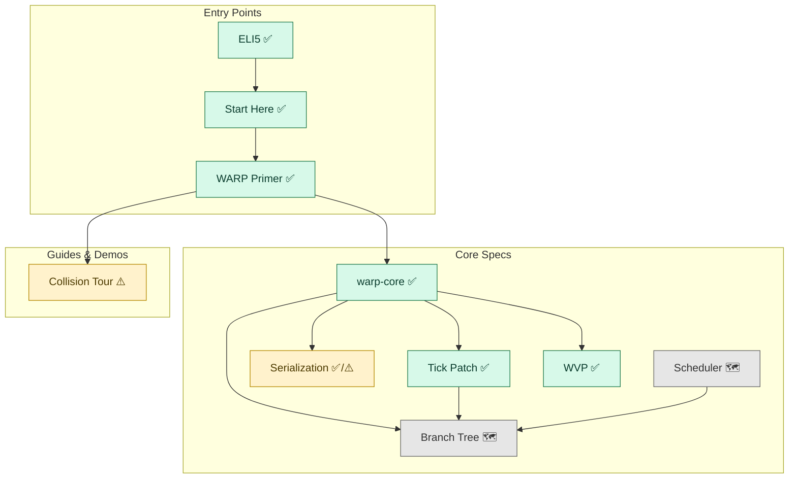

<!-- SPDX-License-Identifier: Apache-2.0 OR LicenseRef-MIND-UCAL-1.0 -->
<!-- © James Ross Ω FLYING•ROBOTS <https://github.com/flyingrobots> -->

# Echo

Echo is a deterministic **graph‑rewrite simulation engine**.
In Echo, “WARP” is the core idea: your world state is a graph (structure) plus attachments (data),
and each tick applies deterministic rewrite rules to that graph.

Git history is the archive. This page is the live docs map.

## Visual Topic Map

```mermaid
flowchart TD
  subgraph Entry["Entry Points"]
    E1["ELI5 ✅"]
    E2["Start Here ✅"]
    E3["WARP Primer ✅"]
  end

  subgraph Core["Core Specs"]
    S1["warp-core ✅"]
    S2["Tick Patch ✅"]
    S3["Serialization ✅/⚠️"]
    S4["Branch Tree 🗺️"]
    S5["Scheduler 🗺️"]
    S6["WVP ✅"]
  end

  subgraph Guides["Guides & Demos"]
    G2["Collision Tour ⚠️"]
  end

  E1 --> E2
  E2 --> E3
  E3 --> S1
  S1 --> S2
  S1 --> S3
  S1 --> S4
  S1 --> S6
  S2 --> S4
  S5 --> S4
  E3 --> G2

  classDef implemented fill:#d7f9e9,stroke:#1f7a4c,stroke-width:1px,color:#0b3d2e;
  classDef partial fill:#fff2cc,stroke:#b58900,stroke-width:1px,color:#4d3b00;
  classDef planned fill:#e6e6e6,stroke:#666,stroke-width:1px,color:#333;

  class E1,E2,E3,S1,S2,S6 implemented;
  class S3,G2 partial;
  class S4,S5 planned;
```

## Start Here (5–15 minutes)

- Newcomer (no-programming) intro: [/guide/eli5](/guide/eli5)
- Start Here guide: [/guide/start-here](/guide/start-here)
- WARP primer: [/guide/warp-primer](/guide/warp-primer)
- Architecture overview (draft context artifact): [/architecture/outline](/architecture/outline)
- Core runtime spec (`warp-core`): [/spec/warp-core](/spec/warp-core)

## Curated Map

### Core runtime

- WARP core runtime: [/spec/warp-core](/spec/warp-core)
- Tick patch boundary: [/spec/warp-tick-patch](/spec/warp-tick-patch)
- Rewrite scheduler (current implementation): [/spec/scheduler-warp-core](/spec/scheduler-warp-core)
- Scheduler benchmarks: [/benchmarks/scheduler-performance-warp-core](/benchmarks/scheduler-performance-warp-core)
- Canonical inbox sequencing: [/spec/canonical-inbox-sequencing](/spec/canonical-inbox-sequencing)
- JS/CBOR ABI mapping: [/spec/js-cbor-mapping](/spec/js-cbor-mapping)
- Merkle commit / snapshot hashing: [/spec/merkle-commit](/spec/merkle-commit)
- Retained WARP view protocol: [/spec/warp-view-protocol](/spec/warp-view-protocol)
- ABI golden vectors: [/spec/abi-golden-vectors](/spec/abi-golden-vectors)
- Two-plane law: [/warp-two-plane-law](/warp-two-plane-law)

### Determinism

- Deterministic math policy: [/determinism/SPEC_DETERMINISTIC_MATH](/determinism/SPEC_DETERMINISTIC_MATH)
- Deterministic math hazards: [/determinism/DETERMINISTIC_MATH](/determinism/DETERMINISTIC_MATH)
- Claim register + evidence: [/determinism/DETERMINISM_CLAIMS_v0.1](/determinism/DETERMINISM_CLAIMS_v0.1)
- DIND harness: [/determinism/dind-harness](/determinism/dind-harness)
- Release policy: [/determinism/RELEASE_POLICY](/determinism/RELEASE_POLICY)
- Benchmark guide: [/benchmarks/BENCHMARK_GUIDE](/benchmarks/BENCHMARK_GUIDE)

### Contributor workflow

- Contributor playbook: [/workflows](/workflows)
- PR submission loop: [/procedures/PR-SUBMISSION-REVIEW-LOOP](/procedures/PR-SUBMISSION-REVIEW-LOOP)
- Dependency DAGs: [/method/dependency-dags](/method/dependency-dags)
- Method backlog: [/method/README](/method/README)

### Theory / intent

- Architecture outline: [/architecture/outline](/architecture/outline)
- Continuum foundations bridge: [/architecture/continuum-foundations](/architecture/continuum-foundations)
- Theory: [/theory/THEORY](/theory/THEORY)
- Method: [/method/README](/method/README)

## Run Something (learn by doing)

- Collision DPO tour (static walkthrough): [/collision-dpo-tour.html](/collision-dpo-tour.html)

Echo no longer ships the older local WVP demo stack. Browser debugger delivery
is moving to `warp-ttd`, with Echo keeping the WASM/browser host surfaces.
