<!-- SPDX-License-Identifier: Apache-2.0 OR MIND-UCAL-1.0 -->
<!-- © James Ross Ω FLYING•ROBOTS <https://github.com/flyingrobots> -->
# Echo

Echo is a deterministic **graph‑rewrite simulation engine**.
In Echo, “WARP” is the core idea: your world state is a graph (structure) plus attachments (data),
and each tick applies deterministic rewrite rules to that graph.

## Visual Topic Map

```mermaid
flowchart TD
  subgraph Entry["Entry Points"]
    E1["ELI5 ✅"]
    E2["Start Here ✅"]
    E3["WARP Primer ✅"]
  end

  subgraph Core["Core Specs"]
    S1["warp-core ✅"]
    S2["Tick Patch ✅"]
    S3["Serialization ✅/⚠️"]
    S4["Branch Tree 🗺️"]
    S5["Scheduler 🗺️"]
    S6["WVP ✅"]
  end

  subgraph Guides["Guides & Demos"]
    G1["WVP Demo ✅"]
    G2["Collision Tour ⚠️"]
  end

  E1 --> E2
  E2 --> E3
  E3 --> S1
  S1 --> S2
  S1 --> S3
  S1 --> S4
  S1 --> S6
  S2 --> S4
  S5 --> S4
  S6 --> G1
  E3 --> G2

  classDef implemented fill:#d7f9e9,stroke:#1f7a4c,stroke-width:1px,color:#0b3d2e;
  classDef partial fill:#fff2cc,stroke:#b58900,stroke-width:1px,color:#4d3b00;
  classDef planned fill:#e6e6e6,stroke:#666,stroke-width:1px,color:#333;

  class E1,E2,E3,S1,S2,S6,G1 implemented;
  class S3,G2 partial;
  class S4,S5 planned;
```

## Start Here (5–15 minutes)

- Newcomer (no-programming) intro: [/guide/eli5](/guide/eli5)
- Start Here guide: [/guide/start-here](/guide/start-here)
- WARP primer: [/guide/warp-primer](/guide/warp-primer)
- Architecture overview (draft, but the source of truth for intent): [/architecture-outline](/architecture-outline)
- Core runtime spec (`warp-core`): [/spec-warp-core](/spec-warp-core)

## Run Something (learn by doing)

- WARP View Protocol demo (hub + 2 viewers): [/guide/wvp-demo](/guide/wvp-demo)
- Collision tour (walkthrough + links): [/guide/collision-tour](/guide/collision-tour)
- Interactive collision DPO tour (static HTML): [/collision-dpo-tour.html](/collision-dpo-tour.html)
- Geometry & collision (spec stub): [/spec-geom-collision](/spec-geom-collision)

## When You Need a Map

- Docs map (curated): [/meta/docs-index](/meta/docs-index)
