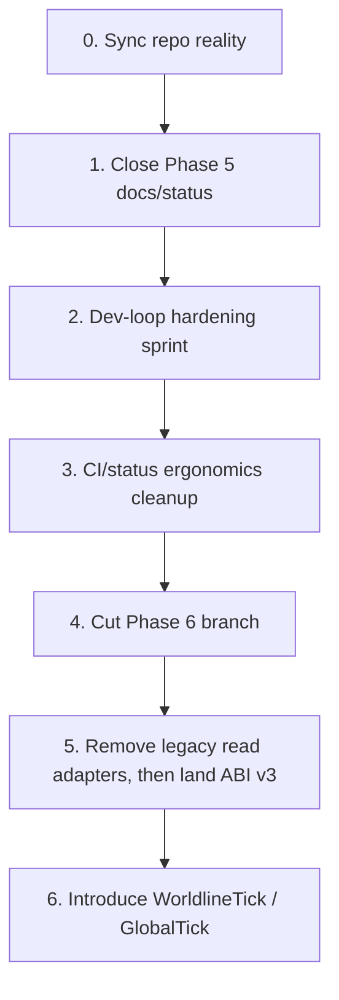

<!-- SPDX-License-Identifier: Apache-2.0 OR LicenseRef-MIND-UCAL-1.0 -->
<!-- © James Ross Ω FLYING•ROBOTS <https://github.com/flyingrobots> -->

# Archived: March 16 Plan: Post-Phase-5 Stabilization, Dev-Loop First, Then Phase 6

> Historical planning memo captured immediately after Phase 5 merged.
> Status update as of 2026-03-19:
>
> - the planned ABI break ultimately shipped as ABI v3
> - Phases 0-7 are implemented
> - the live source of truth is `docs/plans/adr-0008-and-0009.md`

## Summary

PR `#302` is merged, which means Echo now has the hard substrate pieces in
place:

- worldline-native write/runtime flow
- entry-based provenance with stored parents
- deterministic BTR packaging
- explicit observation-first read contract

That is the architectural turning point. The next chapter should not be “add
more conceptual surface area.” It should be:

1. close the doc/status truth gap after the merge
2. make the local/CI iteration loop fast enough to sustain the next phases
3. remove the now-temporary adapter debt at the start of Phase 6
4. split `worldline_tick` from `global_tick`
5. then push into full-state replay and ADR-0009 transport/conflict work

The chosen default for this plan is:

- near-term priority: developer throughput first
- architecture continues immediately after that, not instead of that
- CI remains the authoritative exhaustive proof lane
- local verification remains fast, selective, and smoke-oriented

```mermaid
flowchart LR
    A["Now: Phase 5 merged"] --> B["Close docs and sync to main"]
    B --> C["Dev-loop throughput hardening"]
    C --> D["Phase 6: delete legacy read adapters, then ABI v3 control-plane break"]
    D --> E["Phase 6: split WorldlineTick / GlobalTick"]
    E --> F["Phase 7: full WorldlineState replay"]
    F --> G["Phase 8: Wesley schema freeze"]
    G --> H["Phase 9: footprints + conflict policy"]
    H --> I["Phase 10-11: messages + import pipeline"]
```

## Big Picture

Echo is crossing from “make the model honest” into “make the model sustainable
and extensible.”

The strategic direction should be:

- keep the write path worldline-native and deterministic
- keep the read path observation-native and explicit
- remove compatibility seams on schedule instead of letting them fossilize
- treat replay as a correctness substrate, not a live mutation path
- treat local tooling and CI as part of the architecture, because slow feedback
  will distort every later decision

The long-term target state is:

- one honest write model
- one honest read model
- explicit temporal identity types
- replay that can reconstruct full `WorldlineState`
- deterministic conflict/import machinery for cross-worldline work
- stable schema boundaries after the substrate settles

## Long-Term Horizon

### Horizon 1: Finish the ADR-0008 substrate properly

This is the Phase 6 to Phase 8 arc.

- Phase 6 removes the Phase 5 adapter debt and introduces explicit
  `WorldlineTick` / `GlobalTick` types.
- Phase 7 makes replay, snapshots, and forks correct for full
  `WorldlineState`, including portal and instance operations.
- Phase 8 freezes the core runtime schema only after the temporal and replay
  model stops moving.

The point of this horizon is to make Echo’s core runtime types and replay
semantics stable enough that later transport/conflict work is building on rock
rather than wet concrete.

### Horizon 2: Make interference and transport first-class

This is the Phase 9 to Phase 11 arc.

- Phase 9A adds the missing footprint dimensions mechanically.
- Phase 9B makes the footprint model semantically true.
- Phase 9C introduces explicit conflict policy and deterministic conflict
  artifacts.
- Phase 10 adds application-level cross-worldline messages.
- Phase 11 adds frontier-relative import, causal frontiers, suffix transport,
  and receiver-side merge/conflict handling.

This is the horizon where Echo becomes a serious multi-worldline system rather
than a single-worldline runtime with future ambitions.

### Horizon 3: Optimization only after semantics are locked

Do not optimize before the model is trustworthy.

- hierarchical footprint summaries
- broader replay acceleration
- richer observer profiles
- `fork_from_observation(...)`
- wider coordinate models
- advanced debugger and analysis surfaces

Those all belong after the substrate is explicit, typed, replay-correct, and
fast enough to work on comfortably.

## Medium-Term Horizon

### Track A: Tooling and developer throughput

This is the first medium-term track because it compounds everything else.

Goals:

- keep local edit-loop checks very fast
- keep local pre-push checks selective and truthful
- keep CI authoritative but legible
- eliminate duplicated or misleading status surfaces

Planned outputs:

- tree-hash-based verification stamp reuse instead of `HEAD`-only reuse
- per-lane timing visibility and regressions for local verification
- one-shot PR status summarizer for checks, unresolved threads, and approval
  state
- CI trigger/path rationalization so tooling-only follow-ups do not feel like
  full runtime surgery

### Track B: Phase 6 API and time-model cleanup

This is the second medium-term track and starts as soon as Track A reaches its
exit criteria.

Goals:

- delete the one-phase compatibility tail on the read side
- land the planned ABI break for that deletion path (ultimately shipped as ABI v3)
- make tick semantics explicit in the type system

Planned outputs:

- remove `get_head`, `snapshot_at`, `drain_view_ops`, `execute_query`, and
  `render_snapshot` from the public boundary
- preserve `observe(...)` as the only canonical read path
- replace raw `u64` temporal coupling with `WorldlineTick` and `GlobalTick`
- update tests, docs, and schema expectations to the split tick model

### Track C: Replay correctness and fork/snapshot truth

This should begin once Phase 6 is materially underway, not before.

Goals:

- make replay correct for full `WorldlineState`
- eliminate remaining “good enough for now” replay limitations
- ensure fork and snapshot correctness for mixed warp operations

Planned outputs:

- full-state replay helpers
- upgraded snapshot and fork codepaths
- explicit unsupported-op inventory reduced to zero for replayed history
- historical fixtures for mixed-worldline and mixed-op replay correctness

## Near-Term Plan

This section is intentionally detailed. It is the recommended execution order
for the next tranche of work.

### 0. Sync repo reality before doing anything else

Do this first.

- fetch `origin`
- switch to `main`
- fast-forward local `main` to `origin/main`
- confirm PR `#302` merge commit is present on local `main`
- delete the old local feature branch only after confirming no unmerged
  local-only commits remain on it

Chosen branch policy after sync:

- first follow-up branch: `chore/devloop-post-phase5`
- second follow-up branch: `feat/adr-0008-0009-phase-6`

Why this split:

- the first branch is intentionally operational and tooling-heavy
- the second branch is intentionally architectural and API-heavy
- this keeps review intent clean and reduces mixed-risk PRs

### 1. Close the Phase 5 documentation truth gap immediately

This is the first change on `main` after sync.

Update these sources of truth:

- `docs/plans/adr-0008-and-0009.md`
- `docs/adr/ADR-0010-observational-seek-and-administrative-rewind.md`
- `docs/march-16.plan.md`

Required decisions:

- change the implementation plan header from `Phases 0-4 implemented` to
  `Phases 0-5 implemented` (the live plan now records Phases 0-7 implemented)
- mark Phase 5 as implemented with the observation-contract merge now that
  ADR-0011 is shipped
- update the implementation plan date to the post-merge date
- change ADR-0010 status from `Proposed` to `Accepted`
- add this March 16 plan document as the bridge between “Phase 5 just landed”
  and “Phase 6+ execution order”

Do not broaden docs beyond that in this pass. This is a truth-sync pass, not a
prose-expansion pass.

Acceptance criteria:

- no stale Phase 4/5 status text remains in the living plan
- ADR-0010 and ADR-0011 no longer read like one is hypothetical and the other
  is shipped
- this plan clearly states the next execution order

### 2. Run a dev-loop hardening sprint before starting Phase 6 code

This is the immediate priority.

The goal is not “tooling perfection.” The goal is a sustainable loop for the
next architectural phases.

#### 2.1 Define explicit local latency targets

Adopt these default targets:

- `verify-ultra-fast` on tooling-only changes: `<= 5s` warm
- `verify-ultra-fast` on a typical single-crate Rust edit: `<= 20s` warm
- local critical full gate on a targeted runtime change: `<= 90s` warm
- PR status inspection: `<= 5s`
- no duplicated local full rerun for the same tree

These targets become the bar for follow-up tooling choices. If a change
improves conceptual purity but blows these budgets, it is the wrong local
default.

#### 2.2 Replace `HEAD`-scoped stamp reuse with tree-hash reuse

This is the highest-value immediate tooling task.

Implement:

- verification cache keys based on the git tree hash plus verification mode
- shared reuse across manual `verify-*` and hook-triggered verification when the
  tree is identical
- preservation of the current safety boundary: a changed tree invalidates the
  cache

Why:

- commit-only churn should not invalidate a clean local verification result
- this is the easiest way to remove remaining needless reruns without weakening
  proof

Required tests:

- same tree, different commit metadata reuses the stamp
- different tree invalidates the stamp
- pre-push and manual full verification share the same cache key when they are
  proving the same thing

#### 2.3 Add per-lane timing output and a stable local timing artifact

Implement:

- per-lane duration summaries in `scripts/verify-local.sh`
- one small timing artifact under `.git/verify-local/`
- no repo-tracked timing logs from local runs

Output should include:

- lane name
- duration
- pass/fail
- total wall-clock time
- whether the run was cached or fresh

Why:

- the current lane model is better, but it still depends too much on anecdote
- future narrowing decisions should be data-driven

#### 2.4 Add a one-shot PR status helper

Take the backlog item and pull it forward.

Add one command that prints:

- PR number
- current head SHA
- unresolved review-thread count
- `reviewDecision`
- `mergeStateStatus`
- passing, pending, and failing checks grouped separately

Constraints:

- read-only only
- `gh`-based
- fast terminal output
- useful before push, before asking for merge, and before doing review cleanup

This should become the standard pre-merge and post-push visibility command.

#### 2.5 Rationalize CI paths for tooling-only and low-risk follow-ups

Do not weaken branch protection. Do not rename required checks casually.

Preferred approach:

- keep the existing authoritative PR check names stable
- use `classify-changes` more aggressively so obviously irrelevant heavy jobs
  can no-op quickly instead of doing real work
- preserve exhaustive proof for runtime and core changes
- preserve push-to-main safety nets, but keep PR as the authoritative merge
  surface

Specifically:

- tooling-only changes should not pay runtime-specific proof costs where a
  deterministic no-op or skip can be justified
- docs-only and hook-only follow-ups should be visible as “authoritative but not
  relevant” rather than “indistinguishable from full runtime change”

Acceptance criteria for the dev-loop sprint:

- local cache reuse survives commit-only churn
- one command exists for PR status truth
- tooling-only follow-ups no longer feel like runtime rebuilds locally
- CI remains authoritative and branch-protection-compatible
- no new compatibility or debug surface leaks into the product model

### 3. Only after the dev-loop sprint clears, cut the Phase 6 branch

Create `feat/adr-0008-0009-phase-6`.

Do not mix more tooling churn into this branch unless it directly blocks the
Phase 6 work.

Phase 6 should be split into two sequenced slices.

### 4. Phase 6 Slice A: remove the legacy read adapters and bump the ABI

This is the first architectural slice after the dev-loop sprint.

Required work:

- remove `get_head`
- remove `snapshot_at`
- remove `drain_view_ops`
- remove `execute_query`
- remove `render_snapshot`
- bump the WASM ABI version for the read-side break (this ultimately landed as `3`)
- keep `observe(...)` as the only canonical public read entrypoint

Rules:

- no compatibility tail beyond this slice
- no new read API may bypass `observe(...)`
- `drain_view_ops` dies here; it does not get rescued again
- query remains unsupported unless a real observation-backed query
  implementation exists

Docs to update in the same slice:

- ABI spec
- living implementation plan
- ADR-0011 if any wording still sounds transitional

Required tests:

- ABI version bump is explicit and asserted
- removed endpoints are absent, not merely deprecated
- `observe(...)` round-trip tests still cover head, snapshot, and recorded truth
  surfaces
- host-side compatibility notes clearly describe the ABI break

### 5. Phase 6 Slice B: introduce `WorldlineTick` and `GlobalTick`

This is the second architectural slice and follows Slice A immediately.

Required work:

- introduce newtypes:
    - `WorldlineTick`
    - `GlobalTick`
- thread them through:
    - `WorldlineFrontier`
    - `PlaybackCursor`
    - `ProvenanceEntry`
    - scheduler bookkeeping
    - public headers and runtime metadata
- remove remaining raw-`u64` assumptions where tick identity and correlation
  were being conflated

Rules:

- `WorldlineTick` is the only per-worldline append identity
- `GlobalTick` is metadata only
- equal tick values across different worldlines must stop implying comparability
  anywhere in the API shape

Required tests:

- independent worldlines diverge naturally in `WorldlineTick`
- `GlobalTick` increments once per SuperTick
- forked worldlines share prefix `WorldlineTick` history and then diverge
- provenance, BTR, and observation serialization stays deterministic with the
  newtypes

### 6. As soon as Phase 6 lands, start Phase 7 prep rather than Phase 9/10 directly

The next real correctness horizon after Phase 6 is replay, not transport.

Before doing real Phase 7 code, produce a prep inventory:

- every current replay limitation that still assumes partial state
- every snapshot and fork path that still depends on limited replay semantics
- portal and instance operations that are not yet rebuild-correct
- fixtures needed for mixed-worldline and mixed-op replay proofs

That prep inventory should become the entry point for
`feat/adr-0008-0009-phase-7`.

## Test and Acceptance Strategy

### Strategy

Use three proof layers and do not blur them:

- local fast proof for edit-loop confidence
- local full smoke proof for pre-push confidence
- CI exhaustive proof for merge authority

### Mandatory Near-Term Scenarios

- same-tree cache reuse works across manual and hook-triggered verification
- changed-tree invalidation still forces real verification
- PR status helper distinguishes pending vs failing vs passing checks
- Phase 6 removes legacy read endpoints completely and the honest-clock/control
  rewrite lands as ABI v3
- observation remains the only canonical read surface after Phase 6
- `WorldlineTick` and `GlobalTick` no longer leak raw `u64` coupling
  assumptions
- docs always state the actual current implemented phase count

## Assumptions and Defaults

- near-term priority is developer throughput first, then Phase 6
- CI remains the authoritative exhaustive proof lane
- local verification remains selective and smoke-oriented by default
- ADR-0010 should be marked accepted, not implemented, during the closeout pass
- `docs/march-16.plan.md` is a strategy document, not a normative ADR
- the next execution branches should be:
    - `chore/devloop-post-phase5`
    - `feat/adr-0008-0009-phase-6`
- no new compatibility tail is allowed on the read side after Phase 6 starts
