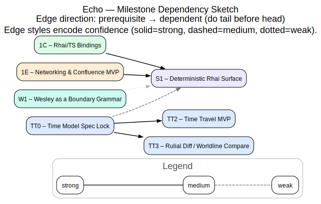
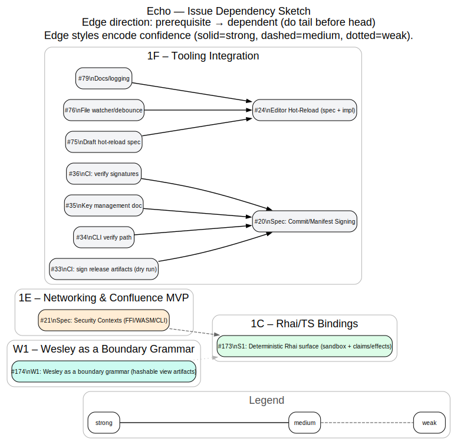

<!-- SPDX-License-Identifier: Apache-2.0 OR LicenseRef-MIND-UCAL-1.0 -->
<!-- © James Ross Ω FLYING•ROBOTS <https://github.com/flyingrobots> -->

# Dependency DAGs (Issues + Milestones)

These diagrams are a **planning aid**: they visualize a “do X before Y” ordering across a _subset_ of Echo’s open GitHub Issues and Milestones.

## Scope notes

- The canonical source of truth for scheduling is the GitHub Project board + milestone assignment (and, where present, native GitHub “blocked by / blocking” relationships).
- These graphs intentionally include **confidence styling** because several edges are inferred from issue titles/milestones rather than being explicit GitHub dependencies.

## Edge convention

- **Direction:** prerequisite → dependent (do the tail before the head).
- **Style:** solid = strong confidence, dashed = medium confidence, dotted = weak confidence.

---

## Milestone Dependency Sketch



Sources:

- DOT: `docs/assets/dags/milestone-deps.dot`
- SVG: `docs/assets/dags/milestone-deps.svg`

---

## Issue Dependency Sketch (Selected Subgraph)



Sources:

- DOT: `docs/assets/dags/issue-deps.dot`
- SVG: `docs/assets/dags/issue-deps.svg`

---

## Regenerating the SVGs

These SVGs are rendered from the DOT sources using Graphviz:

```sh
dot -Tsvg docs/assets/dags/milestone-deps.dot -o docs/assets/dags/milestone-deps.svg
dot -Tsvg docs/assets/dags/issue-deps.dot -o docs/assets/dags/issue-deps.svg
```

If you want to refresh node labels/URLs from GitHub, use the repo generator:

```sh
node scripts/generate-dependency-dags.js --fetch --render --snapshot-label none
```

Notes:

- `--fetch` uses `gh` and requires network/auth.
- The dependency edges live in `docs/assets/dags/deps-config.json`, so the graphs are easy to extend without editing the generator.
- `--snapshot-label none` avoids date churn in committed DOT/SVG diffs.

Convenience Make targets:

```sh
make dags
make dags-fetch
```

Rust `xtask` entrypoint:

```sh
cargo xtask dags
cargo xtask dags --fetch
cargo xtask dags --fetch --snapshot-label none
cargo xtask dags --snapshot-label rolling
cargo xtask dags --snapshot-label 2026-01-02
```

---

## METHOD Backlog DAG

The old `docs/assets/dags/tasks-dag-source.md` issue sketch is retired. Current
task scheduling lives in the METHOD backlog artifacts:

- DOT: `docs/method/task-dag.dot`
- SVG: `docs/method/task-dag.svg`
- Matrix: `docs/method/task-matrix.md`
- CSV: `docs/method/task-matrix.csv`

Regenerate the current DAG with:

```sh
cargo xtask method matrix
cargo xtask method dag
```
