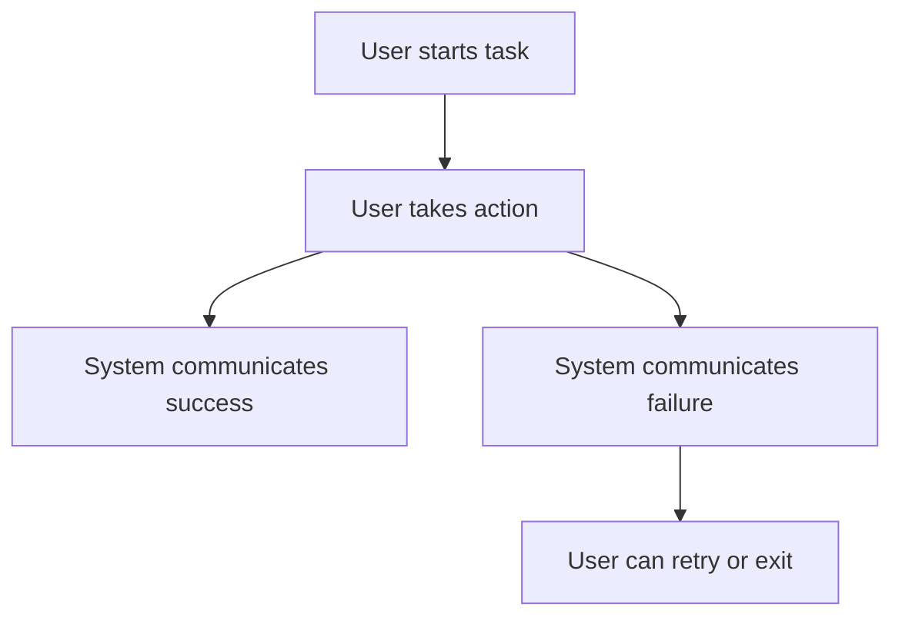
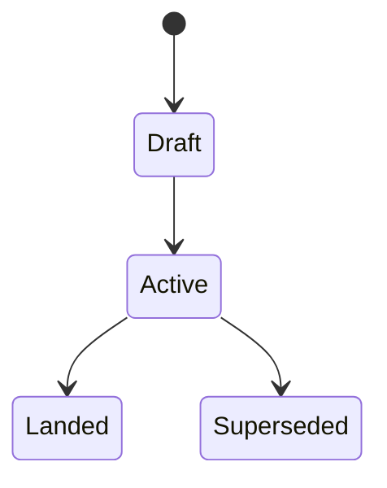

<!-- SPDX-License-Identifier: Apache-2.0 OR LicenseRef-MIND-UCAL-1.0 -->
<!-- © James Ross Ω FLYING•ROBOTS <https://github.com/flyingrobots> -->

<!-- prettier-ignore-start -->
<!-- markdownlint-disable -->
---
title: "{LEGEND}-{ID} - {Short Title}"
legend: "{KERNEL|MATH|PLATFORM|DOCS}"
lane: "design"
issue: "https://github.com/flyingrobots/echo/issues/{number}"
status: "draft|active|landed|superseded"
owners:
  - "@flyingrobots"
created: "YYYY-MM-DD"
updated: "YYYY-MM-DD"
---
<!-- markdownlint-enable -->
<!-- prettier-ignore-end -->

# {LEGEND}-{ID} - {Short Title}

## Linked Issue

- [Issue #{number}](https://github.com/flyingrobots/echo/issues/{number})

## Decision Summary

One short paragraph describing the decision this document is making.

This must be specific enough that a reviewer can say whether the
implementation matches the design. Avoid roadmap language. Say what will
exist, what it will do, and what boundary it owns.

## Sponsored Human

A {type of user} wants {capability/outcome} so that {reason}, without having
to {current pain or unsafe workaround}.

## Sponsored Agent

An agent needs {inspectable contract/tool/surface} so it can {operation},
without inferring {unstable/private-runtime/visual-only state}.

## Hill

By the end of this cycle, {user/agent} can {observable outcome} through
{surface/API/command}, and the repo proves it with {tests/witnesses}.

## Current Truth

Describe what exists today. This section is factual, not aspirational.

Include concrete anchors:

- files;
- commands;
- exported APIs;
- current docs and dogfood surfaces;
- current failure mode;
- relevant GitHub issues or PRs;
- known test coverage.

Provide links to evidence supporting strong claims, including source code or
test results at specific, fully qualified git commit SHAs.

Citation format:

```md
[{repo-relative-path}#{line-number}:{fully-qualified-commit-sha}](https://github.com/flyingrobots/echo/blob/{fully-qualified-commit-sha}/{repo-relative-path}#L{line-number})
```

Use the merge-target SHA for pre-change truth. Use the PR or landed SHA in the
retrospective for implemented truth.

## Problem

State the actual problem.

Good:

- "The retained reading recovery path can report a reading id while its payload
  material is missing, so clients cannot distinguish a recoverable reading from
  an unavailable one."

Bad:

- "Retention should be better."

## Scope

This cycle includes:

- ...

## Non-Goals

This cycle does not include:

- ...

Non-goals prevent the design from silently expanding while the PR is in flight.

## User Experience / Product Shape

Use this section for rendered UI, visible CLI, docs, or user-facing behavior.
If the work is not rendered or user-facing, say "Not applicable" and explain
why.

Answer:

- What is the user trying to do?
- What are the user's goals?
- What are the user's pain points?
- What communicates system state and actions?
- What communicates success or failure?
- Can the user undo or retry?
- What animations or transitions exist?
- How does this behave in left-to-right and right-to-left locales?
- How does this behave for keyboard and screen-reader users?

### User Journey



### Wide UI Mockup

Embed a wide UI mockup image when the work changes rendered UI.

- Use an SVG in the design packet when static structure is enough.
- Use a generated or captured bitmap only when visual fidelity matters.
- State terminal dimensions and theme assumptions.

### Narrow UI Mockup

Embed a narrow UI mockup image when the work changes rendered UI.

- Include small terminal geometry and wrapping behavior.
- Include panel collapse, focus ownership, and footer behavior.

### Accessibility Considerations

{screen-reader/agent-friendly summary of state, actions, and facts}

If the work is not a rendered surface, say "Not applicable" and explain why.

## Runtime / API Contract

Name the software contract.

Include only relevant subsections:

- exported functions and types;
- command intents;
- schema input and output;
- facts emitted;
- state transitions;
- layout, focus, and input boundaries;
- Echo authority boundary;
- Wesley or generated contract artifact boundary;
- Continuum, WASM, CLI, or other ABI boundary;
- host capability boundary;
- error behavior;
- compatibility aliases or migration behavior.

This is the section tests should be able to compile against.

## Lower Modes

Required when the work is user-visible, agent-visible, or has a non-visual
operation mode.

Describe:

- terminal size constraints;
- no-color or reduced-color output;
- text, JSON, pipe, fixture, or dry-run output;
- keyboard-only operation;
- behavior when optional adapters are unavailable;
- behavior when Echo, filesystem, network, or retained evidence is partial;
- DIND, local-only, or no-network behavior.

If no lower mode applies, say "Not applicable" and explain why.

## Data / State Model

Describe state that persists, mutates, or crosses boundaries.

| Category                  | Description |
| ------------------------- | ----------- |
| Source of truth           | ...         |
| Derived state             | ...         |
| Invalid states            | ...         |
| Reset behavior            | ...         |
| Serialization             | ...         |
| Deterministic assumptions | ...         |

Use Mermaid diagrams for complex state, entity relationships, or data flow.



## Echo Authority Boundary

Name which side owns causality, admission, receipts, readings,
materialization, retention, recovery, and host capabilities.

State what applications, generated contracts, host adapters, or external tools
may provide. Explicitly reject hidden fallback authority when the work touches
causal history, retained evidence, or host material.

## Determinism / DIND Posture

Required when the work touches runtime behavior, scheduling, math, replay,
storage ordering, host observation, clocks, randomness, hashing, or
canonicalization.

State:

- ordering assumptions;
- clock or cadence assumptions;
- random seed policy, if any;
- filesystem or map iteration ordering;
- hash and canonical encoding policy;
- scheduler or replay expectations;
- whether `cargo xtask dind run` or a narrower determinism witness applies.

If determinism is not relevant, say "Not applicable" and explain why.

## WAL / WSC / Retention Posture

Required when the work touches causal history, durable recovery, submissions,
receipts, reading envelopes, retained material, snapshots, checkpoints,
materialization, or missing evidence.

State:

- what must survive restart;
- what is retained by digest, coordinate, envelope, receipt, or witness;
- how missing, redacted, encrypted-unavailable, corrupt, or obstructed material
  is reported;
- whether WAL, WSC, CAS, or in-memory retention is involved;
- what reconstruction or replay can and cannot claim.

If not relevant, say "Not applicable" and explain why.

## Accessibility Posture

State how accessibility is preserved.

| Concern                           | Posture |
| --------------------------------- | ------- |
| Semantic labels or facts          | ...     |
| Focus order or ownership          | ...     |
| Hidden or visual-only information | ...     |
| Keyboard behavior                 | ...     |
| Secret or redaction behavior      | ...     |

If the work is not a rendered surface, still describe any agent-readable or
machine-readable posture that replaces visual affordances.

## Localization / Directionality Posture

Required when new visible strings are added or changed.

| Concern                    | Posture |
| -------------------------- | ------- |
| User-visible strings       | ...     |
| Catalog keys               | ...     |
| Supported locales updated  | ...     |
| Directionality assumptions | ...     |
| Validation command         | ...     |

If no strings change, say "Not applicable" and explain why.

## Agent Inspectability / Explainability Posture

Describe how an agent can inspect the result without scraping pixels,
terminal prose, private app caches, or hidden runtime state.

Examples:

- stable ids;
- metadata fields;
- emitted facts;
- deterministic text or JSON output;
- registry entries;
- schema descriptions;
- command ids;
- machine-readable witness output.

## App-Noun Boundary

Required for any work motivated by Jedit, WARP DRIVE, git-warp, Graft, Bijou,
or another external consumer.

State which names are allowed only in docs, fixtures, generated contract
artifacts, tests, or external adapters. Confirm that production Echo core does
not import application nouns or implementation details such as editor buffers,
FUSE inodes, panes, project files, product UI panels, or private app caches.

If no external-consumer vocabulary is involved, say "Not applicable" and
explain why.

## Linked Invariants

List repo invariants this work must preserve.

Examples:

- Tests are executable spec.
- Runtime truth beats type theater.
- Design should become repo truth.
- Echo owns causality; clients own presentation and host affordances.
- Applications define vocabulary; Echo owns admission, receipts, readings, and
  retention posture.
- Retained evidence is explicit; missing support obstructs rather than falling
  back.
- Production Echo core stays app-noun-clean.
- Determinism is binary.

## Design Alternatives Considered

### Option A: {name}

Pros:

- ...

Cons:

- ...

### Option B: {name}

Pros:

- ...

Cons:

- ...

## Decision

State the chosen option and why.

If the decision is temporary, name the expiration or migration window.

## Implementation Slices

- [ ] Slice 1: {smallest testable slice and intended commit message}
- [ ] Slice 2: {next slice}
- [ ] Slice 3: {next slice}

Each slice should be small enough to commit or review independently. Each slice
should correspond to one test case, user story, or inspectable process change.

If the right slices are unclear, budget a spike to understand the requirements
and slice appropriately.

## Tests To Write First

Behavior tests required:

- [ ] {package/runtime/render test that fails before implementation}
- [ ] {integration test that exercises user-visible behavior}
- [ ] {lower-mode or pipe/accessibility test, if relevant}
- [ ] {regression test for the specific bug or risk}

Documentation and process tests, only if relevant:

- [ ] {design/changelog/backlog/process assertion}

Rule: documentation tests cannot be the only proof for implementation work.

## Acceptance Criteria

The work is done when:

- [ ] Behavior test proves {contract}
- [ ] Rendered output or runtime API proves {user-visible outcome}
- [ ] Lower modes are covered, if relevant
- [ ] New strings have supported translations, if relevant
- [ ] Docs, changelog, or dogfood are updated when behavior or direction
      changes
- [ ] Issue and PR are linked correctly
- [ ] CI and local validation are green

## Validation Plan

Commands expected before PR:

```bash
cargo fmt --check
cargo clippy -p {crate} --all-targets -- -D warnings
cargo test -p {crate} {focused tests}
cargo xtask lint-dead-refs --file {touched-doc}.md
git diff --check
```

Trim commands that do not apply. Add package-specific commands when needed.
Use `cargo xtask dind run` when determinism is part of the hill.

## Playback / Witness

Describe what a reviewer can run or inspect.

Examples:

```bash
cargo test -p warp-core --test {cycle_test}
cargo xtask dind run
cargo xtask lint-dead-refs --file docs/design/{cycle}/{doc}.md
```

If there is a visual, CLI, WASM, or TUI result, include the route, command,
key sequence, terminal size, theme, locale, feature flags, and fixture needed
to reproduce it.

## Risks

Known risks:

- ...

Mitigations:

- ...

## Follow-On Debt

Create GitHub issues for anything deferred.

Do not hide future work in prose. If it matters, it gets an issue.

## Retrospective

Fill this in after implementation.

What changed from the design:

- ...

What the tests proved:

- ...

What remains open:

- ...

PR:

- [PR #{number}](https://github.com/flyingrobots/echo/pull/{number})
