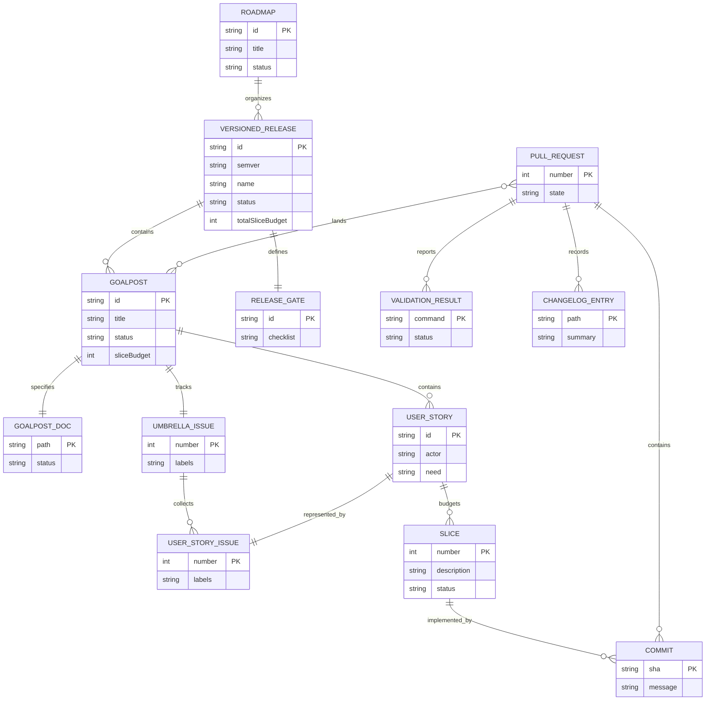
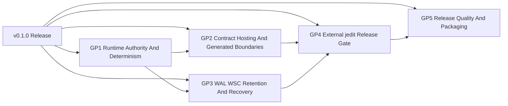
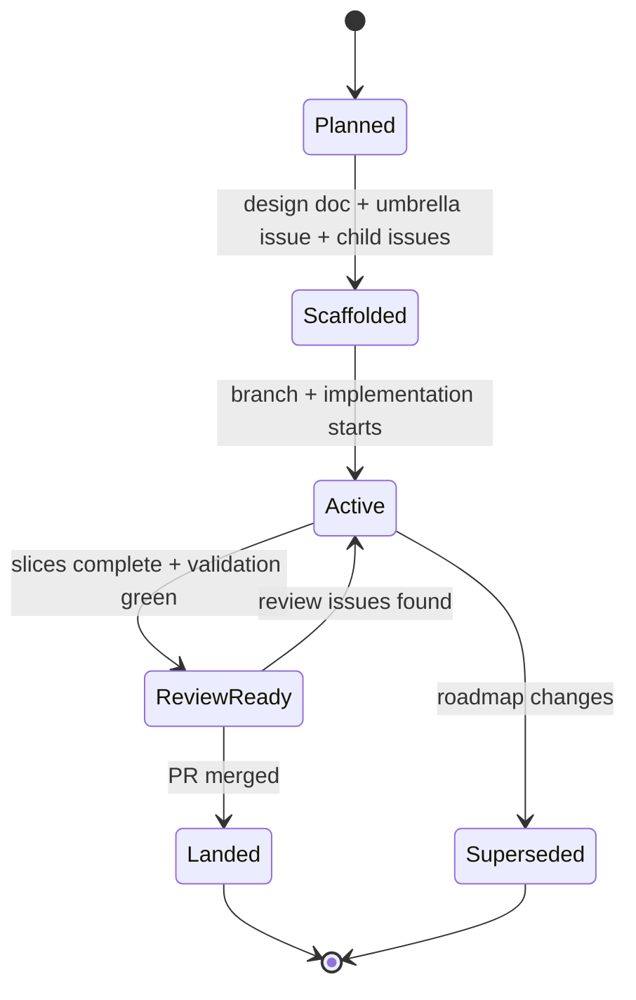

<!-- SPDX-License-Identifier: Apache-2.0 OR LicenseRef-MIND-UCAL-1.0 -->
<!-- © James Ross Ω FLYING•ROBOTS <https://github.com/flyingrobots> -->

# Roadmap Planning System

## Purpose

Echo uses a roadmap-driven, issue-backed, goalpost-budgeted delivery system.

The system separates intent, coordination, execution, and proof:

- Markdown documents define intent, scope, runtime contracts, authority
  boundaries, and acceptance criteria.
- GitHub Issues coordinate goalposts, user stories, labels, and ownership.
- Branches, commits, and pull requests execute reviewable changes.
- Rust tests, WASM ABI checks, CLI output, generated artifacts, DIND witnesses,
  WAL/WSC recovery reports, and external consumer witnesses prove
  implementation.

A design document may define intent, but it does not prove implementation. A
goalpost is complete only when the repo can prove the claimed behavior through
an executable or inspectable software surface.

## System Model

| Entity              | Purpose                          | Location                            |
| ------------------- | -------------------------------- | ----------------------------------- |
| Roadmap             | Orders a release path            | Roadmap doc                         |
| Versioned Release   | SemVer runtime target            | Roadmap directory or release plan   |
| Goalpost            | Major milestone                  | Goalpost doc and umbrella issue     |
| Umbrella Issue      | Goalpost tracking root           | GitHub issue with `goalpost`        |
| User Story          | User- or agent-centered behavior | Child issue and doc section         |
| Slice               | Reviewable increment             | Goalpost checklist                  |
| Slice Budget        | Planning estimate                | Roadmap and goalpost docs           |
| Acceptance Criteria | Completion contract              | Docs and issue bodies               |
| Validation Plan     | Required proof commands          | Design docs and PR bodies           |
| Pull Request        | Review and merge vehicle         | GitHub PR                           |
| Changelog Entry     | Historical ledger                | `CHANGELOG.md` or `docs/BEARING.md` |

## Relationship Model

The relationship model is:



The same hierarchy in words is:

```text
Roadmap
  contains versioned releases

Versioned Release
  contains goalposts
  defines release completion gates

Goalpost
  has one design doc
  has one umbrella GitHub issue
  has one slice budget
  contains user stories
  contains a checklist of implementation slices

Umbrella Issue
  represents one goalpost
  collects child user-story issues as GitHub task-list items

User Story Issue
  belongs to one goalpost
  describes one runtime behavior, operator workflow, or agent capability
  may be implemented by one or more slices

Slice
  is the smallest useful unit of progress
  should usually map to one test, witness, commit, or reviewable behavior change

Pull Request
  lands one coherent set of docs or implementation changes
  links back to the relevant issue, design doc, and goalpost
```

The canonical planning-to-merge path is:

```text
Roadmap doc
  -> versioned release section
    -> goalpost doc
      -> umbrella issue
        -> child user-story issues
          -> slices
            -> commits
              -> pull request
                -> merge
```

## Versioned Releases

A roadmap organizes goalposts into versioned releases. A versioned release is a
bounded runtime target with a SemVer release identifier, for example `v0.1.0`.

Release identifiers must use leading-`v` SemVer:

```text
vMAJOR.MINOR.PATCH
```

Versioned release planning has four jobs:

1. Name the release outcome in runtime and external-consumer terms.
2. Select the goalposts required to call that release complete.
3. Order goalposts by dependency and risk.
4. Define the release gate that must be true before the version can be called
   landed.

The current roadmap instance is the `v0.1.0` completion roadmap:

- Roadmap index:
  `docs/design/v0.1.0-release-plan.md`
- Current external release gate:
  `docs/design/v0.1.0-jedit-release-gate.md`
- Current direction:
  `docs/BEARING.md`
- Current work index:
  `docs/WorkItems.md`
- Goalpost docs and umbrella issues:
  create or update them when the `v0.1.0` roadmap is scaffolded under this
  policy

### Versioned Release Contract

```text
VersionedRelease = {
  id: "v0.1.0",
  name: "Echo v0.1.0 Completion Roadmap",
  roadmapDoc: MarkdownDocument,
  goalposts: Goalpost[],
  releaseGate: ChecklistItem[],
  totalSliceBudget: PositiveInteger,
  status: "planned" | "active" | "landed" | "superseded"
}
```

### Release Gate

A versioned release is ready when every goalpost in the release is landed and
the release-level gate is satisfied.

For Echo `v0.1.0`, the release gate is:

- [ ] Application-facing intent submission is witnessed ingress history, not a
      scheduler tick.
- [ ] Trusted runtime control owns scheduler opportunities and fault recovery.
- [ ] Contract-hosted mutation and query observer seams are generated or
      registry-backed and stay application-noun-clean.
- [ ] Receipts, retained-evidence posture, and bounded readings are exposed
      through generic Echo surfaces.
- [ ] WAL/WSC recovery claims are limited to what persisted evidence can prove.
- [ ] Determinism and replay claims have focused Rust, CLI, DIND, or generated
      artifact witnesses.
- [ ] The production-core app-noun guard proves that jedit, editor, and fixture
      shortcuts are absent from production Echo core.
- [ ] The external jedit witness passes from the sibling jedit repository when
      the release gate requires it.
- [ ] A single release checklist names the exact commands and witness artifacts
      required before publishing.

### Release Sequencing



### Version Naming

Use SemVer roadmap names when a body of work has a release-level definition of
complete. Release IDs must include the leading `v` and all three SemVer
positions:

- `v0.1.0`: first Echo release that can honestly claim the jedit external
  release gate.
- `v0.2.0`: compatible runtime, contract-hosting, or external-consumer feature
  release after `v0.1.0`.
- `v0.2.1`: patch release for fixes, docs, or proof hardening.
- `v1.0.0`: first release that can reasonably be called complete for Echo's
  stable runtime promise.

Do not use shorthand release IDs such as `v0.1`, `v1`, or `v2` in roadmap
metadata, issue fields, release gates, or release-status reporting. Those forms
may appear only as informal prose when referring to a release line.

Do not create a new version for every feature. Feature work belongs inside the
current active version unless it changes the release promise.

## Authority Model

Authority flows in this order:

1. Runtime behavior in `warp-core`, `warp-wasm`, `echo-wasm-abi`, WAL/WSC,
   retained evidence, and generated contract-host surfaces.
2. Rust tests, DIND witnesses, WASM ABI behavior, CLI output, schema checks,
   generated artifacts, deterministic command output, and external jedit
   witnesses.
3. GitHub Issues and pull requests.
4. Design docs and roadmap docs.
5. `CHANGELOG.md`, `docs/BEARING.md`, and release notes.
6. Coordination memory.

Memory notes help coordination, but they do not override files, commits,
commands, GitHub Issues, pull requests, tests, generated output, or runtime
witnesses.

## Goalpost Contract

```text
Goalpost = {
  id: "V0.1-GP<n>",
  title: string,
  umbrellaIssue: GitHubIssue,
  designDoc: MarkdownDocument,
  sliceBudget: PositiveInteger,
  userStories: UserStory[],
  checklist: Slice[],
  acceptanceCriteria: ChecklistItem[],
  validationPlan: CommandOrWitness[],
  completionState: "planned" | "active" | "landed" | "superseded"
}
```

A goalpost must answer:

- What runtime, operator, external-consumer, or agent outcome does this
  milestone unlock?
- What inspectable contract exists?
- What is explicitly in scope?
- What is explicitly out of scope?
- Which stories make up the goalpost?
- How many slices are budgeted?
- What must be true before the goalpost is done?
- What tests, witnesses, generated artifacts, or facts prove it?
- What can Echo still not claim after this goalpost lands?

## User Story Contract

```text
UserStory = {
  issue: GitHubIssue,
  actor: "user" | "agent" | "maintainer" | "runtime-owner" | "external-consumer",
  need: string,
  reason: string,
  proof: ChecklistItem[],
  sliceBudget: PositiveInteger
}
```

A well-formed story uses this shape:

```text
A <type of user> wants <capability/outcome> so that <reason>,
without having to <current workaround or failure mode>.
```

For Echo, agent and runtime-owner stories must also name the command, API,
schema, generated artifact, DIND witness, or recovery report that proves the
story without relying on prose.

A user story must name proof. Intent alone is not enough.

## Slice Contract

```text
Slice = {
  number: PositiveInteger,
  description: string,
  expectedProof:
    "test" |
    "wasmAbi" |
    "cliOutput" |
    "dindWitness" |
    "walWscRecovery" |
    "generatedArtifact" |
    "externalConsumerWitness" |
    "docUpdate" |
    "issueUpdate" |
    "runtimeBehavior",
  status: "open" | "inProgress" | "complete"
}
```

A slice is the smallest useful execution unit. A good slice can usually be
reviewed independently and has one obvious proof.

Slice budgets provide progress denominators:

```text
GoalProgress = completed slices / total slices
OverallProgress = landed goalposts / total goalposts
```

Progress reports should use concrete denominators, for example:

```text
Goal 3: [#####-----] 50% (slice 11 of 22)
Overall: [###-------] 30% (goal 3 of 10)
```

## Issue Label Model

Labels are query indexes, not prose decoration.

| Label              | Meaning                                            |
| ------------------ | -------------------------------------------------- |
| `roadmap`          | Participates in roadmap planning                   |
| `goalpost`         | Umbrella milestone issue                           |
| `user-story`       | Child issue scoped to a story                      |
| `work-in-progress` | Current active implementation cycle                |
| `lane:release`     | Echo release-bar work                              |
| `lane:asap`        | Pull into a cycle soon                             |
| `lane:up-next`     | Queued after `asap`                                |
| `lane:bad-code`    | Known technical debt or structural issue           |
| `lane:cool-ideas`  | Deferred runtime, product, or design idea          |
| `legend:kernel`    | Core runtime domain                                |
| `legend:math`      | Deterministic math and geometry domain             |
| `legend:platform`  | WASM, CLI, CI, CAS, Wesley, release infrastructure |
| `legend:docs`      | Documentation, specs, guides, and docs honesty     |

The important invariant is that `goalpost` and `user-story` should not be mixed
casually. Umbrella issues get `goalpost`; child story issues get `user-story`.
Each live issue should still carry one Method lane label unless it is actively
being re-triaged.

## Workflow State Machines

### Goalpost Lifecycle



### Cycle Lifecycle

```text
sync merge target
  -> create branch
  -> write or update design and issue scaffold
  -> commit scaffold
  -> push branch
  -> open non-draft PR
  -> implement slices
  -> self-review
  -> fix review issues
  -> validate
  -> merge
```

## Proof Policy

No implementation goalpost is complete through documentation alone.

Acceptable proof includes:

- unit and integration tests against Rust runtime modules
- fixture-table tests
- WASM ABI encode/decode and exported-call tests
- CLI text or JSON output
- WAL/WSC recovery reports and obstruction cases
- retained-evidence and reading-envelope facts
- generated Wesley or contract-host artifacts
- deterministic DIND witnesses
- production-core app-noun guard output
- external jedit witness output when a gate depends on jedit
- CI checks
- inspectable runtime facts

Docs can explain the contract. They cannot be the only evidence that the
contract works.

## Current Roadmap Instance

| Goalpost                                           | Slice budget | Umbrella issue |
| -------------------------------------------------- | -----------: | -------------- |
| V0.1-GP1 Runtime Authority And Determinism         |           16 | TBD            |
| V0.1-GP2 Contract Hosting And Generated Boundaries |           18 | TBD            |
| V0.1-GP3 WAL WSC Retention And Recovery            |           24 | TBD            |
| V0.1-GP4 External jedit Release Gate               |           18 | TBD            |
| V0.1-GP5 Release Quality And Packaging             |           12 | TBD            |

Current release: `v0.1.0`.

Total planned budget: 88 slices.

The `TBD` umbrella issues should be created when the `v0.1.0` roadmap is
formally scaffolded under this policy. Until then, do not report percentage
progress from this table as landed truth.

## Operating Invariants

- Every versioned release has a roadmap document.
- Every versioned release uses leading-`v` SemVer: `vMAJOR.MINOR.PATCH`.
- Every major milestone has a goalpost Markdown document.
- Every goalpost has one umbrella GitHub issue.
- Every umbrella issue collects child user-story issues as checklist items.
- Every child issue maps to a user story, not a vague task.
- Every goalpost has a slice budget.
- Every goalpost doc has a checklist.
- Runtime and product work must have executable proof.
- Markdown docs are planning artifacts, not proof artifacts.
- Application nouns stay in authored contracts, generated adapters, tests, or
  external repos. Production Echo core stays generic.
- Application-authored optics do not create ticks.
- Trusted runtime control owns scheduler opportunities.
- WAL/WSC/recovery claims must not exceed persisted evidence.
- Changes are committed as normal commits, never amended.
- Branches, commits, and PRs do not use a `codex` prefix.
- PRs are non-draft unless repo policy changes.

## Vision And Bearing Recommendation

Echo should keep `VISION.md` and `docs/BEARING.md` separate.

### Keep `docs/BEARING.md`

`docs/BEARING.md` already exists and is useful. It should remain the short
operational orientation document:

- what Echo is right now
- what recently shipped
- what is currently risky
- what open loops matter next
- what constraints an agent or engineer should remember before touching the
  repo

`docs/BEARING.md` should be updated at cycle or release-gate boundaries and
should stay factual. It should not become a product manifesto, backlog, or
issue tracker.

### Keep `VISION.md`

Root-level `VISION.md` is the stable north star for Echo. It should answer:

- Who is Echo for?
- What job should it become excellent at?
- What does "complete" mean from a runtime and external-consumer perspective?
- What should Echo refuse to become?
- What product and runtime principles should guide roadmap tradeoffs?
- Which workflows define success one year from now?

`VISION.md` should change rarely. It should guide release roadmaps without
becoming a roadmap itself.

### Recommended Separation

| Document          | Time horizon  | Primary question                 | Update frequency |
| ----------------- | ------------- | -------------------------------- | ---------------- |
| `VISION.md`       | Long-term     | Where are we going?              | Rare             |
| `docs/BEARING.md` | Current state | Where are we now?                | Frequent         |
| Roadmap docs      | Release cycle | What must land for this version? | Per release      |
| Goalpost docs     | Milestone     | What will this goalpost prove?   | Per goalpost     |
| GitHub Issues     | Execution     | What work remains?               | Continuous       |

Keep `docs/BEARING.md` explicitly pointed at `VISION.md` for long-term
direction and roadmap docs for release execution.
