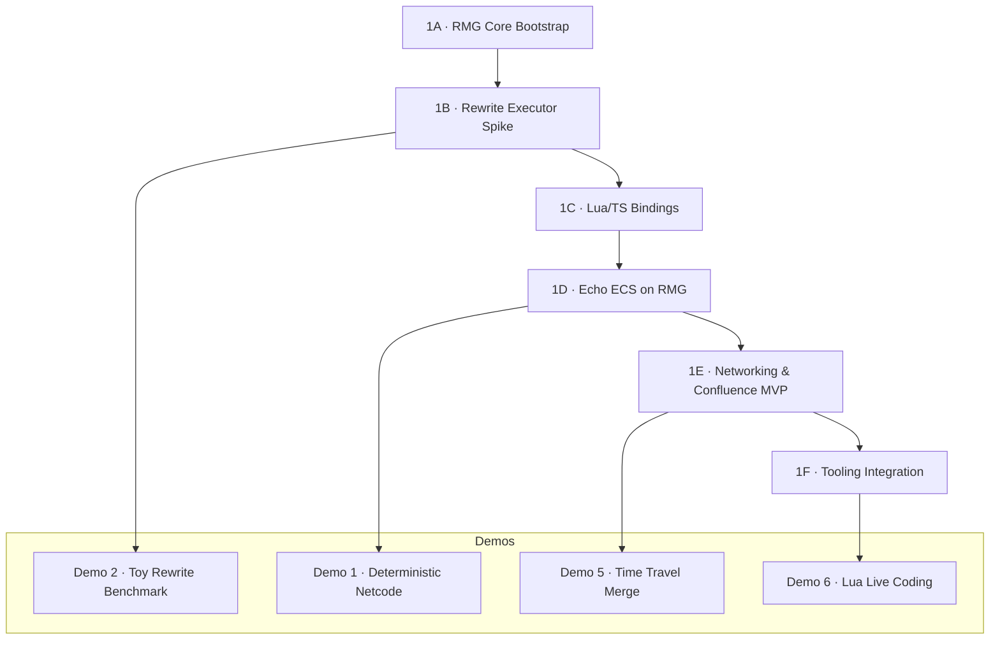

# Phase 1 – Core Ignition Plan

Goal: deliver a deterministic Rust implementation of RMG powering the Echo runtime, with tangible demos at each milestone. This plan outlines task chains, dependencies, and expected demonstrations.

---

## Task Graph

---

## Phases & Tangible Outcomes

### 1A · RMG Core Bootstrap
- Tasks
  - Scaffold crates (`rmg-core`, `rmg-ffi`, `rmg-wasm`, `rmg-cli`).
  - Implement GraphStore primitives, hash utilities, scheduler skeleton.
  - CI: `cargo fmt/clippy/test` baseline.
- Demonstration: *None* (foundation only).

### 1B · Rewrite Executor Spike
- Tasks
  - Implement motion rule test (Position + Velocity rewrite).
  - Execute deterministic ordering + snapshot hashing.
  - Add minimal diff/commit log entries.
- Demonstration: **Demo 2 · Toy Benchmark**
  - 100 nodes, 10 rules, property tests showing stable hashes.

### 1C · Lua/TS Bindings
- Tasks
  - Expose C ABI, embed Lua 5.4 with deterministic async helpers.
  - Build WASM bindings for tooling.
  - Port inspector CLI to use snapshots.
- Demonstration: Lua script triggers rewrite; inspector shows matching snapshot hash.

### 1D · Echo ECS on RMG
- Tasks
  - Map existing ECS system set onto rewrite rules.
  - Replace Codex’s Baby event queue with rewrite intents.
  - Emit frame hash HUD.
- Demonstration: **Demo 1 · Deterministic Netcode**
  - Two instances, identical inputs, frame hash displayed per tick.

### 1E · Networking & Confluence MVP
- Tasks
  - Implement rewrite transaction packets; replay on peers.
  - Converge canonical snapshots; handle conflicts deterministically.
  - Integrate rollback path (branch rewind, replay log).
- Demonstration: **Demo 5 · Time Travel**
  - Fork, edit, merge branch; show canonical outcome.

### 1F · Tooling Integration
- Tasks
  - Echo Studio (TS + WASM) graph viewer with live updates.
  - Entropy lens, paradox heatmap overlays.
  - Lua live coding pipeline (hot reload).
- Demonstrations:
  - **Demo 3 · Real Benchmark** (1k nodes, 100 rules).
  - **Demo 6 · Live Coding** (Lua edit updates live graph).

---

## Performance / Benchmark Milestones

| Milestone | Target | Notes |
| --------- | ------ | ----- |
| Toy Benchmark | 100 nodes / 10 rules / 200 iterations < 1ms | Demo 2 |
| Real Demo | 1,000 nodes / 100 rules < 10ms rewrite checks | Demo 3 |
| Production Stretch | 10,000 nodes / 1000 rules (profiling only) | Phase 2 optimizations |

Optimization roadmap once baseline is working:
1. Incremental pattern matching.
2. Spatial indexing.
3. SIMD bitmap operations.
4. Critical pair analysis for confluence proofs.

---

## Networking Demo Targets
| Mode | Deliverable |
| ---- | ----------- |
| Lockstep | Replay identical inputs; frame hash equality per tick. |
| Rollback | Predictive input with rollback on mismatch. |
| Authority | Host selects canonical branch; entropy auditor rejects paradox. |

---

## Documentation Checklist
- Update `docs/rmg-runtime-architecture.md` as rules/loop evolve.
- Append decision log entries per phase.
- Record demo outcomes in `docs/decision-log.md` (tag entries with the relevant demo).

Phase 1 completes when Demo 6 (Live Coding) runs atop the Rust RMG runtime with inspector tooling in place.
