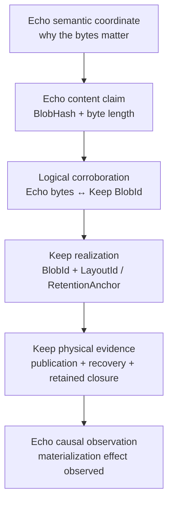

<!-- SPDX-License-Identifier: Apache-2.0 OR LicenseRef-MIND-UCAL-1.0 -->
<!-- © James Ross Ω FLYING•ROBOTS <https://github.com/flyingrobots> -->

# Echo × Keep Physical CAS Interop and Identity Corroboration Exploration (No ADR)

## TL;DR

| Question                                               | Exploratory answer                                                                                                                                                                                                             |
| ------------------------------------------------------ | ------------------------------------------------------------------------------------------------------------------------------------------------------------------------------------------------------------------------------ |
| What are we evaluating?                                | Whether Keep can become Echo's physical retained-content engine for CAS-addressed materialized readings, WSC import, reconstruction, range reads, and retention workflows.                                                     |
| What is the central hypothesis?                        | The same exact bytes can be independently admitted under Echo's content-only hash law and Keep's versioned logical-identity law, producing an explicit correspondence witness without pretending the two identities are equal. |
| What remains Echo-owned?                               | Semantic coordinates, causal truth, WSC content hashes, authorization, replay policy, materialization intents, and observations.                                                                                               |
| What may become Keep-owned?                            | Keep's independent logical byte identity, chunking, layouts, physical publication, restart recovery, retained closure, range reads, and eventually compaction or garbage collection.                                           |
| What does the adapter own?                             | Proof that one exact byte stream satisfied both identity systems, plus translation between Echo content claims and exact Keep reconstruction coordinates.                                                                      |
| What is the first artifact?                            | An exploratory `EchoKeepLogicalBindingV1` for Echo hash + length ↔ Keep `BlobId`, plus `EchoKeepRealizationBindingV1` for one exact Keep `LayoutId`.                                                                           |
| Are Echo `BlobHash` and Keep `BlobId` interchangeable? | No. They assert different propositions and must never be cast, substituted, or silently normalized into one identity.                                                                                                          |
| Can one logical binding have multiple Keep layouts?    | Yes. Different verified `LayoutId` values may lawfully realize the same Keep `BlobId`. A different verified Keep `BlobId` for the same exact Echo bytes is an obstruction.                                                     |
| What is the first implementation posture?              | A standalone Rust 1.96 interop spike using Keep's non-durable `ReferenceStore` as the executable oracle, followed by a narrow fallible WSC streaming port.                                                                     |
| What is the likely production replacement target?      | Echo's `DiskTier`, not Echo's content-only hash namespace or all of `echo-cas`.                                                                                                                                                |
| When is an ADR required?                               | Before freezing a persisted binding format, changing WSC wire identity, adopting a production Keep backend, changing durable Keep read/publication contracts, or declaring a permanent ownership boundary.                     |

## Repository posture

This is an exploratory design artifact. It records a hypothesis and a sequence
of executable tests; it does not establish a durable architectural boundary.

No ADR is introduced by this branch. If this document is carried in
`docs/plans/` for branch-local work, it must remain explicitly non-normative and
must be removed, superseded, or converted into the appropriate durable decision
record before the underlying identity, format, public API, durability, recovery,
or ownership boundary is adopted.

### Source-reality audit findings (2026-08-04)

Confirmed from the current `flyingrobots/echo` and `flyingrobots/keep` source:

- **Echo CAS remains full-materializing by design.**
    - `crate::echo_cas::BlobStore` still exposes a sync `get` path.
    - `MemoryTier` returns buffered bytes from memory as `Arc<[u8]>`.
    - `DiskTier` still reads complete blobs and re-validates full hash before
      returning a complete byte buffer.
- **WSC boundary is still `Option<Vec<u8>>` today.**
    - `crates/warp-core/src/wsc/store.rs` continues to require full-bytes
      materialization for `cas_blob_bytes`.
    - `Warp CLI` still uses an unavailable CAS stand-in for this path (`UnavailableCasStore`),
      so any streaming replacement must not assume immediate CLI parity.
- **Keep split is real and relevant.**
    - The `ReferenceStore` is a strong non-durable executable oracle.
    - Keep retains a separate durable catalog/recovery stack (`Store`, `State`,
      writer authority, retained closures, replay states) and cannot be treated as
      one replacement for current `echo-cas` behavior.
- **Toolchain mismatch remains unsolved.**
    - `echo-keep` currently resolves to a 1.96+ Rust profile (`flyingrobots/keep`
      requirement), while the working echo branch is pinned to 1.90.
- **Viability status is unchanged:**
    - The plan remains credible for exploration and spike proving.
    - It is **not yet production-accurate** because streaming WSC CAS APIs and
      Keep durable logical-read integration are both still design-level commitments
      without code lockstep in this repo.

## Objective

Decide whether Keep can replace or host the physical storage responsibilities
currently associated with `echo-cas` for CAS-addressed materialized readings,
WSC import, reconstruction, range reads, and retention workflows, without
breaking Echo's invariants for causal truth, replay safety, deterministic
identity, or semantic authority.

The primary exploration is **independent identity corroboration**:

> One exact byte stream is independently admitted under Echo's content-only
> BLAKE3 identity and Keep's versioned logical `BlobId`; the adapter retains a
> witness that both systems observed the same bytes without claiming that their
> identities are equal.

This changes the purpose of the integration. The goal is not CAS API parity and
not identity replacement. The goal is a lawful division of responsibility:

- Echo explains **why the bytes matter**.
- Keep proves **which exact bytes and reconstruction plan exist**.
- The adapter witnesses **that both identity systems admitted the same
  material**.

## Primary architecture



The evidence chain is intentionally layered:

1. An Echo semantic coordinate names the question the bytes answer.
2. An Echo content claim names the raw bytes under Echo's content-only law.
3. A logical corroboration witness binds that claim to a Keep `BlobId` obtained
   from the same exact bytes.
4. A realization witness names one exact Keep `LayoutId` capable of
   reconstructing those bytes.
5. Keep publication and retention evidence proves the physical realization is
   available under Keep's own laws.
6. Echo records the authorized external effect and its verified observation in
   causal history.

No lower layer acquires the authority of the layer above it.

## Corroboration ladder

The integration should expose progressively stronger evidence postures instead
of one vague `stored` or `verified` boolean.

| Level                                     | Required evidence                                                                                                                                       | Claim established                                                                   | Explicit nonclaim                                                  |
| ----------------------------------------- | ------------------------------------------------------------------------------------------------------------------------------------------------------- | ----------------------------------------------------------------------------------- | ------------------------------------------------------------------ |
| C0 — dual-coordinate candidate            | Echo content hash and exact length computed while Keep ingests the same complete source stream, plus the candidate Keep `BlobId` and `LayoutId`         | Both identity calculations observed one complete source stream during the operation | Does not prove that retained Keep state can reconstruct the bytes  |
| C1 — retained reconstruction corroborated | C0 plus complete Keep reconstruction through the named layout, a matching `ReconstructionReceipt`, and an independently recomputed Echo hash and length | The named Keep realization reconstructs exact bytes satisfying both identity laws   | Does not prove process survival or durable publication             |
| C2 — durable physical corroboration       | C1 plus exact Keep publication, pinned-generation, and retained-closure evidence                                                                        | A durable Keep state supports the same verified logical correspondence              | Does not grant Echo causal authority                               |
| C3 — causally observed materialization    | C2 plus a committed Echo materialization observation matching a previously committed intent                                                             | Echo has causally witnessed the verified physical materialization                   | Does not make Keep publication history part of Echo causal history |

The exploratory binding type represents C1, not merely C0. Phase C must produce
C2 evidence. Phase D must reconcile C2 into C3 through Echo's existing outbox.
No API may accept a weaker level where a stronger level is required.

## Current Echo state (as of branch `echo-keep`)

- `echo-cas` owns a content-only CAS identity:
    - `BlobHash = BLAKE3(bytes)` with no domain prefix;
    - identical bytes intentionally share one hash regardless of semantic role;
    - semantic meaning is carried separately by `SemanticBlobCoordinate` and
      retained descriptors.
- The public `BlobStore` interface is synchronous and materializing:
    - `get` returns `Option<Arc<[u8]>>`;
    - the source comments already identify this return shape as unsuitable for
      future disk and cold streaming tiers;
    - `MemoryTier` is an infallible in-process implementation.
- `DiskTier` is fallible and filesystem-backed:
    - it stores bytes by content-only hash;
    - `get` reads the entire blob into memory and re-verifies the hash;
    - it provides ordinary process-restart persistence;
    - it does not currently expose a complete publication, synchronization,
      crash-classification, recovery, or persistent-retention protocol comparable
      to Keep's durable store;
    - its pin set is process-local.
- The WSC CAS bridge remains full-materialization oriented:
    - `WscCasBlobStorePort::cas_blob_bytes` returns `Option<Vec<u8>>`;
    - CAS-addressed WSC import loads full bytes, recomputes Echo's content hash,
      checks length, and returns the full allocation;
    - `warp-cli` currently supplies an unavailable CAS implementation for these
      paths.
- Echo already has the correct causal side-effect protocol:
    - `MaterializationIntentRecord` records authorized external work;
    - `MaterializationObservationRecord` records verified completion;
    - outbox recovery distinguishes already observed, matching existing
      artifact, missing artifact, digest mismatch, metadata mismatch, and missing
      retained material.

### Consequence

Echo already has the semantic identity and causal protocol that must survive the
integration. Its weak point is the physical blob interface and implementation,
not the meaning of its content hashes.

## Current Keep state (as of the attached worktree)

Keep exposes two materially different layers that must not be conflated.

### Reference adapter

`ReferenceStore` is a bounded, deterministic, in-memory executable model:

- ingestion uses a fixed read buffer and bounded chunk-detector state;
- staging is invisible until explicit `commit`;
- publication returns `PublishedBlob { BlobId, LayoutId }`;
- reconstruction authenticates every selected chunk, replays the registered
  storage profile, verifies the complete `BlobId`, and writes to a caller-owned
  `Write`;
- exact range reads load only overlapping chunks and return a deliberately
  narrower receipt;
- process death loses all committed state;
- stored chunk material may grow with admitted logical content, so the adapter
  is not an O(1)-total-memory backend merely because its detector and read
  buffers are bounded.

### Durable store and retention machinery

Keep also has substantial durable infrastructure beyond `ReferenceStore`:

- immutable segments and exact record formats;
- catalog generations and publication heads;
- platform admission and a store-wide writer authority;
- synchronized stage, immutable-pool, catalog, and `HEAD` publication;
- restart-loaded catalog snapshots;
- typed recovery inventory, stage classification, completion, discard,
  resumption, and next-head finalization;
- process-death crash-matrix evidence;
- version-2 retention anchors, roots, manifests, heads, closure verification,
  transition planning, and publication vocabulary.

The remaining gap is not "make Keep durable from scratch." It is to expose a
high-level, streamable, retained-logical-blob capability that can satisfy Echo's
consumer boundary without importing Echo semantics into Keep core.

### Keep proof scopes

- A `BlobId` is a versioned logical identity for exact finite bytes. Parsing a
  coordinate does not prove that matching content exists.
- A `PublishedBlob` identifies a visible `BlobId` and one exact `LayoutId` in
  the reference adapter.
- A `ReconstructionReceipt` proves complete authenticated reconstruction under
  one layout.
- A `RangeReadReceipt` proves only the requested bytes came from authenticated
  overlapping chunks under an admitted layout. It does not prove the complete
  blob, unrequested chunks, or storage-profile boundaries.
- A `RetentionAnchor` combines `BlobId` and `LayoutId`, but the anchor alone
  does not prove closure or byte availability; retained closure must be verified
  separately.

### Toolchain consequence

Echo is pinned to Rust 1.90 while Keep declares Rust 1.96. A Keep dependency
cannot simply be added to Echo's ordinary workspace without first making an
explicit toolchain decision. The exploration should therefore begin in a
standalone Rust 1.96 interop workspace or dedicated higher-toolchain CI lane.

## Core invariants

### 1. Identity laws remain distinct

Echo's `BlobHash` and Keep's `BlobId` are not aliases and do not have a lawful
cast between them. This exploration binds Echo's current content-hash law to
Keep `BlobId` version 1 specifically.

- Echo identifies `BLAKE3(bytes)` directly.
- Keep identifies exact finite logical bytes under a versioned,
  length-committing identity law.

Both use BLAKE3 internally, but they assert different propositions.

### 2. Corroboration requires the same exact bytes

A binding may be admitted only after one exact byte stream has been observed by
both identity calculations and the Keep realization has passed complete
reconstruction verification.

A parsed `BlobId`, a filename, a catalog entry, a `LayoutId`, or an existing
mapping is insufficient by itself.

### 3. Logical identity and physical realization remain separate

The logical corroboration is:

```text
Echo content hash + exact byte length ↔ Keep BlobId
```

A Keep `LayoutId` is one physical/logical reconstruction realization of that
Keep `BlobId`.

Multiple independently verified layouts may lawfully realize the same logical
binding. The adapter must not treat alternate valid layouts as an identity
collision.

### 4. Semantic authority remains in Echo

Keep must not infer or own:

- semantic coordinates;
- causal authority;
- WSC basis meaning;
- admission policy;
- replay decisions;
- materialization authorization;
- application retention policy.

Keep reports only the physical evidence its own contracts support.

### 5. Physical claims remain in Keep

Echo must not pretend that a content hash, semantic coordinate, or causal fact
proves physical presence, durability, retained closure, or recoverability.

Those claims require Keep evidence.

### 6. Proof scope is represented explicitly

Whole-blob, range, publication, retained-closure, and causal-observation claims
must remain distinct. A narrow receipt cannot be promoted into a stronger claim
by convention or naming.

### 7. Failure is fail-closed and typed

Absence, I/O failure, corruption, identity disagreement, layout disagreement,
unsupported platform, resource refusal, stale publication state, and missing
retained closure must remain distinguishable.

### 8. Causal side effects use Echo's existing outbox

The integration must reuse Echo's materialization intent, idempotency,
observation, and recovery posture. It must not invent an independent causal
write protocol for CAS effects.

### 9. WSC identity does not change during exploration

WSC content hashes remain Echo content-only hashes. Keep coordinates are
corroborating and realization evidence, not replacement wire identities.

## Exploratory evidence artifacts

The initial spike should separate logical corroboration from physical
realization with two in-memory typed values:

```rust
pub struct EchoKeepLogicalBindingV1 {
    pub echo_content_hash: [u8; 32],
    pub byte_len: u64,
    pub keep_blob_id: keep::BlobId,
}

pub struct EchoKeepRealizationBindingV1 {
    pub logical: EchoKeepLogicalBindingV1,
    pub keep_layout_id: keep::LayoutId,
}
```

These are conceptual test types, not yet frozen public APIs or persisted
formats.

### Interpretation

- `EchoKeepLogicalBindingV1` is the same-byte corroboration claim.
- `EchoKeepRealizationBindingV1` names one exact Keep layout that realizes the
  corroborated logical bytes.
- `logical.keep_blob_id + keep_layout_id` can be viewed as the Keep-side
  `RetentionAnchor` coordinate.
- One logical binding may have multiple independently verified realization
  bindings.
- Echo semantic coordinates remain above the logical binding and may point to
  the same content through different semantic roles.
- Keep publication and retained-closure evidence remain below the realization
  binding and must be attached separately when stronger physical claims are
  required.

### Admission rules

A logical binding and one realization binding are admitted only when all of the
following hold:

1. Echo's raw content hash and exact length were computed from the complete
   source stream.
2. Keep staged and committed that same source stream and returned the named
   `BlobId` and `LayoutId`.
3. Keep completely reconstructed the exact named layout.
4. The reconstructed bytes independently reproduced the expected Echo content
   hash and length.
5. The Keep reconstruction receipt named the same `BlobId` and `LayoutId` as
   the candidate realization binding.

### Conflict rules

After complete verification:

- same Echo hash and length under the same declared Keep identity version,
  different Keep `BlobId` → **identity corroboration obstruction**;
- same Keep `BlobId`, different Echo hash or length → **identity corroboration
  obstruction**;
- same logical corroboration, different valid `LayoutId` → **lawful alternate
  realization**;
- same `LayoutId`, different Keep `BlobId` → **layout identity obstruction**;
- parsed coordinates without verified bytes → **unproven candidate**, not a
  binding.

### Deferred format decision

This branch must not freeze:

- canonical binding bytes;
- a binding digest domain;
- a persistent mapping database;
- a WSC field;
- a Keep durable record;
- a public Rust ABI.

Those choices affect identity and compatibility and therefore require a durable
decision record before adoption.

## Gap matrix

| Gap                           | Severity                | Required closure                                                                                                                         |
| ----------------------------- | ----------------------- | ---------------------------------------------------------------------------------------------------------------------------------------- |
| Identity correspondence       | Critical                | Prove same-byte corroboration without collapsing Echo `BlobHash` into Keep `BlobId`.                                                     |
| Interface shape               | Critical                | Replace `Option<Vec<u8>>` at the WSC consumer boundary with a fallible bounded streaming or write-through capability.                    |
| Binding lookup                | Critical                | Resolve Echo content claims to exact Keep logical and layout coordinates through verified bindings.                                      |
| Durable logical reads         | Critical for production | Expose caller-owned-output reconstruction from Keep's durable store without retaining every selected segment in one snapshot allocation. |
| Causal publication            | Critical for production | Bind Keep publication evidence to Echo's materialization intent and observation protocol.                                                |
| Retention ownership           | Critical for production | Keep owns physical liveness and closure; Echo owns semantic retention intent and causal meaning.                                         |
| Proof-scope separation        | Critical                | Prevent range, presence, publication, and closure receipts from impersonating complete identity proof.                                   |
| Error semantics               | High                    | Distinguish absence, I/O, corruption, mismatch, stale state, unsupported platform, and resource refusal.                                 |
| Downstream WSC recovery shape | High                    | Removing the raw CAS `Vec` does not by itself bound memory if recovery retains every decoded WAL payload.                                |
| Toolchain                     | High                    | Resolve Echo Rust 1.90 versus Keep Rust 1.96 before workspace integration.                                                               |
| Platform posture              | High                    | Keep's current production filesystem claims are limited to its admitted Linux ext4 profile.                                              |
| Retention persistence         | Medium during spike     | Do not confuse Echo's process-local pins or Keep reference-store presence with durable retained closure.                                 |

## Feasibility assessment

Keep is a strong candidate to become Echo's physical retained-content engine,
but it is not a drop-in `BlobStore` implementation and should not replace
Echo's content-only identity namespace.

The safe target architecture is:

```text
Echo semantic coordinates and content claims
                │
                ▼
Echo × Keep corroboration adapter
                │
                ▼
Keep logical identity, layouts, publication, recovery, and retention
```

The likely production migration is therefore:

- preserve Echo `BlobHash` and WSC content hashes;
- preserve Echo semantic coordinates and causal records;
- replace or retire `DiskTier` behind a new fallible physical-content port;
- retain `MemoryTier` as a useful in-process implementation;
- use Keep as the serious physical implementation only after durable logical
  read, binding persistence, recovery, and retention evidence are closed.

## Proposed staged integration architecture

## Phase A — independent identity corroboration

### Goal

Prove that one exact stream can yield stable Echo and Keep identities and that a
specific Keep layout reconstructs bytes matching the Echo content claim.

### Implementation posture

- Create a standalone Rust 1.96 interop workspace or dedicated test package.
- Depend on the Echo branch and Keep worktree through local paths.
- Keep the exploratory binding type private to the spike.
- Use Keep's `ReferenceStore` as the executable oracle, not as a production
  backend.

### Ingest choreography

1. Wrap the source in a reader that updates:
    - an Echo raw BLAKE3 accumulator;
    - checked exact byte-length accounting.
2. Pass that reader into Keep staging.
3. Obtain the candidate Keep `BlobId` and `LayoutId` from staged or published
   work.
4. Commit the Keep reference-store stage.
5. Reconstruct the exact returned layout into a sink that independently
   recomputes Echo's raw hash and length.
6. Compare the source Echo claim, reconstructed Echo claim, `PublishedBlob`, and
   `ReconstructionReceipt`.
7. Admit `EchoKeepLogicalBindingV1` and one `EchoKeepRealizationBindingV1` only after all values agree.

### Required golden cases

- empty bytes;
- small text;
- deterministic binary ramp;
- exact chunk-boundary and boundary-plus-one sizes;
- large deterministic virtual input;
- nearby edited states with expected chunk reuse;
- arbitrary source read partitioning;
- short reads and interrupted reads;
- short writes and interrupted writes during reconstruction.

### Required negative cases

- incorrect expected Echo hash;
- incorrect byte length;
- parsed but unverified Keep `BlobId`;
- wrong Keep `BlobId` paired with a valid layout;
- wrong `LayoutId` paired with a valid `BlobId`;
- missing chunk;
- corrupt chunk;
- corrupt layout;
- profile-boundary mismatch;
- full reconstruction that produces a different Echo content hash;
- conflicting logical binding for the same fully verified Echo content claim.

### Acceptance claim

```text
echo.keep.same-bytes-binding/v1
keep.echo.identity-agreement/v1
```

For every admitted case, one exact byte stream produces a stable Echo content
claim, a stable Keep `BlobId` v1, and at least one exact Keep `LayoutId`;
complete reconstruction through that layout reproduces the Echo content claim
exactly.

The first name is the adapter-facing capability. The second is the existing
Keep Golden File Worldline destination. The Keep capability must not be marked
complete merely because an in-process adapter test passes; closure requires a
reviewed cross-repository conformance corpus or equivalent independently
reproducible evidence.

### Explicit nonclaims

- no process survival;
- no durable binding format;
- no production retention;
- no WSC API change;
- no O(1) total process memory claim for `ReferenceStore`;
- no replacement of `echo-cas`.

## Phase B — WSC read-path streamability

### Goal

Remove the mandatory whole-blob return value from CAS-addressed WSC validation
while preserving Echo content-hash and length verification.

### Boundary

Introduce a narrow, fallible WSC consumer port, conceptually:

```rust
pub trait WscCasReadPort {
    fn copy_verified(
        &self,
        claim: WscCasClaim,
        output: &mut dyn std::io::Write,
    ) -> Result<WscCasReadReceipt, WscCasReadError>;
}
```

The final API may instead expose a reader-like value, but the semantics must be
identical:

- normal absence is distinct from failure;
- I/O is fallible;
- the complete Echo content hash is verified;
- exact length is verified;
- no success receipt exists before EOF and final verification;
- no admitted WSC semantic result escapes from provisional bytes;
- the implementation does not require a full adapter-owned `Vec<u8>`.

### Implementations

1. Adapter over Echo `MemoryTier`.
2. Adapter over Echo `DiskTier`.
3. Experimental Keep `ReferenceStore` adapter resolving through an admitted
   `EchoKeepRealizationBindingV1`.

### Order of conversion

1. Convert CAS-addressed retained-material availability checks first. They load,
   verify, and discard bytes and therefore provide the cleanest streaming
   witness.
2. Convert CAS-addressed WAL-segment validation next.
3. Preserve byte-slice convenience APIs as wrappers around the streaming path,
   not the reverse.

### Verification rule

A Keep reconstruction receipt is necessary but not sufficient for WSC import.
The WSC boundary must still verify Echo's raw content hash and exact length.

### Memory claim

Phase B may claim:

> WSC validation no longer requires a second adapter-owned whole-segment input
> allocation.

It must not yet claim:

> CAS-addressed WSC import is constant-memory regardless of output evidence.

Current WAL recovery structures retain decoded frame payloads. True bounded
end-to-end import requires a later incremental recovery fold or compact evidence
shape.

## Phase C — durable Keep logical-read capability

### Goal

Expose a generic Keep-owned capability that reconstructs or range-reads an exact
retained logical blob from a pinned durable store generation into a caller-owned
writer.

### Keep ownership rule

The capability must be named and designed in Keep's vocabulary. Keep core must
remain independent of Echo, WSC, semantic coordinates, causal authority, and
application policy.

### Required durable capability

Given an admitted store snapshot and exact `RetentionAnchor`:

- verify the anchor's layout and complete retained closure as required by the
  requested proof scope;
- locate exact immutable records;
- authenticate selected chunks and layout evidence;
- reconstruct or range-read into caller-owned output;
- return a precise receipt;
- avoid loading all selected segment bytes into one durable-snapshot allocation;
- preserve pinned-generation semantics while later generations publish.

### Platform posture

The first production experiment is limited to Keep's admitted writable,
non-casefolded Linux ext4 profile. Unsupported platforms must return a typed
refusal rather than silently degrading durability or verification claims.

### Toolchain posture

Choose one of the following explicitly before code enters Echo's ordinary
workspace:

- keep the adapter in a Rust 1.96 boundary workspace;
- add a separate higher-toolchain CI package;
- deliberately upgrade Echo through its own change;
- lower Keep's Rust requirement only if Keep independently supports and tests
  that contract.

Toolchain drift must not be smuggled in as an incidental dependency change.

### Acceptance claims

```text
echo.keep.durable-reconstruct/v1
echo.keep.durable-range/v1
echo.keep.restart-read/v1
```

## Phase D — causal publication and retained evidence

### Goal

Bind Keep publication and retention evidence to Echo's existing materialization
outbox without creating hidden side effects or a second causal protocol.

### Choreography

```mermaid
sequenceDiagram
    participant E as Echo
    participant W as Echo WAL / Outbox
    participant A as Echo × Keep Adapter
    participant K as Keep

    E->>W: Commit MaterializationIntentRecord
    W-->>A: Authorized effect + idempotency token
    A->>K: Stage exact source bytes
    K-->>A: Candidate BlobId + LayoutId
    A->>K: Commit / publish
    K-->>A: Publication receipt
    A->>K: Reconstruct exact layout
    K-->>A: Reconstruction receipt + bytes to verifier
    A->>A: Verify Echo hash + length; admit binding
    A-->>E: Existing artifact and binding evidence
    E->>W: Commit MaterializationObservationRecord
```

### Causal rules

1. Echo commits authorization before the external Keep effect.
2. Keep staging remains invisible until its explicit commit or durable
   publication point.
3. The adapter admits no binding before complete same-byte verification.
4. Echo commits an observation only after Keep publication and binding evidence
   agree with the authorized effect.
5. Recovery may discover matching Keep evidence after publication but before
   Echo observation and classify it as an existing matching artifact.
6. Mismatch, unavailable retained closure, unsupported platform, or ambiguous
   binding obstructs replay.
7. Reads, chunk lookups, dedupe hits, and cache behavior are not themselves
   causal events.

### Binding persistence requirement

Production recovery cannot rely on a digest of binding bytes that are no longer
recoverable. Before Phase D is adopted, the canonical binding evidence must be
retained through a governed carrier, such as:

- an Echo WAL payload;
- an Echo retained evidence artifact;
- a separately governed adapter record referenced from the outbox;
- another explicitly admitted durable format.

Selecting that carrier and encoding is an ADR trigger.

### Crash matrix

Exercise at least:

```text
before Echo intent commit
after Echo intent / before Keep stage
during Keep stage
after Keep stage / before Keep publication
after Keep publication / before binding verification
after binding verification / before Echo observation
after Echo observation commit
retry after every boundary
matching existing publication
conflicting existing publication
missing retained closure
conflicting logical binding
unsupported platform
```

### Acceptance claims

```text
echo.keep.outbox-reconciliation/v1
echo.keep.binding-recovery/v1
echo.keep.retention-closure/v1
```

## Phase E — production replacement decision

### Goal

Decide whether a Keep-backed physical tier should replace Echo `DiskTier` for a
specific production posture.

### Replacement target

The candidate target is Echo's filesystem blob implementation, not:

- Echo `BlobHash`;
- WSC content hashes;
- `SemanticBlobCoordinate`;
- Echo causal anchors;
- the materialization outbox;
- all in-memory `echo-cas` use.

### Required parity and improvement gates

- identical Echo content hashes for all fixtures;
- identical WSC import and replay outcomes;
- no semantic-coordinate drift;
- no causal-evidence drift;
- precise absence and failure classification;
- deterministic binding and layout selection;
- stable retry outcomes;
- restart recovery from every admitted crash state;
- retained-closure verification;
- bounded transient memory relative to the declared operation;
- explicit supported-platform posture;
- migration plan for existing `DiskTier` bytes and semantic descriptors;
- no wire-format change unless separately authorized.

### ADR gate

A production decision must record:

- Echo and Keep identity ownership;
- canonical binding shape and encoding;
- binding persistence and recovery owner;
- full-blob versus range proof scopes;
- retention ownership;
- outbox metadata binding;
- toolchain policy;
- platform support;
- durable read and publication contracts;
- error taxonomy;
- migration and rollback;
- compatibility and release evidence.

## Replay-safe write semantics

The integration must distinguish three different claims:

```text
Authorized
    Echo committed an intent permitting the external effect.

Physically published
    Keep returned exact publication evidence under its durability contract.

Causally observed
    Echo committed an observation matching the authorized effect and retained
    evidence.
```

A Keep publication is not automatically an Echo causal fact. An Echo intent is
not proof that physical bytes exist. The adapter's binding is the bridge, not a
shortcut around either system's law.

## Concurrency model

### Write authority

Use one writer per Keep store during all integration phases unless Keep adopts a
stronger deliberate concurrency model.

Do not introduce one-writer-per-blob locks as an adapter invention. Keep catalog
and retention publication serialize store-level generations and therefore
require store-level authority.

### Reader posture

Many readers are allowed when each read is pinned to an immutable admitted
snapshot or generation.

A reader that begins under generation `N` must not silently switch to generation
`N+1` during the operation.

### Binding multiplicity

The binding index must model:

```text
one Echo logical content claim
    ↔ one verified Keep BlobId
    ↔ one or more verified Keep LayoutIds
```

Selection of a layout must be explicit or deterministic. Keep's convenience
rule of selecting the lowest canonical committed `LayoutId` is acceptable for a
read API, but evidence must name the exact layout actually used.

### Concurrency tests

- a second writer receives a typed refusal;
- concurrent retries do not publish duplicate conflicting state;
- an exact publication retry returns the same synchronized outcome;
- a pinned reader completes against its original generation while a successor
  publishes;
- reader completion order does not alter bytes, bindings, or receipts;
- alternate valid layouts do not create a false logical-identity conflict;
- conflicting verified logical identities obstruct deterministically.

## Streaming and memory test harness

Create an interop harness that tests source stream → Keep → reconstructed stream
→ Echo verifier with explicit resource accounting.

### Inputs

- deterministic virtual pseudo-random data with O(1) source state;
- exact empty, tiny, boundary, and very large inputs;
- configurable short-read and interrupted-read schedules;
- deterministic nearby edits;
- corruption injection for chunks, layouts, catalogs, bindings, and metadata.

### Sinks

- counting writer;
- bounded writer;
- short writer;
- interrupted writer;
- Echo raw-hash and exact-length verifier;
- optional incremental WAL decoder for Phase B.

### Metrics

- bytes requested and emitted;
- maximum read chunk;
- maximum write chunk;
- allocation count;
- maximum single allocation;
- transient high-water above retained result state;
- adapter-owned retained bytes;
- Keep-owned retained bytes;
- duplicate raw full-buffer allocations;
- selected chunk count for range reads.

OS RSS may be collected as benchmark information but must not be the sole
deterministic correctness gate.

### Memory claims by layer

- Keep detector and reader scratch state may be bounded independently of blob
  size.
- `ReferenceStore` retained chunk material grows with admitted content and must
  be accounted separately.
- WSC streaming may remove a duplicate raw input buffer while decoded recovery
  evidence still grows with frame payload count.
- A true end-to-end bounded import claim requires a compact incremental recovery
  fold.

## Proof-scope tests

The test suite must make the following substitutions impossible:

- `RangeReadReceipt` used as complete-blob proof;
- `PublishedBlob` used as durability proof;
- `RetentionAnchor` used as closure proof;
- parsed `BlobId` used as content-presence proof;
- Echo semantic coordinate used as physical-presence proof;
- Keep `BlobId` used as Echo WSC content-hash proof;
- Echo content hash used as Keep `BlobId` proof;
- materialization intent used as completion proof;
- Keep publication used as Echo causal observation.

## Capability ledger

| Capability                           | Phase | Claim                                                                                                                                 |
| ------------------------------------ | ----- | ------------------------------------------------------------------------------------------------------------------------------------- |
| `echo.keep.same-bytes-binding/v1`    | A     | Complete source and reconstruction verification admit one Echo ↔ Keep logical binding and exact layout realization.                   |
| `keep.echo.identity-agreement/v1`    | A     | Cross-repository conformance evidence closes Keep's declared Echo identity-boundary milestone without equating the two identity laws. |
| `echo.keep.reference-reconstruct/v1` | A     | Keep reference reconstruction reproduces the Echo content claim exactly.                                                              |
| `echo.keep.reference-range/v1`       | A/B   | Exact ranges are authenticated under their deliberately narrow proof scope.                                                           |
| `echo.keep.wsc-stream-validation/v1` | B     | WSC validation no longer requires a CAS port returning a full `Vec<u8>`.                                                              |
| `echo.keep.durable-reconstruct/v1`   | C     | A pinned durable Keep generation reconstructs an exact retained blob to caller-owned output.                                          |
| `echo.keep.durable-range/v1`         | C     | A pinned durable Keep generation reads an exact authenticated range without whole-blob materialization.                               |
| `echo.keep.restart-read/v1`          | C     | Restart recovers a lawful generation capable of the same verified read.                                                               |
| `echo.keep.outbox-reconciliation/v1` | D     | Echo outbox recovery reconciles matching, missing, or conflicting Keep publication evidence.                                          |
| `echo.keep.binding-recovery/v1`      | D     | The exact identity binding remains recoverable after process death.                                                                   |
| `echo.keep.retention-closure/v1`     | D     | Required Keep anchors have verified retained closure under the selected generation.                                                   |
| `echo.keep.platform-posture/v1`      | C/D   | Supported and unsupported filesystem postures are explicit and typed.                                                                 |
| `echo.keep.disk-tier-replacement/v1` | E     | Keep can replace Echo `DiskTier` for the declared production posture without semantic or replay drift.                                |

## Open questions

### Where should the binding live?

Deferred. The branch may use an in-memory test type. Production persistence is
an ADR decision.

### Does the Echo semantic coordinate belong inside the logical binding?

No. The logical binding proves same-byte correspondence. Semantic coordinates
belong in an evidence envelope above it so multiple meanings may lawfully refer
to the same content.

### Can one Echo content claim map to multiple Keep layouts?

Yes, provided every layout independently names and reconstructs the same Keep
`BlobId` and Echo content claim. The binding model must preserve this
one-to-many realization relationship.

### Should WSC migrate before the general `echo-cas` API?

Yes. WSC is the demonstrated consumer with the currently broken
`Option<Vec<u8>>` contract. Generalize only after another consumer proves the
same capability boundary.

### Should the first adapter return `Read` or write into a caller-owned sink?

Either can work. A sink-oriented port makes final verification and provisional
output discipline explicit and avoids committing prematurely to reader
lifetimes. The chosen API must remain fallible and must not expose success before
complete Echo verification.

### Is one writer per blob sufficient?

No. Use one writer per Keep store because catalog and retention publication are
store-generation transitions.

### Does Keep need more durability work before the spike?

Not for Phase A or B. `ReferenceStore` is the correct oracle there. Production
requires a streamable durable logical-read surface and completion of the exact
retention and recovery posture selected by the integration.

### Does removing `Vec<u8>` make WSC import bounded-memory?

Not by itself. It removes one mandatory raw materialization. The retained WAL
recovery result still requires separate redesign for a true end-to-end bound.

## Decision for this exploration branch

No ADR is introduced for this branch.

The immediate work is:

1. Build the standalone Rust 1.96 identity-corroboration spike.
2. Define the private exploratory logical and realization binding types.
3. Add same-source and reconstructed-source dual-verification tests.
4. Prove lawful alternate-layout handling and conflicting-logical-identity
   obstruction.
5. Introduce a narrow fallible WSC streaming port for retained-material
   validation.
6. Implement Echo memory and disk adapters through that port.
7. Implement the Keep `ReferenceStore` adapter using admitted bindings.
8. Add full reconstruction and exact range paths with explicit proof scopes.
9. Measure allocation and transient-memory behavior without overstating total
   process bounds.
10. Only after those claims pass, design the durable Keep logical-read and
    binding-persistence boundary.

The branch must not claim that Keep replaces `echo-cas`, that Echo and Keep use
the same identity, or that production durability and retention are complete.

## Final architectural hypothesis

The durable destination, if the evidence supports it, is:

```text
Echo semantic coordinate
+ Echo content-only identity
+ exact byte length
        │
        ▼
independently verified Echo ↔ Keep logical binding
        │
        ▼
one or more exact Keep realizations
BlobId + LayoutId
        │
        ▼
Keep publication, recovery, and retained-closure evidence
        │
        ▼
Echo materialization observation and causal replay posture
```

This is stronger than replacing one CAS implementation with another.

It gives Echo and Keep independent identity laws, independent evidence, and a
lawful correspondence between them:

> Echo can prove why the artifact matters. Keep can prove which exact bytes and
> reconstruction plan exist. The adapter can prove that both systems observed
> the same material.
