<!-- SPDX-License-Identifier: Apache-2.0 OR MIND-UCAL-1.0 -->
<!-- © James Ross Ω FLYING•ROBOTS <https://github.com/flyingrobots> -->

# Echo Visual Atlas

> Standalone diagrams for understanding Echo's architecture.
> These diagrams complement the main guide "What Makes Echo Tick?"

---

## 1. The Complete Tick Pipeline

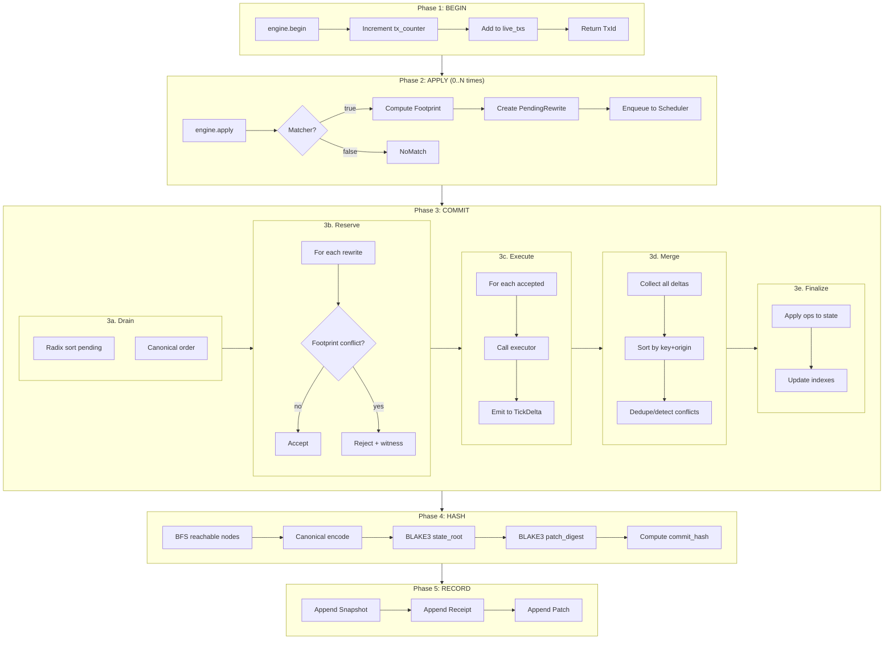

---

## 2. BOAW Parallel Execution Model

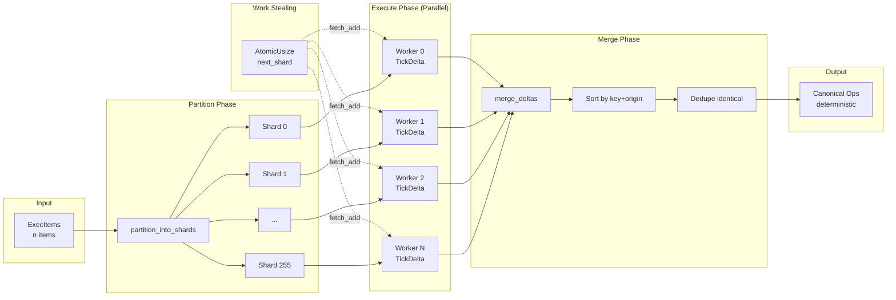

---

## 3. Virtual Shard Routing

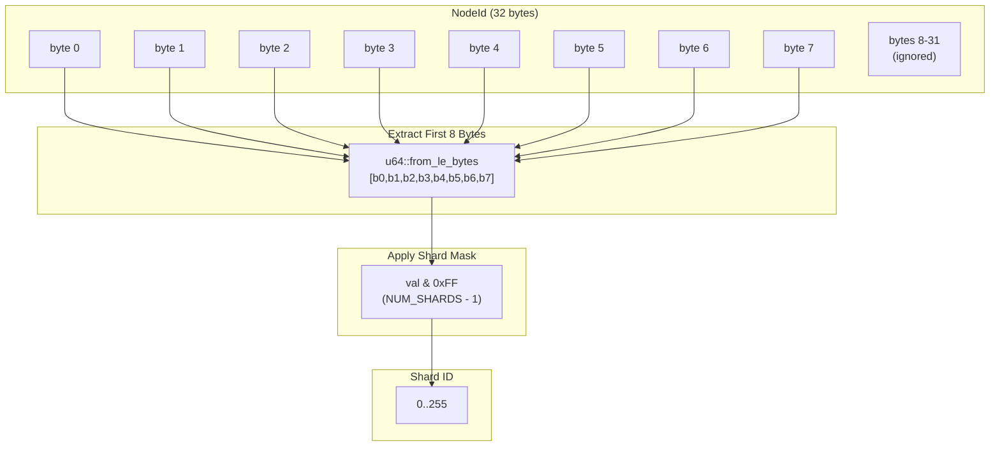

### Test Vectors (Frozen Protocol)

| Input (first 8 bytes) | LE u64               | Shard      |
| --------------------- | -------------------- | ---------- |
| `0xDEADBEEFCAFEBABE`  | `0xBEBAFECAEFBEADDE` | 190 (0xBE) |
| `0x0000000000000000`  | `0x0000000000000000` | 0          |
| `0x2A00000000000000`  | `0x000000000000002A` | 42         |
| `0xFFFFFFFFFFFFFFFF`  | `0xFFFFFFFFFFFFFFFF` | 255        |

---

## 4. Two-Plane WARP Architecture

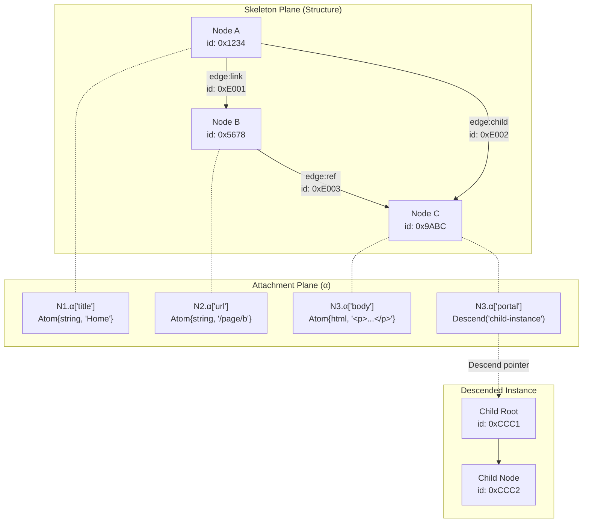

---

## 5. GraphView Contract Enforcement

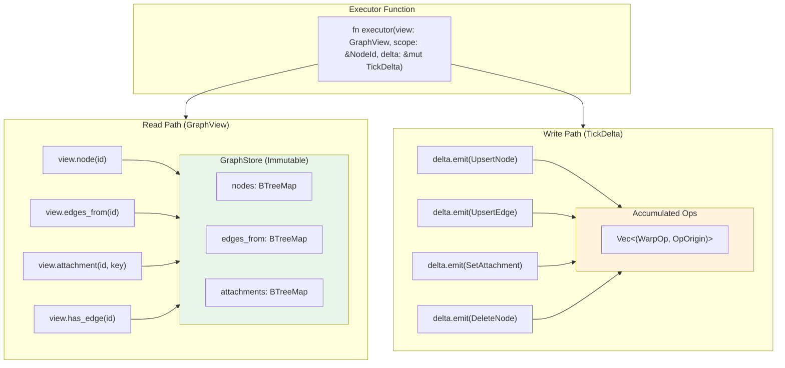

---

## 6. State Root Hash Computation

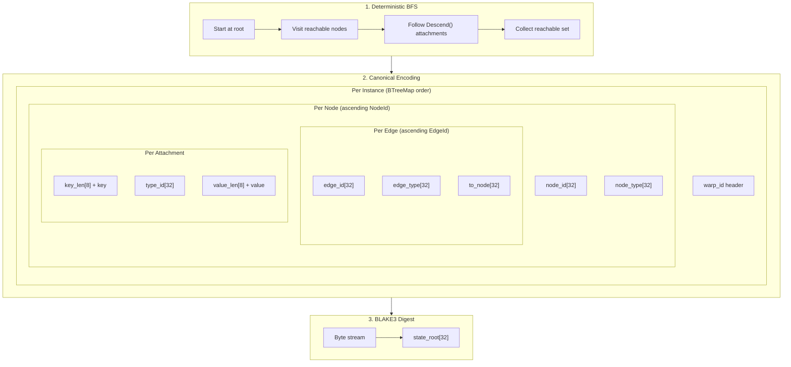

---

## 7. Commit Hash v2 Structure

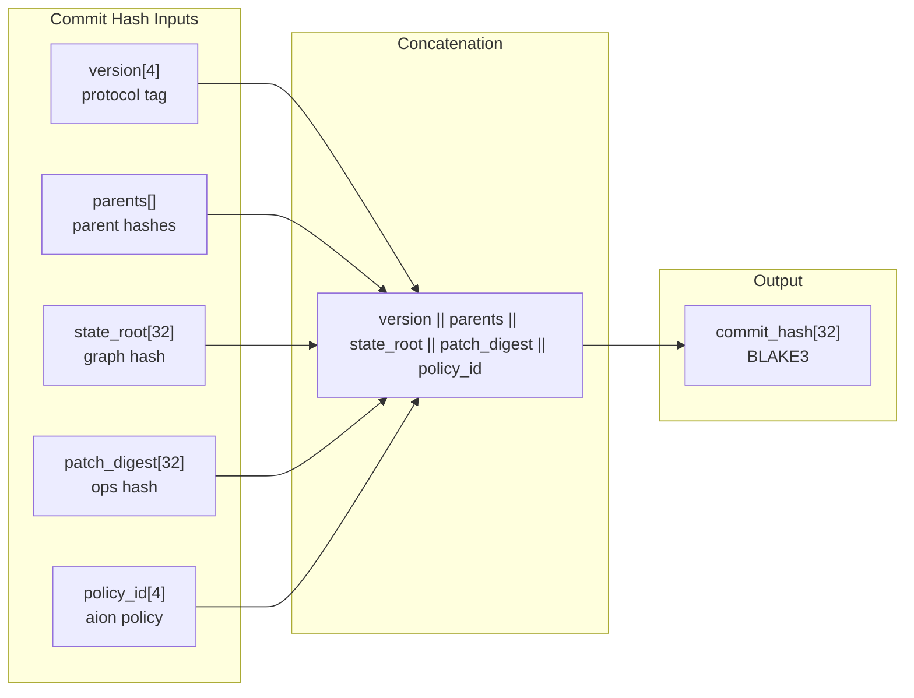

---

## 8. WSC Snapshot Format

```text
┌─────────────────────────────────────────────────────────────────────────┐
│                        WSC SNAPSHOT FILE                                 │
├─────────────────────────────────────────────────────────────────────────┤
│                                                                          │
│  ┌────────────────────────────────────────────────────────────────────┐ │
│  │ HEADER (fixed size)                                                 │ │
│  │ ┌──────────┬──────────┬──────────┬──────────┬──────────┐          │ │
│  │ │  magic   │ version  │ node_cnt │ edge_cnt │ offsets  │          │ │
│  │ │  8 bytes │ 8 bytes  │ 8 bytes  │ 8 bytes  │ 8×N bytes│          │ │
│  │ └──────────┴──────────┴──────────┴──────────┴──────────┘          │ │
│  └────────────────────────────────────────────────────────────────────┘ │
│                                                                          │
│  ┌────────────────────────────────────────────────────────────────────┐ │
│  │ NODES TABLE (sorted by NodeId, 8-byte aligned)                      │ │
│  │ ┌─────────────────┬─────────────────┬─────────────────┐            │ │
│  │ │    NodeRow      │    NodeRow      │    NodeRow      │  ...       │ │
│  │ │    64 bytes     │    64 bytes     │    64 bytes     │            │ │
│  │ │ [id:32][type:32]│ [id:32][type:32]│ [id:32][type:32]│            │ │
│  │ └─────────────────┴─────────────────┴─────────────────┘            │ │
│  └────────────────────────────────────────────────────────────────────┘ │
│                                                                          │
│  ┌────────────────────────────────────────────────────────────────────┐ │
│  │ EDGES TABLE (sorted by EdgeId, 8-byte aligned)                      │ │
│  │ ┌─────────────────────────┬─────────────────────────┐              │ │
│  │ │       EdgeRow           │       EdgeRow           │  ...         │ │
│  │ │       128 bytes         │       128 bytes         │              │ │
│  │ │[id:32][from:32][to:32]  │[id:32][from:32][to:32]  │              │ │
│  │ │[type:32]                │[type:32]                │              │ │
│  │ └─────────────────────────┴─────────────────────────┘              │ │
│  └────────────────────────────────────────────────────────────────────┘ │
│                                                                          │
│  ┌────────────────────────────────────────────────────────────────────┐ │
│  │ OUT_INDEX (per-node ranges into out_edges)                          │ │
│  │ ┌──────────────┬──────────────┬──────────────┐                     │ │
│  │ │    Range     │    Range     │    Range     │  ...                │ │
│  │ │   16 bytes   │   16 bytes   │   16 bytes   │                     │ │
│  │ │[start:8][len:8]│[start:8][len:8]│[start:8][len:8]│                │ │
│  │ └──────────────┴──────────────┴──────────────┘                     │ │
│  └────────────────────────────────────────────────────────────────────┘ │
│                                                                          │
│  ┌────────────────────────────────────────────────────────────────────┐ │
│  │ ATTACHMENT INDEX (per-slot ranges)                                  │ │
│  │ Similar structure to OUT_INDEX                                      │ │
│  └────────────────────────────────────────────────────────────────────┘ │
│                                                                          │
│  ┌────────────────────────────────────────────────────────────────────┐ │
│  │ BLOB ARENA (variable-length payloads)                               │ │
│  │ ┌─────────────────────────────────────────────────────────────┐    │ │
│  │ │ [payload bytes...] [payload bytes...] [payload bytes...] ...│    │ │
│  │ └─────────────────────────────────────────────────────────────┘    │ │
│  │ Referenced by (offset: u64, length: u64) tuples                     │ │
│  └────────────────────────────────────────────────────────────────────┘ │
│                                                                          │
└─────────────────────────────────────────────────────────────────────────┘
```

---

## 9. Footprint Independence Check

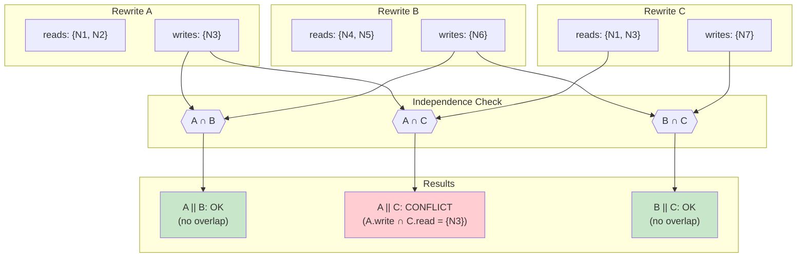

---

## 9b. FootprintGuard Enforcement Flow

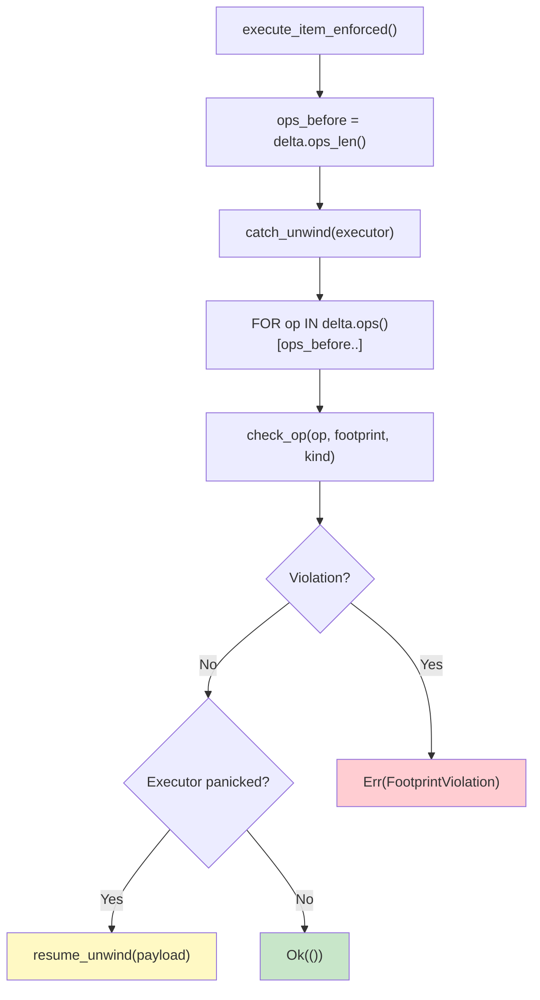

**Key:** When footprint enforcement is active (`cfg(debug_assertions)` or
`footprint_enforce_release` feature), every `ExecItem` execution is wrapped
by `execute_item_enforced()`. The guard validates all newly-emitted ops
against the declared footprint. Write violations take precedence over
executor panics—ensuring the developer always sees the root cause.

---

## 10. Complete Data Flow: Intent to Render

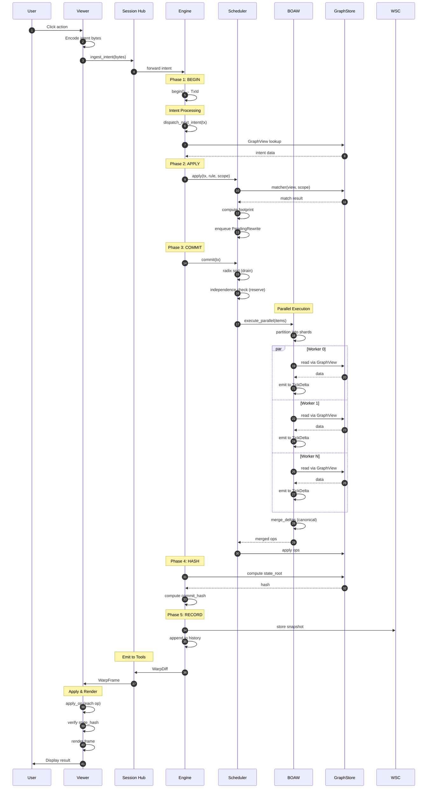

---

## 11. Viewer Event Loop

```mermaid
flowchart TD
    subgraph FRAME["Frame Loop"]
        START[frame start]

        subgraph DRAIN["1. Drain Session"]
            DN[drain_notifications]
            DF[drain_frames]
        end

        subgraph PROCESS["2. Process Frames"]
            PF[process_frames]
            SNAP{Snapshot?}
            DIFF{Diff?}
            APPLY[apply_op each]
            VERIFY[verify hash]
        end

        subgraph EVENTS["3. Handle Events"]
            UE[apply_ui_event]
            REDUCE[reduce pure]
            EFFECTS[run effects]
        end

        subgraph RENDER["4. Render"]
            MATCH{screen?}
            TITLE[draw_title]
            VIEW[draw_view]
            HUD[draw_hud]
        end

        END[frame end]

        START --> DRAIN
        DN --> DF
        DF --> PROCESS
        PF --> SNAP
        SNAP -->|yes| APPLY
        PF --> DIFF
        DIFF -->|yes| APPLY
        APPLY --> VERIFY
        VERIFY --> EVENTS
        UE --> REDUCE
        REDUCE --> EFFECTS
        EFFECTS --> RENDER
        MATCH -->|Title| TITLE
        MATCH -->|View| VIEW
        VIEW --> HUD
        TITLE --> END
        HUD --> END
    end
```

---

_Visual Atlas generated 2026-01-18. Use alongside "What Makes Echo Tick?" for complete understanding._
