<!-- SPDX-License-Identifier: Apache-2.0 OR LicenseRef-MIND-UCAL-1.0 -->
<!-- © James Ross Ω FLYING•ROBOTS <https://github.com/flyingrobots> -->

# Echo: End-to-End Technical Teardown

## Table of Contents

- [Who This Document Is For](#who-this-document-is-for)
- [Glossary: Domain Dictionary](#glossary-domain-dictionary)
- [High-Level Mental Model](#high-level-mental-model)
- [System Mind Map](#system-mind-map)
- [1. Entry Point](#1-entry-point)
    - [`main.rs`: command parsing and dispatch](#mainrs-command-parsing-and-dispatch)
- [2. Bootstrapping vs. Runtime](#2-bootstrapping-vs-runtime)
    - [Bootstrap](#bootstrap)
    - [Runtime](#runtime)
- [3. Golden Path: `verify`](#3-golden-path-verify)
- [4. Golden Path: `inspect`](#4-golden-path-inspect)
- [5. Golden Path: WAL diagnostics (`doctor`, `submission-posture`)](#5-golden-path-wal-diagnostics-doctor-submission-posture)
- [6. Golden Path: Bench harness](#6-golden-path-bench-harness)
- [7. Golden Path: Core Engine Execution](#7-golden-path-core-engine-execution)
- [8. Data Structures and Payload Anatomy](#8-data-structures-and-payload-anatomy)
- [9. Source of Truth Map](#9-source-of-truth-map)
- [10. Concurrency and Asynchronous Flows](#10-concurrency-and-asynchronous-flows)
- [11. Error Surfaces and Unhappy Paths](#11-error-surfaces-and-unhappy-paths)
- [12. External Boundaries and Trust Model](#12-external-boundaries-and-trust-model)
- [13. Configuration and Tuning](#13-configuration-and-tuning)
- [14. Security and Lifecycle of Authorization Signals](#14-security-and-lifecycle-of-authorization-signals)
- [15. Architectural Decisions and Trade-offs](#15-architectural-decisions-and-trade-offs)
- [16. Timeline of a Commit](#16-timeline-of-a-commit)
- [16.1 Project Progress and Future Use Cases](#161-project-progress-and-future-use-cases)
- [16.2 Core-CLI Coupling and Service Migration Path](#162-core-cli-coupling-and-service-migration-path)
- [16.3 Design Critiques: Assumptions and Risk Hotspots](#163-design-critiques-assumptions-and-risk-hotspots)
- [16.4 Typed Pseudo-Definitions for Core Runtime Types](#164-typed-pseudo-definitions-for-core-runtime-types)
- [17. Deep Dives: Technical Feats and Trade-Offs](#17-deep-dives-technical-feats-and-trade-offs)
    - [17.6 Echo Tick: From GraphQL to BTR](#176-echo-tick-from-graphql-to-btr)
    - [17.7 Forks, Strands, and Braids](#177-forks-strands-and-braids)
    - [17.8 File Materialization and Ingest](#178-file-materialization-and-ingest)
- [18. Entity-Relationship View](#18-entity-relationship-view)
- [Appendix A: Type-Intent to Data Layout Mapping](#appendix-a-type-intent-to-data-layout-mapping)
- [Appendix B: Reference Command Paths](#appendix-b-reference-command-paths)
- [Appendix C: Pseudo Type Definitions](#appendix-c-pseudo-type-definitions)

## System Mind Map

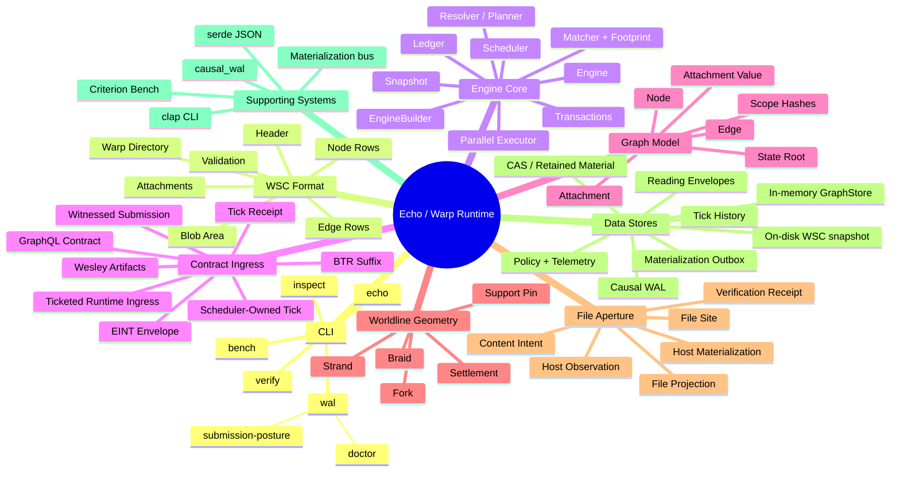
```mermaid
mindmap
  root((Echo / Warp Runtime))
    CLI
      echo
      verify
      inspect
      wal
        doctor
        submission-posture
      bench
    WSC Format
      Header
      Warp Directory
      Node Rows
      Edge Rows
      Attachments
      Blob Area
      Validation
    Engine Core
      EngineBuilder
      Engine
      Transactions
      Scheduler
      Matcher + Footprint
      Resolver / Planner
      Parallel Executor
      Snapshot
      Ledger
    Contract Ingress
      GraphQL Contract
      Wesley Artifacts
      EINT Envelope
      Witnessed Submission
      Ticketed Runtime Ingress
      Scheduler-Owned Tick
      Tick Receipt
      BTR Suffix
    Graph Model
      Node
      Edge
      Attachment
      Attachment Value
      Scope Hashes
      State Root
    Worldline Geometry
      Fork
      Strand
      Support Pin
      Braid
      Settlement
    File Aperture
      Host Observation
      File Site
      File Projection
      Content Intent
      Host Materialization
      Verification Receipt
    Data Stores
      On-disk WSC snapshot
      In-memory GraphStore
      Causal WAL
      CAS / Retained Material
      Tick History
      Reading Envelopes
      Materialization Outbox
      Policy + Telemetry
    Supporting Systems
      clap CLI
      serde JSON
      Criterion Bench
      causal_wal
      Materialization bus
```

## Who This Document Is For

This teardown is written for a reader who has not seen this codebase before. It starts at the point where the executable actually starts and progressively uncovers concepts as they become necessary.

## Glossary: Domain Dictionary

| Term                          | Definition                                                                                                                 | Why it matters                                                                  |
| ----------------------------- | -------------------------------------------------------------------------------------------------------------------------- | ------------------------------------------------------------------------------- |
| WSC (Warp Snapshot Container) | Binary snapshot format storing one or more _warps_ (stateful graph partitions) with nodes, edges, and attachments.         | It is the transport and persistence substrate for the runtime’s canonical data. |
| Warp                          | A deterministic unit of graph state used by the execution model.                                                           | It sets the boundary for hash computation, validation, and execution traversal. |
| Node                          | A vertex in the graph. In runtime terms, nodes are the state-bearing objects that rules read from and mutate.              | Core object that gets read and mutated by rules.                                |
| Edge                          | A directed relation between nodes (for example parent/child, dependency, or domain-specific arcs).                         | Encodes topology and traversal semantics.                                       |
| Attachment                    | Binary metadata associated with nodes or edges; often a typed payload.                                                     | Captures payload-bearing semantics without changing the row shape.              |
| Blob                          | Raw binary payload storage referenced by attachments.                                                                      | Separates large payload bytes from structured row tables via offsets/lengths.   |
| Engine                        | The execution engine that accepts intents, schedules rewrites, applies rules, updates graph state, and produces snapshots. | The authoritative coordinator for deterministic execution.                      |
| Intent                        | A unit of requested work submitted into a transaction.                                                                     | Source object that becomes pending rewrites in a transaction.                   |
| Tick                          | A unit-of-progress marker in state evolution.                                                                              | Enables historical progression and snapshot indexing.                           |
| Tick Receipt                  | The engine artifact that says whether a transaction committed cleanly, plus conflict details.                              | Exposes acceptance/rejection and blocker details for diagnostics.               |
| Ledger                        | Sequence of execution history entries recording root state progression.                                                    | Provides auditability and time-travel context.                                  |
| Scope Hash                    | A digest derived from rule inputs/metadata used during conflict planning.                                                  | Helps arbitration and conflict checks remain deterministic.                     |
| Ingestion (`ingest_intent`)   | Canonicalized intake path for incoming intents into runtime graph form.                                                    | Enforces idempotent behavior and graph materialization of submissions.          |
| GraphQL Contract              | Authored application schema that names domain types, operations, and footprint claims before Wesley compiles them.         | Keeps application nouns above the Echo runtime kernel.                          |
| Wesley                        | Contract compiler/generator that emits helpers, codecs, registry metadata, and ABI-facing artifacts from authored schemas. | Bridges authored domain semantics into Echo's generic runtime boundary.         |
| EINT                          | Canonical Echo intent envelope used at ABI/runtime ingress.                                                                | Gives submitted operation bytes stable structure before scheduler admission.    |
| BTR                           | Boundary Transition Record: a contiguous provenance segment with input/output boundary hashes and validated entries.       | Packages a witnessed suffix for validation, replay, or causal exchange.         |
| Fork                          | A copied worldline prefix at a precise tick, usually used to create a speculative child lane.                              | Gives time-travel and counterfactual work an exact causal basis.                |
| Strand                        | A named relation over a child worldline derived from a source lane at a fork basis.                                        | Makes speculative work inspectable instead of anonymous branch state.           |
| Braid                         | Read-only plural geometry over one observed lane plus support-pinned lanes.                                                | Lets observation include multiple exact coordinates without settlement.         |
| File Aperture                 | Echo-owned contract for observing host file bytes, admitting drift, and materializing lawful writes.                       | Prevents apps from maintaining a shadow causal history for files.               |
| Dispatcher / Scheduler        | Internal subsystem managing pending transactions, intents, and queued rewrite commands.                                    | Controls ordering and fairness of execution work.                               |
| Parallel Work Unit            | Chunk of deterministic rewrite operations split across worker shards.                                                      | Supports throughput scaling while preserving deterministic merge semantics.     |

## High-Level Mental Model

Echo is split into two cooperating layers:

1. A command-line interface layer (`warp-cli`) that lets you validate, inspect, and benchmark artifacts.
2. A runtime core (`warp-core`) that owns state representation, scheduling, deterministic execution, and snapshot/hash logic.

The CLI is largely a thin orchestration layer: it reads inputs, invokes validation or runtime helpers, then formats output (text or JSON). The heavy technical behavior sits in the core modules.

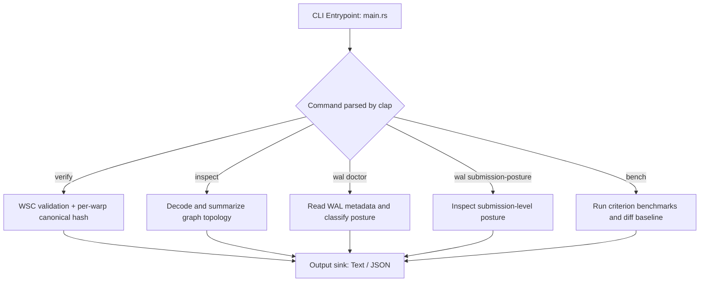
```mermaid
flowchart TD
  A[CLI Entrypoint: main.rs] --> B{Command parsed by clap}
  B -->|verify| C[WSC validation + per-warp canonical hash]
  B -->|inspect| D[Decode and summarize graph topology]
  B -->|wal doctor| E[Read WAL metadata and classify posture]
  B -->|wal submission-posture| F[Inspect submission-level posture]
  B -->|bench| G[Run criterion benchmarks and diff baseline]
  C --> H[Output sink: Text / JSON]
  D --> H
  E --> H
  F --> H
  G --> H
```

## 1. Entry Point

### `main.rs`: command parsing and dispatch

The true startup boundary is the CLI executable entrypoint in [`crates/warp-cli/src/main.rs`](../crates/warp-cli/src/main.rs).

At startup:

- The process executes `main()`.
- It uses generated Clap definitions from [`crates/warp-cli/src/cli.rs`](../crates/warp-cli/src/cli.rs) to parse subcommands and options.
- A structured output mode is selected (`text` or `json`), then control transfers to the command implementation (`verify`, `inspect`, `wal`, or `bench`).

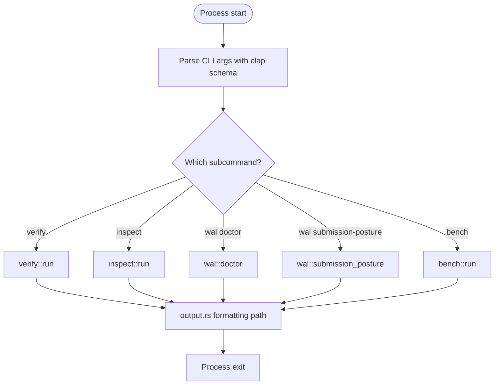
```mermaid
flowchart TD
  Start([Process start]) --> ParseCLI[Parse CLI args with clap schema]
  ParseCLI --> Route{"Which subcommand?"}
  Route -->|verify| VerifyRun[verify::run]
  Route -->|inspect| InspectRun[inspect::run]
  Route -->|wal doctor| WalDoctor[wal::doctor]
  Route -->|wal submission-posture| WalPosture[wal::submission_posture]
  Route -->|bench| BenchCmd[bench::run]
  VerifyRun --> Output[output.rs formatting path]
  InspectRun --> Output
  WalDoctor --> Output
  WalPosture --> Output
  BenchCmd --> Output
  Output --> Exit[Process exit]
```

## 2. Bootstrapping vs Runtime

### Bootstrap

Bootstrap is the part where the system builds execution scaffolding before handling domain data:

- Clap schema is instantiated and validated.
- For commands that touch snapshots, loader and validator objects are initialized.
- For benchmarking, command options are translated into a cargo bench invocation.
- For runtime execution paths, the engine builds internal structures (e.g., scheduler, materialization bus, policy state), then becomes ready for transactions.

### Runtime

Runtime is the phase where concrete data moves through business logic:

- CLI command reads user-selected artifacts (WSC files or submission IDs).
- Parsing/validation or execution logic runs.
- Output is serialized and emitted.

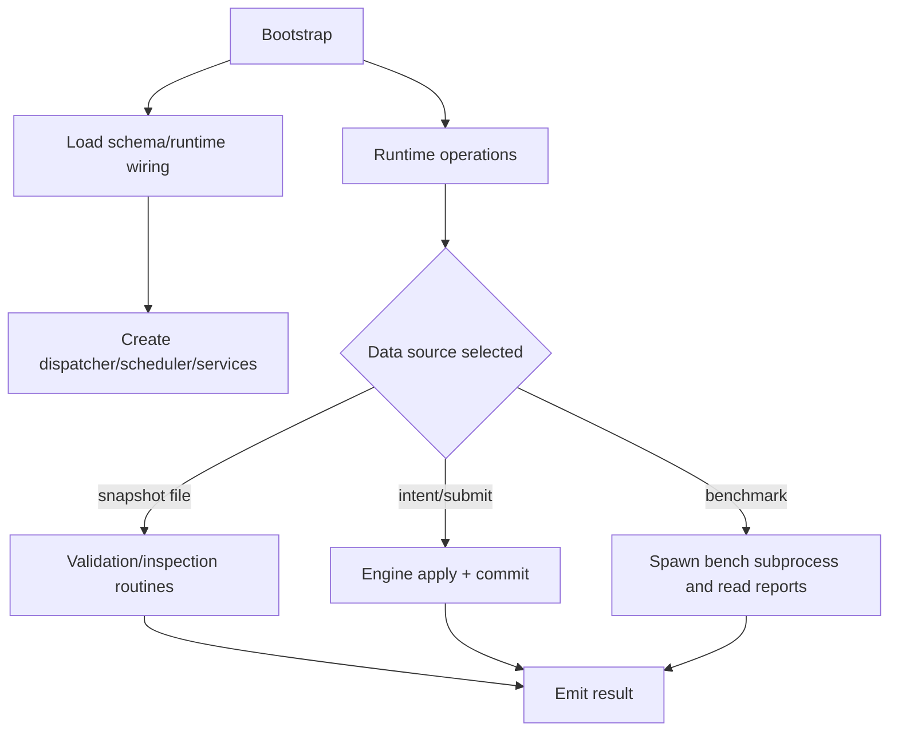
```mermaid
flowchart TD
  A[Bootstrap] --> A1[Load schema/runtime wiring]
  A1 --> A2[Create dispatcher/scheduler/services]
  A --> B[Runtime operations]
  B --> B1{Data source selected}
  B1 -->|snapshot file| B2[Validation/inspection routines]
  B1 -->|intent/submit| B3[Engine apply + commit]
  B1 -->|benchmark| B4[Spawn bench subprocess and read reports]
  B2 --> C[Emit result]
  B3 --> C
  B4 --> C
```

## 3. Golden Path: `verify`

`verify` is an integrity pipeline.

- It opens a snapshot via `WscFile::open`.
- It validates the layout and invariants.
- It reconstructs in-memory graph state per warp.
- It computes canonical state hashes.
- Optionally compares observed hash against an expected hash.
- It emits either human-readable or JSON result records.

The canonical hash path is where domain correctness is strongest: if traversal and encoding are deterministic, two identical states produce identical hashes; if not, corruption is signaled deterministically.

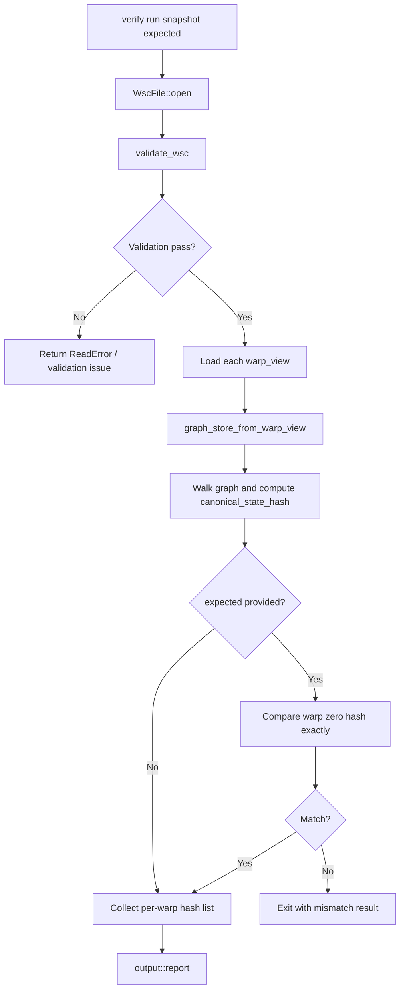
```mermaid
flowchart TD
  V1["verify run snapshot expected"] --> V2["WscFile::open"]
  V2 --> V3[validate_wsc]
  V3 --> V4{Validation pass?}
  V4 -->|No| V4Err[Return ReadError / validation issue]
  V4 -->|Yes| V5[Load each warp_view]
  V5 --> V6[graph_store_from_warp_view]
  V6 --> V7[Walk graph and compute canonical_state_hash]
  V7 --> V8{expected provided?}
  V8 -->|No| V8a[Collect per-warp hash list]
  V8 -->|Yes| V9[Compare warp zero hash exactly]
  V9 --> V10{Match?}
  V10 -->|No| V10Err[Exit with mismatch result]
  V10 -->|Yes| V8a
  V8a --> V11[output::report]
```

### Why this path matters

- Guarantees structural correctness without applying any mutation.
- Separates structural validation from semantic/hash consistency.
- Makes expected hash comparison a quick checkpoint for reproducibility and CI checks.

## 4. Golden Path: `inspect`

`inspect` is the explorer path.

- Open and validate a WSC snapshot.
- Gather per-snapshot metadata (`tick`, schema hash, warp count).
- For each warp, gather node/edge counts and type/class breakdowns.
- Render optional graph tree via depth-limited DFS.
- Optionally decode payloads into human-readable motion payloads; otherwise keep raw hex.

Payload decoding has two modes:

- Known payload type: decode via domain decoder.
- Unknown or malformed payload: fall back to hex string and surface warnings.

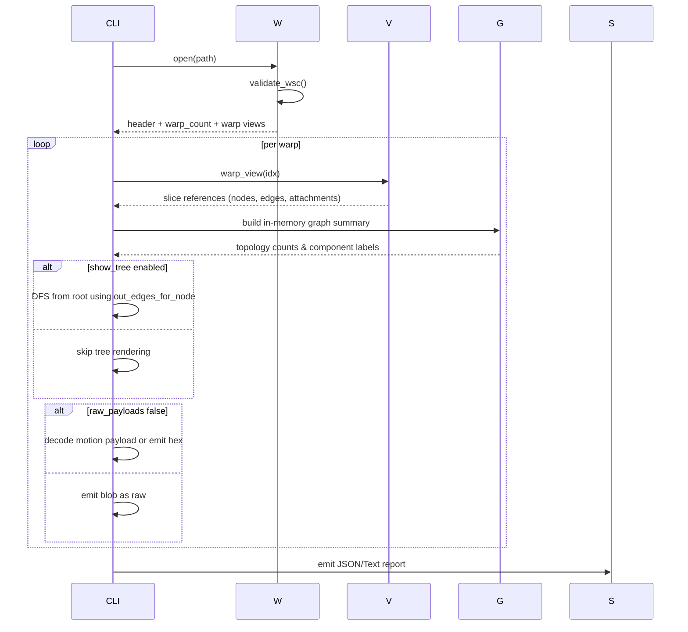
```mermaid
sequenceDiagram
  participant CLI
  participant W
  participant V
  participant G
  participant S

  CLI->>W: open(path)
  W->>W: validate_wsc()
  W-->>CLI: header + warp_count + warp views
  loop per warp
    CLI->>V: warp_view(idx)
    V-->>CLI: slice references (nodes, edges, attachments)
    CLI->>G: build in-memory graph summary
    G-->>CLI: topology counts & component labels
    alt show_tree enabled
      CLI->>CLI: DFS from root using out_edges_for_node
    else
      CLI->>CLI: skip tree rendering
    end
    alt raw_payloads false
      CLI->>CLI: decode motion payload or emit hex
    else
      CLI->>CLI: emit blob as raw
    end
  end
  CLI->>S: emit JSON/Text report
```

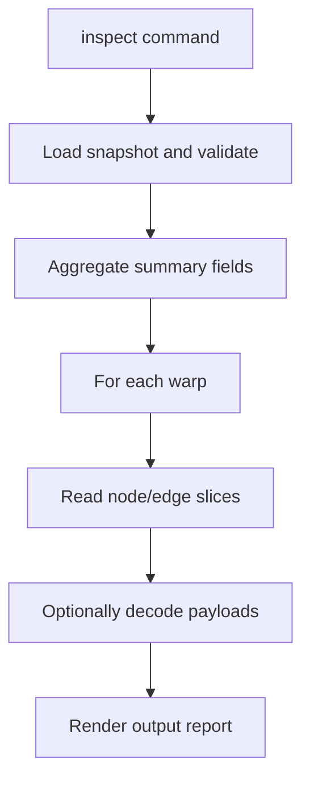
```mermaid
flowchart TD
  I1[inspect command] --> I2[Load snapshot and validate]
  I2 --> I3[Aggregate summary fields]
  I3 --> I4[For each warp]
  I4 --> I5[Read node/edge slices]
  I5 --> I6[Optionally decode payloads]
  I6 --> I7[Render output report]
```

## 5. Golden Path: WAL diagnostics (`doctor`, `submission-posture`)

WAL tools are operational observability surfaces.

- `wal doctor` resolves causal WAL postures for a root and maps status into labels.
- `wal submission-posture` resolves posture of a specific submission within a root.
- Inputs are normalized (e.g., hex-formatted IDs to canonical bytes), then delegated to causal-wal APIs.

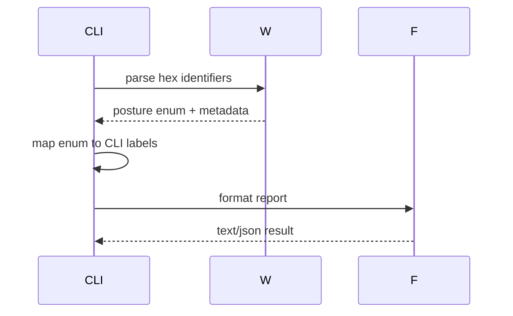
```mermaid
sequenceDiagram
  participant CLI
  participant W
  participant F

  CLI->>W: parse hex identifiers
  W-->>CLI: posture enum + metadata
  CLI->>CLI: map enum to CLI labels
  CLI->>F: format report
  F-->>CLI: text/json result
```

## 6. Golden Path: Bench harness

`bench` is a reporting command, not a correctness check.

- It builds command `cargo bench -p warp-benches` with optional regex filter and executes it.
- It scans `target/criterion/**/new/estimates.json`.
- If a baseline file is configured, it reads baseline, computes deltas, and renders absolute difference markers.

The parser expects benchmark estimator JSON shape (mean/median/stddev in nanoseconds), converts to a normalized record, and sorts for stable output.

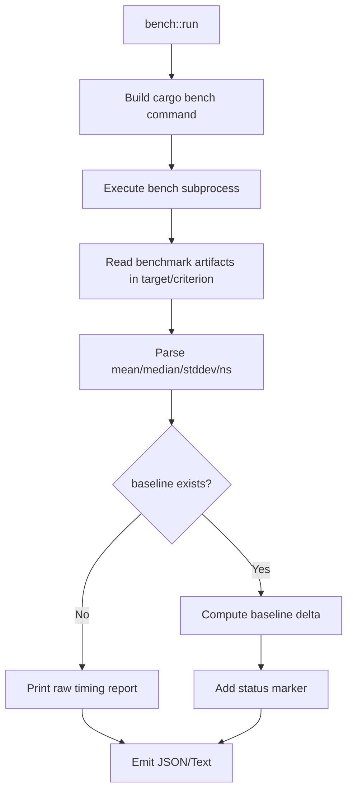
```mermaid
flowchart TD
  B1[bench::run] --> B2[Build cargo bench command]
  B2 --> B3[Execute bench subprocess]
  B3 --> B4[Read benchmark artifacts in target/criterion]
  B4 --> B5[Parse mean/median/stddev/ns]
  B5 --> B6{baseline exists?}
  B6 -->|No| B7[Print raw timing report]
  B6 -->|Yes| B8[Compute baseline delta]
  B8 --> B9[Add status marker]
  B7 --> B10[Emit JSON/Text]
  B9 --> B10
```

## 7. Golden Path: Core Engine Execution

This is the most important technical path for understanding architecture.

### Transaction lifecycle

- A new transaction starts with `begin()`.
- Intents are submitted via apply paths.
- Pending work is tracked in scheduler and matched to command handlers.
- On commit, scheduler plans are reserved, conflicts are checked, and rewrites executed in deterministic batches.
- Patches and snapshots are produced, then state + history are advanced.
- Abort clears transaction context and scheduled outputs.

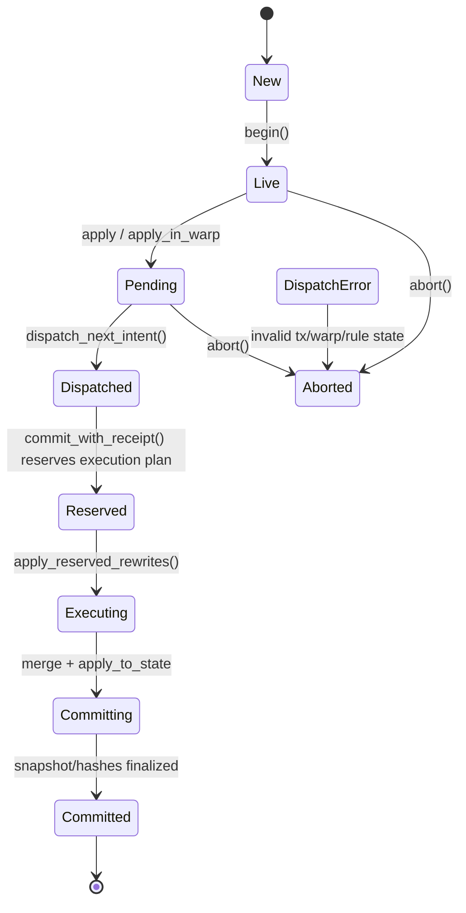
```mermaid
stateDiagram-v2
  [*] --> New
  New --> Live : begin()
  Live --> Pending : apply / apply_in_warp
  Pending --> Dispatched : dispatch_next_intent()
  Dispatched --> Reserved : commit_with_receipt() reserves execution plan
  Reserved --> Executing : apply_reserved_rewrites()
  Executing --> Committing : merge + apply_to_state
  Committing --> Committed : snapshot/hashes finalized
  Committed --> [*]
  Live --> Aborted : abort()
  Pending --> Aborted : abort()
  DispatchError --> Aborted : invalid tx/warp/rule state
```

### Canonical workflow details

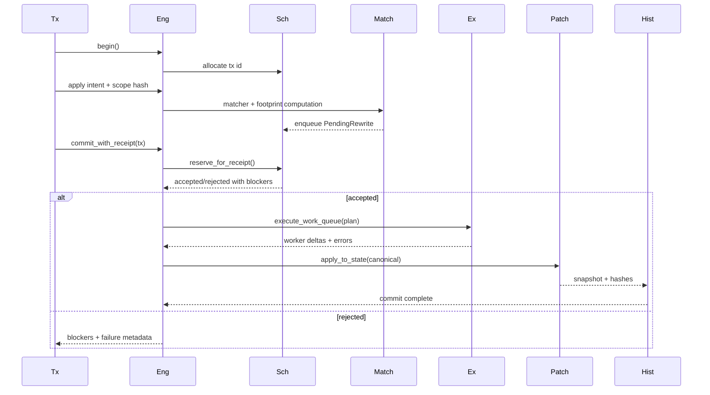
```mermaid
sequenceDiagram
  participant Tx
  participant Eng
  participant Sch
  participant Match
  participant Ex
  participant Patch
  participant Hist

  Tx->>Eng: begin()
  Eng->>Sch: allocate tx id
  Tx->>Eng: apply intent + scope hash
  Eng->>Match: matcher + footprint computation
  Match-->>Sch: enqueue PendingRewrite
  Tx->>Eng: commit_with_receipt(tx)
  Eng->>Sch: reserve_for_receipt()
  Sch-->>Eng: accepted/rejected with blockers
  alt accepted
    Eng->>Ex: execute_work_queue(plan)
    Ex-->>Eng: worker deltas + errors
    Eng->>Patch: apply_to_state(canonical)
    Patch-->>Hist: snapshot + hashes
    Hist-->>Eng: commit complete
  else rejected
    Eng-->>Tx: blockers + failure metadata
  end
```

### Ingestion details (`ingest_intent`)

Intents are canonicalized before becoming writable graph events:

- Payload bytes are hashed to produce `intent_id`.
- Inbox nodes and edges are created idempotently.
- Attachments and pending edges establish the event as first-class graph elements.

This design means duplicate submissions map to deterministic identities, simplifying replay/diagnostics.

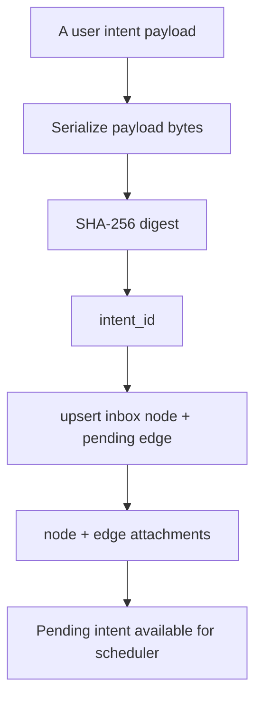
```mermaid
flowchart TD
  I[A user intent payload] --> B[Serialize payload bytes]
  B --> C[SHA-256 digest]
  C --> D[intent_id]
  D --> E[upsert inbox node + pending edge]
  E --> F[node + edge attachments]
  F --> G[Pending intent available for scheduler]
```

### Merge and determinism guarantees

- Work is sharded to 256 lanes (`NUM_SHARDS = 256`).
- Per-shard partitioning uses a stable route from `NodeId` bytes.
- Parallel results are merged in strict canonical order with conflict checks for overlapping writes.

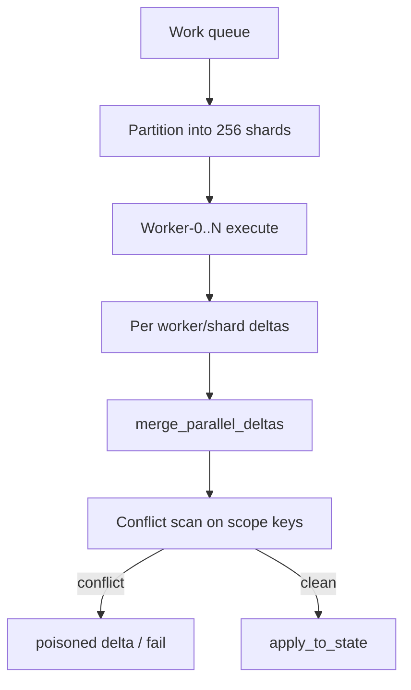
```mermaid
flowchart TD
  WQ[Work queue] --> SH[Partition into 256 shards]
  SH --> P1[Worker-0..N execute]
  P1 --> M1[Per worker/shard deltas]
  M1 --> RED[merge_parallel_deltas]
  RED --> C1[Conflict scan on scope keys]
  C1 -->|conflict| ERR[poisoned delta / fail]
  C1 -->|clean| APPLY[apply_to_state]
```

## 8. Data Structures and Payload Anatomy

### WSC high-level payload structure

At the file level the structure can be expressed as:

```json
{
    "header": {
        "magic": "u32",
        "version": "u16",
        "flags": "u16",
        "warp_count": "u32",
        "tick": "u64",
        "schema_hash": "[u8; 32]"
    },
    "warp_dir": [
        {
            "warp_index": "u32",
            "node_range": { "start": "u32", "count": "u32" },
            "edge_range": { "start": "u32", "count": "u32" },
            "attachment_range": { "start": "u32", "count": "u32" }
        }
    ],
    "nodes": [
        {
            "id": "[u8; 8]",
            "node_type": "u8",
            "next_offset": "u64",
            "reserved": "[u8; 7]",
            "attachment_count": "u32",
            "payload_offset": "u32",
            "payload_len": "u32"
        }
    ],
    "edges": [
        {
            "id": "[u8; 8]",
            "to": "[u8; 8]",
            "edge_type": "u8",
            "reserved": "[u8; 7]",
            "attachment_count": "u32",
            "next_offset": "u64",
            "payload_offset": "u32",
            "payload_len": "u32"
        }
    ],
    "attachments": [
        {
            "tag": "u8",
            "ref_type": "u8",
            "ref_index": "u32",
            "blob_offset": "u64",
            "blob_len": "u64"
        }
    ],
    "blobs": "[u8]"
}
```

This is intentionally simplified to keep shape understandable; actual validation includes strict range checks and byte alignment constraints.

### In-memory runtime graph (`GraphStore`)

In runtime, core state is normalized into maps for deterministic traversal:

- `nodes_by_id`
- `out_edges`
- `reverse_in_edges`
- `attachments_by_node`, `attachments_by_edge`

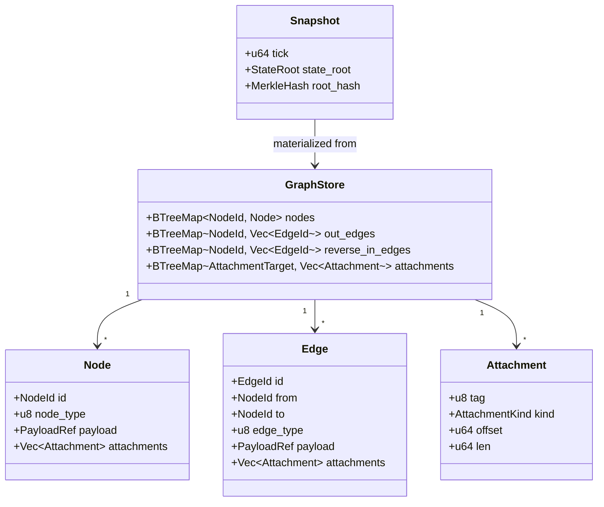
```mermaid
classDiagram
  class GraphStore {
    +BTreeMap~NodeId, Node~ nodes
    +BTreeMap~NodeId, Vec~EdgeId~~ out_edges
    +BTreeMap~NodeId, Vec~EdgeId~~ reverse_in_edges
    +BTreeMap~AttachmentTarget, Vec~Attachment~~ attachments
  }
  class Node {
    +NodeId id
    +u8 node_type
    +PayloadRef payload
    +Vec~Attachment~ attachments
  }
  class Edge {
    +EdgeId id
    +NodeId from
    +NodeId to
    +u8 edge_type
    +PayloadRef payload
    +Vec~Attachment~ attachments
  }
  class Attachment {
    +u8 tag
    +AttachmentKind kind
    +u64 offset
    +u64 len
  }
  class Snapshot {
    +u64 tick
    +StateRoot state_root
    +MerkleHash root_hash
  }
  GraphStore "1" --> "*" Node
  GraphStore "1" --> "*" Edge
  GraphStore "1" --> "*" Attachment
  Snapshot --> GraphStore : materialized from
```

### Canonical state hashing (simplified schema)

```json
{
    "snapshot_context": {
        "domain_tag": "0u8..",
        "root_key": "[u8; 32]",
        "tick": 0,
        "warp_count": 1
    },
    "state": {
        "nodes": ["ordered by NodeId"],
        "edges": ["ordered by source then EdgeId"],
        "attachments": ["typed payload encoding included"]
    }
}
```

Hashing order and encoding order are deliberate: deterministic ordering eliminates “equivalent but unordered” nondeterminism.

## 9. Source of Truth Map

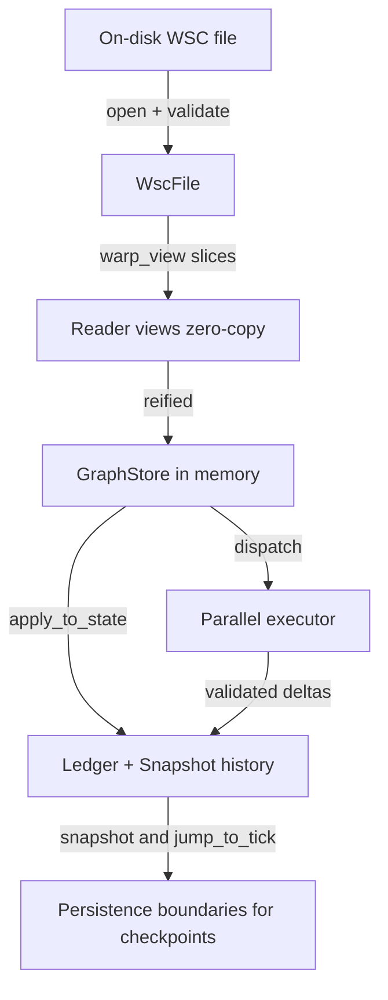
```mermaid
flowchart TD
  S1[On-disk WSC file] -->|open + validate| S2[WscFile]
  S2 -->|warp_view slices| S3[Reader views zero-copy]
  S3 -->|reified| S4[GraphStore in memory]
  S4 -->|apply_to_state| S5[Ledger + Snapshot history]
  S5 -->|snapshot and jump_to_tick| S6[Persistence boundaries for checkpoints]
  S4 -->|dispatch| S7[Parallel executor]
  S7 -->|validated deltas| S5
```

### Practical implications

- **On disk**: long-lived source of truth for transport/verification.
- **In memory**: fast execution working state.
- **Snapshot history**: auditability and time-travel checkpoints.
- **WAL (causal)**: externalized execution posture and submission diagnostics.

## 10. Concurrency and Asynchronous Flows

Execution uses explicit parallelization in the rewrite application phase.

- Parallelism is bounded by configurable worker count.
- Work is partitioned deterministically by shard, not by wall-clock load heuristics.
- Dynamic/static worker policies and accumulation strategies can be switched at policy boundaries.
- Determinism is preserved by canonical merge ordering and conflict checks.

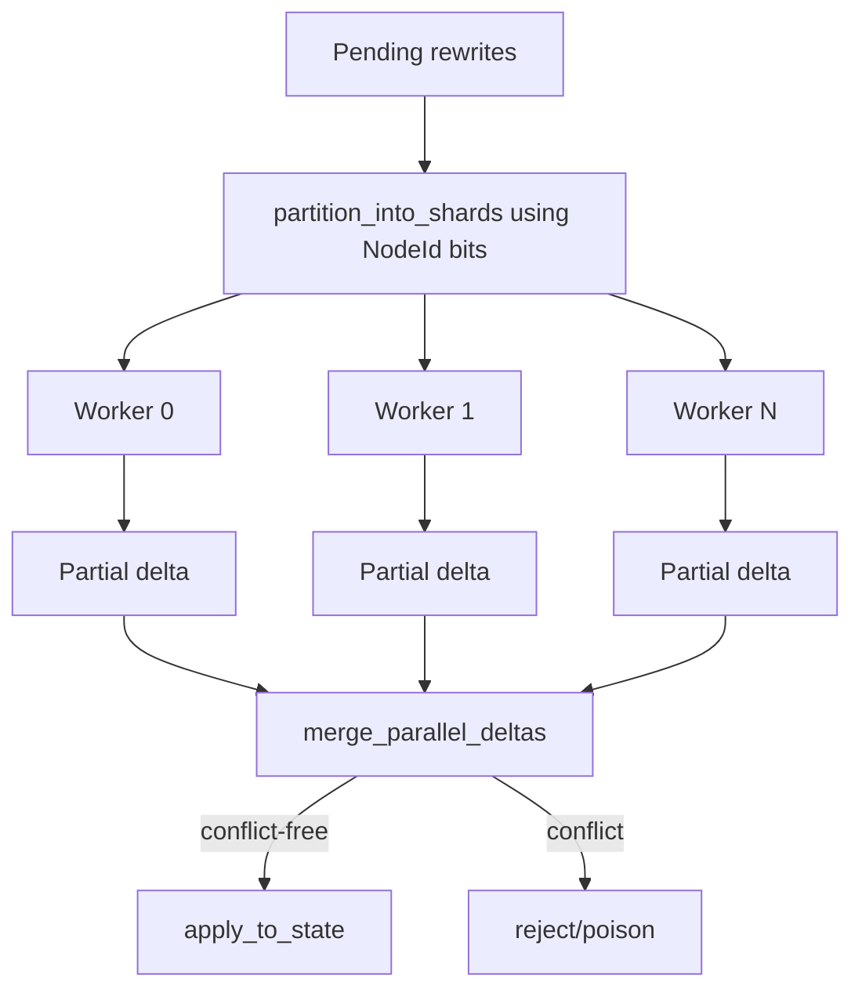
```mermaid
flowchart TD
  Q[Pending rewrites] --> SHARD[partition_into_shards using NodeId bits]
  SHARD --> W0[Worker 0]
  SHARD --> W1[Worker 1]
  SHARD --> WN[Worker N]
  W0 --> R0[Partial delta]
  W1 --> R1[Partial delta]
  WN --> RN[Partial delta]
  R0 --> MERGE[merge_parallel_deltas]
  R1 --> MERGE
  RN --> MERGE
  MERGE -->|conflict-free| APP[apply_to_state]
  MERGE -->|conflict| ERR[reject/poison]
```

### Why background workers exist

- Keep rule application from becoming single-threaded bottlenecks.
- Isolate expensive execution from I/O-bound command paths.
- Preserve reproducibility by making worker output order independent until final canonical merge.

## 11. Error Surfaces and Unhappy Paths

### Structural validation failures

- Invalid magic / wrong file version.
- Invalid section ranges or blob range overruns.
- Ordering violations in node/edge tables.
- Missing/wrong attachment tags and reserved bytes corruption.

### Data path failures

- Requested snapshot cannot be opened.
- Unknown payload decode failures.
- Missing attachment blob for expected reference.
- Baseline benchmark file missing / invalid JSON in benchmark path.

### Runtime conflicts

- Invalid transaction state for request.
- Rule not found or matcher misses.
- Footprint conflicts in `reserve_for_receipt` causing rejection.
- Merge conflicts/duplicate write keys causing poisoned delta errors.

### Failure propagation style

- Most paths return typed errors with context and then route through command-level rendering.
- Nonzero exit is used for verification and conflict-grade failures.
- Runtime conflict is explicitly surfaced in receipts instead of becoming silent state divergence.

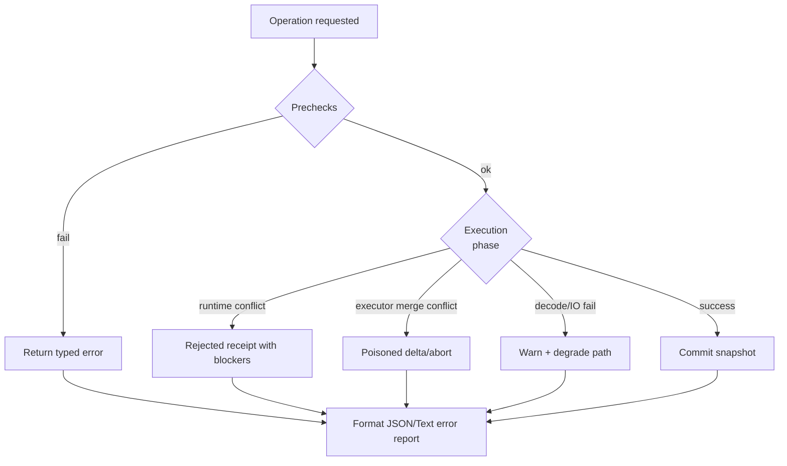
```mermaid
flowchart TD
  A[Operation requested] --> B{Prechecks}
  B -->|fail| E1[Return typed error]
  B -->|ok| C{Execution
phase}
  C -->|runtime conflict| E2[Rejected receipt with blockers]
  C -->|executor merge conflict| E3[Poisoned delta/abort]
  C -->|decode/IO fail| E4[Warn + degrade path]
  C -->|success| S[Commit snapshot]
  E1 --> OUT[Format JSON/Text error report]
  E2 --> OUT
  E3 --> OUT
  E4 --> OUT
  S --> OUT
```

## 12. External Boundaries and Trust Model

Trust boundaries are explicit:

1. **CLI boundary**: user inputs filenames, hash expectations, filters, and flags.
2. **Format boundary**: WSC parser/validator accepts only structurally valid byte layout.
3. **Runtime boundary**: only validated intents and sanctioned rule execution mutate state.
4. **Observability boundary**: benches and WAL commands provide telemetry but do not alter runtime behavior.

No external identity providers are handled here. “Auth-like” trust is implemented through deterministic data identity (e.g., intent hash) and validation gates before graph mutation.

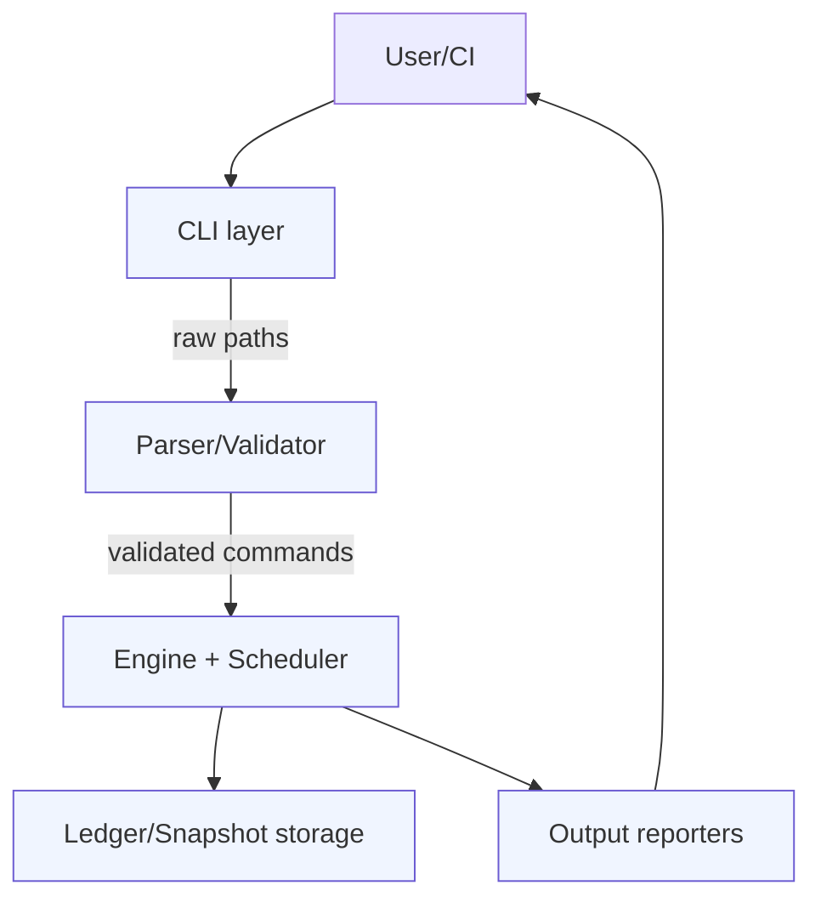
```mermaid
flowchart TD
  U[User/CI]
  C[CLI layer]
  P[Parser/Validator]
  K[Engine + Scheduler]
  L[Ledger/Snapshot storage]
  O[Output reporters]

  U --> C
  C -->|raw paths| P
  P -->|validated commands| K
  K --> L
  K --> O
  O --> U
  classDef boundary fill:#f0f5ff,stroke:#6b5bd2,stroke-width:1px
  class C,P,K,L,O boundary
```

## 13. Configuration and Tuning

The runtime uses explicit environmental tuning knobs to control scale behavior:

- `ECHO_WORKERS`: preferred worker count for parallel execution if set and parseable.
- If unset or invalid, default falls back to `available_parallelism().min(NUM_SHARDS)`.

This is a classic throughput/latency trade-off boundary:

- Higher worker count increases parallel execution potential.
- Too high workers on small workloads can increase scheduling overhead.

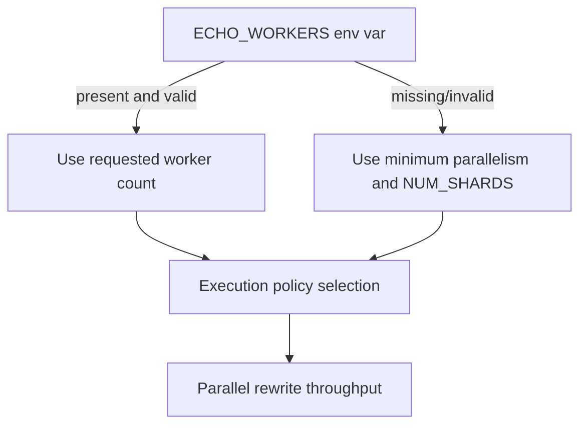
```mermaid
flowchart TD
  CFG[ECHO_WORKERS env var]
  CFG -->|present and valid| W[Use requested worker count]
  CFG -->|missing/invalid| W2[Use minimum parallelism and NUM_SHARDS]
  W --> R[Execution policy selection]
  W2 --> R
  R --> P[Parallel rewrite throughput]
```

### Benchmark environment behavior

Bench output formatting and baseline comparison depend on:

- Benchmark regex filters.
- Baseline naming and presence.
- Baseline numeric unit assumptions (nanosecond fields).

## 14. Security and Lifecycle of Authorization Signals

This codebase does not implement direct user login/JWT/session semantics in these modules. However, it does enforce identity-like constraints through
immutable identifiers and deterministic hashing.

- `ingest_intent` computes a content hash from payload bytes before graph insertion.
- That identity drives idempotent behavior: duplicate submissions converge deterministically.
- Engine transactions are explicit and scoped: operations outside active transaction state are rejected.

A conceptual security analogy:

- Instead of “auth tokens,” the project relies on content-addressed IDs + structural validity as integrity gates.
- Authorization in this context is “who/what may modify state” embodied as transaction scope and scheduler arbitration.

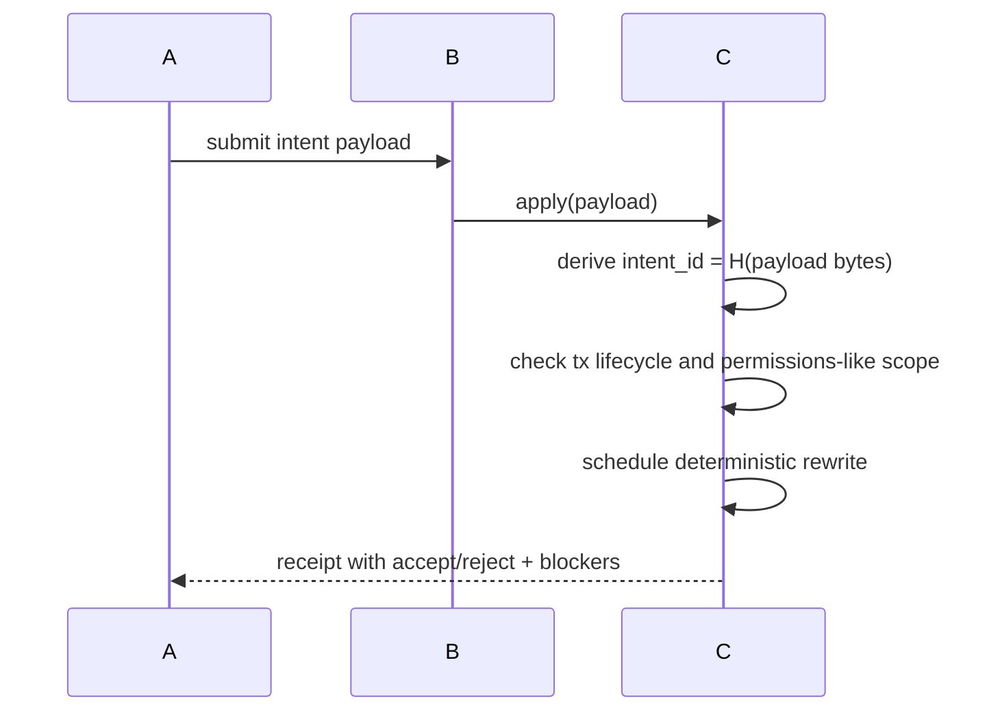
```mermaid
sequenceDiagram
  participant A
  participant B
  participant C

  A->>B: submit intent payload
  B->>C: apply(payload)
  C->>C: derive intent_id = H(payload bytes)
  C->>C: check tx lifecycle and permissions-like scope
  C->>C: schedule deterministic rewrite
  C-->>A: receipt with accept/reject + blockers
```

## 15. Architectural Decisions and Trade-offs

### 1) Binary snapshot + structured loader instead of opaque JSON blobs

- **Decision**: Strongly typed binary layout with fixed row tables.
- **Trade-off**: More rigid and format-sensitive, but faster parse/space characteristics and easier deterministic hashing.

### 2) In-memory GraphStore for runtime operations

- **Decision**: Rehydrate graph per warp for execution.
- **Trade-off**: Higher RAM profile than lazy-on-demand reads, but far simpler deterministic replay and higher execution speed.

### 3) Deterministic merge after parallel execution

- **Decision**: run in parallel first, canonicalize second.
- **Trade-off**: Better throughput at cost of strict merge rules and conflict rejection complexity.

### 4) CLI-first design for inspect/verify

- **Decision**: diagnostics exposed through deterministic commands.
- **Trade-off**: easier operations, less flexibility than direct API server model for some automation tasks.

### 5) Extensive validation before computation

- **Decision**: strict validation before hash/inspect logic.
- **Trade-off**: slightly higher upfront latency, much better safety and explainability.

```mermaid
flowchart TD
  D1[Design axis] --> D2[Determinism vs flexibility]
  D1 --> D3[Throughput vs conflict safety]
  D1 --> D4[Binary speed vs human readability]
  D2 -->|chosen| D2A[Binary snapshot + validator]
  D3 -->|chosen| D3A[Shard parallel + merge validation]
  D4 -->|chosen| D4A[CLI tools + structured commands]
```

## 16. Timeline of a Commit

```mermaid
timeline
  title Commit Event Timeline
  2026-05-30 01: begin : begin()
  : Transaction enters live set
  2026-05-30 02: apply
  : Intents are transformed into pending rewrites
  2026-05-30 03: dispatch
  : Scheduler pulls pending intent and resolves handler
  2026-05-30 04: reserve
  : Conflict check and blockers computed
  2026-05-30 05: execute
  : Sharded rewrite execution on workers
  2026-05-30 06: merge
  : Canonical delta merge and duplicate-key checks
  2026-05-30 07: patch
  : state patch application and snapshot/hash generation
  2026-05-30 08: close
  : tx ends, materialization finalized, history appended
```

## 16.1 Project Progress and Future Use Cases

This project is at an unusually useful middle point: the core runtime primitives exist, operational tooling is wired, but a lot of external integration scaffolding remains intentionally lightweight.

### Where it is today

- Deterministic read/inspect/verify workflows are stable and explainable.
- Runtime execution already supports:
    - bounded-parallel rewrite planning,
    - conflict-aware reservation,
    - and checkpointed history/snapshot mechanics.
- Runtime and CLI boundaries are well separated: command tooling does not mutate core scheduler state except through explicit paths.
- Observability is mostly artifact-driven (text/JSON output + WAL posture maps), not yet full telemetry streaming.
- There is already a strong testability story from determinism (hashes, canonical ordering, strict validation), which is ideal for replay and bisecting regressions.

### Where it is heading

Based on the present design, the roadmap is likely to continue toward:

1. **Richer command surfaces**
    - REST/HTTP adapters that call the same engine primitives.
    - Programmatic entry points that reuse `verify`/`inspect` logic rather than reimplementing it.
2. **Stronger production hardening**
    - WAL posture hooks becoming first-class monitoring outputs,
    - explicit SLA/error budget handling around benchmark drift,
    - safer defaults around concurrency tuning and worker saturation.
3. **Incremental persistence improvements**
    - smarter snapshot compaction around tick deltas,
    - optional lazy loading for very large WSC payloads,
    - stronger migration paths if schema version evolves.
4. **Tooling and introspection maturity**
    - richer JSON schema for inspection output,
    - machine-parseable receipts for dashboards,
    - CLI output modes optimized for CI (CSV/NDJSON variants).

```mermaid
flowchart TD
  P[Current state] --> C1[Expose typed APIs]
  P --> C2[Improve telemetry]
  P --> C3[Improve persistence ergonomics]
  C1 --> H1[Graph services / RPC layer]
  C2 --> H2[Continuous health dashboards]
  C3 --> H3[Faster snapshots + lower memory]
  H1 --> F[Future use cases]
  H2 --> F
  H3 --> F
```

### Cool ideas

- Use the deterministic hash as a cross-language conformance gate in polyglot agent pipelines.
- Export `inspect` output into a governance compliance feed (e.g., graph anomaly reports by edge/attachment histograms).
- Build a `chaos mode` for `commit_with_receipt` that intentionally injects conflict conditions for testing scheduler robustness.
- Add pluggable policy modules for alternative sharding strategies (e.g., topology-aware or latency-aware sharding).
- Create an educational “execution tracer” mode that emits Mermaid-ready spans from sequence/state traces already implied by this teardown.

### Future use cases

- **Protocol simulation**: replay external event streams against a fixed snapshot in deterministic batches.
- **Policy experimentation**: compare two rewrite policies side-by-side on identical tick streams by comparing commit receipts and hashes.
- **Supply-chain provenance tooling**: use snapshot hashes + WAL posture metadata as audit proofs.
- **Education and onboarding**: the CLI + command-level JSON outputs form an unusually strong teaching surface for deterministic distributed systems concepts.
- **Benchmark governance**: baseline-tracked benchmark deltas as pull-request quality gates for runtime changes.

## 16.2 Core-CLI Coupling and Service Migration Path

At present, CLI tooling is the primary user-facing façade. That is intentional for early-stage systems, but it creates a coupling pattern worth making explicit:

- CLI owns command parsing and argument semantics.
- Core owns graph/state mechanics.
- Output shape is chosen by CLI conventions, not by domain contracts.

This is healthy now, but it makes non-CLI consumers implement their own parsing/formatting assumptions.

```mermaid
flowchart TD
  U[User/CI] --> CLI[Warp CLI]
  CLI --> Core[Core APIs: verify/inspect/engine]
  Core --> S[Snapshots, hashes, receipts]
  Core --> O[Structured outputs]
  CLI --> O2[Text/JSON printers]
```

### Migration strategy (non-breaking)

The safest path is to preserve CLI as a transport while extracting service-first domain application services:

1. Extract pure command workflows into `application` modules:
    - `verify_snapshot(request) -> VerifyResult`
    - `inspect_snapshot(request) -> InspectResult`
    - `run_bench(request) -> BenchResult`
2. Introduce DTOs that are UI-neutral (`Rust structs + serde`), then have CLI render from those DTOs.
3. Add an internal adapter that maps CLI requests to DTOs (no behavior change).
4. Add API surface (HTTP/RPC) that consumes the same DTOs.
5. Add compatibility tests that compare API responses to CLI JSON for a set of golden fixtures.

```mermaid
flowchart TD
  A[CLI input] --> B[Command parser]
  B --> C[Application services]
  C --> D[Core engine + wsc]
  C --> E[Result DTOs]
  A --> |legacy| F[CLI formatter]
  E --> G[HTTP and gRPC adapters]
  E --> H[CLI JSON output]
  H --> I[Legacy UX]
  G --> J[Programmatic clients]
```

### Why this direction is compelling

- Keeps deterministic execution logic untouched.
- Improves observability (same receipt and hash contracts everywhere).
- Opens room for policy engines, event-sourcing gateways, and scheduler dashboards without cloning logic.

## 16.3 Design Critiques: Assumptions and Risk Hotspots

A useful teardown should surface not only “what works,” but also where the current architecture can fail under edge stress.

### Assumption map

| Assumption                                             | Why it exists                            | Failure mode                                                           | Mitigation                                                                |
| ------------------------------------------------------ | ---------------------------------------- | ---------------------------------------------------------------------- | ------------------------------------------------------------------------- |
| Deterministic ordering of collections is stable        | State hash correctness and replayability | Non-deterministic iteration in a refactor changes hash output silently | Lock ordering into canonical sort-by-key before any hash or merge point   |
| Fixed binary schema is stable across versions          | Faster parse + simpler hashing contract  | Schema drift breaks older readers                                      | Maintain versioned headers + migration policy around row-table changes    |
| All payloads fit practical in-memory graph reification | Simplifies execution and merge logic     | Large snapshots OOM or latency spikes                                  | Add staged loading, bounded caches, and compact node/edge representations |
| Conflict resolver is conservative                      | Prioritize safety over throughput        | Increased rejection under high parallel contention                     | Expand shard-aware policy tuning + conflict instrumentation               |
| CLI JSON output is sufficient for tooling              | Early integrations are mostly scripts    | Tooling becomes fragile and parsing brittle                            | Add API DTO contract and versioned schema tests                           |

### Risk hotspots

1. **Validation bypass at boundary conversion points**
    - If a new command path feeds malformed ranges/indices directly into `WarpView`, validation must stay centralized.
    - Recommended guardrail: shared entrypoint validator and fuzz tests for each accessor.

2. **Duplicate write-key handling in merge**
    - `merge_parallel_deltas` rejects hard conflicts for safety.
    - Under some workloads this can look like “false” failures if duplicate keys are an expected commutative class.
    - Recommended guardrail: explicit rule contracts that mark commutative operations when lawful.

3. **Output-coupled observability**

- Metrics and posture data are present, but mostly emitted in human-oriented command formats.
- For long-term operations, machine schema drift can hide regression in consumer scripts.
- Recommended guardrail: schema snapshots and contract tests.

1. **Environment-driven tuning without budget controls**
    - `ECHO_WORKERS` can over-allocate and impact host contention.
    - Recommended guardrail: hard ceilings + dynamic fallback when scheduler latency rises.

## 16.4 Typed Pseudo-Definitions for Core Runtime Types

These are **conceptual** type sketches to quickly reason about the most important boundaries. They intentionally abstract implementation details while preserving intent.

```rust
// A simplified request/response envelope for lifecycle state.
pub struct Engine {
    scheduler: Scheduler,
    state: GraphStore,
    root_key: RootKey,
    policy_id: PolicyId,
    worker_count: usize,
    telemetry: Option<TelemetryBus>,
    ledger: TickHistory,
    live_transactions: TxSet,
    materialization_bus: MaterializationBus,
}

pub struct Scheduler {
    pending_intents: BTreeMap<TxId, Vec<PendingIntent>>,
    active_rewrites: HashMap<TxId, Vec<PendingRewrite>>,
    ack_state: AckState,
    in_flight_writes: HashSet<WriteKey>,
}

pub struct GraphStore {
    nodes_by_id: BTreeMap<NodeId, Node>,
    out_edges: BTreeMap<NodeId, Vec<Edge>>,
    reverse_in_edges: BTreeMap<NodeId, Vec<EdgeId>>,
    attachments: BTreeMap<AttachmentTarget, Vec<Attachment>>,
}

pub struct Snapshot {
    tick: Tick,
    tick_history: u64,
    root_key: RootKey,
    state_root: StateRoot,
    state_root_v2: Option<StateRootV2>,
    hash: SnapshotHash,
}

pub struct TickReceipt {
    tx_id: TxId,
    status: ReceiptStatus, // Accepted | Rejected
    blockers: Vec<TxId>,
    planned_rewrites: Vec<RewritePlanDigest>,
    errors: Vec<ConflictError>,
}
```

### Why these sketches are useful

- They expose that execution correctness is mostly determined by two control-plane objects (`Engine`, `Scheduler`) plus two state-plane objects (`GraphStore`, `Snapshot`).
- They make it clear that `TickReceipt` is a contract surface suitable for API migration and machine analysis.

```mermaid
classDiagram
  class Engine {
    +scheduler: Scheduler
    +state: GraphStore
    +ledger: TickHistory
    +begin() TxId
    +apply() PendingRewrite
    +commit_with_receipt() TickReceipt
  }
  class Scheduler {
    +pending_intents: BTreeMap
    +active_rewrites: HashMap
    +reserve_for_receipt()
  }
  class GraphStore {
    +nodes_by_id: BTreeMap
    +out_edges: BTreeMap
    +reverse_in_edges: BTreeMap
  }
  class Snapshot {
    +tick
    +state_root
    +snapshot_hash
  }
  class TickReceipt {
    +status
    +blockers
    +planned_rewrites
  }
  Engine --> Scheduler
  Engine --> GraphStore
  Engine --> Snapshot
  Engine --> TickReceipt
```

## 17. Deep Dives: Technical Feats and Trade-Offs

The following sections focus on the parts where the implementation makes intentional, high-leverage design decisions.

### 17.1 Deterministic Canonical Hashing and Replay Safety

The project’s strongest correctness signal is `canonical_state_hash`. The function is not just “a hash”; it is a complete proof-of-equivalence strategy.

The interesting part is what is _included_ and _ordered_:

- Included values:
    - root binding (implicitly via snapshot context),
    - sorted nodes in total order by `NodeId`,
    - per-node ordered outbound edges,
    - descend attachments for graph edge traversal,
    - and node/edge attachment payloads with their typed encoding.
- Excluded values:
    - fields that are reserved or runtime-only,
    - ephemeral counters unrelated to semantic state.

This means equality is not “similarity” but exact semantic equivalence of graph content under a canonical traversal.

```mermaid
flowchart TD
  H1[canonical_state_hash] --> H2[Gather warp range and root key]
  H2 --> H3[Sort nodes ascending by NodeId]
  H3 --> H4[For each node: emit node tuple]
  H4 --> H5[Emit sorted outgoing edges by source]
  H5 --> H6[For each edge: emit edge tuple + attachments]
  H6 --> H7[Encode via domain-specific attachment codecs]
  H7 --> H8[SHA-512 over deterministic byte stream]
  H8 --> H9[Return versioned hash]
```

Why this matters in practice:

- It gives a cheap cross-language/verifiable fingerprint.
- It detects accidental nondeterminism introduced by non-stable iteration or lossy sorting.
- It allows verification against expected hex without executing any mutation.

### 17.2 Transaction arbitration (`reserve_for_receipt`) as conflict policy

The commit path’s acceptance/rejection boundary is deliberately separated from execution:

1. Collect pending rewrites and normalize into deterministic plan units.
2. Compute scope / footprint candidates before applying deltas.
3. Run arbitration over active write/read overlap and dependency scope.
4. Return either accepted receipt or blocked state with conflicting tx IDs + conflict key details.

This sequence is intentionally important: it prevents work being done for doomed transactions while still keeping scheduling throughput.

```mermaid
sequenceDiagram
  participant X
  participant E
  participant S
  participant R
  participant V

  X->>E: commit_with_receipt(tx)<br/>plan prepared
  E->>S: snapshot pending intents<br/>for tx
  S->>R: build candidate scopes
  R->>V: probe active footprints
  alt no conflicts
    V-->>R: clean read/write set
    R-->>E: Accepted + plan digest
  else conflict
    V-->>R: active blocker tx
    R-->>E: Rejected + blockers
  end
  E->>X: receipt (accepted/rejected)
```

### 17.3 Zero-Copy Reader Views + Stateful Reification

`WscFile` and `WarpView` split the world into two layers:

- A zero-copy layer that references slices directly from mmap/read bytes.
- A reconstructed `GraphStore` layer used for runtime and algorithmic reasoning.

The reification boundary is where most complexity hides:

- It must validate attachment indices before mapping.
- It must preserve semantics for both atom and descend attachments.
- It must not duplicate attachment decode state accidentally, because attachments can be referenced from nodes or edges with different semantic meanings.

```mermaid
flowchart TD
  A[Raw bytes from file] --> B[read helper: typed row decode]
  B --> C[Row structs with exact sizes]
  C --> D[WarpView methods no allocation]
  D --> E{Consumer expects graph logic?}
  E -->|No| F[Keep as slice references]
  E -->|Yes| G[graph_store_from_warp_view]
  G --> H[Map rows -> Node/Edge/Attachment objects]
  H --> I[Ready for inspect/verify execution]
```

### 17.4 Parallel Work Pipeline and Deterministic Merge Strategy

Two operations happen in each commit’s hot path:

- `execute_parallel_*`: produce partial deltas quickly.
- `merge_parallel_deltas`: normalize, order, and reject conflicting overlaps.

The merge step is where semantics are enforced:

- Sort key is deterministic and explicit.
- Duplicate writes to same target/key in the canonical stream are treated as hard failures (poisoned delta).
- Unknown store keys and invalid attachment targets are rejected before state application.

```mermaid
flowchart TD
  P0[work queue by rule execution] --> P1[partition into shards<br/>=256 shards]
  P1 --> P2[worker executes per policy]
  P2 --> P3[WorkerResult with delta ops and errors]
  P3 --> P4[collect_and_sort_by sort_key]
  P4 --> P5{Duplicate write key?}
  P5 -->|yes| P6[poisoned + reject tx<br/>non-determinism guard]
  P5 -->|no| P7[merge op stream]
  P7 --> P8[apply_to_state<br/>if op valid]
  P8 --> P9[snapshot + history]
```

### 17.5 Benchmark baseline semantics (often underestimated)

The benchmark command seems operational, but has several hidden design constraints:

- benchmark result extraction is path-driven (`target/criterion/**/new/estimates.json`) and therefore fragile to benchmark output format drift.
- baseline mode is intentionally simple: raw absolute delta only, not percent difference.
- parse/format order is stabilized by sorting to avoid noisy churn in report diffs.

That makes it a practical performance regression detector for CI but not a replacement for deep micro-architecture benchmarking.

```mermaid
flowchart TD
  BM1[bench --filter] --> BM2[Cargo benchmark process]
  BM2 --> BM3[Parse every benchmark benchmark]
  BM3 --> BM4[Normalize names + stats]
  BM4 --> BM5{baseline requested?}
  BM5 -->|no| BM6[raw report output]
  BM5 -->|yes| BM7[load baseline JSON]
  BM7 --> BM8[match benchmark by name]
  BM8 --> BM9[delta = current - baseline]
  BM9 --> BM10[mark status with comparison marker]
```

### 17.6 Echo Tick: From GraphQL to BTR

The most useful way to understand Echo's contract-hosting path is to follow one
operation all the way from authored schema to exportable causal suffix.

The path is:

1. A developer authors a GraphQL contract.
2. Wesley compiles that contract into operation ids, codecs, registry metadata,
   and footprint-shaped runtime artifacts.
3. A host packs a canonical EINT envelope for the chosen operation.
4. Echo records the submission as witnessed ingress material.
5. A trusted runtime boundary tickets and stages that envelope into runtime
   ingress.
6. The scheduler owns the tick that dispatches the handler and applies any
   admitted rewrite.
7. The tick emits receipt evidence and advances provenance.
8. A contiguous provenance segment can be packaged as a BTR.

The important point is that only the scheduler-owned tick mutates runtime
state. GraphQL authors vocabulary. Wesley compiles it. EINT carries canonical
bytes. Ticketed ingress stages work. The tick is where lawful execution becomes
history.

```mermaid
sequenceDiagram
  participant Dev
  participant Wesley
  participant Host
  participant Echo
  participant Scheduler
  participant Prov

  Dev->>Wesley: GraphQL contract + directives
  Wesley-->>Host: op ids, codecs, registry metadata, footprints
  Host->>Echo: EINT envelope bytes
  Echo-->>Host: witnessed submission id
  Host->>Echo: admission ticket + envelope
  Echo-->>Scheduler: ticketed runtime ingress
  Scheduler->>Scheduler: scheduler-owned tick
  Scheduler->>Scheduler: decode op + vars, check footprint, execute handler
  Scheduler-->>Echo: TickReceipt + state patch
  Echo->>Prov: append provenance entry
  Prov-->>Echo: state root + commit hash
  Host->>Prov: build_btr(worldline, start, end)
  Prov-->>Host: BoundaryTransitionRecord
```

That sequence has several authority boundaries:

| Boundary             | Owns                                                     | Does not own                       |
| -------------------- | -------------------------------------------------------- | ---------------------------------- |
| GraphQL contract     | domain nouns, operation shape, declared footprint        | runtime scheduling or tick cadence |
| Wesley artifacts     | generated codecs, ids, registry metadata, ABI helpers    | mutable runtime state              |
| EINT envelope        | canonical operation bytes                                | admission or execution             |
| witnessed submission | durable ingress evidence                                 | scheduler-visible work             |
| ticketed ingress     | trusted staging into a writer head inbox                 | handler execution                  |
| scheduler tick       | admission, dispatch, conflict checks, receipt production | host-side materialization          |
| BTR                  | contiguous witnessed suffix export                       | new state mutation                 |

In code terms, the runtime distinguishes submission evidence from executable
work. App-facing submission records canonical ingress material but does not
tick, stage runtime ingress, dispatch handlers, or mutate application state. A
trusted boundary later stages ticketed runtime ingress. The scheduler then
correlates the eventual receipt back to the witnessed submission and ticketed
ingress ids.

```mermaid
flowchart TD
  GQL[GraphQL contract] --> WES[Wesley generated artifacts]
  WES --> EINT[EINT canonical envelope]
  EINT --> SUB[Witnessed submission]
  SUB --> TICKET[Admission ticket]
  TICKET --> STAGE[Ticketed runtime ingress]
  STAGE --> TICK[Scheduler-owned tick]
  TICK --> RECEIPT[Tick receipt correlation]
  TICK --> PROV[Provenance entry]
  PROV --> BTR[Boundary Transition Record]
```

A BTR is not a checkpoint and not a replay shortcut by itself. It is a
validated contiguous segment:

- one `worldline_id`;
- one `u0_ref`;
- input boundary hash before the segment;
- output boundary hash after the segment;
- ordered provenance entries for the selected tick range;
- logical counter and auth tag material for the transport or authority layer.

Validation checks the selected range against registered provenance. It rejects
unknown worldlines, mismatched `u0_ref`, wrong input/output boundary hashes,
non-contiguous ticks, mixed worldlines, and entries that do not exactly match
stored history.

The practical consequence:

- a GraphQL mutation is not "called" in the usual app-framework sense;
- it is compiled into canonical runtime material;
- the runtime admits and ticks it under Echo law;
- the resulting history can be exported as a witnessed suffix.

### 17.7 Forks, Strands, and Braids

Echo uses three related but distinct ideas for counterfactual and plural
history work:

| Concept | What it is                                                  | What it is not                              |
| ------- | ----------------------------------------------------------- | ------------------------------------------- |
| Fork    | A copied worldline prefix at one precise tick.              | A semantic relationship by itself.          |
| Strand  | A named relation over a forked child worldline.             | A separate substrate or private scheduler.  |
| Braid   | Read-only support geometry across exact strand coordinates. | Settlement, import, or conflict resolution. |

The distinction matters because each concept answers a different question.

- A **fork** answers: "what state did this child lane start from?"
- A **strand** answers: "what is the named speculative relation between this
  child lane and its basis?"
- A **braid** answers: "which exact support lanes participate in this local
  reading?"

```mermaid
flowchart TD
  P[Parent worldline] -->|fork at tick N| C[Child worldline]
  C --> S[Strand relation]
  S --> B[ForkBasisRef<br/>source lane + tick + commit + boundary]
  S --> H[Writer heads<br/>ordinary runtime control]
  S --> PINS[Support pins]
  PINS --> SUP1[Support strand at pinned tick]
  PINS --> SUP2[Support strand at pinned tick]
  SUP1 --> SITE[Observed braided site]
  SUP2 --> SITE
  S --> SITE
```

A fork copies enough provenance to create a child worldline at the requested
basis. Runtime forking is failure-atomic: if provenance copy, replay,
worldline registration, writer-head registration, or strand registration fails,
Echo restores runtime and provenance to their pre-fork state. The fork must not
leave partial truth behind.

A strand then makes the relationship inspectable. The strand records:

- stable `strand_id`;
- immutable `fork_basis_ref`;
- `child_worldline_id`;
- writer heads authorized for the child lane;
- optional read-only support pins.

The fork basis is deliberately redundant:

- source lane id;
- fork tick;
- commit hash at that tick;
- output boundary hash at that tick;
- provenance ref for native lookup.

Those fields must all name the same provenance coordinate. If they disagree,
strand construction is invalid.

Braids are narrower than settlement. A support pin says:

```text
when reading this strand's local site,
also include that support strand at this exact pinned tick
```

It does not copy the support lane, authorize writes through it, merge it,
settle it, or create a new worldline. It only changes the observation geometry
for a bounded reading.

```mermaid
stateDiagram-v2
  [*] --> ParentWorldline
  ParentWorldline --> ForkedChild : fork(source, tick)
  ForkedChild --> LiveStrand : register Strand
  LiveStrand --> BraidedSite : add support pins
  BraidedSite --> LiveStrand : unpin support
  LiveStrand --> Dropped : drop strand
  Dropped --> [*]
```

Settlement is the next layer. It compares a strand suffix against its basis,
decides whether a suffix can become history on another lane, and produces
conflict artifacts when it cannot. Braid geometry should feed settlement, but
it should not be collapsed into settlement.

For debugger and observer surfaces, the useful rule is:

```text
Forks establish basis.
Strands name speculative lanes.
Braids publish plural local sites.
Settlement decides what can become history.
```

### 17.8 File Materialization and Ingest

File support sits at an awkward boundary because users think in ordinary files
while Echo thinks in witnessed causal history.

The architectural rule is:

```text
A host file is not Echo state.
It is an observed boundary artifact and a materialization target.
```

That means opening a file and saving a file can both create causal events. A
read can discover external drift. A write can authorize external
materialization. Echo should own the causal record for both; applications such
as Jedit or WARP-drive should not maintain a parallel causal ledger.

#### Ingest: host bytes into causal history

When a host file is opened, the user-visible guarantee is simple:

```text
open file -> see the exact bytes currently on disk
```

The Echo-facing flow is more explicit:

1. Resolve a `FileCoordinate` from the host path and available platform file
   identity.
2. Read bytes and relevant metadata through a host capability.
3. Compute canonical content and metadata digests.
4. Compare those digests with the latest retained Echo basis for that
   coordinate.
5. If Echo has no basis, admit the host bytes as an observed boundary artifact.
6. If disk has drifted from the retained basis, admit that drift as an external
   observation.
7. Return a reading envelope containing exact bytes, basis, digest, and
   evidence posture.

```mermaid
flowchart TD
  Open[User opens path] --> Coord[Resolve FileCoordinate]
  Coord --> HostRead[Read host bytes + metadata]
  HostRead --> Digest[Canonical digests]
  Digest --> Compare{Matches Echo basis?}
  Compare -->|unknown| Observe[Admit host observation]
  Compare -->|drifted| Drift[Admit external drift observation]
  Compare -->|yes| Existing[Use retained basis]
  Observe --> Reading[File reading envelope]
  Drift --> Reading
  Existing --> Reading
  Reading --> App[App renders exact file contents]
```

The application should not ask, "does my private sidecar know this file?" It
should ask Echo for the file aperture reading and render the bytes it receives.
If evidence is missing, redacted, encrypted-unavailable, or corrupt, Echo
should return an obstruction posture rather than silently delegating authority
back to the app.

#### Materialization: causal history back to host files

Saving a file is the inverse path. The editor or mount adapter proposes target
content. Echo compares it to the current basis, forms lawful write intents, and
authorizes materialization only after the causal transaction is durable.

The WAL posture for external effects is already the right shape:

```text
No external side effect may be performed before the causal transaction
authorizing that side effect is durably committed.
```

For files, that means:

1. Form a deterministic write intent from old basis and new content.
2. Admit and execute the intent under scheduler-owned tick law.
3. Commit receipt, state delta, and materialization intent to durable history.
4. Publish an idempotent materialization effect token.
5. Write a temporary artifact.
6. `fsync` the temporary artifact.
7. Atomically rename it into place.
8. `fsync` the containing directory.
9. Verify final path digest and metadata.
10. Record `MaterializationEffectObserved`.

```mermaid
sequenceDiagram
  participant App
  participant Echo
  participant WAL
  participant Outbox
  participant Worker
  participant FS as Host Filesystem

  App->>Echo: proposed file content
  Echo->>Echo: diff against causal basis
  Echo->>Echo: scheduler-owned tick
  Echo->>WAL: commit receipt + materialization intent
  WAL-->>Echo: durable commit
  Echo->>Outbox: idempotent effect token
  Worker->>Outbox: claim effect token
  Worker->>FS: temp write + fsync + atomic rename
  Worker->>FS: verify final digest
  Worker->>WAL: MaterializationEffectObserved
```

The hard case is crash recovery:

- if Echo crashes before WAL commit, the file change was never authorized;
- if Echo crashes after WAL commit but before materialization, recovery can
  retry from the idempotent token;
- if Echo crashes after materialization but before the observation record,
  recovery verifies the final artifact and records, retries, repairs, or
  obstructs according to policy.

This is why file ingest and file materialization belong in Echo's shared
aperture layer rather than in each consumer. WARP-drive may present a POSIX
mount. Jedit may present an editor buffer. Both are product surfaces over the
same lower truth:

```text
Echo owns file observation, drift admission, write intent formation,
materialization authorization, and retained evidence posture.
Consumers own presentation and host affordances.
```

## 18. Entity-Relationship View

The data model is best understood as a graph of stateful entities with constrained foreign keys and one canonical parent for each warp.

```mermaid
erDiagram
  SNAPSHOT ||--o{ TICK_HISTORY : contains
  SNAPSHOT ||--o{ WARP : contains
  WARP ||--|{ NODE : contains
  WARP ||--|{ EDGE : contains
  NODE ||--o{ ATTACHMENT : has
  EDGE ||--o{ ATTACHMENT : has
  NODE ||--o{ EDGE : "outgoing to"
  NODE ||--o{ EDGE : "incoming from"
  SNAPSHOT }|--|| ROOT_WARP : designates
  TX ||--o{ INTENT : contains
  TX ||--o{ RECEIPT : emits
  INTENT ||--o{ PENDING_REWRITE : maps_to
```

```mermaid
flowchart TD
  X1[Snapshot] --> X2[Warp]
  X2 --> X3[Node]
  X3 --> X4[Edge]
  X3 --> X5[Attachment]
  X4 --> X5
  X2 --> X6[StateRoot + hash]
  X1 --> X7[Ledger]
  X7 --> X8[Transaction history<br/>receipt + conflicts]
```

## Appendix A: Type-Intent to Data Layout Mapping

`ingest_intent` and snapshot reading bridge external representation and internal typed objects:

- External bytes -> canonical `intent_id`.
- WSC row ranges -> strongly typed slices.
- Raw payload bytes -> typed payload decoding when schema-specific decoder exists.
- Snapshot output -> content hash / state root.

```mermaid
flowchart TD
  E1[Raw intent bytes] --> E2[Read intent bytes]
  E2 --> E3[hash intent bytes]
  E3 --> E4[Warp inbox node + edges + attachments]
  E4 --> E5[Pending rewrite graph op]

  F1[WSC node row] --> F2[WarpView nodes]
  F3[WSC edge row] --> F4[WarpView out edges for node]
  F5[WSC attachment row] --> F6[AttachmentValue decode]
  F2 --> G[GraphStore]
  F4 --> G
  F6 --> G
  G --> H[canonical_state_hash + snapshot/state]
```

## Appendix B: Reference Command Paths

### CLI flows

- `echo-cli verify <snapshot> [--expected <hex>] [--format json|text]`
- `echo-cli inspect <snapshot> [--tree] [--raw]`
- `echo-cli wal doctor <root>`
- `echo-cli wal submission-posture <root> --submission-id <submission_id> --canonical-envelope-digest <submission_digest>`
- `echo-cli bench [--filter <regex>] [--baseline <path>]`

### Core paths referenced in this teardown

- CLI dispatch: [`crates/warp-cli/src/main.rs`](../crates/warp-cli/src/main.rs)
- Command schema: [`crates/warp-cli/src/cli.rs`](../crates/warp-cli/src/cli.rs)
- Output format: [`crates/warp-cli/src/output.rs`](../crates/warp-cli/src/output.rs)
- verify flow: [`crates/warp-cli/src/verify.rs`](../crates/warp-cli/src/verify.rs)
- inspect flow: [`crates/warp-cli/src/inspect.rs`](../crates/warp-cli/src/inspect.rs)
- wal utilities: [`crates/warp-cli/src/wal.rs`](../crates/warp-cli/src/wal.rs)
- bench utilities: [`crates/warp-cli/src/bench.rs`](../crates/warp-cli/src/bench.rs)
- wsc reader/validator: [`crates/warp-core/src/wsc/mod.rs`](../crates/warp-core/src/wsc/mod.rs), [`crates/warp-core/src/wsc/read.rs`](../crates/warp-core/src/wsc/read.rs), [`crates/warp-core/src/wsc/validate.rs`](../crates/warp-core/src/wsc/validate.rs), [`crates/warp-core/src/wsc/view.rs`](../crates/warp-core/src/wsc/view.rs)
- core engine internals: [`crates/warp-core/src/engine_impl.rs`](../crates/warp-core/src/engine_impl.rs), [`crates/warp-core/src/parallel/exec.rs`](../crates/warp-core/src/parallel/exec.rs), [`crates/warp-core/src/parallel/shard.rs`](../crates/warp-core/src/parallel/shard.rs)
- graph/snapshot roots: [`crates/warp-core/src/graph.rs`](../crates/warp-core/src/graph.rs), [`crates/warp-core/src/snapshot.rs`](../crates/warp-core/src/snapshot.rs)

## Appendix C: Pseudo Type Definitions

```rust
// Conceptual request contracts to decouple CLI from core behavior.
pub struct VerifyRequest {
    pub snapshot_path: PathBuf,
    pub expected_root: Option<StateHash>,
    pub format: OutputFormat,
}

pub struct VerifyResult {
    pub snapshot_tick: Tick,
    pub warp_count: usize,
    pub per_warp_hashes: Vec<(WarpId, StateRootHash)>,
    pub expected_match: Option<bool>,
    pub elapsed_ns: u128,
    pub errors: Vec<String>,
}

pub struct InspectRequest {
    pub snapshot_path: PathBuf,
    pub show_tree: bool,
    pub tree_depth: Option<usize>,
    pub raw_payloads: bool,
    pub format: OutputFormat,
}

pub struct InspectResult {
    pub snapshot: SnapshotInfo,
    pub warps: Vec<WarpInspectSummary>,
    pub warnings: Vec<String>,
}

pub struct WalPostureRequest {
    pub root: RootId,
    pub submission_id: Option<SubmissionId>,
    pub submission_digest: Option<SubmissionDigest>,
}

pub struct WalPostureResult {
    pub posture: WalPosture,
    pub blockers: Vec<BlockerHint>,
    pub details: String,
}

pub struct BenchRequest {
    pub filter: Option<String>,
    pub baseline: Option<PathBuf>,
}

pub struct BenchResult {
    pub benchmark: String,
    pub mean_ns: u64,
    pub median_ns: u64,
    pub stddev_ns: u64,
    pub baseline_delta_ns: Option<i64>,
    pub status_marker: Option<char>, // '+', '-', '='
}
```

These definitions mirror how the same data can be surfaced through CLI, API, or observability tooling without changing core logic.
