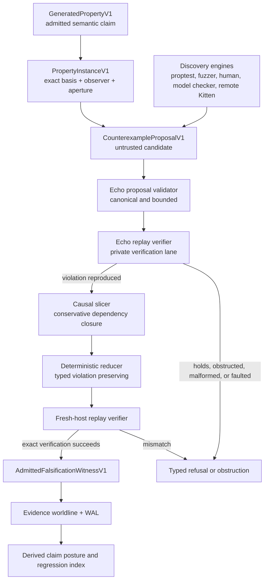
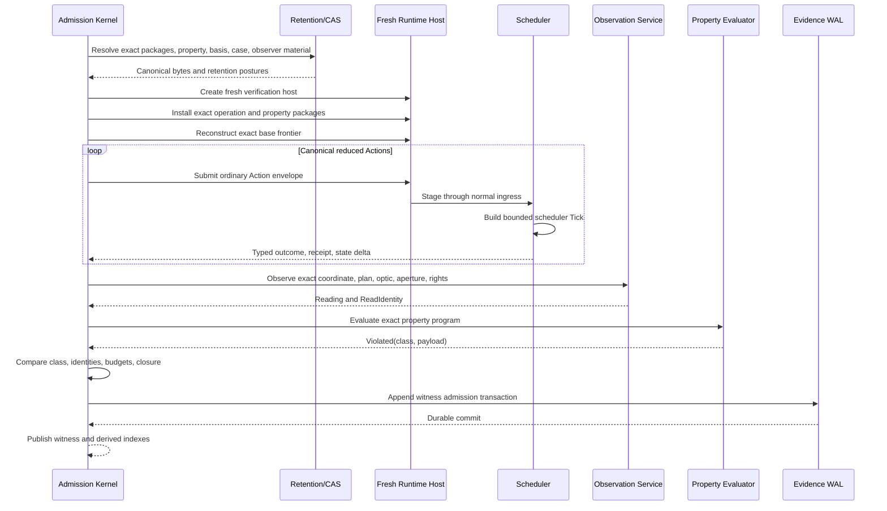

<!-- SPDX-License-Identifier: Apache-2.0 OR LicenseRef-MIND-UCAL-1.0 -->
<!-- © James Ross Ω FLYING•ROBOTS <https://github.com/flyingrobots> -->

# Falsification witnesses

**Status:** proposed. No code in this topic is implemented yet. This document is
both the design for first-class falsification artifacts and the roadmap that
sequences their delivery.

**Governing rule:**

> Anyone may discover and propose a counterexample. Only Echo may admit that the
> counterexample falsifies an exact property instance.

Every source anchor below is `path#Lline@c354d5316`. Claims that could not be
anchored to code are marked **(unbuilt)** and are design intent, not present
behaviour.

## Executive summary

Echo should implement falsification as a new **admitted semantic-evidence
category**, not as a test-log format, a specialized obstruction, a mutable
`claim.is_falsified` flag, or a bag of `proptest` metadata.

An admitted falsification witness asserts a narrow proposition:

> Given property **P**, its exact semantic closure and lawpack **L**, evaluation
> basis **B**, observer **O**, optic and aperture **A**, rights and budget
> posture **R**, and a replayable causal experiment **H**, Echo reproduced a
> reading **V** for which the property evaluator returned the typed violation
> class **C**.

That proposition is materially different from an obstruction, scheduler
rejection, conflict, crash, or uncommitted preparation. The existing
executable-operation design already separates package identity, invocation
admission, exact basis, private evaluation, actual footprint, scheduler
composition, receipt, WAL material, and terminal outcome. Falsification reuses
those propositions without collapsing them.

Four public artifact types:

| Artifact                         | Trust posture               | Purpose                                                                                                                                                |
| -------------------------------- | --------------------------- | ------------------------------------------------------------------------------------------------------------------------------------------------------ |
| `GeneratedPropertyV1`            | Admitted authored meaning   | Defines an executable semantic claim, observation contract, violation classifier, reduction law, and resource bounds.                                  |
| `PropertyInstanceV1`             | Echo-bound                  | Binds that property to one exact target basis, observer plan or instance, optic, aperture, rights posture, and property parameters.                    |
| `CounterexampleProposalV1`       | Untrusted                   | Carries a candidate case or Action sequence plus discovery provenance such as fuzzer, seed, generator, and shrinker versions.                          |
| `AdmittedFalsificationWitnessV1` | Authoritative Echo evidence | Carries the minimized replayable causal experiment, violating reading, typed violation, replay certificate, minimization posture, and dual identities. |

Core implementation decisions:

1. **Property evaluation is read-only and bounded.** It may inspect exact
   retained execution and observation evidence but may not mutate the target
   worldline.
2. **Discovery and admission are separate.** A fuzzer, human, model checker,
   Graft, or remote Kitten can propose a case; none may mint an Echo
   falsification witness.
3. **Fresh-host exact replay is required for admission.** In-process replay is
   useful preflight evidence but is not the admission boundary.
4. **Reduction preserves a typed violation class**, not merely "some failure."
   Otherwise the reducer can silently jump from one bug to another.
5. **Minimality is explicitly qualified.** Version one normally claims
   `LocallyIrreducible` or `BudgetExhausted`, never an unqualified global
   minimum.
6. **The target worldline is never rewritten to say it had a bug.** The witness
   is appended to a separate evidence worldline and cites the target history.
7. **Semantic counterexample identity is separate from the exact
   artifact-envelope identity.** Discovery provenance and reduction traces must
   not fragment the identity of the underlying counterexample.
8. **The first vertical is footprint honesty, without weakening
   executable-operation admission to manufacture a liar.** Use a false generated
   property over a lawful hook-free operation as the production-shaped witness,
   plus a compatibility fixture exercising the existing footprint guard.

## What already exists

These are the load-bearing seams the design reuses. Each is verified against the
worktree at `c354d5316`.

| Seam                          | Where                                                     | What it gives falsification                                                                                                                                                                                                                                                             |
| ----------------------------- | --------------------------------------------------------- | --------------------------------------------------------------------------------------------------------------------------------------------------------------------------------------------------------------------------------------------------------------------------------------- |
| Exact evaluation basis        | `crates/warp-core/src/echo_operation.rs#L2614@c354d5316`  | `EchoOperationEvaluationBasisV1` binds writer head, worldline tick, optional commit global tick, state root, commit id, and an application basis. This is the basis a `PropertyInstanceV1` pins.                                                                                        |
| Application basis proposition | `crates/warp-core/src/echo_operation.rs#L2584@c354d5316`  | `EchoOperationApplicationBasisV1` separates schema identity from value identity.                                                                                                                                                                                                        |
| Retained evidence roles       | `crates/warp-core/src/retained_evidence.rs#L24@c354d5316` | `RetainedEvidenceRole` has six variants with stable tags `0..=5` (`crates/warp-core/src/retained_evidence.rs#L39@c354d5316`). Falsification appends new tags rather than moving old ones.                                                                                               |
| Missing-evidence honesty      | `crates/warp-core/src/retained_evidence.rs#L3@c354d5316`  | "CAS names bytes. These references name retained evidence under contract semantics so missing material can obstruct explicitly instead of becoming an empty read, cache hit, or generic runtime failure." This is exactly the posture a witness needs when its replay material is gone. |
| Observation frame             | `crates/warp-core/src/observation.rs#L126@c354d5316`      | `ObservationFrame` = `CommitBoundary` \| `RecordedTruth` \| `QueryView`.                                                                                                                                                                                                                |
| Observation projection kinds  | `crates/warp-core/src/observation.rs#L146@c354d5316`      | `ObservationProjectionKind` = `Head` \| `Snapshot` \| `TruthChannels` \| `Query`. The frame/projection validity matrix is enforced at `crates/warp-core/src/observation.rs#L2344@c354d5316`.                                                                                            |
| Observer plan                 | `crates/warp-core/src/observation.rs#L607@c354d5316`      | `ReadingObserverPlan` = `Builtin { plan }` \| `Authored { plan }`. A property instance pins one of these, not "a plan with similar output."                                                                                                                                             |
| Footprint guard               | `crates/warp-core/src/footprint_guard.rs#L120@c354d5316`  | `FootprintViolation { rule_name, warp_id, kind, op_kind }` with `ViolationKind` at `crates/warp-core/src/footprint_guard.rs#L89@c354d5316`.                                                                                                                                             |
| WAL transaction kinds         | `crates/warp-core/src/causal_wal.rs#L323@c354d5316`       | Twelve kinds, stable codes `1..=12`. **Next free transaction code is 13.**                                                                                                                                                                                                              |
| WAL append authority          | `crates/warp-core/src/causal_wal.rs#L304@c354d5316`       | `WalAppendAuthority::AdmissionKernel` already exists and is required by `CausalAnchorAdmission` (`crates/warp-core/src/causal_wal.rs#L383@c354d5316`). Falsification admission reuses it.                                                                                               |
| WAL record kinds              | `crates/warp-core/src/causal_wal.rs#L424@c354d5316`       | Includes `RetainedMaterialRefRecorded`. Highest stable record code in use is 31; **next free record code is 32.**                                                                                                                                                                       |
| Unknown-code rejection        | `crates/warp-core/src/causal_wal.rs#L414@c354d5316`       | `from_code` returns `WalDecodeError::UnknownEnumCode` rather than skipping. This is why rollout must be reader-first.                                                                                                                                                                   |
| Shape-only suffix bundle      | `crates/echo-wasm-abi/src/kernel_port.rs#L2341@c354d5316` | `CausalSuffixBundle` is a "witnessed suffix bundle exchanged across a hot/cold runtime boundary" carrying a `WitnessedSuffixShell` and a digest. It is not a replay package.                                                                                                            |
| Read identity                 | `crates/echo-wasm-abi/src/kernel_port.rs#L810@c354d5316`  | `ReadIdentity` is the observation identity a witness cites.                                                                                                                                                                                                                             |
| Footprint enforcement flag    | `crates/warp-core/Cargo.toml#L65@c354d5316`               | `footprint_enforce_release` feature; enforcement is otherwise `debug_assertions`-only (`crates/warp-core/src/lib.rs#L86@c354d5316`) and is mutually exclusive with `unsafe_graph` (`crates/warp-core/src/lib.rs#L22@c354d5316`).                                                        |
| Stated CI gap                 | `docs/topics/GeneratedRules.md#L269@c354d5316`            | "The `footprint_enforce_release` qualification lane is not wired into CI."                                                                                                                                                                                                              |

### Corrections applied to the source draft

Four claims in the originating draft did not survive verification. They are
corrected here, and the corrections are load-bearing.

1. **`FootprintViolation` is a panic payload, not a returned value.** The
   doc comment at `crates/warp-core/src/footprint_guard.rs#L117@c354d5316` says
   it is the "violation payload for `std::panic::panic_any`," matchable via
   `downcast_ref::<FootprintViolation>()`. It reaches a caller through unwind,
   not through a `Result`. A property evaluator therefore cannot simply receive
   it — and more fundamentally, the guard accumulates nothing, so the actual
   footprint the property must compare against does not exist anywhere. See
   [The guard checks; it does not record](#the-guard-checks-it-does-not-record).
2. **There is no `ExecutableActionEvidence` observation projection.** The only
   projections are `Head`, `Snapshot`, `TruthChannels { channels }`, and
   `Query { query_id, vars_bytes }`, and `RecordedTruth` is valid only with
   `TruthChannels` (`crates/warp-core/src/observation.rs#L2344@c354d5316`).
   Actual per-Action footprints are **unbuilt**. They will be delivered on the
   execution-evidence channel rather than through a new projection, so that the
   bound observation aperture is not widened.
3. **`WalAppendAuthority::AdmissionKernel` already exists** and does not need to
   be added; only a new transaction kind and record kinds are new.
4. **The guard reports `NodeReadNotDeclared`-style variants, not a generic
   "undeclared access."** The violation classifier must project
   `ViolationKind` faithfully, including `CrossWarpEmission`,
   `UnauthorizedInstanceOp`, and `OpWarpUnknown`, which are not read/write
   footprint violations at all and must not be merged into one class.

## Architectural model and trust boundary

Three separations that ordinary property-test runners blur:

| Separation                                       | Why Echo needs it                                                                                                     |
| ------------------------------------------------ | --------------------------------------------------------------------------------------------------------------------- |
| Discovery versus admission                       | The party finding a case may be buggy, malicious, nondeterministic, or running a different implementation.            |
| Experiment execution versus claim observation    | Executing an Action lawfully does not by itself determine what a particular observer and aperture may claim about it. |
| Semantic counterexample versus evidence envelope | The same counterexample may be found by different tools and wrapped in different replay or reduction evidence.        |



**Discovery engines are outside the admission trust boundary.** Their generator,
seed, search order, coverage map, heuristic score, and locally shrunk output are
explanatory provenance. Echo must not accept their statement that a case failed.
This mirrors the operation path: exact package bytes do not independently confer
an operation coordinate, installation, invocability, or authority, and the
scheduler — not application code — owns private evaluation.

**The property package is not self-authorizing.** `GeneratedPropertyV1` may carry
an evaluator program, but installation begins from an admitted property package
and policy, exactly as executable-operation installation begins from an admitted
operation package rather than a naked program digest
(`crates/warp-core/src/echo_operation.rs#L153@c354d5316` distinguishes
`EchoOperationPackageIdV1` from `EchoOperationProgramIdV1` at
`crates/warp-core/src/echo_operation.rs#L166@c354d5316`). A property evaluator
digest cannot mint a public property coordinate or grant observation rights.

**Property evaluation returns a closed outcome sum:**

```rust
pub enum PropertyEvaluationOutcomeV1 {
    HoldsForCase {
        evaluation_id: PropertyEvaluationIdV1,
        reading_id: ReadIdentity,
    },
    Violated {
        evaluation_id: PropertyEvaluationIdV1,
        violation_class_id: ViolationClassIdV1,
        violation_payload: RetainedEvidenceRef,
        reading_id: ReadIdentity,
    },
    Obstructed {
        evaluation_id: PropertyEvaluationIdV1,
        obstruction: ContractObstruction,
    },
    RuntimeFault {
        evaluation_id: PropertyEvaluationIdV1,
        fault_id: RuntimeFaultId,
    },
}
```

`ContractObstruction` is the existing type at
`crates/warp-core/src/contract_obstruction.rs@c354d5316`, already imported by
retained evidence (`crates/warp-core/src/retained_evidence.rs#L11@c354d5316`).

- `HoldsForCase` means only that the concrete case did not falsify the property.
  It is not a proof of a universal statement. A finite run can find a
  counterexample; successful sampled cases remain finite testing evidence.
- `Obstructed` means Echo could not complete the required execution, observation,
  or interpretation under the bound contract. It does not mean the property held
  or failed.
- `RuntimeFault` means Echo failed to maintain its own runtime invariants. A
  fault is not promoted into a semantic refutation merely because it happened
  while evaluating a property.
- `Violated` means the exact property evaluator lawfully received its required
  reading and returned a typed negative result. This is the only path toward an
  admitted falsification witness.

**Long campaigns must not be single Ticks.** One proposal intake may be an
ordinary Action, but search and reduction can involve hundreds or thousands of
replays. Tick semantics intentionally make one scheduler decision, one private
successor, one receipt, one provenance advance, and one failure-atomic WAL
transaction; `ExecutableOperationTick`
(`crates/warp-core/src/causal_wal.rs#L341@c354d5316`) commits exactly one
executable-operation consequence under `WalAppendAuthority::ExecutionKernel`
(`crates/warp-core/src/causal_wal.rs#L384@c354d5316`). Stuffing a whole reduction
campaign into that atomic unit would create an unbounded scheduler job.

Campaign state machine:

```text
AcceptedProposal
    -> CandidateReproduced
    -> SliceComputed
    -> ReductionInProgress
    -> ReductionTerminal
    -> FreshHostVerified
    -> WitnessAdmitted

Terminal alternatives:
    ProposalRefused
    ReproductionObstructed
    NoViolationReproduced
    ReductionObstructed
    ReductionBudgetExhausted
    FreshHostMismatch
    RuntimeFaulted
```

Each replay attempt is bounded and independently attributable. The campaign
coordinator may schedule many such attempts, but no attempt gains authority
merely because the coordinator requested it.

## Artifact schemas and API placement

The schemas below are deliberately verbose. Falsification is exactly the place
where "we can infer that later" becomes future archaeology.

### Generated property schema

| Field                          | Type                              | Required semantic meaning                                                                                   |
| ------------------------------ | --------------------------------- | ----------------------------------------------------------------------------------------------------------- |
| `schema_version`               | `u32`                             | Canonical artifact version.                                                                                 |
| `property_coordinate`          | `Coordinate`                      | Public authored name of the semantic claim.                                                                 |
| `property_package_id`          | `GeneratedPropertyPackageIdV1`    | Content identity of exact canonical package bytes.                                                          |
| `semantic_closure_digest`      | `Hash`                            | Binds authored source, canonical meaning, Core/IR, compiler profile, and imported resources.                |
| `lawpack_coordinate`           | `Coordinate`                      | Exact governing lawpack.                                                                                    |
| `lawpack_digest`               | `Hash`                            | Exact lawpack content identity.                                                                             |
| `subject_contract`             | `PropertySubjectContractV1`       | Which operation package, program, Action kind, history family, or evidence category is quantified over.     |
| `quantified_domain`            | `DomainRefV1`                     | Canonical case domain or parameter schema.                                                                  |
| `case_codec`                   | `CodecRefV1`                      | Exact canonical encoding for concrete cases.                                                                |
| `basis_contract`               | `BasisContractRefV1`              | Required runtime and application basis fields.                                                              |
| `observation_contract`         | `ObservationContractRefV1`        | Required frame, projection, observer-plan class, optic, aperture schema, rights class, and freshness rules. |
| `predicate_program`            | `PropertyProgramRefV1`            | Echo-interpreted read-only property evaluator.                                                              |
| `predicate_program_digest`     | `Hash`                            | Exact evaluator bytes.                                                                                      |
| `evaluator_abi`                | `ProfileRefV1`                    | Versioned property-evaluator ABI.                                                                           |
| `intrinsic_profile`            | `ProfileRefV1`                    | Digest-locked deterministic intrinsic set.                                                                  |
| `violation_schema`             | `SchemaRefV1`                     | Canonical typed violation payload schema.                                                                   |
| `violation_classifier`         | `ViolationClassifierRefV1`        | Defines stable failure classes used to prevent reducer bug-hopping.                                         |
| `violation_equivalence_policy` | `ViolationEquivalencePolicyV1`    | Says what must remain equivalent during reduction.                                                          |
| `reduction_law`                | `ReductionLawRefV1`               | Ordered, versioned, digest-locked candidate transformations.                                                |
| `declared_budget`              | `PropertyBudgetV1`                | Evaluation and observation bounds for one case.                                                             |
| `reduction_budget_ceiling`     | `ReductionBudgetV1`               | Maximum campaign work this package permits.                                                                 |
| `authority_requirements`       | `PropertyAuthorityRequirementsV1` | Authority needed to install, instantiate, observe, and retain results.                                      |
| `result_interpretation`        | `Coordinate`                      | Meaning of `HoldsForCase`, `Violated`, and typed obstruction results.                                       |

`subject_contract` must not be a free-form query. Version one supports only a
small closed sum:

```rust
pub enum PropertySubjectContractV1 {
    ExecutableOperationAction {
        operation_coordinate: Coordinate,
        package_id: EchoOperationPackageIdV1,
    },
    ProviderRuleExecution {
        provider_package_id: ProviderPackageIdV1,
        rule_id: RuleId,
    },
    RecordedActionOutcome {
        action_kind: IntentKind,
        outcome_schema: SchemaRefV1,
    },
}
```

### Property instance schema

| Field                        | Type                               | Required semantic meaning                                                                                  |
| ---------------------------- | ---------------------------------- | ---------------------------------------------------------------------------------------------------------- |
| `property_id`                | `GeneratedPropertyIdV1`            | Exact admitted property meaning.                                                                           |
| `property_admission_id`      | `PropertyAdmissionIdV1`            | Echo-owned admission evidence.                                                                             |
| `target_worldline_id`        | `WorldlineId`                      | Worldline whose history or state is under examination.                                                     |
| `runtime_basis`              | `EchoOperationEvaluationBasisV1`   | Exact writer head, ticks, root, commit, and application-basis proposition.                                 |
| `basis_id`                   | `EchoOperationEvaluationBasisIdV1` | Domain-separated identity of the complete basis (`crates/warp-core/src/echo_operation.rs#L192@c354d5316`). |
| `property_parameters`        | `RetainedEvidenceRef`              | Canonical quantifier or fixture parameters.                                                                |
| `observer_plan`              | `ReadingObserverPlan`              | Exact built-in or authored plan.                                                                           |
| `observer_plan_id`           | `ObserverPlanId`                   | Stable plan identity.                                                                                      |
| `observer_instance`          | `Option<ObserverInstanceRef>`      | Exact hosted observer state when the read is stateful.                                                     |
| `observer_instance_evidence` | `Option<RetainedEvidenceRef>`      | Recoverable observer-instance state or certificate.                                                        |
| `frame`                      | `ObservationFrame`                 | Commit boundary, recorded truth, or query view.                                                            |
| `projection`                 | `ObservationProjection`            | Exact projection requested. Must satisfy the frame/projection validity matrix.                             |
| `optic_id`                   | `OpticId`                          | Exact optic law.                                                                                           |
| `focus`                      | `OpticFocus`                       | Exact semantic focus.                                                                                      |
| `aperture_bytes`             | `RetainedEvidenceRef`              | Canonical aperture descriptor.                                                                             |
| `aperture_digest`            | `Hash`                             | Exact aperture identity.                                                                                   |
| `rights_evidence`            | `RetainedEvidenceRef`              | Rights and authority posture for the observation.                                                          |
| `observation_budget`         | `ObservationReadBudget`            | Exact read budget.                                                                                         |
| `freshness_requirement`      | `FreshnessRequirementV1`           | Required frontier or global-tick relation.                                                                 |
| `instance_id`                | `PropertyInstanceIdV1`             | Identity of all the preceding bindings.                                                                    |

The existing observation request already resolves a requested coordinate to an
exact worldline tick, optional global Tick, state root, and commit hash while
carrying observer plan, optional observer instance, budget, and rights
(`crates/warp-core/src/observation.rs#L246@c354d5316`). Reuse that contract
rather than recreating a falsification-only read path.

Observer and aperture binding is not decoration. An apparent contradiction
observed through one aperture cannot be silently generalized to all observers;
basis, aperture, path, authority, and carried evidence are part of what a claim
is entitled to assert.

### Counterexample proposal schema

| Field                       | Type                               | Trust treatment                                            |
| --------------------------- | ---------------------------------- | ---------------------------------------------------------- |
| `schema_version`            | `u32`                              | Canonically decoded before allocation-heavy work.          |
| `property_instance_id`      | `PropertyInstanceIdV1`             | Must resolve to an installed, admitted instance.           |
| `canonical_case`            | `RetainedEvidenceRef`              | Treated as untrusted bytes until codec validation.         |
| `proposed_actions`          | `Vec<RetainedEvidenceRef>`         | Canonical Action envelopes or exact invocation bytes.      |
| `proposed_source_basis`     | `EchoOperationEvaluationBasisIdV1` | Must equal the instance basis; never authorizes rebasing.  |
| `expected_violation_class`  | `Option<ViolationClassIdV1>`       | Hint only; Echo recomputes it.                             |
| `source_witness`            | `Option<RetainedEvidenceRef>`      | Optional original failure log, receipt, or remote witness. |
| `discovery_tool_coordinate` | `Coordinate`                       | Explanatory provenance.                                    |
| `discovery_tool_digest`     | `Hash`                             | Exact tool or adapter identity.                            |
| `generator_digest`          | `Option<Hash>`                     | Explanatory provenance.                                    |
| `generator_seed`            | `Option<[u8; 32]>`                 | Reproduction hint, not semantic evidence.                  |
| `case_index`                | `Option<u64>`                      | Discovery hint.                                            |
| `local_shrinker_digest`     | `Option<Hash>`                     | Explains prior shrinking but has no admission authority.   |
| `discovery_budget`          | `DiscoveryBudgetV1`                | Records bounded search effort.                             |
| `proposal_id`               | `CounterexampleProposalIdV1`       | Identity of the exact proposal envelope.                   |

The explicit case must be sufficient for Echo replay. A seed alone is inadequate
because property-testing strategies and RNG behaviour change between versions,
and nondeterministic strategies break seed-based failure persistence outright.

### Admitted witness schema

| Field                        | Type                         | Required proposition                                                  |
| ---------------------------- | ---------------------------- | --------------------------------------------------------------------- |
| `schema_version`             | `u32`                        | Canonical witness version.                                            |
| `property_instance`          | `PropertyInstanceV1`         | Exact claim, basis, observer, aperture, and rights.                   |
| `proposal_ref`               | `RetainedEvidenceRef`        | Exact source proposal retained for attribution.                       |
| `original_case`              | `RetainedEvidenceRef`        | First Echo-reproduced candidate.                                      |
| `minimized_case`             | `RetainedEvidenceRef`        | Canonical reduced case.                                               |
| `source_experiment`          | `ReplayableCausalSliceV1`    | Reproduced source experiment before reduction.                        |
| `reduced_experiment`         | `ReplayableCausalSliceV1`    | Minimized replayable experiment.                                      |
| `execution_outcomes`         | `Vec<RetainedEvidenceRef>`   | Exact typed Action outcomes.                                          |
| `tick_receipts`              | `Vec<RetainedEvidenceRef>`   | Exact receipts for the reduced replay.                                |
| `violating_reading_id`       | `ReadIdentity`               | Exact observation identity.                                           |
| `violating_reading_payload`  | `RetainedEvidenceRef`        | Exact reading supplied to the property.                               |
| `property_evaluation`        | `RetainedEvidenceRef`        | Exact evaluator input/output envelope.                                |
| `violation_class_id`         | `ViolationClassIdV1`         | Stable bug class preserved by reduction.                              |
| `violation_payload`          | `RetainedEvidenceRef`        | Typed negative witness.                                               |
| `minimization_evidence`      | `MinimizationEvidenceV1`     | Reduction law, trace root, budget use, and minimality posture.        |
| `replay_certificate`         | `ReplayCertificateV1`        | Fresh-host reconstruction and equality checks.                        |
| `retention_manifest`         | `RetentionManifestV1`        | Complete list of required retained objects and availability postures. |
| `semantic_counterexample_id` | `SemanticCounterexampleIdV1` | Identity of the semantic counterexample.                              |
| `artifact_id`                | `FalsificationArtifactIdV1`  | Identity of this exact evidence envelope.                             |
| `admission_coordinate`       | `ProvenanceRef`              | Evidence-worldline admission point.                                   |

`ReplayableCausalSliceV1` must be a **new** type. `CausalSuffixBundle`
(`crates/echo-wasm-abi/src/kernel_port.rs#L2341@c354d5316`) carries a
`WitnessedSuffixShell` plus a `bundle_digest` — a compact shape-only shell, not a
materialized state snapshot, raw patch stream, transport endpoint, or executable
replay bundle. Reusing that name would overstate its present proposition.

```rust
pub struct ReplayableCausalSliceV1 {
    pub base_frontier: ProvenanceRef,
    pub target_frontier: ProvenanceRef,

    pub source_worldline_id: WorldlineId,
    pub ordered_submission_refs: Vec<RetainedEvidenceRef>,
    pub ordered_tick_refs: Vec<RetainedEvidenceRef>,
    pub ordered_action_outcome_refs: Vec<RetainedEvidenceRef>,

    pub required_package_refs: Vec<RetainedEvidenceRef>,
    pub required_property_refs: Vec<RetainedEvidenceRef>,
    pub required_basis_refs: Vec<RetainedEvidenceRef>,
    pub required_observer_refs: Vec<RetainedEvidenceRef>,

    pub dependency_graph_ref: RetainedEvidenceRef,
    pub closure_digest: Hash,
}
```

### Proposed API surface

Echo is a library/runtime boundary rather than an HTTP daemon, so these are Rust
and ABI entry points first. A future service can map them onto RPC without
changing the semantic nouns.

| Layer                | Proposed entry point                                             | Authority and behaviour                                                                    |
| -------------------- | ---------------------------------------------------------------- | ------------------------------------------------------------------------------------------ |
| Compiler/publication | `emit_generated_property_v1(...)`                                | Produces canonical package bytes; no installation authority.                               |
| Trusted host         | `admit_generated_property_v1(package, policy)`                   | Validates exact semantic closure and returns opaque admission evidence.                    |
| Trusted host         | `install_admitted_property_v1(admitted, retained_bytes)`         | Runtime-control-owned atomic installation.                                                 |
| Application-facing   | `submit_counterexample_proposal_v1(instance_id, proposal_bytes)` | Ordinary ingress; acknowledgement only after proposal-envelope WAL commit.                 |
| Application-facing   | `observe_counterexample_proposal_v1(handle)`                     | Read-only status: pending, verifying, reduced, admitted, refused, obstructed.              |
| Verification kernel  | `replay_property_case_v1(instance, case, mode)`                  | One bounded private replay; not exposed to ordinary applications.                          |
| Verification kernel  | `compute_causal_slice_v1(reproduced_case)`                       | Produces a conservative replay candidate and dependency evidence.                          |
| Verification kernel  | `reduce_counterexample_v1(candidate, budget)`                    | Executes deterministic versioned reduction.                                                |
| Admission kernel     | `admit_falsification_witness_v1(verified_material)`              | Revalidates all identities and writes one failure-atomic WAL transaction.                  |
| Observation service  | `observe_falsification_witness_v1(witness_id, request)`          | Observer- and rights-bound witness read.                                                   |
| Regression service   | `reapply_witness_v1(witness_id, successor_instance_id)`          | Evaluates an old case against a new property or lawpack without modifying the old witness. |
| CLI                  | `cargo xtask falsify --property ... --proposal ...`              | Development adapter for discovery, replay, and reduction.                                  |
| CLI                  | `warp falsification inspect <id>`                                | Displays semantic bindings, retention posture, replay and minimality evidence.             |
| CLI                  | `warp falsification replay <id>`                                 | Performs a fresh-host replay and emits corroboration or obstruction evidence.              |

The property verifier, reducer, and final admission entry point must not be
methods on an application-facing handle, for the same reason transitional direct
operation prepare/commit is hidden from `TrustedRuntimeApp`: application code
must not choose when private evaluation or publication occurs.

## Replay, causal slicing, and minimization

### Exact replay semantics

Admission requires **fresh-host semantic replay**, not only receipt validation.

A replay succeeds only if Echo reconstructs the same property instance and
produces a violation in the same property-defined violation equivalence class.
Byte identity is required for deterministic artifacts — canonical Action
envelopes, installed package bytes, property package bytes, reduced case bytes,
result projections, and evaluator output — where the reduction law says those
bytes are invariant. State roots and receipt identities are compared where the
reduced replay claims exact reconstruction; they are **not** compared to the
original unreduced run after Actions have been deleted, because the reduced run
is a distinct counterfactual lane.



```text
function verify_for_admission(material):
    require canonical_decode(material)
    require all_declared_lengths_within_limits(material)

    instance = resolve_exact_property_instance(material.property_instance_id)
    require instance.identity == material.property_instance_id

    retained = resolve_retention_manifest(material.retention_manifest)
    if any required item is unavailable:
        return Obstructed(MissingRetention(required_item))

    host = FreshVerificationHost.new(
        evaluator_abi = instance.property.evaluator_abi,
        intrinsic_profile = instance.property.intrinsic_profile
    )

    install_exact(host, retained.operation_packages)
    install_exact(host, retained.property_package)
    reconstruct_exact_basis(host, instance.runtime_basis)

    replayed_outcomes = []
    for submission in material.reduced_experiment.ordered_submission_refs:
        envelope = load_and_canonical_decode(submission)
        require envelope.target_basis == instance.runtime_basis
        handle = host.submit_through_ordinary_ingress(envelope)
        outcome = host.run_scheduler_until_decided(
            handle,
            deterministic_pass_budget = material.replay_budget.scheduler_passes
        )
        replayed_outcomes.append(outcome)

    reading = host.observe(
        coordinate = instance.runtime_basis.observation_coordinate(),
        frame = instance.frame,
        projection = instance.projection,
        observer_plan = instance.observer_plan,
        observer_instance = restore(instance.observer_instance_evidence),
        optic = instance.optic_id,
        focus = instance.focus,
        aperture = load(instance.aperture_bytes),
        rights = load(instance.rights_evidence),
        budget = instance.observation_budget
    )

    property_outcome = evaluate_read_only(
        program = instance.property.predicate_program,
        parameters = instance.property_parameters,
        case = material.minimized_case,
        reading = reading,
        execution_evidence = replayed_outcomes,
        budget = instance.property.declared_budget
    )

    match property_outcome:
        Violated(class, payload):
            require equivalent_violation(
                policy = instance.property.violation_equivalence_policy,
                expected = material.violation_class_id,
                actual = class,
                expected_payload = material.violation_payload,
                actual_payload = payload
            )
            require replay_closure_matches(material, host, reading, replayed_outcomes)
            return ReplayVerified(build_certificate(...))

        HoldsForCase:
            return Refused(ViolationNotReproduced)

        Obstructed(reason):
            return Obstructed(reason)

        RuntimeFault(fault):
            return RuntimeFault(fault)
```

Operation recovery already re-evaluates compiler-owned result projection over
retained canonical input and requires byte-for-byte equality before publishing
the recovered result or receipt. Falsification replay follows the same
fail-closed pattern.

The replay boundary captures only semantic dependencies the property requires.
General record/replay systems capture operating-system and CPU nondeterminism to
reproduce an execution exactly; Echo's scheduler, canonical encodings, operation
programs, bases, and receipts already define a substantially narrower
deterministic semantic boundary.

### Causal-slice computation

The slicer's job is not initially to prove minimality. Its job is to produce a
**conservative replay-closed candidate** containing every Action and evidence
object that may have affected the violating reading. This is a dynamic backward
slice over Echo's executed dependency graph, specialized to Actions, slots,
receipts, basis facts, observer inputs, and property-evaluator dependencies.

Slice criterion:

```text
(
  property_instance_id,
  violating_read_identity,
  violation_class_id,
  property_evaluator_dependency_set
)
```

The algorithm uses **actual** execution dependencies whenever the property itself
concerns declared dependency claims. A footprint-honesty slicer must not trust
the declared footprint that is being challenged.

```text
function compute_conservative_slice(reproduced_run):
    criterion = dependency_seed_from(
        violating_reading = reproduced_run.reading,
        property_trace = reproduced_run.property_evaluation_trace,
        violation_payload = reproduced_run.violation_payload
    )

    needed_slots       = criterion.read_slots
    needed_receipts    = criterion.receipt_ids
    needed_results     = criterion.result_fields
    needed_evidence    = criterion.evidence_refs
    required_actions   = ordered_set()
    required_ticks     = ordered_set()

    for tick in reverse(reproduced_run.committed_and_decided_ticks):
        tick_required = false

        for action in reverse(tick.actions):
            actual_reads  = action.actual_read_footprint
            actual_writes = action.actual_write_footprint

            affects_slot     = intersects(actual_writes, needed_slots)
            affects_receipt  = action.receipt_id in needed_receipts
            affects_result   = action.result_id in needed_results
            affects_control  = action.decision_id in criterion.control_dependencies
            affects_observer = action.evidence_refs intersects needed_evidence

            if affects_slot or affects_receipt or affects_result
               or affects_control or affects_observer:

                required_actions.add(action.id)
                tick_required = true

                needed_slots =
                    (needed_slots - actual_writes) union actual_reads

                needed_receipts union= action.causal_parent_receipts
                needed_evidence union= action.package_and_authority_refs
                needed_evidence union= action.basis_and_obstruction_refs
                criterion.control_dependencies union=
                    action.scheduler_blockers_and_selection_dependencies

        if tick_required:
            required_ticks.add(tick.id)
            needed_evidence union= tick.scheduler_rule_refs
            needed_evidence union= tick.frontier_and_state_delta_refs

    required_basis = close_basis_dependencies(
        reproduced_run.base_frontier,
        needed_slots,
        needed_receipts,
        needed_evidence
    )

    candidate = ReplayableCausalSliceV1(
        base_frontier = required_basis.frontier,
        target_frontier = reproduced_run.target_frontier,
        ordered_actions = canonical_order(required_actions),
        ordered_ticks = canonical_order(required_ticks),
        required_evidence = canonical_order(needed_evidence),
        dependency_graph = retained_dependency_graph(...)
    )

    require conservative_closure_check(candidate, reproduced_run)
    return candidate
```

Dependency edges the graph must carry:

| Dependency edge        | Example                                                                                              |
| ---------------------- | ---------------------------------------------------------------------------------------------------- |
| Data read-after-write  | Action `a7` read a slot last written by `a3`.                                                        |
| Scheduler decision     | `a7` was rejected because `a4` occupied an overlapping actual footprint.                             |
| Receipt causality      | The observed receipt cites earlier receipt parents.                                                  |
| Package interpretation | An outcome can only be decoded under an exact installed package and schema.                          |
| Basis interpretation   | An application-basis value resolves against a particular parent frontier.                            |
| Observer dependency    | The property read depends on a retained observer plan, aperture, rights evidence, or instance state. |
| Property dependency    | The evaluator inspected a specific reading field, result field, or receipt member.                   |

A reduced experiment is **not literally the original history with records
deleted**. Removing an Action changes Tick membership, receipt bytes, state
roots, commit identities, and possibly scheduler outcomes. The reduced experiment
is a new counterfactual verification lane derived from the same pinned basis. The
witness therefore needs both the first reproduced source experiment and the
reduced experiment, plus the reduction relation between them.

### Deterministic reduction law

Delta Debugging requires an automated interestingness predicate and reduces a
failure-inducing configuration systematically. Its guarantee is local minimality
with respect to its tested deletion relation, not proof of a globally smallest
semantic explanation.

Echo's interestingness predicate:

```text
Interesting(candidate) :=
    candidate is canonically valid
    AND candidate replays from the exact bound basis
    AND observation succeeds under the exact bound observer/aperture/rights
    AND the property returns Violated
    AND the violation is equivalent under the property's declared
        ViolationEquivalencePolicyV1
```

A "process exits nonzero" predicate is unacceptable. A malformed candidate,
obstruction, different violation, or widened aperture must not count as
preserving the same semantic refutation.

```text
function reduce(candidate, law, budget):
    best = candidate
    trace = []

    for phase in law.ordered_phases:
        changed = true

        while changed and budget.remaining():
            changed = false

            proposals = phase.generate_candidates(best)
            proposals = canonical_sort_and_deduplicate(proposals)

            for proposal in proposals:
                budget.charge_candidate_evaluation(proposal)

                preflight = validate_candidate_structure(proposal)
                if preflight is invalid:
                    trace.append(RejectedMalformed(proposal))
                    continue

                outcome = replay_and_evaluate(proposal)

                match outcome:
                    SameViolationClass(evidence):
                        require metric(proposal) < metric(best)
                        trace.append(AcceptedReduction(best, proposal, evidence))
                        best = proposal
                        changed = true
                        break

                    DifferentViolationClass(class):
                        trace.append(RejectedBugHop(proposal, class))

                    Holds:
                        trace.append(RejectedNoLongerViolates(proposal))

                    Obstructed(reason):
                        trace.append(ObstructedCandidate(proposal, reason))

                    RuntimeFault(fault):
                        return ReductionRuntimeFault(fault)

    posture = certify_minimality_posture(best, trace, budget, law)
    return Reduced(best, trace_root(trace), posture)
```

Fixed transformation order:

```text
Tick-group deletion
-> Action-group deletion
-> single-Action deletion
-> causal-evidence pruning
-> property-declared case-structure shrinking
-> scalar/byte shrinking
-> aperture simplification, only if the property quantifies over apertures
-> basis-material pruning, never basis substitution
```

Aperture reduction is dangerous. For an ordinary property instance the aperture
is part of the claim and must remain fixed. It may be reduced only when the
property explicitly defines aperture as a reducible quantified parameter, and the
result is a new `PropertyInstanceV1`.

### Reduction metric comparison

| Metric                       | Strength                                  | Failure mode                                                             | Recommendation                                    |
| ---------------------------- | ----------------------------------------- | ------------------------------------------------------------------------ | ------------------------------------------------- |
| Total serialized bytes       | Simple, objective, storage-oriented       | Favors opaque compressed Actions over semantically simpler histories.    | Late tie-breaker.                                 |
| Action count                 | Produces understandable causal stories    | Ignores complexity inside one giant Action.                              | Primary v1 metric.                                |
| Tick count                   | Rewards short scheduler histories         | Can retain many Actions in one Tick.                                     | Secondary to Action count.                        |
| Causal depth                 | Highlights short dependency chains        | Multiple broad Actions may have shallow depth.                           | Diagnostic coordinate, not sole order.            |
| Retained dependency count    | Reduces proof and replay closure          | Can discard readable payload while retaining opaque references.          | Third or fourth coordinate.                       |
| Canonical case-tree size     | Works well for structured property inputs | Requires property-specific structural semantics.                         | Use after Action-level reduction.                 |
| Weighted semantic complexity | Can express human preferences             | Weights become political, unstable, and hard to reproduce.               | Avoid in v1.                                      |
| Replay cost                  | Optimizes CI time                         | Host- and hardware-dependent unless expressed as deterministic counters. | Record separately; never make wall time semantic. |

Lexicographic metric:

```text
M(candidate) =
(
  admitted_action_count,
  tick_count,
  causal_dependency_count,
  canonical_case_node_count,
  canonical_action_payload_bytes,
  required_basis_bytes,
  violating_reading_bytes,
  candidate_canonical_digest
)
```

The final digest is only a deterministic tie-breaker. A weighted sum is rejected
because changing weights reorders candidates nonlocally and makes "minimal"
unstable across profile revisions.

### Budget law and minimality posture

Semantic budgets use deterministic counters:

```rust
pub struct ReductionBudgetV1 {
    pub max_candidate_evaluations: u64,
    pub max_total_actions_replayed: u64,
    pub max_scheduler_passes: u64,
    pub max_property_evaluations: u64,
    pub max_retained_bytes_loaded: u64,
    pub max_reduction_phases: u32,
    pub max_dependency_edges: u64,
}
```

A wall-clock timeout may protect an operator but must not participate in the
canonical reduction result, because host speed and scheduling differ. If an
operational deadline interrupts reduction, the artifact records
`ExternallyInterrupted` or `ReductionObstructed` — never a false claim that the
deterministic reduction budget was exhausted.

```rust
pub enum MinimalityPostureV1 {
    Unreduced,

    LocallyIrreducible {
        reduction_law_digest: Hash,
        metric: ReductionMetricV1,
        direct_reduction_frontier_digest: Hash,
        checked_candidate_count: u64,
    },

    BudgetExhausted {
        reduction_law_digest: Hash,
        metric: ReductionMetricV1,
        consumed: ReductionBudgetV1,
        unexplored_frontier_digest: Hash,
    },

    ReductionObstructed {
        reduction_law_digest: Hash,
        metric: ReductionMetricV1,
        obstruction: ContractObstruction,
    },

    ExhaustivelyMinimal {
        reduction_law_digest: Hash,
        bounded_domain_digest: Hash,
        enumeration_certificate: RetainedEvidenceRef,
    },
}
```

`ExhaustivelyMinimal` is rare and available only for explicitly finite bounded
domains. The normal production claim is `LocallyIrreducible`.

### Replay strategy comparison

| Strategy                                  | Fidelity                                                                         | Cost                       | Admission role                                                             |
| ----------------------------------------- | -------------------------------------------------------------------------------- | -------------------------- | -------------------------------------------------------------------------- |
| Same-process repeated evaluation          | Detects immediate nondeterminism cheaply                                         | Low                        | Preflight only. Shared process state can mask dependencies.                |
| Snapshot restore plus exact suffix replay | Strong when the snapshot and suffix are retained and verified                    | Medium                     | Acceptable optimization after proving equivalence to fresh reconstruction. |
| Fresh-host semantic replay                | Reconstructs installation, basis, Actions, scheduler, observation, and evaluator | Medium to high             | Required v1 admission boundary.                                            |
| Receipt-only validation                   | Checks retained claims but does not rerun the experiment                         | Low                        | Insufficient for admission; useful integrity check.                        |
| Full OS record/replay                     | Captures external process nondeterminism                                         | High and platform-specific | Optional corroboration for native/provider compatibility paths.            |
| Independently implemented replay          | Strongest protection against shared evaluator defects                            | Very high                  | Future higher evidence grade, not a v1 requirement.                        |

Echo's verification-grade terminology already distinguishes deterministic
self-validation, structurally separate verifier paths, finite independent
conformance evidence, and fresh-host reconstruction. Falsification must reuse
that honesty rather than label same-interpreter replay "independent."

## Durability, identities, observer binding, and security

### Semantic and artifact identities

One identity is not enough.

```text
SemanticCounterexampleIdV1 =
  BLAKE3(
    "echo:semantic-counterexample:v1\0"
    || property_instance_id
    || minimized_case_semantic_digest
    || reduced_experiment_semantic_digest
    || violation_class_id
    || violating_read_semantic_coordinate
  )
```

This identity intentionally excludes fuzzer name, seed, local shrinker version,
proposal submitter, reduction trace, fresh-host machine identity, retained byte
placement, and admission timestamp or coordinate. It answers:

> Is this the same semantic counterexample to the same exact property instance?

```text
FalsificationArtifactIdV1 =
  BLAKE3(
    "echo:falsification-artifact:v1\0"
    || semantic_counterexample_id
    || proposal_ref_id
    || original_case_ref_id
    || minimized_case_ref_id
    || source_experiment_closure_digest
    || reduced_experiment_closure_digest
    || violation_payload_ref_id
    || minimization_evidence_id
    || replay_certificate_id
    || retention_manifest_id
  )
```

It answers:

> Is this the same admitted evidence envelope?

The domain-separation style matches existing identity domains such as
`echo:retained-evidence-ref-id:v1\0`
(`crates/warp-core/src/retained_evidence.rs#L18@c354d5316`). It also follows the
existing retained-evidence distinction: the semantic coordinate says what
question bytes answer, while the content hash and length identify the retained
bytes. Equal bytes may answer different semantic questions.

The violation class is separate from the exact violation payload:

```text
ViolationClassId =
  H(property_id || "actual-read-outside-declared-read-footprint")
```

The payload may identify the precise slot. A reducer may remove one undeclared
access and leave another of the same class. Whether that counts as the same
counterexample is controlled by:

```rust
pub enum ViolationEquivalencePolicyV1 {
    ExactPayload,
    SameClass,
    SameClassAndSemanticKey {
        key_projection: PropertyProjectionRefV1,
    },
}
```

For the first vertical, use `SameClassAndSemanticKey` binding the operation
coordinate and violation axis (`read` or `write`) but not necessarily the exact
slot. That prevents switching to an unrelated property failure while allowing
useful shrinking.

### WAL admission and evidence worldline

The target worldline must remain unchanged. The admitted witness is appended to a
dedicated evidence worldline whose history says that Echo admitted evidence
**about** the target history.

The evidence worldline may advance — otherwise nothing can be durably admitted —
but its state is an append-only evidence catalog, not a mutable mirror of target
claims. Derived indexes such as "all witnesses for property P" or "current claim
posture" must be rebuildable.

New WAL transaction kind, appended at the next free stable code **13**
(`crates/warp-core/src/causal_wal.rs#L339@c354d5316` currently ends at 12):

```rust
WalTransactionKind::FalsificationWitnessAdmission  // stable_code = 13
```

with append authority `WalAppendAuthority::AdmissionKernel`, which already exists
and is already used by `CausalAnchorAdmission`
(`crates/warp-core/src/causal_wal.rs#L383@c354d5316`).

New record kinds start at the next free stable record code **32** (highest in use
is 31). Record grammar:

```text
FalsificationWitnessRecorded
FalsificationReplayCertificateRecorded
FalsificationMinimizationEvidenceRecorded
RetainedMaterialRefRecorded * N
FalsificationAdmissionReceiptRecorded
```

`RetainedMaterialRefRecorded` already exists
(`crates/warp-core/src/causal_wal.rs#L444@c354d5316`) and is reused unchanged.

If the generic evidence-worldline representation requires a graph delta, exactly
one replayable evidence-state delta may follow. It must modify only the evidence
worldline and must not cite itself as proof of target mutation.

The transaction builder requires:

```text
one witness record
one replay certificate
one minimization record
one admission receipt
a canonical unique retained-material manifest
one affected evidence-worldline frontier
zero affected target-worldline frontiers
```

```text
function admit_verified_witness(verified):
    require verified.fresh_host_certificate.status == ReplayVerified
    require identity_recomputation_matches(verified)
    require retention_manifest_complete_or_explicitly_obstructed(verified)
    require verified.target_affected_frontiers is empty

    tx = WalTransactionBuilder.new(
        kind = FalsificationWitnessAdmission,
        authority = AdmissionKernel
    )

    tx.push(FalsificationWitnessRecorded, encode(verified.witness))
    tx.push(FalsificationReplayCertificateRecorded,
            encode(verified.replay_certificate))
    tx.push(FalsificationMinimizationEvidenceRecorded,
            encode(verified.minimization_evidence))

    for material in canonical_unique(verified.retention_manifest.items):
        tx.push(RetainedMaterialRefRecorded, encode(material))

    tx.push(FalsificationAdmissionReceiptRecorded,
            encode(build_admission_receipt(verified)))

    committed = wal.append_and_flush(
        tx.commit(affected_frontiers = [verified.evidence_frontier])
    )

    publish_after_commit(
        witness = verified.witness,
        derived_claim_index = rebuild_or_increment(committed)
    )
```

Recovery must:

1. Validate transaction shape and authority.
2. Decode all bounded payloads canonically.
3. Recompute semantic and artifact identities.
4. Cross-check the receipt against the witness and replay certificate.
5. Rebuild the retention index.
6. Mark missing retained bytes as a typed availability obstruction.
7. Rebuild disposable property/witness/regression indexes.
8. Publish no partial witness if any mandatory identity is inconsistent.

A missing retained object must not make the witness disappear. Retained evidence
already represents missing coordinate and missing content as explicit postures
with typed obstructions. Recovery surfaces the admitted witness as
`EvidenceUnavailable` or `ReplayObstructed`, preserving the historical fact that
it was admitted while refusing to claim it is presently replayable.

### Observer, aperture, and basis constraints

Non-negotiable replay constraints:

| Binding                  | Rule                                                                                             |
| ------------------------ | ------------------------------------------------------------------------------------------------ |
| Runtime basis            | Exact bytes must match; no silent rebase, retarget, or "latest equivalent" substitution.         |
| Application basis        | Exact package-declared proposition and codec must match.                                         |
| Observer plan            | Same admitted plan identity, not merely a plan with similar output.                              |
| Observer instance        | Restore exact retained state or obstruct. Never replace with a fresh empty instance.             |
| Optic                    | Same optic law and profile.                                                                      |
| Focus                    | Same semantic target.                                                                            |
| Aperture                 | Exact canonical descriptor unless the property explicitly quantifies over reducible apertures.   |
| Rights                   | Same or a deliberately stricter posture authorized by the property; never silently widen access. |
| Observation budget       | Same deterministic ceiling or a stricter one that still completes.                               |
| Freshness                | Must satisfy the original frontier/global-Tick relation.                                         |
| Property evaluator       | Same program, ABI, intrinsic profile, and lawpack.                                               |
| Violation interpretation | Same violation classifier and equivalence policy.                                                |

A changed basis produces a new property instance. Executable-operation semantics
already forbid silently rebasing a prepared operation and treat a new evaluation
as a new witnessed attempt; falsification replay is at least as strict.

### Security and trust threats

| Threat                           | Attack or failure                                                                                      | Mitigation                                                                                                                                                                   |
| -------------------------------- | ------------------------------------------------------------------------------------------------------ | ---------------------------------------------------------------------------------------------------------------------------------------------------------------------------- |
| Forged discovery result          | Submitter claims a property failed without a real replay.                                              | Treat proposals as untrusted; Echo recomputes everything.                                                                                                                    |
| Seed-only disappearance          | Generator or RNG changes and no longer produces the case.                                              | Retain the explicit canonical case; seed is provenance only.                                                                                                                 |
| Bug-hopping reducer              | Reducer removes material and preserves a different failure.                                            | Typed `ViolationClassId` plus property-defined equivalence policy.                                                                                                           |
| Malicious shrinker               | Property package proposes transformations that alter semantics or consume unbounded resources.         | Digest-lock reducers, bound outputs before allocation, replay every accepted candidate.                                                                                      |
| Declared-footprint circularity   | Slicer trusts the declared footprint while testing whether that declaration is honest.                 | Use independently recorded actual accesses and patch targets.                                                                                                                |
| Observer escalation              | Replay widens aperture or rights until a contradiction appears.                                        | Bind exact aperture, rights, observer plan, and instance.                                                                                                                    |
| Stale-basis laundering           | A witness against old semantics is presented as current.                                               | Bind exact property, package, lawpack, basis, and freshness; use explicit successor reapplication outcomes.                                                                  |
| Package substitution             | Equal program bytes are treated as the same operation or property.                                     | Begin resolution from admitted package identity; program digest remains subordinate.                                                                                         |
| Missing evidence hidden as empty | Retention loss makes a reading appear to contain no conflicting evidence.                              | Typed missing-coordinate and missing-content obstruction postures.                                                                                                           |
| Replay cache poisoning           | Cached result for one basis or property is reused for another.                                         | Cache key includes complete property-instance identity, case digest, replay profile, and reduction law.                                                                      |
| Resource exhaustion              | Huge proposals, dependency graphs, reducer frontiers, or retained manifests.                           | Strict preallocation limits and deterministic counters at every decode and replay boundary.                                                                                  |
| Runtime nondeterminism           | Same candidate gives different outcomes.                                                               | Repeated preflight, then fresh-host replay; inconsistent outcomes prevent admission and produce diagnostic evidence.                                                         |
| Shared-implementation defect     | Property and replay evaluator share the same bug.                                                      | Honest evidence grade; future independent implementation or proof-carrying corroboration.                                                                                    |
| WAL partial publication          | Witness index appears although durable transaction failed.                                             | Commit and flush before publishing witness or indexes.                                                                                                                       |
| Target-worldline contamination   | Verification attempts alter application state.                                                         | Private verification hosts or strands; final WAL affects only evidence frontier.                                                                                             |
| Privacy leakage                  | Minimal witness still contains secrets unnecessary to the violation.                                   | Minimize retained support, enforce observer rights, permit citation-only or redacted evidence postures where replay law permits.                                             |
| Hash-domain confusion            | A content digest is accepted as semantic authority.                                                    | Domain-separated identities and typed wrappers for package, property, case, reading, violation, and artifact identities.                                                     |
| Unwind-boundary laundering       | A footprint panic is caught and reported as a property violation without proving the guard was active. | Record the enforcement posture (`debug_assertions` / `footprint_enforce_release`) in the replay certificate; a witness produced with enforcement disabled is not admissible. |

Minimality includes **least sufficient revelation**, not only fewest Actions.

### Sample minimized witness

Illustrative, with placeholder digests. Note that `projection` is
`TruthChannels`: `RecordedTruth` admits no other projection today
(`crates/warp-core/src/observation.rs#L2350@c354d5316`), and a dedicated
executable-action-evidence projection is **unbuilt**.

```json
{
    "schema": "echo.admitted-falsification-witness/v1",
    "property_instance": {
        "property_id": "3c5a8f609b85f5ac4bc0bb83901312f4704698d528c1ce9e50f1da52c57db724",
        "property_coordinate": "echo.property/generated-footprint-soundness@1",
        "lawpack_coordinate": "echo.lawpack/footprint-honesty@1",
        "lawpack_digest": "a2a4f85f273fc4e62bf395f8971dfd1b668f82e86c20649f55dc7d03192ce510",
        "target_worldline_id": "0ca91dddf93a746ac315c4763b9beaad60ba444beac098b38f4a5f522f48b162",
        "basis": {
            "writer_worldline_id": "0ca91dddf93a746ac315c4763b9beaad60ba444beac098b38f4a5f522f48b162",
            "writer_head_id": "11b1757b4a990598efb36a364cad66c87de773f5c5c7a1739a22cbd2b562ad39",
            "worldline_tick": 7,
            "commit_global_tick": 12,
            "state_root": "4418a71b7934f1714ca4838dbe375ce9ec49cc0a82caa2cd14fffe6a69b87d2e",
            "commit_id": "fdc17256f381b46511db7f50b5b40a3cc9dd71233d8ea290c7145ed0df3392a1",
            "application_basis_schema_digest": "8c89565a989688b53d5cc7de9e0b28475f05670e7f52397dc86c9c2a45f90dad",
            "application_basis_value_digest": "a35e2f37ec68ad0daf4d67a44f727fca474d9252ba19c1623fcde9cc56ac2fa9"
        },
        "observer": {
            "plan_id": "37cd17da6fe6caf83b47151bd50fddf82f59b252f8ca09ceca455bb0e1d35a3c",
            "instance_id": null,
            "frame": "RecordedTruth",
            "projection": {
                "TruthChannels": {
                    "channels": ["echo.channel/action-footprint@1"]
                }
            },
            "optic_id": "a92575fa1847f735ae296d54fa3fb92b3b2bd69f7c9a8e42d4cd0f22a8468123",
            "aperture_digest": "173bb8c7fed77a2364fe356b715ff39f7fe0b5971fc1250a7f5ee6313940f70b",
            "rights_evidence_ref": "cc9a913350c68080700baeb8fea63deba393fa20e5eecffd0ea5a6560c402de8",
            "observation_budget": {
                "max_bytes": 65536,
                "max_nodes": 256,
                "max_edges": 512
            }
        }
    },
    "original_case_ref": {
        "semantic_digest": "1d11f66ad23aa7d0c53fb07061c61c54e13ec5b7e086ca8b86c2d72616827365",
        "content_hash": "e166692fd5af5af1425b52fc4511bb69517e5bc84e78c71b58af7eb5c00dbf95",
        "byte_len": 3112
    },
    "minimized_case_ref": {
        "semantic_digest": "c467360b2679d7083c9e01ec1f1b11df7c93d5e76c67680880560c505a87553f",
        "content_hash": "1ee9a91b1029cb84982fb8e7b6ee2e6e91aa5669af43da522305a596a93cc3ca",
        "byte_len": 184
    },
    "reduced_experiment": {
        "base_frontier": {
            "worldline_tick": 7,
            "commit_id": "fdc17256f381b46511db7f50b5b40a3cc9dd71233d8ea290c7145ed0df3392a1"
        },
        "target_frontier": {
            "worldline_tick": 8,
            "commit_id": "86fd9152dfec7bfbd87e0cbd73f644a9831af05ceccfba6130b735a5e4ce033f"
        },
        "submission_count": 1,
        "tick_count": 1,
        "action_outcome_count": 1,
        "closure_digest": "9565723ae5d22cbabf35d724cda4ada0c483227a5135b027e13ea4c30b392897"
    },
    "violation": {
        "class_id": "d638922fd3f719ec2d036e8d1707936e054aaab7943740b42465d36981f41f73",
        "code": "actual_read_outside_declared_read_footprint",
        "guard_violation_kind": "NodeReadNotDeclared",
        "semantic_key": {
            "operation_coordinate": "echo.operation/fixture-read-a-and-b@1",
            "axis": "read"
        },
        "declared_slot": "node-A.alpha",
        "actual_undeclared_slot": "node-B.alpha",
        "payload_ref": {
            "content_hash": "bc1754c4e90f906944e726852afccbe43ed101e287b206772fae9f6c16272144",
            "byte_len": 212
        }
    },
    "minimality": {
        "posture": "LocallyIrreducible",
        "reduction_law_digest": "e3c390efc8c131746244040e77c1e99645e297bd5681599ca4099104e3f0dc75",
        "metric": {
            "action_count": 1,
            "tick_count": 1,
            "dependency_count": 9,
            "case_node_count": 4,
            "action_payload_bytes": 184
        },
        "checked_candidate_count": 27,
        "trace_root": "2bc11cf79d74ae89c726f5ab68c5cf2ec3f91c3b8b732de08ef80323953f14f1"
    },
    "replay": {
        "posture": "FreshHostVerified",
        "footprint_enforcement": "footprint_enforce_release",
        "runtime_profile_digest": "70f979104e1154b17f3ba446d3d2ce84e2fbf65046a0a72582d1e50b465bc935",
        "property_evaluator_digest": "8a99655f9749598328a327cecc075c13da04b7b7d7906b27dcbcf80d3fece5ec",
        "replayed_violation_class_id": "d638922fd3f719ec2d036e8d1707936e054aaab7943740b42465d36981f41f73",
        "certificate_id": "184effb17c897e2f49f8b4364b26abf6c96761367ae33df86672df9af8d966a5"
    },
    "semantic_counterexample_id": "511be4d123908cd2f4267de98be83c2537622dbfb915eed540da37e4411952d8",
    "artifact_id": "2a851666e2890b692919afc091d8e78d85365ee9fcab80824d468f55c54b142a"
}
```

## Footprint-honesty vertical

### Why footprint honesty is the correct first property

Generated footprints are compile-time claims; runtime footprint checking is a
generator-correctness oracle; release qualification should exercise
`footprint_enforce_release`; and `docs/topics/GeneratedRules.md#L269@c354d5316`
states plainly that "the `footprint_enforce_release` qualification lane is not
wired into CI."

The guard gives a precise vocabulary for undeclared reads and writes
(`crates/warp-core/src/footprint_guard.rs#L89@c354d5316`):

| `ViolationKind` variant                     | Axis           |
| ------------------------------------------- | -------------- |
| `NodeReadNotDeclared(NodeId)`               | read           |
| `EdgeReadNotDeclared(EdgeId)`               | read           |
| `AttachmentReadNotDeclared(AttachmentKey)`  | read           |
| `NodeWriteNotDeclared(NodeId)`              | write          |
| `EdgeWriteNotDeclared(EdgeId)`              | write          |
| `AttachmentWriteNotDeclared(AttachmentKey)` | write          |
| `CrossWarpEmission { op_warp }`             | scope          |
| `UnauthorizedInstanceOp`                    | authority      |
| `OpWarpUnknown`                             | guard-internal |

Footprint honesty is attractive because the claim is crisp, the actual access
trace is finite, the violation is local and typed, the reducer has a natural tiny
target, the property needs no application-specific business semantics, and the
repository already names the missing negative oracle.

The property:

```text
GeneratedFootprintSoundness@1

For every evaluated Action a:

ActualReadFootprint(a)  ⊆ AdmittedDeclaredReadFootprint(a)
ActualWriteFootprint(a) ⊆ AdmittedDeclaredWriteFootprint(a)
```

The last three `ViolationKind` variants are **not** read/write footprint
violations and must map to distinct violation classes. `OpWarpUnknown` is
documented as a guard-internal safety net for future match-arm omissions
(`crates/warp-core/src/footprint_guard.rs#L108@c354d5316`); a property that
observes it should report a `RuntimeFault`, not a semantic refutation.

Portal-chain and descended-target dependencies must be included, because retained
footprints and patch inputs include the validated root-to-target portal chain.

### The guard checks; it does not record

This is the vertical's first hard blocker and its first unit of work.

`FootprintGuard` (`crates/warp-core/src/footprint_guard.rs#L341@c354d5316`)
holds exactly six declared sets — `nodes_read`, `nodes_write`, `edges_read`,
`edges_write`, `attachments_read`, `attachments_write` — plus `warp_id`,
`rule_name`, and `is_system`. **There is no accumulator field.** Every
`check_*` method takes `&self`, compares one access against the corresponding
declared set, and panics on a miss.

Nothing in Echo therefore records what an Action _actually_ touched. Not
per-Action, not per-Tick, not anywhere. The guard answers "was this access
declared?" and immediately forgets. Four consequences:

1. **The subset relation cannot be evaluated today.**
   `GeneratedFootprintSoundness@1` is stated as
   `ActualRead(a) ⊆ DeclaredRead(a)`. One side of that relation is never
   materialized. A property evaluator cannot compare against a set that does
   not exist.
2. **`FootprintViolation` is not a substitute for the actual footprint.** It is
   a panic payload (`crates/warp-core/src/footprint_guard.rs#L115@c354d5316`)
   thrown via `std::panic::panic_any` and matched with `downcast_ref`. It names
   the single access that tripped the guard and nothing else. Catching the
   unwind yields one violating access, not `ActualReadFootprint(a)`.
3. **The guard is crate-private.** It is declared `pub(crate)`
   (`crates/warp-core/src/footprint_guard.rs#L341@c354d5316`), so it is not
   reachable from a verification host outside `warp-core`. Either the sink and
   host live inside the crate, or the guard grows a deliberately narrow public
   seam. Widening it to `pub` wholesale would export an enforcement detail.
4. **The guard is compiled out unless `debug_assertions` or
   `footprint_enforce_release` is enabled**
   (`crates/warp-core/src/lib.rs#L86@c354d5316`), and it is additionally
   `#[cfg(not(feature = "unsafe_graph"))]`, which is mutually exclusive with
   `footprint_enforce_release` at the crate root
   (`crates/warp-core/src/lib.rs#L22@c354d5316`). A witness produced under a
   build where the guard was inert proves nothing, so the enforcement posture
   belongs in the replay certificate and must be checked at admission.

Required shape: an opt-in `FootprintObservationSink` that **accumulates** every
checked access — not only violating ones — into an ordered, canonical
per-Action record, which the verification host retains as evidence. The
accumulator must be additive to the existing checker: the ordinary panic still
fires afterwards, unchanged. That panic is the correct response in ordinary
execution, where an undeclared access is a programmer error and not a
recoverable application condition, and removing it is out of scope. **(unbuilt)**

**Landed:** `ActualFootprint`
(`crates/warp-core/src/actual_footprint.rs@95a55f49f`) is the accumulator and
the subset check. `soundness_violations` returns the existing `ViolationKind`
vocabulary in a fixed axis order, and `from_ops` derives the **write** axis from
an emitted op sequence using `op_write_targets` — the same extraction
enforcement uses, so a recorded write set and an enforced write check cannot
disagree.

**Open:** the **read** axis. Reads reach the guard through `GraphView`, and
guards live in `WorkUnit.guards`
(`crates/warp-core/src/parallel/exec.rs#L831@c354d5316`), which workers borrow
from a shared slice (`crates/warp-core/src/parallel/exec.rs#L1021@c354d5316`).

**No synchronization is required.** The scheduler already provides exclusivity:
`execute_work_queue` hands out unit indices with
`next_unit.fetch_add(1, Ordering::Relaxed)`
(`crates/warp-core/src/parallel/exec.rs#L925@c354d5316`), so each unit is
claimed by exactly one worker, and items inside a unit run serially
(`crates/warp-core/src/parallel/exec.rs#L951@c354d5316`). A guard is never
touched concurrently. Adding a lock would re-implement a guarantee the scheduler
already makes.

What the shared slice does impose is a _type-level_ obligation: `s.spawn` over
`&[WorkUnit]` requires `WorkUnit: Sync`, because the borrow checker cannot see
the atomic-claim protocol. A `RefCell` placed inside `FootprintGuard` therefore
fails to compile — not because concurrent access is possible, but because the
compiler cannot prove it is not.

The resolution is to keep mutable state out of the shared structure entirely: an
accumulator owned by the worker's own frame is already exclusive, never crosses
a thread, never enters `WorkUnit`, and leaves `WorkUnit: Sync` untouched.

**Resolved (James):** neither of the two candidate shapes as written. Not an
accumulator reference inside the existing `GraphView` — a `RefCell` violates its
documented contract and costs it `Sync`, while a `&mut ActualFootprint` forces
every accessor to `&mut self`, removes `Copy`/`Clone`, and contaminates the
matcher, footprint-computation, serial, and legacy parallel APIs that share the
type. Not reconstructing `FootprintGuard` inside the worker either — the guard
is already built once per item by `attach_footprint_guards`, so that move buys
nothing and still cannot mutate through a `&self` accessor.

The adopted shape is a distinct executor-only capability:

```text
Shared prepared work        WorkUnit { items, guards }
Worker-local frame          ActualFootprint, TickDelta
Executor capability         ExecutionGraphView { store, declared, actual }
```

`GraphView` keeps its contract, its `Copy`, and its `Sync`; the mutable
execution frame — not the declared guard — moves into exclusive worker
ownership. The `DO NOT add interior mutability` prohibition
(`crates/warp-core/src/graph_view.rs#L65@c354d5316`) is honoured rather than
lawyered around: the accumulator is not graph state, but it is still mutable
execution state, and giving it a separate capability makes that visible in the
type system instead of hiding it behind "technically this mutation is only
telemetry."

**Landed:** `ExecutionGraphView`
(`crates/warp-core/src/execution_graph_view.rs`) is that capability. It is
deliberately not `Copy` and not `Clone`, its accessors take `&mut self`, it
records **before** consulting the guard so the access that trips enforcement is
in the transcript before the unwind, and its axis mapping mirrors the guard
exactly — `edges_from` records a _node_ read, because a node in `n_read` grants
its outbound adjacency and a finer record would manufacture violations against
a sound declaration. An absent resource is still a recorded coordinate.

**Open:** the executor ABI. `ExecuteFn`
(`crates/warp-core/src/rule.rs#L38@c354d5316`) still passes `GraphView` by
value, so no production executor reaches the new capability yet. Migrating it is
the next unit of work, and it must keep `ProviderMutationExecuteFnV1`
(`crates/warp-core/src/provider_contract.rs#L39@c354d5316`) on the legacy shape:
provider-v1 is frozen compatibility infrastructure, so provider replay is
`UnavailableLegacyExecutor` by construction, exactly matching the lesser
evidence grade the compatibility fixture already claims.

### Serial execution is unguarded

`execute_serial` (`crates/warp-core/src/parallel/exec.rs#L424@c354d5316`) takes
a bare `GraphView` and constructs no guard. Enforcement exists only on the
work-queue path: `execute_item_enforced` has exactly one call site
(`crates/warp-core/src/parallel/exec.rs#L953@c354d5316`).

A verification host that replays serially therefore runs with enforcement inert
and would record an empty actual footprint for an execution that touched
everything. Under [acceptance criterion 21](#acceptance-criteria) such a replay
cannot admit a witness. This is not optional bookkeeping: an unguarded lane that
silently reports "no violations" is precisely the false-negative the vertical
exists to prevent.

**Landed:** `ActualFootprintPosture`
(`crates/warp-core/src/actual_footprint.rs`) makes the distinction a value
rather than an assumption:

| Posture                      | Read axis | May ground a witness |
| ---------------------------- | --------- | -------------------- |
| `RecordedAndEnforced`        | complete  | yes                  |
| `RecordedWithoutEnforcement` | complete  | no                   |
| `UnavailableLegacyExecutor`  | unknown   | no                   |
| `UnavailableBuildProfile`    | unknown   | no                   |

The load-bearing distinction is `read_axis_is_complete`. An empty read axis from
an unobserved lane must read as _unknown_, never as _this execution read
nothing_ — that inference is the false negative itself. `build_footprint_posture`
caps every lane by what the binary actually compiled, so a build without
enforcement cannot claim evidence it is incapable of producing.

`serial_execution_is_an_unobserved_lane`
(`crates/warp-core/src/parallel/exec.rs`) pins the lane by contrast rather than
by assertion of intent: one executor reading one undeclared node runs through
`execute_serial` without panicking and without leaving a trace, and the
identical read through `ExecutionGraphView` is recorded and reported as
`NodeReadNotDeclared`. Two lanes, identical behaviour, different evidence —
which is exactly why the evidence must name its lane.

Granularity comes free. The guard is already constructed once per rule
execution and pre-filtered to a single warp
(`crates/warp-core/src/footprint_guard.rs#L358@c354d5316`), so an accumulator
hung off that instance is per-Action and per-warp by construction. No separate
projection-design stage is needed to reach Action granularity; the earlier
concern about a per-Tick union does not arise.

### Two fixtures, not one compromised runtime

**Production-shaped hook-free property fixture.** A valid executable operation
lawfully reads slots `A` and `B`. A deliberately false `GeneratedPropertyV1`
instance claims that its actual reads are contained in `{A}`. The operation
package remains valid; the false semantic claim is what is refuted. This proves
property admission, exact instance binding, ordinary Action replay,
actual-footprint observation, violation evaluation, slicing and reduction,
fresh-host replay, and WAL admission and recovery — without weakening operation
package admission or adding a runtime profile that permits invalid operation
artifacts.

**Generated-pack compatibility fixture.** A fixture-only provider or Wesley
callback declares `{A}` but reads `{A, B}` under `footprint_enforce_release`. The
verification host catches the typed `FootprintViolation` and converts that
fixture-origin event into a property violation. This proves the negative oracle
the repository says is missing, but the resulting evidence grade must explicitly
state that provider-native callback replay depends on reinstalling the exact
ambient callback implementation. It must not be presented as portable hook-free
operation evidence.

Forcing an invalid footprint into the existing executable-operation package
solely to exercise the witness system is the wrong move. The operation corridor's
exact package/program/footprint closure is a security property, not a test
inconvenience.

### Dishonest-fixture test matrix

| Test                          | Mutation or setup                                                          | Expected result                                                                                          |
| ----------------------------- | -------------------------------------------------------------------------- | -------------------------------------------------------------------------------------------------------- |
| Read violation                | Declared reads `{A}`, actual reads `{A,B}`                                 | Admitted witness, class `actual_read_outside_declared_read_footprint`, guard kind `NodeReadNotDeclared`. |
| Write violation               | Declared writes `{A}`, emitted patch writes `{A,B}`                        | Admitted witness with write-axis violation.                                                              |
| Attachment axis               | Undeclared attachment read                                                 | Distinct class from node/edge read; not merged.                                                          |
| Cross-warp emission           | Action emits to another warp                                               | `CrossWarpEmission` maps to a scope class, never merged with read/write.                                 |
| Unauthorized instance op      | Non-system rule emits an instance-level op                                 | Authority class, distinct from footprint classes.                                                        |
| Guard-internal                | `OpWarpUnknown` observed                                                   | `RuntimeFault`, never an admitted witness.                                                               |
| Hidden portal read            | Descended target omits one portal attachment                               | Violation includes the omitted portal dependency.                                                        |
| Exact honest footprint        | Declared equals actual                                                     | `HoldsForCase`; no witness admitted.                                                                     |
| Superset declaration          | Declared safely contains actual                                            | `HoldsForCase`; the property does not demand footprint minimality.                                       |
| Guard disabled                | Replay attempted without `debug_assertions` or `footprint_enforce_release` | Admission refused; enforcement posture recorded as inert.                                                |
| Malformed proposal            | Noncanonical Action or case bytes                                          | Proposal refused before replay.                                                                          |
| Wrong basis                   | Proposal cites another commit or root                                      | Typed stale/foreign-basis refusal; no replay.                                                            |
| Wrong lawpack                 | Rebind property to another digest                                          | Identity mismatch before execution.                                                                      |
| Wrong observer                | Substitute another plan or instance                                        | Instance mismatch or observation obstruction.                                                            |
| Invalid frame/projection      | `RecordedTruth` with `Head`                                                | Rejected by the existing validity matrix.                                                                |
| Wider aperture                | Replay asks to inspect additional coordinates                              | Refused as a different property instance.                                                                |
| Different violation           | Reduction changes read violation into write violation                      | Candidate rejected as bug-hopping.                                                                       |
| Removed causal write          | Reducer deletes required setup Action                                      | Candidate holds or obstructs; reduction rejected.                                                        |
| Missing retained package      | Delete package bytes after admission                                       | Recovered witness remains admitted; replay posture becomes missing-content obstructed.                   |
| Mutated result bytes          | Change retained property output                                            | Recovery fails closed before publication.                                                                |
| Mutated replay certificate    | Rebind host profile or closure digest                                      | Artifact identity mismatch.                                                                              |
| Crash before WAL commit       | Kill after record assembly but before flush                                | No witness visible after recovery.                                                                       |
| Crash after WAL commit        | Kill before live publication                                               | Witness reconstructed and published on recovery.                                                         |
| Duplicate admission           | Submit identical verified material twice                                   | Idempotent same semantic/artifact identity; no duplicate authoritative fact.                             |
| Distinct discovery provenance | Find same case with another seed/tool                                      | Same semantic counterexample id, different proposal or artifact provenance where retained.               |
| Budget exhaustion             | Limit reducer before local frontier exhausted                              | `BudgetExhausted`, never `LocallyIrreducible`.                                                           |
| Obstructed child candidate    | One reduction candidate lacks required authority                           | Candidate recorded as obstructed; no false minimality claim.                                             |
| Fresh-host mismatch           | In-process replay violates but fresh host holds                            | Admission refused; diagnostic mismatch retained separately.                                              |

### Test layers

| Test layer               | Required coverage                                                                                                                                                  |
| ------------------------ | ------------------------------------------------------------------------------------------------------------------------------------------------------------------ |
| Canonical codec tests    | Round trip, truncation, trailing bytes, duplicate map keys, noncanonical ordering, unknown variants, allocation ceilings.                                          |
| Identity tests           | Every schema field mutation changes the correct identity; excluded discovery metadata does not change semantic counterexample identity.                            |
| Property evaluator tests | Closed outcome sum, deterministic budget accounting, no target mutation, exact violation classification.                                                           |
| Guard reification tests  | Every `ViolationKind` variant reaches retained evidence; panic behaviour outside the verification host is unchanged.                                               |
| Slicer tests             | Conservative closure, read-after-write dependencies, scheduler blockers, receipt parents, observer dependencies, portal chains.                                    |
| Reducer tests            | Deterministic candidate order, cache correctness, bug-hop rejection, local irreducibility certification, budget and obstruction postures.                          |
| Replay tests             | Same-process repeatability, fresh-host verification, exact package/basis/observer reconstruction, stale-basis refusal.                                             |
| WAL tests                | Required record order, append authority, affected-frontier restrictions, crashpoints, corruption, duplicate identities, missing retention, unknown-code rejection. |
| End-to-end tests         | Proposal through ordinary ingress, minimized witness admission, observation, recovery, and regression reapplication.                                               |
| Differential tests       | Optional comparison against `proptest` or another reducer on finite fixture cases; never treated as universal equivalence.                                         |
| Privacy tests            | Rights and aperture cannot be widened; redacted/citation-only evidence remains properly typed.                                                                     |

Property-based testing should be used heavily on the codecs, reduction law, and
identity projections.

### Acceptance criteria

The vertical is complete only when all of the following hold.

1. A `GeneratedPropertyV1` can be independently admitted and installed without
   becoming an operation or authority token.
2. A `PropertyInstanceV1` binds the exact basis, observer plan or instance,
   optic, aperture, rights, budget, and freshness contract.
3. A proposal acknowledgement follows durable intake commit and does not imply
   verification.
4. Submission does not evaluate the operation, property, or observer.
5. Echo reproduces the candidate through ordinary Action ingress and
   scheduler-owned evaluation.
6. The hook-free footprint fixture produces a typed negative property result.
7. An honest footprint fixture produces `HoldsForCase` and no falsification
   witness.
8. The slicer retains every actual dependency needed to reproduce the negative
   reading.
9. The reducer reaches a one-Action, one-Tick witness for the canonical fixture
   or reports exactly why it cannot.
10. Deleting any direct reduction child from a `LocallyIrreducible` witness fails
    the same-violation interestingness predicate.
11. A budget-limited run reports `BudgetExhausted`.
12. Fresh-host replay reproduces the violation class under the exact property
    instance.
13. Rebinding package, lawpack, basis, observer, aperture, evaluator, case, or
    violation evidence fails closed.
14. Witness WAL commit precedes publication.
15. Crash before commit recovers no witness; crash after commit recovers the full
    witness.
16. Target application state and target frontier remain unchanged by verification
    and admission.
17. The evidence-worldline frontier advances exactly once.
18. Missing retained bytes become typed obstruction posture rather than silent
    deletion.
19. Two discovery tools finding the same minimized case converge on one semantic
    counterexample identity.
20. An old witness can be reapplied to a successor property without altering the
    historical witness.
21. A witness cannot be admitted from a replay where footprint enforcement was
    inert.

## Roadmap

### Stages

| #   | Stage                       | Status  | Deliverable                                                                                                 | Exit condition                                                                                                                                                                              |
| --- | --------------------------- | ------- | ----------------------------------------------------------------------------------------------------------- | ------------------------------------------------------------------------------------------------------------------------------------------------------------------------------------------- |
| 1   | ADR                         | Done    | `docs/adr/0027-first-class-falsification-witnesses.md`                                                      | Trust boundary, outcome taxonomy, identity law, minimality language, evidence-worldline rule, and non-goals accepted. Coupled edit to `tests/docs/test_adr_namespace.sh` landed.            |
| 2   | Footprint accumulation      | Partial | `ActualFootprint`, `ExecutionGraphView`, `ActualFootprintPosture` (landed); executor-ABI migration (open)   | A canonical per-Action actual read/write footprint is retained as evidence; the ordinary panic path is unchanged; the guard's crate-private boundary is widened deliberately or not at all. |
| 3   | Execution-evidence delivery | Open    | Actual footprints reach the property evaluator on the `execution_evidence` channel bound to Action outcomes | A read-only evaluator can compute `Actual ⊆ Declared` without a new observation projection and without widening the bound aperture.                                                         |
| 4   | Schemas                     | Open    | Core and ABI DTOs for four artifacts plus violation, replay, minimization, and causal-slice support types   | Canonical codecs, bounds, golden vectors, mutation tests.                                                                                                                                   |
| 5   | Property admission          | Open    | Exact package admission and installation                                                                    | Naked predicate programs cannot install or evaluate.                                                                                                                                        |
| 6   | Discovery adapter           | Open    | `cargo xtask falsify` consuming explicit proposals and optionally `proptest` output                         | Seed is provenance; explicit case is replayable.                                                                                                                                            |
| 7   | Verifier                    | Open    | One bounded exact-basis replay through ordinary scheduler and observation surfaces                          | Returns closed property outcome without target mutation.                                                                                                                                    |
| 8   | Slicer                      | Open    | Conservative backward dependency closure                                                                    | Every retained fixture slice replays; removal candidates delegated to the reducer.                                                                                                          |
| 9   | Reducer                     | Open    | Deterministic phase order, lexicographic metric, violation equivalence, budgets, cache                      | Stable output across repeated runs and fresh hosts.                                                                                                                                         |
| 10  | Fresh-host certificate      | Open    | Complete reconstruction and comparison                                                                      | Same violation class and closure reproduced from retained material.                                                                                                                         |
| 11  | WAL admission               | Open    | Transaction code 13, record codes from 32, evidence-worldline frontier, recovery indexes                    | Crashpoint suite passes.                                                                                                                                                                    |
| 12  | Footprint vertical          | Open    | Hook-free false property plus generated-pack compatibility fixture                                          | One locally irreducible admitted witness and one honest non-witness.                                                                                                                        |
| 13  | Regression reuse            | Open    | Reapply admitted cases to successor properties                                                              | `StillFalsifies`, `NoLongerFalsifies`, `Inapplicable`, and `Obstructed` are durable typed outcomes.                                                                                         |
| 14  | Release qualification       | Open    | CI lane with false-footprint oracle under release enforcement                                               | Generated footprint claims cannot silently ship without negative-oracle coverage.                                                                                                           |

Stages 2 and 3 did not appear in the originating draft. Both are consequences of
verification, and they split along a clean seam: stage 2 is guard-side
(**produce** the actual footprint, which nothing does today), stage 3 is
evaluator-side (**deliver** it to a read-only property).

Stage 3 deliberately does not add an observation projection. The property
evaluator already receives execution evidence on a channel separate from the
reading — see `evaluate_read_only(..., execution_evidence = replayed_outcomes,
...)` in [Exact replay semantics](#exact-replay-semantics). Routing actual
footprints there keeps the observation aperture untouched, which matters because
[widening an aperture during replay](#observer-aperture-and-basis-constraints) is
precisely what the design forbids. Inventing a footprint projection would have
enlarged the surface the witness is bound to for no gain.

Stage 14 has a coupled edit. `docs/topics/GeneratedRules.md#L269@c354d5316`
asserts the lane is not wired into CI, and
`tests/docs/test_generated_rule_truth.sh#L49@c354d5316` requires that literal
sentence to be present. Wiring the lane means changing the topic sentence and the
doc-truth assertion in the same commit.

The ADR must explicitly reject:

- storing only a property-test seed;
- treating a test runner's shrink result as authoritative;
- mutating the target worldline with a "bug flag";
- calling every failed replay a falsification;
- claiming global minimality from a local reducer;
- silently rebasing a witness;
- widening observer aperture during replay;
- treating `CausalSuffixBundle` as a replay package;
- treating same-interpreter replay as independent implementation evidence;
- weakening executable-operation admission merely to create a dishonest fixture;
- admitting a witness produced under inert footprint enforcement.

### Repository placement

```text
crates/warp-core/src/falsification.rs
crates/warp-core/src/falsification_identity.rs
crates/warp-core/src/falsification_replay.rs
crates/warp-core/src/falsification_slice.rs
crates/warp-core/src/falsification_reduce.rs

crates/echo-wasm-abi/src/kernel_port.rs
    GeneratedPropertyV1 DTOs
    PropertyInstanceV1 DTOs
    CounterexampleProposalV1 DTOs
    AdmittedFalsificationWitnessV1 DTOs

crates/warp-core/tests/falsification_codec_tests.rs
crates/warp-core/tests/falsification_identity_tests.rs
crates/warp-core/tests/falsification_replay_tests.rs
crates/warp-core/tests/falsification_reducer_tests.rs
crates/warp-core/tests/falsification_wal_tests.rs
crates/warp-core/tests/footprint_honesty_vertical.rs

xtask/src/falsification.rs
docs/adr/0027-first-class-falsification-witnesses.md
docs/topics/FalsificationWitnesses.md
```

Do not put the reducer in `echo_operation.rs`. That module already owns a large
operation semantic surface — 27 exported `EchoOperation*` structs at
`c354d5316`. Falsification depends on operations but is not an operation subtype.

### Regression reuse semantics

An old witness remains permanently valid against its original property instance.
A fix does not retroactively invalidate historical evidence. Reapplication
produces a new artifact:

```rust
pub enum WitnessReapplicationOutcomeV1 {
    StillFalsifies {
        new_violation: RetainedEvidenceRef,
    },
    NoLongerFalsifies {
        holds_evidence: RetainedEvidenceRef,
    },
    Inapplicable {
        reason: InapplicabilityReasonV1,
    },
    Obstructed {
        obstruction: ContractObstruction,
    },
    RuntimeFault {
        fault_id: RuntimeFaultId,
    },
}
```

A release gate asks:

```text
For every admitted witness relevant to successor lawpack L2:
    outcome must be NoLongerFalsifies or explicitly Inapplicable
```

It must not ask whether the old witness has been deleted.

### Migration and backward compatibility

Additive at the semantic level:

- Existing `EchoOperationPackageV1`, invocation, preparation, receipt, and
  Action-outcome bytes remain unchanged.
- Existing provider-v1 packages remain compatibility infrastructure.
- Existing observation requests and artifacts remain the canonical read
  substrate.
- Existing retained-evidence references remain valid.
- `CausalSuffixBundle` remains shape-only.
- Existing claim or receipt indexes do not acquire mutable falsification
  booleans.

The WAL migration needs care. The decoder uses stable numeric transaction and
record codes and rejects unknown enum values
(`crates/warp-core/src/causal_wal.rs#L414@c354d5316`) rather than promising that
old readers skip them. New writers must not emit falsification records until all
readers capable of opening that WAL have been upgraded.

| Phase                    | Behaviour                                                                                                       |
| ------------------------ | --------------------------------------------------------------------------------------------------------------- |
| Reader-first             | Ship decoders, recovery logic, types, and feature capability without writing new records.                       |
| Capability advertisement | WAL root or runtime profile announces support for the falsification transaction schema.                         |
| Writer activation        | Enable new records only after the runtime owns an upgraded writer epoch.                                        |
| Segment boundary         | Prefer beginning emission in a new WAL segment or writer epoch for operational clarity.                         |
| Downgrade protection     | An older binary encountering the new epoch must refuse read-write activation rather than truncate or overwrite. |
| Index rebuild            | New falsification indexes are derived from WAL and may be dropped and rebuilt.                                  |

For retained evidence:

| Choice                                                                                            | Advantage                | Cost                                                    |
| ------------------------------------------------------------------------------------------------- | ------------------------ | ------------------------------------------------------- |
| Reuse `RetainedEvidenceRole::Witness` in v1                                                       | Minimal codec churn      | Falsification-specific roles are less visible.          |
| Add `PropertyArtifact`, `CounterexampleCase`, and `FalsificationWitness` variants at tags 6, 7, 8 | Clear semantic inventory | Requires explicit stable tags and reader-first rollout. |

The better long-term choice is new explicit roles with append-only stable tags.
Existing identities are unchanged because old variant tags do not move
(`crates/warp-core/src/retained_evidence.rs#L39@c354d5316`).

Do not put the reducer's search trace into the semantic counterexample identity.
Reducer algorithms will improve; different search structures can reach smaller or
differently canonicalized cases while preserving the same interestingness
predicate. The semantic object is the exact refuting case under its property
instance; the path by which Echo found and certified it belongs to the evidence
envelope.

## Open questions

1. **Evidence worldline representation.** Is the evidence worldline an ordinary
   worldline with a constrained state schema, or a distinct kind with its own
   frontier rules? This determines whether existing frontier-advance machinery is
   reusable or whether a parallel path is needed.
2. **Property evaluator ABI host.** Does the evaluator run under the existing
   WASM ABI (`crates/echo-wasm-abi`), a new interpreter, or as a restricted
   native profile? The read-only guarantee is easiest to enforce in the first,
   cheapest in the third.
3. **Fresh-host cost.** Fresh-host reconstruction per reduction candidate may be
   prohibitive for large campaigns. The snapshot-plus-suffix optimization is
   listed as acceptable "after proving equivalence to fresh reconstruction" —
   what does that proof look like concretely?
4. **Guard visibility seam.** `FootprintGuard` is `pub(crate)`. Does the
   verification host live inside `warp-core`, or does the guard export a narrow
   accumulator-only interface? Exporting the checker wholesale would leak an
   enforcement detail into the public surface.
5. **Accumulator cost under enforcement.** The guard is on in every debug build.
   An always-on accumulator would charge every developer test run for evidence
   only the verification host consumes, so the sink must be opt-in — but an
   opt-in sink means the accumulation path is less exercised than the checking
   path it shadows.

**Closed:** _Footprint observation granularity_ — resolved at `c354d5316`.
`FootprintGuard` is constructed once per rule execution and pre-filtered to a
single warp (`crates/warp-core/src/footprint_guard.rs#L358@c354d5316`), so an
accumulator hung off that instance is per-Action by construction. The per-Tick
union that would have broken the single-Action reduction target cannot arise.

## The proposition

> A falsification witness is an admitted, observer-bound, basis-bound,
> replay-certified, minimally qualified negative witness against one exact
> semantic claim.

That is stronger than a failed test and narrower than a declaration that "the
system is wrong." It gives Echo a durable memory not only of what it accepted,
but of the smallest causal experiments through which its own semantic claims were
lawfully shown to fail.
