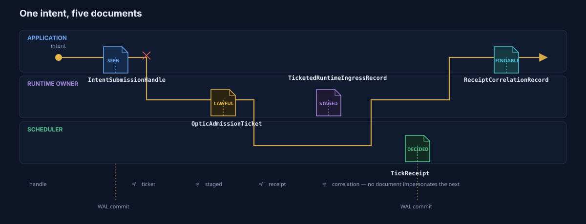
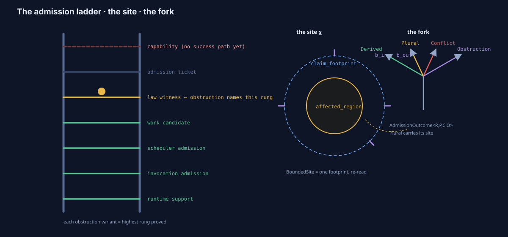
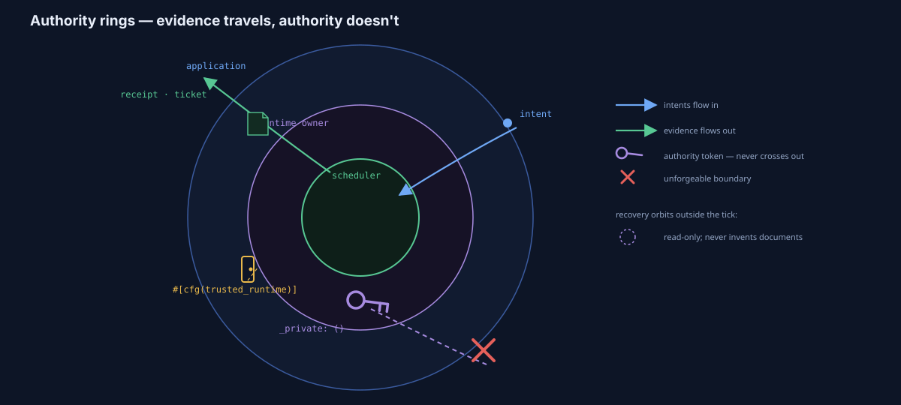

<!-- SPDX-License-Identifier: Apache-2.0 OR LicenseRef-MIND-UCAL-1.0 -->
<!-- © James Ross Ω FLYING•ROBOTS <https://github.com/flyingrobots> -->

# The Authority Model — Who May Do What, and How Echo Knows

> ```text
> Evidence is what you hold. Authority is what you are.
> ```

This is the deep dive into Echo's authority architecture: the chain of
identity documents an intent collects between submission and decided outcome,
the unforgeable tokens that partition who may act, and the admission law that
judges every invocation. It is the vocabulary the other three dives —
[SuperTick](../supertick/README.md), [WAL/WSC](../wal-wsc/README.md), and
[Optics](../optics/README.md) — used constantly and defined nowhere. Insights
land in [the WoahMan ledger](../WOAHMAN.md).

| Layer               | Source                                      | What it is                                             |
| ------------------- | ------------------------------------------- | ------------------------------------------------------ |
| Admission nouns     | `crates/warp-core/src/admission.rs`         | `BoundedSite`, `AdmissionOutcome`, `PluralArtifact`    |
| Identity documents  | `crates/warp-core/src/coordinator.rs`       | Handles, ingress records, receipt correlations         |
| Tickets & artifacts | `crates/warp-core/src/optic_artifact.rs`    | Admission tickets, obstruction ladder, capability gate |
| Contract hosting    | `crates/warp-core/src/contract_registry.rs` | Installed packages, trust postures, generated handlers |

## 1. The problem: one word, three claims

"Accepted" is the most dangerous word in a runtime. It can mean _we saw your
request_, _your request is lawful_, or _your request happened_ — and systems
that use one status field for all three eventually let a submission
impersonate a decision. Paper VII's doctrine is blunt:

```text
submission acceptance ≠ runtime admission
AdmissionTicket ≠ accepted submission evidence
TickReceipt ≠ AdmissionTicket
```

Echo enforces that doctrine with **separate documents issued by separate
authorities**, each of which — remarkably — declares in its own rustdoc what
it is _not_.

## 2. The five identity documents



An intent that goes the distance collects, in order:

1. **`IntentSubmissionHandle`** — the witnessed submission. _"This is not
   execution evidence and not a tick receipt. It is a stable handle for
   polling the scheduler-owned outcome later."_ Content-addressed
   (`ingress_id`), head-resolved, generation-stamped, duplicate-aware — and
   made durable by the WAL ACK path before the app ever sees it.
2. **`OpticAdmissionTicket`** — lawful admission evidence. _"It is not
   execution, not a tick receipt, not a scheduler queue item, and not
   handler dispatch."_ The ticket digests everything that made the
   invocation lawful: the registered artifact hash, the operation, the
   requirements digest, the basis/aperture/budget request digests, and a
   `law_witness_digest` — then commits to all of it in a `ticket_digest`.
   Both ticket types are `#[must_use]`: admission evidence cannot be
   silently dropped.
3. **`TicketedRuntimeIngressRecord`** — _"correlation material only. It is
   not a tick receipt, not handler dispatch, and not execution."_ A runtime
   owner staged the ticketed invocation into a head inbox; the record binds
   `submission_id` to `ticket_digest` to `ticketed_ingress_id`, plus
   installed-contract evidence when the work is generated.
4. **`TickReceipt`** — the scheduler's judgment, the only document that says
   what _happened_ (see [SuperTick §5.3](../supertick/README.md)).
5. **`ReceiptCorrelationRecord`** — _"an observation/correlation index only.
   It does not interpret the receipt into an application outcome and does
   not dispatch handlers."_ It stitches ticketed ingress to receipt digest,
   commit ticks, and commit hash so an application can _find_ its outcome —
   interpretation stays with the observer.

Recovery classifies an intent by which of these documents it can actually
produce from committed history — `not_accepted`, `accepted_pending`,
`decided_*` — and nothing else. The postures in the
[WAL/WSC dive §4.4](../wal-wsc/README.md) are exactly "which documents
survived."

## 3. The admission law — a ladder, a site, an algebra



### 3.1 The bounded site

`BoundedSite` is the admission-side name for Paper VII's optic slice χ, and
its module docs make the design move explicit: it is _"intentionally derived
from existing runtime truth rather than introducing a second geometry
system."_ A site is a footprint, re-read:

```text
claim_footprint          the full declared read/write claim
affected_region          the write wake (n/e/a write sets)
reintegration_boundary   the boundary ports (b_in, b_out)
```

One conflict geometry serves the reserve gate (write side), strand-read
revalidation (read side), and admission law — and the module pins the
single-tick law: all admission still happens under `super_tick()`.

### 3.2 The outcome algebra, as a type

`AdmissionOutcome<R, P, C, O>` is Paper VII's outcome algebra as a generic
enum: `Derived(R) | Plural(PluralArtifact) | Conflict(C) | Obstruction(O)`.
The `Plural` arm deserves the stare: plurality is not failure residue but a
first-class artifact carrying the `BoundedSite` it remained lawful over,
with participants asserted parallel to claims. The same four-way shape
appears in the WAL's tick decisions, the reading residual postures, and
here — one algebra, three planes.

### 3.3 The obstruction ladder

`OpticInvocationObstruction` is not a flat error enum — it is a **proof
ladder**. Each variant's meaning is "Echo proved stage N and could not prove
stage N+1": runtime support → invocation admission → scheduler admission →
scheduler work → law witness → admission ticket, then the capability rungs
(`MissingCapability`, malformed/unbound presentations,
`CapabilityValidationUnavailable`). And refusal is _ticket-shaped_:
`OpticAdmissionTicketPosture` carries the full invocation context — basis,
aperture, budget requests — plus the structured obstruction, so a refusal
can be debugged, witnessed, and replayed like any other artifact.

The capability rungs are red by design. `CapabilityGrantIntentGate`
_"intentionally has no success path"_ in this slice: well-formed grant
intents are recorded and deterministically classified, but they obstruct,
because grant admission and witnessing do not exist yet. The system ships
the honest skeleton of a feature rather than a quietly permissive stub —
the same posture as the read side's single-variant rights type.

## 4. Authority tokens — what you are, not what you hold



The sharpest structure in this dive is one field long:

```text
pub struct TicketedRuntimeIngressAuthority { _private: () }
```

Zero-sized, unconstructible outside the crate, and its only constructor —
`assume_runtime_owner()` — is `#[cfg]`-gated to `test`, `host_test`, and
`trusted_runtime` builds. In an ordinary application build the token is not
just unforgeable; it is _unnameable into existence_. The rustdoc states the
threat model directly: an admission ticket is evidence, but staging ticketed
ingress is a runtime-owner action, and handing the token to
application/plugin/browser code "would let that code choose which witnessed
submissions enter scheduler-visible runtime ingress."

The pattern repeats wherever authority matters:
`SchedulerFaultRecoveryAuthority` gates fault clearing; the WAL plane's
`WalAppendAuthority` is checked per record kind at build _and_ replay
([WAL/WSC §3.2](../wal-wsc/README.md)); and installed contract packages
carry `ContractArtifactTrustPosture` / `VerificationPolicy` evidence so that
generated mutation handlers and query observers bind to the runtime
_"without importing application nouns into core."_

The resulting planes, as enforced rather than as documented:

| Plane         | May do                                                                             |
| ------------- | ---------------------------------------------------------------------------------- |
| Application   | Submit intents; observe outcomes and readings; hold handles and tickets (evidence) |
| Runtime owner | Stage ticketed ingress; install contract packages; control runtime posture         |
| Scheduler     | Judge — `super_tick` is the single admission site; receipts are its only voice     |
| Recovery      | Checkpoints, fault clearing, read-only index rebuild — never invents documents     |

## 5. The invariants, in one place

1. **One word, five documents.** Seen ≠ lawful ≠ staged ≠ decided ≠
   findable; each claim has its own artifact, issuer, and failure story.
2. **Every document declares its negatives.** The rustdoc "is not" lists are
   load-bearing vocabulary control, like the WAL's recorded-not-committed
   grammar.
3. **Evidence is transferable; authority is not.** Tickets and handles are
   data. Staging authority is a zero-sized token whose constructor is
   compiled out of application builds.
4. **The site is derived, never invented.** `BoundedSite` re-reads the
   declared footprint; no second geometry system exists to disagree with
   the first.
5. **One outcome algebra, generic.** Derived / Plural / Conflict /
   Obstruction, with plurality as a first-class artifact over its site.
6. **Refusal is ticket-shaped and rung-named.** Obstructions carry the full
   request context and state exactly how far the proof got.
7. **Unfinished authority is honest authority.** The capability gate
   records and classifies but cannot succeed — by construction, not by
   configuration.
8. **Admission has one address.** All of it happens under `super_tick()`;
   there is no second door.

## 6. Evidence standard

Behavioral claims verified against source at commit `ea6ac5b5` (source code
only; quoted rustdoc is presented as _the code's own words_, not as
evidence for behavior beyond what the types show):

- **Admission nouns** — `admission.rs#L1-L183@ea6ac5b5` read in full:
  `BoundedSite`/`AffectedRegion`/`ReintegrationBoundary` derivation from
  `Footprint` fields (`n_write`/`e_write`/`a_write`, `b_in`/`b_out`),
  `AdmissionOutcome` variants, `PluralArtifact` parallel-list assertion.
- **Identity documents** — `coordinator.rs#L434-L604@ea6ac5b5`:
  `IntentSubmissionDisposition`/`Handle`, `IngressDisposition`,
  `TicketedRuntimeIngressRecord`/`Disposition`, `ReceiptCorrelationRecord`
  fields as documented here.
- **Tickets and ladder** — `optic_artifact.rs#L700-L860@ea6ac5b5`:
  obstruction variants in ladder order, `OpticAdmissionTicketPosture`
  fields, `OpticAdmissionTicket` digests incl. `law_witness_digest`,
  `#[must_use]` attributes, `CapabilityGrantIntentGate::submit_grant_intent`
  with no success path in this slice.
- **Authority token** — `coordinator.rs#L264-L296@ea6ac5b5`: `_private: ()`
  field and the `#[cfg(any(test, feature = "host_test", feature =
"trusted_runtime"))]` gate on `assume_runtime_owner`.
- **Contract hosting** — `contract_registry.rs#L1-L60@ea6ac5b5`: module
  boundary statement, `InstalledContractPackageId` domain,
  `ContractOperationKind`; trust-posture/verification-policy types are
  imported from `echo-registry-api` (their enforcement paths were not
  traced in this dive — **inferred** that verification occurs behind
  `native_rule_bootstrap`'s `verify_contract_artifact` import).
- **"Unnameable into existence"** — inference from the cfg gate: no
  non-gated constructor was found in the ranges read; a crate-internal
  construction site elsewhere would not weaken the application-plane claim
  but was not exhaustively ruled out.

Line numbers drift; the cited commit is the anchor. Re-derive before
relying.

## 7. Source map

| Where                                                                        | What                                                                                  |
| ---------------------------------------------------------------------------- | ------------------------------------------------------------------------------------- |
| `crates/warp-core/src/admission.rs`                                          | Sites, outcomes, plural artifacts                                                     |
| `crates/warp-core/src/coordinator.rs`                                        | Dispositions, handles, ingress records, correlations, authority tokens, fault records |
| `crates/warp-core/src/optic_artifact.rs`                                     | Admission tickets, obstruction ladder, capability grant gate, artifact registration   |
| `crates/warp-core/src/contract_registry.rs`                                  | Installed contract packages, operation kinds, trust postures                          |
| `crates/warp-core/src/trusted_runtime_host.rs`                               | Where these documents meet the WAL ACK discipline                                     |
| `docs/topics/supertick/README.md` · `wal-wsc/README.md` · `optics/README.md` | The three planes this vocabulary governs                                              |

> ```text
> Seen. Lawful. Staged. Decided. Findable.
> Five claims, five documents, no impersonation.
> ```
